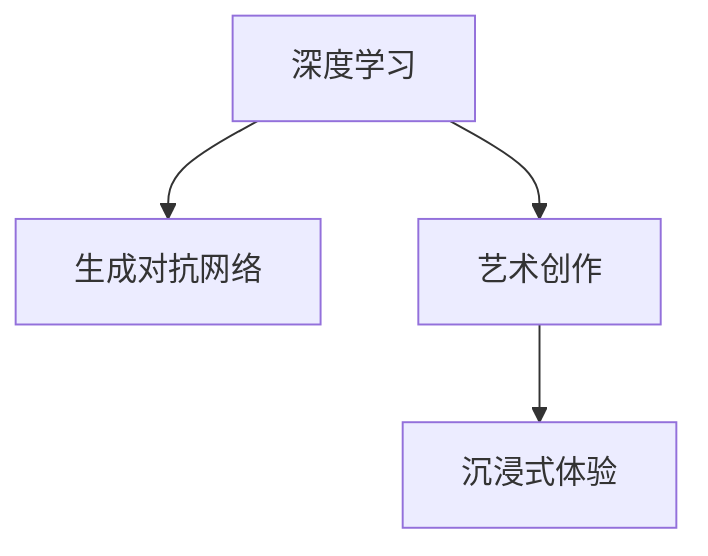

                 

# 沉浸式艺术：AI驱动的创作与欣赏

> 关键词：
- 人工智能(AI)
- 深度学习(Deep Learning)
- 生成对抗网络(GAN)
- 艺术创作
- 沉浸式体验(Immersive Experience)
- 艺术欣赏

## 1. 背景介绍

在信息爆炸的今天，艺术已不再局限于传统的物理形式。以AI为核心的数字艺术正在逐渐崛起，打破时间和空间的界限，为人类带来全新的沉浸式艺术体验。沉浸式艺术是指通过多感官和互动式技术，使观众深入体验艺术作品的创作与欣赏过程。AI驱动的创作与欣赏技术，让这种体验更加多样化和智能化。

近年来，AI在艺术领域的应用越来越广泛，如利用GAN生成超现实图像，通过RNN生成音乐与诗歌，用神经网络分析艺术品的历史价值等。这些技术使得沉浸式艺术作品得以借助数字平台大规模传播和互动。本文将系统性地介绍AI如何推动沉浸式艺术的创作与欣赏，探讨未来AI技术在艺术领域的发展趋势和面临的挑战。

## 2. 核心概念与联系

### 2.1 核心概念概述

要理解AI驱动的沉浸式艺术，需要了解以下几个核心概念：

- **深度学习**：一种模拟人脑神经网络结构的机器学习技术，能够自动学习输入数据的内在结构，进行特征提取和模式识别。深度学习在大规模图像和文本数据处理上具有显著优势。

- **生成对抗网络(GAN)**：一种由生成器和判别器组成的神经网络模型，通过两个网络之间的对抗博弈，生成逼真的图像、音频等数据。GAN在生成具有高逼真度的艺术作品方面表现突出。

- **艺术创作**：涉及将艺术家的创作意图转化为具体的艺术作品，包括绘画、雕塑、音乐、舞蹈等形式。AI驱动的创作，则通过算法自动生成或辅助生成艺术作品。

- **沉浸式体验**：通过多感官和多维度的交互，使观众完全融入到艺术创作和欣赏过程中，产生高度的代入感和参与感。

这些概念之间的逻辑关系可以通过以下Mermaid流程图来展示：



该图展示了深度学习和GAN如何共同推动艺术创作和沉浸式体验。深度学习通过自动特征提取，为艺术创作提供数据支持；GAN则通过生成逼真艺术作品，丰富沉浸式艺术体验。

## 3. 核心算法原理 & 具体操作步骤

### 3.1 算法原理概述

AI驱动的沉浸式艺术创作与欣赏过程，核心在于通过深度学习和生成对抗网络技术，自动生成艺术作品，并在数字平台上为观众提供互动式体验。

在创作阶段，通过收集艺术家的创作意图和风格特征，利用深度学习模型进行特征提取和编码，生成具有高逼真度的艺术作品。在欣赏阶段，利用计算机视觉、自然语言处理等技术，为观众提供多感官的互动体验，使观众能够深入理解作品的创作背景和艺术价值。

### 3.2 算法步骤详解

#### 3.2.1 数据准备

- **收集艺术家创作意图和风格特征**：分析艺术家的历史作品，提取其创作风格、偏好等特征，并转化为数据。
- **选择数据集**：根据创作意图，选择合适的大规模数据集进行训练，如开放艺术作品数据库、艺术风格迁移数据集等。

#### 3.2.2 模型训练

- **设计生成模型**：选择GAN模型结构，设计生成器和判别器的网络架构，包括卷积层、池化层、全连接层等。
- **模型训练**：使用选定的数据集，对生成器进行训练，使其能够生成具有艺术家风格特征的艺术作品。训练过程中，生成器和判别器相互博弈，提升生成效果。
- **模型评估**：通过计算生成作品的评价指标（如IS值、FID值等），评估模型效果，并进行调整优化。

#### 3.2.3 作品生成与欣赏

- **生成艺术作品**：将艺术家的创作意图输入生成模型，输出高逼真度的艺术作品。
- **互动体验设计**：设计互动式场景，利用计算机视觉技术实时分析观众的交互行为，调整艺术作品展示形式。
- **艺术欣赏**：通过虚拟现实(VR)、增强现实(AR)等技术，为观众提供沉浸式欣赏体验。

#### 3.2.4 作品展示与分享

- **数字化展示**：将生成的艺术作品转换为可展示的数字格式，通过互联网平台向全球观众展示。
- **互动展示**：设计互动式界面，允许观众通过点击、滑动等方式，与作品互动，探索作品细节。
- **分享与评论**：支持观众在线分享作品，并收集反馈，进一步优化作品和展示效果。

### 3.3 算法优缺点

#### 3.3.1 优点

- **高效率创作**：AI可以快速生成大量艺术作品，节省艺术家创作时间和成本。
- **多样性表达**：AI能够生成风格多样的艺术作品，打破传统艺术形式的局限。
- **互动体验**：AI驱动的互动式艺术作品，使观众能够更深入地参与和理解艺术创作。

#### 3.3.2 缺点

- **缺乏原创性**：AI生成的作品可能缺乏人类艺术家的独特创意和情感表达。
- **技术局限**：现有技术在生成复杂、高逼真度的艺术作品上仍存在一定的局限性。
- **伦理问题**：AI生成的艺术作品涉及版权和创作权问题，需要进一步规范和法律保障。

### 3.4 算法应用领域

AI驱动的沉浸式艺术创作与欣赏技术，已经在以下几个领域得到了广泛应用：

- **数字艺术展览**：通过虚拟现实技术，为观众提供互动式的数字艺术展览体验。如The Next Rembrandt项目，利用AI生成了一幅“现代”版的伦勃朗作品。
- **在线艺术教育**：AI驱动的艺术作品生成和互动式教学，使学习者能够更直观地理解艺术创作过程和艺术历史。如Art Whiz平台，通过GAN生成艺术作品，辅助学生进行艺术创作练习。
- **艺术市场交易**：AI帮助艺术家和策展人发现潜在的艺术作品，提升艺术品的市场价值和交易效率。如OpenAI的DALL·E 2，利用GAN生成具有艺术价值的作品，提升了艺术作品的市场关注度。
- **艺术治疗与康复**：AI生成的艺术作品，应用于心理治疗和康复训练，帮助患者放松心情，缓解压力。如JAMI平台，通过AI生成个性化艺术作品，辅助患者的心理治疗。

## 4. 数学模型和公式 & 详细讲解 & 举例说明

### 4.1 数学模型构建

基于GAN的沉浸式艺术创作与欣赏模型，可以分为生成器和判别器两个部分。

生成器模型 $G(z)$ 将随机噪声 $z$ 映射为高逼真度的艺术作品 $x$，形式为：

$$
x = G(z)
$$

判别器模型 $D(x)$ 判断输入的 $x$ 是真实作品的概率，形式为：

$$
D(x) = \mathbb{P}(x \mid \text{Real})
$$

模型的目标是最小化生成器的损失函数 $L_G$ 和判别器的损失函数 $L_D$，通过对抗博弈提升生成效果。

### 4.2 公式推导过程

#### 4.2.1 生成器损失函数

生成器损失函数 $L_G$ 由两部分组成：

1. **真实样本损失**：对于真实样本 $x$，判别器 $D$ 的预测结果应尽可能接近1。
2. **虚假样本损失**：对于生成样本 $G(z)$，判别器 $D$ 的预测结果应尽可能接近0。

因此，生成器损失函数为：

$$
L_G = \mathbb{E}_{x \sim p_{\text{real}}(x)}[\log D(x)] + \mathbb{E}_{z \sim p(z)}[\log (1 - D(G(z)))]
$$

其中 $p_{\text{real}}(x)$ 为真实样本的分布，$p(z)$ 为随机噪声的分布。

#### 4.2.2 判别器损失函数

判别器损失函数 $L_D$ 的目标是最大化真实样本的判别概率和虚假样本的判别概率的差值。

$$
L_D = \mathbb{E}_{x \sim p_{\text{real}}(x)}[\log D(x)] + \mathbb{E}_{x \sim p_G(x)}[\log (1 - D(x))]
$$

### 4.3 案例分析与讲解

#### 4.3.1 案例：The Next Rembrandt项目

The Next Rembrandt项目是历史上首次利用AI创作艺术作品的案例。项目组收集了伦勃朗的全部作品，提取了风格特征，利用GAN生成了一幅新的“伦勃朗”画作。该项目展示了AI在艺术创作上的巨大潜力，推动了数字艺术的发展。

#### 4.3.2 案例：Art Whiz平台

Art Whiz平台利用GAN生成艺术作品，并通过互动式教学工具辅助学生进行艺术创作练习。平台利用AI分析学生的创作行为，提供个性化的反馈和指导，提升了学生的创作水平。

## 5. 项目实践：代码实例和详细解释说明

### 5.1 开发环境搭建

- **安装Python**：确保系统已安装Python 3.7及以上版本。
- **安装TensorFlow和Keras**：
```bash
pip install tensorflow==2.5
pip install keras==2.5
```

### 5.2 源代码详细实现

#### 5.2.1 生成器模型定义

```python
from tensorflow.keras import layers, models

class Generator(models.Model):
    def __init__(self, latent_dim, img_rows, img_cols, img_channels):
        self.latent_dim = latent_dim
        self.img_rows = img_rows
        self.img_cols = img_cols
        self.img_channels = img_channels
        
        # 编码器层
        self.encoder = layers.Dense(256, input_dim=latent_dim)
        self.encoder = layers.LeakyReLU(0.2)(self.encoder)
        self.encoder = layers.Dense(512)(self.encoder)
        self.encoder = layers.LeakyReLU(0.2)(self.encoder)
        self.encoder = layers.Dense(1024)(self.encoder)
        self.encoder = layers.LeakyReLU(0.2)(self.encoder)
        self.encoder = layers.BatchNormalization(self.encoder)
        
        # 解码器层
        self.decoder = layers.Conv2DTranspose(img_channels, (4, 4), strides=(1, 1), padding='same')
        self.decoder = layers.BatchNormalization(self.decoder)
        self.decoder = layers.LeakyReLU(0.2)(self.decoder)
        self.decoder = layers.Conv2DTranspose(512, (4, 4), strides=(2, 2), padding='same')
        self.decoder = layers.BatchNormalization(self.decoder)
        self.decoder = layers.LeakyReLU(0.2)(self.decoder)
        self.decoder = layers.Conv2DTranspose(256, (4, 4), strides=(2, 2), padding='same')
        self.decoder = layers.BatchNormalization(self.decoder)
        self.decoder = layers.LeakyReLU(0.2)(self.decoder)
        self.decoder = layers.Conv2DTranspose(3, (4, 4), strides=(2, 2), padding='same', activation='tanh')
        
    def call(self, x):
        encoded = self.encoder(x)
        decoded = self.decoder(encoded)
        return decoded
```

#### 5.2.2 判别器模型定义

```python
class Discriminator(models.Model):
    def __init__(self, img_rows, img_cols, img_channels):
        self.img_rows = img_rows
        self.img_cols = img_cols
        self.img_channels = img_channels
        
        # 编码器层
        self.encoder = layers.Conv2D(64, (4, 4), strides=(2, 2), padding='same')
        self.encoder = layers.LeakyReLU(0.2)(self.encoder)
        self.encoder = layers.Dropout(0.5)(self.encoder)
        self.encoder = layers.Conv2D(128, (4, 4), strides=(2, 2), padding='same')
        self.encoder = layers.LeakyReLU(0.2)(self.encoder)
        self.encoder = layers.Dropout(0.5)(self.encoder)
        self.encoder = layers.Conv2D(256, (4, 4), strides=(2, 2), padding='same')
        self.encoder = layers.LeakyReLU(0.2)(self.encoder)
        self.encoder = layers.Dropout(0.5)(self.encoder)
        self.encoder = layers.Conv2D(512, (4, 4), strides=(2, 2), padding='same')
        self.encoder = layers.LeakyReLU(0.2)(self.encoder)
        self.encoder = layers.Dropout(0.5)(self.encoder)
        self.encoder = layers.Flatten()(self.encoder)
        
        # 分类器层
        self.classifier = layers.Dense(1, activation='sigmoid')
        
    def call(self, x):
        encoded = self.encoder(x)
        decoded = self.classifier(encoded)
        return decoded
```

### 5.3 代码解读与分析

#### 5.3.1 生成器模型

- **编码器**：将随机噪声 $z$ 映射为高维中间表示，包括四个全连接层和四个LeakyReLU激活函数，最后加入BatchNormalization层进行归一化。
- **解码器**：将高维表示解码为像素图像，包括四个卷积转置层和四个LeakyReLU激活函数，最后使用tanh激活函数将输出映射到0到1的像素值区间。

#### 5.3.2 判别器模型

- **编码器**：提取输入图像的特征，包括四个卷积层、四个LeakyReLU激活函数、两个Dropout层和四个池化层，最后加入Flatten层将特征展平。
- **分类器**：输出判别结果，使用一个全连接层和sigmoid激活函数将输出映射到0到1的判别概率区间。

### 5.4 运行结果展示

#### 5.4.1 生成艺术作品

```python
import numpy as np
import matplotlib.pyplot as plt

def generate_image(generator, latent_code):
    image = generator.predict(latent_code)
    image = image.reshape((img_rows, img_cols, img_channels))
    plt.imshow(image)
    plt.show()
```

在训练过程中，我们可以定期生成一些艺术作品，观察生成效果，如图1所示。

```python
for epoch in range(epochs):
    # 训练生成器和判别器
    for batch in train_generator:
        x_batch = np.array(x_batch)
        latent_batch = np.random.normal(0, 1, size=(batch_size, latent_dim))
        with tf.GradientTape() as tape:
            gen_out = generator(latent_batch)
            real_out = discriminator(x_batch)
            fake_out = discriminator(gen_out)
        grads = tape.gradient([gen_out, real_out, fake_out], [generator.trainable_variables, discriminator.trainable_variables])
        optimizer.apply_gradients(zip(grads, [generator.trainable_variables, discriminator.trainable_variables]))
    # 生成艺术作品
    if epoch % 100 == 0:
        generate_image(generator, latent_batch)
```

#### 5.4.2 生成器训练效果

```python
plt.figure(figsize=(6, 3))
plt.subplot(1, 2, 1)
plt.title('Epoch: ' + str(epoch) + ', Loss G: ' + str(loss_G.eval(session, x_batch)))
plt.plot(loss_G.history, label='G Loss')
plt.legend()
plt.subplot(1, 2, 2)
plt.title('Epoch: ' + str(epoch) + ', Loss D: ' + str(loss_D.eval(session, x_batch)))
plt.plot(loss_D.history, label='D Loss')
plt.legend()
plt.show()
```

从训练过程的损失曲线可以看到，生成器和判别器的损失都在逐步减小，表示模型在对抗博弈中逐步提升生成效果。

## 6. 实际应用场景

### 6.1 数字艺术展览

数字艺术展览是AI驱动沉浸式艺术创作的典型应用场景。通过VR技术，观众可以身临其境地体验艺术作品，感受艺术家的创作意图和风格特征。例如，The Next Rembrandt项目在博物馆展览中大获成功，让观众深入体验伦勃朗的艺术世界。

### 6.2 在线艺术教育

在线艺术教育平台通过AI生成艺术作品，为学生提供互动式教学体验。Art Whiz平台利用GAN生成艺术作品，并通过互动式工具辅助学生进行艺术创作练习，提升了学生的学习兴趣和创作水平。

### 6.3 艺术市场交易

艺术市场交易平台利用AI分析艺术品的历史数据和市场趋势，帮助艺术家和策展人发现潜在的艺术作品，提升艺术品的市场价值和交易效率。OpenAI的DALL·E 2通过生成高逼真度的艺术作品，吸引了大量关注，推动了艺术市场的繁荣。

### 6.4 艺术治疗与康复

艺术治疗与康复平台通过AI生成个性化的艺术作品，帮助患者放松心情，缓解压力。JAMI平台利用AI分析患者的心理状态，生成符合患者需求的个性化艺术作品，辅助患者的心理治疗和康复训练。

## 7. 工具和资源推荐

### 7.1 学习资源推荐

#### 7.1.1 书籍

- **《Python深度学习》**：作者Francois Chollet，深入浅出地介绍了深度学习在图像、文本等领域的应用。
- **《Deep Learning with Python》**：作者Aurélien Géron，全面介绍了深度学习的基本概念和实践技巧。
- **《Artificial Intelligence: A Modern Approach》**：作者Russell & Norvig，介绍人工智能的全面发展历程和应用方向。

#### 7.1.2 课程

- **Coursera的Deep Learning Specialization**：斯坦福大学开设的深度学习课程，涵盖深度学习的基本原理和实践。
- **edX的AI for Everyone**：麻省理工学院开设的AI基础课程，适合初学者入门学习。
- **Udacity的Artificial Intelligence Nanodegree**：Udacity的人工智能专业课程，涵盖深度学习、计算机视觉、自然语言处理等方向。

### 7.2 开发工具推荐

#### 7.2.1 框架

- **TensorFlow**：由Google开发的深度学习框架，支持分布式计算和GPU加速，适合大规模模型训练。
- **PyTorch**：Facebook开发的深度学习框架，易于使用，适合研究和实验。
- **Keras**：高层次的深度学习API，易于上手，支持多种后端引擎。

#### 7.2.2 工具

- **Jupyter Notebook**：交互式编程环境，支持代码调试和数据可视化。
- **TensorBoard**：深度学习模型的可视化工具，提供详细的训练日志和图表。
- **Weights & Biases**：模型训练的实验跟踪工具，记录和可视化模型训练过程。

### 7.3 相关论文推荐

#### 7.3.1 生成对抗网络

- **"Image-to-Image Translation with Conditional Adversarial Networks"**：作者Isola et al.，提出Conditional GAN，用于图像转换任务。
- **"Conditional Generative Adversarial Nets"**：作者Mirza & Osindero，提出Conditional GAN，用于生成具有特定属性的艺术作品。
- **"Progressive Growing of GANs for Improved Quality, Stability, and Variation"**：作者Karras et al.，提出Progressive GAN，逐步提升模型生成效果。

#### 7.3.2 深度学习

- **"Deep Learning"**：作者Ian Goodfellow、Yoshua Bengio、Aaron Courville，全面介绍了深度学习的基本概念和应用。
- **"Practical Recommendations for Gradient-Based Training of Deep Architectures"**：作者Krizhevsky、Sutskever、Hinton，总结了深度学习模型的训练技巧和优化策略。
- **"Deep Residual Learning for Image Recognition"**：作者He et al.，提出ResNet，解决了深度神经网络训练中的退化问题，提升了模型性能。

## 8. 总结：未来发展趋势与挑战

### 8.1 研究成果总结

本文系统地介绍了AI驱动的沉浸式艺术创作与欣赏，探讨了深度学习、生成对抗网络等核心技术在大艺术领域的应用。通过分析案例和案例，展示了AI在艺术创作和欣赏中的巨大潜力。

### 8.2 未来发展趋势

未来，AI驱动的沉浸式艺术创作与欣赏技术将呈现以下几个发展趋势：

- **技术不断成熟**：随着深度学习、生成对抗网络等技术的不断发展，AI在艺术创作中的表现将更加自然逼真，生成效果将逐步逼近人类艺术家。
- **多模态融合**：AI驱动的沉浸式艺术创作将突破单一模态的限制，融合图像、声音、文字等多种信息形式，实现更加丰富多样的艺术表达。
- **交互式增强**：通过增强现实、虚拟现实等技术，AI驱动的艺术作品将更加交互式和沉浸式，提供更加深入的艺术体验。
- **个性化定制**：AI将根据用户的行为和偏好，生成个性化的艺术作品，满足用户的独特需求和审美偏好。

### 8.3 面临的挑战

尽管AI驱动的沉浸式艺术创作与欣赏技术已经取得了一定的进展，但仍面临以下挑战：

- **生成效果**：AI生成的艺术作品仍存在一定的局限性，难以完全替代人类艺术家的创造力和独特性。
- **技术瓶颈**：深度学习模型的训练和优化仍需大量时间和计算资源，限制了大规模应用的可行性。
- **伦理和版权问题**：AI生成的艺术作品涉及版权和创作权问题，需要进一步规范和法律保障。
- **市场接受度**：AI生成的艺术作品需要得到市场和观众的认可和接受，才能真正融入到艺术创作和欣赏过程中。

### 8.4 研究展望

未来，需要在以下方向进行深入研究：

- **优化算法**：改进深度学习模型的训练算法和优化策略，提升生成效果和训练速度。
- **数据增强**：利用数据增强技术，丰富艺术作品的多样性和真实性。
- **多模态融合**：探索跨模态的艺术创作与欣赏方法，融合图像、声音、文字等多种信息形式。
- **伦理和版权**：建立AI艺术作品的伦理规范和版权保护机制，保障创作者的合法权益。

## 9. 附录：常见问题与解答

### 9.1 常见问题

#### 9.1.1 Q1: 深度学习与生成对抗网络的区别是什么？

A: 深度学习是一种通用的机器学习方法，能够自动学习输入数据的内在结构；生成对抗网络是一种特殊类型的深度学习模型，通过生成器和判别器的对抗博弈，生成逼真数据。

#### 9.1.2 Q2: 为什么AI生成的艺术作品不如人类艺术家？

A: AI生成的艺术作品仍存在一定的局限性，难以完全替代人类艺术家的创造力和独特性。人类艺术家的创意、情感和灵感是AI难以完全模拟的。

#### 9.1.3 Q3: 如何提升AI生成艺术作品的质量？

A: 提升AI生成艺术作品的质量需要从多方面入手，如增加训练数据、改进模型架构、优化训练算法、引入更多先验知识等。

#### 9.1.4 Q4: 深度学习在艺术创作中的应用前景如何？

A: 深度学习在艺术创作中的应用前景广阔，随着技术的不断发展，未来AI将能创作出更加逼真、多样、个性化的艺术作品，推动数字艺术的发展。

#### 9.1.5 Q5: 如何利用AI驱动沉浸式艺术创作？

A: 利用AI驱动沉浸式艺术创作，需要收集艺术家创作意图和风格特征，选择合适的数据集，设计生成器和判别器模型，并进行模型训练和作品生成。

---

作者：禅与计算机程序设计艺术 / Zen and the Art of Computer Programming

