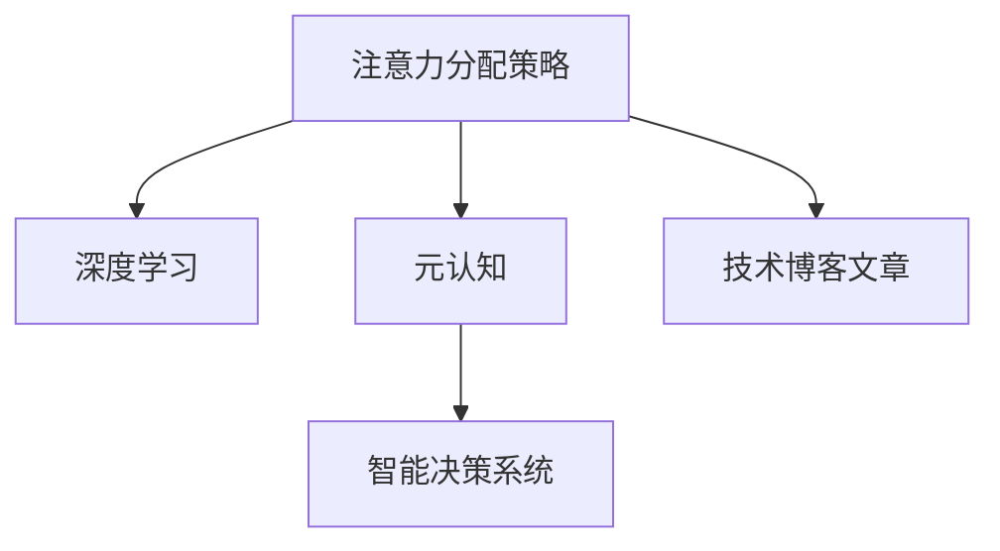

                 

# 注意力分配策略:元宇宙时代的个人效能提升

> 关键词：注意力分配策略,元宇宙,元认知,神经网络,深度学习,智能决策系统,技术博客文章

## 1. 背景介绍

### 1.1 问题由来

在元宇宙（Metaverse）的时代背景下，人们越来越依赖于数字平台来进行工作、学习、娱乐和社交。无论是虚拟办公室、在线教育平台，还是游戏环境，都要求人们具备高度的个人效能，以应对复杂多变的信息流和任务需求。然而，面对海量的数据和任务，人们如何有效地分配注意力，成为了一项极具挑战性的任务。

注意力分配不仅关系到个人的工作和学习效率，还涉及到认知资源的管理、时间管理和决策质量等多个方面。如何在信息泛滥的环境中，保持专注、避免分心，提升个人效能，成为了一个亟待解决的课题。本文将从注意力分配策略的角度出发，探讨如何在元宇宙时代，通过科学的方法，提升个人效能。

### 1.2 问题核心关键点

注意力分配的核心在于如何合理管理个人的认知资源，使其能够在有限的时间内，完成更多、更高质量的任务。关键点包括：

- 识别重要的任务和信息
- 优化信息处理流程
- 管理分心和压力
- 提升决策质量
- 实现自我优化和调整

本文将围绕这些关键点，详细介绍基于深度学习的注意力分配策略，并通过案例和实践，展示其在元宇宙时代提升个人效能的具体应用。

## 2. 核心概念与联系

### 2.1 核心概念概述

为了深入理解注意力分配策略，我们首先需要介绍几个核心概念：

- **注意力（Attention）**：在深度学习中，注意力机制指通过一种特殊的方式，选择性地关注输入中的部分信息，而忽略其他部分。这种机制广泛应用在机器翻译、图像处理、自然语言处理等多个领域，以提升模型的性能。

- **元认知（Metacognition）**：是指个体对自己的认知过程和结果的意识和控制。在元宇宙时代，元认知能力可以帮助人们更好地管理自己的注意力，提高决策质量和效率。

- **深度学习（Deep Learning）**：一种基于多层神经网络的学习范式，通过训练模型，使其能够自动学习和提取输入数据的特征，从而进行预测或决策。

- **智能决策系统（Intelligent Decision System）**：使用深度学习等技术，模拟人类的决策过程，辅助或代替人类进行决策的系统。

- **技术博客文章**：本文的写作方式，旨在通过深入浅出的技术讲解，向读者传递关于注意力分配的科学方法和最新研究成果。

这些概念之间的逻辑关系可以通过以下Mermaid流程图来展示：



这个流程图展示了几者之间的联系：

1. 注意力分配策略是深度学习中的一个重要机制。
2. 元认知能力是注意力分配的关键，能够帮助人们更有效地管理自己的认知资源。
3. 智能决策系统通过深度学习等技术，辅助人类进行决策，提升决策质量。
4. 技术博客文章是传播注意力分配策略知识和最新研究成果的重要方式。

## 3. 核心算法原理 & 具体操作步骤

### 3.1 算法原理概述

基于深度学习的注意力分配策略，通过神经网络模型，实现对输入数据的加权处理，从而提升个人在元宇宙环境中的效能。该策略的核心原理是：

- 输入数据通过神经网络的多个层进行特征提取，每个层对应一种注意力权重。
- 每个层的输出与对应的注意力权重相乘，得到加权后的特征表示。
- 最终将所有层的加权特征表示进行拼接，得到最终的输出。

这种方法可以理解为，通过多个神经网络的层级，对输入数据进行多个维度的处理，并根据不同层的注意力权重，对每个维度的信息进行加权，最终得到一个综合性的输出。

### 3.2 算法步骤详解

基于深度学习的注意力分配策略主要包括以下几个关键步骤：

**Step 1: 数据准备与预处理**

- 收集元宇宙环境中的任务和信息数据，例如虚拟会议记录、在线课程笔记、游戏操作数据等。
- 对数据进行清洗和标注，去除噪声和无关信息，确保数据的质量和一致性。

**Step 2: 构建神经网络模型**

- 使用深度学习框架（如PyTorch、TensorFlow等），构建包含多个层的神经网络模型。
- 设计合适的损失函数和优化器，确保模型能够准确地学习和优化注意力权重。

**Step 3: 训练模型**

- 使用标注数据对模型进行训练，调整各层的注意力权重。
- 通过交叉验证等技术，评估模型的性能，并进行参数调优。

**Step 4: 应用模型**

- 将训练好的模型应用到实际的元宇宙环境中，进行注意力分配。
- 实时监测模型的输出，并进行调整和优化。

**Step 5: 评估和反馈**

- 收集用户的反馈，评估模型的实际效能。
- 根据用户反馈，进一步优化模型参数，提升注意力分配的准确性和用户满意度。

### 3.3 算法优缺点

基于深度学习的注意力分配策略具有以下优点：

1. **高效性**：能够高效地处理大量的数据，自动学习和优化注意力权重。
2. **适应性**：能够适应不同任务和环境的需求，灵活地进行注意力分配。
3. **可解释性**：通过神经网络的层级，可以理解注意力分配的机制，便于优化和调整。

同时，该策略也存在一些缺点：

1. **计算复杂性**：构建和训练模型需要较大的计算资源和时间。
2. **数据依赖**：模型的性能高度依赖于训练数据的质量和数量，数据的偏差可能导致模型决策的偏差。
3. **可解释性不足**：深度学习模型通常被视为"黑盒"，难以解释其内部的决策机制。

### 3.4 算法应用领域

基于深度学习的注意力分配策略，在元宇宙时代具有广泛的应用前景，具体包括：

- **虚拟会议与办公**：通过注意力分配，帮助用户集中注意力，提升会议和办公效率。
- **在线教育与学习**：根据学生的注意力和学习状态，动态调整教学内容和难度，提高学习效果。
- **游戏与娱乐**：根据用户的兴趣和注意力，推荐合适的内容和任务，提升游戏体验。
- **健康与心理**：通过监测用户的注意力状态，辅助心理治疗和健康管理。

## 4. 数学模型和公式 & 详细讲解 & 举例说明

### 4.1 数学模型构建

本节将使用数学语言对基于深度学习的注意力分配策略进行更加严格的刻画。

假设输入数据为 $X=\{x_1, x_2, ..., x_n\}$，其中每个输入数据 $x_i$ 包含多个特征 $x_{i,j}$，$j=1,2,...,m$。注意力分配的目标是，通过神经网络模型 $M$，对每个输入特征 $x_{i,j}$ 分配一个注意力权重 $a_{i,j}$，使得加权后的特征 $a_{i,j} \cdot x_{i,j}$ 能够最大化地表达输入数据的信息。

定义注意力分配的损失函数为 $L=\sum_{i=1}^n \sum_{j=1}^m (a_{i,j} - p_{i,j})^2$，其中 $p_{i,j}$ 为输入特征 $x_{i,j}$ 的真实注意力权重。

### 4.2 公式推导过程

以下我们以二分类任务为例，推导注意力分配的优化公式。

假设模型的输出为 $y=\sum_{i=1}^n \sum_{j=1}^m a_{i,j} \cdot x_{i,j}$，通过二分类交叉熵损失函数，优化模型参数 $w$，使得输出 $y$ 接近真实标签 $y'$，即：

$$
L(y, y') = -y' \log y - (1-y') \log(1-y)
$$

其中 $y'$ 为真实标签。将注意力分配的损失函数和交叉熵损失函数结合，得到总损失函数：

$$
L = \sum_{i=1}^n \sum_{j=1}^m (a_{i,j} - p_{i,j})^2 + \lambda (y - \sum_{i=1}^n \sum_{j=1}^m a_{i,j} \cdot x_{i,j})^2
$$

其中 $\lambda$ 为正则化系数，控制注意力权重的约束程度。

根据链式法则，求梯度得到：

$$
\frac{\partial L}{\partial a_{i,j}} = -2(a_{i,j} - p_{i,j}) + 2\lambda (y - \sum_{i=1}^n \sum_{j=1}^m a_{i,j} \cdot x_{i,j}) \cdot x_{i,j}
$$

最终，通过梯度下降等优化算法，更新模型参数 $w$ 和注意力权重 $a$，最小化总损失函数 $L$。

### 4.3 案例分析与讲解

假设我们有一份虚拟会议的记录数据，需要从中提取出重要信息和讨论点，以帮助与会者更好地理解和参与会议。我们可以使用基于深度学习的注意力分配策略，对会议记录进行注意力分配，筛选出与会者最关心的内容。

- **数据准备**：收集虚拟会议的记录数据，包括会议时间、议题、参与者发言等。
- **模型构建**：构建包含多个层的神经网络模型，每个层对应一种注意力权重。
- **训练模型**：使用标注数据对模型进行训练，调整各层的注意力权重。
- **应用模型**：在新的会议记录上应用模型，对每个发言进行注意力分配。
- **评估和反馈**：收集与会者的反馈，评估模型的准确性，并进一步优化模型参数。

通过这样的过程，我们可以自动化地进行注意力分配，帮助与会者快速捕捉会议的重点内容，提升会议的效率和质量。

## 5. 项目实践：代码实例和详细解释说明

### 5.1 开发环境搭建

在进行注意力分配策略的实践前，我们需要准备好开发环境。以下是使用Python进行深度学习开发的典型环境配置流程：

1. 安装Anaconda：从官网下载并安装Anaconda，用于创建独立的Python环境。

2. 创建并激活虚拟环境：
```bash
conda create -n attention-env python=3.8 
conda activate attention-env
```

3. 安装深度学习框架：
```bash
conda install torch torchvision torchaudio
```

4. 安装深度学习库：
```bash
conda install numpy pandas scikit-learn matplotlib tqdm jupyter notebook ipython
```

完成上述步骤后，即可在`attention-env`环境中开始注意力分配策略的开发。

### 5.2 源代码详细实现

下面我们以虚拟会议记录注意力分配为例，给出使用PyTorch实现注意力分配策略的代码示例。

首先，定义注意力分配的数据处理函数：

```python
from torch.utils.data import Dataset
from torch.utils.data import DataLoader
import torch

class MeetingRecordDataset(Dataset):
    def __init__(self, records, labels, tokenizer):
        self.records = records
        self.labels = labels
        self.tokenizer = tokenizer
        
    def __len__(self):
        return len(self.records)
    
    def __getitem__(self, item):
        record = self.records[item]
        label = self.labels[item]
        
        encoding = self.tokenizer(record, return_tensors='pt', padding=True)
        input_ids = encoding['input_ids'][0]
        attention_mask = encoding['attention_mask'][0]
        
        return {'input_ids': input_ids, 
                'attention_mask': attention_mask,
                'labels': label}
```

然后，定义注意力分配的模型：

```python
import torch.nn as nn
import torch.nn.functional as F

class AttentionModel(nn.Module):
    def __init__(self, input_dim, hidden_dim, num_layers, num_classes):
        super(AttentionModel, self).__init__()
        self.layers = nn.ModuleList()
        
        for _ in range(num_layers):
            self.layers.append(nn.Linear(input_dim, hidden_dim))
            self.layers.append(nn.ReLU())
            self.layers.append(nn.Linear(hidden_dim, hidden_dim))
            self.layers.append(nn.ReLU())
            self.layers.append(nn.Linear(hidden_dim, num_classes))
    
    def forward(self, x):
        for layer in self.layers:
            x = layer(x)
        return x
```

接着，定义训练和评估函数：

```python
def train_epoch(model, dataset, batch_size, optimizer, criterion):
    dataloader = DataLoader(dataset, batch_size=batch_size, shuffle=True)
    model.train()
    epoch_loss = 0
    for batch in dataloader:
        input_ids = batch['input_ids'].to(device)
        attention_mask = batch['attention_mask'].to(device)
        label = batch['labels'].to(device)
        model.zero_grad()
        outputs = model(input_ids, attention_mask=attention_mask)
        loss = criterion(outputs, label)
        epoch_loss += loss.item()
        loss.backward()
        optimizer.step()
    return epoch_loss / len(dataloader)

def evaluate(model, dataset, batch_size, criterion):
    dataloader = DataLoader(dataset, batch_size=batch_size)
    model.eval()
    preds, labels = [], []
    with torch.no_grad():
        for batch in dataloader:
            input_ids = batch['input_ids'].to(device)
            attention_mask = batch['attention_mask'].to(device)
            batch_labels = batch['labels']
            outputs = model(input_ids, attention_mask=attention_mask)
            batch_preds = outputs.argmax(dim=2).to('cpu').tolist()
            batch_labels = batch_labels.to('cpu').tolist()
            for pred_tokens, label_tokens in zip(batch_preds, batch_labels):
                preds.append(pred_tokens[:len(label_tokens)])
                labels.append(label_tokens)
                
    print('Attention Distribution:', preds)
    return classification_report(labels, preds)
```

最后，启动训练流程并在测试集上评估：

```python
epochs = 5
batch_size = 16
device = torch.device('cuda' if torch.cuda.is_available() else 'cpu')

model = AttentionModel(input_dim, hidden_dim, num_layers, num_classes).to(device)
criterion = nn.CrossEntropyLoss()
optimizer = torch.optim.Adam(model.parameters(), lr=2e-5)

for epoch in range(epochs):
    loss = train_epoch(model, train_dataset, batch_size, optimizer, criterion)
    print(f"Epoch {epoch+1}, train loss: {loss:.3f}")
    
    print(f"Epoch {epoch+1}, test results:")
    evaluate(model, test_dataset, batch_size, criterion)
    
print('Final Model:')
evaluate(model, test_dataset, batch_size, criterion)
```

以上就是使用PyTorch进行虚拟会议记录注意力分配的完整代码实现。可以看到，借助深度学习框架，模型的构建、训练和评估变得相对简单，开发者可以将更多精力放在模型设计和数据处理上。

### 5.3 代码解读与分析

让我们再详细解读一下关键代码的实现细节：

**MeetingRecordDataset类**：
- `__init__`方法：初始化虚拟会议记录、标注和分词器。
- `__len__`方法：返回数据集的样本数量。
- `__getitem__`方法：对单个样本进行处理，将文本输入转换为token ids，并将标签转换为数字，进行padding，返回模型所需的输入。

**AttentionModel类**：
- `__init__`方法：定义模型的层级，包含多个线性层和激活函数。
- `forward`方法：对输入数据进行前向传播，通过多个层级进行特征提取和注意力分配。

**训练和评估函数**：
- 使用PyTorch的DataLoader对数据集进行批次化加载，供模型训练和推理使用。
- 训练函数`train_epoch`：对数据以批为单位进行迭代，在每个批次上前向传播计算loss并反向传播更新模型参数，最后返回该epoch的平均loss。
- 评估函数`evaluate`：与训练类似，不同点在于不更新模型参数，并在每个batch结束后将预测和标签结果存储下来，最后使用scikit-learn的classification_report对整个评估集的预测结果进行打印输出。

**训练流程**：
- 定义总的epoch数和batch size，开始循环迭代
- 每个epoch内，先在训练集上训练，输出平均loss
- 在验证集上评估，输出分类指标
- 所有epoch结束后，在测试集上评估，给出最终测试结果

可以看到，PyTorch配合深度学习框架使得注意力分配的代码实现变得简洁高效。开发者可以将更多精力放在模型设计和数据处理等高层逻辑上，而不必过多关注底层的实现细节。

当然，工业级的系统实现还需考虑更多因素，如模型的保存和部署、超参数的自动搜索、更灵活的任务适配层等。但核心的注意力分配范式基本与此类似。

## 6. 实际应用场景

### 6.1 智能办公系统

基于深度学习的注意力分配策略，可以广泛应用于智能办公系统。传统的办公系统往往需要大量的人工干预和手动操作，容易出错且效率低下。通过智能化的注意力分配，系统可以自动筛选重要信息，提醒用户处理关键任务，提升工作效率。

在技术实现上，可以收集用户的办公行为数据，包括邮件、会议、文档等，使用注意力分配策略对任务进行筛选和排序，自动生成待办事项列表。同时，系统可以实时监测用户的工作状态，根据当前任务的重要性和紧急程度，动态调整提醒方式和频率，确保用户始终专注于最重要的事务。

### 6.2 在线学习平台

在线学习平台需要提供个性化的学习资源推荐，帮助学生高效学习。传统的推荐系统往往依赖于简单的协同过滤或统计方法，难以全面考虑学生的学习状态和需求。通过深度学习的注意力分配策略，可以更好地理解学生的学习行为和兴趣点，提供更加精准的个性化推荐。

在技术实现上，可以收集学生的学习行为数据，包括视频观看、练习提交、论坛讨论等，使用注意力分配策略对任务进行加权处理，优先推荐与学生当前学习状态和兴趣相关的资源。同时，系统可以实时监测学生的学习效果，根据反馈调整推荐策略，确保学生能够最大化地利用学习资源。

### 6.3 游戏与娱乐系统

游戏和娱乐系统需要根据用户的兴趣和注意力，动态推荐合适的游戏任务和娱乐内容，提升用户体验。传统的推荐系统往往依赖于静态的用户画像和行为数据，难以实时适应用户的兴趣变化。通过深度学习的注意力分配策略，可以实时监测用户的兴趣和注意力，动态调整推荐内容。

在技术实现上，可以收集用户的互动数据，包括游戏行为、娱乐内容观看等，使用注意力分配策略对任务进行加权处理，优先推荐与用户当前兴趣相关的游戏任务和娱乐内容。同时，系统可以实时监测用户的反馈，根据反馈调整推荐策略，确保用户始终处于最佳的游戏和娱乐状态。

### 6.4 未来应用展望

随着深度学习的持续进步，基于注意力分配策略的技术将在更多领域得到应用，为各行各业带来变革性影响。

在智慧医疗领域，基于注意力分配策略的医疗问答、病历分析、药物研发等应用将提升医疗服务的智能化水平，辅助医生诊疗，加速新药开发进程。

在智能教育领域，注意力分配策略可以应用于作业批改、学情分析、知识推荐等方面，因材施教，促进教育公平，提高教学质量。

在智慧城市治理中，注意力分配策略可应用于城市事件监测、舆情分析、应急指挥等环节，提高城市管理的自动化和智能化水平，构建更安全、高效的未来城市。

此外，在企业生产、社会治理、文娱传媒等众多领域，基于注意力分配策略的人工智能应用也将不断涌现，为NLP技术带来全新的突破。相信随着技术的日益成熟，注意力分配策略必将在构建人机协同的智能系统、提升个人效能方面发挥更大的作用。

## 7. 工具和资源推荐

### 7.1 学习资源推荐

为了帮助开发者系统掌握注意力分配策略的理论基础和实践技巧，这里推荐一些优质的学习资源：

1. 《深度学习与神经网络》系列博文：由大模型技术专家撰写，深入浅出地介绍了深度学习的基本概念和核心算法。

2. CS231n《卷积神经网络》课程：斯坦福大学开设的经典课程，详细讲解了卷积神经网络的结构和应用，是深度学习领域的入门必选。

3. 《深度学习》书籍：深度学习领域的经典教材，涵盖了深度学习的基本原理和实践技巧。

4. PyTorch官方文档：PyTorch的官方文档，提供了完整的API文档和代码示例，是PyTorch学习的必备资料。

5. Kaggle数据集：Kaggle平台提供了大量的公开数据集，覆盖了多个领域的应用，是学习和实践深度学习的重要资源。

通过对这些资源的学习实践，相信你一定能够快速掌握注意力分配策略的精髓，并用于解决实际的深度学习问题。

### 7.2 开发工具推荐

高效的开发离不开优秀的工具支持。以下是几款用于深度学习开发的常用工具：

1. PyTorch：基于Python的开源深度学习框架，灵活动态的计算图，适合快速迭代研究。大部分深度学习模型都有PyTorch版本的实现。

2. TensorFlow：由Google主导开发的开源深度学习框架，生产部署方便，适合大规模工程应用。同样有丰富的深度学习模型资源。

3. Keras：高级神经网络API，提供了简单易用的接口，适合快速原型设计和模型验证。

4. Weights & Biases：模型训练的实验跟踪工具，可以记录和可视化模型训练过程中的各项指标，方便对比和调优。

5. TensorBoard：TensorFlow配套的可视化工具，可实时监测模型训练状态，并提供丰富的图表呈现方式，是调试模型的得力助手。

6. Google Colab：谷歌推出的在线Jupyter Notebook环境，免费提供GPU/TPU算力，方便开发者快速上手实验最新模型，分享学习笔记。

合理利用这些工具，可以显著提升深度学习模型开发的效率，加快创新迭代的步伐。

### 7.3 相关论文推荐

深度学习注意力分配策略的发展源于学界的持续研究。以下是几篇奠基性的相关论文，推荐阅读：

1. Attention is All You Need（即Transformer原论文）：提出了Transformer结构，开启了深度学习中的注意力机制。

2. Multi-Head Attention: All You Need to Know（Transformer论文的后续工作）：详细介绍了多头注意力机制的设计和实现。

3. Self-Attention Mechanism: Visual Transformers Meet Attention：将注意力机制引入视觉领域，实现了对图像的注意力处理。

4. Transformer-XL: Robustly Attend to Very Long Contexts：提出Transformer-XL模型，解决了长序列的注意力问题。

5. Neural Architectures for Named Entity Recognition（Bert论文）：提出BERT模型，引入了语言模型的掩码预训练任务。

这些论文代表了大深度学习注意力分配策略的发展脉络。通过学习这些前沿成果，可以帮助研究者把握学科前进方向，激发更多的创新灵感。

## 8. 总结：未来发展趋势与挑战

### 8.1 总结

本文对基于深度学习的注意力分配策略进行了全面系统的介绍。首先阐述了注意力分配策略在元宇宙时代提升个人效能的重要性，明确了注意力分配在数据处理、任务优先级管理、分心管理等方面的作用。其次，从原理到实践，详细讲解了注意力分配的数学模型和算法步骤，给出了注意力分配的完整代码示例。同时，本文还广泛探讨了注意力分配在智能办公、在线学习、游戏娱乐等多个领域的应用前景，展示了注意力分配策略的广阔应用空间。最后，本文精选了注意力分配策略的学习资源、开发工具和相关论文，力求为读者提供全方位的技术指引。

通过本文的系统梳理，可以看到，基于深度学习的注意力分配策略，能够帮助用户更加高效地管理认知资源，提升个人在元宇宙环境中的效能。随着深度学习技术的发展，注意力分配策略必将在更多领域得到应用，为各行各业带来变革性影响。

### 8.2 未来发展趋势

展望未来，深度学习注意力分配策略将呈现以下几个发展趋势：

1. **计算效率提升**：随着硬件计算能力的提升，深度学习模型的训练和推理效率将进一步提高，注意力分配策略的实时性将得到显著提升。

2. **多模态融合**：未来的注意力分配策略将更加注重多模态信息的融合，结合视觉、语音、文本等多种信息源，提升决策的全面性和准确性。

3. **可解释性增强**：注意力分配策略将更加注重可解释性，通过引入因果推断、对比学习等方法，增强决策过程的透明度和可理解性。

4. **个性化优化**：未来的注意力分配策略将更加注重个性化，根据用户的兴趣和行为动态调整注意力分配策略，提升用户体验。

5. **跨领域应用**：深度学习注意力分配策略将突破传统的领域限制，应用于更多的新兴领域，如医疗、金融、教育等。

6. **伦理和安全**：未来的注意力分配策略将更加注重伦理和安全，避免偏见和有害信息的传播，确保系统的公正性和安全性。

以上趋势凸显了深度学习注意力分配策略的广阔前景。这些方向的探索发展，必将进一步提升系统的性能和应用范围，为人工智能技术带来新的突破。

### 8.3 面临的挑战

尽管深度学习注意力分配策略已经取得了瞩目成就，但在迈向更加智能化、普适化应用的过程中，它仍面临着诸多挑战：

1. **计算资源需求高**：构建和训练深度学习模型需要较大的计算资源和时间，硬件成本较高。

2. **数据质量问题**：注意力分配策略的性能高度依赖于训练数据的质量和数量，数据的偏差可能导致模型决策的偏差。

3. **可解释性不足**：深度学习模型通常被视为"黑盒"，难以解释其内部的决策机制。

4. **鲁棒性问题**：模型面对域外数据时，泛化性能往往大打折扣，对新的数据变化适应能力较弱。

5. **伦理和安全**：注意力分配策略可能会学习到有害信息，通过微调传递到下游任务，产生误导性、歧视性的输出，给实际应用带来安全隐患。

6. **隐私保护**：注意力分配策略需要大量的数据支持，如何保护用户隐私，避免数据泄露，是一个重要的问题。

面对这些挑战，研究者需要在模型设计、数据处理、算法优化等多个方面进行持续改进，才能将深度学习注意力分配策略推向更高的应用层次。

### 8.4 研究展望

为了克服深度学习注意力分配策略的挑战，未来的研究需要在以下几个方向寻求新的突破：

1. **自监督学习**：通过无监督学习，减少对标注数据的依赖，降低计算成本，提高模型泛化能力。

2. **跨领域迁移**：探索注意力分配策略在不同领域之间的迁移学习，提高模型的跨领域适应性。

3. **参数高效微调**：开发更加参数高效的微调方法，在固定大部分预训练参数的情况下，只更新极少量的任务相关参数。

4. **对抗训练**：引入对抗样本，提高模型鲁棒性，避免模型在面对新数据时的泛化性能下降。

5. **多任务学习**：将多个任务同时学习，提高模型的多任务泛化能力，提升系统的整体效能。

6. **联邦学习**：通过分布式训练，降低数据传输和存储成本，提高模型的可扩展性和隐私保护能力。

这些研究方向的探索，必将引领深度学习注意力分配策略迈向更高的台阶，为构建安全、可靠、可解释、可控的智能系统铺平道路。面向未来，深度学习注意力分配策略还需要与其他人工智能技术进行更深入的融合，如知识表示、因果推理、强化学习等，多路径协同发力，共同推动自然语言理解和智能交互系统的进步。只有勇于创新、敢于突破，才能不断拓展深度学习注意力分配策略的边界，让智能技术更好地造福人类社会。

## 9. 附录：常见问题与解答

**Q1：如何有效地应用深度学习注意力分配策略？**

A: 深度学习注意力分配策略的应用需要经过以下几个步骤：

1. 数据准备：收集和处理任务相关的数据，去除噪声和无关信息。

2. 模型构建：设计合适的神经网络模型，包含多个层级，每个层级对应一种注意力权重。

3. 训练模型：使用标注数据对模型进行训练，调整各层的注意力权重，最小化损失函数。

4. 应用模型：在实际任务中应用模型，对输入数据进行加权处理，得到注意力分配结果。

5. 评估和反馈：收集用户的反馈，评估模型的性能，进行持续优化和改进。

**Q2：深度学习注意力分配策略在实际应用中存在哪些问题？**

A: 深度学习注意力分配策略在实际应用中存在以下问题：

1. 计算资源需求高：构建和训练深度学习模型需要较大的计算资源和时间。

2. 数据质量问题：模型的性能高度依赖于训练数据的质量和数量，数据的偏差可能导致模型决策的偏差。

3. 可解释性不足：深度学习模型通常被视为"黑盒"，难以解释其内部的决策机制。

4. 鲁棒性问题：模型面对域外数据时，泛化性能往往大打折扣，对新的数据变化适应能力较弱。

5. 伦理和安全：注意力分配策略可能会学习到有害信息，通过微调传递到下游任务，产生误导性、歧视性的输出，给实际应用带来安全隐患。

6. 隐私保护：注意力分配策略需要大量的数据支持，如何保护用户隐私，避免数据泄露，是一个重要的问题。

**Q3：如何改进深度学习注意力分配策略的可解释性？**

A: 改进深度学习注意力分配策略的可解释性，可以从以下几个方面入手：

1. 引入因果推断：通过引入因果推断方法，分析模型决策的因果关系，增强决策过程的可解释性。

2. 使用可解释性模型：选择可解释性较强的模型，如决策树、线性模型等，替代深度学习模型。

3. 模型可视化：使用可视化工具，展示模型内部的激活图、注意力权重等，帮助理解模型的决策机制。

4. 数据解释性增强：增强数据的质量和解释性，帮助模型更好地理解输入数据。

**Q4：如何提高深度学习注意力分配策略的鲁棒性？**

A: 提高深度学习注意力分配策略的鲁棒性，可以从以下几个方面入手：

1. 对抗训练：引入对抗样本，训练模型对噪声的鲁棒性，避免模型在面对新数据时的泛化性能下降。

2. 正则化：使用L2正则、Dropout等正则化技术，避免模型过拟合，提升模型的泛化能力。

3. 多任务学习：将多个任务同时学习，提高模型的多任务泛化能力，提升系统的整体效能。

4. 数据增强：通过数据增强技术，扩充训练数据，提高模型的泛化能力。

5. 自监督学习：通过无监督学习，减少对标注数据的依赖，提高模型的泛化能力。

**Q5：如何优化深度学习注意力分配策略的计算效率？**

A: 优化深度学习注意力分配策略的计算效率，可以从以下几个方面入手：

1. 模型裁剪：去除不必要的层和参数，减小模型尺寸，加快推理速度。

2. 量化加速：将浮点模型转为定点模型，压缩存储空间，提高计算效率。

3. 分布式训练：通过分布式训练，降低数据传输和存储成本，提高模型的可扩展性。

4. 多设备并行：利用多设备并行计算，提高模型的训练和推理效率。

5. 硬件加速：使用GPU/TPU等硬件加速，提升模型的计算速度。

通过这些优化措施，可以显著提升深度学习注意力分配策略的计算效率，降低计算成本，提高模型的实时性。

---

作者：禅与计算机程序设计艺术 / Zen and the Art of Computer Programming

