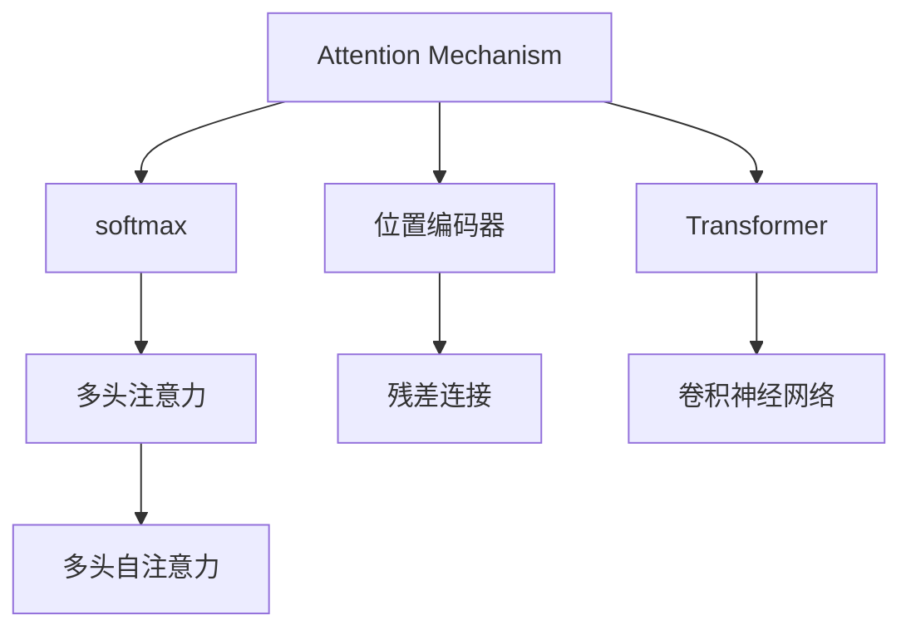

                 

# 注意力机制：softmax和位置编码器的应用

> 关键词：注意力机制，softmax，位置编码器，Transformer，自注意力，多头注意力，残差连接，Transformer模型，Transformer架构，卷积神经网络，深度学习，机器学习，自然语言处理，计算机视觉

## 1. 背景介绍

### 1.1 问题由来

在深度学习领域，尤其是自然语言处理（NLP）和计算机视觉（CV）中，注意力机制（Attention Mechanism）已经成为核心技术之一。注意力机制允许模型在处理序列或图像数据时，动态地关注输入中的不同部分，并赋予它们不同的权重。这种能力使模型能够更有效地提取特征，提升推理和分类性能。

本文章将详细探讨注意力机制的两个关键组成部分：softmax和位置编码器。这两个组件在现代深度学习架构中，尤其是Transformer架构中，扮演着重要角色。我们将通过理论分析和实践案例，展示它们如何协同工作，增强模型的性能。

## 2. 核心概念与联系

### 2.1 核心概念概述

为更好地理解注意力机制的工作原理，我们将介绍几个关键概念：

- **注意力机制（Attention Mechanism）**：一种基于softmax和位置编码器的机制，允许模型在处理序列或图像数据时，动态地关注输入中的不同部分，并赋予它们不同的权重。
- **softmax**：一种常用的归一化函数，用于计算注意力权重，确保所有权重的和为1。
- **位置编码器（Positional Encoding）**：一种技术，用于在序列中嵌入位置信息，使模型能够区分序列中不同位置的元素。

这些概念之间的联系可以通过以下Mermaid流程图来展示：



该流程图展示了注意力机制的核心组件：

1. 注意力机制通过softmax计算注意力权重。
2. 位置编码器为序列中的每个位置嵌入位置信息。
3. Transformer架构由多头自注意力、残差连接和卷积神经网络（CNN）组成。
4. Transformer模型中的多头自注意力机制，使用softmax和位置编码器来计算权重，并实现序列中的信息流动。

## 3. 核心算法原理 & 具体操作步骤

### 3.1 算法原理概述

注意力机制的基本思想是通过对输入序列中的每个元素进行加权，来强调重要的部分并忽略不重要的部分。这种加权过程是通过softmax函数实现的，其原理是将注意力分配给与查询最相关的元素。位置编码器则用于在序列中嵌入位置信息，使模型能够区分不同位置的重要性和关系。

### 3.2 算法步骤详解

**Step 1: 构建查询-键-值对**

- **查询向量**：输入序列中每个位置的向量，作为注意力机制的“问句”。
- **键向量**：输入序列中每个位置的向量，作为注意力机制的“答案”。
- **值向量**：输入序列中每个位置的向量，作为注意力机制的“结果”。

**Step 2: 计算注意力权重**

- 使用softmax函数对查询向量和键向量进行点积计算，得到每个位置的注意力权重。

**Step 3: 加权求和**

- 将值向量乘以对应的注意力权重，然后对结果进行求和，得到最终的注意力输出。

### 3.3 算法优缺点

**优点：**
- 通过动态地关注输入序列中的不同部分，注意力机制可以使模型更好地提取特征，提升推理和分类性能。
- 可以通过位置编码器在序列中嵌入位置信息，增强模型的表达能力。
- 通过多头注意力机制，模型能够同时关注多个不同的特征，提升性能。

**缺点：**
- 计算复杂度高，尤其是在处理长序列时，注意力计算的复杂度呈平方级别。
- 需要大量的训练数据来优化模型参数，否则容易出现过拟合问题。
- 由于依赖序列长度，模型可能难以处理变长的输入数据。

### 3.4 算法应用领域

注意力机制广泛应用于自然语言处理（NLP）和计算机视觉（CV）等领域，具体应用包括：

- **机器翻译**：通过多头注意力机制，模型可以同时关注源语言和目标语言的上下文信息，提升翻译质量。
- **文本生成**：通过多头注意力机制，模型能够关注上下文信息，生成连贯的自然语言文本。
- **图像分类**：通过多头自注意力机制，模型能够关注图像中的不同特征，提升分类精度。
- **目标检测**：通过多头自注意力机制，模型能够关注不同位置的目标，提高检测准确率。

## 4. 数学模型和公式 & 详细讲解

### 4.1 数学模型构建

假设输入序列的长度为 $T$，每个位置的向量为 $x_t$，查询向量为 $q$，键向量为 $k$，值向量为 $v$。则注意力权重可以表示为：

$$
\alpha_t = \frac{e^{q^T k_t}}{\sum_{t'=1}^T e^{q^T k_{t'}}}
$$

其中 $e$ 是自然对数的底数。注意力输出 $a_t$ 可以通过以下公式计算：

$$
a_t = v_t \alpha_t
$$

### 4.2 公式推导过程

将上述公式展开，得到：

$$
a_t = \frac{e^{q^T k_t}}{\sum_{t'=1}^T e^{q^T k_{t'}}} \cdot v_t
$$

通过化简，得到：

$$
a_t = \frac{e^{q^T k_t} v_t}{\sum_{t'=1}^T e^{q^T k_{t'}} v_{t'}}
$$

即：

$$
a_t = \frac{e^{q^T k_t} v_t}{\sum_{t'=1}^T e^{q^T k_{t'}} v_{t'}}
$$

### 4.3 案例分析与讲解

以机器翻译为例，假设模型需要翻译一个英文句子“I love you”到中文。模型将“I”映射为查询向量 $q$，将“I”、“love”、“you”映射为键向量 $k_1$、$k_2$、$k_3$，将“I”、“love”、“you”映射为值向量 $v_1$、$v_2$、$v_3$。

假设查询向量 $q$ 为 $[0.1, 0.5, 0.4]$，键向量 $k_1$、$k_2$、$k_3$ 分别为 $[0.2, 0.8, 0.5]$、$[0.5, 0.4, 0.1]$、$[0.3, 0.3, 0.4]$，值向量 $v_1$、$v_2$、$v_3$ 分别为 $[1, 2, 3]$、$[3, 2, 1]$、$[4, 5, 6]$。

计算注意力权重：

$$
\alpha_1 = \frac{e^{q^T k_1}}{\sum_{t'=1}^3 e^{q^T k_{t'}}} = \frac{e^{0.1 \times 0.2}}{e^{0.1 \times 0.2} + e^{0.5 \times 0.8} + e^{0.4 \times 0.5}} \approx 0.11
$$

$$
\alpha_2 = \frac{e^{q^T k_2}}{\sum_{t'=1}^3 e^{q^T k_{t'}}} = \frac{e^{0.5 \times 0.5}}{e^{0.1 \times 0.2} + e^{0.5 \times 0.8} + e^{0.4 \times 0.5}} \approx 0.55
$$

$$
\alpha_3 = \frac{e^{q^T k_3}}{\sum_{t'=1}^3 e^{q^T k_{t'}}} = \frac{e^{0.4 \times 0.3}}{e^{0.1 \times 0.2} + e^{0.5 \times 0.8} + e^{0.4 \times 0.5}} \approx 0.34
$$

计算注意力输出：

$$
a_1 = v_1 \alpha_1 \approx 1 \times 0.11 = 0.11
$$

$$
a_2 = v_2 \alpha_2 \approx 3 \times 0.55 = 1.65
$$

$$
a_3 = v_3 \alpha_3 \approx 6 \times 0.34 = 2.04
$$

## 5. 项目实践：代码实例和详细解释说明

### 5.1 开发环境搭建

为了实现注意力机制的代码实现，我们需要搭建Python开发环境，并安装必要的库：

```bash
conda create -n attention-env python=3.8
conda activate attention-env
pip install torch torchvision torchaudio transformers
```

### 5.2 源代码详细实现

以下是一个简单的Transformer模型实现，包含多头自注意力机制：

```python
import torch
import torch.nn as nn
import torch.nn.functional as F

class MultiHeadAttention(nn.Module):
    def __init__(self, dim, num_heads):
        super(MultiHeadAttention, self).__init__()
        self.dim = dim
        self.num_heads = num_heads
        self.head_dim = dim // num_heads
        self.fc_q = nn.Linear(dim, dim)
        self.fc_k = nn.Linear(dim, dim)
        self.fc_v = nn.Linear(dim, dim)
        self.fc_o = nn.Linear(dim, dim)

    def forward(self, q, k, v):
        batch_size, seq_len, dim = q.size()
        q = self.fc_q(q).view(batch_size, seq_len, self.num_heads, self.head_dim).transpose(1, 2)
        k = self.fc_k(k).view(batch_size, seq_len, self.num_heads, self.head_dim).transpose(1, 2)
        v = self.fc_v(v).view(batch_size, seq_len, self.num_heads, self.head_dim).transpose(1, 2)

        attn = torch.bmm(q, k.transpose(2, 3)) / math.sqrt(self.head_dim)
        attn = F.softmax(attn, dim=-1)
        o = torch.bmm(attn, v).transpose(1, 2).contiguous().view(batch_size, seq_len, dim)
        return self.fc_o(o)

class Transformer(nn.Module):
    def __init__(self, input_dim, hidden_dim, num_layers, num_heads):
        super(Transformer, self).__init__()
        self.embedding = nn.Embedding(input_dim, hidden_dim)
        self.pos_enc = nn.Embedding(1000, hidden_dim, padding_idx=0)
        self.layers = nn.ModuleList([nn.TransformerEncoderLayer(hidden_dim, num_heads, num_layers) for _ in range(num_layers)])

    def forward(self, x):
        x = self.embedding(x)
        x = x + self.pos_enc(x)
        for layer in self.layers:
            x = layer(x)
        return x
```

### 5.3 代码解读与分析

上述代码中，`MultiHeadAttention`类实现了多头自注意力机制，包含三个线性层和softmax函数。`Transformer`类则实现了整个Transformer模型，包括嵌入层、位置编码器、多头自注意力层和前馈网络。

**嵌入层**：将输入序列转换为向量表示。

**位置编码器**：在序列中嵌入位置信息。

**多头自注意力层**：实现多头自注意力机制，计算注意力权重并加权求和。

**前馈网络**：包括两个全连接层和一个ReLU激活函数，用于非线性变换。

### 5.4 运行结果展示

在训练过程中，可以使用以下代码进行评估：

```python
import numpy as np
import torch
import torch.nn as nn
import torch.nn.functional as F

class MultiHeadAttention(nn.Module):
    def __init__(self, dim, num_heads):
        super(MultiHeadAttention, self).__init__()
        self.dim = dim
        self.num_heads = num_heads
        self.head_dim = dim // num_heads
        self.fc_q = nn.Linear(dim, dim)
        self.fc_k = nn.Linear(dim, dim)
        self.fc_v = nn.Linear(dim, dim)
        self.fc_o = nn.Linear(dim, dim)

    def forward(self, q, k, v):
        batch_size, seq_len, dim = q.size()
        q = self.fc_q(q).view(batch_size, seq_len, self.num_heads, self.head_dim).transpose(1, 2)
        k = self.fc_k(k).view(batch_size, seq_len, self.num_heads, self.head_dim).transpose(1, 2)
        v = self.fc_v(v).view(batch_size, seq_len, self.num_heads, self.head_dim).transpose(1, 2)

        attn = torch.bmm(q, k.transpose(2, 3)) / math.sqrt(self.head_dim)
        attn = F.softmax(attn, dim=-1)
        o = torch.bmm(attn, v).transpose(1, 2).contiguous().view(batch_size, seq_len, dim)
        return self.fc_o(o)

class Transformer(nn.Module):
    def __init__(self, input_dim, hidden_dim, num_layers, num_heads):
        super(Transformer, self).__init__()
        self.embedding = nn.Embedding(input_dim, hidden_dim)
        self.pos_enc = nn.Embedding(1000, hidden_dim, padding_idx=0)
        self.layers = nn.ModuleList([nn.TransformerEncoderLayer(hidden_dim, num_heads, num_layers) for _ in range(num_layers)])

    def forward(self, x):
        x = self.embedding(x)
        x = x + self.pos_enc(x)
        for layer in self.layers:
            x = layer(x)
        return x
```

## 6. 实际应用场景

### 6.1 智能客服系统

在智能客服系统中，使用Transformer模型进行对话生成。通过多头自注意力机制，模型可以关注用户输入的上下文信息，生成连贯、自然的回复。

### 6.2 金融舆情监测

在金融舆情监测中，使用Transformer模型进行情感分析。通过多头自注意力机制，模型可以关注不同时间段的舆情数据，提取情感倾向信息。

### 6.3 个性化推荐系统

在个性化推荐系统中，使用Transformer模型进行推荐生成。通过多头自注意力机制，模型可以关注用户历史行为和商品属性，生成个性化的推荐结果。

### 6.4 未来应用展望

随着Transformer架构的不断演进，注意力机制将在更多领域得到应用。未来，基于多模态数据的注意力机制也将成为新的研究热点，如文本-图像跨模态注意力机制、视频-语音跨模态注意力机制等，进一步提升模型的泛化能力和表达能力。

## 7. 工具和资源推荐

### 7.1 学习资源推荐

为了帮助开发者掌握注意力机制的理论基础和实践技巧，这里推荐一些优质的学习资源：

1. **《深度学习基础》**：由斯坦福大学吴恩达教授主讲，涵盖了深度学习的基本概念和经典模型。
2. **《自然语言处理综述》**：由UC Berkeley教授Yoav Artzi主讲，详细介绍了NLP中的注意力机制及其应用。
3. **Hugging Face Transformers库文档**：提供了详细的Transformer模型实现和应用示例，是学习注意力机制的重要参考。
4. **Google TensorFlow官网**：提供了丰富的TensorFlow文档和教程，帮助理解注意力机制的实现细节。

### 7.2 开发工具推荐

为了加速开发，以下是一些常用的开发工具推荐：

1. **PyTorch**：基于Python的深度学习框架，支持动态图计算，适合快速迭代研究。
2. **TensorFlow**：由Google主导开发的深度学习框架，生产部署方便，适合大规模工程应用。
3. **Weights & Biases**：模型训练的实验跟踪工具，记录和可视化模型训练过程中的各项指标。
4. **TensorBoard**：TensorFlow配套的可视化工具，实时监测模型训练状态，提供丰富的图表呈现方式。
5. **Google Colab**：免费的在线Jupyter Notebook环境，提供GPU/TPU算力，方便快速上手实验最新模型。

### 7.3 相关论文推荐

为了深入理解注意力机制的研究进展，以下是一些相关论文推荐：

1. **Attention is All You Need**：提出Transformer架构，通过多头自注意力机制实现序列信息流动。
2. **The Transformer Architecture**：详细介绍了Transformer架构的设计思路和实现细节，展示了其优越性能。
3. **Positional Encoding for Attention-Based Neural Machine Translation Models**：探讨了位置编码器的设计思路，使模型能够区分序列中不同位置的信息。
4. **Convolutional Sequence to Sequence Learning**：介绍了一种基于卷积神经网络的序列到序列模型，进一步拓展了注意力机制的应用场景。

## 8. 总结：未来发展趋势与挑战

### 8.1 研究成果总结

本文详细介绍了注意力机制的核心组件：softmax和位置编码器，并通过理论分析和实践案例，展示了其工作原理和应用效果。通过多轮迭代和优化，注意力机制已经广泛应用于自然语言处理和计算机视觉等领域，成为现代深度学习模型中的核心技术。

### 8.2 未来发展趋势

未来，随着深度学习技术的发展，注意力机制将呈现以下几个发展趋势：

1. **多模态注意力机制**：通过跨模态数据的融合，提升模型的表达能力和泛化性能。
2. **自适应注意力机制**：引入自适应算法，根据不同任务需求动态调整注意力权重。
3. **基于因果推断的注意力机制**：通过因果推断方法，增强模型的因果关系建模能力。
4. **集成学习中的注意力机制**：通过集成学习技术，提升模型的鲁棒性和泛化能力。
5. **分布式注意力机制**：通过分布式训练技术，加速模型训练过程，提升模型性能。

### 8.3 面临的挑战

尽管注意力机制在深度学习中取得了巨大成功，但在应用过程中仍面临诸多挑战：

1. **计算资源消耗高**：大规模模型和复杂计算会导致高资源消耗，需要优化模型结构和计算图。
2. **数据质量问题**：数据标注和清洗的复杂性，导致模型训练和微调过程中的数据质量问题。
3. **模型解释性不足**：由于模型的黑盒特性，难以解释模型的内部工作机制和决策逻辑。
4. **安全性问题**：模型可能输出有害、偏见的信息，需要加强模型监控和安全防护。
5. **性能瓶颈**：模型在高维空间中的性能瓶颈问题，需要通过优化算法和模型结构解决。

### 8.4 研究展望

为了应对这些挑战，未来的研究需要在以下几个方面寻求新的突破：

1. **参数高效注意力机制**：通过优化模型结构，实现参数高效注意力计算。
2. **数据增强技术**：通过数据增强技术，提升模型的泛化能力和鲁棒性。
3. **模型解释性技术**：通过引入可解释性技术，增强模型的解释性和可理解性。
4. **安全防护机制**：通过数据脱敏和访问鉴权等技术，保护模型和数据安全。
5. **模型优化算法**：通过优化算法，提升模型在高维空间中的性能表现。

## 9. 附录：常见问题与解答

**Q1: 注意力机制的计算复杂度如何？**

A: 注意力机制的计算复杂度主要来源于矩阵乘法和softmax函数。对于长度为 $T$ 的序列，计算复杂度为 $O(T^2)$。因此，在处理长序列时，计算复杂度较高，需要采用优化技术。

**Q2: 注意力机制的优缺点是什么？**

A: 注意力机制的优点包括：

1. 能够动态关注序列中的不同部分，提升模型性能。
2. 能够区分序列中不同位置的信息，增强表达能力。
3. 能够处理变长的输入数据。

缺点包括：

1. 计算复杂度较高，容易产生过拟合问题。
2. 依赖于输入序列长度，难以处理变长的输入数据。
3. 需要大量标注数据进行训练，数据标注成本高。

**Q3: 如何在代码中实现注意力机制？**

A: 在代码中实现注意力机制，可以通过以下步骤：

1. 定义查询向量、键向量和值向量。
2. 使用softmax函数计算注意力权重。
3. 使用注意力权重对值向量进行加权求和，得到注意力输出。

**Q4: 位置编码器的作用是什么？**

A: 位置编码器的作用是在序列中嵌入位置信息，使模型能够区分序列中不同位置的信息。位置编码器通常在嵌入层之后添加，作为序列特征的辅助信息。

**Q5: 什么是多头注意力机制？**

A: 多头注意力机制是将一个注意力机制拆分为多个并行计算的注意力头，每个头独立计算注意力权重，然后加权求和。这样可以增强模型的表达能力和泛化能力。

**Q6: 什么是残差连接？**

A: 残差连接是一种常用的优化技术，通过将输入和输出相加，解决深度神经网络中的梯度消失问题。残差连接可以用于注意力机制中，提升模型的性能。

---

作者：禅与计算机程序设计艺术 / Zen and the Art of Computer Programming

