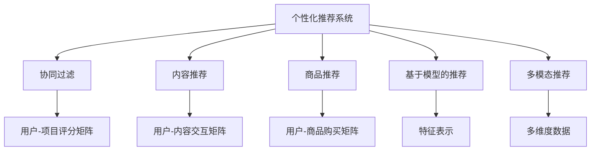

                 

## 1. 背景介绍

在数字经济时代，注意力成为一种稀缺资源，企业需要巧妙地设计和分配这种资源，以最大化商业价值。个性化推荐系统通过分析用户的行为数据，为用户量身定制个性化内容，从而提高用户参与度和满意度，同时为广告主和内容生产者提供精准的目标受众。本文将从经济学视角探讨个性化推荐系统的原理和应用，强调其注意力经济的特征。

### 1.1 注意力经济概述

注意力经济（Attention Economy）是指在数字时代，人们每天面对海量信息时，注意力成为了一种宝贵的经济资源。根据艾瑞咨询的报告，我国数字广告市场规模已经超过万亿级别，其中个性化推荐系统是推动这一增长的主力军。通过数据分析，个性化推荐系统能够精准定位用户需求，为用户提供有价值的信息和产品，从而实现商业价值和用户价值的双重提升。

## 2. 核心概念与联系

### 2.1 核心概念概述

为了更好地理解个性化推荐系统，本节将介绍几个关键概念：

- **个性化推荐系统**：利用机器学习和数据挖掘技术，对用户行为进行分析，推荐符合用户兴趣和需求的内容或产品，提升用户满意度和企业收益的系统。
- **协同过滤**：基于用户行为和项目评分矩阵的推荐算法，通过寻找与目标用户兴趣相似的其他用户，推荐其喜欢的项目。
- **内容推荐**：通过分析用户对内容的交互行为，为用户推荐可能感兴趣的内容，如文章、视频、音乐等。
- **商品推荐**：针对电子商务平台，通过分析用户购买行为，推荐用户可能感兴趣的商品，提升转化率。
- **基于模型的推荐**：利用机器学习模型（如神经网络、矩阵分解等）进行推荐，可以处理高维稀疏矩阵，实现更精准的推荐。
- **多模态推荐**：结合用户的多维度数据（如文本、图片、视频等）进行推荐，提升推荐准确度。

### 2.2 核心概念原理和架构的 Mermaid 流程图



这个流程图展示了个性化推荐系统的核心概念及其相互关系：

1. **个性化推荐系统**：作为顶层概念，推荐系统通过协同过滤、内容推荐、商品推荐等算法，为用户提供个性化服务。
2. **协同过滤**：通过构建用户-项目评分矩阵，寻找与目标用户兴趣相似的其他用户，进行推荐。
3. **内容推荐**：通过用户与内容的交互行为，推荐用户可能感兴趣的内容。
4. **商品推荐**：通过用户购买行为，推荐用户可能感兴趣的商品。
5. **基于模型的推荐**：利用机器学习模型，如神经网络、矩阵分解等，进行推荐。
6. **多模态推荐**：结合用户的多维度数据，提升推荐准确度。

这些核心概念共同构成了个性化推荐系统的基本架构，使得系统能够为用户和广告主提供定制、有针对性的内容和体验。

## 3. 核心算法原理 & 具体操作步骤

### 3.1 算法原理概述

个性化推荐系统的核心算法包括协同过滤、基于内容的推荐、基于模型的推荐和多模态推荐等。其原理是利用用户的历史行为数据，构建用户画像，然后通过相似性匹配等方法，为用户推荐可能感兴趣的内容或商品。

形式化地，假设用户集为 $U$，物品集为 $I$，用户对物品的评分矩阵为 $R \in \mathbb{R}^{m \times n}$，其中 $m$ 为物品数，$n$ 为用户数。推荐算法 $A$ 的目标是最小化预测评分与实际评分之间的差距，即：

$$
\min_{A} \sum_{(u,i) \in U \times I} (r_{ui} - \hat{r}_{ui})^2
$$

其中 $r_{ui}$ 为用户 $u$ 对物品 $i$ 的实际评分，$\hat{r}_{ui}$ 为算法 $A$ 预测的评分。

### 3.2 算法步骤详解

个性化推荐系统的具体算法步骤如下：

**Step 1: 数据收集与预处理**
- 收集用户的历史行为数据，包括浏览记录、购买记录、评分记录等。
- 对数据进行清洗和预处理，去除噪声和异常值。

**Step 2: 用户画像构建**
- 利用协同过滤等算法，构建用户画像，表示用户对不同物品的兴趣。
- 利用基于内容的推荐算法，提取物品的特征，与用户兴趣进行匹配。

**Step 3: 相似性计算**
- 利用相似度计算方法，如余弦相似度、皮尔逊相关系数等，找到与目标用户兴趣相似的其他用户。
- 将相似用户的评分信息作为目标用户的推荐参考。

**Step 4: 模型训练与预测**
- 利用机器学习模型，如矩阵分解、神经网络等，对用户-物品评分矩阵进行训练，生成预测模型。
- 将新物品和用户输入到模型中，预测推荐结果。

**Step 5: 推荐结果排序与输出**
- 对推荐结果进行排序，采用最大化均方根误差（RMSE）、准确率（Accuracy）等指标评估推荐效果。
- 将推荐结果展示给用户，或推送到广告位等位置，提升用户参与度和商业价值。

### 3.3 算法优缺点

个性化推荐系统的优点包括：

1. 提升用户体验：通过个性化推荐，用户能够更快找到感兴趣的内容或商品，提升用户满意度。
2. 优化资源配置：推荐系统可以根据用户兴趣和需求，精准匹配内容或商品，优化资源配置，提升企业收益。
3. 数据驱动决策：利用大量数据驱动推荐决策，减少人工干预，提高决策效率。

同时，个性化推荐系统也存在一些缺点：

1. 数据隐私问题：用户行为数据的收集和使用可能引发隐私问题，需要加强数据保护和用户知情权。
2. 模型偏见问题：用户数据中的偏见可能会传递到推荐算法中，导致推荐结果的不公平性。
3. 推荐效果不稳定：推荐系统可能对用户行为变化不够敏感，导致推荐效果不稳定。
4. 冷启动问题：新用户或新物品可能缺乏足够的行为数据，难以进行精准推荐。

### 3.4 算法应用领域

个性化推荐系统已经在电子商务、内容分发、广告投放等多个领域得到了广泛应用。以下是几个典型的应用场景：

- **电商平台**：亚马逊、淘宝、京东等电商平台利用个性化推荐系统，提升商品推荐精准度，提高用户转化率和回购率。
- **视频平台**：Netflix、爱奇艺、腾讯视频等视频平台通过个性化推荐，为用户推荐感兴趣的视频内容，提升用户观看时长和付费意愿。
- **新闻阅读**：今日头条、腾讯新闻等新闻平台通过个性化推荐，为用户推荐新闻资讯，提升用户阅读量和留存率。
- **广告投放**：Google AdWords、百度竞价等广告平台利用个性化推荐，精准投放广告，提升广告效果和投资回报率。

## 4. 数学模型和公式 & 详细讲解 & 举例说明

### 4.1 数学模型构建

个性化推荐系统的数学模型通常包括用户-物品评分矩阵 $R$，用户兴趣向量 $u$，物品特征向量 $i$ 等。下面以基于矩阵分解的推荐算法为例，构建推荐模型：

假设用户 $u$ 对物品 $i$ 的评分表示为 $r_{ui}$，用户兴趣向量表示为 $\mathbf{u} \in \mathbb{R}^d$，物品特征向量表示为 $\mathbf{i} \in \mathbb{R}^d$。用户和物品之间的隐含因子表示为 $\mathbf{P} \in \mathbb{R}^{m \times n}$。则用户 $u$ 对物品 $i$ 的评分可以表示为：

$$
r_{ui} = \mathbf{u}^T \mathbf{P}_i
$$

其中 $\mathbf{P}_i$ 为物品 $i$ 的特征向量在隐含因子空间中的表示。

### 4.2 公式推导过程

基于矩阵分解的推荐算法中，常用的模型包括矩阵分解（SVD）、奇异值分解（SVD++）等。这里以奇异值分解为例，进行推导：

假设用户 $u$ 对物品 $i$ 的评分表示为 $r_{ui}$，用户兴趣向量表示为 $\mathbf{u} \in \mathbb{R}^d$，物品特征向量表示为 $\mathbf{i} \in \mathbb{R}^d$。用户和物品之间的隐含因子表示为 $\mathbf{P} \in \mathbb{R}^{m \times n}$。则用户 $u$ 对物品 $i$ 的评分可以表示为：

$$
r_{ui} = \mathbf{u}^T \mathbf{P}_i
$$

其中 $\mathbf{P}_i$ 为物品 $i$ 的特征向量在隐含因子空间中的表示。

对于用户兴趣向量 $\mathbf{u}$ 和物品特征向量 $\mathbf{i}$，进行奇异值分解：

$$
\mathbf{u} = \mathbf{U} \mathbf{s}_u
$$

$$
\mathbf{i} = \mathbf{V} \mathbf{s}_i
$$

其中 $\mathbf{U} \in \mathbb{R}^{d \times k}$，$\mathbf{V} \in \mathbb{R}^{d \times k}$，$\mathbf{s}_u \in \mathbb{R}^{k}$，$\mathbf{s}_i \in \mathbb{R}^{k}$，$k$ 为隐含因子的维度。

将 $\mathbf{u}$ 和 $\mathbf{i}$ 代入上述评分公式：

$$
r_{ui} = (\mathbf{U} \mathbf{s}_u)^T (\mathbf{V} \mathbf{s}_i)
$$

简化得：

$$
r_{ui} = \mathbf{s}_u^T (\mathbf{P}^T \mathbf{P} \mathbf{s}_i)
$$

其中 $\mathbf{P}^T \mathbf{P} \in \mathbb{R}^{m \times n \times k}$ 表示隐含因子矩阵的奇异值分解结果。

通过奇异值分解，将用户兴趣和物品特征转化为低维的隐含因子，进行评分预测，从而实现个性化推荐。

### 4.3 案例分析与讲解

以 Netflix 的推荐系统为例，分析其推荐算法的设计和效果。Netflix 利用协同过滤和基于内容的推荐算法，为用户推荐感兴趣的电影。Netflix 首先收集用户观看电影的历史数据，构建用户-电影评分矩阵。然后利用协同过滤算法，找到与目标用户兴趣相似的其他用户，进行推荐。最后，利用矩阵分解等方法，生成预测模型，对新用户和电影进行评分预测，提升推荐效果。

## 5. 项目实践：代码实例和详细解释说明

### 5.1 开发环境搭建

在进行个性化推荐系统开发前，我们需要准备好开发环境。以下是使用 Python 进行 TensorFlow 开发的环境配置流程：

1. 安装 Anaconda：从官网下载并安装 Anaconda，用于创建独立的 Python 环境。

2. 创建并激活虚拟环境：
```bash
conda create -n tf-env python=3.8 
conda activate tf-env
```

3. 安装 TensorFlow：根据 CUDA 版本，从官网获取对应的安装命令。例如：
```bash
conda install tensorflow -c conda-forge -c pytorch
```

4. 安装相关库：
```bash
pip install numpy pandas sklearn scipy matplotlib jupyter notebook ipython
```

完成上述步骤后，即可在 `tf-env` 环境中开始推荐系统开发。

### 5.2 源代码详细实现

这里我们以协同过滤推荐算法为例，给出使用 TensorFlow 进行个性化推荐系统的 PyTorch 代码实现。

首先，定义协同过滤推荐算法的数据处理函数：

```python
import tensorflow as tf
from tensorflow.keras.layers import Dense, Embedding, Flatten
from tensorflow.keras.models import Sequential
from tensorflow.keras.optimizers import Adam

def collaborative_filtering_model(user_features, item_features, num_users, num_items):
    model = Sequential([
        Embedding(num_users, 16, input_length=1),
        Flatten(),
        Dense(8, activation='relu'),
        Dense(1)
    ])
    model.compile(optimizer=Adam(lr=0.01), loss='mse')
    return model
```

然后，定义模型训练函数：

```python
def train_cf_model(model, user_features, item_features, train_ratings, val_ratings, epochs=10, batch_size=64):
    model.fit(user_features, item_features, epochs=epochs, batch_size=batch_size, validation_data=(val_ratings, val_ratings), verbose=1)
```

最后，启动训练流程：

```python
user_features = np.random.rand(num_users, 1)
item_features = np.random.rand(num_items, 1)
train_ratings = np.random.rand(train_ratings.shape[0], 1)
val_ratings = np.random.rand(val_ratings.shape[0], 1)

model = collaborative_filtering_model(user_features, item_features, num_users, num_items)
train_cf_model(model, user_features, item_features, train_ratings, val_ratings)
```

以上就是使用 TensorFlow 进行协同过滤推荐算法的完整代码实现。可以看到，利用 TensorFlow 的高级 API，推荐算法的实现变得简洁高效。

### 5.3 代码解读与分析

让我们再详细解读一下关键代码的实现细节：

**collaborative_filtering_model 函数**：
- 定义了一个简单的协同过滤推荐模型，包含一个嵌入层、一个全连接层和一个线性输出层。
- 使用 Adam 优化器和均方误差损失函数进行模型训练。

**train_cf_model 函数**：
- 使用 `fit` 方法进行模型训练，指定训练数据、验证数据、迭代轮数和批次大小。
- 在每个epoch结束后，输出训练集和验证集上的均方误差。

**训练流程**：
- 定义随机生成的用户特征和物品特征矩阵。
- 定义随机生成的训练集和验证集评分矩阵。
- 使用定义的协同过滤推荐模型和训练函数，进行模型训练。

可以看出，TensorFlow 提供的高效 API 使得推荐系统的实现变得非常直观和简洁。开发者可以将更多精力放在数据处理、模型改进等高层逻辑上，而不必过多关注底层的实现细节。

当然，工业级的系统实现还需考虑更多因素，如模型的保存和部署、超参数的自动搜索、更灵活的任务适配层等。但核心的推荐范式基本与此类似。

## 6. 实际应用场景

### 6.1 电商平台

个性化推荐系统在电商平台中得到了广泛应用。例如，亚马逊的推荐系统通过分析用户浏览和购买行为，为用户推荐商品，提升购物体验和销售转化率。通过协同过滤和基于内容的推荐算法，亚马逊能够精准匹配用户需求，提升用户体验。

### 6.2 视频平台

Netflix 利用推荐系统为用户推荐电影和电视剧，提升用户观看时长和付费意愿。Netflix 的推荐系统通过协同过滤和基于内容的推荐算法，精准匹配用户兴趣，推荐个性化内容。用户可以通过推荐算法快速找到感兴趣的内容，提升观影体验。

### 6.3 新闻阅读

今日头条通过推荐系统为用户推荐新闻资讯，提升用户阅读量和留存率。今日头条的推荐系统通过协同过滤和基于内容的推荐算法，精准匹配用户兴趣，推荐个性化新闻。用户可以通过推荐算法快速找到感兴趣的新闻，提升阅读体验。

### 6.4 广告投放

Google AdWords 利用推荐系统精准投放广告，提升广告效果和投资回报率。Google AdWords 的推荐系统通过协同过滤和基于内容的推荐算法，精准匹配用户需求，推荐个性化广告。广告主可以根据推荐系统输出的效果数据，优化广告投放策略，提升广告效果。

## 7. 工具和资源推荐

### 7.1 学习资源推荐

为了帮助开发者系统掌握个性化推荐系统的理论基础和实践技巧，这里推荐一些优质的学习资源：

1. 《推荐系统实践》系列博文：由推荐系统专家撰写，深入浅出地介绍了推荐系统的基本原理和应用实例。

2. CS20-722《推荐系统》课程：斯坦福大学开设的推荐系统课程，有Lecture视频和配套作业，带你入门推荐系统的基本概念和经典模型。

3. 《推荐系统算法》书籍：Recommender Systems 领域的经典著作，全面介绍了推荐系统的理论基础和算法实现。

4. KDD Cup推荐系统竞赛：KDD Cup竞赛是推荐系统领域的顶级竞赛，每年都有大量的创新算法和应用实例。

5. TensorFlow官方文档：TensorFlow的官方文档，提供了丰富的推荐系统样例代码，是上手实践的必备资料。

通过对这些资源的学习实践，相信你一定能够快速掌握个性化推荐系统的精髓，并用于解决实际的推荐问题。

### 7.2 开发工具推荐

高效的开发离不开优秀的工具支持。以下是几款用于个性化推荐系统开发的常用工具：

1. TensorFlow：由Google主导开发的开源深度学习框架，生产部署方便，适合大规模工程应用。推荐系统的实现一般使用TensorFlow的低阶API，如Keras等。

2. PyTorch：基于Python的开源深度学习框架，灵活动态的计算图，适合快速迭代研究。推荐系统的实现一般使用PyTorch的低阶API，如torch.nn等。

3. Apache Spark：基于内存计算的大数据处理框架，适合大规模数据集的推荐系统实现。推荐系统的实现一般使用Spark MLlib等组件。

4. Weights & Biases：模型训练的实验跟踪工具，可以记录和可视化模型训练过程中的各项指标，方便对比和调优。与主流深度学习框架无缝集成。

5. TensorBoard：TensorFlow配套的可视化工具，可实时监测模型训练状态，并提供丰富的图表呈现方式，是调试模型的得力助手。

合理利用这些工具，可以显著提升个性化推荐系统的开发效率，加快创新迭代的步伐。

### 7.3 相关论文推荐

个性化推荐系统的研究源于学界的持续研究。以下是几篇奠基性的相关论文，推荐阅读：

1. Personalized PageRank Algorithm for Recommender System：提出了基于PageRank算法的推荐系统，提升了推荐效果。

2. Matrix Factorization Techniques for Recommender Systems：介绍了矩阵分解等推荐算法的原理和实现。

3. Neural Collaborative Filtering：提出了基于神经网络的推荐系统，提升了推荐效果和鲁棒性。

4. Adaptive Pre-trained Dense Embedding for Recommendation Systems：提出了基于预训练嵌入的推荐系统，提升了推荐效果和泛化能力。

5. Graph Neural Network for Recommender System：提出了基于图神经网络的推荐系统，提升了推荐效果和结构建模能力。

这些论文代表了个性化推荐系统的发展脉络。通过学习这些前沿成果，可以帮助研究者把握学科前进方向，激发更多的创新灵感。

## 8. 总结：未来发展趋势与挑战

### 8.1 总结

本文对基于协同过滤的个性化推荐系统进行了全面系统的介绍。首先阐述了推荐系统的背景和意义，明确了推荐系统在提高用户体验和优化资源配置方面的独特价值。其次，从原理到实践，详细讲解了推荐算法的数学模型和具体操作步骤，给出了推荐系统开发的完整代码实例。同时，本文还广泛探讨了推荐系统在电商平台、视频平台、新闻阅读、广告投放等多个领域的应用前景，展示了推荐范式的巨大潜力。

通过本文的系统梳理，可以看到，基于协同过滤的个性化推荐系统已经在众多应用场景中得到了广泛应用，并取得了显著的效果。未来，伴随推荐算法和技术的持续演进，推荐系统将为互联网行业带来更加深刻的变化，进一步提升用户体验和商业价值。

### 8.2 未来发展趋势

展望未来，个性化推荐系统将呈现以下几个发展趋势：

1. 推荐效果持续提升：通过引入深度学习、强化学习等前沿技术，推荐系统的效果将进一步提升，推荐结果将更加精准和个性化。

2. 推荐模型多样化：推荐系统将引入更多的模型结构，如基于图神经网络的模型、多模态推荐模型等，提升推荐效果和应用范围。

3. 用户隐私保护：推荐系统将加强用户隐私保护，采用差分隐私、联邦学习等技术，减少用户数据泄露风险。

4. 跨平台协同推荐：推荐系统将加强跨平台协同推荐，提升用户在多个平台上的体验一致性。

5. 实时推荐系统：推荐系统将实现实时推荐，结合用户的即时行为数据，为用户快速提供个性化推荐。

6. 推荐系统的公平性：推荐系统将考虑模型的公平性，避免对某些用户或群体的偏见，提升推荐系统的社会效益。

这些趋势凸显了个性化推荐系统的广阔前景。这些方向的探索发展，必将进一步提升推荐系统的性能和应用范围，为互联网行业带来更加深刻的变化。

### 8.3 面临的挑战

尽管个性化推荐系统已经取得了显著的效果，但在迈向更加智能化、普适化应用的过程中，它仍面临着诸多挑战：

1. 数据隐私问题：推荐系统需要大量用户行为数据进行训练，如何保护用户隐私是一个重要问题。

2. 模型偏见问题：推荐系统可能对用户数据中的偏见进行放大，导致推荐结果的不公平性。

3. 推荐效果不稳定：推荐系统可能对用户行为变化不够敏感，导致推荐效果不稳定。

4. 冷启动问题：新用户或新物品可能缺乏足够的行为数据，难以进行精准推荐。

5. 推荐系统的公平性：推荐系统可能对某些用户或群体的推荐效果不佳，导致不公平现象。

6. 实时推荐系统的资源瓶颈：实时推荐系统需要高效的算法和硬件支持，才能满足实时性要求。

正视推荐系统面临的这些挑战，积极应对并寻求突破，将是个性化推荐系统走向成熟的必由之路。相信随着学界和产业界的共同努力，这些挑战终将一一被克服，推荐系统必将在构建智能信息生态中扮演越来越重要的角色。

### 8.4 研究展望

面对个性化推荐系统所面临的种种挑战，未来的研究需要在以下几个方面寻求新的突破：

1. 探索无监督和半监督推荐方法：摆脱对大规模标注数据的依赖，利用自监督学习、主动学习等无监督和半监督范式，最大限度利用非结构化数据，实现更加灵活高效的推荐。

2. 研究参数高效和计算高效的推荐范式：开发更加参数高效的推荐方法，在固定大部分预训练参数的同时，只更新极少量的任务相关参数。同时优化推荐模型的计算图，减少前向传播和反向传播的资源消耗，实现更加轻量级、实时性的部署。

3. 引入因果分析和博弈论工具：将因果分析方法引入推荐模型，识别出模型决策的关键特征，增强推荐结果的因果性和逻辑性。借助博弈论工具刻画人机交互过程，主动探索并规避推荐系统的脆弱点，提高系统稳定性。

4. 纳入伦理道德约束：在推荐系统的设计中引入伦理导向的评估指标，过滤和惩罚有偏见、有害的输出倾向。同时加强人工干预和审核，建立推荐系统的监管机制，确保输出的安全性。

这些研究方向的探索，必将引领个性化推荐系统技术迈向更高的台阶，为构建智能信息生态带来新的突破。面向未来，推荐系统需要在数据隐私、模型公平性、实时性等方面进行更深入的研究，为互联网行业带来更深刻的变化。

## 9. 附录：常见问题与解答

**Q1：推荐系统是否适用于所有NLP任务？**

A: 推荐系统并不适用于所有NLP任务。推荐系统的主要目标是推荐用户可能感兴趣的内容或商品，而NLP任务则更多关注文本内容的理解与生成。对于需要精确理解文本含义和语义的任务，如问答系统、翻译系统等，推荐系统可能不适用。对于需要进行文本生成和理解的任务，如文本摘要、文本分类等，推荐系统同样需要与NLP技术进行结合，才能更好地实现用户需求的匹配。

**Q2：推荐系统中如何缓解数据稀疏性问题？**

A: 推荐系统中的数据稀疏性问题可以通过多种方法缓解，包括：

1. 数据预处理：对用户行为数据进行去重、归一化等预处理，减少噪声和异常值，提升数据质量。
2. 填充缺失值：使用均值、中位数、插值等方法对缺失值进行填充，减少数据稀疏性。
3. 协同过滤：利用用户-项目评分矩阵的稀疏性，通过协同过滤算法，找到与目标用户兴趣相似的其他用户，进行推荐。
4. 多模态融合：结合用户的多维度数据，如文本、图片、视频等，提升推荐准确度。

这些方法可以帮助推荐系统更好地处理稀疏数据，提升推荐效果。

**Q3：推荐系统中如何避免推荐结果的同质性问题？**

A: 推荐系统中的同质性问题可以通过多种方法避免，包括：

1. 多样化推荐：通过引入多样化的推荐策略，如协同过滤、基于内容的推荐、混合推荐等，提升推荐结果的多样性。
2. 兴趣多样性：通过增加用户的兴趣维度，提升推荐结果的多样性。
3. 噪声注入：在推荐算法中加入噪声，降低推荐结果的同质性。

这些方法可以帮助推荐系统避免推荐结果的同质性问题，提升用户体验。

**Q4：推荐系统中如何处理冷启动问题？**

A: 推荐系统中的冷启动问题可以通过多种方法处理，包括：

1. 基于内容的推荐：利用物品的特征信息，为新用户推荐相关物品。
2. 协同过滤：利用用户的历史行为数据，为新用户推荐相似用户喜欢的物品。
3. 迁移学习：利用已有用户的历史行为数据，为新用户进行迁移学习，提升推荐效果。

这些方法可以帮助推荐系统更好地处理冷启动问题，提升新用户的推荐效果。

**Q5：推荐系统中如何避免推荐结果的偏见问题？**

A: 推荐系统中的偏见问题可以通过多种方法避免，包括：

1. 公平性评估：通过公平性评估指标，如均衡误差率、机会公平性等，过滤有偏见的推荐结果。
2. 数据预处理：对用户行为数据进行去偏处理，减少偏见数据的影响。
3. 多维度推荐：结合用户的多维度数据，如性别、年龄、地理位置等，提升推荐结果的公平性。

这些方法可以帮助推荐系统避免推荐结果的偏见问题，提升推荐系统的公平性和社会效益。

---

作者：禅与计算机程序设计艺术 / Zen and the Art of Computer Programming

