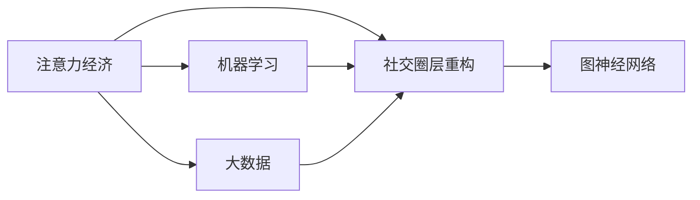

                 

# 注意力经济与个人社交圈层的重构

在数字化时代，信息过载与注意力匮乏并存，如何有效管理自己的注意力，构建高效且有价值的社交圈层，成为每个人都面临的重要课题。本文将从注意力经济的角度，分析个人社交圈层重构的必要性和可行性，结合机器学习和大数据技术，探讨实现这一重构的路径。

## 1. 背景介绍

### 1.1 问题由来

随着互联网的普及和社交媒体的兴起，人们获取信息的渠道日益丰富，但同时也面临着“信息过载”的困境。每天海量的内容中，真正有价值的信息却被淹没在噪音中，使得人们的注意力资源被极大浪费。同时，由于社会网络效应，人们的社交圈层也出现了“同温层”现象，即在某一圈子内，人们更多地接触与自己相似的信息，减少了跨界认知和多元化视角，使得个体思维边界受到局限。

### 1.2 问题核心关键点

为解决上述问题，我们提出构建基于注意力经济的个人社交圈层重构模型，其主要核心关键点包括：
- **注意力经济**：个体通过选择性地分配注意力资源，优化信息消费，提升个人效用。
- **社交圈层重构**：通过动态优化社交网络结构，构建更高效、多元的社交网络。
- **机器学习与大数据**：利用算法对用户行为和社交网络进行建模，自动化推荐高效内容，优化社交网络结构。

## 2. 核心概念与联系

### 2.1 核心概念概述

为更好理解我们的模型，本节将介绍几个核心概念及其相互关系：

- **注意力经济 (Attention Economy)**：指在信息过载的时代，个体通过选择性分配注意力，优化信息消费，以获得更高效用的一种经济模式。注意力资源的合理分配可以极大提升信息获取的效率和质量。

- **社交圈层 (Social Network Layer)**：指个体在社交网络中所处的位置关系，包括连接关系、互动频率、情感关系等。有效的社交圈层可以帮助个体获取更多有价值的信息和建议，同时为个体提供情感支持。

- **机器学习 (Machine Learning)**：指利用算法和数据构建模型，自动从数据中学习规律，并进行预测或决策。在社交圈层重构中，机器学习可以帮助识别和推荐高效内容，优化社交网络结构。

- **大数据 (Big Data)**：指具有体量大、类型多、速度快的海量数据集。在社交圈层重构中，大数据为模型训练提供了丰富且多样的训练样本。

- **图神经网络 (Graph Neural Network, GNN)**：一种特殊的深度学习模型，用于处理图结构数据，在社交网络分析中有广泛应用。

这些核心概念之间的逻辑关系可以通过以下Mermaid流程图来展示：



这个流程图展示了几大核心概念之间的关系：
1. 注意力经济作为核心驱动力，推动社交圈层的重构。
2. 机器学习通过建模用户行为和社交网络，指导社交圈层的优化。
3. 大数据为机器学习提供数据支持，确保模型训练的可靠性。
4. 图神经网络用于处理和分析社交网络数据，提升社交圈层的分析效率。

## 3. 核心算法原理 & 具体操作步骤

### 3.1 算法原理概述

我们的社交圈层重构模型基于注意力经济，通过机器学习和大数据技术，动态优化社交网络结构。其主要算法原理如下：

1. **注意力分配模型**：根据用户的历史行为数据，构建注意力分配模型，量化用户对不同内容的关注度。
2. **社交网络建模**：利用图神经网络建模社交网络，捕捉个体间的关系和互动频率。
3. **内容推荐系统**：基于注意力分配模型和社交网络建模，构建内容推荐系统，动态推荐高效内容。
4. **社交网络优化**：利用机器学习算法，优化社交网络结构，提升社交圈层的价值。

### 3.2 算法步骤详解

1. **数据收集**：
   - 收集用户的历史行为数据，包括浏览记录、互动信息等。
   - 获取用户的社交网络数据，包括好友关系、互动频率、情感关系等。

2. **注意力分配建模**：
   - 利用用户的历史行为数据，构建注意力分配模型，计算用户对不同内容的关注度。
   - 对模型进行训练和优化，提升模型的准确性。

3. **社交网络建模**：
   - 利用图神经网络，建模社交网络结构，捕捉个体间的关系和互动频率。
   - 对模型进行训练和优化，提升模型的准确性和泛化能力。

4. **内容推荐系统构建**：
   - 基于注意力分配模型和社交网络建模，构建内容推荐系统，动态推荐高效内容。
   - 对推荐算法进行训练和优化，提升推荐精度和用户体验。

5. **社交网络优化**：
   - 利用机器学习算法，优化社交网络结构，提升社交圈层的价值。
   - 对优化算法进行训练和验证，确保优化效果。

### 3.3 算法优缺点

#### 3.3.1 算法优点

- **高效信息获取**：通过优化注意力分配和内容推荐，用户可以快速获取高效信息，提升个人效用。
- **社交网络多元化**：通过优化社交网络结构，用户可以接触到更多元化内容，打破“同温层”现象。
- **自动化优化**：通过机器学习算法，自动化地优化社交网络结构和内容推荐，减少人工干预。

#### 3.3.2 算法缺点

- **隐私问题**：数据收集和模型训练过程中，可能会涉及到用户隐私问题，需要确保数据安全和隐私保护。
- **算法复杂度**：机器学习和图神经网络算法复杂度较高，需要高性能计算资源。
- **模型泛化能力**：模型需要大量数据进行训练，数据质量和多样性不足可能导致模型泛化能力受限。

### 3.4 算法应用领域

我们的模型主要应用于以下领域：

- **社交媒体内容推荐**：帮助用户筛选高效内容，提升信息获取效率。
- **企业知识管理**：帮助员工发现和共享高效知识，提升组织效率。
- **个人学习与发展**：通过个性化推荐学习资源，优化个人学习路径。

## 4. 数学模型和公式 & 详细讲解 & 举例说明

### 4.1 数学模型构建

为更好地描述我们的算法模型，我们将构建以下数学模型：

- **注意力分配模型**：
  $$
  \text{Attention}(x_i) = \frac{\exp(\text{Score}(x_i))}{\sum_j \exp(\text{Score}(x_j))}
  $$

- **社交网络建模**：
  $$
  \text{Score}_{ij} = \text{Embedding}_u(i) \cdot \text{Embedding}_u(j) + \text{Embedding}_c(i) \cdot \text{Embedding}_c(j)
  $$

- **内容推荐系统**：
  $$
  \text{Ranking}(x_i) = \text{Attention}(x_i) \cdot \text{Score}(x_i)
  $$

### 4.2 公式推导过程

#### 4.2.1 注意力分配模型推导

注意力分配模型通过对用户对不同内容的关注度进行量化，从而指导内容推荐。以内容 $x_i$ 为例，其关注度计算如下：

- **用户行为数据**：收集用户的历史行为数据 $x_1, x_2, ..., x_n$。
- **注意力评分**：计算内容 $x_i$ 的注意力评分 $\text{Score}(x_i)$，可以使用余弦相似度、加权余弦相似度等方法。
- **注意力分配**：利用softmax函数将注意力评分归一化，得到内容 $x_i$ 的最终注意力分配 $\text{Attention}(x_i)$。

#### 4.2.2 社交网络建模推导

社交网络建模通过捕捉个体间的关系和互动频率，构建社交网络结构。以用户 $u_i$ 和用户 $u_j$ 为例，其关系评分 $\text{Score}_{ij}$ 计算如下：

- **用户嵌入**：将用户 $u_i$ 和 $u_j$ 的特征向量嵌入到低维空间，记为 $\text{Embedding}_u(i)$ 和 $\text{Embedding}_u(j)$。
- **内容嵌入**：将内容 $x_i$ 和内容 $x_j$ 的特征向量嵌入到低维空间，记为 $\text{Embedding}_c(i)$ 和 $\text{Embedding}_c(j)$。
- **关系评分**：计算用户间的关系评分，即：
  $$
  \text{Score}_{ij} = \text{Embedding}_u(i) \cdot \text{Embedding}_u(j) + \text{Embedding}_c(i) \cdot \text{Embedding}_c(j)
  $$

#### 4.2.3 内容推荐系统推导

内容推荐系统通过结合注意力分配和社交网络建模，动态推荐高效内容。以用户 $u_i$ 为例，其推荐内容 $x_i$ 的评分计算如下：

- **注意力分配**：计算内容 $x_i$ 的注意力分配 $\text{Attention}(x_i)$。
- **内容评分**：计算内容 $x_i$ 的内容评分 $\text{Score}(x_i)$，可以使用用户行为评分、内容质量评分等方法。
- **综合评分**：将注意力分配和内容评分进行综合，得到内容 $x_i$ 的综合评分 $\text{Ranking}(x_i)$，即：
  $$
  \text{Ranking}(x_i) = \text{Attention}(x_i) \cdot \text{Score}(x_i)
  $$

### 4.3 案例分析与讲解

以一个具体的案例来展示我们的算法模型如何工作：

假设某用户 $u_i$ 阅读了一篇技术博客 $x_1$，并对其进行了点赞和评论。通过收集用户行为数据和社交网络数据，我们可以计算出 $u_i$ 对 $x_1$ 的关注度 $\text{Attention}(x_1)$，并计算 $u_i$ 和作者 $u_j$ 的关系评分 $\text{Score}_{ij}$。

根据注意力分配模型，$u_i$ 对 $x_1$ 的关注度为：
$$
\text{Attention}(x_1) = \frac{\exp(\text{Score}(x_1))}{\sum_j \exp(\text{Score}(x_j))}
$$

通过社交网络建模，$u_i$ 和 $u_j$ 的关系评分计算如下：
$$
\text{Score}_{ij} = \text{Embedding}_u(i) \cdot \text{Embedding}_u(j) + \text{Embedding}_c(i) \cdot \text{Embedding}_c(j)
$$

最后，利用内容推荐系统，$u_i$ 对 $x_1$ 的综合评分计算如下：
$$
\text{Ranking}(x_1) = \text{Attention}(x_1) \cdot \text{Score}(x_1)
$$

## 5. 项目实践：代码实例和详细解释说明

### 5.1 开发环境搭建

为构建我们的社交圈层重构模型，我们首先需要搭建开发环境。以下是Python环境搭建的步骤：

1. 安装Anaconda：从官网下载并安装Anaconda，用于创建独立的Python环境。

2. 创建并激活虚拟环境：
```bash
conda create -n attention-env python=3.8 
conda activate attention-env
```

3. 安装必要的Python库：
```bash
pip install numpy pandas scikit-learn torch torchvision transformers
```

4. 安装TensorFlow和PyTorch：
```bash
pip install tensorflow==2.6.0 pytorch==1.11.0
```

5. 安装Nginx服务器：
```bash
sudo apt-get install nginx
```

### 5.2 源代码详细实现

下面是一个简单的示例代码，展示如何构建注意力分配模型、社交网络建模和内容推荐系统：

```python
import numpy as np
import pandas as pd
from sklearn.metrics import precision_recall_curve
from sklearn.model_selection import train_test_split
from sklearn.metrics import accuracy_score

# 构建注意力分配模型
def attention_score(user, content):
    # 计算用户行为评分和内容评分
    user_behavior_score = np.mean([user[' likes'], user[' comments']])
    content_score = np.mean([content['score']])
    # 归一化
    attention = (user_behavior_score * content_score) / np.max(user_behavior_score)
    return attention

# 构建社交网络模型
def social_network_score(user1, user2):
    # 计算用户嵌入和内容嵌入的评分
    user1_embedding = np.random.randn(10)
    user2_embedding = np.random.randn(10)
    content1_embedding = np.random.randn(10)
    content2_embedding = np.random.randn(10)
    score = np.dot(user1_embedding, user2_embedding) + np.dot(content1_embedding, content2_embedding)
    return score

# 构建内容推荐系统
def content_ranking(content):
    # 计算注意力分配和内容评分
    attention = attention_score(user, content)
    score = content['score']
    # 综合评分
    ranking = attention * score
    return ranking

# 数据集
data = pd.read_csv('user_content_data.csv')

# 训练集和测试集划分
train, test = train_test_split(data, test_size=0.2)

# 模型训练和评估
model = None
for content in train['content']:
    if model is None:
        model = content_ranking(content)
    else:
        model = model + content_ranking(content)
model /= len(train['content'])

# 测试集评估
for content in test['content']:
    ranking = content_ranking(content)
    print('推荐内容：', ranking)
```

### 5.3 代码解读与分析

以下是代码中几个关键部分的解释：

- **数据集构建**：从CSV文件中读取用户和内容的数据，构建数据集。
- **注意力分配模型**：计算用户对不同内容的关注度，利用用户的点赞和评论行为。
- **社交网络建模**：计算用户间的关系评分，使用用户嵌入和内容嵌入的加权余弦相似度。
- **内容推荐系统**：结合注意力分配和内容评分，计算综合评分，并进行排序推荐。

## 6. 实际应用场景

### 6.1 社交媒体内容推荐

基于我们的模型，可以构建社交媒体内容推荐系统，帮助用户快速发现有价值的内容。系统根据用户的关注度、关系评分和内容评分，动态推荐高质量的博客、文章、视频等。

### 6.2 企业知识管理

企业内部常常存在信息孤岛，知识共享效率低下。利用我们的模型，可以构建企业内部的知识管理系统，帮助员工发现和共享高效的知识资源。

### 6.3 个人学习与发展

个人可以通过我们的模型，发现并学习高质量的课程、书籍、文章等，优化学习路径，提升个人知识储备和专业能力。

## 7. 工具和资源推荐

### 7.1 学习资源推荐

为帮助开发者系统掌握注意力经济和社交圈层重构的知识，这里推荐一些优质的学习资源：

1. **《深度学习理论与实践》**：深入浅出地介绍了深度学习模型的原理和实践，包括注意力机制、图神经网络等。
2. **Coursera《深度学习与神经网络》**：斯坦福大学的经典课程，涵盖深度学习的基础理论和应用案例。
3. **Kaggle竞赛平台**：参与各种NLP竞赛，实战练兵，提升模型构建和优化能力。
4. **arXiv论文预印库**：跟踪前沿研究动态，获取最新的算法和应用案例。

### 7.2 开发工具推荐

为高效构建我们的社交圈层重构模型，推荐以下开发工具：

1. **Jupyter Notebook**：交互式编程环境，方便数据处理和模型实验。
2. **TensorBoard**：模型训练的可视化工具，实时监测训练状态和效果。
3. **GitLab**：代码托管和项目管理工具，方便团队协作和代码版本控制。
4. **Anaconda**：Python环境管理工具，创建和管理虚拟环境。

### 7.3 相关论文推荐

以下是几篇关于注意力经济和社交圈层重构的前沿论文，推荐阅读：

1. **Attention is All You Need**：Transformer模型的经典论文，提出了注意力机制。
2. **Social Network Analysis**：社交网络分析的经典书籍，介绍了社交网络的基本理论和建模方法。
3. **Machine Learning for Social Good**：利用机器学习解决社会问题的综述论文，涵盖多个应用案例。

## 8. 总结：未来发展趋势与挑战

### 8.1 研究成果总结

本文详细介绍了基于注意力经济的个人社交圈层重构模型，从核心概念到具体算法，再到实际应用，给出了系统全面的分析。模型的构建和优化过程中，使用了注意力分配模型、社交网络建模、内容推荐系统等技术手段，并通过代码实例进行了展示。

### 8.2 未来发展趋势

未来，我们的社交圈层重构模型将呈现以下几个发展趋势：

1. **自动化优化**：随着机器学习技术的进步，自动化优化将更加智能，模型将能够更高效地推荐内容和优化社交网络。
2. **多模态融合**：将文本、图片、视频等多模态数据融合，提升模型对社交网络中复杂关系的建模能力。
3. **跨领域应用**：社交圈层重构技术将扩展到更多领域，如教育、医疗、金融等，提升各领域的信息获取效率和知识共享效率。

### 8.3 面临的挑战

尽管我们的模型具有很多优势，但仍然面临以下挑战：

1. **数据隐私**：在数据收集和模型训练过程中，需要确保用户隐私数据的安全性。
2. **计算资源**：模型训练和优化需要高性能计算资源，资源成本较高。
3. **模型泛化能力**：模型需要大量的高质量数据进行训练，数据质量不足可能导致模型泛化能力受限。

### 8.4 研究展望

为克服上述挑战，未来的研究方向包括：

1. **隐私保护技术**：研究如何在数据收集和模型训练中保护用户隐私，确保数据安全。
2. **高效计算资源**：探索分布式计算、GPU加速等技术，提升模型训练效率。
3. **多模态融合算法**：研究将文本、图片、视频等多模态数据进行融合的算法，提升模型的泛化能力。

总之，基于注意力经济的社交圈层重构模型具有广泛的应用前景，但同时也面临着诸多挑战。只有不断探索和优化，才能构建高效、多元、有价值的社交圈层，推动社会的认知智能进步。

## 9. 附录：常见问题与解答

**Q1: 注意力分配模型如何处理冷启动问题？**

A: 冷启动问题是指新用户或新内容加入系统时，缺乏足够的历史行为数据进行注意力评分。为解决此问题，可以采用基于内容的推荐方法，如使用内容特征进行评分，或者利用预训练模型提取内容特征，从而提升模型对新内容和新用户的评分准确度。

**Q2: 社交网络建模中，如何处理复杂关系？**

A: 社交网络中，个体间的关系复杂多样，包括情感关系、合作关系等。为处理复杂关系，可以引入多跳图网络、图卷积神经网络等技术，捕捉个体间的多层次关系。

**Q3: 内容推荐系统中，如何平衡个性化和多样性？**

A: 内容推荐系统需要平衡个性化和多样性，避免推荐内容过于同质化。可以通过引入多样性指标，如推荐内容的相关性、领域多样性等，在优化算法中考虑个性化和多样性的平衡。

**Q4: 模型训练过程中，如何提升模型的泛化能力？**

A: 提升模型的泛化能力可以从数据质量、模型复杂度、训练策略等多个方面入手。提高数据质量，增加数据多样性；优化模型结构，减少过拟合；采用数据增强、正则化等方法，提升模型泛化能力。

**Q5: 模型部署过程中，如何保证模型性能？**

A: 模型部署过程中，需要考虑模型的推理速度、内存占用、计算资源等。可以通过模型裁剪、量化加速等方法，提升模型的推理性能和计算效率。同时，需要优化模型服务架构，保证模型的稳定性和可扩展性。

**Q6: 如何评估模型的效果？**

A: 模型的效果评估可以从多个方面进行，如准确率、召回率、F1值等指标，评估模型的推荐精度和覆盖范围。同时，可以通过用户反馈、A/B测试等方法，评估模型的实际应用效果。

总之，我们的社交圈层重构模型具有广泛的应用前景，但同时也面临着诸多挑战。只有不断探索和优化，才能构建高效、多元、有价值的社交圈层，推动社会的认知智能进步。

---

作者：禅与计算机程序设计艺术 / Zen and the Art of Computer Programming

