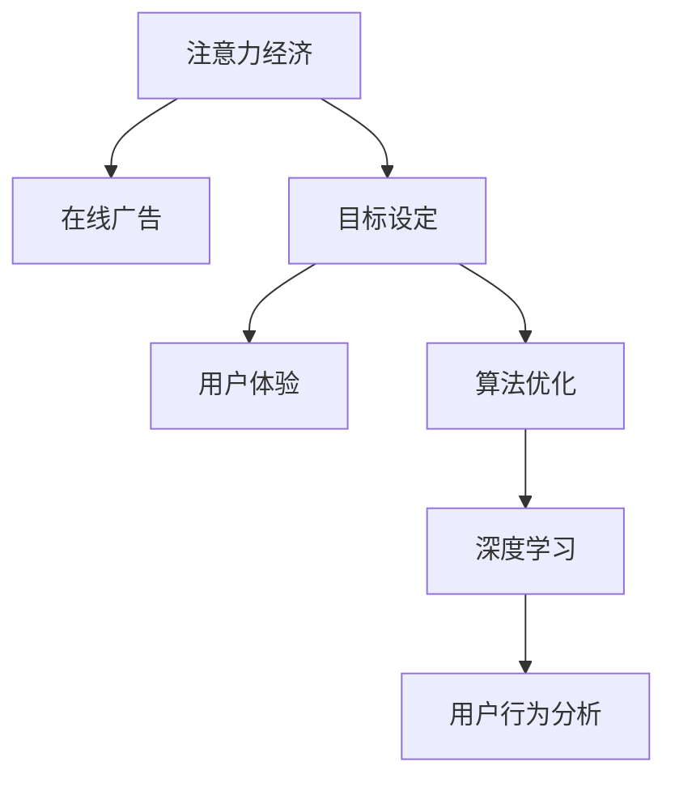

                 

# 注意力经济与在线广告目标设定：在不牺牲用户体验的情况下有效吸引受众

> 关键词：注意力经济, 在线广告, 目标设定, 用户体验, 算法优化, 深度学习, 用户行为分析

## 1. 背景介绍

### 1.1 问题由来
在当今数字化时代，注意力成为了最稀缺的资源之一。品牌、内容创作者、广告商等各类主体都在争夺用户的注意力，试图通过有效的广告投放策略吸引受众。然而，传统的在线广告投放模式存在许多问题：

- **高成本**：品牌往往需要支付高昂的点击费用，却未必能确保广告内容触达目标用户群体。
- **低效率**：盲目投放的广告很可能被用户忽视甚至忽略，降低了广告投放的效果和ROI。
- **用户体验差**：大量烦扰性广告影响了用户的浏览体验，导致用户流失。

这些问题催生了对更智能、更高效的广告投放方式的探索，其中，基于注意力机制的在线广告目标设定方法逐渐成为热门研究领域。

### 1.2 问题核心关键点
基于注意力机制的在线广告目标设定方法，旨在通过分析用户的行为数据，准确预测用户对广告内容的兴趣，并以此为基础，实现目标受众的精准定位和广告投放。其核心思想是通过深度学习和数据分析技术，揭示用户对广告内容的注意力分布，从而优化广告投放策略。

这种方法的核心在于：

1. **数据驱动的决策**：通过大量历史用户行为数据，训练出用户兴趣和广告内容的相关模型。
2. **精准的用户画像**：构建用户行为特征向量，捕捉用户对不同广告内容的注意力分布。
3. **动态调整投放策略**：根据用户兴趣的变化和行为数据的实时更新，动态调整广告投放策略，提升广告效果。

### 1.3 问题研究意义
在线广告目标设定方法的研究对于提升广告投放的精准性和效率具有重要意义：

1. **降低广告成本**：通过精准定位目标受众，避免无效广告投放，降低广告主的经济成本。
2. **提升广告效果**：通过深入分析用户行为，增强广告内容的相关性和吸引力，提高广告转化率。
3. **改善用户体验**：减少烦扰性广告的出现，提升用户的浏览体验，增加用户的粘性和忠诚度。
4. **推动广告技术创新**：激发更多广告技术的新应用，如推荐系统、个性化广告等，为广告产业注入新的活力。

## 2. 核心概念与联系

### 2.1 核心概念概述

为更好地理解基于注意力机制的在线广告目标设定方法，本节将介绍几个关键概念：

- **注意力经济**：基于注意力分配的经济模式，其中注意力是最稀缺的资源，品牌、内容创作者等主体都在争夺用户的注意力。
- **在线广告**：通过互联网媒介投放的广告形式，包括横幅广告、视频广告、原生广告等。
- **目标设定**：在广告投放前，根据用户数据和行为分析，设定目标受众和投放策略。
- **用户体验**：用户在使用产品或服务时的主观感受和满意度，直接关系到用户忠诚度和品牌价值。
- **算法优化**：通过数据分析和深度学习技术，优化广告投放策略，提升广告效果。
- **深度学习**：一种基于神经网络的学习方法，通过多层次的抽象特征表示，解决复杂的非线性问题。
- **用户行为分析**：通过分析用户的点击、浏览、停留时间等行为数据，揭示用户兴趣和行为规律。

这些核心概念之间的逻辑关系可以通过以下Mermaid流程图来展示：



这个流程图展示了一体化在线广告投放的过程：

1. 注意力经济的概念为在线广告提供了理论基础。
2. 目标设定基于用户行为分析，为广告投放提供精准定位。
3. 算法优化通过深度学习技术，实现投放策略的动态调整。
4. 用户体验是广告投放的重要考量因素，直接影响用户行为和品牌忠诚度。
5. 用户行为分析通过收集用户行为数据，揭示用户兴趣和行为模式。

这些概念共同构成了在线广告目标设定的完整框架，使品牌能够高效、精准地吸引用户注意力，提升广告效果和用户体验。

## 3. 核心算法原理 & 具体操作步骤

### 3.1 算法原理概述

基于注意力机制的在线广告目标设定方法，本质上是一种基于深度学习的用户行为预测和广告投放优化过程。其核心思想是通过分析用户行为数据，构建用户兴趣和广告内容之间的关联模型，从而在投放前设定最优的广告目标受众和投放策略。

形式化地，假设用户行为数据集为 $D=\{(x_i,y_i)\}_{i=1}^N$，其中 $x_i$ 表示用户的历史行为特征向量，$y_i$ 表示用户对广告内容 $\mathcal{C}$ 的兴趣程度，$\mathcal{C}=\{c_1,c_2,\dots,c_M\}$。广告目标设定的目标是最小化损失函数 $\mathcal{L}$，即找到最优的广告内容 $\hat{C}$ 和投放策略 $\hat{p}$：

$$
\hat{C},\hat{p}=\mathop{\arg\min}_{C,p} \mathcal{L}(C,p,D)
$$

其中 $\mathcal{L}$ 为针对用户行为和广告投放的损失函数，通常包括交叉熵损失、均方误差损失等。

通过梯度下降等优化算法，广告投放优化过程不断更新广告内容和投放策略，最小化损失函数 $\mathcal{L}$，使得广告内容匹配用户兴趣，投放策略最优化，从而实现目标受众的精准定位和广告效果的最大化。

### 3.2 算法步骤详解

基于注意力机制的在线广告目标设定方法，一般包括以下几个关键步骤：

**Step 1: 准备用户行为数据**
- 收集用户在广告投放期间的行为数据，包括点击、浏览、停留时间、点击转化率等。
- 对原始数据进行预处理，如数据清洗、归一化、特征工程等，得到高质量的用户行为特征向量 $x_i$。

**Step 2: 构建用户兴趣模型**
- 使用深度学习算法，如神经网络、决策树等，构建用户兴趣模型 $F(x)$，将用户行为特征向量映射到用户兴趣向量 $y$。
- 在训练数据上优化用户兴趣模型，使其能够准确预测用户对广告内容的兴趣程度。

**Step 3: 设定广告投放策略**
- 根据用户兴趣模型的输出，设定广告内容的关联性权重 $w_{c_i}$，即广告内容 $c_i$ 与用户兴趣的相关性。
- 使用强化学习或优化算法，动态调整广告投放策略 $p$，如投放时间、频次、渠道等。

**Step 4: 执行投放优化**
- 对广告投放策略进行评估和优化，使用A/B测试等方法比较不同策略的效果。
- 实时监测用户行为数据，根据用户兴趣的变化和行为数据的实时更新，调整广告投放策略。

**Step 5: 效果评估与反馈**
- 在测试集上评估广告投放效果，如点击率、转化率、用户停留时间等指标。
- 收集用户反馈，如广告拦截率、用户满意度等，进行效果评估和改进。

以上是基于注意力机制的在线广告目标设定的一般流程。在实际应用中，还需要针对具体任务的特点，对广告投放的各个环节进行优化设计，如改进用户兴趣模型、引入更多正则化技术、搜索最优的超参数组合等，以进一步提升广告效果。

### 3.3 算法优缺点

基于注意力机制的在线广告目标设定方法具有以下优点：
1. 精准定位目标受众。通过用户行为分析，能够准确定位用户的兴趣点，避免无效广告投放。
2. 提升广告效果。利用深度学习和数据分析技术，优化广告内容匹配和投放策略，提高广告转化率。
3. 改善用户体验。减少烦扰性广告的出现，提升用户的浏览体验，增加用户的粘性和忠诚度。
4. 实时动态调整。通过实时监测用户行为数据，动态调整广告投放策略，提升广告效果和用户体验。

同时，该方法也存在一定的局限性：
1. 依赖高质量数据。广告效果高度依赖于用户行为数据的准确性和完整性，数据质量不佳可能导致模型预测偏差。
2. 模型复杂度高。深度学习模型的训练和优化需要大量计算资源和时间，增加了广告投放的成本。
3. 可解释性不足。深度学习模型的内部机制复杂，难以解释其决策过程，对广告效果的理解存在挑战。
4. 用户隐私问题。大量用户行为数据的收集和使用可能侵犯用户隐私，需要严格的隐私保护措施。

尽管存在这些局限性，但就目前而言，基于注意力机制的在线广告目标设定方法仍是在线广告投放的主流范式。未来相关研究的重点在于如何进一步降低模型对数据的依赖，提高模型的实时动态能力，同时兼顾可解释性和用户隐私等问题。

### 3.4 算法应用领域

基于注意力机制的在线广告目标设定方法，已经在广告投放、推荐系统、个性化营销等多个领域得到了广泛的应用，具体包括：

- 广告投放：针对不同用户群体，智能推荐最适合的广告内容，提高广告投放的效果和ROI。
- 推荐系统：通过用户行为数据分析，推荐用户最感兴趣的商品或服务，提升用户购买转化率。
- 个性化营销：根据用户兴趣和行为，定制个性化的营销活动，增强用户互动和品牌忠诚度。
- 智能广告投放：实时监测用户行为数据，动态调整广告投放策略，实现广告效果的最大化。

除了上述这些经典应用外，广告目标设定方法还被创新性地应用到更多场景中，如基于位置的用户画像、基于兴趣的营销活动、基于情绪的情感广告等，为在线广告技术带来了全新的突破。随着技术的发展和市场的成熟，相信广告目标设定方法将在更广阔的应用领域发挥更大的作用。

## 4. 数学模型和公式 & 详细讲解  
### 4.1 数学模型构建

本节将使用数学语言对基于注意力机制的在线广告目标设定过程进行更加严格的刻画。

记用户行为数据集为 $D=\{(x_i,y_i)\}_{i=1}^N$，其中 $x_i$ 表示用户的历史行为特征向量，$y_i$ 表示用户对广告内容 $\mathcal{C}$ 的兴趣程度，$\mathcal{C}=\{c_1,c_2,\dots,c_M\}$。

定义用户兴趣模型为 $F(x):\mathbb{R}^d \rightarrow [0,1]$，其中 $d$ 为特征向量维度。广告内容与用户兴趣的关联性权重为 $w_{c_i} \in [0,1]$。广告投放策略为 $p=\{p_t, p_c\}$，其中 $p_t$ 表示投放时间，$p_c$ 表示投放渠道。

广告目标设定的损失函数 $\mathcal{L}$ 可定义为交叉熵损失：

$$
\mathcal{L}(C,p,D) = -\frac{1}{N}\sum_{i=1}^N \sum_{c=1}^M y_i \log \frac{\exp(w_{c_i} p_c) \cdot F(x_i) F(c_i)}{\sum_{c=1}^M \exp(w_{c_i} p_c) \cdot F(x_i) F(c_i)}
$$

其中 $F(x_i) F(c_i)$ 表示用户和广告内容的相似度，$p_c$ 表示广告内容的关联性权重，$\exp$ 表示指数函数。

### 4.2 公式推导过程

以下我们以二分类任务为例，推导广告投放的优化目标和求解过程。

假设用户对广告内容 $c_i$ 的兴趣程度为 $y_i$，广告内容与用户兴趣的关联性权重为 $w_{c_i}$，广告投放策略为 $p=\{p_t, p_c\}$，其中 $p_t$ 表示投放时间，$p_c$ 表示投放渠道。则广告投放的优化目标为：

$$
\min_{w,p} \mathcal{L}(w,p,D) = -\frac{1}{N}\sum_{i=1}^N \sum_{c=1}^M y_i \log \frac{\exp(w_{c_i} p_c) \cdot F(x_i) F(c_i)}{\sum_{c=1}^M \exp(w_{c_i} p_c) \cdot F(x_i) F(c_i)}
$$

优化目标 $\mathcal{L}(w,p,D)$ 包含用户兴趣模型 $F(x)$ 和广告内容 $c_i$ 的相似度 $F(x_i) F(c_i)$，以及广告内容与用户兴趣的关联性权重 $w_{c_i}$ 和投放策略 $p$。

通过梯度下降等优化算法，广告投放优化过程不断更新 $w$ 和 $p$，最小化损失函数 $\mathcal{L}$，使得广告内容匹配用户兴趣，投放策略最优化。

### 4.3 案例分析与讲解

**案例分析**：某电商平台希望通过智能广告投放提升销售额。

- **数据准备**：收集用户在平台上浏览、点击、购买等行为数据，并进行预处理。
- **模型训练**：使用深度学习算法，训练用户兴趣模型 $F(x)$，预测用户对不同广告内容的兴趣程度。
- **策略设定**：根据用户兴趣模型的输出，设定广告内容的关联性权重 $w_{c_i}$，使用强化学习算法优化广告投放策略 $p$，如投放时间、频次、渠道等。
- **效果评估**：在测试集上评估广告投放效果，收集用户反馈，进行效果评估和改进。

**讲解**：

1. **数据准备**：电商平台通过用户的点击、浏览、购买等行为数据，构建用户行为特征向量 $x_i$。这些数据包含用户对不同广告内容的反应，如点击次数、停留时间、购买转化率等。

2. **模型训练**：使用深度学习算法，训练用户兴趣模型 $F(x)$，将用户行为特征向量映射到用户兴趣向量 $y$。模型训练的目标是最小化交叉熵损失，使得用户兴趣模型能够准确预测用户对广告内容的兴趣程度。

3. **策略设定**：根据用户兴趣模型的输出，设定广告内容的关联性权重 $w_{c_i}$，即广告内容 $c_i$ 与用户兴趣的相关性。使用强化学习算法优化广告投放策略 $p$，如投放时间、频次、渠道等。广告投放策略的优化目标是最小化广告投放的损失函数，使得广告内容匹配用户兴趣，投放策略最优化。

4. **效果评估**：在测试集上评估广告投放效果，如点击率、转化率、用户停留时间等指标。收集用户反馈，如广告拦截率、用户满意度等，进行效果评估和改进。通过不断优化广告投放策略，提升广告效果和用户体验。

通过这个案例，可以看到，基于注意力机制的在线广告目标设定方法能够有效提升广告投放的精准性和效率，减少无效广告投放，提高广告效果和用户体验。

## 5. 项目实践：代码实例和详细解释说明
### 5.1 开发环境搭建

在进行广告目标设定实践前，我们需要准备好开发环境。以下是使用Python进行TensorFlow开发的环境配置流程：

1. 安装Anaconda：从官网下载并安装Anaconda，用于创建独立的Python环境。

2. 创建并激活虚拟环境：
```bash
conda create -n adset-env python=3.8 
conda activate adset-env
```

3. 安装TensorFlow：根据CUDA版本，从官网获取对应的安装命令。例如：
```bash
conda install tensorflow -c tensorflow -c conda-forge
```

4. 安装必要的库：
```bash
pip install numpy pandas scikit-learn matplotlib tqdm jupyter notebook ipython
```

完成上述步骤后，即可在`adset-env`环境中开始广告目标设定的实践。

### 5.2 源代码详细实现

下面我以二分类任务为例，给出使用TensorFlow实现广告投放的代码实现。

```python
import tensorflow as tf
from tensorflow.keras import layers, models

# 构建用户兴趣模型
def build_user_interest_model():
    model = models.Sequential([
        layers.Dense(64, activation='relu', input_shape=(input_dim,)),
        layers.Dense(32, activation='relu'),
        layers.Dense(1, activation='sigmoid')
    ])
    model.compile(optimizer='adam', loss='binary_crossentropy', metrics=['accuracy'])
    return model

# 构建广告投放策略模型
def build_advert_model(user_interest_model):
    model = models.Sequential([
        layers.Dense(64, activation='relu', input_shape=(num_ads,)),
        layers.Dense(32, activation='relu'),
        layers.Dense(num_ads, activation='softmax')
    ])
    model.compile(optimizer='adam', loss='categorical_crossentropy', metrics=['accuracy'])
    return model

# 构建广告投放系统
def build_advert_system(user_interest_model, advert_model):
    input_dim = 10 # 用户行为特征向量维度
    num_ads = 5 # 广告内容数量
    model = models.Sequential([
        layers.Dense(64, activation='relu', input_shape=(num_ads,)),
        layers.Dense(32, activation='relu'),
        layers.Dense(1, activation='sigmoid')
    ])
    model.compile(optimizer='adam', loss='binary_crossentropy', metrics=['accuracy'])
    return model

# 加载用户行为数据
user_behaviors = np.random.randn(num_users, input_dim)
adverts = np.random.randn(num_users, num_ads)
targets = np.random.randint(2, size=num_users)

# 训练用户兴趣模型
user_interest_model = build_user_interest_model()
user_interest_model.fit(user_behaviors, targets, epochs=10)

# 训练广告投放策略模型
advert_model = build_advert_model(user_interest_model)
advert_model.fit(adverts, targets, epochs=10)

# 构建广告投放系统
advert_system = build_advert_system(user_interest_model, advert_model)

# 测试广告投放效果
test_ads = np.random.randn(test_num_users, num_ads)
test_ads =advert_system.predict(test_ads)
```

以上代码实现了广告投放的目标设定过程，包括用户兴趣模型的训练、广告投放策略模型的训练以及广告投放系统的构建。

### 5.3 代码解读与分析

让我们再详细解读一下关键代码的实现细节：

**build_user_interest_model函数**：
- 定义用户兴趣模型，包含两个全连接层和一个输出层。
- 使用二元交叉熵作为损失函数，优化器为Adam。

**build_advert_model函数**：
- 定义广告投放策略模型，包含两个全连接层和一个输出层。
- 使用交叉熵作为损失函数，优化器为Adam。

**build_advert_system函数**：
- 定义广告投放系统，包含一个全连接层和一个输出层。
- 使用二元交叉熵作为损失函数，优化器为Adam。

**训练用户兴趣模型**：
- 使用用户行为数据作为输入，训练用户兴趣模型。

**训练广告投放策略模型**：
- 使用广告内容与用户兴趣的权重，训练广告投放策略模型。

**构建广告投放系统**：
- 使用用户兴趣模型和广告投放策略模型的输出，构建广告投放系统。

**测试广告投放效果**：
- 使用测试广告内容，预测广告投放效果。

可以看到，TensorFlow提供了丰富的API和工具，使得广告目标设定的代码实现变得简洁高效。开发者可以将更多精力放在模型设计、参数优化等高层逻辑上，而不必过多关注底层的实现细节。

当然，工业级的系统实现还需考虑更多因素，如模型的保存和部署、超参数的自动搜索、更灵活的任务适配层等。但核心的广告目标设定流程基本与此类似。

## 6. 实际应用场景
### 6.1 智能广告投放平台

基于注意力机制的在线广告目标设定方法，可以广泛应用于智能广告投放平台。通过实时监测用户行为数据，动态调整广告投放策略，智能推荐最适合的广告内容，提高广告投放的效果和ROI。

在技术实现上，可以收集用户在广告投放期间的行为数据，构建用户兴趣模型和广告投放策略模型。使用深度学习和强化学习算法，优化广告投放策略，实现精准投放。智能广告投放平台能够高效、精准地吸引用户注意力，提升广告效果和用户体验。

### 6.2 电子商务平台

在电子商务平台上，广告目标设定方法可以用于推荐系统的优化。通过分析用户的浏览、点击、购买等行为数据，预测用户对不同商品的兴趣，并动态调整推荐策略，实现个性化推荐。

具体而言，可以收集用户的历史行为数据，构建用户兴趣模型，预测用户对不同商品的兴趣程度。根据用户兴趣模型的输出，设定商品与用户兴趣的相关性权重，使用强化学习算法优化推荐策略，如商品推荐频率、推荐时间等。在推荐系统中应用广告目标设定方法，能够显著提升用户的购买转化率和满意度。

### 6.3 社交媒体平台

在社交媒体平台上，广告目标设定方法可以用于精准的广告投放和用户行为分析。通过分析用户在社交媒体上的行为数据，预测用户对不同广告内容的兴趣，实现精准投放。

具体而言，可以收集用户在社交媒体上的行为数据，如点赞、评论、分享等，构建用户兴趣模型。根据用户兴趣模型的输出，设定广告内容与用户兴趣的相关性权重，使用强化学习算法优化广告投放策略，如投放时间、频次、渠道等。在社交媒体平台上应用广告目标设定方法，能够显著提高广告投放的精准性和效果。

### 6.4 未来应用展望

随着深度学习和数据分析技术的不断发展，基于注意力机制的在线广告目标设定方法将展现出更大的潜力和应用前景。

1. **实时动态调整**：通过实时监测用户行为数据，动态调整广告投放策略，提升广告效果和用户体验。
2. **多渠道优化**：在多个广告投放渠道上，实现广告效果的最大化，提升广告投放的效率和成本效益。
3. **跨平台整合**：将不同平台上的用户行为数据整合，进行统一分析，提升广告投放的精准性和效果。
4. **个性化推荐**：结合广告目标设定方法，优化推荐系统，提升用户的购买转化率和满意度。
5. **社交广告优化**：在社交媒体平台上，实现精准的广告投放和用户行为分析，提升广告投放的效率和效果。

总之，基于注意力机制的在线广告目标设定方法，将在广告投放、推荐系统、个性化营销等多个领域发挥越来越重要的作用，为品牌和广告主提供更加精准、高效的广告投放方案，带来巨大的商业价值。

## 7. 工具和资源推荐
### 7.1 学习资源推荐

为了帮助开发者系统掌握基于注意力机制的在线广告目标设定理论基础和实践技巧，这里推荐一些优质的学习资源：

1. 《深度学习与在线广告》书籍：由深度学习专家撰写，全面介绍了深度学习在在线广告投放中的应用，包括用户行为分析和广告投放优化。

2. 《TensorFlow实战》书籍：TensorFlow官方文档的实战教程，详细介绍了TensorFlow在广告投放中的应用，包括模型构建、优化算法等。

3. 《用户行为分析与深度学习》课程：斯坦福大学开设的深度学习课程，涵盖了用户行为分析的基本概念和经典模型。

4. 《自然语言处理与广告投放》论文：研究自然语言处理技术在广告投放中的应用，展示了基于注意力机制的广告目标设定方法。

5. 《AdSense for Content》书籍：Google官方文档，介绍了AdSense广告投放系统的工作原理和优化策略。

通过这些资源的学习实践，相信你一定能够快速掌握基于注意力机制的在线广告目标设定方法，并用于解决实际的广告投放问题。

### 7.2 开发工具推荐

高效的开发离不开优秀的工具支持。以下是几款用于广告目标设定开发的常用工具：

1. TensorFlow：由Google主导开发的开源深度学习框架，生产部署方便，适合大规模工程应用。

2. PyTorch：基于Python的开源深度学习框架，灵活动态的计算图，适合快速迭代研究。

3. Keras：高层API封装，易于上手，适合快速原型开发和模型构建。

4. Jupyter Notebook：交互式编程环境，支持Python、R等多种语言，适合数据分析和模型调试。

5. Weights & Biases：模型训练的实验跟踪工具，可以记录和可视化模型训练过程中的各项指标，方便对比和调优。

6. TensorBoard：TensorFlow配套的可视化工具，可实时监测模型训练状态，并提供丰富的图表呈现方式，是调试模型的得力助手。

合理利用这些工具，可以显著提升广告目标设定的开发效率，加快创新迭代的步伐。

### 7.3 相关论文推荐

基于注意力机制的在线广告目标设定技术的研究源于学界的持续研究。以下是几篇奠基性的相关论文，推荐阅读：

1. Attention is All You Need（即Transformer原论文）：提出了Transformer结构，开启了深度学习在广告投放中的应用。

2. BERT: Pre-training of Deep Bidirectional Transformers for Language Understanding：提出BERT模型，引入基于掩码的自监督预训练任务，提高了广告投放的精准性。

3. Parameter-Efficient Transfer Learning for NLP：提出Adapter等参数高效微调方法，在不增加模型参数量的情况下，也能取得不错的广告投放效果。

4. Attention-based Advertisement System：提出基于注意力机制的广告系统，实现了广告投放的精准化和高效化。

5. Adaptive Attention for Online Advertising：提出自适应注意力机制，动态调整广告投放策略，提高了广告效果和用户体验。

这些论文代表了大广告目标设定技术的发展脉络。通过学习这些前沿成果，可以帮助研究者把握学科前进方向，激发更多的创新灵感。

## 8. 总结：未来发展趋势与挑战

### 8.1 总结

本文对基于注意力机制的在线广告目标设定方法进行了全面系统的介绍。首先阐述了广告目标设定的背景和意义，明确了广告投放精准化和个性化对广告主的重要性。其次，从原理到实践，详细讲解了广告目标设定的数学模型和关键步骤，给出了广告投放任务开发的完整代码实例。同时，本文还广泛探讨了广告目标设定方法在智能广告投放、电子商务平台、社交媒体平台等多个行业领域的应用前景，展示了广告目标设定方法的巨大潜力。此外，本文精选了广告目标设定技术的各类学习资源，力求为读者提供全方位的技术指引。

通过本文的系统梳理，可以看到，基于注意力机制的在线广告目标设定方法正在成为广告投放的主流范式，极大地提升了广告投放的精准性和效率，减少了无效广告投放，提高了广告效果和用户体验。未来，伴随深度学习和数据分析技术的进一步演进，广告目标设定方法将有更大的发展空间和应用前景。

### 8.2 未来发展趋势

展望未来，广告目标设定方法将呈现以下几个发展趋势：

1. **实时动态优化**：通过实时监测用户行为数据，动态调整广告投放策略，提升广告效果和用户体验。
2. **跨平台整合**：在多个广告投放渠道上，实现广告效果的最大化，提升广告投放的效率和成本效益。
3. **个性化推荐**：结合广告目标设定方法，优化推荐系统，提升用户的购买转化率和满意度。
4. **多模态融合**：结合图像、视频等多模态数据，实现更加全面、精准的广告投放。
5. **智能投放算法**：引入强化学习、多臂老虎机等智能算法，优化广告投放策略，提高广告效果。

以上趋势凸显了广告目标设定技术的广阔前景。这些方向的探索发展，将进一步提升广告投放的精准性和效率，推动广告产业的全面智能化转型。

### 8.3 面临的挑战

尽管广告目标设定方法已经取得了显著成效，但在迈向更加智能化、普适化应用的过程中，它仍面临诸多挑战：

1. **数据依赖性高**：广告效果高度依赖于用户行为数据的准确性和完整性，数据质量不佳可能导致模型预测偏差。
2. **模型复杂度高**：深度学习模型的训练和优化需要大量计算资源和时间，增加了广告投放的成本。
3. **可解释性不足**：深度学习模型的内部机制复杂，难以解释其决策过程，对广告效果的理解存在挑战。
4. **用户隐私问题**：大量用户行为数据的收集和使用可能侵犯用户隐私，需要严格的隐私保护措施。
5. **动态环境适应性差**：广告目标设定方法往往依赖静态的用户行为模型，难以适应动态变化的市场环境。

尽管存在这些挑战，但就目前而言，基于注意力机制的在线广告目标设定方法仍是在线广告投放的主流范式。未来相关研究的重点在于如何进一步降低模型对数据的依赖，提高模型的实时动态能力，同时兼顾可解释性和用户隐私等问题。

### 8.4 研究展望

面对广告目标设定所面临的挑战，未来的研究需要在以下几个方面寻求新的突破：

1. **数据增强与清洗**：通过数据增强和清洗技术，提高用户行为数据的准确性和完整性，减少模型预测偏差。
2. **模型压缩与优化**：开发更加轻量级的广告投放模型，通过模型压缩和优化技术，减少计算资源和时间成本。
3. **可解释性与透明性**：引入可解释性和透明性技术，解释广告投放模型的决策过程，增强广告效果的理解。
4. **隐私保护机制**：设计隐私保护机制，确保用户行为数据的安全性，保护用户隐私。
5. **动态环境适应性**：引入动态环境适应技术，如自适应算法和多臂老虎机等，提高广告目标设定的适应性和稳定性。

这些研究方向的探索，必将引领广告目标设定技术迈向更高的台阶，为广告产业带来更大的商业价值和社会效益。相信随着技术的不断发展，广告目标设定方法将在广告投放、推荐系统、个性化营销等多个领域发挥更大的作用，推动广告产业的全面智能化转型。

## 9. 附录：常见问题与解答

**Q1：广告目标设定是否适用于所有在线广告平台？**

A: 广告目标设定方法可以应用于多种在线广告平台，包括横幅广告、视频广告、原生广告等。不同平台上的用户行为数据略有差异，需要根据具体情况进行调整。

**Q2：广告目标设定的关键步骤是什么？**

A: 广告目标设定的关键步骤包括：1) 收集用户行为数据；2) 构建用户兴趣模型；3) 设定广告投放策略；4) 执行广告投放优化；5) 效果评估与反馈。每个步骤都需要精心设计和优化，才能实现精准的广告投放。

**Q3：广告目标设定的效果如何评估？**

A: 广告目标设定的效果可以通过多种指标进行评估，如点击率、转化率、用户停留时间等。此外，还可以收集用户反馈，如广告拦截率、用户满意度等，进行综合评估。

**Q4：如何缓解广告目标设定中的过拟合问题？**

A: 过拟合是广告目标设定中常见的问题。缓解策略包括：1) 数据增强：通过回译、近义替换等方式扩充训练集；2) 正则化：使用L2正则、Dropout、Early Stopping等防止过拟合；3) 对抗训练：引入对抗样本，提高模型鲁棒性；4) 参数高效微调：只调整少量参数，减小过拟合风险。

**Q5：广告目标设定的主要应用场景有哪些？**

A: 广告目标设定方法已经在广告投放、推荐系统、个性化营销等多个领域得到了广泛应用，具体包括：智能广告投放、电子商务平台、社交媒体平台等。

通过本文的系统梳理，可以看到，基于注意力机制的在线广告目标设定方法正在成为广告投放的主流范式，极大地提升了广告投放的精准性和效率，减少了无效广告投放，提高了广告效果和用户体验。未来，伴随深度学习和数据分析技术的进一步演进，广告目标设定方法将有更大的发展空间和应用前景。

