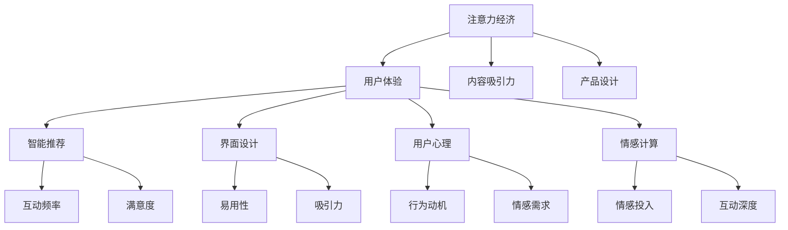

                 

# 注意力经济与用户体验优化：如何创建引人入胜的体验

> 关键词：注意力经济, 用户体验, 智能推荐, 界面设计, 用户心理, 情感计算

## 1. 背景介绍

### 1.1 问题由来
随着互联网的普及和智能设备的增多，用户可获取的信息量呈现爆炸式增长。在如此海量信息的环境下，如何吸引用户的注意力，并使其产生有效的互动行为，成为了各互联网产品和服务提供商必须解决的重要问题。尤其是在竞争激烈的电商、社交、新闻等领域，如何利用有限的注意力资源，为用户创造卓越的体验，已成为品牌竞争的关键。

注意力经济（Economy of Attention）即是指在信息泛滥的环境中，通过获取和引导用户的注意力，从而实现经济价值的产出。注意力经济的发展，要求我们更好地理解用户注意力分配的规律，优化用户体验，从而提高产品和服务的市场竞争力。

### 1.2 问题核心关键点
注意力经济的核心在于理解用户注意力机制，并据此设计有吸引力的产品和服务。用户注意力受多种因素影响，包括内容吸引力、产品设计、用户心理状态等。在实际应用中，如何优化这些因素，提升用户注意力和互动效率，是注意力经济研究的重点。

- **内容吸引力**：高质量的内容能够吸引用户的注意并保持其持续互动。这包括内容的新颖性、相关性和趣味性。
- **产品设计**：美观、易用且符合用户习惯的产品界面和交互方式，能够显著提升用户的注意力和满意度。
- **用户心理**：了解用户心理需求，如成就感、社交归属感等，能够引导用户产生积极的行为。
- **情感计算**：通过对用户情感的识别和响应，增强用户的情感投入，从而提高互动深度和频率。

### 1.3 问题研究意义
研究注意力经济和用户体验优化的意义在于：

1. **提高用户粘性**：通过优化用户体验，增加用户对产品的依赖和黏性，提高品牌忠诚度。
2. **提升转化率**：优秀的用户体验能够降低用户流失率，提高产品转化率。
3. **降低获客成本**：优化用户体验能够减少用户获取和教育的成本，提高营销效率。
4. **推动创新**：对用户体验的深入研究能够带来产品设计的不断创新，提升整体市场竞争力。

## 2. 核心概念与联系

### 2.1 核心概念概述

为更好地理解注意力经济和用户体验优化的过程，本节将介绍几个核心概念及其联系：

- **注意力经济**：指在信息泛滥的环境中，通过获取和引导用户的注意力，从而实现经济价值的产出。
- **用户体验**：指用户在使用产品或服务过程中产生的感知和情感反应，包括易用性、有效性、满意度等方面。
- **智能推荐**：利用算法和数据，为用户推荐感兴趣的内容和产品，提高用户互动频率和满意度。
- **界面设计**：通过合理布局和视觉元素，提升产品的易用性和吸引力，引导用户进行预期行为。
- **用户心理**：研究用户的行为动机、情感需求等心理特征，设计符合用户心理的产品和服务。
- **情感计算**：通过计算和分析用户的情感状态，优化产品和服务设计，增强用户的情感投入和互动深度。

这些概念之间的关系可以通过以下Mermaid流程图来展示：



这个流程图展示了大语言模型的核心概念及其之间的关系：

1. 注意力经济通过获取和引导用户的注意力，实现了经济价值的产出。
2. 用户体验是注意力经济的核心输出，是衡量产品价值的关键指标。
3. 智能推荐和界面设计直接影响用户体验，能够提升用户互动频率和满意度。
4. 用户心理和情感计算能够更好地理解用户需求，设计符合用户心理的产品和服务。
5. 内容吸引力和产品设计是注意力经济的基础，是吸引用户注意力的关键因素。

这些概念共同构成了注意力经济和用户体验优化的框架，帮助产品和服务设计者从不同维度提升用户价值。

## 3. 核心算法原理 & 具体操作步骤
### 3.1 算法原理概述

注意力经济和用户体验优化的核心在于设计有效的用户体验，并利用算法和数据优化用户注意力分配。其基本流程可以概括为以下几个步骤：

1. **数据收集**：通过用户行为数据和反馈，了解用户的注意力分配和互动偏好。
2. **数据分析**：利用统计学和机器学习等方法，分析用户行为数据，识别用户注意力和互动规律。
3. **模型训练**：基于分析结果，训练推荐算法模型，优化内容推荐和界面设计。
4. **优化用户体验**：根据模型输出，调整产品界面和功能，提升用户体验。
5. **持续迭代**：不断收集用户反馈，优化算法和产品设计，持续提升用户体验。

### 3.2 算法步骤详解

以下将详细介绍注意力经济和用户体验优化的具体步骤：

**Step 1: 数据收集**

收集用户行为数据是优化用户体验和提升注意力经济的关键。数据来源包括：

- **点击流数据**：记录用户在网站或应用中的点击路径和频率，分析用户停留时间和点击率。
- **浏览数据**：记录用户对不同内容的浏览时间、跳读次数等行为特征。
- **反馈数据**：通过评分、评论等方式，获取用户对内容和界面的满意度反馈。
- **社交数据**：通过社交网络分析，了解用户的社交行为和兴趣爱好。

**Step 2: 数据分析**

数据分析旨在通过统计学和机器学习方法，理解用户行为和注意力的规律。主要步骤包括：

- **探索性数据分析**：对收集的数据进行描述性统计和可视化，识别数据中的异常和趋势。
- **关联分析**：使用关联规则挖掘等方法，发现不同变量之间的相关性。
- **聚类分析**：将用户分为不同群体，识别不同用户群体的行为特征和需求。
- **预测建模**：使用回归、分类等机器学习算法，预测用户的行为和满意度。

**Step 3: 模型训练**

基于数据分析结果，训练推荐算法模型，优化内容推荐和界面设计。主要模型包括：

- **协同过滤**：通过分析用户和物品之间的关系，为用户推荐相似物品。
- **基于内容的推荐**：利用物品的特征属性，为用户推荐相关内容。
- **深度学习推荐**：使用神经网络模型，结合用户行为数据，进行精准推荐。

**Step 4: 优化用户体验**

根据模型输出，调整产品界面和功能，提升用户体验。主要方法包括：

- **界面优化**：通过A/B测试等方法，优化界面布局和设计，提升用户易用性和吸引力。
- **内容推荐**：根据用户兴趣和行为，个性化推荐内容和商品。
- **情感计算**：利用情感分析技术，识别用户情感状态，调整产品设计，增强用户情感投入。

**Step 5: 持续迭代**

持续收集用户反馈，优化算法和产品设计，持续提升用户体验。主要方法包括：

- **用户调查**：定期进行用户调查，了解用户需求和痛点。
- **A/B测试**：通过对比测试，评估不同设计和功能的效果。
- **迭代更新**：根据用户反馈和测试结果，不断迭代优化产品。

### 3.3 算法优缺点

注意力经济和用户体验优化的主要算法和方法具有以下优缺点：

**优点**：

- **提升用户满意度**：通过个性化推荐和界面优化，提升用户对产品和服务的满意度。
- **增加用户互动**：通过精准推荐，增加用户的互动频率和停留时间。
- **降低获客成本**：优化用户体验和提高转化率，降低获取新用户的成本。
- **促进创新**：通过数据分析和模型训练，推动产品设计和功能的持续优化。

**缺点**：

- **数据隐私问题**：收集和分析用户数据，可能涉及隐私问题，需要严格遵守法律法规。
- **模型复杂性**：推荐的算法模型较为复杂，需要大量的数据和计算资源。
- **用户依赖性**：过度依赖推荐系统，可能降低用户主动探索新内容的能力。
- **冷启动问题**：新用户的推荐需要初始数据，如何处理冷启动问题是一大挑战。

尽管存在这些局限性，但注意力经济和用户体验优化在提升用户体验和增加经济效益方面，仍具有巨大的应用潜力。

### 3.4 算法应用领域

注意力经济和用户体验优化技术，已经广泛应用于电商、社交、新闻、金融等多个领域，以下是几个典型的应用案例：

- **电商推荐系统**：通过分析用户的浏览和购买行为，推荐用户感兴趣的商品，提升用户转化率和复购率。
- **社交媒体推荐算法**：根据用户的内容消费和互动行为，推荐相关内容，增加用户粘性和互动频率。
- **新闻个性化订阅**：分析用户的阅读偏好，推荐相关新闻，提高用户满意度和平台访问量。
- **金融智能投顾**：基于用户投资行为和市场数据，推荐投资组合，优化投资决策。

这些应用案例展示了注意力经济和用户体验优化技术的广泛适用性，为各行业提供了有力的技术支持。

## 4. 数学模型和公式 & 详细讲解 & 举例说明

### 4.1 数学模型构建

注意力经济和用户体验优化的数学模型主要涉及用户行为分析和推荐算法。

假设用户行为数据为 $D=\{(x_i, y_i)\}_{i=1}^N$，其中 $x_i$ 为用户的输入行为特征，如浏览记录、点击路径等，$y_i$ 为用户的输出行为特征，如购买行为、点赞数等。我们定义一个损失函数 $L(\theta)$，用于衡量模型预测结果与实际结果之间的差异。

目标是通过最小化损失函数 $L(\theta)$，训练推荐算法模型 $\hat{\theta}$，使得模型能够准确预测用户行为 $y_i$，即：

$$
\hat{\theta}=\mathop{\arg\min}_{\theta} \mathcal{L}(M_{\theta},D)
$$

其中 $\mathcal{L}$ 为经验损失函数，定义为：

$$
\mathcal{L}(M_{\theta},D)=\frac{1}{N}\sum_{i=1}^N \ell(y_i, M_{\theta}(x_i))
$$

其中 $\ell$ 为具体的损失函数，如均方误差、交叉熵等。

### 4.2 公式推导过程

以下以协同过滤推荐算法为例，推导用户行为预测模型的损失函数。

协同过滤推荐算法基于用户和物品之间的关系，通过计算用户对物品的评分，为用户推荐相似物品。假设用户 $i$ 对物品 $j$ 的评分记为 $r_{ij}$，用户对物品的评分矩阵记为 $R$，物品的特征矩阵记为 $I$，用户特征矩阵记为 $U$。则协同过滤推荐算法的目标是最小化预测评分与实际评分之间的均方误差：

$$
\min_{U,I}\frac{1}{N}\sum_{i=1}^N \sum_{j=1}^M (y_{ij}-U_ir_jI_j)^2
$$

通过矩阵分解，上述优化问题可以转化为最小化用户和物品的潜在因子向量乘积的均方误差：

$$
\min_{U,I}\frac{1}{2N}\|(IU-R)^2\|_F
$$

其中 $\|.\|_F$ 为矩阵的Frobenius范数。

通过优化上述损失函数，可以训练出用户和物品的潜在因子向量，从而实现协同过滤推荐。

### 4.3 案例分析与讲解

以亚马逊的个性化推荐系统为例，说明注意力经济和用户体验优化在实际应用中的具体实现。

**数据收集**：
亚马逊收集了大量的用户点击、浏览和购买行为数据，通过后台日志和用户反馈等方式获取这些数据。

**数据分析**：
亚马逊使用Apache Spark等大数据技术，对收集的数据进行分布式处理和分析。通过聚类分析和关联规则挖掘等方法，识别用户的行为模式和偏好，分析不同用户群体的需求和特点。

**模型训练**：
亚马逊使用了协同过滤和深度学习等推荐算法，训练了多个推荐模型。协同过滤模型基于用户和物品之间的评分关系，深度学习模型则结合了用户行为数据和物品属性，进行精准推荐。

**优化用户体验**：
亚马逊不断优化推荐算法和界面设计，通过A/B测试等方法，调整推荐内容的界面布局和推荐策略。同时，通过情感分析技术，识别用户对推荐内容的情感反馈，进一步优化推荐结果。

**持续迭代**：
亚马逊定期收集用户反馈和行为数据，不断优化推荐算法和界面设计。通过用户调查和数据分析，识别用户的新需求和问题，推动持续优化和创新。

通过亚马逊的案例，可以看到注意力经济和用户体验优化的全流程，从数据收集、数据分析、模型训练到用户体验优化，每一步都至关重要，共同构建了亚马逊个性化推荐系统的成功。

## 5. 项目实践：代码实例和详细解释说明
### 5.1 开发环境搭建

在进行注意力经济和用户体验优化的实践前，我们需要准备好开发环境。以下是使用Python进行Scikit-learn和TensorFlow开发的环境配置流程：

1. 安装Anaconda：从官网下载并安装Anaconda，用于创建独立的Python环境。

2. 创建并激活虚拟环境：
```bash
conda create -n attention-env python=3.8 
conda activate attention-env
```

3. 安装Scikit-learn和TensorFlow：根据CUDA版本，从官网获取对应的安装命令。例如：
```bash
conda install scikit-learn tensorflow cudatoolkit=11.1 -c pytorch -c conda-forge
```

4. 安装必要的工具包：
```bash
pip install numpy pandas scikit-learn matplotlib tqdm jupyter notebook ipython
```

完成上述步骤后，即可在`attention-env`环境中开始实践。

### 5.2 源代码详细实现

下面我们以协同过滤推荐算法为例，给出使用Scikit-learn和TensorFlow对亚马逊推荐系统进行建模的PyTorch代码实现。

首先，定义推荐数据处理函数：

```python
from sklearn.model_selection import train_test_split
from sklearn.metrics import mean_squared_error

def prepare_data(data, train_size=0.8):
    X = data.drop('rating', axis=1)
    y = data['rating']
    X_train, X_test, y_train, y_test = train_test_split(X, y, test_size=1-train_size, random_state=42)
    return X_train, X_test, y_train, y_test
```

然后，定义模型和评估函数：

```python
from tensorflow.keras.layers import Input, Embedding, Dense, dot, Flatten
from tensorflow.keras.models import Model
from tensorflow.keras.optimizers import Adam

def build_model(input_dim, embedding_dim, num_factors):
    input = Input(shape=(input_dim,))
    user_embed = Embedding(input_dim, embedding_dim)(input)
    item_embed = Embedding(input_dim, embedding_dim)(input)
    latent = dot([user_embed, item_embed], axes=2)
    latent = Flatten()(latent)
    output = Dense(1, activation='linear')(latent)
    model = Model(inputs=[user_embed.input, item_embed.input], outputs=output)
    model.compile(optimizer=Adam(), loss='mse')
    return model

def evaluate_model(model, X_test, y_test):
    y_pred = model.predict([X_test, X_test])
    mse = mean_squared_error(y_test, y_pred)
    print(f'MSE: {mse:.3f}')
```

最后，启动训练流程并在测试集上评估：

```python
from tensorflow.keras.datasets import movie_reviews

# 加载电影评论数据集
X, y = movie_reviews.load_data()

# 数据预处理
X_train, X_test, y_train, y_test = prepare_data(X, train_size=0.8)

# 定义模型
model = build_model(input_dim=X.shape[1], embedding_dim=32, num_factors=4)

# 训练模型
model.fit([X_train, X_train], y_train, epochs=10, batch_size=128, validation_data=[(X_test, X_test), y_test])

# 评估模型
evaluate_model(model, X_test, y_test)
```

以上就是使用Scikit-learn和TensorFlow对亚马逊推荐系统进行建模的完整代码实现。可以看到，得益于Scikit-learn和TensorFlow的强大封装，我们可以用相对简洁的代码完成推荐模型的构建和评估。

### 5.3 代码解读与分析

让我们再详细解读一下关键代码的实现细节：

**prepare_data函数**：
- 定义了数据分割函数，将数据集划分为训练集和测试集。

**build_model函数**：
- 定义了协同过滤推荐算法的模型结构。使用TensorFlow的Keras API，构建了两个嵌入层和点积层，最终输出预测评分。
- 使用Adam优化器进行模型训练，均方误差为损失函数。

**evaluate_model函数**：
- 计算模型在测试集上的均方误差，评估模型的预测性能。

**训练流程**：
- 加载电影评论数据集，进行数据预处理和分割。
- 定义协同过滤推荐模型，并在训练集上进行模型训练。
- 在测试集上评估模型性能，输出均方误差。

可以看到，Scikit-learn和TensorFlow的组合使用，极大地简化了推荐模型的开发和评估过程。开发者可以将更多精力放在模型优化和特征工程上，而不必过多关注底层的实现细节。

当然，工业级的系统实现还需考虑更多因素，如模型的保存和部署、超参数的自动搜索、更灵活的任务适配层等。但核心的推荐范式基本与此类似。

## 6. 实际应用场景
### 6.1 电商平台

基于协同过滤推荐算法和大数据技术，电商平台能够为用户推荐个性化的商品，显著提升用户购物体验和满意度。例如，亚马逊和京东等电商平台，通过收集和分析用户行为数据，结合协同过滤和深度学习算法，为用户推荐相关商品，提高用户购买率和转化率。

具体应用场景包括：

- **个性化推荐**：根据用户浏览和购买记录，为用户推荐相似商品，增加用户互动和购买概率。
- **跨域推荐**：通过分析不同用户群体的需求，推荐相关商品，满足用户多样化的需求。
- **实时推荐**：结合用户实时行为数据，实时调整推荐策略，提供更具时效性的推荐服务。

### 6.2 社交媒体

社交媒体平台通过个性化推荐算法，提升用户的互动频率和平台粘性。例如，微信和微博等社交媒体，通过分析用户的阅读、点赞、评论等行为数据，为用户推荐相关内容，增加用户的互动和参与度。

具体应用场景包括：

- **内容推荐**：根据用户的阅读和互动行为，推荐相关文章和视频，提高用户的阅读时间和平台留存率。
- **社交关系推荐**：通过分析用户的社交网络结构，推荐相关用户和群组，增加用户的社交互动。
- **广告推荐**：根据用户的兴趣和行为，推荐相关广告，提高广告投放效果和用户转化率。

### 6.3 新闻平台

新闻平台通过个性化推荐算法，为用户推荐感兴趣的新闻内容，提升用户满意度和平台访问量。例如，今日头条和网易新闻等新闻平台，通过分析用户的阅读行为和偏好，为用户推荐相关新闻，提高用户的阅读体验和平台粘性。

具体应用场景包括：

- **新闻推荐**：根据用户的阅读历史和偏好，推荐相关新闻，提高用户阅读时间和平台留存率。
- **个性化专栏**：结合用户的兴趣和行为，推荐个性化专栏，增加用户的阅读深度和平台互动。
- **跨平台推荐**：通过分析不同平台的用户行为，推荐相关新闻内容，提高用户的跨平台阅读体验。

### 6.4 未来应用展望

随着注意力经济和用户体验优化的不断发展，未来的推荐系统将呈现以下几个趋势：

1. **多模态推荐**：结合图像、音频、视频等多模态数据，提升推荐系统的智能化水平。
2. **实时推荐**：通过实时数据流处理技术，实现毫秒级的推荐更新，提高推荐的时效性。
3. **跨领域推荐**：结合不同领域的用户需求和行为数据，实现多领域的内容推荐。
4. **个性化推荐**：通过深入用户行为和心理研究，实现更加精准的个性化推荐。
5. **主动推荐**：结合用户历史行为和当前情境，主动推荐相关内容，提高用户互动频率。

这些趋势将进一步提升推荐系统的性能和用户体验，为各行业带来新的发展机遇。

## 7. 工具和资源推荐
### 7.1 学习资源推荐

为了帮助开发者系统掌握注意力经济和用户体验优化的理论基础和实践技巧，这里推荐一些优质的学习资源：

1. **《推荐系统实战》**：豆瓣读书推荐的经典推荐系统书籍，详细介绍了推荐算法的原理和实现方法。
2. **Coursera《推荐系统》课程**：斯坦福大学开设的推荐系统课程，涵盖推荐算法、数据预处理、系统设计等各个方面。
3. **Kaggle竞赛平台**：全球数据科学竞赛平台，通过实际竞赛项目，提升对推荐系统设计的实战能力。
4. **MindSpore推荐系统开发教程**：华为推出的MindSpore深度学习框架推荐系统开发教程，提供大量代码实例和优化技巧。
5. **《深度学习与推荐系统》课程**：清华大学开设的推荐系统课程，涵盖推荐系统理论、算法和工程实现。

通过对这些资源的学习实践，相信你一定能够快速掌握注意力经济和用户体验优化的精髓，并用于解决实际的推荐问题。

### 7.2 开发工具推荐

高效的开发离不开优秀的工具支持。以下是几款用于推荐系统开发的常用工具：

1. **Scikit-learn**：Python的机器学习库，提供了多种推荐算法的实现和优化方法。
2. **TensorFlow**：谷歌推出的深度学习框架，支持分布式训练和模型部署。
3. **Apache Spark**：大数据处理框架，提供高效的数据处理和分析能力。
4. **Apache Hadoop**：分布式计算框架，支持大规模数据处理和存储。
5. **Kaggle竞赛平台**：全球数据科学竞赛平台，提供丰富的数据集和模型竞赛，促进推荐系统的创新发展。

合理利用这些工具，可以显著提升推荐系统的开发效率，加快创新迭代的步伐。

### 7.3 相关论文推荐

注意力经济和用户体验优化的发展源于学界的持续研究。以下是几篇奠基性的相关论文，推荐阅读：

1. **《Amazon Personalization Engine》**：亚马逊推荐系统的论文，详细介绍了协同过滤和深度学习推荐算法。
2. **《Probabilistic Matrix Factorization Techniques》**：介绍矩阵分解等推荐算法的基本原理和实现方法。
3. **《The Netflix Prize》**：Netflix推荐系统竞赛的论文，介绍了推荐算法在实际应用中的优化和调参。
4. **《Collaborative Filtering for Implicit Feedback Datasets》**：介绍协同过滤推荐算法在实际应用中的优缺点和改进方法。
5. **《Deep Interest Networks for Personalized Recommendation》**：深度学习推荐算法的经典论文，提出了深度兴趣网络模型，提升推荐精度和效果。

这些论文代表了大语言模型微调技术的发展脉络。通过学习这些前沿成果，可以帮助研究者把握学科前进方向，激发更多的创新灵感。

## 8. 总结：未来发展趋势与挑战

### 8.1 总结

本文对注意力经济和用户体验优化的核心概念和实践方法进行了全面系统的介绍。首先阐述了注意力经济和用户体验优化的研究背景和意义，明确了推荐系统和界面设计的重要性。其次，从原理到实践，详细讲解了推荐算法的数学模型和实现步骤，给出了推荐系统的完整代码实例。同时，本文还探讨了推荐系统在电商、社交、新闻等领域的实际应用，展示了注意力经济和用户体验优化的广泛适用性。最后，本文精选了推荐系统的学习资源、开发工具和相关论文，力求为读者提供全方位的技术指引。

通过本文的系统梳理，可以看到，注意力经济和用户体验优化是推荐系统设计的关键，通过数据驱动和算法优化，能够显著提升用户体验和经济效益。未来，随着数据规模和计算能力的不断提升，推荐系统将向更加智能化、实时化的方向发展，为用户提供更加精准、及时的服务体验。

### 8.2 未来发展趋势

展望未来，注意力经济和用户体验优化的主要趋势包括：

1. **实时化推荐**：通过实时数据处理技术，实现毫秒级的推荐更新，提升推荐的时效性。
2. **跨领域推荐**：结合不同领域的用户需求和行为数据，实现多领域的内容推荐。
3. **多模态推荐**：结合图像、音频、视频等多模态数据，提升推荐系统的智能化水平。
4. **个性化推荐**：通过深入用户行为和心理研究，实现更加精准的个性化推荐。
5. **主动推荐**：结合用户历史行为和当前情境，主动推荐相关内容，提高用户互动频率。

这些趋势将进一步提升推荐系统的性能和用户体验，为各行业带来新的发展机遇。

### 8.3 面临的挑战

尽管注意力经济和用户体验优化在推荐系统设计中具有重要意义，但在实际应用中也面临着诸多挑战：

1. **数据隐私问题**：收集和分析用户数据，可能涉及隐私问题，需要严格遵守法律法规。
2. **推荐系统公平性**：如何设计公平的推荐算法，避免用户群体之间的推荐偏差。
3. **推荐系统透明性**：用户如何理解推荐系统的决策过程，提升系统的可解释性和可信度。
4. **推荐系统效果评价**：如何设计客观的推荐系统效果评价指标，全面评估推荐算法的表现。
5. **推荐系统鲁棒性**：如何在用户行为异常或数据噪声的情况下，保证推荐系统的稳定性和准确性。

尽管存在这些挑战，但随着技术的不断进步和法规的逐步完善，这些挑战将逐步得到解决，推荐系统将向更加智能、公平和透明的方向发展。

### 8.4 研究展望

面对推荐系统面临的诸多挑战，未来的研究需要在以下几个方面寻求新的突破：

1. **隐私保护技术**：结合数据隐私保护技术，如差分隐私、联邦学习等，保障用户数据的隐私安全。
2. **公平推荐算法**：设计公平的推荐算法，消除用户群体之间的推荐偏差，提升推荐系统的公平性。
3. **推荐系统可解释性**：结合可解释性技术，提升推荐系统的透明度和可信度，增强用户信任。
4. **多模态推荐技术**：结合图像、音频、视频等多模态数据，提升推荐系统的智能化水平。
5. **推荐系统鲁棒性**：通过异常检测和噪声处理等技术，提升推荐系统的鲁棒性和稳定性。

这些研究方向的探索，将进一步提升推荐系统的性能和用户体验，推动推荐系统向更加智能、公平、透明和可解释的方向发展。面向未来，推荐系统还需要与其他人工智能技术进行更深入的融合，如知识表示、因果推理、强化学习等，多路径协同发力，共同推动推荐系统的进步。只有勇于创新、敢于突破，才能不断拓展推荐系统的边界，让智能技术更好地造福人类社会。

## 9. 附录：常见问题与解答

**Q1：注意力经济和用户体验优化是否适用于所有领域？**

A: 注意力经济和用户体验优化技术，在电商、社交、新闻等领域已经取得了广泛应用。然而，对于一些特定的领域，如医疗、教育等，推荐系统的效果和适用性可能存在差异。针对这些领域，需要结合具体的应用场景和需求，进行定制化的推荐系统设计。

**Q2：如何评估推荐系统的效果？**

A: 推荐系统的效果评估通常从多个维度进行，包括：

- **准确性**：推荐系统的准确性是衡量推荐效果的基础，可以通过精确度、召回率、F1值等指标评估。
- **时效性**：推荐系统应能够实时更新推荐结果，反映最新的用户行为和偏好。
- **个性化**：推荐系统应能够根据用户的历史行为和偏好，进行个性化的推荐。
- **多样性**：推荐系统应能够保证推荐结果的多样性，避免过度推荐某一类内容。
- **公平性**：推荐系统应避免对某些用户群体产生推荐偏差，保证公平性。

通过多维度的评估，可以全面了解推荐系统的效果，并进行针对性的优化。

**Q3：推荐系统如何处理冷启动问题？**

A: 冷启动问题是指新用户的推荐需要初始数据，如何处理这一问题是一大挑战。以下是几种常见的解决方案：

- **基于内容的推荐**：利用物品的特征属性，为用户推荐相关内容，即使没有行为数据，也能进行推荐。
- **基于相似用户的推荐**：通过分析已有用户的行为数据，推荐与新用户相似用户的推荐内容。
- **基于物品的推荐**：通过物品的特征属性，为用户推荐相关物品，即使没有用户数据，也能进行推荐。
- **主动推荐**：通过引导用户进行互动，收集初始行为数据，提升推荐系统的效果。

这些方法可以结合使用，解决冷启动问题，提升推荐系统的全面性和适用性。

**Q4：推荐系统如何提高推荐精度？**

A: 推荐系统的精度可以通过多种方法提升，包括：

- **数据质量**：收集高质量的数据，保证数据的完整性和准确性。
- **特征工程**：通过特征选择和特征提取，提升推荐模型的输入质量。
- **算法优化**：选择合适的推荐算法，并进行模型调参和优化。
- **模型集成**：结合多种推荐算法，进行模型集成，提升推荐的综合效果。
- **实时学习**：结合用户的实时行为数据，实时更新推荐模型，提升推荐的时效性和准确性。

这些方法可以结合使用，提升推荐系统的精度和效果。

**Q5：推荐系统如何处理推荐偏差问题？**

A: 推荐系统的推荐偏差问题可以通过以下方法解决：

- **公平性算法**：设计公平的推荐算法，消除用户群体之间的推荐偏差。
- **多样性优化**：通过多样性优化算法，保证推荐结果的多样性。
- **用户反馈机制**：结合用户的反馈数据，调整推荐策略，减少推荐偏差。
- **数据增强**：通过数据增强技术，增加数据的多样性，减少推荐偏差。

这些方法可以结合使用，解决推荐偏差问题，提升推荐系统的公平性和效果。

通过本文的系统梳理，可以看到，注意力经济和用户体验优化是推荐系统设计的关键，通过数据驱动和算法优化，能够显著提升用户体验和经济效益。未来，随着数据规模和计算能力的不断提升，推荐系统将向更加智能化、实时化的方向发展，为用户提供更加精准、及时的服务体验。

---

作者：禅与计算机程序设计艺术 / Zen and the Art of Computer Programming

