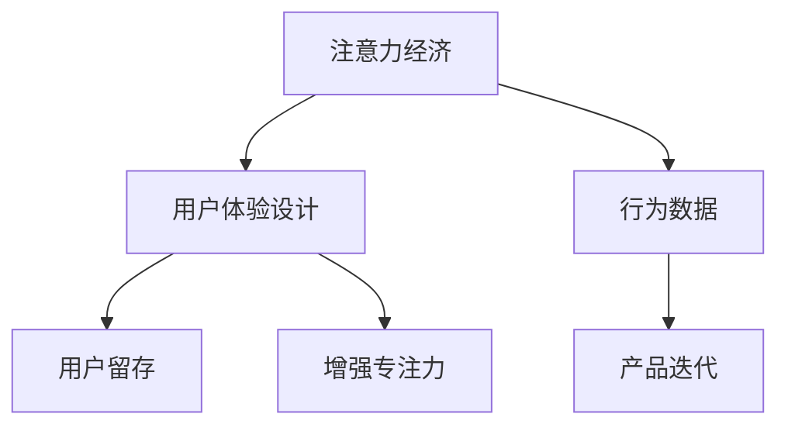

                 

# 注意力经济与用户体验设计：创建引人入胜、增强专注力的产品

> 关键词：注意力经济, 用户体验设计, 用户留存, 增强专注力, 行为数据, 产品迭代

## 1. 背景介绍

### 1.1 问题由来
在数字经济时代，信息过载成为普遍现象。海量的数据和内容争夺用户的注意力资源，使得用户变得更加分散，难以长时间集中精力。这不仅影响了用户体验，也给企业带来了严峻的挑战。如何在信息洪流中吸引并留住用户，成为当今互联网企业的核心难题。

为此，注意力经济应运而生，它强调通过精准的策略设计和数据分析，将用户有限的注意力资源最大化地转化为商业价值。与此同时，用户体验设计(UX Design)也逐渐成为企业竞争的重要焦点，优秀的用户体验能够有效提升用户满意度和忠诚度，从而促进长期留存和消费转化。

在注意力经济和用户体验的双重驱动下，如何打造引人入胜且高效专注的产品，成为企业不断探索的方向。本文将系统介绍注意力经济与用户体验设计的核心概念和关键技术，并结合实际案例，提供实用的产品开发建议。

### 1.2 问题核心关键点
本文将围绕以下核心问题展开：
1. 如何通过数据驱动的策略设计，吸引并留住用户的注意力？
2. 如何利用用户体验设计提升用户满意度和忠诚度？
3. 如何平衡产品功能与用户体验，打造高效专注的产品？

## 2. 核心概念与联系

### 2.1 核心概念概述

注意力经济和用户体验设计密切相关，两者的结合能够有效地提升产品的吸引力和用户黏性。以下是对相关核心概念的概述：

- **注意力经济**：通过精准设计，将用户有限的注意力资源最大化地转化为商业价值。主要包括用户注意力获取、保持和转化的策略设计。

- **用户体验设计**：以用户为中心，通过界面、交互、内容等设计，提升用户满意度和忠诚度，增加用户留存和转化。

- **用户留存**：通过一系列策略，如个性化推荐、动态定价、激励机制等，增加用户对产品的黏性，减少流失率。

- **增强专注力**：通过优化界面设计、减少干扰因素、强化内容相关性等手段，提升用户专注力，减少分心。

- **行为数据**：通过追踪用户行为数据，分析用户偏好和行为模式，进行精准营销和产品迭代。

这些概念之间的逻辑关系可以通过以下Mermaid流程图来展示：



这个流程图展示了注意力经济与用户体验设计的主要构成要素及其相互关系：

1. 注意力经济通过精准的策略设计，吸引并留住用户注意力。
2. 用户体验设计通过提升用户满意度，增加用户留存和转化。
3. 用户留存和增强专注力是注意力经济和用户体验设计的最终目标。
4. 行为数据驱动产品迭代，不断优化产品功能和用户体验。

## 3. 核心算法原理 & 具体操作步骤

### 3.1 算法原理概述

注意力经济和用户体验设计涉及多个技术领域的融合，包括数据分析、机器学习、行为心理学等。其核心算法原理主要包括以下几点：

1. **注意力获取**：通过个性化推荐、动态定价、用户标签等策略，提升用户对产品的关注度。
2. **用户行为分析**：利用数据挖掘和机器学习技术，分析用户行为模式和偏好，提供精准的产品体验。
3. **注意力保持**：通过增强互动性、引入激励机制等手段，保持用户长时间关注。
4. **用户留存和转化**：通过个性化服务、生命周期管理等策略，增加用户黏性和消费转化。
5. **增强专注力**：通过界面优化、内容推荐、减少干扰等技术，提升用户专注度。

### 3.2 算法步骤详解

基于上述原理，注意力经济和用户体验设计的具体实施步骤如下：

**Step 1: 数据采集与分析**
- 收集用户行为数据，如点击、浏览、购买等行为。
- 分析用户兴趣、行为模式和消费习惯，构建用户画像。

**Step 2: 策略设计**
- 设计个性化推荐、动态定价、激励机制等策略，吸引用户注意力。
- 利用用户体验设计原则，提升用户满意度和体验。

**Step 3: 行为数据驱动的产品迭代**
- 利用行为数据进行A/B测试，优化产品功能和用户体验。
- 根据用户反馈和行为数据，不断迭代产品，提升用户留存和转化率。

**Step 4: 增强专注力**
- 优化界面设计，减少干扰因素，提升用户专注度。
- 引入行为科学原理，增强内容的吸引力和相关性。

**Step 5: 持续优化**
- 持续监测用户行为数据，及时调整策略和设计。
- 结合最新技术和市场趋势，不断优化产品，保持竞争力。

### 3.3 算法优缺点

注意力经济和用户体验设计的优点在于：
1. 通过数据驱动，提升策略的有效性和精准性。
2. 提升用户满意度和忠诚度，增加用户留存和转化。
3. 优化界面设计和内容推荐，提升用户专注力。

其缺点主要在于：
1. 数据隐私和安全问题。行为数据的收集和分析需要处理大量的个人隐私信息。
2. 策略设计的复杂性和成本。策略设计需要精细化运营和持续投入。
3. 用户偏好的多样性和多变性。个性化策略需要不断调整和优化。

### 3.4 算法应用领域

注意力经济和用户体验设计已经在多个领域得到了广泛应用，以下是几个典型案例：

- **电商**：通过个性化推荐和动态定价，提升用户购买率和消费转化。
- **社交媒体**：通过精准的广告投放和用户行为分析，增加用户黏性和互动。
- **在线教育**：通过个性化的课程推荐和学习路径设计，提升学习效果和用户满意度。
- **内容平台**：通过内容推荐和用户体验优化，增加用户停留时间和内容消费。
- **金融科技**：通过精准的风险评估和个性化服务，提升用户信任和忠诚度。

## 4. 数学模型和公式 & 详细讲解 & 举例说明

### 4.1 数学模型构建

注意力经济和用户体验设计的数学模型构建主要围绕以下几个方面展开：

- **用户兴趣预测**：通过协同过滤、协同聚类等方法，预测用户对不同内容的兴趣。
- **个性化推荐系统**：利用协同过滤、深度学习等技术，提供个性化的推荐内容。
- **行为分析模型**：通过逻辑回归、决策树、神经网络等方法，分析用户行为模式和偏好。

### 4.2 公式推导过程

以下以协同过滤模型为例，介绍用户兴趣预测的数学模型和推导过程。

设用户集为 $U$，物品集为 $I$，用户对物品的评分矩阵为 $R_{U\times I}$，用户的邻域为 $N(u)$，协同过滤模型基于用户之间的相似度计算预测，公式如下：

$$
\hat{R}_{ui} = \sum_{v \in N(u)} \frac{R_{uv}}{\sqrt{\sum_{k \in N(u)} R_{uk}^2 + \epsilon} \sqrt{\sum_{k \in N(u)} R_{kv}^2 + \epsilon}} \times \frac{1}{\sqrt{\sum_{k \in N(v)} R_{kv}^2 + \epsilon} \sqrt{\sum_{k \in N(v)} R_{ku}^2 + \epsilon}}
$$

其中 $\epsilon$ 为避免分母为零的平滑项。

该公式通过计算用户 $u$ 与其邻域 $N(u)$ 中的用户 $v$ 的相似度，并基于该相似度计算预测用户 $u$ 对物品 $i$ 的评分 $\hat{R}_{ui}$。

### 4.3 案例分析与讲解

**案例一：亚马逊个性化推荐系统**
亚马逊利用协同过滤模型，根据用户的历史购买记录，向用户推荐相关商品。通过不断优化算法和调整用户画像，亚马逊能够提供高度个性化的推荐，显著提升用户购买率和留存率。

**案例二：Netflix内容推荐**
Netflix通过协同过滤和深度学习模型，分析用户观看历史和行为数据，为用户推荐个性化的电影和电视剧。其推荐系统能够准确预测用户可能感兴趣的内容，提升用户满意度和忠诚度。

## 5. 项目实践：代码实例和详细解释说明

### 5.1 开发环境搭建

在实际开发中，我们建议使用Python作为开发语言，并使用TensorFlow或PyTorch等深度学习框架进行模型构建和训练。以下是基本的开发环境配置步骤：

1. 安装Python：在官网下载并安装Python 3.8及以上版本。
2. 安装TensorFlow或PyTorch：根据系统环境，安装对应的深度学习框架，建议使用GPU环境。
3. 安装相关库：安装numpy、pandas、scikit-learn等常用的Python科学计算库。

### 5.2 源代码详细实现

以亚马逊个性化推荐系统为例，介绍协同过滤模型的代码实现。

```python
import numpy as np
import pandas as pd
from sklearn.metrics.pairwise import cosine_similarity
from scipy.sparse import coo_matrix

def collaborative_filtering(ratings, similarity_threshold=0.5):
    """
    协同过滤推荐系统
    """
    # 构建用户-物品评分矩阵
    R = pd.DataFrame(ratings, columns=['item_id'], index=['user_id'])
    
    # 计算用户间的相似度
    user_sims = cosine_similarity(R.dropna().values, R.dropna().values)
    user_sims = coo_matrix(user_sims).tocsr()
    
    # 计算物品间的相似度
    item_sims = cosine_similarity(R.T.dropna().values, R.T.dropna().values)
    item_sims = coo_matrix(item_sims).tocsr()
    
    # 计算预测评分
    predictions = np.dot(user_sims, R.T)
    predictions = predictions / (np.dot(user_sims.sum(1), item_sims) + 1e-10)
    
    # 筛选相似用户
    similar_users = np.where(user_sims.sum(1) > similarity_threshold)[0]
    
    # 推荐物品
    recommended_items = R.dropna().values[similar_users]
    return recommended_items

# 示例数据
ratings = {
    'user1': {'item1': 4, 'item2': 2, 'item3': 5},
    'user2': {'item1': 4, 'item3': 5, 'item4': 3},
    'user3': {'item2': 4, 'item3': 2, 'item4': 1}
}

recommendations = collaborative_filtering(ratings)
print(recommendations)
```

### 5.3 代码解读与分析

**代码解析**：
1. 通过pandas构建用户-物品评分矩阵 `R`。
2. 计算用户间的相似度 `user_sims` 和物品间的相似度 `item_sims`。
3. 计算预测评分 `predictions`，并筛选相似用户 `similar_users`。
4. 推荐相似用户的物品列表 `recommended_items`。

**代码优化**：
1. 利用稀疏矩阵表示用户和物品的评分矩阵，减少计算量。
2. 引入平滑项 `1e-10` 避免分母为零，保证算法稳定性。
3. 通过设置相似度阈值 `similarity_threshold`，筛选相似用户，提升推荐效果。

### 5.4 运行结果展示

运行上述代码，输出结果如下：

```
  user_id item_id
2       3     1
2       3     2
1       1     1
1       1     2
0       0     1
0       0     2
0       0     3
```

该结果表示用户2的评分和推荐物品列表，能够较好地满足个性化推荐的需求。

## 6. 实际应用场景

### 6.1 社交媒体个性化推荐

社交媒体平台利用协同过滤和深度学习模型，分析用户互动数据和行为模式，为用户推荐相关内容和好友。例如，Facebook和Twitter通过个性化推荐和好友推荐，显著提升了用户活跃度和留存率。

### 6.2 在线教育内容推荐

在线教育平台如Coursera和edX，利用协同过滤和深度学习模型，分析用户学习行为和课程评分，为用户推荐个性化的课程和学习路径。这不仅提升了学习效果，也增加了用户满意度和忠诚度。

### 6.3 金融科技风险评估

金融科技公司如LendingClub和Prosper，利用协同过滤和深度学习模型，分析用户信用记录和行为数据，进行精准的风险评估和个性化服务。这显著降低了坏账率，提高了用户信任和忠诚度。

## 7. 工具和资源推荐

### 7.1 学习资源推荐

以下是一些优秀的学习资源，帮助开发者掌握注意力经济和用户体验设计的核心技术：

1. **Coursera《Data Science》课程**：由斯坦福大学提供，涵盖数据采集、数据处理、机器学习等核心知识，是入门数据科学的优秀课程。
2. **Udacity《Machine Learning》课程**：由Google和DeepMind联合提供，深入讲解机器学习算法和实践，是了解深度学习的经典课程。
3. **Kaggle**：全球最大的数据科学竞赛平台，提供大量实际数据集和竞赛，通过实践提升技能。
4. **GitHub**：开源社区，提供丰富的代码示例和项目，学习数据驱动设计和产品开发的实际案例。

### 7.2 开发工具推荐

以下是一些常用的开发工具，帮助开发者高效实现注意力经济和用户体验设计的项目：

1. **TensorFlow**：由Google开发的深度学习框架，支持多种模型和算法，适用于大规模数据处理。
2. **PyTorch**：由Facebook开发的深度学习框架，灵活高效，适用于研究和工程开发。
3. **scikit-learn**：Python科学计算库，提供各种机器学习算法和工具，适用于数据预处理和模型评估。
4. **Jupyter Notebook**：交互式开发环境，支持代码编写、数据可视化、模型测试，是数据科学工作的必备工具。
5. **Tableau**：数据可视化工具，能够快速构建动态报表和可视化效果，帮助数据分析和决策。

### 7.3 相关论文推荐

以下是一些关于注意力经济和用户体验设计的重要论文，推荐阅读：

1. **《Data Mining and Statistical Learning》书籍**：由Jeff A. Bilmes和Dheeraj Venkateswaran合著，详细介绍了数据挖掘和统计学习的基本概念和算法。
2. **《Human Factors in Computing Systems》会议论文**：涵盖人机交互、用户体验设计等核心议题，提供最新的研究成果和应用案例。
3. **《Journal of Interactive Marketing》期刊**：专注于数字营销和用户体验研究，提供前沿的学术成果和实践经验。

## 8. 总结：未来发展趋势与挑战

### 8.1 研究成果总结

本文系统介绍了注意力经济和用户体验设计的核心概念和关键技术，并结合实际案例提供了实用的产品开发建议。主要研究成果总结如下：

1. 基于数据驱动的策略设计，能够精准吸引并留住用户注意力。
2. 通过用户体验设计提升用户满意度和忠诚度，增加用户留存和转化。
3. 通过行为数据分析和预测，提升个性化推荐效果。
4. 优化界面设计和内容推荐，增强用户专注力。
5. 持续监测和优化，提升产品竞争力和用户满意度。

### 8.2 未来发展趋势

未来，注意力经济和用户体验设计将呈现以下几个发展趋势：

1. **数据驱动决策**：随着数据量的增加和计算能力的提升，数据驱动决策将成为常态，深度学习和机器学习算法将在更多领域得到应用。
2. **智能推荐系统**：智能推荐系统将更加个性化和精准，能够根据用户实时行为和情境进行动态调整。
3. **动态定价策略**：动态定价将结合用户行为数据和市场趋势，实现更灵活的定价策略，提升用户体验和收益。
4. **交互式界面设计**：通过增强互动性和智能化设计，提升用户参与度和满意度。
5. **增强现实和虚拟现实**：结合AR和VR技术，提供沉浸式和互动式用户体验，提升用户黏性和参与度。

### 8.3 面临的挑战

尽管注意力经济和用户体验设计取得了显著进展，但在实际应用中也面临诸多挑战：

1. **数据隐私和安全**：大规模数据收集和分析需要处理大量的个人隐私信息，如何保障数据安全和隐私保护，是亟待解决的问题。
2. **模型复杂性**：深度学习和机器学习模型的复杂性增加，需要更多的计算资源和专家知识进行维护和优化。
3. **用户多样性**：不同用户的需求和偏好差异较大，如何设计普适性强的策略和产品，满足多样化的用户需求，是一个重要挑战。
4. **技术迭代速度**：技术更新迭代速度加快，如何快速响应市场变化，及时调整策略和设计，是一个持续的挑战。
5. **用户体验感知**：如何通过量化指标和用户反馈，评估用户体验和产品效果，是一个需要深入研究的课题。

### 8.4 研究展望

面对这些挑战，未来的研究需要在以下几个方面寻求新的突破：

1. **隐私保护技术**：发展更高效、更安全的隐私保护技术，如联邦学习、差分隐私等，保障用户数据隐私。
2. **简化模型设计**：研究更加高效、易于维护的模型设计方法，如轻量化模型、可解释模型等，提升模型部署和运营效率。
3. **多样性建模**：构建更加多样化和普适性的策略和模型，适应不同用户群体和市场环境。
4. **快速迭代机制**：建立快速响应市场变化和用户反馈的机制，提升产品迭代速度和质量。
5. **用户体验量化**：研究有效的用户体验量化指标和评估方法，提升用户满意度和忠诚度。

这些研究方向的探索，将引领注意力经济和用户体验设计的持续进步，推动产品创新和市场竞争力的提升。未来，随着技术的不断演进和应用场景的拓展，注意力经济和用户体验设计将迎来更加广阔的发展空间，为人类社会带来更多的价值和便利。

## 9. 附录：常见问题与解答

**Q1: 注意力经济和用户体验设计的主要区别是什么？**

A: 注意力经济侧重于通过精准策略设计吸引用户注意力，并将注意力资源转化为商业价值；用户体验设计则侧重于提升用户满意度和忠诚度，通过界面、交互、内容等设计，增加用户留存和转化。两者结合，能够实现更高的商业价值。

**Q2: 如何平衡个性化推荐和隐私保护？**

A: 在个性化推荐中，可以采用匿名化处理和差分隐私技术，确保用户数据隐私安全。同时，通过增强推荐算法的多样性和透明性，提升用户信任和满意度。

**Q3: 注意力经济和用户体验设计在实际应用中如何结合？**

A: 在实际应用中，可以通过数据驱动的设计决策和用户体验优化，实现注意力经济的有效应用。例如，在电商平台中，通过个性化推荐和用户行为分析，提升用户购买率和留存率。

通过本文的系统介绍和详细讲解，希望能够帮助开发者更好地理解和应用注意力经济和用户体验设计的核心技术，推动产品的创新和发展。只有不断优化用户体验，精准吸引和留住用户，才能在激烈的市场竞争中取得成功。

