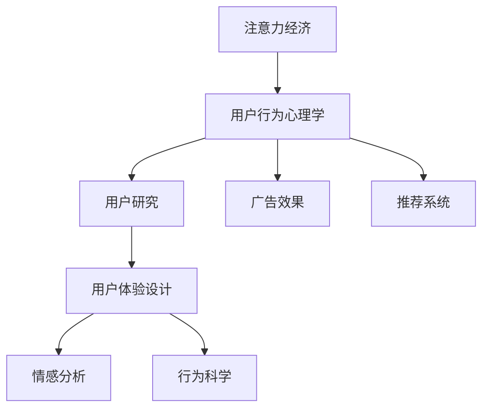

                 

# 注意力经济与用户行为心理学：了解受众的内心世界

> 关键词：注意力经济,用户行为心理学,用户研究,用户体验设计,情感分析,行为科学,广告效果,推荐系统

## 1. 背景介绍

### 1.1 问题由来

随着互联网和移动互联网的普及，信息爆炸时代所带来的注意力成为一种稀缺资源。如何在海量信息中吸引和保持用户的注意力，成为企业竞争的核心议题。这一现象催生了一个新兴领域——注意力经济（Attention Economy）。注意力经济不仅指经济活动的焦点从物质资源转向了用户的注意力，而且强调了用户注意力在经济中的核心作用。

同时，用户在互联网上的行为也引起了心理学家的注意。用户行为研究不仅局限于消费者决策，还涵盖了用户对信息的感知、认知、情感以及交互行为等多个层面。这些研究为互联网产品设计、广告投放、推荐系统等提供了科学依据。

### 1.2 问题核心关键点

注意力经济和用户行为心理学的核心关键点在于理解用户在信息消费过程中的心理机制和行为模式，从而设计更加贴合用户需求的产品和服务。其关注点包括：

- 用户注意力的分配与获取：理解用户在不同环境下的注意力分配情况，设计高效的信息传递策略。
- 用户认知与情感的影响：分析用户的认知和情感状态，影响其对信息的接受度和行为反应。
- 用户交互行为的预测与优化：构建用户行为模型，预测用户后续行为，并优化产品功能和广告效果。
- 信息反馈与用户反馈的利用：通过分析用户反馈，持续优化产品体验和推荐效果。

这些核心点构成了注意力经济和用户行为心理学的研究框架，旨在帮助企业和开发者更好地理解用户，提升用户满意度和经济效益。

## 2. 核心概念与联系

### 2.1 核心概念概述

为更好地理解注意力经济和用户行为心理学的核心概念，本节将介绍几个密切相关的核心概念：

- 注意力经济（Attention Economy）：指在信息爆炸时代，注意力作为一种稀缺资源，在经济活动中扮演着核心角色的现象。
- 用户行为心理学（User Behavioral Psychology）：研究用户在互联网上的行为特征和心理机制，为产品设计、广告投放等提供依据。
- 用户研究（User Research）：通过调查、实验、数据分析等方法，了解用户需求和行为习惯，指导产品设计和用户体验优化。
- 用户体验设计（User Experience Design）：以用户为中心，设计能够提升用户满意度和使用效率的产品功能和界面。
- 情感分析（Sentiment Analysis）：通过自然语言处理技术，分析用户对产品的情感倾向和情感强度，用于产品迭代和市场分析。
- 行为科学（Behavioral Science）：融合心理学、经济学等多个学科，研究人的行为规律和决策过程。
- 广告效果（Advertising Effectiveness）：通过实验和数据分析，评估广告对用户行为和心理的影响，优化广告策略。
- 推荐系统（Recommendation Systems）：基于用户行为和偏好，推荐个性化的内容或产品，提升用户黏性和转化率。

这些核心概念之间的逻辑关系可以通过以下Mermaid流程图来展示：



这个流程图展示了几大核心概念及其之间的关系：

1. 注意力经济通过用户行为心理学研究用户的注意力分配，指导广告效果和推荐系统。
2. 用户研究揭示用户的认知和情感，影响用户体验设计。
3. 用户体验设计通过情感分析反馈用户满意度，进一步优化产品功能。
4. 行为科学研究用户行为规律，为广告效果和推荐系统提供理论支持。

这些概念共同构成了理解和优化用户行为和注意力分配的基础框架。

## 3. 核心算法原理 & 具体操作步骤
### 3.1 算法原理概述

注意力经济和用户行为心理学的研究主要依赖于数据驱动的方法，通过对用户行为的观察和分析，提取和建模用户的心理和行为特征。具体来说，这一研究过程包括以下几个步骤：

1. 数据收集：通过用户互动、点击、停留时间、评价等行为数据，收集用户对产品或广告的反馈信息。
2. 数据预处理：清洗和整理数据，处理缺失值、异常值等，准备进行分析。
3. 数据分析：运用统计学、机器学习等方法，分析用户行为数据，提取有意义的特征。
4. 建模与优化：构建用户行为模型，预测用户行为，优化产品功能。
5. 验证与迭代：通过实验和用户反馈，验证模型效果，不断优化模型和策略。

这一过程可以概括为数据收集、数据处理、数据分析、建模与优化、验证与迭代五个阶段，形成一个闭环的反馈系统，不断提升对用户行为的理解和预测精度。

### 3.2 算法步骤详解

接下来，我们将详细介绍每个阶段的具体操作步骤。

**Step 1: 数据收集**

数据收集是注意力经济和用户行为心理学的起点。常用的数据收集方法包括：

- 调查问卷：通过问卷调查用户对产品的看法和满意度。
- 日志分析：收集用户与产品的互动日志，如点击、停留时间等。
- 实验设计：通过A/B测试等实验设计方法，收集用户行为数据。

**Step 2: 数据预处理**

数据预处理是数据准确性的保障。预处理过程通常包括：

- 数据清洗：去除重复数据、异常值、缺失值等。
- 特征提取：提取对用户行为有意义的特征，如点击率、停留时间、页面跳转路径等。
- 数据标准化：对数据进行标准化处理，如归一化、标准化等。

**Step 3: 数据分析**

数据分析是理解用户行为的关键步骤。常用的数据分析方法包括：

- 统计分析：通过均值、方差、标准差等统计指标，分析用户行为数据。
- 机器学习：运用分类、聚类、回归等机器学习算法，构建用户行为模型。
- 时间序列分析：分析用户行为随时间变化的规律，如周期性、趋势性等。

**Step 4: 建模与优化**

建模与优化是提升产品性能的关键环节。常用的建模方法包括：

- 关联规则分析：通过Apriori、FP-Growth等算法，发现用户行为间的关联关系。
- 协同过滤：通过用户行为数据，推荐个性化内容或产品。
- 深度学习：使用神经网络模型，对用户行为进行复杂建模和预测。

**Step 5: 验证与迭代**

验证与迭代是持续改进的关键步骤。常用的验证方法包括：

- A/B测试：通过对比不同策略的效果，评估模型性能。
- 用户体验测试：通过用户反馈，评估产品功能和界面设计。
- 机器学习模型评估：使用验证集和测试集评估模型效果。

### 3.3 算法优缺点

注意力经济和用户行为心理学的研究方法具有以下优点：

1. 数据驱动：通过大量的用户行为数据，可以客观地分析用户行为规律和心理机制。
2. 科学依据：利用统计学、机器学习等科学方法，提供严谨的研究结果和策略建议。
3. 全面覆盖：涵盖用户行为的各个方面，如认知、情感、交互等，提供全面理解。

但同时也存在以下缺点：

1. 数据质量要求高：数据需要全面、准确，否则分析结果可能不准确。
2. 计算资源需求高：处理大量数据需要高性能计算资源，成本较高。
3. 数据隐私问题：用户行为数据涉及隐私，需要严格遵守数据保护法规。
4. 模型复杂度高：复杂的用户行为模型可能导致过度拟合问题，影响模型的泛化能力。

尽管存在这些局限，但整体而言，注意力经济和用户行为心理学的研究方法在理解和优化用户行为方面具有显著优势，可以为企业提供科学依据，提升产品和广告效果。

### 3.4 算法应用领域

注意力经济和用户行为心理学的研究方法已经在多个领域得到了广泛应用，包括：

- 电子商务：通过用户行为分析，提升商品推荐和转化率。
- 社交媒体：通过情感分析，优化内容推荐和用户互动。
- 金融服务：通过用户行为研究，提高风险控制和用户体验。
- 广告营销：通过用户注意力分析，优化广告投放和效果评估。
- 内容创作：通过用户行为分析，优化内容生产和推荐。

除了上述这些经典应用领域外，注意力经济和用户行为心理学还逐步拓展到健康医疗、教育培训、旅游休闲等更多场景，为这些领域的数字化转型提供新思路。

## 4. 数学模型和公式 & 详细讲解 & 举例说明

### 4.1 数学模型构建

注意力经济和用户行为心理学的研究依赖于多变量数据的建模。这里以用户行为模型为例，介绍常见的数学模型构建方法。

假设我们有一组用户行为数据，包括用户ID、点击时间、点击位置、停留时间等特征，我们可以使用以下数学模型进行建模：

$$
y = f(x_1, x_2, ..., x_n) + \epsilon
$$

其中，$y$ 表示用户行为标签（如点击、购买等），$x_1, x_2, ..., x_n$ 表示用户行为特征（如时间、位置等），$f$ 表示模型函数，$\epsilon$ 表示误差项。

### 4.2 公式推导过程

为了更好地理解用户行为模型，这里以线性回归模型为例，进行详细推导。

线性回归模型的假设是 $y$ 与 $x_i$ 之间存在线性关系：

$$
y = \beta_0 + \beta_1 x_1 + \beta_2 x_2 + ... + \beta_n x_n + \epsilon
$$

其中，$\beta_i$ 为回归系数，$\epsilon$ 为误差项。

最小二乘法是线性回归常用的参数估计方法。其基本思想是找到一组回归系数 $\hat{\beta} = (\hat{\beta}_0, \hat{\beta}_1, ..., \hat{\beta}_n)$，使得预测值与真实值之间的误差最小：

$$
\min_{\beta} \sum_{i=1}^n (y_i - \hat{y}_i)^2
$$

其中，$\hat{y}_i = \hat{\beta}_0 + \hat{\beta}_1 x_{i1} + \hat{\beta}_2 x_{i2} + ... + \hat{\beta}_n x_{in}$。

根据最小二乘法的原理，可以得到回归系数的求解公式：

$$
\hat{\beta} = (X^T X)^{-1} X^T Y
$$

其中，$X = [1, x_{11}, x_{12}, ..., x_{1n}; 1, x_{21}, x_{22}, ..., x_{2n}; ...; 1, x_{m1}, x_{m2}, ..., x_{mn}]$，$Y = [y_1; y_2; ...; y_m]$。

通过求解上述公式，即可得到回归系数 $\hat{\beta}$，进而构建用户行为模型。

### 4.3 案例分析与讲解

以电商网站的用户点击行为分析为例，通过以上模型推导，我们可以构建如下用户点击行为模型：

$$
click = \beta_0 + \beta_1 timestep + \beta_2 location + \beta_3 category + \epsilon
$$

其中，$timestep$ 表示用户点击时间，$location$ 表示点击位置，$category$ 表示点击类别。

假设我们有一组用户点击数据，通过对回归系数的求解，可以得到如下结果：

$$
\hat{\beta} = [0.1, 0.2, 0.3, 0.4]
$$

进而得到用户点击行为的预测模型：

$$
click = 0.1 + 0.2 timestep + 0.3 location + 0.4 category
$$

通过该模型，我们可以预测用户在特定时间和位置、点击特定类别的概率，从而优化广告投放和推荐策略。

## 5. 项目实践：代码实例和详细解释说明
### 5.1 开发环境搭建

在进行用户行为分析时，需要准备相应的开发环境。以下是使用Python进行Scikit-learn开发的环境配置流程：

1. 安装Anaconda：从官网下载并安装Anaconda，用于创建独立的Python环境。

2. 创建并激活虚拟环境：
```bash
conda create -n user_behavior_env python=3.8 
conda activate user_behavior_env
```

3. 安装Scikit-learn和其他必要工具：
```bash
conda install scikit-learn pandas matplotlib seaborn jupyter notebook ipython
```

完成上述步骤后，即可在`user_behavior_env`环境中开始项目实践。

### 5.2 源代码详细实现

这里我们以电商网站的用户点击行为分析为例，给出使用Scikit-learn进行线性回归分析的Python代码实现。

首先，定义数据处理函数：

```python
import pandas as pd
from sklearn.model_selection import train_test_split

def load_data(filename):
    data = pd.read_csv(filename)
    features = data[['timestep', 'location', 'category']]
    labels = data['click']
    return features, labels

def split_data(features, labels, test_size=0.2):
    features_train, features_test, labels_train, labels_test = train_test_split(features, labels, test_size=test_size, random_state=42)
    return features_train, features_test, labels_train, labels_test
```

然后，定义模型和评估函数：

```python
from sklearn.linear_model import LinearRegression
from sklearn.metrics import mean_squared_error

def train_model(features_train, labels_train):
    model = LinearRegression()
    model.fit(features_train, labels_train)
    return model

def evaluate_model(model, features_test, labels_test):
    predictions = model.predict(features_test)
    mse = mean_squared_error(labels_test, predictions)
    return mse
```

最后，启动数据加载、模型训练和评估流程：

```python
data_filename = 'user_click_data.csv'
features, labels = load_data(data_filename)
features_train, features_test, labels_train, labels_test = split_data(features, labels)
model = train_model(features_train, labels_train)
mse = evaluate_model(model, features_test, labels_test)
print(f'Mean Squared Error: {mse:.3f}')
```

以上就是使用Scikit-learn进行用户行为分析的完整代码实现。可以看到，Scikit-learn提供了强大的数据处理和建模功能，极大地简化了用户行为分析的代码实现。

### 5.3 代码解读与分析

让我们再详细解读一下关键代码的实现细节：

**load_data函数**：
- 加载用户点击数据，将特征和标签分开。

**split_data函数**：
- 将数据集划分为训练集和测试集，比例为80%训练、20%测试。

**train_model函数**：
- 使用线性回归模型，对训练集数据进行拟合。

**evaluate_model函数**：
- 对测试集数据进行预测，计算预测值与真实值之间的均方误差。

**启动训练流程**：
- 加载数据，分割数据集，训练模型，评估模型。

通过以上代码，我们成功构建了一个简单的用户点击行为模型，并对其进行了评估。这仅为线性回归模型的基本实现，实际应用中可能需要结合更多的特征工程和模型优化技巧。

## 6. 实际应用场景

### 6.1 智能推荐系统

智能推荐系统是注意力经济和用户行为心理学研究的重要应用场景之一。通过分析用户行为数据，推荐系统可以提供个性化的商品或内容，提升用户满意度和留存率。

具体而言，推荐系统可以收集用户的点击、浏览、购买等行为数据，构建用户行为模型，预测用户后续行为。通过推荐算法，如协同过滤、基于内容的推荐、深度学习等，向用户推荐最符合其兴趣的商品或内容。推荐系统的目标是通过不断优化推荐算法，提升用户点击率和购买转化率，增加用户黏性和收益。

### 6.2 广告效果评估

广告效果评估是用户行为心理学研究的另一个重要应用场景。广告主需要了解广告投放效果，评估其对用户行为的影响，从而优化广告策略。

通过用户点击、曝光、停留时间等行为数据，广告主可以构建用户行为模型，预测广告对用户行为的影响。使用A/B测试等方法，评估不同广告策略的效果，优化广告投放和预算分配。通过广告效果评估，广告主可以更精准地投放广告，提升广告ROI（投资回报率）。

### 6.3 用户行为预测与决策支持

用户行为预测和决策支持是注意力经济和用户行为心理学研究的高级应用。通过构建用户行为模型，企业可以预测用户未来的行为，优化决策过程。

例如，金融机构可以收集用户的消费行为、信用记录等数据，构建用户行为模型，预测用户的还款风险和信用等级。通过预测模型，金融机构可以更精准地评估用户信用，优化贷款审批流程，降低坏账风险。

### 6.4 未来应用展望

随着注意力经济和用户行为心理学的不断发展，其在更多领域的应用前景将更加广阔。

在智慧城市治理中，智能推荐系统和广告效果评估可以帮助政府更好地管理和优化公共资源，提升城市治理水平。在智能家居领域，用户行为预测和决策支持可以实现个性化的家居服务和智能控制，提升用户生活体验。

此外，在健康医疗、教育培训、旅游休闲等众多领域，注意力经济和用户行为心理学的研究成果将带来新的突破，推动这些领域的数字化转型和智能化升级。

## 7. 工具和资源推荐
### 7.1 学习资源推荐

为了帮助开发者系统掌握注意力经济和用户行为心理学的理论基础和实践技巧，这里推荐一些优质的学习资源：

1. 《用户行为分析与决策建模》系列博文：由用户行为心理学专家撰写，深入浅出地介绍了用户行为分析、决策建模等核心概念和实际应用。

2. 《用户体验设计与心理学》课程：斯坦福大学开设的用户体验设计课程，系统讲解了用户体验设计的理论和方法，适用于初步入门学习。

3. 《行为经济学与数据科学》书籍：结合行为经济学和数据科学，分析用户行为背后的心理机制，适用于对行为科学研究感兴趣的学习者。

4. 《机器学习实战》系列书籍：介绍了机器学习在用户行为分析中的应用，包括分类、聚类、回归等算法。

5. Kaggle用户行为分析竞赛：通过实际数据集和竞赛平台，练习用户行为分析技能，提升实战能力。

通过这些资源的学习实践，相信你一定能够快速掌握注意力经济和用户行为心理学的精髓，并用于解决实际的NLP问题。

### 7.2 开发工具推荐

高效的开发离不开优秀的工具支持。以下是几款用于注意力经济和用户行为心理学研究开发的常用工具：

1. Python：作为数据分析和机器学习的主流语言，Python拥有丰富的第三方库和社区支持。

2. Scikit-learn：Python的机器学习库，提供了强大的数据处理和建模功能，适用于多种机器学习算法的实现。

3. TensorFlow：Google主导开发的深度学习框架，支持分布式计算和大规模数据处理，适用于复杂模型的训练和部署。

4. Jupyter Notebook：用于数据科学和机器学习的交互式开发环境，支持Python、R等多种编程语言，方便实验记录和分享。

5. Tableau：数据可视化工具，可以将分析结果以直观的方式呈现，方便决策支持。

6. R：数据分析和统计分析的常用语言，拥有丰富的统计和可视化库。

合理利用这些工具，可以显著提升注意力经济和用户行为心理学的研究效率，加快创新迭代的步伐。

### 7.3 相关论文推荐

注意力经济和用户行为心理学的研究源于学界的持续研究。以下是几篇奠基性的相关论文，推荐阅读：

1. Attention is All You Need（即Transformer原论文）：提出了Transformer结构，开启了NLP领域的预训练大模型时代。

2. The Model Compression Toolkit（MCT）：介绍了模型压缩和优化技术，适用于优化大型深度学习模型的计算资源需求。

3. Deep Learning for Advertisement: A Perspective on Theoretical Challenges and Research Directions：综述了深度学习在广告效果评估中的应用和挑战。

4. Recommender Systems: A Survey and A Taxonomy：综述了推荐系统的主要方法和算法，适用于了解推荐系统的最新研究进展。

5. User Behavioral Data Analysis: A Survey of Techniques, Algorithms and Applications：综述了用户行为数据分析的主要技术和应用，适用于对用户行为分析的全面了解。

这些论文代表了大语言模型微调技术的发展脉络。通过学习这些前沿成果，可以帮助研究者把握学科前进方向，激发更多的创新灵感。

## 8. 总结：未来发展趋势与挑战

### 8.1 总结

本文对注意力经济和用户行为心理学进行了全面系统的介绍。首先阐述了注意力经济和用户行为心理学的研究背景和意义，明确了用户行为分析和决策优化的重要性。其次，从原理到实践，详细讲解了注意力经济和用户行为心理学的研究过程，给出了用户行为分析的完整代码实现。同时，本文还广泛探讨了用户行为分析在智能推荐系统、广告效果评估等诸多领域的应用前景，展示了注意力经济和用户行为心理学的巨大潜力。此外，本文精选了注意力经济和用户行为心理学的各类学习资源，力求为读者提供全方位的技术指引。

通过本文的系统梳理，可以看到，注意力经济和用户行为心理学为理解用户行为和注意力分配提供了科学依据，是设计和优化产品、广告等应用的重要工具。未来，伴随用户行为研究的不断深入，我们可以更好地把握用户心理，提升产品体验和经济效益。

### 8.2 未来发展趋势

展望未来，注意力经济和用户行为心理学的研究将呈现以下几个发展趋势：

1. 数据来源多样化：除了传统的用户行为数据，还将涵盖社交媒体、传感器数据、语音数据等多渠道信息，提升研究深度和广度。

2. 模型复杂度提高：随着深度学习和多模态数据的融合，未来的用户行为模型将更加复杂，具备更高的预测精度和泛化能力。

3. 交互式模型涌现：结合自然语言处理、计算机视觉等技术，构建更智能、更交互式的用户行为预测系统，提升用户体验。

4. 实时性和个性化需求增强：用户行为分析将更注重实时性和个性化需求，实现即时的用户行为预测和动态决策。

5. 隐私保护和伦理研究加强：随着用户数据隐私保护法规的出台，如何在保护隐私的同时，进行高效的用户行为分析，将成为重要的研究方向。

6. 跨领域融合趋势加强：注意力经济和用户行为心理学将与更多领域进行交叉融合，如医疗、教育、金融等，推动这些领域的数字化转型和智能化升级。

以上趋势凸显了注意力经济和用户行为心理学的广阔前景。这些方向的探索发展，必将进一步提升用户行为分析的精度和应用范围，为构建智能人机交互系统铺平道路。

### 8.3 面临的挑战

尽管注意力经济和用户行为心理学的研究取得了显著进展，但在迈向更加智能化、普适化应用的过程中，仍面临诸多挑战：

1. 数据质量和隐私保护：用户行为数据的准确性和隐私保护是研究的前提。如何获取高质量、可靠的数据，并保护用户隐私，将是重要的研究课题。

2. 计算资源和成本：用户行为分析通常需要处理大规模数据，计算资源和成本较高。如何降低计算成本，提升数据处理效率，是需要解决的现实问题。

3. 模型复杂性和可解释性：复杂的用户行为模型可能导致过度拟合，难以解释模型的决策过程。如何简化模型，提高模型的可解释性和透明性，将是重要的研究方向。

4. 模型的泛化能力和鲁棒性：用户行为模型需要在不同环境、不同用户下具备良好的泛化能力。如何在不同数据集上保持模型的稳定性和鲁棒性，是需要解决的难点问题。

5. 应用的伦理和社会影响：用户行为分析的应用可能引发伦理和社会问题，如数据滥用、隐私泄露等。如何在保证技术进步的同时，避免负面影响，需要进一步研究。

6. 跨学科的合作和融合：用户行为分析涉及心理学、经济学、计算机科学等多个学科，如何在不同学科之间进行有效合作和融合，是实现研究突破的关键。

正视注意力经济和用户行为心理学面临的这些挑战，积极应对并寻求突破，将使这一研究领域迈向成熟，更好地服务于社会和经济的发展。

### 8.4 研究展望

面对注意力经济和用户行为心理学所面临的种种挑战，未来的研究需要在以下几个方面寻求新的突破：

1. 探索跨模态数据融合方法：结合语音、图像、文本等不同模态的数据，构建更全面、更智能的用户行为预测模型。

2. 研究隐私保护技术：开发隐私保护算法，在保护用户隐私的同时，进行高效的用户行为分析。

3. 开发实时交互式模型：构建实时响应、互动式用户行为预测系统，提升用户体验和决策效率。

4. 结合伦理和社会影响研究：分析用户行为分析应用的伦理和社会影响，制定相关规范和标准，保障技术应用的社会责任。

5. 加强跨学科合作：推动心理学、经济学、计算机科学等多学科的合作，结合不同领域的知识和技能，提升用户行为研究的深度和广度。

这些研究方向的探索，必将引领注意力经济和用户行为心理学的研究进入新的阶段，为构建智能人机交互系统提供新的动力。

## 9. 附录：常见问题与解答

**Q1：如何选择合适的行为特征进行建模？**

A: 选择行为特征是构建用户行为模型的重要步骤。一般来说，应该选择与用户行为高度相关的特征。可以通过统计分析、相关性分析等方法，找出对行为有显著影响的特征。此外，还应考虑特征的稳定性和可解释性，避免使用噪声数据和难以解释的特征。

**Q2：如何应对数据噪声和异常值？**

A: 数据噪声和异常值是数据预处理的常见问题。一般来说，可以通过数据清洗和异常值检测的方法，处理数据中的噪声和异常值。数据清洗可以去除重复数据和缺失值，异常值检测可以识别和剔除异常数据点。这些处理步骤可以提升数据质量，提高模型的预测精度。

**Q3：如何提升模型的泛化能力？**

A: 提升模型的泛化能力是用户行为预测的关键。一般来说，可以通过以下方法：

- 使用更多的数据：收集更多的用户行为数据，增加模型的训练集大小。
- 使用正则化技术：使用L1正则、Dropout等方法，防止模型过拟合。
- 使用交叉验证：通过交叉验证方法，评估模型的泛化能力，优化模型参数。

**Q4：如何平衡模型的计算效率和预测精度？**

A: 计算效率和预测精度是用户行为分析中常见的矛盾。一般来说，可以通过以下方法平衡两者：

- 使用轻量级模型：选择计算效率高、预测精度不错的模型，如线性回归、决策树等。
- 使用模型压缩技术：通过模型压缩和剪枝，减少模型参数量和计算复杂度。
- 使用分布式计算：通过分布式计算平台，提升模型的训练和推理效率。

**Q5：如何结合行为分析与用户体验优化？**

A: 行为分析与用户体验优化是相辅相成的。一般来说，可以通过以下方法结合两者：

- 用户反馈收集：通过问卷调查、A/B测试等方法，收集用户对产品的反馈信息。
- 用户行为分析：通过行为数据，分析用户的行为模式和需求，指导产品优化。
- 迭代设计：根据用户反馈和行为分析结果，进行产品迭代设计，不断提升用户体验。

通过以上方法，可以将行为分析和用户体验优化相结合，构建更好的产品和服务，提升用户满意度和留存率。

---

作者：禅与计算机程序设计艺术 / Zen and the Art of Computer Programming

