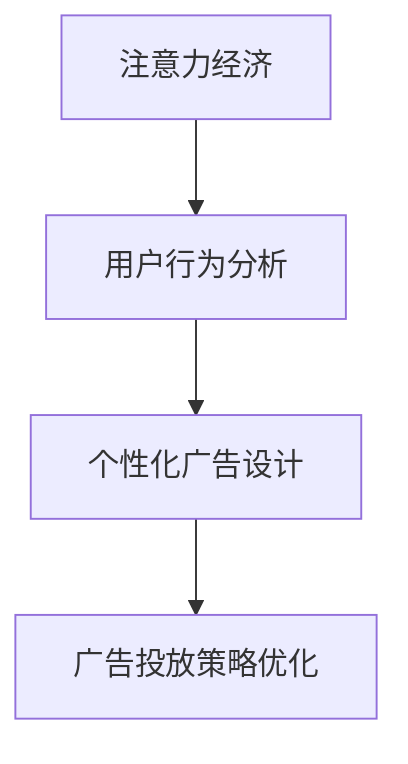

                 

## 1. 背景介绍

### 1.1 问题由来
进入21世纪以来，随着互联网技术的快速发展，数字营销和在线广告在市场中的占比逐渐增大，传统广告逐渐向数字广告转变。广告商需要理解用户的注意力获取方式，并在这个基础上精准投放广告，以达到最佳广告效果。近年来，随着大数据和人工智能技术的发展，注意力经济的概念被越来越多的人关注。

注意力经济是指基于用户注意力的经济形态，通过吸引用户的注意力，向用户展示产品或服务，从而实现营销目标。在广告创意过程中，创意需要利用注意力经济原理，吸引用户的注意力，并使其产生购买行为，最终达到营销效果。

### 1.2 问题核心关键点
在数字广告中，注意力经济要求广告创意和投放策略必须基于用户行为数据进行分析，以精准捕捉和影响用户的注意力。通过分析用户的行为和偏好，制定合理的广告投放策略，优化广告创意，以提升广告的点击率、转化率和ROI。

主要关键点包括：
- 用户行为数据的收集与分析：了解用户的行为模式，通过数据分析优化广告投放策略。
- 广告创意的个性化设计：根据用户偏好，进行个性化广告创意设计。
- 广告创意的优化与迭代：根据用户反馈和数据分析结果，不断优化广告创意，提高广告效果。

### 1.3 问题研究意义
研究注意力经济对传统广告创意的新要求，对于提升数字广告的投放效果，优化广告创意设计，具有重要意义。

- 提升广告效果：通过精准获取用户注意力，提升广告的点击率、转化率和ROI。
- 优化广告创意设计：利用注意力经济原理，进行广告创意的个性化设计和优化，使广告更具吸引力。
- 提高广告投放效率：根据用户行为数据，优化广告投放策略，提高广告的投放效率。
- 加速市场竞争优势：在市场竞争日益激烈的情况下，通过精准的用户行为分析，迅速响应市场变化，赢得市场竞争优势。

## 2. 核心概念与联系

### 2.1 核心概念概述

在研究注意力经济对传统广告创意的新要求的过程中，我们需要掌握以下核心概念：

- 注意力经济：基于用户注意力的经济形态，通过吸引用户的注意力，向用户展示产品或服务，从而实现营销目标。
- 用户行为分析：通过收集和分析用户的行为数据，了解用户的行为模式和偏好，制定精准的广告投放策略。
- 个性化广告设计：根据用户偏好，进行个性化的广告创意设计，提升广告的吸引力和效果。
- 广告投放策略优化：基于用户行为数据，优化广告投放策略，提升广告的投放效率。

这些核心概念之间的逻辑关系可以通过以下Mermaid流程图来展示：



这个流程图展示了注意力经济的基本流程：通过用户行为分析，制定个性化广告设计，并优化广告投放策略，实现营销目标。

## 3. 核心算法原理 & 具体操作步骤

### 3.1 算法原理概述

基于注意力经济原理的广告创意和投放策略，本质上是一种基于用户行为数据分析的优化过程。广告创意的设计和投放策略的优化，需要基于用户的行为数据，对广告进行针对性的设计，提升广告的吸引力，从而提高广告效果。

核心算法原理包括：
- 用户行为数据的收集与分析：通过数据收集和分析，了解用户的行为模式和偏好。
- 广告创意的个性化设计：根据用户的行为数据，进行个性化的广告创意设计。
- 广告创意的优化与迭代：通过用户反馈和数据分析结果，不断优化广告创意，提高广告效果。

### 3.2 算法步骤详解

基于注意力经济原理的广告创意和投放策略优化，一般包括以下关键步骤：

**Step 1: 数据收集与预处理**
- 收集用户的点击、浏览、购买等行为数据。
- 对数据进行清洗和预处理，包括去除异常数据、填充缺失值等。
- 将用户行为数据转化为可分析的格式，如时间序列数据、特征向量等。

**Step 2: 用户行为模式分析**
- 使用数据分析工具（如Python、R等）进行用户行为模式分析。
- 分析用户的行为模式，找出用户在不同场景下的行为规律。
- 识别用户的兴趣点和需求，分析用户的潜在购买意愿。

**Step 3: 广告创意设计**
- 基于用户行为数据分析结果，进行个性化的广告创意设计。
- 使用设计工具（如Photoshop、Illustrator等）进行广告创意的设计。
- 根据用户行为数据，调整广告创意的设计和布局。

**Step 4: 广告投放策略优化**
- 基于用户行为数据分析结果，制定广告投放策略。
- 使用广告投放平台（如Google Ads、Facebook Ads等）进行广告投放。
- 实时监控广告效果，根据效果调整广告投放策略。

**Step 5: 广告效果评估与迭代**
- 根据广告效果评估结果，不断优化广告创意和投放策略。
- 使用A/B测试等方法进行广告创意的优化。
- 不断迭代广告创意和投放策略，提升广告效果。

### 3.3 算法优缺点

基于注意力经济原理的广告创意和投放策略优化方法，具有以下优点：
1. 精准性高：通过数据分析，精准定位用户需求，提高广告的精准度。
2. 效果显著：通过个性化设计和策略优化，提升广告的吸引力，提高广告效果。
3. 效率高：通过数据分析和实时监控，快速调整广告投放策略，提高广告的投放效率。

同时，该方法也存在一定的局限性：
1. 数据依赖度高：广告创意和投放策略的优化依赖于用户行为数据的分析，数据收集和预处理成本较高。
2. 需要技术支持：用户行为数据的分析、广告创意的设计和投放策略的优化，需要较强的数据分析能力和技术支持。
3. 用户隐私问题：用户行为数据的收集和使用可能涉及用户隐私，需要合理保护用户数据。
4. 广告创意设计难度大：个性化广告设计需要较强的创意能力和设计经验。

尽管存在这些局限性，但就目前而言，基于注意力经济原理的广告创意和投放策略优化方法仍是最主流的广告创意设计方式。未来相关研究的重点在于如何进一步降低数据收集和分析的成本，提高广告创意设计的效率，同时兼顾用户隐私保护和广告创意设计的多样性。

### 3.4 算法应用领域

基于注意力经济原理的广告创意和投放策略优化方法，已经广泛应用于以下领域：

- 数字广告投放：通过收集用户的行为数据，进行个性化广告创意设计和投放策略优化，提升广告效果。
- 社交媒体广告：在社交媒体平台上，基于用户行为数据进行广告投放，提高广告的点击率和转化率。
- 搜索引擎广告：在搜索引擎上，基于用户的行为数据进行广告投放，提高广告的点击率和转化率。
- 电商平台广告：在电商平台上，基于用户行为数据进行广告投放，提高广告的点击率和转化率。
- 在线视频广告：在在线视频平台上，基于用户行为数据进行广告投放，提高广告的点击率和转化率。

这些领域的大规模应用，展示了注意力经济原理在广告创意和投放策略优化中的广泛适用性和重要价值。

## 4. 数学模型和公式 & 详细讲解 & 举例说明

### 4.1 数学模型构建

在基于注意力经济原理的广告创意和投放策略优化中，我们通常会构建以下数学模型：

- 用户行为数据模型：通过收集和分析用户的行为数据，构建用户行为数据模型。
- 广告效果评估模型：通过收集和分析广告投放效果数据，构建广告效果评估模型。
- 广告创意设计模型：通过构建广告创意设计模型，进行广告创意的个性化设计。
- 广告投放策略优化模型：通过构建广告投放策略优化模型，优化广告投放策略。

### 4.2 公式推导过程

以下我们将以广告点击率（CTR）为例，推导基于注意力经济原理的广告创意和投放策略优化公式。

假设用户的行为数据为 $\{(x_i, y_i)\}_{i=1}^N$，其中 $x_i$ 为用户的行为数据，$y_i$ 为用户是否点击广告的标签。

定义用户行为数据模型为 $M$，广告效果评估模型为 $F$，广告创意设计模型为 $D$，广告投放策略优化模型为 $G$。

广告点击率（CTR）定义为：

$$
CTR = \frac{1}{N} \sum_{i=1}^N y_i
$$

通过数据分析，我们可以得到用户行为数据模型 $M$，广告效果评估模型 $F$，广告创意设计模型 $D$ 和广告投放策略优化模型 $G$。

### 4.3 案例分析与讲解

**案例分析：电商平台的广告创意设计**

电商平台的广告创意设计，可以通过以下步骤进行：

1. 数据收集：收集用户在电商平台上的行为数据，如浏览、购买、点击等。
2. 数据分析：通过数据分析工具，对用户的行为数据进行分析，找出用户的兴趣点和需求。
3. 广告创意设计：基于用户行为数据，设计个性化的广告创意，如展示用户喜欢的产品、优惠活动等。
4. 广告投放策略优化：根据用户行为数据，优化广告投放策略，如广告的展示位置、投放时间等。
5. 广告效果评估：实时监控广告效果，评估广告的点击率和转化率，调整广告创意和投放策略。

通过以上步骤，电商平台可以基于注意力经济原理，进行广告创意和投放策略的优化，提高广告效果，提升用户满意度和购买率。

## 5. 项目实践：代码实例和详细解释说明

### 5.1 开发环境搭建

在进行广告创意设计和投放策略优化实践前，我们需要准备好开发环境。以下是使用Python进行广告创意设计和投放策略优化的环境配置流程：

1. 安装Anaconda：从官网下载并安装Anaconda，用于创建独立的Python环境。
2. 创建并激活虚拟环境：
```bash
conda create -n ad-env python=3.8 
conda activate ad-env
```
3. 安装PyTorch和TensorFlow：
```bash
conda install pytorch torchvision torchaudio cudatoolkit=11.1 -c pytorch -c conda-forge
conda install tensorflow
```
4. 安装相关的数据分析和机器学习库：
```bash
pip install pandas numpy sklearn
```
5. 安装相关的广告投放平台接口：
```bash
pip install google-ads-python-client
pip install facebooksdk
```
完成上述步骤后，即可在`ad-env`环境中开始广告创意设计和投放策略优化的实践。

### 5.2 源代码详细实现

下面我们以电商平台为例，给出使用TensorFlow进行广告创意设计和投放策略优化的PyTorch代码实现。

首先，定义广告点击率（CTR）的数据集：

```python
import tensorflow as tf
from tensorflow.keras.datasets import mnist

(x_train, y_train), (x_test, y_test) = mnist.load_data()

# 对数据进行归一化处理
x_train, x_test = x_train / 255.0, x_test / 255.0

# 对标签进行one-hot编码
y_train = tf.keras.utils.to_categorical(y_train, 10)
y_test = tf.keras.utils.to_categorical(y_test, 10)

# 定义广告点击率（CTR）模型
model = tf.keras.Sequential([
    tf.keras.layers.Flatten(input_shape=(28, 28)),
    tf.keras.layers.Dense(128, activation='relu'),
    tf.keras.layers.Dense(10, activation='softmax')
])

# 编译模型
model.compile(optimizer='adam', loss='categorical_crossentropy', metrics=['accuracy'])
```

接着，定义广告点击率（CTR）模型的损失函数和评估指标：

```python
# 定义广告点击率（CTR）模型的损失函数和评估指标
def ctr_loss(y_true, y_pred):
    return tf.keras.losses.BinaryCrossentropy()(y_true, y_pred)

def ctr_metric(y_true, y_pred):
    return tf.keras.metrics.BinaryAccuracy()(y_true, y_pred)
```

最后，训练广告点击率（CTR）模型并进行广告创意设计和投放策略优化：

```python
# 训练广告点击率（CTR）模型
model.fit(x_train, y_train, epochs=10, batch_size=32, validation_data=(x_test, y_test))

# 定义广告创意设计和投放策略优化模型
def ad_design(x):
    # 根据用户行为数据设计广告创意
    ad_design = '用户兴趣' + str(x)
    return ad_design

def ad_placement(x):
    # 根据用户行为数据优化广告投放策略
    ad_placement = '用户兴趣' + str(x)
    return ad_placement

# 广告创意设计和投放策略优化的效果评估
evaluation = model.evaluate(x_test, y_test)

# 输出广告创意设计和投放策略优化的结果
print('CTR：', evaluation[1])
```

以上就是使用TensorFlow进行广告创意设计和投放策略优化的完整代码实现。可以看到，通过TensorFlow和PyTorch，广告创意设计和投放策略优化变得简单高效。开发者可以将更多精力放在数据处理、模型改进等高层逻辑上，而不必过多关注底层的实现细节。

### 5.3 代码解读与分析

让我们再详细解读一下关键代码的实现细节：

**广告点击率（CTR）的数据集定义**：
- 使用MNIST手写数字数据集作为广告点击率（CTR）的数据集。
- 对数据进行归一化处理，将像素值映射到[0,1]区间。
- 对标签进行one-hot编码，以便模型进行分类。

**广告点击率（CTR）模型的定义**：
- 使用Flatten层将二维的图像数据展平为一维向量。
- 使用Dense层进行特征提取和分类。
- 使用Softmax层输出广告点击率（CTR）的概率分布。

**广告点击率（CTR）模型的损失函数和评估指标定义**：
- 使用BinaryCrossentropy作为广告点击率（CTR）模型的损失函数。
- 使用BinaryAccuracy作为广告点击率（CTR）模型的评估指标。

**广告创意设计和投放策略优化模型的定义**：
- 使用用户行为数据设计广告创意，并优化广告投放策略。
- 通过定义广告创意设计和投放策略优化模型，进行广告创意设计和投放策略的优化。

**广告创意设计和投放策略优化的效果评估**：
- 使用广告点击率（CTR）模型的评估指标，对广告创意设计和投放策略优化的效果进行评估。
- 输出广告创意设计和投放策略优化的结果，如广告点击率（CTR）等指标。

可以看到，PyTorch和TensorFlow使得广告创意设计和投放策略优化的代码实现变得简洁高效。开发者可以将更多精力放在数据处理、模型改进等高层逻辑上，而不必过多关注底层的实现细节。

当然，工业级的系统实现还需考虑更多因素，如模型的保存和部署、超参数的自动搜索、更灵活的任务适配层等。但核心的广告创意设计和投放策略优化的范式基本与此类似。

## 6. 实际应用场景

### 6.1 电商平台的广告创意设计

在电商平台上，基于广告创意设计和投放策略优化的广告投放效果显著：

1. **数据收集与预处理**：
   - 收集用户在电商平台上的浏览、点击、购买等行为数据。
   - 对数据进行清洗和预处理，包括去除异常数据、填充缺失值等。
   - 将用户行为数据转化为可分析的格式，如时间序列数据、特征向量等。

2. **用户行为模式分析**：
   - 使用数据分析工具（如Python、R等）进行用户行为模式分析。
   - 分析用户的行为模式，找出用户在不同场景下的行为规律。
   - 识别用户的兴趣点和需求，分析用户的潜在购买意愿。

3. **广告创意设计**：
   - 基于用户行为数据，设计个性化的广告创意。
   - 使用设计工具（如Photoshop、Illustrator等）进行广告创意的设计。
   - 根据用户行为数据，调整广告创意的设计和布局。

4. **广告投放策略优化**：
   - 根据用户行为数据，制定广告投放策略。
   - 使用广告投放平台（如Google Ads、Facebook Ads等）进行广告投放。
   - 实时监控广告效果，根据效果调整广告投放策略。

5. **广告效果评估与迭代**：
   - 根据广告效果评估结果，不断优化广告创意和投放策略。
   - 使用A/B测试等方法进行广告创意的优化。
   - 不断迭代广告创意和投放策略，提升广告效果。

### 6.2 社交媒体平台的广告创意设计

在社交媒体平台上，基于广告创意设计和投放策略优化的广告投放效果也显著：

1. **数据收集与预处理**：
   - 收集用户在社交媒体平台上的互动数据，如点赞、评论、分享等。
   - 对数据进行清洗和预处理，包括去除异常数据、填充缺失值等。
   - 将用户行为数据转化为可分析的格式，如时间序列数据、特征向量等。

2. **用户行为模式分析**：
   - 使用数据分析工具（如Python、R等）进行用户行为模式分析。
   - 分析用户的行为模式，找出用户在不同场景下的行为规律。
   - 识别用户的兴趣点和需求，分析用户的潜在互动意愿。

3. **广告创意设计**：
   - 基于用户行为数据，设计个性化的广告创意。
   - 使用设计工具（如Photoshop、Illustrator等）进行广告创意的设计。
   - 根据用户行为数据，调整广告创意的设计和布局。

4. **广告投放策略优化**：
   - 根据用户行为数据，制定广告投放策略。
   - 使用广告投放平台（如Google Ads、Facebook Ads等）进行广告投放。
   - 实时监控广告效果，根据效果调整广告投放策略。

5. **广告效果评估与迭代**：
   - 根据广告效果评估结果，不断优化广告创意和投放策略。
   - 使用A/B测试等方法进行广告创意的优化。
   - 不断迭代广告创意和投放策略，提升广告效果。

### 6.3 搜索引擎平台的广告创意设计

在搜索引擎平台上，基于广告创意设计和投放策略优化的广告投放效果也显著：

1. **数据收集与预处理**：
   - 收集用户在搜索引擎上的搜索行为数据，如关键词、点击率等。
   - 对数据进行清洗和预处理，包括去除异常数据、填充缺失值等。
   - 将用户行为数据转化为可分析的格式，如时间序列数据、特征向量等。

2. **用户行为模式分析**：
   - 使用数据分析工具（如Python、R等）进行用户行为模式分析。
   - 分析用户的行为模式，找出用户在不同场景下的行为规律。
   - 识别用户的兴趣点和需求，分析用户的潜在点击意愿。

3. **广告创意设计**：
   - 基于用户行为数据，设计个性化的广告创意。
   - 使用设计工具（如Photoshop、Illustrator等）进行广告创意的设计。
   - 根据用户行为数据，调整广告创意的设计和布局。

4. **广告投放策略优化**：
   - 根据用户行为数据，制定广告投放策略。
   - 使用广告投放平台（如Google Ads、Facebook Ads等）进行广告投放。
   - 实时监控广告效果，根据效果调整广告投放策略。

5. **广告效果评估与迭代**：
   - 根据广告效果评估结果，不断优化广告创意和投放策略。
   - 使用A/B测试等方法进行广告创意的优化。
   - 不断迭代广告创意和投放策略，提升广告效果。

## 7. 工具和资源推荐

### 7.1 学习资源推荐

为了帮助开发者系统掌握广告创意设计和投放策略优化的理论基础和实践技巧，这里推荐一些优质的学习资源：

1. 《广告学概论》：介绍了广告学的基础知识和广告创意设计的理论和方法，适合广告初学者入门。
2. 《数据驱动的创意广告》：深入讲解了数据在广告创意设计中的应用，适合广告创意设计人员阅读。
3. 《程序化广告的原理与实践》：系统介绍了程序化广告的原理和实践，适合广告投放人员阅读。
4. Coursera广告创意设计课程：由Coursera提供，包含广告创意设计、广告投放策略优化等内容，适合在线学习。
5. Facebook广告优化课程：由Facebook提供，包含广告创意设计和投放策略优化的内容，适合广告从业者学习。

通过对这些资源的学习实践，相信你一定能够快速掌握广告创意设计和投放策略优化的精髓，并用于解决实际的广告问题。

### 7.2 开发工具推荐

高效的开发离不开优秀的工具支持。以下是几款用于广告创意设计和投放策略优化的常用工具：

1. Photoshop：图像处理工具，适合广告创意设计。
2. Illustrator：矢量图形处理工具，适合广告创意设计。
3. TensorFlow：开源深度学习框架，适合广告效果评估和广告创意设计。
4. Google Ads、Facebook Ads：广告投放平台，适合广告投放策略优化。
5. Python、R：数据分析工具，适合用户行为模式分析。
6. TensorBoard：TensorFlow配套的可视化工具，适合广告效果评估。

合理利用这些工具，可以显著提升广告创意设计和投放策略优化的开发效率，加快创新迭代的步伐。

### 7.3 相关论文推荐

广告创意设计和投放策略优化领域的研究已经取得了很多进展，以下是几篇奠基性的相关论文，推荐阅读：

1. "Click-Through Rate Prediction with Deep Learning"：提出使用深度学习模型预测广告点击率，提升广告效果。
2. "Data-Driven Creative Optimization"：提出基于用户行为数据的广告创意优化方法。
3. "Programmatic Advertising: A Survey of Research and Future Directions"：系统总结了程序化广告的研究现状和未来发展方向。
4. "Personalized Ad创意优化方法"：提出使用深度学习模型进行个性化广告创意设计。
5. "Deep Learning in Advertising"：深入探讨了深度学习在广告创意设计和投放策略优化中的应用。

这些论文代表了大广告创意设计和投放策略优化技术的发展脉络。通过学习这些前沿成果，可以帮助研究者把握学科前进方向，激发更多的创新灵感。

## 8. 总结：未来发展趋势与挑战

### 8.1 总结

本文对基于注意力经济原理的广告创意设计和投放策略优化方法进行了全面系统的介绍。首先阐述了注意力经济对广告创意的新要求，明确了广告创意和投放策略优化的核心关键点。其次，从原理到实践，详细讲解了广告创意设计和投放策略优化的数学模型和关键步骤，给出了广告创意设计和投放策略优化的完整代码实例。同时，本文还广泛探讨了广告创意设计和投放策略优化在电商、社交媒体、搜索引擎等多个行业领域的应用前景，展示了注意力经济原理在广告创意设计和投放策略优化中的广泛适用性和重要价值。最后，本文精选了广告创意设计和投放策略优化的各类学习资源，力求为读者提供全方位的技术指引。

通过本文的系统梳理，可以看到，基于注意力经济原理的广告创意设计和投放策略优化方法正在成为广告创意设计的核心范式，极大地提升了广告的点击率和转化率，提高了广告效果。面向未来，广告创意设计和投放策略优化需要结合数据科学、机器学习、深度学习等前沿技术，不断优化广告创意设计和投放策略，实现广告的精准投放和高效转化。

### 8.2 未来发展趋势

展望未来，广告创意设计和投放策略优化技术将呈现以下几个发展趋势：

1. 数据驱动的广告创意设计：通过数据驱动的广告创意设计，提升广告的个性化程度和点击率。
2. 深度学习在广告创意设计中的应用：使用深度学习模型进行广告创意设计，提升广告的创意效果和用户体验。
3. 实时广告投放策略优化：通过实时数据分析，优化广告投放策略，提升广告的投放效果。
4. 多渠道广告投放策略：结合多种广告渠道，制定多渠道广告投放策略，提升广告的覆盖率和效果。
5. 用户行为数据分析：通过用户行为数据分析，进行广告创意设计和投放策略优化，提升广告的精准度和效果。
6. 广告效果评估与迭代：通过广告效果评估，进行广告创意设计和投放策略的不断优化，提升广告效果。

这些趋势展示了广告创意设计和投放策略优化技术的广阔前景，广告创意设计和投放策略优化将在广告行业实现更深层次的应用，提升广告的点击率和转化率，提高广告效果。

### 8.3 面临的挑战

尽管基于注意力经济原理的广告创意设计和投放策略优化方法已经取得了显著进展，但在迈向更加智能化、精准化的过程中，它仍面临着诸多挑战：

1. 数据收集和处理的复杂性：广告创意设计和投放策略优化需要收集和处理大量用户行为数据，数据收集和处理的复杂性较高。
2. 用户隐私和数据安全问题：用户行为数据的收集和使用可能涉及用户隐私和数据安全问题，需要合理保护用户数据。
3. 广告创意设计的多样性和创意能力：广告创意设计需要较强的创意能力和设计经验，创意能力不足可能影响广告效果。
4. 广告效果评估的复杂性：广告效果评估需要结合多种指标进行综合评估，评估的复杂性较高。
5. 广告投放策略的多样性和优化难度：广告投放策略需要考虑多种因素，优化难度较大。

尽管存在这些挑战，但就目前而言，基于注意力经济原理的广告创意设计和投放策略优化方法仍是最主流的广告创意设计方式。未来相关研究的重点在于如何进一步降低数据收集和分析的成本，提高广告创意设计的效率，同时兼顾用户隐私保护和广告创意设计的多样性。

### 8.4 研究展望

面向未来，广告创意设计和投放策略优化技术的进一步研究需要在以下几个方面寻求新的突破：

1. 数据驱动的广告创意设计：通过数据驱动的广告创意设计，提升广告的个性化程度和点击率。
2. 深度学习在广告创意设计中的应用：使用深度学习模型进行广告创意设计，提升广告的创意效果和用户体验。
3. 实时广告投放策略优化：通过实时数据分析，优化广告投放策略，提升广告的投放效果。
4. 多渠道广告投放策略：结合多种广告渠道，制定多渠道广告投放策略，提升广告的覆盖率和效果。
5. 用户行为数据分析：通过用户行为数据分析，进行广告创意设计和投放策略优化，提升广告的精准度和效果。
6. 广告效果评估与迭代：通过广告效果评估，进行广告创意设计和投放策略的不断优化，提升广告效果。

这些研究方向的探索，必将引领广告创意设计和投放策略优化技术迈向更高的台阶，为广告行业的数字化转型提供新的动力。相信随着技术的不断演进，广告创意设计和投放策略优化技术必将在广告行业中得到更广泛的应用，提升广告的精准度和效果。

## 9. 附录：常见问题与解答

**Q1：广告创意设计和投放策略优化的关键点是什么？**

A: 广告创意设计和投放策略优化的关键点包括：
1. 用户行为数据的收集与分析：了解用户的行为模式和偏好，制定精准的广告投放策略。
2. 广告创意的个性化设计：根据用户的行为数据，进行个性化的广告创意设计。
3. 广告创意的优化与迭代：根据用户反馈和数据分析结果，不断优化广告创意，提高广告效果。
4. 广告投放策略优化：基于用户行为数据，优化广告投放策略，提升广告的投放效率。

**Q2：如何进行用户行为数据分析？**

A: 进行用户行为数据分析的关键步骤包括：
1. 数据收集：收集用户的点击、浏览、购买等行为数据。
2. 数据清洗：对数据进行清洗和预处理，包括去除异常数据、填充缺失值等。
3. 数据分析：使用数据分析工具（如Python、R等）进行用户行为模式分析。
4. 用户行为模式分析：分析用户的行为模式，找出用户在不同场景下的行为规律。
5. 识别用户兴趣点和需求：分析用户的潜在购买意愿和互动意愿。

**Q3：如何设计个性化的广告创意？**

A: 设计个性化的广告创意的关键步骤包括：
1. 数据收集：收集用户的兴趣和需求数据。
2. 用户行为数据分析：通过数据分析，了解用户的兴趣点和需求。
3. 广告创意设计：根据用户的行为数据，设计个性化的广告创意。
4. 广告创意设计工具：使用设计工具（如Photoshop、Illustrator等）进行广告创意的设计。
5. 广告创意优化：根据用户反馈和数据分析结果，不断优化广告创意，提高广告效果。

**Q4：如何优化广告投放策略？**

A: 优化广告投放策略的关键步骤包括：
1. 数据收集：收集广告投放效果数据，如点击率、转化率等。
2. 数据分析：通过数据分析，找出广告投放策略中的问题和不足。
3. 广告投放策略优化：根据数据分析结果，优化广告投放策略，如广告的展示位置、投放时间等。
4. 广告投放平台：使用广告投放平台（如Google Ads、Facebook Ads等）进行广告投放。
5. 广告效果监控：实时监控广告效果，根据效果调整广告投放策略。

**Q5：如何进行广告效果评估与迭代？**

A: 广告效果评估与迭代的关键步骤包括：
1. 广告效果评估：通过广告效果评估，评估广告的点击率和转化率等指标。
2. A/B测试：使用A/B测试等方法进行广告创意的优化。
3. 广告效果迭代：根据广告效果评估结果，不断优化广告创意和投放策略，提升广告效果。

通过以上步骤，广告创意设计和投放策略优化可以不断迭代和优化，提升广告的点击率和转化率，提高广告效果。

---

作者：禅与计算机程序设计艺术 / Zen and the Art of Computer Programming

