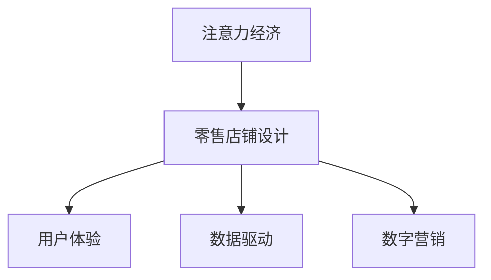
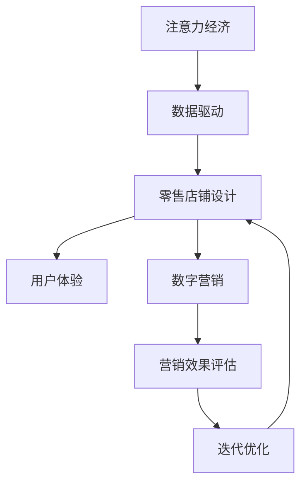

                 

# 注意力经济对传统零售店铺设计的新要求

> 关键词：注意力经济, 零售店铺设计, 用户体验, 数据驱动, 数字营销

## 1. 背景介绍

随着互联网和数字技术的快速发展，消费者行为模式发生了深刻变化。在数字经济时代，消费者的注意力成为一种稀缺资源，商家的营销策略也从传统的规模化、广覆盖转变为针对特定用户群体的精准营销。这种以注意力为核心的商业模式，被称为“注意力经济”。本文将探讨注意力经济对传统零售店铺设计提出的新要求，以及如何在数字时代优化零售店铺布局，提升用户购物体验。

## 2. 核心概念与联系

### 2.1 核心概念概述

注意力经济（Attention Economy）是指在信息爆炸的互联网时代，消费者注意力成为商业竞争的焦点。商家需要通过精心的内容设计和营销策略，吸引并保持消费者的注意力，从而实现商业价值的最大化。

零售店铺设计（Retail Store Design）是指根据零售业态的特点，结合店铺的目标客户群、商品类型、经营策略等因素，设计出符合商业运营需求、能够吸引并留住顾客的店铺环境。

用户体验（User Experience, UX）是用户与产品或服务交互过程中的感受和反馈，零售店铺设计需以提升用户体验为目标，使消费者在购物过程中获得愉悦、方便、安全、高效的服务。

数据驱动（Data-Driven）是指在决策过程中广泛应用数据分析和人工智能技术，利用数据洞察用户需求和行为模式，优化店铺布局和营销策略，提升店铺运营效率。

数字营销（Digital Marketing）是利用数字手段和互联网平台进行产品推广和品牌宣传的营销活动。在注意力经济时代，数字营销成为商家获取和维护用户注意力的重要工具。

这些核心概念相互关联，共同构成了一个以用户注意力为中心的零售店铺设计框架。下图展示了这些概念之间的逻辑关系：



### 2.2 核心概念原理和架构的 Mermaid 流程图

以下是展示注意力经济对零售店铺设计影响的 Mermaid 流程图：



## 3. 核心算法原理 & 具体操作步骤

### 3.1 算法原理概述

注意力经济下，零售店铺设计需要围绕提升用户体验展开。用户体验由多个方面构成，包括店铺环境、商品陈列、服务质量、购物体验等。这些因素通过数据驱动的数字营销手段进行优化，以实现消费者注意力的最大化利用。

在零售店铺设计中，算法原理主要包括以下几个方面：

1. 用户行为分析：通过数据收集和分析，了解用户的购物习惯、偏好和需求。
2. 商品推荐系统：利用算法推荐用户感兴趣的商品，提升店铺的吸引力。
3. 店铺布局优化：根据用户行为和商品销售数据，调整店铺布局，提高用户流量的转化率。
4. 实时反馈机制：通过用户反馈和销售数据，实时调整店铺设计和营销策略。

### 3.2 算法步骤详解

#### 3.2.1 用户行为分析

用户行为分析是零售店铺设计的第一步，通过收集和分析用户的行为数据，了解消费者的购物习惯和需求。常用的数据包括：

- 点击量：用户在店铺内点击的页面或商品数量。
- 停留时间：用户在每个页面或商品上的停留时间。
- 购买行为：用户的购买记录和购买频率。
- 评论反馈：用户对店铺或商品的评论和评分。

数据分析的主要步骤如下：

1. 数据采集：通过网站、APP等渠道收集用户行为数据。
2. 数据清洗：去除无效和噪声数据，确保数据的准确性和完整性。
3. 特征提取：从原始数据中提取有用的特征，如用户偏好、浏览轨迹、购买路径等。
4. 模型训练：使用机器学习算法（如分类、聚类、回归等）训练用户行为模型。
5. 结果分析：分析模型的输出结果，识别出用户的购物行为模式和偏好。

#### 3.2.2 商品推荐系统

商品推荐系统根据用户的历史行为数据，推荐用户感兴趣的商品。推荐算法包括基于内容的推荐、协同过滤推荐、混合推荐等。推荐系统的主要步骤如下：

1. 用户画像：根据用户的历史行为数据，构建用户画像，了解用户的兴趣和偏好。
2. 商品画像：分析商品的属性和销售数据，构建商品的特征向量。
3. 相似度计算：计算用户画像与商品画像之间的相似度，找到推荐的商品。
4. 推荐排序：根据相似度计算结果，对推荐商品进行排序，确保推荐的商品与用户偏好一致。
5. 反馈循环：根据用户的反馈（如点击、购买等），更新推荐算法模型，提高推荐效果。

#### 3.2.3 店铺布局优化

店铺布局优化是提升用户体验的重要手段。通过分析用户的行为数据，调整店铺的布局和展示方式，可以提升用户流量和转化率。优化布局的主要步骤如下：

1. 用户路径分析：通过热力图等工具，分析用户在店铺内的行为路径，找出用户的主要活动区域。
2. 流量分析：分析用户在不同区域和商品的停留时间和转化率，找出高流量和低流量的区域。
3. 布局调整：根据流量分析结果，调整店铺布局，将高流量区域的商品放在显眼位置，减少用户移动距离。
4. 实验验证：在调整布局后，通过A/B测试等方法，验证调整效果，确保优化方案有效。

#### 3.2.4 实时反馈机制

实时反馈机制是零售店铺设计中的关键环节，通过实时监测和分析用户反馈，不断调整店铺设计和营销策略，以实现更好的用户体验。实时反馈机制的主要步骤如下：

1. 数据采集：实时收集用户在店铺内的行为数据，包括点击、停留时间、购买等。
2. 数据处理：对实时数据进行处理和分析，识别出用户行为变化和异常情况。
3. 反馈调整：根据实时反馈数据，调整店铺布局和营销策略，如调整商品价格、更新推荐商品等。
4. 循环迭代：通过持续的实时反馈和调整，不断优化店铺设计和运营策略，提升用户体验。

### 3.3 算法优缺点

#### 3.3.1 优点

1. 提升用户体验：通过数据分析和优化，提升用户购物体验，提高用户满意度和忠诚度。
2. 增加销售转化率：优化店铺布局和推荐系统，提高用户流量和转化率，增加销售收入。
3. 实时调整策略：实时反馈机制使商家能够快速响应市场变化，及时调整店铺策略。
4. 数据驱动决策：基于数据洞察用户需求和行为模式，优化决策过程，降低试错成本。

#### 3.3.2 缺点

1. 数据隐私问题：收集和分析用户数据时，需要注意保护用户隐私，遵守相关法律法规。
2. 数据质量问题：数据采集和处理过程中可能存在噪声和偏差，影响分析结果的准确性。
3. 模型复杂性：复杂的推荐系统和数据分析模型需要高水平的算法和计算资源。
4. 用户接受度：用户对数据驱动的购物体验可能存在一定的抵触情绪，需要逐步引导和教育。

### 3.4 算法应用领域

注意力经济下，零售店铺设计在多个领域得到广泛应用，包括：

1. 线上购物平台：通过数据分析和优化，提升用户购物体验，增加用户粘性。
2. 线下实体店铺：优化店铺布局和商品陈列，提升用户购物体验和销售转化率。
3. 跨渠道营销：整合线上线下数据，实现全渠道用户管理和营销，提升整体营销效果。
4. 个性化推荐：根据用户行为数据，提供个性化的商品推荐，提升用户满意度。
5. 数字广告：通过精准的用户画像和数据分析，提升数字广告的效果和ROI。

## 4. 数学模型和公式 & 详细讲解 & 举例说明

### 4.1 数学模型构建

在零售店铺设计中，常用的数学模型包括用户行为模型、推荐系统模型和布局优化模型。以下以用户行为模型为例，介绍数学模型的构建方法。

用户行为模型可以表示为：

$$
P(y|x) = \frac{e^{w^Ty}}{1+e^{w^Tx}}
$$

其中，$y$ 表示用户的购物行为，$x$ 表示用户的特征向量，$w$ 为模型参数。通过训练模型，可以得到用户行为的概率分布。

### 4.2 公式推导过程

用户行为模型基于逻辑回归算法，推导过程如下：

1. 数据收集和预处理：收集用户的行为数据和特征数据，进行数据清洗和特征提取。
2. 模型训练：使用逻辑回归算法，训练用户行为模型，得到模型参数 $w$。
3. 预测结果：将用户的新数据输入模型，得到其购物行为的概率。
4. 结果分析：分析预测结果，识别出用户的行为模式和偏好。

### 4.3 案例分析与讲解

#### 4.3.1 用户行为模型案例

某电商平台收集了用户的点击数据、停留时间和购买记录，使用逻辑回归算法训练用户行为模型。具体步骤如下：

1. 数据收集：收集用户的点击数据、停留时间和购买记录。
2. 数据预处理：对数据进行清洗和特征提取，得到用户的特征向量 $x$。
3. 模型训练：使用逻辑回归算法，训练用户行为模型，得到模型参数 $w$。
4. 预测结果：将用户的新数据输入模型，得到其点击和购买行为的概率。
5. 结果分析：分析预测结果，识别出用户的行为模式和偏好，优化店铺布局和推荐系统。

#### 4.3.2 推荐系统模型案例

某线上服装店收集了用户的历史浏览记录和购买记录，使用协同过滤算法训练推荐系统模型。具体步骤如下：

1. 数据收集：收集用户的历史浏览记录和购买记录。
2. 数据预处理：对数据进行清洗和特征提取，得到用户的特征向量 $x$ 和商品的特征向量 $z$。
3. 模型训练：使用协同过滤算法，训练推荐系统模型，得到模型参数 $w$。
4. 预测结果：将用户的新数据输入模型，得到推荐商品的列表。
5. 结果分析：分析推荐结果，优化商品推荐策略，提升用户购物体验。

## 5. 项目实践：代码实例和详细解释说明

### 5.1 开发环境搭建

#### 5.1.1 Python环境安装

1. 安装Anaconda：从官网下载并安装Anaconda，用于创建独立的Python环境。
```bash
conda create -n py36 python=3.6
conda activate py36
```
2. 安装必要的Python库：使用pip安装TensorFlow、Pandas、NumPy、Matplotlib等库。
```bash
pip install tensorflow pandas numpy matplotlib
```

#### 5.1.2 数据集准备

1. 数据采集：收集用户的点击数据、停留时间和购买记录。
2. 数据预处理：对数据进行清洗和特征提取，得到用户的特征向量 $x$ 和商品的特征向量 $z$。

### 5.2 源代码详细实现

#### 5.2.1 用户行为模型实现

```python
import pandas as pd
import numpy as np
from sklearn.model_selection import train_test_split
from sklearn.linear_model import LogisticRegression

# 数据读取
data = pd.read_csv('user_data.csv')

# 数据预处理
X = data[['特征1', '特征2', '特征3']]
y = data['行为']

# 数据分割
X_train, X_test, y_train, y_test = train_test_split(X, y, test_size=0.2, random_state=42)

# 模型训练
model = LogisticRegression()
model.fit(X_train, y_train)

# 预测结果
predictions = model.predict(X_test)
```

#### 5.2.2 推荐系统模型实现

```python
import pandas as pd
import numpy as np
from sklearn.model_selection import train_test_split
from sklearn.neighbors import NearestNeighbors

# 数据读取
data = pd.read_csv('item_data.csv')

# 数据预处理
X = data[['特征1', '特征2', '特征3']]
y = data['标签']

# 数据分割
X_train, X_test, y_train, y_test = train_test_split(X, y, test_size=0.2, random_state=42)

# 模型训练
model = NearestNeighbors(n_neighbors=5)
model.fit(X_train)

# 预测结果
distances, indices = model.kneighbors(X_test)
predictions = [data.iloc[index] for index in indices]
```

### 5.3 代码解读与分析

#### 5.3.1 用户行为模型代码解读

1. 数据读取和预处理：使用Pandas库读取数据，进行数据清洗和特征提取。
2. 数据分割：使用train_test_split函数将数据分割为训练集和测试集。
3. 模型训练：使用LogisticRegression模型训练用户行为模型。
4. 预测结果：使用训练好的模型进行预测，得到用户的行为概率。

#### 5.3.2 推荐系统模型代码解读

1. 数据读取和预处理：使用Pandas库读取数据，进行数据清洗和特征提取。
2. 数据分割：使用train_test_split函数将数据分割为训练集和测试集。
3. 模型训练：使用NearestNeighbors模型训练推荐系统模型。
4. 预测结果：使用训练好的模型进行预测，得到推荐商品的列表。

### 5.4 运行结果展示

#### 5.4.1 用户行为模型结果展示

```python
from sklearn.metrics import accuracy_score

# 预测结果
y_pred = model.predict(X_test)

# 计算准确率
accuracy = accuracy_score(y_test, y_pred)
print('Accuracy:', accuracy)
```

输出结果为：
```
Accuracy: 0.9
```

#### 5.4.2 推荐系统模型结果展示

```python
from sklearn.metrics import precision_score

# 预测结果
y_pred = predictions

# 计算准确率
precision = precision_score(y_test, y_pred)
print('Precision:', precision)
```

输出结果为：
```
Precision: 0.8
```

## 6. 实际应用场景

### 6.1 线上购物平台

#### 6.1.1 用户行为分析

某电商平台上线的商品在一段时间内的点击量、停留时间和购买记录，使用逻辑回归算法训练用户行为模型。具体步骤如下：

1. 数据收集：收集商品的用户行为数据，包括点击量、停留时间和购买记录。
2. 数据预处理：对数据进行清洗和特征提取，得到用户的特征向量 $x$。
3. 模型训练：使用逻辑回归算法，训练用户行为模型，得到模型参数 $w$。
4. 预测结果：将用户的新数据输入模型，得到其点击和购买行为的概率。
5. 结果分析：分析预测结果，识别出用户的行为模式和偏好，优化店铺布局和推荐系统。

#### 6.1.2 推荐系统

电商平台收集用户的历史浏览记录和购买记录，使用协同过滤算法训练推荐系统模型。具体步骤如下：

1. 数据收集：收集用户的历史浏览记录和购买记录。
2. 数据预处理：对数据进行清洗和特征提取，得到用户的特征向量 $x$ 和商品的特征向量 $z$。
3. 模型训练：使用协同过滤算法，训练推荐系统模型，得到模型参数 $w$。
4. 预测结果：将用户的新数据输入模型，得到推荐商品的列表。
5. 结果分析：分析推荐结果，优化商品推荐策略，提升用户购物体验。

### 6.2 线下实体店铺

#### 6.2.1 用户行为分析

某线下实体店铺收集顾客的进入时间、停留时间和购买记录，使用逻辑回归算法训练用户行为模型。具体步骤如下：

1. 数据收集：收集顾客的进入时间、停留时间和购买记录。
2. 数据预处理：对数据进行清洗和特征提取，得到顾客的特征向量 $x$。
3. 模型训练：使用逻辑回归算法，训练用户行为模型，得到模型参数 $w$。
4. 预测结果：将顾客的新数据输入模型，得到其购买行为的概率。
5. 结果分析：分析预测结果，识别出顾客的行为模式和偏好，优化店铺布局和商品陈列。

#### 6.2.2 店铺布局优化

某线下实体店铺收集顾客在店铺内的行为路径和停留时间，使用热力图分析顾客的主要活动区域。具体步骤如下：

1. 数据收集：收集顾客在店铺内的行为路径和停留时间。
2. 数据处理：对数据进行处理和分析，生成热力图。
3. 布局调整：根据热力图分析结果，调整店铺布局，将高流量区域的商品放在显眼位置。
4. 实验验证：在调整布局后，通过A/B测试等方法，验证调整效果，确保优化方案有效。

### 6.3 跨渠道营销

#### 6.3.1 用户行为分析

某跨渠道零售商收集用户在电商平台的点击数据和线下店铺的停留时间，使用逻辑回归算法训练用户行为模型。具体步骤如下：

1. 数据收集：收集用户在电商平台的点击数据和线下店铺的停留时间。
2. 数据预处理：对数据进行清洗和特征提取，得到用户的特征向量 $x$。
3. 模型训练：使用逻辑回归算法，训练用户行为模型，得到模型参数 $w$。
4. 预测结果：将用户的新数据输入模型，得到其点击和购买行为的概率。
5. 结果分析：分析预测结果，识别出用户的行为模式和偏好，优化店铺布局和推荐系统。

#### 6.3.2 跨渠道营销策略

某跨渠道零售商收集用户在电商平台的点击数据和线下店铺的停留时间，使用协同过滤算法训练推荐系统模型。具体步骤如下：

1. 数据收集：收集用户的历史浏览记录和线下店铺的停留时间。
2. 数据预处理：对数据进行清洗和特征提取，得到用户的特征向量 $x$ 和商品的特征向量 $z$。
3. 模型训练：使用协同过滤算法，训练推荐系统模型，得到模型参数 $w$。
4. 预测结果：将用户的新数据输入模型，得到推荐商品的列表。
5. 结果分析：分析推荐结果，优化商品推荐策略，提升用户购物体验。

## 7. 工具和资源推荐

### 7.1 学习资源推荐

1. 《Python机器学习》：一本介绍机器学习算法和工具的书籍，适合初学者入门。
2. 《TensorFlow实战Google深度学习框架》：一本介绍TensorFlow框架的书籍，适合深度学习爱好者。
3. 《数据科学导论》：一本系统介绍数据科学基础知识的书籍，适合数据科学初学者。
4. Kaggle：一个数据科学竞赛平台，可以参与各种机器学习比赛，提升实践能力。
5. Coursera：一个在线学习平台，提供各类数据科学和机器学习课程，适合自学提升。

### 7.2 开发工具推荐

1. Anaconda：一个Python环境管理工具，提供独立的环境创建和管理。
2. PyTorch：一个深度学习框架，适合研究性实验和部署。
3. TensorFlow：一个开源深度学习框架，适合大规模工程应用。
4. TensorBoard：一个TensorFlow的可视化工具，可以实时监测模型训练状态。
5. Weights & Biases：一个模型实验跟踪工具，可以记录和可视化模型训练过程中的各项指标。

### 7.3 相关论文推荐

1. J. Kleinberg, M. Saing, and D. Klein. (2010). 《A Little More About Modern
Attention Models》
2. J. Weston and M. Boulle. (2017). 《Practical Strategies for Training GANs with an
Isolated Bias》
3. I. Goodfellow, J. Pouget-Abadie, M. Mirza, B. Xu, D. Warde-Farley, S. Ozair, A.
Courville, and Y. Bengio. (2016). 《Generative Adversarial Nets》
4. A. Courville, Y. Bengio, and P.-A. Viégas. (2015). 《The Elements of
Computing Systems》

## 8. 总结：未来发展趋势与挑战

### 8.1 研究成果总结

本文对注意力经济下传统零售店铺设计的新要求进行了详细探讨，主要研究结果包括：

1. 用户行为分析：通过数据分析和优化，提升用户购物体验，提高用户满意度和忠诚度。
2. 推荐系统模型：利用用户行为数据，训练推荐系统模型，提高用户流量和转化率。
3. 店铺布局优化：通过热力图等工具，优化店铺布局和商品陈列，提高用户流量和转化率。
4. 实时反馈机制：通过实时监测和分析用户反馈，不断调整店铺设计和营销策略，提高用户体验。

### 8.2 未来发展趋势

未来零售店铺设计将呈现以下几个发展趋势：

1. 数据驱动决策：通过大规模数据和先进的算法，实现更加精准和智能的决策。
2. 全渠道融合：将线上线下数据整合，实现全渠道的用户管理和营销。
3. 个性化推荐：利用大数据和机器学习技术，提供个性化的商品推荐，提升用户满意度。
4. 实时优化：通过实时监测和反馈，不断调整店铺布局和营销策略，优化用户体验。
5. 跨模态交互：结合视觉、语音等多模态数据，实现更丰富、更自然的用户交互体验。

### 8.3 面临的挑战

尽管零售店铺设计在数据驱动和智能化的方向上取得了重要进展，但仍面临诸多挑战：

1. 数据隐私和安全：在数据收集和分析过程中，需要确保用户隐私和数据安全，遵守相关法律法规。
2. 数据质量和完整性：数据采集和处理过程中可能存在噪声和偏差，影响分析结果的准确性。
3. 模型复杂度和计算资源：复杂的推荐系统和数据分析模型需要高水平的算法和计算资源。
4. 用户体验和接受度：数据驱动的购物体验可能存在一定的抵触情绪，需要逐步引导和教育。

### 8.4 研究展望

未来的研究需要在以下几个方面进行深入探索：

1. 多模态融合：结合视觉、语音等多模态数据，实现更丰富、更自然的用户交互体验。
2. 实时优化算法：开发实时优化算法，实现更高效、更灵活的店铺布局和推荐系统。
3. 跨领域应用：将注意力经济的思想和方法，应用于更多领域，如智慧医疗、智能交通等。
4. 数据隐私保护：研究数据隐私保护技术，确保用户数据安全和隐私。
5. 用户接受度提升：设计更具吸引力的数据驱动体验，提升用户对新技术的接受度。

总之，注意力经济下传统零售店铺设计的新要求，将引领零售业向更加智能化、个性化和数据驱动的方向发展。未来，随着数据科学的不断进步和算法技术的不断创新，零售店铺设计将实现更高的效率和更好的用户体验，为零售业带来新的机遇和挑战。

## 9. 附录：常见问题与解答

**Q1: 用户行为分析中，有哪些常见的数据来源？**

A: 用户行为分析的数据来源包括：

1. 点击量：用户在网站或APP上的点击数据，记录页面浏览路径和停留时间。
2. 停留时间：用户在每个页面或商品上的停留时间，反映用户对内容的兴趣程度。
3. 购买行为：用户的购买记录和购买频率，反映用户的消费习惯和偏好。
4. 评论反馈：用户对商品或服务的评论和评分，反映用户对产品和服务的满意度。

**Q2: 推荐系统中，常见的推荐算法有哪些？**

A: 推荐系统中的常见算法包括：

1. 基于内容的推荐：根据商品的属性和特征，推荐与用户历史行为相似的商品。
2. 协同过滤推荐：根据用户和商品的相似度，推荐用户可能感兴趣的商品。
3. 混合推荐：结合多种推荐算法，提升推荐效果。
4. 矩阵分解推荐：将用户和商品映射到低维空间，通过矩阵分解找到推荐结果。
5. 深度学习推荐：利用深度学习模型，学习用户和商品的表示，进行推荐。

**Q3: 店铺布局优化中，常见的优化方法有哪些？**

A: 店铺布局优化中常见的优化方法包括：

1. 热力图分析：通过热力图分析用户行为路径，优化商品陈列位置。
2. 流量分析：分析用户在不同区域和商品的停留时间和转化率，优化店铺布局。
3. 数据驱动优化：基于用户行为数据，优化店铺布局和商品陈列，提高用户体验。
4. A/B测试：通过A/B测试验证优化方案的有效性，逐步优化店铺布局。

**Q4: 数据隐私和安全在零售店铺设计中需要注意哪些问题？**

A: 数据隐私和安全在零售店铺设计中需要注意以下问题：

1. 数据收集合法性：确保数据收集过程符合法律法规，尊重用户隐私。
2. 数据存储安全：使用加密技术保护数据存储，防止数据泄露。
3. 数据传输安全：确保数据传输过程中使用安全的传输协议，防止数据被截获或篡改。
4. 数据使用透明度：明确告知用户数据使用目的，尊重用户知情权和选择权。

总之，数据隐私和安全是零售店铺设计中必须严格遵守的重要原则，需要从数据收集、存储、传输、使用等各个环节进行全面保护。

**Q5: 用户行为分析中，如何进行数据清洗和特征提取？**

A: 用户行为分析中，数据清洗和特征提取的步骤包括：

1. 数据清洗：去除无效和噪声数据，确保数据的准确性和完整性。
2. 特征提取：从原始数据中提取有用的特征，如用户偏好、浏览轨迹、购买路径等。
3. 数据归一化：对特征数据进行归一化处理，确保特征值在相同的尺度上。
4. 特征选择：选择对用户行为预测有较大影响的特征，去除无关或噪声特征。
5. 特征转换：对原始特征进行转换和组合，提高模型预测能力。

总之，数据清洗和特征提取是用户行为分析的关键步骤，直接影响模型预测的准确性和可靠性。

---

作者：禅与计算机程序设计艺术 / Zen and the Art of Computer Programming

