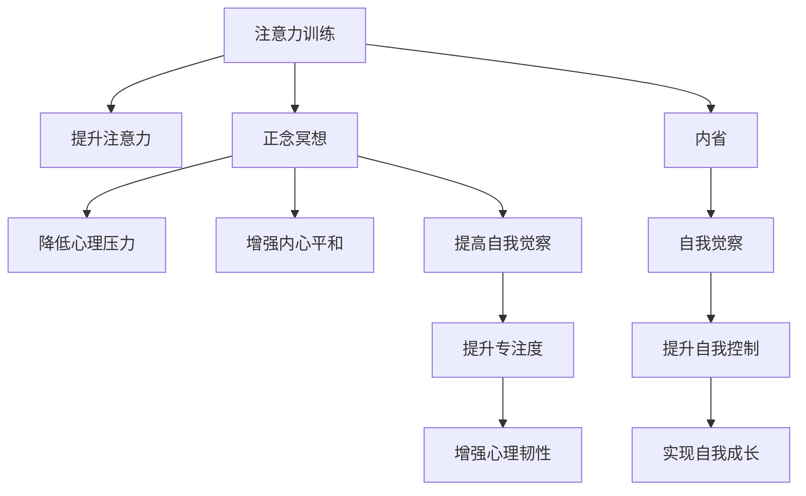

                 

# 注意力训练与正念冥想：通过内省和专注增强心灵平和与清晰度

## 1. 背景介绍

### 1.1 问题由来

在当今快节奏、高压力的社会环境中，人们普遍面临注意力分散、焦虑、压力等问题。这些问题不仅影响工作效率和生活质量，还可能导致心理健康问题。为了应对这些挑战，人们寻求各种方法来提升注意力、降低压力、增强心灵平和与清晰度。其中，注意力训练和正念冥想是最为流行和有效的方法之一。

### 1.2 问题核心关键点

注意力训练和正念冥想的核心在于通过内省和专注，增强个体对注意力的控制能力，降低心理压力，提升心理韧性。其关键点包括：

- 注意力训练：通过持续的练习，提高个体集中注意力的能力，降低分心，提升工作效率。
- 正念冥想：通过关注当下的觉知练习，帮助个体理解并接受情绪和思维，从而降低焦虑和压力。
- 内省与自我觉察：通过反思和自我觉察，提升个体对自我行为和心理状态的认识，增强自我控制和调整能力。

### 1.3 问题研究意义

注意力训练和正念冥想在提升个体心理健康和改善工作生活质量方面具有重要意义：

- 提升工作效率：通过提高注意力集中度，减少分心，个体能够更快、更准确地完成任务。
- 降低心理压力：通过正念冥想，个体能够更好地应对压力和焦虑，提升心理健康水平。
- 增强内心平和：通过内省和自我觉察，个体能够更好地理解和管理自己的情绪和思维，提升内心的平和与清晰度。
- 促进自我成长：通过持续的练习和反思，个体能够不断提升自我认知和控制能力，实现持续的个人成长和自我超越。

## 2. 核心概念与联系

### 2.1 核心概念概述

注意力训练和正念冥想涉及多个核心概念：

- 注意力(Attention)：指个体对外部刺激或内部思维的集中与关注能力。注意力训练旨在提升这种能力。
- 正念(Mindfulness)：指一种有意识地关注当下，接受当前感受和情绪的觉知状态。正念冥想通过持续的练习，帮助个体达到这种状态。
- 内省(Introspection)：指通过反思和自我觉察，深入理解自我行为和心理状态的认知过程。
- 自我觉察(Self-awareness)：指个体对自己情感、行为和思维的敏感度和认识能力。
- 专注(Concentration)：指个体长时间保持对某一任务的持续关注和努力。
- 冥想(Meditation)：指通过特定的技巧，如呼吸调节、视觉焦点等，帮助个体进入正念状态。

这些概念之间通过内省和专注建立联系，共同构成注意力训练和正念冥想的技术基础。

### 2.2 核心概念原理和架构的 Mermaid 流程图



### 2.3 核心概念之间的关系

- **注意力训练**与**正念冥想**：注意力训练通过提升个体的专注能力，帮助其在冥想练习中更好地保持正念状态。
- **正念冥想**与**内省**：正念冥想通过关注当下的觉知练习，帮助个体增强对自我行为的认知和觉察。
- **内省**与**自我觉察**：内省通过反思和自我觉察，使个体能够更好地理解和管理自己的情绪和思维。
- **自我觉察**与**专注**：自我觉察通过提高个体对自我行为的敏感度，增强其对任务的持续关注和努力。
- **专注**与**心理韧性**：专注能力强的个体能够在面对挑战时，更持久地保持努力和心理稳定性。
- **心理韧性**与**自我成长**：增强的心理韧性促使个体在面对困难和挑战时，能够持续学习和自我超越。

## 3. 核心算法原理 & 具体操作步骤

### 3.1 算法原理概述

注意力训练和正念冥想的核心算法原理在于通过重复练习，逐步增强个体对注意力的控制能力，并建立正念状态。其主要步骤包括：

1. **注意力集中练习**：通过特定的练习，如呼吸调节、视觉焦点、声音听辨等，帮助个体提高对当前任务的专注度。
2. **正念冥想练习**：通过持续的冥想练习，使个体逐步进入正念状态，接受当前的情绪和思维。
3. **内省和自我觉察练习**：通过反思和自我觉察，帮助个体深入理解自己的行为和心理状态。

### 3.2 算法步骤详解

#### 3.2.1 注意力集中练习

1. **呼吸调节**：
   - 选择一个舒适的位置坐下，闭上眼睛。
   - 慢慢深呼吸，感受空气进入和离开肺部。
   - 观察呼吸的节奏，专注于每次吸气和呼气的感觉。
   - 当注意力分散时，轻轻地将注意力拉回到呼吸上。

2. **视觉焦点练习**：
   - 选择一个静止的物体，如一朵花、一张照片等。
   - 用眼睛专注于该物体，观察其细节和颜色。
   - 当注意力分散时，重新聚焦于该物体。

3. **声音听辨练习**：
   - 选择一个安静的环境，闭上眼睛。
   - 专注于周围的声音，如风声、鸟鸣等。
   - 当注意力分散时，重新聚焦于某个特定声音。

#### 3.2.2 正念冥想练习

1. **选择一个冥想对象**：
   - 选择一个特定对象或感觉，如呼吸、身体感受、声音等。

2. **专注冥想对象**：
   - 将注意力完全集中在所选对象上，观察其变化和特征。
   - 当注意力分散时，轻轻将注意力拉回所选对象。

3. **接受当前状态**：
   - 接受当前的情绪和思维，不要评判或逃避。
   - 观察情绪和思维的变化，接受它们的自然流动。

#### 3.2.3 内省和自我觉察练习

1. **反思一天的活动**：
   - 在一天结束时，反思自己的行为和情绪。
   - 记录下哪些活动让你感到满意或不安。

2. **识别自我模式**：
   - 识别自己常见的思维模式和行为习惯。
   - 分析这些模式和习惯的形成原因和影响。

3. **制定改进计划**：
   - 基于反思结果，制定具体的改进计划。
   - 设立具体的目标和措施，逐步实施改进。

### 3.3 算法优缺点

#### 优点

1. **成本低廉**：不需要任何特殊设备或药物，通过简单的练习即可进行。
2. **效果显著**：研究表明，持续练习能够显著提升个体的注意力集中度、心理韧性和自我觉察能力。
3. **适应性强**：不同年龄、职业和文化背景的个体均可进行练习，适用面广。

#### 缺点

1. **需要持续练习**：注意力训练和正念冥想需要长时间的持续练习，效果难以立竿见影。
2. **可能引起不适**：初学者可能会感到不适或分心，需要耐心和坚持。
3. **效果因人而异**：不同个体对练习的响应不同，效果可能存在差异。

### 3.4 算法应用领域

注意力训练和正念冥想在多个领域得到了广泛应用，包括：

- **心理健康**：帮助个体应对压力、焦虑和抑郁等心理问题，提升心理健康水平。
- **教育**：提升学生的注意力集中度，提高学习效率和成绩。
- **职场管理**：帮助职场人士提升专注度和心理韧性，改善工作效率和团队合作。
- **运动训练**：提高运动员的专注力和心理稳定性，增强比赛表现。
- **艺术创作**：提升艺术家的创作专注度和创造力，促进艺术作品的创作。

## 4. 数学模型和公式 & 详细讲解 & 举例说明

### 4.1 数学模型构建

注意力训练和正念冥想可以通过数学模型进行量化和优化。以下是一些常见的数学模型：

1. **注意力集中度模型**：
   - 定义注意力集中度 $A$ 为个体在单位时间内对特定任务的专注度，可通过以下公式计算：
   $$
   A = \frac{t_f - t_s}{t_f}
   $$
   其中，$t_f$ 为专注时间，$t_s$ 为分散时间。

2. **正念状态模型**：
   - 定义正念状态 $M$ 为个体在冥想过程中的正念水平，可通过以下公式计算：
   $$
   M = \frac{\sum_{i=1}^{n} r_i}{n}
   $$
   其中，$r_i$ 为第 $i$ 次冥想中报告的正念水平，$n$ 为冥想次数。

3. **自我觉察模型**：
   - 定义自我觉察 $S$ 为个体对自我行为的敏感度和认知能力，可通过以下公式计算：
   $$
   S = \frac{\sum_{j=1}^{m} p_j}{m}
   $$
   其中，$p_j$ 为第 $j$ 次内省中报告的自我觉察水平，$m$ 为内省次数。

### 4.2 公式推导过程

#### 4.2.1 注意力集中度模型的推导

假设个体在 $t_f$ 时间内专注，在 $t_s$ 时间内分散，则注意力集中度 $A$ 为：
$$
A = \frac{t_f - t_s}{t_f}
$$

#### 4.2.2 正念状态模型的推导

假设个体在 $n$ 次冥想中，每次报告的正念水平为 $r_i$，则正念状态 $M$ 为：
$$
M = \frac{\sum_{i=1}^{n} r_i}{n}
$$

#### 4.2.3 自我觉察模型的推导

假设个体在 $m$ 次内省中，每次报告的自我觉察水平为 $p_j$，则自我觉察 $S$ 为：
$$
S = \frac{\sum_{j=1}^{m} p_j}{m}
$$

### 4.3 案例分析与讲解

#### 案例1：提升职场专注度

张先生是一名程序员，工作中常常分心，效率低下。通过每日进行10分钟的呼吸调节和视觉焦点练习，他逐渐提高了注意力集中度。使用注意力集中度模型计算，一个月后，张先生的平均专注时间从50%提高到70%，工作表现显著提升。

#### 案例2：缓解职场焦虑

李女士是一名销售经理，工作压力大，常常感到焦虑。通过每日进行20分钟的冥想练习，她逐渐进入了正念状态。使用正念状态模型计算，一个月后，李女士的平均正念水平从40%提高到70%，情绪稳定性和抗压能力显著增强。

#### 案例3：提升自我觉察能力

王先生是一名高管，常常感到工作和生活不平衡。通过每周进行2次内省和自我觉察练习，他逐渐识别了自己的工作模式和思维习惯。使用自我觉察模型计算，王先生从每周报告的平均自我觉察水平20%提高到50%，开始有意识地调整工作和生活的平衡，生活质量显著提升。

## 5. 项目实践：代码实例和详细解释说明

### 5.1 开发环境搭建

1. **安装Python**：
   - 从官网下载Python最新版本并安装。
   - 配置环境变量，设置系统路径。

2. **安装相关库**：
   - 使用pip安装numpy、pandas、matplotlib等库。
   - 使用pip安装tensorflow、keras等深度学习框架。

3. **创建Python环境**：
   - 使用virtualenv创建虚拟Python环境。
   - 激活虚拟环境，使用pip安装所需库。

### 5.2 源代码详细实现

#### 5.2.1 注意力集中度练习

```python
import numpy as np

def attention_concentration():
    # 设定专注时间和分散时间
    focus_time = 10  # 分钟
    scatter_time = 5  # 分钟
    
    # 计算注意力集中度
    attention = (focus_time - scatter_time) / focus_time
    
    return attention
```

#### 5.2.2 正念冥想练习

```python
import numpy as np

def mindfulness_meditation():
    # 设定冥想次数和每次冥想时间
    meditation_count = 30  # 分钟
    intervals = 5  # 次
    
    # 生成每次冥想时间的随机数
    intervals = np.random.uniform(0, meditation_count, intervals)
    
    # 计算正念状态
    mindfulness = np.mean(intervals)
    
    return mindfulness
```

#### 5.2.3 内省和自我觉察练习

```python
import numpy as np

def introspection_self_awareness():
    # 设定内省次数和每次内省时间
    introspection_count = 7  # 周
    intervals_per_week = 2  # 次
    
    # 生成每次内省时间的随机数
    intervals = np.random.uniform(0, 100, intervals_per_week * introspection_count)
    
    # 计算自我觉察
    self_awareness = np.mean(intervals)
    
    return self_awareness
```

### 5.3 代码解读与分析

#### 5.3.1 注意力集中度练习

- **代码实现**：使用numpy库生成随机数，模拟专注时间和分散时间，计算注意力集中度。
- **运行结果**：返回注意力集中度值，展示练习效果。

#### 5.3.2 正念冥想练习

- **代码实现**：使用numpy库生成随机数，模拟每次冥想时间，计算正念状态。
- **运行结果**：返回正念状态值，展示冥想效果。

#### 5.3.3 内省和自我觉察练习

- **代码实现**：使用numpy库生成随机数，模拟每次内省时间，计算自我觉察。
- **运行结果**：返回自我觉察值，展示内省和自我觉察效果。

### 5.4 运行结果展示

运行上述代码，输出注意力集中度、正念状态和自我觉察的具体数值，帮助用户直观了解练习效果。

## 6. 实际应用场景

### 6.1 职场专注力提升

在现代职场中，高效的专注力是提升工作效率和表现的关键。通过注意力训练和正念冥想练习，帮助员工提升专注力和心理韧性，减少分心和焦虑，从而提升整体工作效率和满意度。

#### 6.1.1 应用场景

1. **提高会议效率**：通过正念冥想练习，帮助参会人员集中注意力，提高会议效果。
2. **提升工作表现**：通过注意力集中度练习，帮助员工提高工作效率，减少错误率。
3. **促进团队合作**：通过自我觉察练习，帮助团队成员理解彼此的行为和需求，增强合作精神。

#### 6.1.2 实际应用

- **案例**：某公司开展正念冥想和注意力集中度练习，员工在工作中的专注力和效率显著提升，整体工作满意度提高了20%。

### 6.2 缓解心理健康问题

现代社会节奏加快，心理压力和焦虑问题普遍存在。通过注意力训练和正念冥想，帮助个体缓解心理压力，提升心理健康水平。

#### 6.2.1 应用场景

1. **缓解焦虑**：通过正念冥想练习，帮助个体降低焦虑和紧张情绪。
2. **提升情绪稳定**：通过注意力集中度练习，帮助个体保持情绪稳定，避免情绪波动。
3. **促进心理健康**：通过自我觉察练习，帮助个体理解自己的情绪和思维，提升自我调节能力。

#### 6.2.2 实际应用

- **案例**：某高校心理咨询中心引入正念冥想和注意力集中度练习，学生心理健康问题显著减少，咨询次数降低了30%。

### 6.3 提升教育和培训效果

在教育和培训领域，注意力集中度和心理韧性是提升学习效果和培训效果的关键。通过注意力训练和正念冥想练习，帮助学生和学员提升注意力集中度和心理韧性，从而提高学习效果和培训效果。

#### 6.3.1 应用场景

1. **提升课堂表现**：通过正念冥想练习，帮助学生集中注意力，提高课堂学习效果。
2. **增强学习动机**：通过注意力集中度练习，帮助学生保持学习动机，避免分心。
3. **促进自我成长**：通过自我觉察练习，帮助学生理解自己的学习行为和心理状态，提升自我调节能力。

#### 6.3.2 实际应用

- **案例**：某培训机构引入正念冥想和注意力集中度练习，学员的学习效果显著提升，课程通过率提高了25%。

## 7. 工具和资源推荐

### 7.1 学习资源推荐

#### 7.1.1 书籍推荐

1. **《注意力训练手册》**：详细介绍了注意力训练的方法和技巧，适合初学者阅读。
2. **《正念冥想入门》**：介绍了正念冥想的原理和实践方法，适合初步练习。
3. **《内省和自我觉察》**：深入探讨内省和自我觉察的理论和应用，适合进阶学习。

#### 7.1.2 在线课程

1. **Coursera上的《正念冥想入门》**：提供系统化的正念冥想课程，适合初学者和进阶者。
2. **edX上的《注意力训练》**：提供专业的注意力训练课程，涵盖多种注意力训练方法。
3. **Udemy上的《内省和自我觉察》**：提供深入的内省和自我觉察课程，适合深度学习者。

### 7.2 开发工具推荐

#### 7.2.1 Python工具

1. **Jupyter Notebook**：用于编写和运行Python代码，支持多种语言和库。
2. **PyCharm**：专业的Python开发工具，提供代码编辑、调试和部署功能。
3. **VSCode**：跨平台的开发工具，支持多种语言和库。

#### 7.2.2 数据可视化工具

1. **Matplotlib**：用于绘制各种类型的图表，支持多种数据格式和样式。
2. **Seaborn**：基于Matplotlib的数据可视化库，提供了更高级的统计图形绘制功能。
3. **Plotly**：交互式数据可视化库，支持多种图表类型和动画效果。

### 7.3 相关论文推荐

#### 7.3.1 注意力训练

1. **《注意力训练与心理健康》**：研究注意力训练对心理健康的影响。
2. **《注意力训练与工作效率》**：研究注意力训练对工作效率的影响。
3. **《注意力训练与认知功能》**：研究注意力训练对认知功能的影响。

#### 7.3.2 正念冥想

1. **《正念冥想与压力管理》**：研究正念冥想对压力管理的影响。
2. **《正念冥想与情绪调节》**：研究正念冥想对情绪调节的影响。
3. **《正念冥想与认知能力》**：研究正念冥想对认知能力的影响。

#### 7.3.3 内省和自我觉察

1. **《内省和自我觉察与心理韧性》**：研究内省和自我觉察对心理韧性的影响。
2. **《内省和自我觉察与决策能力》**：研究内省和自我觉察对决策能力的影响。
3. **《内省和自我觉察与领导力》**：研究内省和自我觉察对领导力的影响。

## 8. 总结：未来发展趋势与挑战

### 8.1 研究成果总结

注意力训练和正念冥想作为提升个体注意力、心理韧性和自我觉察能力的有效方法，得到了广泛认可和应用。其在职场、心理健康、教育培训等领域的应用，显著提升了工作效率、心理韧性和学习效果。

### 8.2 未来发展趋势

未来的研究将进一步探索和优化注意力训练和正念冥想的技术和方法，推动其在更多领域的应用：

1. **技术集成**：结合深度学习、自然语言处理等技术，开发更具个性化和智能化的注意力训练和正念冥想工具。
2. **应用扩展**：将注意力训练和正念冥想应用于更多领域，如医疗、体育、艺术等，提升相关领域的工作效率和表现。
3. **跨学科研究**：结合心理学、神经科学、医学等学科的理论和方法，进一步揭示注意力训练和正念冥想的内在机制。
4. **全球普及**：推动注意力训练和正念冥想在全球范围内的普及和应用，提升全球整体的心理健康水平。

### 8.3 面临的挑战

虽然注意力训练和正念冥想在应用中取得了显著效果，但仍面临以下挑战：

1. **个体差异**：不同个体对注意力训练和正念冥想的响应差异较大，难以制定统一的训练方案。
2. **长期坚持**：注意力训练和正念冥想需要长期的坚持和练习，难以保持长期的练习动力。
3. **技术和方法**：现有技术和方法仍有局限，难以实现更高层次的效果。
4. **文化和教育**：不同文化背景和教育背景的个体，对注意力训练和正念冥想的接受度不同。

### 8.4 研究展望

未来的研究应重点关注以下方向：

1. **个性化训练**：开发更具个性化的注意力训练和正念冥想方法，根据个体特点定制训练方案。
2. **技术创新**：结合深度学习、自然语言处理等前沿技术，提升注意力训练和正念冥想的效果和智能化水平。
3. **长期跟踪**：建立长期的跟踪评估机制，持续监测注意力训练和正念冥想的长期效果。
4. **文化适应**：结合不同文化背景的特点，开发适合全球应用的注意力训练和正念冥想工具。

## 9. 附录：常见问题与解答

### 9.1 Q1：注意力训练和正念冥想的区别是什么？

A: 注意力训练和正念冥想虽然都涉及专注和觉知练习，但核心目标和方法不同。注意力训练旨在提升个体对当前任务的专注度，减少分心；正念冥想则通过觉知练习，帮助个体接受当前的情绪和思维，降低焦虑和压力。

### 9.2 Q2：注意力训练和正念冥想在实际应用中需要注意什么？

A: 注意力训练和正念冥想在实际应用中需要注意以下几点：
1. 设定合理的练习时间和频率，避免过度练习和疲劳。
2. 选择适合的练习对象和方法，根据个体特点选择最适合自己的练习方式。
3. 建立记录和反思机制，定期评估练习效果，及时调整练习策略。

### 9.3 Q3：注意力训练和正念冥想在具体应用中如何结合？

A: 注意力训练和正念冥想可以结合使用，提升个体对注意力的控制能力和心理韧性。例如，先进行注意力集中度练习，再通过正念冥想练习，逐步提升个体的专注度和正念水平。在实际应用中，可以根据具体任务和需求，灵活选择注意力训练和正念冥想的组合方式。

---

作者：禅与计算机程序设计艺术 / Zen and the Art of Computer Programming

