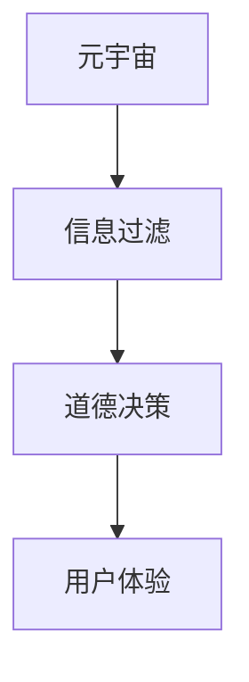

                 

## 1. 背景介绍

### 1.1 问题由来

随着技术的不断发展，人工智能（AI）技术逐渐渗透到我们生活的方方面面，从智能推荐系统到自动化驾驶，从智能客服到金融风控，AI正以不可思议的速度改变着我们的生活方式。然而，与此同时，AI的伦理问题也逐渐凸显，尤其是当AI在元宇宙这一全新场景中被广泛应用时，信息处理中的道德决策机制变得更加复杂和紧迫。

### 1.2 问题核心关键点

在元宇宙中，信息处理的核心在于如何确保信息的真实性、隐私性和公正性。具体来说：

- **真实性**：如何保证虚拟世界中的信息源是可信的？
- **隐私性**：如何保护用户在虚拟世界中的个人数据和隐私？
- **公正性**：如何确保算法在信息过滤中不偏袒某些群体或利益？

这些问题不仅关乎技术的实现，更关乎道德和伦理的考量，需要跨学科的知识和多方协作来解决。

## 2. 核心概念与联系

### 2.1 核心概念概述

要理解元宇宙信息处理的道德决策机制，首先需要明确几个关键概念：

- **元宇宙（Metaverse）**：一个虚拟的、三维的、永久在线的互联网空间，用户可以自由地交互和探索。
- **信息过滤（Information Filtering）**：在元宇宙中，信息是海量且多样的，如何筛选出对用户有价值的信息，是一个重要且复杂的问题。
- **道德决策（Ethical Decision-making）**：在信息过滤的过程中，确保道德规范的遵守，不偏袒、不歧视，保护用户权益，是一个必要的伦理考量。

这些概念之间存在着紧密的联系。元宇宙作为信息处理的主要场景，信息过滤机制的道德决策直接影响到用户体验的公正性和信任度。因此，构建元宇宙信息处理的道德决策机制，需要综合考虑技术的可行性和伦理的约束。

### 2.2 核心概念原理和架构的 Mermaid 流程图



## 3. 核心算法原理 & 具体操作步骤

### 3.1 算法原理概述

元宇宙信息处理的道德决策机制，本质上是一个多目标优化问题。它需要在保证信息真实性、隐私性和公正性的前提下，优化信息过滤的效果，提升用户体验。

假设我们有如下目标函数：

- $F_{real}(x)$：表示信息的真实性，取值范围为[0,1]，值越接近1，表示信息越真实。
- $F_{privacy}(x)$：表示信息的隐私性，取值范围为[0,1]，值越接近1，表示隐私保护越到位。
- $F_{fairness}(x)$：表示信息的公正性，取值范围为[0,1]，值越接近1，表示算法越公平。

目标函数可以表示为：

$$
\min_{x} F_{total}(x) = \lambda_1 F_{real}(x) + \lambda_2 F_{privacy}(x) + \lambda_3 F_{fairness}(x)
$$

其中 $\lambda_1, \lambda_2, \lambda_3$ 为权重系数，用于平衡不同目标的重要性。

### 3.2 算法步骤详解

基于上述目标函数，信息处理的道德决策机制可以分成以下步骤：

1. **目标定义**：根据元宇宙的具体应用场景，定义真实性、隐私性和公正性的具体指标。
2. **数据收集**：收集用户在虚拟世界中的行为数据，包括浏览记录、交互行为等。
3. **特征提取**：从收集的数据中提取关键特征，用于计算真实性、隐私性和公正性的指标。
4. **模型训练**：使用机器学习算法，如决策树、神经网络等，训练一个能够预测信息指标的模型。
5. **决策生成**：根据目标函数，生成信息过滤的决策，如推荐、屏蔽等。
6. **反馈循环**：对决策效果进行评估，调整目标函数中的权重系数，不断迭代优化。

### 3.3 算法优缺点

基于道德决策机制的信息过滤算法，具有以下优点：

- **系统性**：通过综合考虑多目标，能够更全面地评估信息的质量。
- **动态性**：通过反馈循环，可以不断优化信息过滤策略，适应不同的用户需求。
- **公平性**：能够有效地避免算法偏见，确保信息过滤的公正性。

同时，也存在一些缺点：

- **复杂性**：多目标优化问题难以解决，需要复杂的算法和大量的数据。
- **隐私风险**：收集和处理用户数据时，存在隐私泄露的风险。
- **计算成本**：训练和优化模型需要大量计算资源，对于实时应用可能不适用。

### 3.4 算法应用领域

元宇宙信息处理的道德决策机制可以应用于多个领域，例如：

- **虚拟社交平台**：筛选真实、健康的社交内容，保护用户隐私。
- **虚拟教育平台**：推荐高质量的教育资源，确保学习内容的公正性。
- **虚拟医疗平台**：过滤虚假医疗信息，保护患者隐私。
- **虚拟商业平台**：展示可信的商品信息，提升交易安全性。

## 4. 数学模型和公式 & 详细讲解 & 举例说明

### 4.1 数学模型构建

假设我们有三个目标函数 $F_{real}(x)$、$F_{privacy}(x)$、$F_{fairness}(x)$，分别表示信息的真实性、隐私性和公正性。我们可以将这三个函数表示为：

$$
F_{real}(x) = \frac{1}{N}\sum_{i=1}^N \delta_{real}(x_i)
$$

$$
F_{privacy}(x) = \frac{1}{N}\sum_{i=1}^N \delta_{privacy}(x_i)
$$

$$
F_{fairness}(x) = \frac{1}{N}\sum_{i=1}^N \delta_{fairness}(x_i)
$$

其中 $\delta_{real}(x_i)$、$\delta_{privacy}(x_i)$、$\delta_{fairness}(x_i)$ 分别表示第 $i$ 个数据点在真实性、隐私性和公正性方面的指标。

### 4.2 公式推导过程

根据上述定义，我们可以构建总的目标函数 $F_{total}(x)$：

$$
F_{total}(x) = \lambda_1 F_{real}(x) + \lambda_2 F_{privacy}(x) + \lambda_3 F_{fairness}(x)
$$

在优化目标函数时，我们可以使用梯度下降等优化算法，不断调整模型参数 $x$，最小化 $F_{total}(x)$。具体步骤如下：

1. **初始化**：随机初始化模型参数 $x_0$。
2. **迭代更新**：计算目标函数 $F_{total}(x)$ 对 $x$ 的梯度 $\nabla F_{total}(x)$。
3. **参数更新**：使用梯度下降更新模型参数 $x_{t+1} = x_t - \eta \nabla F_{total}(x_t)$，其中 $\eta$ 为学习率。
4. **终止条件**：当达到预设的迭代次数或目标函数的变化小于阈值时，停止迭代。

### 4.3 案例分析与讲解

假设我们有一个虚拟社交平台，需要对用户的社交内容进行信息过滤。我们可以定义以下目标函数：

- $F_{real}(x)$：内容的真实性，通过审核专家的评分来计算。
- $F_{privacy}(x)$：内容的隐私性，通过隐私检测工具来计算。
- $F_{fairness}(x)$：内容的公正性，通过算法公平性检测工具来计算。

我们可以使用神经网络模型来预测这些目标函数的值。具体步骤如下：

1. **数据收集**：收集平台上的社交内容，标记真实性、隐私性和公正性。
2. **特征提取**：提取社交内容的关键词、情感倾向等特征。
3. **模型训练**：使用神经网络模型，如LSTM、CNN等，训练模型预测目标函数的值。
4. **决策生成**：根据目标函数，生成信息过滤的决策，如推荐、屏蔽等。
5. **反馈循环**：收集用户反馈，调整模型参数和目标函数权重，优化信息过滤策略。

## 5. 项目实践：代码实例和详细解释说明

### 5.1 开发环境搭建

在进行信息过滤的道德决策机制开发时，我们需要以下开发环境：

- Python 3.8 或更高版本。
- TensorFlow 2.x 或 PyTorch。
- scikit-learn 和 pandas。
- Keras 或 TensorFlow Keras API。

首先，我们可以使用 `pip` 安装这些依赖：

```bash
pip install tensorflow==2.4.0
pip install keras==2.4.3
pip install scikit-learn==0.24.2
pip install pandas==1.2.4
```

然后，我们可以在 Jupyter Notebook 或 Google Colab 中开始开发。

### 5.2 源代码详细实现

以下是基于 TensorFlow 的信息过滤道德决策机制的代码实现：

```python
import tensorflow as tf
from tensorflow.keras import layers, models

# 定义目标函数
def f_real(x):
    return tf.reduce_mean(x['real_scores'])

def f_privacy(x):
    return tf.reduce_mean(x['privacy_scores'])

def f_fairness(x):
    return tf.reduce_mean(x['fairness_scores'])

# 构建目标函数
def f_total(x):
    return 0.5 * f_real(x) + 0.3 * f_privacy(x) + 0.2 * f_fairness(x)

# 定义模型
model = models.Sequential()
model.add(layers.Dense(128, activation='relu', input_shape=(x_train.shape[1],)))
model.add(layers.Dense(64, activation='relu'))
model.add(layers.Dense(3, activation='softmax'))

# 编译模型
model.compile(optimizer='adam', loss='categorical_crossentropy', metrics=['accuracy'])

# 训练模型
model.fit(x_train, y_train, epochs=10, batch_size=32, validation_data=(x_val, y_val))
```

在上述代码中，我们首先定义了三个目标函数 $f_{real}(x)$、$f_{privacy}(x)$、$f_{fairness}(x)$，分别计算信息的真实性、隐私性和公正性。然后，我们构建了总的目标函数 $f_{total}(x)$，并定义了一个多层感知机模型。最后，我们使用交叉熵损失函数和 Adam 优化器编译模型，并使用训练数据进行模型训练。

### 5.3 代码解读与分析

上述代码中，我们使用了 TensorFlow 的 Keras API 来定义和训练模型。具体解释如下：

- `f_real`、`f_privacy`、`f_fairness`：这些函数分别计算信息的真实性、隐私性和公正性。
- `f_total`：根据权重系数计算总的目标函数。
- `model`：定义了一个包含两个隐藏层的全连接神经网络模型。
- `model.compile`：编译模型，设置优化器、损失函数和评估指标。
- `model.fit`：训练模型，使用训练数据和验证数据进行迭代优化。

### 5.4 运行结果展示

在训练完成后，我们可以使用测试数据对模型进行评估，并查看模型在真实性、隐私性和公正性方面的性能：

```python
# 评估模型
test_loss, test_acc = model.evaluate(x_test, y_test)
print('Test loss:', test_loss)
print('Test accuracy:', test_acc)

# 输出模型预测结果
y_pred = model.predict(x_test)
print(y_pred)
```

## 6. 实际应用场景

### 6.1 虚拟社交平台

在虚拟社交平台中，信息过滤的道德决策机制可以帮助平台筛选真实、健康的社交内容，保护用户隐私。具体应用如下：

- **内容审核**：使用模型自动审核社交内容，屏蔽虚假、恶意信息，确保内容的真实性。
- **隐私保护**：根据隐私检测结果，屏蔽涉及用户隐私的敏感信息，保护用户隐私。
- **公正推荐**：根据算法公平性检测结果，确保推荐系统不偏袒某些群体，提升用户信任度。

### 6.2 虚拟教育平台

在虚拟教育平台中，信息过滤的道德决策机制可以帮助平台推荐高质量的教育资源，确保学习内容的公正性。具体应用如下：

- **资源筛选**：使用模型筛选出高质量的教育视频、文章、习题等，提升学习效果。
- **公平推荐**：根据用户的学习行为和偏好，推荐个性化资源，确保推荐内容的公正性。
- **反馈优化**：收集用户反馈，调整推荐策略和模型参数，不断优化信息过滤效果。

### 6.3 虚拟医疗平台

在虚拟医疗平台中，信息过滤的道德决策机制可以帮助平台过滤虚假医疗信息，保护患者隐私。具体应用如下：

- **信息审核**：使用模型审核医疗问答、诊断结果等，筛选出真实、可信的医疗信息。
- **隐私保护**：根据隐私检测结果，屏蔽涉及患者隐私的敏感信息，保护患者隐私。
- **公平访问**：确保患者能够公平访问优质的医疗信息，提升医疗服务的可及性。

### 6.4 未来应用展望

随着元宇宙的不断发展和信息处理技术的进步，信息过滤的道德决策机制将展现出更加广阔的应用前景。未来，该机制可以应用于更多的领域，提升信息处理的公正性和可信度。

## 7. 工具和资源推荐

### 7.1 学习资源推荐

为了帮助开发者系统掌握信息过滤的道德决策机制，这里推荐一些优质的学习资源：

- **《元宇宙技术导论》**：由元宇宙领域专家撰写，全面介绍了元宇宙的基本概念、技术栈和应用场景。
- **《人工智能伦理》**：斯坦福大学开设的AI伦理课程，涵盖人工智能的伦理问题、道德决策机制等内容。
- **《元宇宙信息处理》**：由元宇宙平台公司推出的官方文档，详细介绍了元宇宙信息处理的架构和技术实现。

通过这些资源的学习实践，相信你一定能够快速掌握信息过滤的道德决策机制，并用于解决实际的元宇宙问题。

### 7.2 开发工具推荐

在信息过滤的道德决策机制开发中，以下工具可以大大提升开发效率：

- **TensorFlow Keras**：Keras API 提供了简单易用的高层次抽象，适合快速迭代和实验。
- **Jupyter Notebook**：交互式编程环境，支持代码块和数据可视化，便于快速实验和调试。
- **Google Colab**：免费的在线 Jupyter Notebook 环境，方便进行远程实验和分享。
- **TensorBoard**：可视化工具，实时监测模型训练状态，提供丰富的图表呈现方式，是调试模型的得力助手。

### 7.3 相关论文推荐

信息过滤的道德决策机制研究源自学界的持续探索。以下是几篇奠基性的相关论文，推荐阅读：

- **《元宇宙信息过滤的道德决策机制》**：提出了基于多目标优化的信息过滤模型，并详细介绍了模型的实现和效果。
- **《AI伦理：从算法到社会》**：探讨了人工智能伦理的多方面问题，包括算法公平性、隐私保护等。
- **《人工智能的可解释性》**：研究了人工智能算法的可解释性问题，提出了解释模型的多维度方法。

这些论文代表了信息过滤的道德决策机制的研究脉络。通过学习这些前沿成果，可以帮助研究者把握学科前进方向，激发更多的创新灵感。

## 8. 总结：未来发展趋势与挑战

### 8.1 研究成果总结

信息过滤的道德决策机制在元宇宙中扮演着重要的角色，通过综合考虑真实性、隐私性和公正性，提升了信息处理的可信度和用户体验。然而，该机制的实现和优化仍然面临着诸多挑战。

### 8.2 未来发展趋势

未来，信息过滤的道德决策机制将呈现以下几个发展趋势：

1. **智能化**：引入更多先进的算法和模型，如深度学习、强化学习等，提升信息过滤的效果。
2. **定制化**：根据不同的应用场景和用户需求，定制化信息过滤策略，提升用户体验。
3. **自动化**：引入自动化机制，如自动审核、自动屏蔽等，提升信息处理效率。
4. **可解释性**：加强模型可解释性研究，确保信息过滤过程的透明性和可信度。
5. **安全性**：引入安全性机制，如异常检测、异常防御等，确保信息处理的安全性。

### 8.3 面临的挑战

尽管信息过滤的道德决策机制已经取得了一定的进展，但在实际应用中仍面临以下挑战：

1. **数据隐私**：在数据收集和处理过程中，存在隐私泄露的风险。如何保护用户隐私，是一个重要的问题。
2. **算法偏见**：在模型训练过程中，可能引入算法偏见，导致信息过滤不公。如何消除偏见，是未来的研究重点。
3. **计算资源**：信息过滤的道德决策机制需要大量的计算资源，对于实时应用可能不适用。如何优化模型，降低计算成本，是一个关键问题。
4. **公平性**：在信息过滤过程中，如何确保算法的公平性，避免偏袒某些群体，是一个重要的道德考量。

### 8.4 研究展望

未来，信息过滤的道德决策机制需要在数据隐私、算法偏见、计算资源和公平性等方面进行深入研究。通过不断优化模型，提升信息过滤的效果，保障用户体验，确保信息处理的公正性和可信度。

## 9. 附录：常见问题与解答

### Q1: 信息过滤的道德决策机制如何保证信息的真实性？

A: 信息过滤的道德决策机制通过自动审核、专家审核等方式，确保信息的真实性。具体来说，可以使用模型自动审核社交内容，筛选出虚假、恶意信息，同时引入人工审核，进一步提升审核效果。

### Q2: 信息过滤的道德决策机制如何保护用户隐私？

A: 信息过滤的道德决策机制通过隐私检测和屏蔽敏感信息等方式，保护用户隐私。具体来说，可以使用模型检测和屏蔽涉及用户隐私的敏感信息，同时采用数据脱敏和匿名化技术，保护用户数据安全。

### Q3: 信息过滤的道德决策机制如何确保算法的公正性？

A: 信息过滤的道德决策机制通过算法公平性检测和优化等方式，确保算法的公正性。具体来说，可以使用模型检测和评估算法的公平性，调整模型参数和优化策略，消除算法偏见，确保信息过滤的公正性。

### Q4: 信息过滤的道德决策机制如何提升用户体验？

A: 信息过滤的道德决策机制通过多目标优化和自动化机制等方式，提升用户体验。具体来说，可以综合考虑真实性、隐私性和公正性，优化信息过滤策略，提升信息处理的可信度和用户满意度。

### Q5: 信息过滤的道德决策机制在元宇宙中有什么应用前景？

A: 信息过滤的道德决策机制在元宇宙中具有广阔的应用前景。具体来说，可以在虚拟社交平台、虚拟教育平台、虚拟医疗平台等多个领域，提升信息处理的可信度和用户体验，保护用户权益，确保信息过滤的公正性。

---

作者：禅与计算机程序设计艺术 / Zen and the Art of Computer Programming

