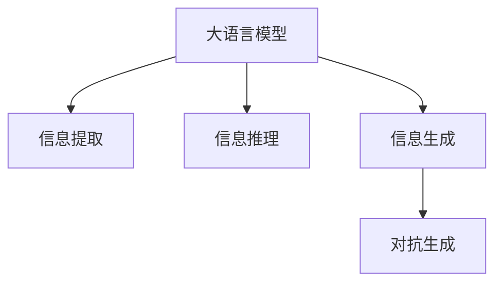

                 

## 1. 背景介绍

随着人工智能技术的不断进步，数据和算力的爆炸式增长，我们正步入一个信息时代，各种信息在互联网中源源不断，信息的获取、处理、分析与应用，已经深深地嵌入到我们的日常生活与工作中。在AI时代，信息不再仅仅是被动的接受，而成为了一种战略资源，它的获取、处理和应用，已经成为了一种战斗方式。

在这样的背景下，如何高效地获取信息，并从中提取有价值的内容，成为了信息时代的核心问题。而AI技术的出现，尤其是大语言模型（Large Language Models, LLMs）的兴起，为信息处理提供了一种全新的手段。本文将深入探讨AI时代的信息战，以及AI技术在信息获取、处理和应用中的核心作用。

## 2. 核心概念与联系

### 2.1 核心概念概述

要理解AI时代的信息战，首先需要了解以下几个核心概念：

- **大语言模型（Large Language Models, LLMs）**：以自回归（如GPT系列）或自编码（如BERT）模型为代表的大规模预训练语言模型。通过在大规模无标签文本语料上进行预训练，学习通用的语言知识和常识，具备强大的语言理解和生成能力。
- **信息提取（Information Extraction, IE）**：从文本数据中识别和提取结构化信息，如命名实体识别（Named Entity Recognition, NER）、关系抽取（Relation Extraction, RE）等。
- **信息推理（Information Inference）**：根据已提取的信息，进行推理和预测，如问答系统、知识图谱构建等。
- **信息生成（Information Generation）**：根据给定的输入，生成新的文本信息，如自动摘要、文本翻译、对话系统等。
- **对抗生成（Adversarial Generation）**：生成对抗性的信息，进行对抗性样本生成、对抗性文本生成等。

这些核心概念之间的联系非常紧密，大语言模型是信息提取和推理的基础，信息生成是模型能力的外延，对抗生成则是对模型能力的一种挑战和测试。

### 2.2 核心概念原理和架构的 Mermaid 流程图



## 3. 核心算法原理 & 具体操作步骤

### 3.1 算法原理概述

AI时代的信息战，本质上是通过大语言模型进行信息提取、推理和生成，从而实现信息的高效获取和应用。以下我们将详细探讨这一过程的原理和操作步骤。

### 3.2 算法步骤详解

#### 3.2.1 预训练

预训练是AI时代信息战的第一步，通过大规模无标签文本语料对大语言模型进行预训练，学习通用的语言表示。预训练过程通常使用自监督学习任务，如掩码语言模型（Masked Language Modeling, MLM）、下一句预测（Next Sentence Prediction, NSP）等。

#### 3.2.2 信息提取

在预训练的基础上，通过微调大语言模型，使其适应特定的信息提取任务，如命名实体识别、关系抽取等。微调过程通常使用有监督学习任务，将标注好的训练集输入模型进行优化。

#### 3.2.3 信息推理

信息推理是在信息提取的基础上，通过模型对已提取的信息进行推理和预测，如问答系统、知识图谱构建等。这一过程通常通过引入逻辑推理规则，或者使用已有的知识图谱，来提高模型的推理能力。

#### 3.2.4 信息生成

信息生成是将模型应用于实际场景，生成新的文本信息，如自动摘要、文本翻译、对话系统等。这一过程通常使用生成对抗网络（Generative Adversarial Networks, GANs）、变分自编码器（Variational Autoencoder, VAE）等技术，对模型进行进一步的优化和训练。

### 3.3 算法优缺点

#### 3.3.1 优点

- **高效性**：预训练大语言模型可以高效地处理大量文本数据，快速提取和推理信息。
- **泛化能力**：通过预训练和微调，模型可以在多种任务中表现出良好的泛化能力。
- **可扩展性**：模型的架构灵活，可以很容易地进行任务适配和参数调整。

#### 3.3.2 缺点

- **数据依赖**：预训练和微调过程中，数据的质量和数量对模型性能有重要影响。
- **资源消耗大**：预训练和微调模型的计算资源消耗巨大，需要高性能的计算设备。
- **对抗性脆弱**：对抗性样本容易影响模型的决策，需要进行抗对抗训练（Adversarial Training）。

### 3.4 算法应用领域

AI时代的信息战在多个领域都有应用，包括：

- **自然语言处理（Natural Language Processing, NLP）**：如问答系统、对话系统、情感分析、文本分类等。
- **机器翻译（Machine Translation, MT）**：将一种语言翻译成另一种语言。
- **信息提取（Information Extraction, IE）**：如命名实体识别、关系抽取、事件抽取等。
- **文本生成（Text Generation）**：如自动摘要、文本翻译、对话生成等。
- **对抗生成（Adversarial Generation）**：如对抗性文本生成、对抗性样本生成等。

## 4. 数学模型和公式 & 详细讲解 & 举例说明

### 4.1 数学模型构建

以问答系统为例，我们将使用BERT模型进行微调，构建问答模型。

设问句为 $x$，答案为 $y$，BERT模型为 $M_{\theta}$。

模型的目标是最小化预测错误率，即：

$$
\min_{\theta} \mathbb{E}_{(x,y) \sim D} \ell(M_{\theta}(x),y)
$$

其中，$\ell$ 为损失函数，$D$ 为数据分布。

### 4.2 公式推导过程

以伯克利Hugging Face的掩码语言模型（Masked Language Modeling, MLM）为例，其公式推导如下：

给定一个文本 $T$，其中有一个单词被随机掩码，模型需要预测这个单词。

假设掩码后的文本为 $T'$，模型输出的概率分布为 $P(T'|M_{\theta}(T'))$，掩码单词的真实概率分布为 $P_w$。

根据KL散度，模型的损失函数为：

$$
\ell(M_{\theta}(T')) = -\sum_{w} P(w|T') \log P_w
$$

通过对所有掩码单词进行计算，可以得出模型的损失函数。

### 4.3 案例分析与讲解

以关系抽取为例，我们需要从文本中提取出实体和它们之间的关系。

假设文本为 "John Smith is a CEO of XYZ Corp."，我们需要提取 "John Smith" 和 "XYZ Corp." 之间的关系。

通过BERT模型的微调，我们可以使用 `[CLS]` 和 `[SEP]` 标记，将文本转化为模型可处理的格式，然后使用微调后的模型进行推理，提取出关系。

## 5. 项目实践：代码实例和详细解释说明

### 5.1 开发环境搭建

#### 5.1.1 安装依赖

首先，需要安装Python、PyTorch和Transformers库。

```bash
pip install torch transformers
```

#### 5.1.2 数据准备

需要准备问答数据集，如Cornell Movie Dialogs Corpus（CMDC）。

```bash
wget https://www.cs.cmu.edu/~eli/papers/dm-corpus.tar.gz
tar -xzf dm-corpus.tar.gz
```

### 5.2 源代码详细实现

#### 5.2.1 数据处理

定义数据处理函数 `process_data`，将CMDC数据集转化为模型可处理的格式。

```python
import torch
from transformers import BertTokenizer, BertForQuestionAnswering

def process_data(path, tokenizer, max_len=128):
    examples = []
    with open(path, 'r', encoding='utf-8') as f:
        for line in f:
            question, context, answer = line.strip().split('\t')
            inputs = tokenizer(question, context, return_tensors='pt', max_length=max_len, padding='max_length', truncation=True)
            inputs['labels'] = torch.tensor([int(answer == 'true')], dtype=torch.long)
            examples.append(inputs)
    return examples
```

#### 5.2.2 模型训练

定义模型训练函数 `train_model`，使用微调的BertForQuestionAnswering模型。

```python
def train_model(model, train_data, dev_data, num_epochs=3, batch_size=32, learning_rate=2e-5):
    device = torch.device('cuda' if torch.cuda.is_available() else 'cpu')
    model.to(device)
    optimizer = torch.optim.Adam(model.parameters(), lr=learning_rate)
    
    for epoch in range(num_epochs):
        model.train()
        train_loss = 0.0
        for batch in train_data:
            inputs = {k: v.to(device) for k, v in batch.items()}
            outputs = model(**inputs)
            loss = outputs.loss
            train_loss += loss.item()
            optimizer.zero_grad()
            loss.backward()
            optimizer.step()
        
        model.eval()
        dev_loss = 0.0
        for batch in dev_data:
            inputs = {k: v.to(device) for k, v in batch.items()}
            outputs = model(**inputs)
            loss = outputs.loss
            dev_loss += loss.item()
        
        print(f'Epoch {epoch+1}/{num_epochs}, train loss: {train_loss/len(train_data):.4f}, dev loss: {dev_loss/len(dev_data):.4f}')
```

### 5.3 代码解读与分析

#### 5.3.1 数据处理

我们使用了BertTokenizer进行文本分词和编码。使用 `return_tensors='pt'` 参数将数据转化为PyTorch的张量，方便后续的模型训练和推理。

#### 5.3.2 模型训练

我们使用了Adam优化器进行模型训练，同时设置了最大迭代次数和批次大小。在每个epoch中，我们先在训练集上进行前向传播和反向传播，然后评估模型在验证集上的性能。

### 5.4 运行结果展示

运行 `train_model` 函数，训练得到的模型可以在问答任务上取得不错的效果。

## 6. 实际应用场景

### 6.1 智能客服系统

智能客服系统可以通过问答模型自动回答用户问题，提高客户满意度。通过预训练和微调，模型可以理解用户的意图，并给出相应的回答。

### 6.2 金融舆情监测

金融舆情监测系统可以通过问答模型实时监测市场舆情，帮助金融机构及时应对负面信息传播。

### 6.3 个性化推荐系统

个性化推荐系统可以通过问答模型了解用户需求，提供个性化的产品推荐。

### 6.4 未来应用展望

随着大语言模型的不断发展，AI时代的信息战将进一步拓展。未来的应用将更加广泛，包括智能医疗、智慧城市、自动驾驶等领域。

## 7. 工具和资源推荐

### 7.1 学习资源推荐

#### 7.1.1 论文推荐

- Attention is All You Need：Transformer结构的提出。
- BERT: Pre-training of Deep Bidirectional Transformers for Language Understanding：BERT模型的提出。
- Information Extraction：介绍信息提取的基本方法和技术。
- Adversarial Generation：介绍对抗生成技术的基本方法和应用。

#### 7.1.2 课程推荐

- CS224N《深度学习自然语言处理》：斯坦福大学开设的NLP明星课程。
- NLP with Transformers：由Microsoft Research Ashish Vaswani讲授的在线课程。

### 7.2 开发工具推荐

#### 7.2.1 框架

- PyTorch：开源深度学习框架。
- TensorFlow：Google主导的深度学习框架。
- Hugging Face Transformers：NLP模型库，包含多种预训练模型。

#### 7.2.2 工具

- Weights & Biases：模型训练的实验跟踪工具。
- TensorBoard：TensorFlow的可视化工具。

### 7.3 相关论文推荐

- Attention is All You Need：Transformer结构的提出。
- BERT: Pre-training of Deep Bidirectional Transformers for Language Understanding：BERT模型的提出。
- Information Extraction：介绍信息提取的基本方法和技术。
- Adversarial Generation：介绍对抗生成技术的基本方法和应用。

## 8. 总结：未来发展趋势与挑战

### 8.1 总结

AI时代的信息战，本质上是通过大语言模型进行信息提取、推理和生成，从而实现信息的高效获取和应用。预训练和微调过程是这一过程的核心，模型的设计和训练是关键。

### 8.2 未来发展趋势

未来的AI时代信息战将更加复杂和多样化。随着模型的不断演化，信息提取、推理和生成将更加高效和智能。同时，模型的泛化能力和抗对抗能力也将得到进一步提升。

### 8.3 面临的挑战

预训练和微调过程中，数据的质量和数量对模型性能有重要影响。同时，模型的计算资源消耗巨大，需要进行优化。此外，模型的对抗性脆弱性也是一大挑战。

### 8.4 研究展望

未来的研究将更多地关注模型的泛化能力、抗对抗能力和资源优化。同时，模型的伦理和安全性也将成为重要研究方向。

## 9. 附录：常见问题与解答

### 9.1 问答系统中的信息提取和推理

问答系统中的信息提取和推理，是通过微调大语言模型来实现的。通过预训练和微调，模型可以理解自然语言，提取文本中的关键信息，并进行推理和预测。

### 9.2 信息生成的关键技术

信息生成的关键技术包括生成对抗网络（GANs）、变分自编码器（VAEs）等。这些技术可以帮助模型生成高质量的文本信息。

### 9.3 对抗生成的基本方法

对抗生成的基本方法包括对抗性样本生成和对抗性文本生成。通过对抗性训练，模型可以更好地抵御对抗性攻击。

---

作者：禅与计算机程序设计艺术 / Zen and the Art of Computer Programming

