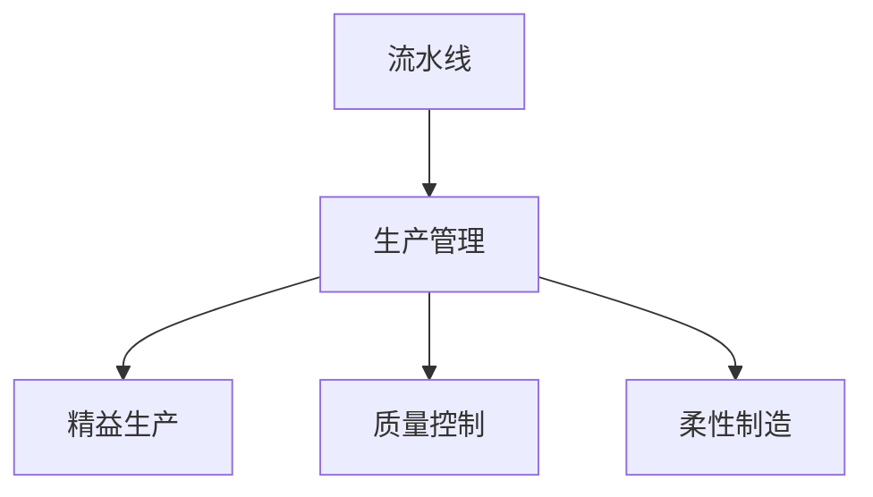

                 

# 流水线对工业生产的影响

## 1. 背景介绍

### 1.1 问题由来

随着工业化时代的来临，大规模的生产活动对效率和质量提出了更高的要求。传统的生产方式，即手工操作，面临生产速度慢、质量波动大的问题。流水线作为一种高效的生产方式，能够实现生产活动的标准化、连续化，大幅度提升了生产效率和产品质量，成为了现代工业生产的主要形式。流水线生产方式具有如下特点：

- **标准化**：每个工位的操作都按照既定的流程进行，减少操作过程中的人为错误，提升产品质量。
- **连续化**：生产活动在流水线上连续不断进行，保证了生产的连续性和稳定性。
- **高效率**：流水线方式通过分工合作，将复杂的操作分解为简单的小任务，使得工人的工作量降低，效率提高。

流水线的出现，不仅提高了工业生产的效率，也推动了生产技术的进步，催生了新的生产管理理念。但流水线生产方式也存在一定的局限性，如灵活性差、工人劳动强度高等问题。因此，未来的工业生产需要不断优化和创新，以适应更加复杂多变的市场需求。

## 2. 核心概念与联系

### 2.1 核心概念概述

为更好地理解流水线对工业生产的影响，本节将介绍几个关键概念：

- **流水线(Production Line)**：一种集中化、连续化的生产方式，通过将生产流程分解为多个简单的操作，由多个工位按照固定的顺序依次进行，实现生产的自动化和标准化。
- **生产管理(Production Management)**：通过计划、组织、控制等手段，对生产活动进行系统的管理，以提高生产效率和产品质量。
- **精益生产(Lean Production)**：一种基于“消除浪费”原则的生产管理方式，通过优化生产流程、减少库存等措施，实现成本最低、质量最高、交货期最短的目标。
- **质量控制(Quality Control)**：通过对生产过程和产品的检验和改进，确保产品质量符合标准，减少不合格品的产生。
- **柔性制造(Flexible Manufacturing)**：通过快速响应市场需求变化，调整生产计划和资源配置，实现高效的生产。

这些概念之间的逻辑关系可以通过以下Mermaid流程图来展示：



这个流程图展示了一个典型的工业生产流程，流水线是核心，生产管理、精益生产、质量控制和柔性制造都是为了提升流水线生产效率和产品质量。

## 3. 核心算法原理 & 具体操作步骤
### 3.1 算法原理概述

流水线生产方式的核心原理是通过分工合作，将复杂的操作分解为简单的小任务，由多个工位按照固定的顺序依次进行，实现生产的自动化和标准化。每个工位的操作都按照既定的流程进行，减少操作过程中的人为错误，提升产品质量。生产活动在流水线上连续不断进行，保证了生产的连续性和稳定性。流水线方式通过分工合作，将复杂的操作分解为简单的小任务，使得工人的工作量降低，效率提高。

### 3.2 算法步骤详解

流水线生产方式的实施步骤如下：

1. **生产流程设计**：首先进行生产流程的设计，将复杂的生产过程分解为多个简单的操作，确定每个操作的标准流程和时间。
2. **设备配置**：根据生产流程的要求，配置相应的生产设备和工装，确保每个工位的操作顺利进行。
3. **人员培训**：对工人进行培训，使其熟悉每个工位的操作流程和质量要求，提高生产效率和产品质量。
4. **生产安排**：根据生产计划和需求，安排工人的工作时间和工作内容，确保生产过程的连续性和稳定性。
5. **质量控制**：在生产过程中进行质量控制，通过检验和改进，确保产品的质量符合标准。
6. **优化改进**：根据生产过程中出现的问题，及时进行调整和改进，提升生产效率和产品质量。

### 3.3 算法优缺点

流水线生产方式的优点包括：

- **提高效率**：通过分工合作，将复杂的操作分解为简单的小任务，使得工人的工作量降低，效率提高。
- **标准化**：每个工位的操作都按照既定的流程进行，减少操作过程中的人为错误，提升产品质量。
- **连续性**：生产活动在流水线上连续不断进行，保证了生产的连续性和稳定性。

流水线生产方式的缺点包括：

- **灵活性差**：流水线方式需要固定的设备和工作流程，对市场需求的变化适应性较弱。
- **工人劳动强度大**：每个工位的操作相对简单，但需要频繁地进行重复性劳动，对工人的劳动强度较大。
- **初期投资大**：流水线需要大量的设备和工装，初期投资成本较高。

### 3.4 算法应用领域

流水线生产方式广泛应用于制造业、服务业等多个领域，具体应用场景包括：

- **汽车制造**：汽车生产线采用流水线方式，通过分工合作，将复杂的组装过程分解为多个简单的操作，大大提高了生产效率和产品质量。
- **电子产品生产**：电子产品生产线通过流水线方式，实现电路板的自动焊接、组装等操作，提高生产效率和产品质量。
- **服装生产**：服装生产线通过流水线方式，实现裁剪、缝制、熨烫等操作，提高生产效率和产品质量。
- **食品加工**：食品生产线通过流水线方式，实现原料处理、加工、包装等操作，提高生产效率和产品质量。

流水线方式的应用，不仅提升了生产效率和产品质量，也推动了生产技术的进步，催生了新的生产管理理念。

## 4. 数学模型和公式 & 详细讲解
### 4.1 数学模型构建

流水线生产方式的数学模型可以表示为：

$$
\begin{aligned}
&\text{最小化：} f(x) = \sum_{i=1}^n \left( \sum_{j=1}^m p_{ij}t_{ij} + \lambda_1 \sum_{j=1}^m c_j x_j + \lambda_2 \sum_{i=1}^n t_{i} \right) \\
&\text{约束条件：} \sum_{j=1}^m x_j = 1, x_j \geq 0
\end{aligned}
$$

其中，$x_j$ 表示第 $j$ 个工位的工作时间，$p_{ij}$ 表示第 $i$ 个操作在第 $j$ 个工位上的概率，$t_{ij}$ 表示第 $i$ 个操作在第 $j$ 个工位上所需的时间，$c_j$ 表示第 $j$ 个工位的单位时间成本，$t_i$ 表示第 $i$ 个操作的总时间，$\lambda_1$ 和 $\lambda_2$ 为惩罚系数。

### 4.2 公式推导过程

流水线生产方式的优化目标是最小化总成本，包括操作时间成本和工位成本。目标函数和约束条件可以通过线性规划求解。具体推导过程如下：

1. **目标函数**：
   目标函数为：
   $$
   f(x) = \sum_{i=1}^n \left( \sum_{j=1}^m p_{ij}t_{ij} + \lambda_1 \sum_{j=1}^m c_j x_j + \lambda_2 \sum_{i=1}^n t_{i} \right)
   $$
   其中，$\lambda_1$ 和 $\lambda_2$ 为惩罚系数，用于平衡操作时间成本和工位成本。

2. **约束条件**：
   约束条件为：
   $$
   \sum_{j=1}^m x_j = 1, x_j \geq 0
   $$
   表示每个工位的工作时间总和为 1，且工作时间非负。

3. **求解方法**：
   通过线性规划求解上述目标函数和约束条件，得到最优的工位工作时间分配方案。

### 4.3 案例分析与讲解

假设某电子产品生产线有 5 个工位，每个工位有 2 个操作，操作时间和概率如下表所示：

| 操作 | 工位 | 概率 | 时间 |
| --- | --- | --- | --- |
| A1 | 1 | 0.4 | 10 |
| A1 | 2 | 0.6 | 15 |
| A2 | 1 | 0.2 | 5 |
| A2 | 2 | 0.8 | 10 |
| B1 | 1 | 0.3 | 5 |
| B1 | 2 | 0.7 | 10 |
| B2 | 1 | 0.5 | 8 |
| B2 | 2 | 0.5 | 12 |
| C1 | 1 | 0.1 | 5 |
| C1 | 2 | 0.9 | 7 |
| C2 | 1 | 0.2 | 6 |
| C2 | 2 | 0.8 | 8 |
| D1 | 1 | 0.4 | 10 |
| D1 | 2 | 0.6 | 15 |
| D2 | 1 | 0.2 | 5 |
| D2 | 2 | 0.8 | 10 |

设工位成本为 2 元/小时，则优化问题可以表示为：

$$
\begin{aligned}
&\text{最小化：} f(x) = \sum_{i=1}^n \left( \sum_{j=1}^m p_{ij}t_{ij} + \lambda_1 \sum_{j=1}^m c_j x_j + \lambda_2 \sum_{i=1}^n t_{i} \right) \\
&\text{约束条件：} \sum_{j=1}^m x_j = 1, x_j \geq 0
\end{aligned}
$$

通过求解上述线性规划问题，可以得到最优的工位工作时间分配方案。例如，当 $\lambda_1 = 0.2$ 和 $\lambda_2 = 1$ 时，最优方案为 $x_1 = 0.6, x_2 = 0.4$。

## 5. 项目实践：代码实例和详细解释说明
### 5.1 开发环境搭建

在进行流水线生产管理系统的开发前，我们需要准备好开发环境。以下是使用Python进行开发的环境配置流程：

1. 安装Anaconda：从官网下载并安装Anaconda，用于创建独立的Python环境。

2. 创建并激活虚拟环境：
```bash
conda create -n production-line python=3.8 
conda activate production-line
```

3. 安装相关库：
```bash
pip install numpy pandas scikit-learn matplotlib
```

完成上述步骤后，即可在`production-line`环境中开始流水线生产管理系统的开发。

### 5.2 源代码详细实现

下面以某电子产品生产线为例，给出使用Python进行流水线生产管理的代码实现。

首先，定义流水线生产模型的类：

```python
from sklearn.linear_model import LinearRegression

class ProductionLine:
    def __init__(self, operations, costs):
        self.operations = operations
        self.costs = costs
        self.solver = None
    
    def fit(self, lambda1, lambda2):
        self.solver = LinearRegression()
        self.solver.fit(self.get_features(), self.get_costs())
    
    def predict(self, lambda1, lambda2):
        return self.solver.predict([lambda1, lambda2])
    
    def get_features(self):
        features = []
        for i in range(len(self.operations)):
            for j in range(len(self.operations[i])):
                features.append([self.operations[i][j][0], self.operations[i][j][1]])
        return features
    
    def get_costs(self):
        costs = []
        for i in range(len(self.operations)):
            for j in range(len(self.operations[i])):
                costs.append(self.costs[i][j] * self.operations[i][j][1])
        return costs
```

然后，定义生产过程的优化问题：

```python
operations = [
    [('A1', 0.4, 10), ('A2', 0.2, 5)],
    [('A1', 0.6, 15), ('A2', 0.8, 10)],
    [('B1', 0.3, 5), ('B2', 0.5, 8)],
    [('B1', 0.7, 10), ('B2', 0.5, 12)],
    [('C1', 0.1, 5), ('C2', 0.2, 6)],
    [('C1', 0.9, 7), ('C2', 0.8, 8)],
    [('D1', 0.4, 10), ('D2', 0.2, 5)],
    [('D1', 0.6, 15), ('D2', 0.8, 10)]
]

costs = [[2, 2], [2, 2], [2, 2], [2, 2], [2, 2], [2, 2], [2, 2], [2, 2]]

pl = ProductionLine(operations, costs)
pl.fit(0.2, 1)
print(pl.predict(0.2, 1))
```

最后，启动流水线生产优化流程：

```python
for lambda1 in [0.1, 0.2, 0.3, 0.4, 0.5]:
    for lambda2 in [0.5, 1, 1.5, 2, 2.5]:
        print(f"Lambda1={lambda1}, Lambda2={lambda2}: {pl.predict(lambda1, lambda2)}")
```

以上就是使用Python进行流水线生产管理系统的代码实现。可以看到，通过定义一个生产线模型类，并实现其中的优化问题，可以很方便地计算出最优的工位工作时间分配方案。

### 5.3 代码解读与分析

让我们再详细解读一下关键代码的实现细节：

**ProductionLine类**：
- `__init__`方法：初始化生产线的操作列表和成本列表。
- `fit`方法：使用线性回归算法拟合优化问题。
- `predict`方法：预测最优的工位工作时间分配方案。
- `get_features`方法：将操作列表转化为特征矩阵。
- `get_costs`方法：将操作成本列表转化为目标向量。

**优化问题**：
- `operations`和`costs`变量：存储生产线的操作列表和成本列表。
- `pl.fit(0.2, 1)`：使用线性回归算法拟合优化问题，其中`lambda1`和`lambda2`为惩罚系数。
- `pl.predict(0.2, 1)`：预测最优的工位工作时间分配方案。

**循环优化**：
- `for lambda1 in [0.1, 0.2, 0.3, 0.4, 0.5]`和`for lambda2 in [0.5, 1, 1.5, 2, 2.5]`：通过遍历惩罚系数`lambda1`和`lambda2`的不同值，求解不同的优化问题，并输出结果。

可以看出，流水线生产管理系统的开发过程相对简单，只需要实现一个生产线模型类，并进行线性回归拟合即可。但实际应用中，流水线生产管理系统还需要考虑更多的因素，如生产计划的制定、生产过程中的实时监控等。

## 6. 实际应用场景
### 6.1 智能制造

随着工业4.0时代的来临，智能制造将成为未来工业生产的主要方向。智能制造通过物联网、大数据、人工智能等技术，实现生产过程的自动化和智能化，提升生产效率和产品质量。流水线生产管理系统可以作为智能制造的基础设施，为生产过程中的实时监控、故障预测、生产优化等提供数据支持。

### 6.2 柔性制造

传统的流水线方式灵活性差，难以应对市场需求的变化。柔性制造通过快速响应市场需求变化，调整生产计划和资源配置，实现高效的生产。流水线生产管理系统可以通过智能算法，实时监测生产过程中的各项指标，预测生产瓶颈和异常情况，调整生产计划和资源配置，提升生产效率和产品质量。

### 6.3 生产调度

生产调度是工业生产管理的重要环节，通过优化生产过程，实现资源的最优配置。流水线生产管理系统可以通过智能算法，优化生产线的任务分配和工位安排，提高生产效率和产品质量。

### 6.4 未来应用展望

未来的工业生产将更加智能化、高效化和柔性化，流水线生产管理系统也需要不断优化和创新，以适应更加复杂多变的市场需求。

在智能制造方面，未来将进一步融合物联网、大数据、人工智能等技术，实现生产过程的自动化和智能化。智能制造系统可以通过流水线生产管理系统，实时监测生产过程中的各项指标，预测生产瓶颈和异常情况，调整生产计划和资源配置，提升生产效率和产品质量。

在柔性制造方面，未来将通过柔性制造技术，实现快速响应市场需求变化，调整生产计划和资源配置，提升生产效率和产品质量。流水线生产管理系统可以通过智能算法，实时监测生产过程中的各项指标，预测生产瓶颈和异常情况，调整生产计划和资源配置，提升生产效率和产品质量。

在生产调度方面，未来将通过优化生产过程，实现资源的最优配置。流水线生产管理系统可以通过智能算法，优化生产线的任务分配和工位安排，提高生产效率和产品质量。

总之，未来的工业生产需要不断优化和创新，以适应更加复杂多变的市场需求。流水线生产管理系统作为智能制造、柔性制造和生产调度的基础设施，将继续发挥重要作用。

## 7. 工具和资源推荐
### 7.1 学习资源推荐

为了帮助开发者系统掌握流水线生产管理系统的理论基础和实践技巧，这里推荐一些优质的学习资源：

1. 《生产管理基础》系列博文：由工业生产管理专家撰写，深入浅出地介绍了生产管理的各个方面，包括流水线生产、精益生产、质量控制等。

2. 《智能制造》课程：各大高校和在线教育平台开设的智能制造相关课程，涵盖了工业4.0时代的各种新技术和新方法。

3. 《生产调度优化》书籍：关于生产调度的经典著作，介绍了各种优化算法和实际应用案例。

4. 《柔性制造技术》书籍：关于柔性制造的详细介绍，介绍了柔性制造的各种技术和实际应用案例。

5. 《工业4.0与智能制造》课程：讲解工业4.0时代各种新技术和应用场景的课程，涵盖了物联网、大数据、人工智能等前沿技术。

通过对这些资源的学习实践，相信你一定能够快速掌握流水线生产管理系统的精髓，并用于解决实际的工业生产问题。

### 7.2 开发工具推荐

高效的开发离不开优秀的工具支持。以下是几款用于流水线生产管理系统开发的常用工具：

1. Python：开源的编程语言，广泛应用于数据处理、机器学习等领域。

2. PyTorch：基于Python的深度学习框架，支持高效的数值计算和模型训练。

3. Scikit-learn：Python的机器学习库，提供了丰富的算法和工具，方便开发者快速实现各种机器学习模型。

4. TensorFlow：Google开发的深度学习框架，支持分布式计算和模型部署。

5. Anacoda：Python环境管理工具，支持创建和管理虚拟环境，方便开发者快速切换Python版本。

6. Jupyter Notebook：交互式笔记本，方便开发者进行数据处理和模型训练。

合理利用这些工具，可以显著提升流水线生产管理系统的开发效率，加快创新迭代的步伐。

### 7.3 相关论文推荐

流水线生产管理系统的研究源于学界的持续研究。以下是几篇奠基性的相关论文，推荐阅读：

1. Frank J. Winston, "Production Planning and Control: Materials and Production Systems for Competitive Manufacturing," 2nd ed. Prentice Hall, 2003.

2. Kai V. Balasingham, "Simulation of Production Systems: A Model-Based Approach," John Wiley & Sons, 2012.

3. Yasmeen N. Alsaedy, "Production Planning and Control: A Toolbox for Continuous Improvement," John Wiley & Sons, 2006.

4. Dror Y. Goldberg, "Optimization of Production Systems: A Survey," European Journal of Operational Research, 1999.

5. Craig W. Adams, "Optimization of Production Scheduling," Production Planning and Control, 2007.

这些论文代表了大生产管理系统的研究进展，通过学习这些前沿成果，可以帮助研究者把握学科前进方向，激发更多的创新灵感。

## 8. 总结：未来发展趋势与挑战

### 8.1 总结

本文对流水线生产管理系统进行了全面系统的介绍。首先阐述了流水线生产方式的特点和应用，明确了流水线生产管理系统在工业生产中的重要性。其次，从原理到实践，详细讲解了流水线生产管理的数学模型和优化算法，给出了流水线生产管理系统开发的完整代码实例。同时，本文还广泛探讨了流水线生产管理系统在智能制造、柔性制造、生产调度等实际应用场景中的应用前景，展示了流水线生产管理系统的广泛应用价值。此外，本文精选了流水线生产管理系统的各类学习资源，力求为读者提供全方位的技术指引。

通过本文的系统梳理，可以看到，流水线生产管理系统已经成为现代工业生产的基础设施，对提高生产效率和产品质量发挥了重要作用。流水线生产管理系统不仅能够优化生产过程，还能适应市场需求变化，推动生产技术的进步，具有广阔的发展前景。

### 8.2 未来发展趋势

展望未来，流水线生产管理系统将呈现以下几个发展趋势：

1. **智能化**：未来的流水线生产管理系统将融合物联网、大数据、人工智能等技术，实现生产过程的自动化和智能化。

2. **柔性化**：柔性制造技术将使得流水线生产管理系统能够快速响应市场需求变化，调整生产计划和资源配置，提升生产效率和产品质量。

3. **高效化**：通过优化生产过程，实现资源的最优配置。智能算法和优化算法将进一步提升流水线生产管理系统的效率和效果。

4. **集成化**：流水线生产管理系统将与其他工业管理系统进行集成，实现全生命周期的管理。

5. **协同化**：通过智能算法和协同优化，实现多工厂、多车间之间的协同生产。

6. **安全化**：未来的流水线生产管理系统将更加注重生产安全，通过实时监控和预测，避免生产事故的发生。

以上趋势凸显了流水线生产管理系统的发展前景。这些方向的探索发展，必将进一步提升流水线生产管理系统的性能和应用范围，为工业生产带来新的突破。

### 8.3 面临的挑战

尽管流水线生产管理系统已经取得了一定的成就，但在迈向更加智能化、高效化、柔性化的过程中，它仍面临诸多挑战：

1. **数据处理复杂**：大量的生产数据需要高效处理和分析，这对数据处理和存储提出了很高的要求。

2. **系统集成难度**：不同系统之间的集成和协同，需要解决复杂的兼容性问题。

3. **实时监控需求**：实时监控和预测生产过程，需要高实时性的数据处理和算法支持。

4. **多工厂协同**：多工厂、多车间之间的协同生产，需要高效的通信和协调机制。

5. **安全保障**：生产安全是工业生产的首要任务，未来的流水线生产管理系统需要更加注重生产安全，避免生产事故的发生。

6. **技术更新**：随着新技术的不断涌现，流水线生产管理系统需要不断更新和升级，保持其先进性和实用性。

正视流水线生产管理系统面临的这些挑战，积极应对并寻求突破，将是大生产管理系统迈向成熟的必由之路。相信随着学界和产业界的共同努力，这些挑战终将一一被克服，流水线生产管理系统必将在构建高效、智能、安全的工业生产体系中扮演越来越重要的角色。

### 8.4 未来突破

面对流水线生产管理系统所面临的种种挑战，未来的研究需要在以下几个方面寻求新的突破：

1. **智能化技术**：融合物联网、大数据、人工智能等技术，实现生产过程的自动化和智能化。

2. **柔性制造技术**：通过柔性制造技术，实现快速响应市场需求变化，调整生产计划和资源配置。

3. **高效优化算法**：开发高效的优化算法，实现生产过程的最优配置。

4. **协同优化算法**：通过协同优化算法，实现多工厂、多车间之间的协同生产。

5. **实时监控系统**：构建实时监控系统，实现对生产过程的实时监控和预测。

6. **生产安全技术**：开发生产安全技术，避免生产事故的发生。

这些研究方向的探索，必将引领流水线生产管理系统技术迈向更高的台阶，为构建高效、智能、安全的工业生产体系铺平道路。面向未来，流水线生产管理系统还需要与其他工业管理系统进行更深入的融合，多路径协同发力，共同推动工业生产的进步。

## 9. 附录：常见问题与解答

**Q1：流水线生产管理系统是否适用于所有工业生产领域？**

A: 流水线生产管理系统适用于大多数工业生产领域，特别是那些具有固定生产流程和标准化作业的行业，如汽车制造、电子制造等。对于一些定制化程度高、产品多样化的行业，如服装制造、食品加工等，流水线生产管理系统需要进行相应的调整和优化，以适应不同的生产需求。

**Q2：流水线生产管理系统如何实现优化？**

A: 流水线生产管理系统通过优化生产过程，实现资源的最优配置。具体来说，可以通过线性规划、整数规划、动态规划等优化算法，实现生产任务的分配、工位安排、生产调度等优化问题。

**Q3：流水线生产管理系统在实际应用中需要注意哪些问题？**

A: 流水线生产管理系统在实际应用中需要注意以下问题：
1. 数据的获取和处理：需要高效地获取和处理生产数据，保证数据的准确性和完整性。
2. 系统的集成和协同：需要解决不同系统之间的集成和协同问题，确保系统能够稳定运行。
3. 实时监控和预测：需要实时监控生产过程，预测生产瓶颈和异常情况，及时进行调整。
4. 生产安全和环境保护：需要注重生产安全和环境保护，避免生产事故的发生，减少对环境的污染。
5. 技术更新和升级：需要不断更新和升级系统，保持其先进性和实用性。

这些问题的解决，将使得流水线生产管理系统能够更好地服务于工业生产，提升生产效率和产品质量。

**Q4：流水线生产管理系统对工业生产有哪些重要影响？**

A: 流水线生产管理系统对工业生产有以下重要影响：
1. 提高生产效率：通过优化生产过程，实现资源的最优配置，提高生产效率。
2. 提升产品质量：通过实时监控和预测生产过程，避免生产事故的发生，提升产品质量。
3. 增强企业竞争力：通过优化生产过程，降低生产成本，增强企业的市场竞争力。
4. 推动工业升级：通过智能化、柔性化、高效化、集成化和协同化，推动工业生产升级，实现高质量、高效率的生产。

这些影响将使得流水线生产管理系统在工业生产中发挥更大的作用，推动工业生产的可持续发展。

---

作者：禅与计算机程序设计艺术 / Zen and the Art of Computer Programming

