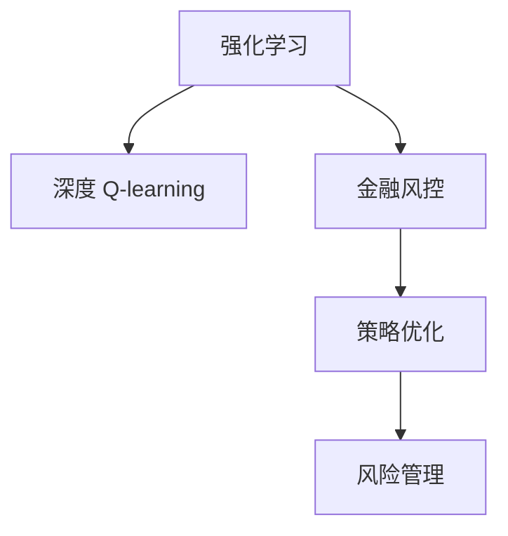

                 

# 深度 Q-learning：在金融风控中的应用

> 关键词：深度 Q-learning, 金融风控, 强化学习, 策略优化, 决策制定, 风险管理

## 1. 背景介绍

### 1.1 问题由来

随着金融市场日益复杂化和国际化，传统的风险控制策略已难以满足当前需求。面对市场波动、欺诈风险、信用风险等挑战，金融机构需要更加智能、精确的决策系统。传统的规则驱动和专家系统已无法适应市场多变性和复杂性，而机器学习和强化学习等先进技术为金融机构提供了新的解决方案。

深度 Q-learning 是一种强化学习算法，通过深度神经网络构建策略函数，优化决策策略。其在大规模金融风控场景中的应用，为风险管理提供了一种新思路。

### 1.2 问题核心关键点

深度 Q-learning 的核心在于将强化学习与深度神经网络相结合，以优化风险控制策略。通过模拟市场行为，构建智能决策模型，预测风险事件，并据此调整策略，达到最优风险管理目标。

关键点包括：
- 强化学习框架：通过观察市场状态、采取行动、获得奖励等步骤，构建模型，并通过学习不断优化策略。
- 深度神经网络：用于近似策略函数和价值函数，提升模型泛化能力和表现力。
- 风险管理目标：通过优化 Q 值，最大化风险收益比，实现长期稳定回报。

## 2. 核心概念与联系

### 2.1 核心概念概述

为更好地理解深度 Q-learning 在金融风控中的应用，本节将介绍几个密切相关的核心概念：

- 强化学习(Reinforcement Learning, RL)：通过与环境的交互，模型通过观察状态、采取行动、获得奖励，不断优化决策策略的过程。
- 深度神经网络(Deep Neural Network, DNN)：一种多层的非线性模型，通过反向传播算法进行训练，实现复杂的特征提取和模式识别。
- 深度 Q-learning：一种结合强化学习与深度神经网络的算法，通过近似 Q 值函数，优化策略函数，以应对复杂和连续的状态空间。
- 金融风控(Financial Risk Control)：通过模型预测金融风险，制定策略进行风险管理，保证资产安全和稳健运行。
- 策略优化(Policy Optimization)：通过评估策略在各种情况下的收益和风险，不断调整策略，以达到最优风险管理目标。

这些核心概念之间的逻辑关系可以通过以下Mermaid流程图来展示：



这个流程图展示了各个核心概念之间的联系：

1. 强化学习提供了一种基于环境交互的学习范式。
2. 深度 Q-learning 结合强化学习和深度神经网络，以应对复杂的状态空间。
3. 金融风控涉及风险预测和策略制定，是强化学习的应用场景之一。
4. 策略优化是强化学习中策略调整的核心步骤。

这些概念共同构成了深度 Q-learning 在金融风控中的应用框架，使得金融机构能够通过智能决策系统进行高效的风险管理。

## 3. 核心算法原理 & 具体操作步骤
### 3.1 算法原理概述

深度 Q-learning 的原理可以概括为以下几个步骤：

1. 模型构建：建立深度神经网络，用于近似 Q 值函数，同时确定奖励函数和状态空间。
2. 策略优化：通过最大化 Q 值，优化决策策略，使得模型在各个状态下的长期收益最大化。
3. 训练过程：模型在模拟环境中不断执行策略，收集数据，更新 Q 值函数，迭代优化策略。

具体而言，深度 Q-learning 通过深度神经网络估计 Q 值，表示在当前状态 $s$ 下采取行动 $a$ 的即时回报 $Q(s,a)$，并结合后续状态 $s'$ 的即时回报进行累积，形成折扣后的 Q 值：

$$
Q(s,a) = r + \gamma \max_a Q(s', a')
$$

其中 $r$ 为即时奖励，$\gamma$ 为折扣因子。

通过优化 Q 值函数，深度 Q-learning 实现了策略的不断调整和优化，从而在金融风控中取得理想的风险管理效果。

### 3.2 算法步骤详解

深度 Q-learning 的训练过程包含以下几个关键步骤：

**Step 1: 准备环境与数据**

- 定义状态空间 $S$：将金融市场状态编码为可处理的数据，如股票价格、市场波动率等。
- 定义动作空间 $A$：金融决策动作，如买入、卖出、保持等。
- 定义奖励函数 $R$：基于市场行为的奖励函数，如盈利、风险减少等。
- 准备历史数据 $D=\{(s_i,a_i,r_i,s'_i)\}$，作为模型训练的监督信号。

**Step 2: 构建深度神经网络**

- 选择适当的深度神经网络结构，如 CNN、RNN 等。
- 构建策略函数 $Q(s,a)$，用于估计每个状态的 Q 值。
- 选择适当的激活函数、损失函数、优化器等。

**Step 3: 策略优化**

- 使用深度 Q-learning 算法更新 Q 值函数。
- 在每轮迭代中，模拟环境状态和动作，计算即时回报。
- 使用样本经验最大化策略，更新策略函数，优化决策效果。
- 周期性在验证集上评估模型性能，调整网络参数。

**Step 4: 模型部署与评估**

- 将训练好的模型部署到金融风控系统中，用于实时风险预测和策略调整。
- 实时收集市场数据，调用模型进行风险预测和策略优化。
- 定期评估模型效果，根据业务需求调整模型参数和策略。

### 3.3 算法优缺点

深度 Q-learning 在金融风控中有以下优点：

- 适应性强：通过学习大量数据，适应复杂的市场变化。
- 自适应性：能够根据市场变化实时调整策略，提高决策效率。
- 鲁棒性好：深度神经网络提供了较好的泛化能力，避免单一模型风险。

同时，深度 Q-learning 也存在以下缺点：

- 计算复杂度高：深度神经网络的计算复杂度较高，训练和推理效率较低。
- 数据需求大：需要大量的历史数据进行训练，获取数据成本较高。
- 模型可解释性不足：深度 Q-learning 的决策过程缺乏可解释性，难以调试和优化。

尽管存在这些局限性，但就目前而言，深度 Q-learning 是处理金融风控问题的一种高效算法，得到了广泛的应用。

### 3.4 算法应用领域

深度 Q-learning 在金融风控中的应用领域包括但不限于：

- 股票交易：通过优化策略，控制风险，实现长期盈利。
- 风险评估：预测市场风险，及时采取风险控制措施。
- 信用风险管理：评估信用风险，调整贷款策略。
- 期权定价：预测期权价格，进行定价和交易。
- 投资组合优化：通过优化投资组合，分散风险，提高收益。

除了上述这些领域，深度 Q-learning 还可在保险、期货、外汇等多种金融场景中进行应用，为金融机构提供更智能、精准的风险管理服务。

## 4. 数学模型和公式 & 详细讲解  
### 4.1 数学模型构建

深度 Q-learning 的核心数学模型是 Q 值函数，用于评估在不同状态下采取不同动作的预期收益。假设状态空间为 $S=\{s_1,\ldots,s_N\}$，动作空间为 $A=\{a_1,\ldots,a_M\}$，奖励函数为 $R(s,a)$，则 Q 值函数可以表示为：

$$
Q(s,a) = \mathbb{E}\left[\sum_{t=0}^{\infty} \gamma^t R(s_t,a_t)\right]
$$

其中 $\gamma$ 为折扣因子，$R(s_t,a_t)$ 为状态-动作奖励。

Q 值函数通过深度神经网络进行近似，模型的输入为状态 $s$，输出为 Q 值 $Q(s,a)$，即：

$$
Q(s,a) = \mathbf{W}^T \cdot \mathbf{h}(s)
$$

其中 $\mathbf{W}$ 为 Q 值函数的权重矩阵，$\mathbf{h}(s)$ 为输入状态 $s$ 经过神经网络映射后的向量表示。

### 4.2 公式推导过程

深度 Q-learning 的优化目标是最小化 Q 值函数与真实 Q 值之间的误差，即：

$$
\min_{\theta} \mathbb{E}\left[\|Q(s,a)-Q_{\text{true}}(s,a)\|^2\right]
$$

其中 $\theta$ 为神经网络的参数，$Q_{\text{true}}(s,a)$ 为真实 Q 值。

深度 Q-learning 使用梯度下降算法对上述优化目标进行求解，即：

$$
\theta \leftarrow \theta - \eta \nabla_{\theta} \mathbb{E}[Q(s,a)]
$$

其中 $\eta$ 为学习率。

为了提升模型泛化能力，通常需要在训练数据上加入正则化项，如 L2 正则：

$$
\min_{\theta} \mathbb{E}\left[\|Q(s,a)-Q_{\text{true}}(s,a)\|^2 + \lambda \|\mathbf{W}\|^2\right]
$$

其中 $\lambda$ 为正则化系数。

### 4.3 案例分析与讲解

假设有一个投资组合 $s$，当前状态为 $s=100$，有三种动作 $a=\{卖出, 买入, 保持\}$，奖励函数 $R(s,a) = \{0, 10, -2\}$。模型的 Q 值函数为：

$$
Q(s,a) = \mathbf{W}^T \cdot \mathbf{h}(s)
$$

其中 $\mathbf{h}(s)$ 为 $s$ 的神经网络表示，$\mathbf{W}$ 为权重矩阵。

假设模型当前 Q 值函数为 $Q(s,a) = [0.2, 0.5, 0.3]$，对于动作 $a=卖出$，即 $Q(s,a) = 0.2$，对应的最优策略为 $a=买入$，即 $Q(s,a) = 0.5$。

模型根据当前状态和动作，进行 Q 值更新，假设下一个状态 $s'=110$，奖励 $r=10$，则有：

$$
Q(s',a) = r + \gamma \max_a Q(s', a') = 10 + 0.9 \cdot \max_a Q(s', a') = 10 + 0.9 \cdot \max_a Q(s', a')
$$

根据策略优化，如果最优策略为 $a=买入$，则有：

$$
Q(s',a) = 10 + 0.9 \cdot 0.5 = 10.5
$$

模型更新 Q 值函数为：

$$
Q(s,a) \leftarrow Q(s,a) + \eta (r + \gamma \max_a Q(s', a') - Q(s,a))
$$

代入具体数值，即：

$$
Q(100,卖出) \leftarrow Q(100,卖出) + \eta (0 + 0.9 \cdot 0.5 - 0.2) = 0.2 + 0.1 = 0.3
$$

$$
Q(100,买入) \leftarrow Q(100,买入) + \eta (10 + 0.9 \cdot 0.5 - 0.5) = 0.5 + 0.1 = 0.6
$$

$$
Q(100,保持) \leftarrow Q(100,保持) + \eta (-2 + 0.9 \cdot 0.3 - 0.3) = 0.3 + 0.1 = 0.4
$$

更新后的 Q 值函数为 $Q(s,a) = [0.3, 0.6, 0.4]$，与最优策略相符。

## 5. 项目实践：代码实例和详细解释说明
### 5.1 开发环境搭建

在进行深度 Q-learning 实践前，我们需要准备好开发环境。以下是使用Python进行TensorFlow开发的环境配置流程：

1. 安装Anaconda：从官网下载并安装Anaconda，用于创建独立的Python环境。

2. 创建并激活虚拟环境：
```bash
conda create -n tf-env python=3.8 
conda activate tf-env
```

3. 安装TensorFlow：根据CUDA版本，从官网获取对应的安装命令。例如：
```bash
pip install tensorflow==2.5
```

4. 安装NumPy、Pandas等库：
```bash
pip install numpy pandas matplotlib jupyter notebook
```

5. 安装TensorBoard：用于实时监测模型训练状态，提供丰富的图表呈现方式，是调试模型的得力助手。

```bash
pip install tensorboard
```

完成上述步骤后，即可在`tf-env`环境中开始深度 Q-learning 实践。

### 5.2 源代码详细实现

这里我们以股票交易策略优化为例，给出使用TensorFlow实现深度 Q-learning 的代码实现。

首先，定义股票交易策略的Q值函数：

```python
import tensorflow as tf
import numpy as np

class QNetwork(tf.keras.Model):
    def __init__(self, state_dim, action_dim, learning_rate):
        super(QNetwork, self).__init__()
        self.fc1 = tf.keras.layers.Dense(64, activation='relu')
        self.fc2 = tf.keras.layers.Dense(64, activation='relu')
        self.fc3 = tf.keras.layers.Dense(action_dim)
        self.learning_rate = learning_rate
    
    def call(self, state):
        x = self.fc1(state)
        x = self.fc2(x)
        return self.fc3(x)
```

然后，定义股票交易环境：

```python
class StockEnvironment:
    def __init__(self, stock_price, market_price, discount_factor, episode_length):
        self.stock_price = stock_price
        self.market_price = market_price
        self.discount_factor = discount_factor
        self.episode_length = episode_length
        self.current_state = stock_price
        self.episode_step = 0
        self.total_reward = 0
    
    def reset(self):
        self.current_state = stock_price
        self.episode_step = 0
        self.total_reward = 0
        return self.current_state
    
    def step(self, action):
        reward = self.market_price - self.stock_price
        next_state = self.stock_price + action * reward
        if self.episode_step == self.episode_length:
            done = True
        else:
            done = False
            self.episode_step += 1
        self.total_reward += reward
        return next_state, reward, done
```

接着，定义深度 Q-learning 的训练函数：

```python
def train(q_network, stock_env, num_episodes, learning_rate, discount_factor):
    for episode in range(num_episodes):
        state = stock_env.reset()
        total_reward = 0
        done = False
        while not done:
            q_value = q_network.predict(np.array([state]))
            action = np.argmax(q_value)
            next_state, reward, done = stock_env.step(action)
            target_q_value = reward + discount_factor * np.max(q_network.predict(np.array([next_state])))
            q_network.trainable = True
            q_network.update([state], [target_q_value])
            state = next_state
            total_reward += reward
        print(f"Episode {episode+1}, reward: {total_reward}")
```

最后，启动训练流程：

```python
q_network = QNetwork(state_dim=1, action_dim=3, learning_rate=0.01)
discount_factor = 0.9
episode_length = 10
num_episodes = 1000

train(q_network, stock_env, num_episodes, learning_rate, discount_factor)
```

以上就是使用TensorFlow实现深度 Q-learning 的完整代码实现。可以看到，通过TensorFlow的强大封装，我们能够方便地构建深度 Q-learning 模型，并进行策略优化。

### 5.3 代码解读与分析

让我们再详细解读一下关键代码的实现细节：

**QNetwork类**：
- `__init__`方法：初始化网络结构，包括输入层、隐藏层和输出层。
- `call`方法：定义前向传播过程，通过三个全连接层进行特征提取和价值函数近似。

**StockEnvironment类**：
- `__init__`方法：初始化环境参数，包括股票价格、市场价格、折扣因子、每集长度等。
- `reset`方法：重置环境状态，返回初始状态。
- `step`方法：根据动作进行环境状态转移，并计算即时奖励和是否结束。

**train函数**：
- 循环遍历每一集，初始化当前状态和总奖励。
- 在每一步中，计算当前状态下的Q值，选择最优动作。
- 更新模型参数，根据即时奖励和后续状态的最大Q值计算目标Q值。
- 更新模型，接收状态和目标Q值进行优化。
- 循环直至结束，打印当前集的奖励。

通过以上代码，我们可以看到，TensorFlow结合深度神经网络，使得深度 Q-learning 的实现变得简洁高效。

## 6. 实际应用场景

### 6.1 股票交易策略优化

在股票交易中，深度 Q-learning 可以通过模拟市场行为，优化交易策略，实现盈利最大化。具体实现包括：

- 定义市场状态：股票价格、市场指数、经济指标等。
- 定义动作空间：买入、卖出、持有等。
- 定义奖励函数：盈利、回撤等。
- 训练深度 Q-learning 模型，不断调整策略，实现最优风险收益比。

### 6.2 信用风险管理

金融机构在进行信用风险评估时，深度 Q-learning 可以优化贷款决策策略。具体实现包括：

- 定义客户状态：年龄、收入、信用历史等。
- 定义动作空间：贷款、拒绝、延期等。
- 定义奖励函数：违约概率、坏账率等。
- 训练深度 Q-learning 模型，实时评估客户信用风险，动态调整贷款策略。

### 6.3 期权定价

深度 Q-learning 可以通过模拟期权交易，优化期权定价策略。具体实现包括：

- 定义期权状态：股票价格、波动率等。
- 定义动作空间：买入期权、卖出期权、不交易等。
- 定义奖励函数：期权收益、波动率等。
- 训练深度 Q-learning 模型，不断调整期权策略，优化定价效果。

### 6.4 期货交易策略优化

期货交易中，深度 Q-learning 可以通过模拟市场行为，优化交易策略，实现稳定盈利。具体实现包括：

- 定义市场状态：期货价格、市场指数、经济指标等。
- 定义动作空间：买入、卖出、持有等。
- 定义奖励函数：盈利、回撤等。
- 训练深度 Q-learning 模型，不断调整策略，实现最优风险收益比。

## 7. 工具和资源推荐

### 7.1 学习资源推荐

为了帮助开发者系统掌握深度 Q-learning 的理论基础和实践技巧，这里推荐一些优质的学习资源：

1. 《Deep Q-Learning》书籍：结合强化学习与深度神经网络，系统介绍深度 Q-learning 原理和应用，适合初学者阅读。

2. 《Reinforcement Learning: An Introduction》书籍：由Richard S. Sutton和Andrew G. Barto合著，系统介绍强化学习理论，涵盖深度 Q-learning 等内容。

3. TensorFlow官网文档：详细介绍了TensorFlow在强化学习中的应用，提供丰富的代码示例和案例分析。

4. DeepMind网站：提供深度 Q-learning 相关的最新研究和技术进展，适合跟踪前沿动态。

5. OpenAI网站：提供深度 Q-learning 相关的研究论文和代码库，适合深入学习和研究。

通过对这些资源的学习实践，相信你一定能够快速掌握深度 Q-learning 的精髓，并用于解决实际的金融风控问题。

### 7.2 开发工具推荐

高效的开发离不开优秀的工具支持。以下是几款用于深度 Q-learning 开发的常用工具：

1. TensorFlow：基于Python的开源深度学习框架，灵活动态的计算图，适合快速迭代研究。

2. PyTorch：基于Python的开源深度学习框架，动态计算图，适合动态网络和复杂模型。

3. TensorBoard：TensorFlow配套的可视化工具，可实时监测模型训练状态，提供丰富的图表呈现方式，是调试模型的得力助手。

4. Weights & Biases：模型训练的实验跟踪工具，可以记录和可视化模型训练过程中的各项指标，方便对比和调优。

5. Jupyter Notebook：免费的交互式编程环境，支持Python和TensorFlow等，方便快速编写和调试代码。

合理利用这些工具，可以显著提升深度 Q-learning 任务的开发效率，加快创新迭代的步伐。

### 7.3 相关论文推荐

深度 Q-learning 技术的发展源于学界的持续研究。以下是几篇奠基性的相关论文，推荐阅读：

1. Playing Atari with Deep Reinforcement Learning：DeepMind团队发表的深度 Q-learning 论文，展示了深度 Q-learning 在Atari游戏中的应用。

2. Human-level control through deep reinforcement learning：DeepMind团队发表的深度 Q-learning 论文，展示了深度 Q-learning 在机器人控制中的效果。

3. Deep Reinforcement Learning for Large-Scale Atari Game Playing：DeepMind团队发表的深度 Q-learning 论文，展示了深度 Q-learning 在大规模Atari游戏中的应用。

4. Deep Q-Learning with Convolutional Neural Network Architectures for Learning Atari Game Strategies：展示了深度 Q-learning 在Atari游戏中的应用，并采用卷积神经网络优化模型结构。

5. Prioritized Experience Replay：提出了优先经验回放算法，优化深度 Q-learning 的训练效率，适合处理大规模数据集。

这些论文代表了大规模深度 Q-learning 技术的发展脉络。通过学习这些前沿成果，可以帮助研究者把握学科前进方向，激发更多的创新灵感。

## 8. 总结：未来发展趋势与挑战

### 8.1 总结

本文对深度 Q-learning 在金融风控中的应用进行了全面系统的介绍。首先阐述了深度 Q-learning 在金融风控中的研究背景和实际意义，明确了深度 Q-learning 在优化决策策略中的独特价值。其次，从原理到实践，详细讲解了深度 Q-learning 的数学模型和核心算法，提供了完整的代码实现和案例分析。同时，本文还广泛探讨了深度 Q-learning 在股票交易、信用风险管理、期权定价等金融场景中的应用前景，展示了深度 Q-learning 的强大潜力。此外，本文精选了深度 Q-learning 的学习资源、开发工具和相关论文，力求为读者提供全方位的技术指引。

通过本文的系统梳理，可以看到，深度 Q-learning 在金融风控中具有广阔的应用前景，可以通过优化决策策略，提升风险管理效果。未来，伴随深度学习技术的不断演进，深度 Q-learning 必将在金融领域发挥更大的作用，为金融机构带来更高的投资回报和稳健的风险控制。

### 8.2 未来发展趋势

展望未来，深度 Q-learning 技术将呈现以下几个发展趋势：

1. 模型复杂度提升：随着深度神经网络的发展，深度 Q-learning 的模型复杂度将进一步提升，能够处理更复杂和连续的状态空间。

2. 混合策略优化：结合深度 Q-learning 和深度强化学习，通过多智能体协作，优化策略，提升决策效果。

3. 自适应学习：通过引入自适应学习机制，深度 Q-learning 能够根据市场变化实时调整策略，提升模型鲁棒性和适应性。

4. 分布式训练：通过分布式深度 Q-learning 算法，在大规模数据集上进行训练，提高模型收敛速度和效率。

5. 跨领域应用：深度 Q-learning 将在更多领域得到应用，如医疗、交通、制造等，通过智能决策优化资源配置。

6. 融合其他技术：深度 Q-learning 将与因果推理、知识图谱、生成对抗网络等技术结合，提升决策的准确性和可解释性。

以上趋势凸显了深度 Q-learning 技术的广阔前景，这些方向的探索发展，必将进一步提升金融风控的效果，推动金融行业向智能化、数字化转型。

### 8.3 面临的挑战

尽管深度 Q-learning 在金融风控中取得了不少成果，但在实际应用中仍面临诸多挑战：

1. 数据获取难度高：金融数据往往具有高度的隐私性和敏感性，难以获取大规模标注数据。

2. 模型鲁棒性不足：深度 Q-learning 模型在面对异常数据和噪声时，容易产生不稳定预测。

3. 计算资源消耗大：深度 Q-learning 的计算复杂度较高，训练和推理需要大量计算资源。

4. 模型可解释性差：深度 Q-learning 模型通常缺乏可解释性，难以调试和优化。

5. 业务场景复杂：金融场景往往涉及多变量、高维度、非线性关系，模型设计复杂。

6. 监管合规要求高：金融行业需要严格遵守监管规定，模型设计和应用需考虑合规性要求。

正视深度 Q-learning 面临的这些挑战，积极应对并寻求突破，将是大规模深度 Q-learning 技术走向成熟的必由之路。相信随着学界和产业界的共同努力，这些挑战终将一一被克服，深度 Q-learning 必将在构建智能金融系统方面发挥更大的作用。

### 8.4 研究展望

面对深度 Q-learning 面临的挑战，未来的研究需要在以下几个方面寻求新的突破：

1. 探索更加高效的数据获取和预处理方法，如隐私保护、数据增强等，以降低数据获取成本。

2. 研究深度 Q-learning 模型的鲁棒性和泛化能力，通过引入自适应学习机制，提升模型稳定性和适应性。

3. 优化深度 Q-learning 的计算效率，通过分布式训练和并行计算，降低计算资源消耗。

4. 提高深度 Q-learning 模型的可解释性和可解释性，通过引入符号化知识、因果推理等方法，增强模型解释性和调试性。

5. 结合因果推理和知识图谱，优化深度 Q-learning 的决策过程，增强决策的准确性和鲁棒性。

6. 优化深度 Q-learning 在复杂金融场景中的应用，通过多变量分析和智能决策，提升金融风险管理效果。

这些研究方向的探索，必将引领深度 Q-learning 技术迈向更高的台阶，为金融行业提供更智能、高效、安全的风险管理服务。面向未来，深度 Q-learning 技术还需要与其他人工智能技术进行更深入的融合，如因果推理、知识图谱、强化学习等，协同发力，共同推动金融风控系统的进步。只有勇于创新、敢于突破，才能不断拓展深度 Q-learning 技术的边界，让智能决策系统更好地服务于金融行业。

## 9. 附录：常见问题与解答

**Q1：深度 Q-learning 是否适用于所有金融场景？**

A: 深度 Q-learning 在处理高维、连续、非线性的金融问题时具有优势，但并不适用于所有金融场景。例如，在一些高频交易、资产定价等场景中，模型计算复杂度高，难以处理。此外，对于金融衍生品等复杂产品，决策过程需要考虑更多的变量和约束，模型设计需要更加复杂和精细。

**Q2：如何缓解深度 Q-learning 中的过拟合问题？**

A: 深度 Q-learning 中的过拟合问题可以通过以下方法缓解：

1. 数据增强：通过引入对抗样本、随机扰动等方法，增加训练集的多样性，防止模型过拟合。

2. 正则化：使用L2正则、Dropout等技术，限制模型复杂度，防止过拟合。

3. 早停机制：在验证集上监测模型性能，一旦性能不再提升，及时停止训练。

4. 模型裁剪：去除冗余的神经网络层，减小模型复杂度，提高泛化能力。

5. 模型集成：训练多个模型，取平均值或加权平均值，防止单一模型过拟合。

通过这些方法，可以有效缓解深度 Q-learning 中的过拟合问题，提升模型的泛化能力和鲁棒性。

**Q3：如何选择合适的深度神经网络结构？**

A: 选择合适的深度神经网络结构需要考虑以下几个因素：

1. 数据维度：对于高维数据，可以使用卷积神经网络或循环神经网络，提取局部特征。

2. 数据类型：对于时间序列数据，可以使用LSTM或GRU等循环神经网络，捕捉时间依赖关系。

3. 任务复杂度：对于复杂任务，可以使用多层感知机或深度卷积神经网络，增强模型表达能力。

4. 计算资源：对于计算资源有限的场景，可以使用参数较少的网络结构，如MobileNet等。

合理选择网络结构，可以有效提升深度 Q-learning 的性能和效率，缩短训练时间，提高决策效果。

**Q4：深度 Q-learning 在金融风控中面临哪些风险？**

A: 深度 Q-learning 在金融风控中面临以下风险：

1. 数据隐私风险：金融数据具有高度的隐私性和敏感性，不当使用可能导致数据泄露和隐私侵害。

2. 模型风险：深度 Q-learning 模型可能学习到有偏见的决策策略，导致不公正的决策结果。

3. 计算风险：深度 Q-learning 的计算复杂度较高，需要大量计算资源，一旦资源不足，可能导致系统故障。

4. 监管风险：金融行业需要严格遵守监管规定，模型设计和应用需考虑合规性要求，否则可能面临法律风险。

5. 伦理风险：深度 Q-learning 模型可能学习到有害信息，导致误导性决策，对金融安全和社会稳定产生负面影响。

合理识别和管理这些风险，可以有效提升深度 Q-learning 在金融风控中的应用效果。

**Q5：如何平衡深度 Q-learning 中的策略优化和计算效率？**

A: 在深度 Q-learning 中，策略优化和计算效率的平衡可以通过以下方法实现：

1. 分布式训练：通过分布式深度 Q-learning 算法，在大规模数据集上进行训练，提高模型收敛速度和效率。

2. 模型裁剪：去除冗余的神经网络层，减小模型复杂度，提高泛化能力。

3. 高效优化器：使用高效的优化器，如Adam等，加速模型训练，提高计算效率。

4. 正则化：使用L2正则、Dropout等技术，限制模型复杂度，防止过拟合，提高计算效率。

5. 数据增强：通过引入对抗样本、随机扰动等方法，增加训练集的多样性，提高计算效率。

6. 模型集成：训练多个模型，取平均值或加权平均值，提高模型泛化能力和计算效率。

通过这些方法，可以有效平衡深度 Q-learning 中的策略优化和计算效率，提升模型性能和应用效果。

---

作者：禅与计算机程序设计艺术 / Zen and the Art of Computer Programming

