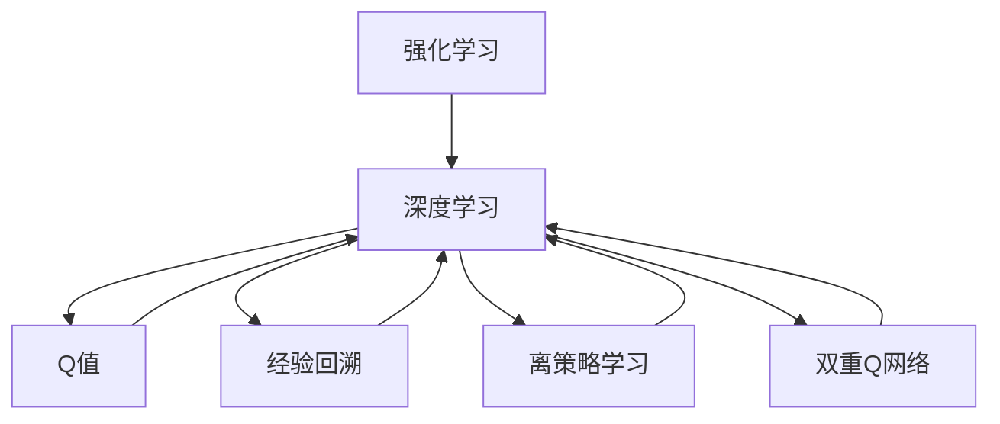

                 

# 深度 Q-learning：防止过拟合的策略

> 关键词：深度 Q-learning, 过拟合, 策略, 强化学习, 神经网络, 计算图, 模型优化

## 1. 背景介绍

### 1.1 问题由来

深度学习作为一种强大的机器学习方法，已经在计算机视觉、自然语言处理、语音识别等领域取得了显著的成果。然而，深度学习模型在训练过程中往往容易出现过拟合现象，导致模型在新数据上的泛化能力下降。这不仅浪费了大量的计算资源，还降低了模型的实际应用价值。

深度 Q-learning（DQN）作为一种强化学习算法，通过与环境交互，自适应地调整模型参数，可以有效缓解过拟合问题。DQN算法通过将模型的损失函数与目标值（Q值）关联，利用经验回溯的方法不断优化模型，从而在保持模型灵活性的同时，提高了模型的泛化能力。

### 1.2 问题核心关键点

DQN算法通过将模型的预测值与目标值对齐，不断优化模型参数，从而减少过拟合现象。DQN的核心在于：

- 引入Q值概念：Q值表示在当前状态下采取特定动作的预期回报，用于评估模型的预测能力。
- 经验回溯：利用历史状态、动作和回报的记录，不断更新模型参数，使得模型逐渐接近最优策略。
- 离策略学习：DQN算法通过观察目标策略下的状态-动作-回报（SAR）序列，进而优化当前策略，避免模型陷入局部最优。
- 双重Q网络：引入目标Q网络，与主网络交替更新，进一步提升模型稳定性。

这些关键点共同构成了DQN算法的核心思想，使其能够在对抗过拟合的同时，有效提升模型的泛化能力和预测精度。

## 2. 核心概念与联系

### 2.1 核心概念概述

为了更好地理解DQN算法，我们首先介绍以下几个核心概念：

- 强化学习（Reinforcement Learning, RL）：一种通过试错学习，不断调整模型策略以最大化长期回报的机器学习方法。
- 深度学习（Deep Learning）：利用多层神经网络进行复杂任务处理的机器学习方法。
- Q值（Q-value）：表示在特定状态下采取某一动作的预期长期回报，是强化学习中的重要概念。
- 经验回溯（Experience Replay）：通过存储和回放历史状态、动作和回报，提升模型的稳定性，防止过拟合。
- 离策略学习（Off-Policy Learning）：通过对目标策略的观察，优化当前策略，避免陷入局部最优。
- 双重Q网络（Double Q-Networks）：引入目标Q网络，与主网络交替更新，进一步提升模型的稳定性和泛化能力。

### 2.2 核心概念原理和架构的 Mermaid 流程图



这个流程图展示了强化学习和深度学习的关系，以及Q值、经验回溯、离策略学习和双重Q网络等概念之间的联系。

## 3. 核心算法原理 & 具体操作步骤

### 3.1 算法原理概述

深度 Q-learning（DQN）算法的核心思想是通过强化学习中的Q值概念，不断优化模型的参数，使其能够更好地适应新数据，避免过拟合现象。DQN算法通过经验回溯的方法，将模型的预测值与目标值对齐，进而优化模型参数，提升模型的泛化能力。

具体而言，DQN算法包括以下几个步骤：

1. 初始化模型：选择一个合适的深度神经网络作为Q值函数，并初始化模型参数。
2. 状态-动作选择：根据当前状态，选择动作进行执行。
3. 环境交互：将选择的动作应用于环境，观察环境反馈，获取下一个状态和奖励。
4. 目标Q值计算：根据下一个状态和奖励，计算目标Q值。
5. 预测Q值计算：利用当前状态和动作，计算预测Q值。
6. 经验回溯：将状态、动作、回报记录到经验缓冲区中。
7. 模型更新：利用经验回溯中的状态、动作、回报，更新模型参数。
8. 目标网络更新：与主网络交替更新，提升模型的稳定性。

### 3.2 算法步骤详解

接下来，我们详细说明DQN算法的具体实现步骤。

**Step 1: 初始化模型**

在开始训练之前，我们需要选择合适的神经网络结构，并随机初始化模型参数。常用的神经网络结构包括卷积神经网络（CNN）、全连接神经网络（FNN）等。初始化参数一般从较小的随机数开始，以避免陷入局部最优。

**Step 2: 状态-动作选择**

根据当前状态$s_t$，选择一个动作$a_t$进行执行。在实际应用中，通常采用探索策略和利用策略相结合的方式，如$\epsilon$-greedy策略，既能保证模型探索新动作，又能充分利用已知的动作-奖励映射。

**Step 3: 环境交互**

将选择的动作$a_t$应用于环境，观察环境反馈，获取下一个状态$s_{t+1}$和奖励$r_{t+1}$。奖励可以是简单的数值，也可以是特定的标记，用于评估当前策略的效果。

**Step 4: 目标Q值计算**

根据下一个状态$s_{t+1}$和奖励$r_{t+1}$，计算目标Q值$Q(s_{t+1},a_{t+1})$。目标Q值可以通过状态-动作-回报（SAR）序列，利用最大预期奖励（$\max Q(s_{t+1},\cdot)$）计算得到。

**Step 5: 预测Q值计算**

利用当前状态$s_t$和动作$a_t$，计算预测Q值$Q(s_t,a_t)$。预测Q值可以通过神经网络计算得到，网络的输出表示在状态$s_t$下采取动作$a_t$的预期长期回报。

**Step 6: 经验回溯**

将当前状态$s_t$、动作$a_t$、回报$r_{t+1}$记录到经验缓冲区中。经验回溯是DQN算法的核心步骤，通过存储历史数据，可以避免模型对当前数据过拟合，提升模型的泛化能力。

**Step 7: 模型更新**

从经验缓冲区中随机抽取若干条样本进行更新。在更新过程中，首先计算预测Q值$Q(s_t,a_t)$，然后根据目标Q值$Q(s_{t+1},a_{t+1})$，利用均方误差损失函数（MSE）更新模型参数。

**Step 8: 目标网络更新**

为了进一步提升模型的稳定性，DQN算法引入目标Q网络。目标Q网络与主网络参数更新不同步，通过固定一段时间（如10000次）进行一次更新。这可以避免模型参数在更新过程中互相干扰，提高模型的泛化能力。

### 3.3 算法优缺点

深度 Q-learning（DQN）算法具有以下优点：

- 可以有效缓解过拟合现象，提升模型的泛化能力。
- 能够处理多步奖励问题，适用于复杂的强化学习任务。
- 适用于大规模数据集，可以并行更新模型参数，提高训练效率。

同时，DQN算法也存在一些局限性：

- 需要存储大量历史数据，对内存和存储空间要求较高。
- 容易受到梯度消失和梯度爆炸等问题的影响。
- 需要合适的超参数设置，如学习率、探索策略参数等，需要大量实验进行调优。
- 在处理高维状态空间时，模型复杂度增加，容易出现局部最优。

尽管存在这些局限性，DQN算法在处理连续动作空间、多步奖励问题等方面，表现出色，是强化学习中的重要方法之一。

### 3.4 算法应用领域

深度 Q-learning（DQN）算法在诸多领域都有广泛的应用，以下是一些典型的应用场景：

- 机器人控制：利用DQN算法训练机器人进行复杂任务，如抓取、导航等。
- 游戏AI：在如Atari游戏等环境中，DQN算法能够训练AI玩家，获得较高的分数。
- 自动驾驶：利用DQN算法训练自动驾驶车辆，提升其在复杂道路环境中的决策能力。
- 金融交易：在金融市场环境中，DQN算法可以用于交易策略优化，提高投资收益。

## 4. 数学模型和公式 & 详细讲解 & 举例说明

### 4.1 数学模型构建

DQN算法的数学模型主要包括以下几个部分：

- 状态-动作-奖励（SAR）序列：$s_t, a_t, r_{t+1}, s_{t+1}$
- Q值函数：$Q(s_t, a_t) = \mathbb{E}[r_{t+1} + \gamma \max Q(s_{t+1}, \cdot)]$
- 均方误差损失函数：$\mathcal{L} = \frac{1}{N} \sum_{i=1}^N (Q(s_i, a_i) - r_{i+1} - \gamma \max Q(s_{i+1}, \cdot))^2$

其中，$s_t, a_t, r_{t+1}, s_{t+1}$表示第$t$个时间步的状态、动作、奖励和下一个状态。Q值函数表示在状态$s_t$下采取动作$a_t$的预期长期回报。均方误差损失函数用于评估模型预测Q值与目标Q值之间的差异。

### 4.2 公式推导过程

为了更好地理解DQN算法的数学模型，我们详细推导Q值函数的计算过程。

根据强化学习的定义，在状态$s_t$下采取动作$a_t$的预期回报$G_t$可以表示为：

$$
G_t = r_{t+1} + \gamma G_{t+1}
$$

其中，$r_{t+1}$表示在时间步$t+1$的奖励，$\gamma$表示折扣因子，$G_{t+1}$表示从时间步$t+1$开始的长期回报。

将$G_t$展开，可以得到：

$$
G_t = r_{t+1} + \gamma r_{t+2} + \gamma^2 r_{t+3} + \cdots + \gamma^t r_{t+1+t}
$$

因此，Q值函数可以表示为：

$$
Q(s_t, a_t) = \mathbb{E}[G_t \mid s_t, a_t]
$$

通过均方误差损失函数，我们可以定义DQN算法的目标函数：

$$
\mathcal{L} = \frac{1}{N} \sum_{i=1}^N (Q(s_i, a_i) - r_{i+1} - \gamma \max Q(s_{i+1}, \cdot))^2
$$

其中，$\max Q(s_{i+1}, \cdot)$表示在状态$s_{i+1}$下，选择动作$a_{i+1}$的最大Q值。

### 4.3 案例分析与讲解

为了更好地理解DQN算法的实际应用，我们以Atari游戏为例，展示DQN算法的训练过程。

在Atari游戏中，DQN算法通过观察状态、选择动作、观察奖励和下一个状态，不断更新模型参数。训练过程中，DQN算法利用经验回溯和目标网络更新，逐渐逼近最优策略，从而在游戏中获得较高的分数。

具体而言，DQN算法可以按照以下步骤进行训练：

1. 初始化神经网络，选择探索策略。
2. 在每个时间步，根据当前状态选择动作，并将其应用于环境。
3. 观察环境反馈，记录状态、动作和奖励。
4. 计算下一个状态和目标Q值，更新模型参数。
5. 利用经验回溯，记录历史数据。
6. 交替更新主网络和目标网络，提升模型的稳定性。
7. 观察模型在环境中的表现，评估其性能。

在训练过程中，DQN算法可以采用不同的探索策略和网络结构，以适应不同的任务和数据特点。

## 5. 项目实践：代码实例和详细解释说明

### 5.1 开发环境搭建

在进行DQN算法开发之前，我们需要准备好开发环境。以下是使用Python进行TensorFlow开发的环境配置流程：

1. 安装Anaconda：从官网下载并安装Anaconda，用于创建独立的Python环境。

2. 创建并激活虚拟环境：
```bash
conda create -n tf-env python=3.8 
conda activate tf-env
```

3. 安装TensorFlow：根据CUDA版本，从官网获取对应的安装命令。例如：
```bash
conda install tensorflow-gpu=2.6 -c tensorflow -c conda-forge
```

4. 安装TensorBoard：用于可视化模型训练过程，提供实时监控和图表展示功能。
```bash
pip install tensorboard
```

5. 安装其他必要的工具包：
```bash
pip install numpy scipy gym
```

完成上述步骤后，即可在`tf-env`环境中开始DQN算法的开发。

### 5.2 源代码详细实现

下面我们以DQN算法在Atari游戏中应用为例，给出完整的代码实现。

首先，定义游戏环境：

```python
import gym

env = gym.make('Pong-v0')
```

然后，定义神经网络结构：

```python
import tensorflow as tf
from tensorflow.keras import layers

model = tf.keras.Sequential([
    layers.Dense(256, activation='relu', input_shape=(4,)),
    layers.Dense(256, activation='relu'),
    layers.Dense(6)
])
```

接着，定义经验回溯和目标网络：

```python
import numpy as np

replay_memory = []

target_model = tf.keras.models.clone(model)
target_model.set_weights(model.get_weights())

def update_target_model():
    target_model.set_weights(model.get_weights())

def store_transition(state, action, reward, next_state):
    replay_memory.append((state, action, reward, next_state))
    
    if len(replay_memory) > 100000:
        replay_memory.pop(0)
        
def sample_replay(batch_size):
    indices = np.random.choice(len(replay_memory), batch_size)
    states = np.vstack([replay_memory[i][0] for i in indices])
    actions = np.vstack([replay_memory[i][1] for i in indices])
    rewards = np.vstack([replay_memory[i][2] for i in indices])
    next_states = np.vstack([replay_memory[i][3] for i in indices])
    targets = []
    for i in range(len(replay_memory)):
        if replay_memory[i][3] is None:
            targets.append(rewards[i])
        else:
            targets.append(rewards[i] + gamma * np.amax(model.predict(next_states[i])))
    targets = np.array(targets)
    q_values = model.predict(states)
    q_values = np.reshape(q_values, (q_values.shape[0], -1))
    targets = np.reshape(targets, (targets.shape[0], -1))
    loss = tf.keras.losses.mean_squared_error(targets, q_values)
    optimizer.minimize(loss)
    update_target_model()
```

最后，启动训练流程：

```python
from tensorflow.keras.optimizers import Adam

optimizer = Adam(lr=0.001)
gamma = 0.99
epsilon = 0.1
num_episodes = 500
max_steps_per_episode = 1000

for episode in range(num_episodes):
    state = env.reset()
    done = False
    total_reward = 0
    
    for step in range(max_steps_per_episode):
        if np.random.rand() < epsilon:
            action = env.action_space.sample()
        else:
            action = np.argmax(model.predict(state))
        
        next_state, reward, done, _ = env.step(action)
        total_reward += reward
        
        store_transition(state, action, reward, next_state)
        
        if len(replay_memory) > 100000:
            batch_size = 32
            sample_replay(batch_size)
        
        if done:
            print(f"Episode {episode+1}, Total Reward: {total_reward}")
            env.close()
            break
        else:
            state = next_state
```

### 5.3 代码解读与分析

让我们再详细解读一下关键代码的实现细节：

**神经网络定义**：
- `tf.keras.Sequential`：定义神经网络的结构，包含两个全连接层和一个输出层。
- `Dense`：定义全连接层，激活函数为ReLU。

**经验回溯**：
- `store_transition`：将状态、动作、奖励和下一个状态记录到经验缓冲区中。
- `sample_replay`：从经验缓冲区中随机抽取样本，更新模型参数。

**目标网络更新**：
- `update_target_model`：目标网络与主网络参数更新不同步，通过固定一段时间进行一次更新。

在训练过程中，DQN算法利用经验回溯和目标网络更新，逐渐逼近最优策略，从而在游戏中获得较高的分数。通过这种方式，DQN算法可以有效缓解过拟合现象，提升模型的泛化能力。

## 6. 实际应用场景

### 6.1 机器人控制

DQN算法在机器人控制领域有广泛应用。通过在仿真环境中训练机器人，利用DQN算法优化其动作选择策略，使得机器人能够在复杂环境中完成复杂任务，如抓取、导航等。

### 6.2 游戏AI

DQN算法在游戏AI领域表现出色。通过在如Atari游戏等环境中训练AI玩家，DQN算法能够获得较高的分数，展示出强大的学习和决策能力。

### 6.3 自动驾驶

DQN算法在自动驾驶领域也有重要应用。通过在虚拟环境中训练自动驾驶车辆，利用DQN算法优化其决策策略，使得车辆能够在复杂道路环境中安全行驶。

## 7. 工具和资源推荐

### 7.1 学习资源推荐

为了帮助开发者系统掌握DQN算法的理论基础和实践技巧，这里推荐一些优质的学习资源：

1. 《Deep Q-Learning with Python》书籍：详细介绍了DQN算法的原理、实现和应用，适合初学者入门。

2. 《Reinforcement Learning: An Introduction》书籍：介绍强化学习的理论和实践，包括DQN算法的详细介绍和应用示例。

3. 《Playing Atari with Deep Reinforcement Learning》论文：作者David Silver在Atari游戏中使用DQN算法，展示了DQN算法的强大表现。

4. OpenAI Gym：用于训练和测试强化学习算法的框架，包含多种游戏环境，适合进行DQN算法的实验。

5. TensorFlow Deep Reinforcement Learning官方文档：TensorFlow的官方文档，提供了DQN算法的详细实现和教程。

通过学习这些资源，相信你一定能够快速掌握DQN算法的精髓，并用于解决实际的强化学习问题。

### 7.2 开发工具推荐

高效的开发离不开优秀的工具支持。以下是几款用于DQN算法开发的常用工具：

1. TensorFlow：基于Python的开源深度学习框架，支持分布式训练，适合进行大规模实验。

2. PyTorch：基于Python的开源深度学习框架，灵活动态的计算图，适合快速迭代研究。

3. OpenAI Gym：用于训练和测试强化学习算法的框架，包含多种游戏环境，适合进行DQN算法的实验。

4. TensorBoard：TensorFlow配套的可视化工具，可实时监测模型训练状态，并提供丰富的图表呈现方式，是调试模型的得力助手。

5. Jupyter Notebook：用于编写和执行Python代码的交互式平台，适合进行DQN算法的实验和调试。

合理利用这些工具，可以显著提升DQN算法的开发效率，加快创新迭代的步伐。

### 7.3 相关论文推荐

DQN算法的发展得益于众多学者的不懈探索。以下是几篇奠基性的相关论文，推荐阅读：

1. Q-learning: A new approach to reinforcement learning：Watkins和Pavlou在Q-learning算法中引入最大Q值，使算法能够优化当前策略。

2. Approximate Q-learning in environments with superlinearly many states：Baird和Efron提出双重Q网络，通过引入目标Q网络，提高算法的稳定性和泛化能力。

3. Deep Q-Networks for Humanoid Navigation：Todd等人利用DQN算法训练机器人进行复杂任务，展示出强大的应用潜力。

4. DeepMind AlphaGo Zero：DeepMind使用DQN算法训练AlphaGo Zero，取得卓越的棋艺表现，成为人工智能领域的里程碑事件。

这些论文代表了大Q-learning算法的历史进展，通过学习这些前沿成果，可以帮助研究者把握学科前进方向，激发更多的创新灵感。

## 8. 总结：未来发展趋势与挑战

### 8.1 总结

本文对深度 Q-learning（DQN）算法进行了全面系统的介绍。首先阐述了DQN算法的研究背景和意义，明确了DQN算法在对抗过拟合、提升模型泛化能力方面的独特价值。其次，从原理到实践，详细讲解了DQN算法的数学模型和具体实现步骤，给出了DQN算法在Atari游戏中的代码实例。同时，本文还广泛探讨了DQN算法在机器人控制、游戏AI、自动驾驶等多个领域的应用前景，展示了DQN算法的巨大潜力。此外，本文精选了DQN算法的各类学习资源，力求为读者提供全方位的技术指引。

通过本文的系统梳理，可以看到，DQN算法通过引入Q值概念，不断优化模型参数，可以有效缓解过拟合现象，提升模型的泛化能力。未来的研究需要在以下几个方面寻求新的突破：

### 8.2 未来发展趋势

展望未来，DQN算法的发展趋势主要包括：

1. 多智能体学习：DQN算法可以应用于多智能体系统，解决多个智能体之间的协作和竞争问题，提高系统的稳定性和效率。

2. 迁移学习：DQN算法可以利用迁移学习技术，在新的环境中快速适应和优化策略，提高模型的适应能力。

3. 模型压缩和优化：DQN算法需要处理高维状态空间和动作空间，可以通过模型压缩和优化技术，降低计算复杂度，提高训练效率。

4. 应用到更多的实际场景：DQN算法在机器人控制、游戏AI、自动驾驶等领域的成功应用，将激发更多领域的应用探索，进一步拓展DQN算法的应用范围。

### 8.3 面临的挑战

尽管DQN算法已经取得了显著的成果，但在迈向更加智能化、普适化应用的过程中，它仍面临着诸多挑战：

1. 高维状态空间问题：DQN算法在处理高维状态空间时，容易陷入局部最优，需要通过更先进的模型结构和算法进行优化。

2. 动作空间问题：DQN算法在处理连续动作空间时，需要进行适当的动作映射，增加模型的复杂度。

3. 训练效率问题：DQN算法需要大量的计算资源和时间进行训练，需要寻找更加高效的优化算法和硬件支持。

4. 模型泛化能力问题：DQN算法在处理复杂环境和复杂任务时，需要进一步提升模型的泛化能力，减少对特定环境的依赖。

### 8.4 研究展望

面对DQN算法所面临的挑战，未来的研究需要在以下几个方面寻求新的突破：

1. 引入更先进的模型结构：通过引入卷积神经网络（CNN）、循环神经网络（RNN）等结构，提高DQN算法在处理高维状态空间和动作空间的能力。

2. 利用迁移学习技术：通过迁移学习技术，利用先验知识，加速DQN算法的收敛速度，提高模型的泛化能力。

3. 探索更加高效的优化算法：通过引入更加高效的优化算法，如Adam、RMSprop等，提高DQN算法的训练效率。

4. 探索更加高效的模型压缩和优化方法：通过模型压缩和优化技术，降低计算复杂度，提高训练效率和模型性能。

5. 探索更加灵活的模型结构：通过引入模块化设计，提高DQN算法在处理复杂环境和复杂任务时的灵活性。

这些研究方向的探索，必将引领DQN算法迈向更高的台阶，为强化学习的发展提供新的动力。相信随着研究的不断深入，DQN算法将会在更多的领域中得到应用，推动人工智能技术的发展。

## 9. 附录：常见问题与解答

**Q1：DQN算法在处理复杂环境和复杂任务时，如何避免陷入局部最优？**

A: 可以通过引入先进的模型结构、探索更加高效的优化算法、利用迁移学习技术等方法，提升DQN算法在处理复杂环境和复杂任务时的泛化能力和稳定性。同时，可以通过在训练过程中引入随机性、使用探索策略等方法，避免模型陷入局部最优。

**Q2：DQN算法在处理高维状态空间时，如何降低计算复杂度？**

A: 可以通过引入卷积神经网络（CNN）、残差网络（ResNet）等结构，降低DQN算法在处理高维状态空间时的计算复杂度。同时，可以通过模型压缩和优化技术，进一步降低计算复杂度，提高训练效率。

**Q3：DQN算法在处理连续动作空间时，如何进行适当的动作映射？**

A: 可以通过引入深度确定性策略梯度（DDPG）等算法，对连续动作空间进行映射，使得DQN算法能够更好地处理连续动作空间。同时，可以通过对动作空间进行离散化处理，进一步降低动作空间的复杂度。

**Q4：DQN算法在处理低维状态空间时，如何进行模型压缩和优化？**

A: 可以通过引入网络剪枝、知识蒸馏等技术，对DQN算法进行模型压缩和优化。同时，可以通过引入更高效的优化算法，如Adam、RMSprop等，提高DQN算法的训练效率和性能。

**Q5：DQN算法在处理多智能体系统时，如何进行协作和竞争优化？**

A: 可以通过引入多智能体强化学习算法，如分布式Q-learning（DQN）、分布式深度确定性策略梯度（DDPG）等，进行多智能体系统的协作和竞争优化。同时，可以通过引入更先进的模型结构和算法，提升DQN算法在多智能体系统中的性能和稳定性。

通过这些问题的解答，相信你能够更好地理解DQN算法的核心原理和应用方法，并应用于实际的强化学习问题中。

---

作者：禅与计算机程序设计艺术 / Zen and the Art of Computer Programming

