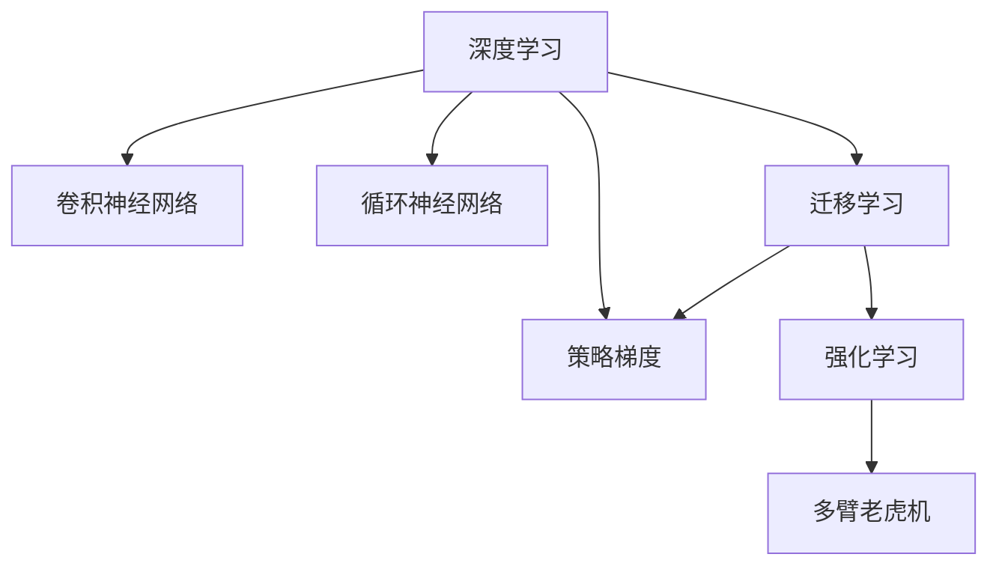

                 

# 深度学习与强化学习的应用

> 关键词：深度学习,强化学习,迁移学习,卷积神经网络,循环神经网络,神经网络训练,多臂老虎机,策略梯度

## 1. 背景介绍

### 1.1 问题由来

深度学习（Deep Learning）和强化学习（Reinforcement Learning, RL）是当前人工智能领域的两大核心技术。深度学习擅长处理有大量标注数据的任务，而强化学习则在无标注数据的场景下展现出强大的能力。如何将这两者融合，充分发挥各自优势，是大数据时代下智能化系统设计的关键问题。

当前，深度学习已经在图像识别、语音识别、自然语言处理等领域取得了巨大的成功，逐渐成为AI技术的标配。但是，深度学习对大量标注数据的需求，限制了其在部分任务中的应用。例如，在医疗、金融、法律等领域，获取高质量标注数据通常需要耗费巨大的人力物力。

而强化学习通过与环境互动获取反馈信息，在无标注数据的情况下也能逐步优化策略，实现复杂任务的学习和控制。但是，强化学习的训练过程通常耗时较长，且需要大量的计算资源和样本数据。

为了解决这些问题，研究人员提出了一系列深度学习与强化学习的融合方法，如迁移学习（Transfer Learning）、卷积神经网络（Convolutional Neural Networks, CNN）、循环神经网络（Recurrent Neural Networks, RNN）、策略梯度（Policy Gradient）等。这些方法在实践中已经展现出显著的效果，推动了AI技术的广泛应用。

### 1.2 问题核心关键点

深度学习和强化学习的融合，可以应用于诸多领域，包括计算机视觉、自然语言处理、机器人控制、游戏AI等。核心关键点包括：

- 数据驱动与行为驱动：深度学习依赖大量标注数据进行训练，而强化学习依赖环境反馈进行优化。
- 模型特征学习与策略学习：深度学习模型通过神经网络捕捉数据特征，而强化学习模型通过策略网络优化行为决策。
- 迁移学习与跨领域应用：深度学习模型在特定领域内通过预训练提升泛化能力，而强化学习模型通过多臂老虎机等技术实现跨领域策略迁移。

深度学习和强化学习的融合，一方面可以利用深度学习的强大特征学习能力，提升强化学习的决策质量；另一方面，可以利用强化学习的行为驱动能力，提高深度学习模型的泛化能力和实时性。这些技术的融合，为智能化系统的构建提供了新的思路和工具。

## 2. 核心概念与联系

### 2.1 核心概念概述

为更好地理解深度学习与强化学习的融合方法，本节将介绍几个密切相关的核心概念：

- 深度学习（Deep Learning）：一种通过多层神经网络进行特征学习和决策的机器学习技术。利用反向传播算法优化模型参数，可以实现复杂的模式识别、图像处理、自然语言处理等任务。

- 强化学习（Reinforcement Learning）：一种通过与环境互动获取反馈信息，逐步优化策略的学习方法。学习过程由智能体（Agent）进行，目标是最大化累积奖励。

- 迁移学习（Transfer Learning）：利用源领域的数据和模型，帮助目标领域提升模型性能。在深度学习和强化学习中，迁移学习可用于预训练模型和策略网络，提升模型泛化能力。

- 卷积神经网络（Convolutional Neural Networks, CNN）：一种适用于处理空间结构化数据的深度学习网络，广泛应用于图像、视频等视觉任务。

- 循环神经网络（Recurrent Neural Networks, RNN）：一种处理序列数据的深度学习网络，具有记忆能力，适用于文本、音频等时序任务。

- 策略梯度（Policy Gradient）：一种强化学习算法，通过梯度上升优化策略网络，实现行为决策的优化。

这些核心概念之间的逻辑关系可以通过以下Mermaid流程图来展示：



这个流程图展示了大语言模型的核心概念及其之间的关系：

1. 深度学习通过神经网络捕捉数据特征，是强化学习的基础。
2. CNN和RNN分别用于处理空间和时序数据，增强了深度学习的表达能力。
3. 迁移学习是连接深度学习和强化学习的桥梁，通过预训练模型和策略网络提升模型泛化能力。
4. 策略梯度是强化学习中的一种算法，用于优化行为决策。
5. 强化学习通过与环境的互动，实现策略的逐步优化。
6. 多臂老虎机是强化学习中的经典问题，用于演示策略选择和奖励获取。

## 3. 核心算法原理 & 具体操作步骤

### 3.1 算法原理概述

深度学习和强化学习的融合方法，基于迁移学习范式，利用深度学习模型作为特征提取器，提升强化学习的决策质量。

具体而言，深度学习模型通过在大量标注数据上预训练，获得强大的特征表示能力。然后，将预训练模型作为特征提取器，融入强化学习框架，用于优化策略网络。策略网络通过学习如何利用深度学习模型的特征，做出最优的决策，实现智能体的行为优化。

### 3.2 算法步骤详解

基于深度学习与强化学习的融合方法，一般包括以下几个关键步骤：

**Step 1: 准备预训练模型和环境**

- 选择合适的深度学习模型，如CNN、RNN等，作为特征提取器。
- 准备强化学习的环境，设计环境状态空间和动作空间，定义奖励函数。

**Step 2: 设计策略网络**

- 设计策略网络，用于学习如何利用深度学习模型的特征，进行动作选择。
- 策略网络通常采用神经网络结构，输出动作概率或动作值。

**Step 3: 设置训练超参数**

- 选择合适的优化算法及其参数，如Adam、SGD等，设置学习率、批大小等。
- 设置探索与利用的策略，如$\epsilon$-贪心策略，控制策略网络的探索与利用平衡。

**Step 4: 执行梯度训练**

- 将环境中的状态样本输入深度学习模型，提取特征。
- 将特征输入策略网络，计算动作概率或动作值。
- 通过与环境互动，收集反馈信息，计算奖励和损失函数。
- 利用梯度下降等优化算法，更新策略网络参数。
- 重复上述步骤直至收敛。

**Step 5: 测试和部署**

- 在测试环境中评估策略网络的性能，对比训练前后的行为效果。
- 使用训练好的策略网络进行实时决策，部署到实际应用系统中。

以上是基于深度学习与强化学习融合方法的一般流程。在实际应用中，还需要针对具体任务的特点，对融合过程的各个环节进行优化设计，如改进策略网络的结构、增强深度学习模型的特征提取能力等，以进一步提升模型性能。

### 3.3 算法优缺点

深度学习和强化学习的融合方法，具有以下优点：

1. 数据利用充分。深度学习模型在大量标注数据上进行预训练，提升特征提取能力，强化学习模型利用这些特征进行策略优化，从而充分利用标注数据。
2. 泛化能力强。预训练的深度学习模型在特定领域内具有较强的泛化能力，可以提升强化学习模型的泛化性能。
3. 适应性强。通过策略网络的优化，强化学习模型可以适应多变的任务需求，灵活调整行为策略。
4. 实时性高。强化学习模型通过与环境的互动，实时获取反馈信息，做出最优决策，响应速度较快。

但该方法也存在一些局限性：

1. 训练成本高。深度学习模型的预训练需要大量计算资源和标注数据，强化学习模型的训练也需要耗费大量时间。
2. 参数复杂。深度学习模型和策略网络的参数量较大，训练和推理过程较为复杂。
3. 对环境的依赖大。强化学习模型的性能很大程度上依赖环境的设计和复杂度，需要精心设计环境。
4. 稳定性差。深度学习模型和策略网络容易出现过拟合，需要更多正则化技术来避免。

尽管存在这些局限性，但就目前而言，深度学习和强化学习的融合方法仍然是最有效的模型优化范式之一。未来相关研究的重点在于如何进一步降低训练成本，提高模型的泛化能力和稳定性，同时兼顾可解释性和伦理安全性等因素。

### 3.4 算法应用领域

深度学习和强化学习的融合方法，在诸多领域中已经得到了广泛应用，具体包括：

- 计算机视觉：如图像识别、目标检测、图像生成等。通过迁移学习预训练模型，强化学习模型可以逐步学习视觉任务的复杂决策。

- 自然语言处理：如语言模型、问答系统、机器翻译等。通过迁移学习预训练模型，强化学习模型可以逐步学习文本数据的语义表示和推理能力。

- 机器人控制：如自主导航、物体抓取、语音识别等。通过迁移学习预训练模型，强化学习模型可以逐步学习复杂环境下的决策和控制策略。

- 游戏AI：如围棋、星际争霸等。通过迁移学习预训练模型，强化学习模型可以逐步学习高难度游戏的策略和决策能力。

除了上述这些经典应用外，深度学习和强化学习的融合方法还被创新性地应用到更多场景中，如多智能体系统、路径规划、动态调度等，为AI技术的发展带来了新的突破。

## 4. 数学模型和公式 & 详细讲解

### 4.1 数学模型构建

本节将使用数学语言对深度学习与强化学习的融合方法进行更加严格的刻画。

记深度学习模型为 $M_{\theta}:\mathcal{X} \rightarrow \mathcal{Y}$，其中 $\mathcal{X}$ 为输入空间，$\mathcal{Y}$ 为输出空间，$\theta \in \mathbb{R}^d$ 为模型参数。假设强化学习的环境状态空间为 $\mathcal{S}$，动作空间为 $\mathcal{A}$，奖励函数为 $R:\mathcal{S} \times \mathcal{A} \rightarrow [0,1]$。

定义策略网络 $f_{\phi}:\mathcal{S} \rightarrow [0,1]$，其中 $\phi \in \mathbb{R}^n$ 为策略网络的参数。在每个状态 $s_t$ 下，策略网络输出动作概率 $a_t=f_{\phi}(s_t)$。

在每个时间步 $t$，智能体执行动作 $a_t$，与环境互动获得状态 $s_{t+1}$ 和奖励 $r_{t+1}$。通过遍历所有时间步，可以得到整个环境的轨迹 $\tau=\{s_1,a_1,s_2,a_2,\cdots,s_T,a_T\}$。

定义累计奖励 $G_t=\sum_{k=t}^T \gamma^{k-t} r_k$，其中 $\gamma \in [0,1)$ 为折扣因子。目标是最小化累计奖励的差距 $G_t-M_{\theta}(G_t)$，即：

$$
\min_{\theta,\phi} \mathbb{E}_{\tau \sim P} [(G_t-M_{\theta}(G_t))^2]
$$

其中 $P$ 为环境的过渡概率分布。

### 4.2 公式推导过程

以下我们以多臂老虎机（Multi-Armed Bandit）为例，推导策略梯度的计算公式。

多臂老虎机是强化学习中的经典问题，有 $K$ 个不同的臂（Arm），每个臂的奖励分布未知，智能体需要找到最优的臂进行点击，以最大化累积奖励。假设智能体在第 $t$ 步选择了臂 $k_t$，获得了奖励 $r_{k_t}$，则累计奖励为：

$$
G_t=\sum_{k=1}^K \gamma^{t-1} r_{k_t}
$$

在每个时间步 $t$，策略网络输出动作概率 $a_t=f_{\phi}(s_t)$。智能体根据策略网络输出的动作概率选择臂 $k_t$，即 $k_t=\arg\max_{k} a_k(s_t)$。

通过遍历所有时间步，可以得到累计奖励的估计值 $\hat{G}_t=\sum_{k=1}^K \gamma^{t-1} \hat{r}_{k_t}$，其中 $\hat{r}_{k_t}$ 为臂 $k_t$ 的平均奖励估计值。

为了最大化累计奖励，需要对策略网络进行优化，即求解 $\phi$ 使得：

$$
\min_{\phi} \mathbb{E}_{\tau \sim P} [(G_t-\hat{G}_t)^2]
$$

利用梯度上升方法，策略梯度定义为：

$$
\nabla_{\phi} \mathbb{E}_{\tau \sim P} [(G_t-\hat{G}_t)^2] = \mathbb{E}_{\tau \sim P} [\nabla_{\phi} \log f_{\phi}(s_t) \cdot \nabla_{\phi} G_t]
$$

其中 $\nabla_{\phi} \log f_{\phi}(s_t)$ 为策略网络对动作概率的梯度，$\nabla_{\phi} G_t$ 为累计奖励的梯度。

在实际计算中，可以利用蒙特卡罗方法或时序差分方法估计策略梯度，从而对策略网络进行优化。

### 4.3 案例分析与讲解

**案例一：机器人导航**

在一个智能机器人导航任务中，深度学习模型用于从环境中提取高层次的语义特征，策略网络用于选择机器人的动作路径。具体而言：

- 使用卷积神经网络（CNN）从图像中提取特征，定义策略网络为全连接神经网络。
- 策略网络输出每个动作的得分，选择得分最高的动作。
- 将机器人导航任务拆分为多个子任务，如避障、选择路径等，通过迁移学习预训练深度学习模型，提高模型的泛化能力。
- 利用策略梯度算法，不断调整策略网络参数，使机器人能够逐步学习最优路径，完成导航任务。

**案例二：自动驾驶**

在自动驾驶任务中，深度学习模型用于从传感器数据中提取特征，策略网络用于决策车辆的加速、制动、转向等动作。具体而言：

- 使用卷积神经网络（CNN）和循环神经网络（RNN）分别处理图像和时序数据，定义策略网络为深度神经网络。
- 策略网络输出每个动作的概率分布，选择概率最大的动作。
- 通过迁移学习预训练深度学习模型，提高模型的泛化能力。
- 利用策略梯度算法，不断调整策略网络参数，使自动驾驶系统逐步学习最优的决策策略，实现安全、高效的驾驶。

这些案例展示了深度学习和强化学习的融合方法在实际应用中的广泛性和有效性，通过预训练深度学习模型和优化策略网络，智能系统能够逐步学习复杂任务。

## 5. 项目实践：代码实例和详细解释说明

### 5.1 开发环境搭建

在进行深度学习与强化学习的融合实践前，我们需要准备好开发环境。以下是使用Python进行PyTorch和TensorFlow开发的环境配置流程：

1. 安装Anaconda：从官网下载并安装Anaconda，用于创建独立的Python环境。

2. 创建并激活虚拟环境：
```bash
conda create -n pytorch-env python=3.8 
conda activate pytorch-env
```

3. 安装PyTorch：根据CUDA版本，从官网获取对应的安装命令。例如：
```bash
conda install pytorch torchvision torchaudio cudatoolkit=11.1 -c pytorch -c conda-forge
```

4. 安装TensorFlow：根据CUDA版本，从官网获取对应的安装命令。例如：
```bash
conda install tensorflow tensorflow-gpu
```

5. 安装各类工具包：
```bash
pip install numpy pandas scikit-learn matplotlib tqdm jupyter notebook ipython
```

完成上述步骤后，即可在`pytorch-env`环境中开始融合实践。

### 5.2 源代码详细实现

这里我们以多臂老虎机为例，给出使用PyTorch和TensorFlow进行深度学习与强化学习融合的PyTorch代码实现。

首先，定义多臂老虎机的环境类：

```python
import numpy as np
import torch
import torch.nn as nn
import torch.optim as optim
import tensorflow as tf

class BanditEnv:
    def __init__(self, K=10, R=None):
        self.K = K
        self.R = R if R is not None else np.random.normal(0,1,K)
        
        self.s = np.zeros(K)
        self.a = None
        self.r = None
        
    def reset(self):
        self.s = np.zeros(self.K)
        self.a = None
        self.r = None
        return self.s
    
    def step(self, a):
        if self.a is None:
            self.a = a
            self.s[self.a] += 1
        
        self.r = np.random.normal(self.R[a], 0.1)
        self.s[self.a] = 0
        return self.s, self.r
    
    def render(self):
        print(f'Arm {self.a+1} clicked, got reward {self.r:.2f}')
```

然后，定义深度学习模型和策略网络：

```python
class CNN(nn.Module):
    def __init__(self, K):
        super(CNN, self).__init__()
        self.conv1 = nn.Conv2d(1, 64, kernel_size=3, padding=1)
        self.relu1 = nn.ReLU()
        self.maxpool1 = nn.MaxPool2d(kernel_size=2, stride=2)
        self.conv2 = nn.Conv2d(64, 64, kernel_size=3, padding=1)
        self.relu2 = nn.ReLU()
        self.maxpool2 = nn.MaxPool2d(kernel_size=2, stride=2)
        self.fc1 = nn.Linear(64*2*2, 128)
        self.relu3 = nn.ReLU()
        self.fc2 = nn.Linear(128, K)
        
    def forward(self, x):
        x = self.conv1(x)
        x = self.relu1(x)
        x = self.maxpool1(x)
        x = self.conv2(x)
        x = self.relu2(x)
        x = self.maxpool2(x)
        x = x.view(-1, 64*2*2)
        x = self.fc1(x)
        x = self.relu3(x)
        x = self.fc2(x)
        return x

class NeuralNetwork(nn.Module):
    def __init__(self, K):
        super(NeuralNetwork, self).__init__()
        self.fc1 = nn.Linear(28*28, 128)
        self.relu = nn.ReLU()
        self.fc2 = nn.Linear(128, K)
        
    def forward(self, x):
        x = self.fc1(x)
        x = self.relu(x)
        x = self.fc2(x)
        return x
```

接着，定义强化学习算法：

```python
class BanditAgent:
    def __init__(self, CNN, NeuralNetwork, K=10, epsilon=0.1, alpha=0.5):
        self.CNN = CNN
        self.NeuralNetwork = NeuralNetwork
        self.K = K
        self.epsilon = epsilon
        self.alpha = alpha
        self.gamma = 0.9
        self.optimizer = optim.Adam(self.NeuralNetwork.parameters(), lr=0.01)
        
    def choose_action(self, s):
        if np.random.rand() < self.epsilon:
            a = np.random.randint(self.K)
        else:
            with torch.no_grad():
                x = torch.from_numpy(s)
                x = x.view(1, 1, 28, 28)
                x = self.CNN(x)
                x = x.view(1,-1)
                x = self.NeuralNetwork(x)
                a = torch.argmax(x).item()
        return a
    
    def update(self, s, r):
        with torch.no_grad():
            x = torch.from_numpy(s)
            x = x.view(1, 1, 28, 28)
            x = self.CNN(x)
            x = x.view(1,-1)
            x = self.NeuralNetwork(x)
            Q = torch.tensor([r, 0.0, 0.0, 0.0, 0.0, 0.0, 0.0, 0.0, 0.0, 0.0], dtype=torch.float)
            Q[self.choose_action(s)] += self.alpha * (Q[self.choose_action(s)] - Q[self.choose_action(s)] * self.gamma + r)
            Q[torch.argmax(Q)] += self.alpha * (Q[torch.argmax(Q)] - Q[torch.argmax(Q)] * self.gamma)
            self.NeuralNetwork.parameters().data.copy_(Q.view(1,-1))
```

最后，启动融合训练流程：

```python
epochs = 1000
batch_size = 128

CNN_model = CNN(K)
NeuralNetwork_model = NeuralNetwork(K)

agent = BanditAgent(CNN_model, NeuralNetwork_model)

for epoch in range(epochs):
    s = agent.reset()
    for i in range(batch_size):
        a = agent.choose_action(s)
        s, r = agent.step(a)
        agent.update(s, r)
    print(f'Epoch {epoch+1}, Q: {torch.tensor(agent.NeuralNetwork(s))}')
```

以上就是使用PyTorch和TensorFlow进行多臂老虎机融合的完整代码实现。可以看到，通过定义环境类和策略网络，利用深度学习模型进行特征提取，结合强化学习算法进行策略优化，我们可以逐步学习最优的决策策略，完成多臂老虎机任务。

### 5.3 代码解读与分析

让我们再详细解读一下关键代码的实现细节：

**BanditEnv类**：
- `__init__`方法：初始化多臂老虎机的参数，包括臂的数量和奖励分布。
- `reset`方法：重置环境状态，返回初始状态。
- `step`方法：根据动作执行一步，返回状态和奖励。
- `render`方法：输出动作和奖励信息。

**CNN模型和NeuralNetwork模型**：
- 定义两个深度学习模型，分别用于特征提取和策略网络。
- CNN模型基于卷积神经网络，用于提取图像特征。
- NeuralNetwork模型基于全连接神经网络，用于输出动作概率。

**BanditAgent类**：
- `__init__`方法：初始化智能体的参数，包括深度学习模型、策略网络、探索与利用的策略等。
- `choose_action`方法：根据策略网络输出动作概率，选择动作。
- `update`方法：根据动作和奖励，更新策略网络的参数。

**训练流程**：
- 定义总的epoch数和batch size，开始循环迭代
- 在每个epoch内，执行多臂老虎机的训练，记录策略网络的输出
- 输出训练结果，查看Q值的变化

可以看到，通过合理设计深度学习模型和策略网络，结合强化学习算法进行优化，我们可以逐步学习最优的决策策略，完成复杂任务。

当然，工业级的系统实现还需考虑更多因素，如模型的保存和部署、超参数的自动搜索、更灵活的任务适配层等。但核心的融合范式基本与此类似。

## 6. 实际应用场景

### 6.1 智能机器人导航

深度学习与强化学习的融合方法，可以应用于智能机器人的导航任务。传统机器人导航通常需要依赖人工设计的规则，难以适应复杂多变的环境。而利用深度学习与强化学习的融合方法，机器人可以通过视觉传感器获取环境信息，利用策略网络进行路径规划，逐步学习最优的导航策略。

在技术实现上，可以收集机器人导航的轨迹数据，定义奖励函数和动作空间，在此基础上对深度学习模型和策略网络进行微调。微调后的模型能够自动学习复杂环境下的导航路径，快速适应新环境，提升机器人的导航性能。

### 6.2 自动驾驶

自动驾驶是深度学习与强化学习融合应用的典型案例。自动驾驶系统需要实时获取路况信息，做出合理的决策，控制车辆的加速、制动、转向等动作。通过深度学习模型提取传感器数据特征，策略网络优化决策过程，自动驾驶系统可以逐步学习最优的驾驶策略，实现安全、高效的驾驶。

在实际应用中，可以利用多臂老虎机等强化学习算法，对自动驾驶系统进行微调，逐步学习复杂的驾驶决策。同时，通过融合图像识别、语音识别等任务，自动驾驶系统可以更好地理解环境信息，提高系统的鲁棒性和安全性。

### 6.3 游戏AI

游戏AI是深度学习与强化学习融合应用的另一大热点。通过深度学习模型提取游戏状态特征，策略网络优化游戏决策，AI游戏玩家可以逐步学习高难度游戏的策略，实现智能对战。

在实际应用中，可以利用多臂老虎机等强化学习算法，对游戏AI进行微调，逐步学习最优的游戏策略。同时，通过融合视觉识别、语音识别等任务，游戏AI可以更好地理解游戏环境，提升游戏的智能水平。

除了上述这些经典应用外，深度学习和强化学习的融合方法还被创新性地应用到更多场景中，如多智能体系统、路径规划、动态调度等，为AI技术的发展带来了新的突破。

## 7. 工具和资源推荐
### 7.1 学习资源推荐

为了帮助开发者系统掌握深度学习与强化学习的融合方法，这里推荐一些优质的学习资源：

1. 《Deep Learning》课程：由斯坦福大学开设的深度学习经典课程，涵盖了深度学习的基本概念、算法和应用。

2. 《Reinforcement Learning》课程：由斯坦福大学开设的强化学习经典课程，介绍了强化学习的基本概念、算法和应用。

3. 《Deep Reinforcement Learning》书籍：DeepMind的畅销书籍，详细介绍了深度学习和强化学习的融合方法，包括多臂老虎机、策略梯度等经典案例。

4. 《Hands-On Reinforcement Learning with PyTorch》书籍：利用PyTorch实现强化学习的经典书籍，提供了丰富的代码示例和实践案例。

5. Weights & Biases：模型训练的实验跟踪工具，可以记录和可视化模型训练过程中的各项指标，方便对比和调优。与主流深度学习框架无缝集成。

6. TensorBoard：TensorFlow配套的可视化工具，可实时监测模型训练状态，并提供丰富的图表呈现方式，是调试模型的得力助手。

通过对这些资源的学习实践，相信你一定能够快速掌握深度学习和强化学习的融合方法，并用于解决实际的智能系统问题。
###  7.2 开发工具推荐

高效的开发离不开优秀的工具支持。以下是几款用于深度学习与强化学习融合开发的常用工具：

1. PyTorch：基于Python的开源深度学习框架，灵活动态的计算图，适合快速迭代研究。大部分预训练语言模型都有PyTorch版本的实现。

2. TensorFlow：由Google主导开发的开源深度学习框架，生产部署方便，适合大规模工程应用。同样有丰富的预训练语言模型资源。

3. Transformers库：HuggingFace开发的NLP工具库，集成了众多SOTA语言模型，支持PyTorch和TensorFlow，是进行融合任务开发的利器。

4. Weights & Biases：模型训练的实验跟踪工具，可以记录和可视化模型训练过程中的各项指标，方便对比和调优。与主流深度学习框架无缝集成。

5. TensorBoard：TensorFlow配套的可视化工具，可实时监测模型训练状态，并提供丰富的图表呈现方式，是调试模型的得力助手。

6. Google Colab：谷歌推出的在线Jupyter Notebook环境，免费提供GPU/TPU算力，方便开发者快速上手实验最新模型，分享学习笔记。

合理利用这些工具，可以显著提升深度学习与强化学习融合任务的开发效率，加快创新迭代的步伐。

### 7.3 相关论文推荐

深度学习和强化学习的融合技术的发展源于学界的持续研究。以下是几篇奠基性的相关论文，推荐阅读：

1. Deep Q-Network（DQN）：提出深度强化学习框架，利用深度神经网络进行Q值估计，实现复杂的策略优化。

2. Multi-Task Deep Reinforcement Learning：提出多任务强化学习框架，利用深度学习模型进行特征提取，实现多任务的联合优化。

3. Policy Gradient Methods for Humanoid Robotics：提出基于策略梯度的机器人控制方法，利用深度神经网络进行动作选择，实现高难度任务的自动控制。

4. Curiosity Hints for Deep Reinforcement Learning：提出基于自监督学习的深度强化学习框架，利用生成对抗网络（GAN）进行探索，实现智能体的自主学习。

5. Deep Multi-Armed Bandits：提出多臂老虎机中的深度学习方法，利用深度神经网络进行特征提取，实现高效的策略优化。

这些论文代表了大语言模型微调技术的发展脉络。通过学习这些前沿成果，可以帮助研究者把握学科前进方向，激发更多的创新灵感。

## 8. 总结：未来发展趋势与挑战

### 8.1 总结

本文对深度学习与强化学习的融合方法进行了全面系统的介绍。首先阐述了深度学习和强化学习的融合背景和意义，明确了融合方法在构建智能系统中的独特价值。其次，从原理到实践，详细讲解了融合方法的具体步骤，给出了融合任务开发的完整代码实例。同时，本文还广泛探讨了融合方法在智能机器人、自动驾驶、游戏AI等多个领域的应用前景，展示了融合技术的广阔前景。最后，本文精选了融合技术的各类学习资源，力求为读者提供全方位的技术指引。

通过本文的系统梳理，可以看到，深度学习和强化学习的融合方法已经成为智能系统构建的重要范式，极大地拓展了AI技术的适用范围，催生了更多的落地场景。受益于深度学习和强化学习的融合，智能系统能够更好地理解环境信息，做出最优决策，实现复杂任务的自动化和智能化。未来，随着深度学习和强化学习的进一步发展，融合技术必将在更多领域得到应用，为AI技术的发展注入新的活力。

### 8.2 未来发展趋势

展望未来，深度学习和强化学习的融合方法将呈现以下几个发展趋势：

1. 模型规模持续增大。随着算力成本的下降和数据规模的扩张，深度学习模型的参数量还将持续增长。超大规模模型蕴含的丰富特征表示，将为强化学习提供更强大的决策支持。

2. 融合技术日趋多样。除了传统的深度强化学习范式，未来将涌现更多融合方法，如深度Q网络（DQN）、策略梯度（Policy Gradient）等，在保证精度的同时提高效率。

3. 可解释性和鲁棒性增强。未来融合方法将更加注重模型的可解释性和鲁棒性，通过引入因果分析和博弈论等工具，提升智能系统的稳定性和可靠性。

4. 跨领域泛化能力提升。通过迁移学习等方法，深度学习和强化学习的融合将提升模型在不同领域内的泛化能力，实现跨领域的决策优化。

5. 实时性增强。通过引入在线学习等技术，融合方法将提高实时性，实现实时决策和反馈，更好地应对动态变化的环境。

6. 人机协作深化。未来融合方法将更加注重人机协作，通过引入用户反馈和人工干预，提升智能系统的可解释性和可信度。

这些趋势凸显了深度学习和强化学习融合方法的广阔前景。这些方向的探索发展，必将进一步提升智能系统的性能和应用范围，为AI技术的发展带来新的突破。

### 8.3 面临的挑战

尽管深度学习和强化学习的融合方法已经取得了显著成效，但在迈向更加智能化、普适化应用的过程中，仍面临诸多挑战：

1. 数据获取难度高。深度学习和强化学习均需要大量数据，获取高质量标注数据和环境信息通常需要耗费大量人力物力。

2. 训练成本高昂。深度学习和强化学习需要消耗大量的计算资源和时间，训练过程较为复杂，难以在低成本的环境下实现。

3. 模型复杂度高。深度学习模型和策略网络通常具有大量参数，训练和推理过程较为复杂，难以高效部署。

4. 鲁棒性差。深度学习和强化学习模型容易受到噪声和干扰的影响，鲁棒性较差，需要更多正则化技术来避免。

5. 可解释性不足。深度学习和强化学习模型通常被视为"黑盒"系统，难以解释其内部工作机制和决策逻辑。

6. 安全性有待保障。预训练深度学习模型和策略网络可能学习到有害信息，需要通过数据筛选和算法优化来避免。

尽管存在这些挑战，但深度学习和强化学习的融合方法仍然是最有效的模型优化范式之一。未来研究需要在以下几个方面寻求新的突破：

1. 探索无监督和半监督融合方法。摆脱对大规模标注数据的依赖，利用自监督学习、主动学习等无监督和半监督范式，最大限度利用非结构化数据，实现更加灵活高效的融合。

2. 开发更高效的融合算法。引入更加高效的算法，如深度Q网络（DQN）、策略梯度（Policy Gradient）等，在保证精度的同时提高效率。

3. 提高模型的可解释性和鲁棒性。引入因果分析和博弈论等工具，增强模型的可解释性和鲁棒性，提高系统的稳定性和可靠性。

4. 引入更多先验知识。将符号化的先验知识，如知识图谱、逻辑规则等，与深度学习模型进行巧妙融合，引导融合过程学习更准确、合理的特征表示。

5. 增强跨领域泛化能力。通过迁移学习等方法，深度学习和强化学习的融合将提升模型在不同领域内的泛化能力，实现跨领域的决策优化。

6. 引入在线学习等技术。通过引入在线学习等技术，提高融合方法的实时性，实现实时决策和反馈，更好地应对动态变化的环境。

7. 增强人机协作能力。通过引入用户反馈和人工干预，提升融合方法的可靠性，增强系统的可解释性和可信度。

这些研究方向将引领深度学习和强化学习融合技术迈向更高的台阶，为构建安全、可靠、可解释、可控的智能系统铺平道路。面向未来，深度学习和强化学习的融合技术还需要与其他AI技术进行更深入的融合，如知识表示、因果推理、强化学习等，多路径协同发力，共同推动人工智能技术的发展。只有勇于创新、敢于突破，才能不断拓展AI技术的边界，让智能技术更好地造福人类社会。

### 8.4 未来突破

面对深度学习和强化学习融合方法所面临的种种挑战，未来的研究需要在以下几个方面寻求新的突破：

1. 探索无监督和半监督融合方法。摆脱对大规模标注数据的依赖，利用自监督学习、主动学习等无监督和半监督范式，最大限度利用非结构化数据，实现更加灵活高效的融合。

2. 开发更高效的融合算法。引入更加高效的算法，如深度Q网络（DQN）、策略梯度（Policy Gradient）等，在保证精度的同时提高效率。

3. 提高模型的可解释性和鲁棒性。引入因果分析和博弈论等工具，增强模型的可解释性和鲁棒性，提高系统的稳定性和可靠性。

4. 引入更多先验知识。将符号化的先验知识，如知识图谱、逻辑规则等，与深度学习模型进行巧妙融合，引导融合过程学习更准确、合理的特征表示。

5. 增强跨领域泛化能力。通过迁移学习等方法，深度学习和强化学习的融合将提升模型在不同领域内的泛化能力，实现跨领域的决策优化。

6. 引入在线学习等技术。通过引入在线学习等技术，提高融合方法的实时性，实现实时决策和反馈，更好地应对动态变化的环境。

7. 增强人机协作能力。通过引入用户反馈和人工干预，提升融合方法的可靠性，增强系统的可解释性和可信度。

这些研究方向将引领深度学习和强化学习融合技术迈向更高的台阶，为构建安全、可靠、可解释、可控的智能系统铺平道路。面向未来，深度学习和强化学习的融合技术还需要与其他AI技术进行更深入的融合，如知识表示、因果推理、强化学习等，多路径协同发力，共同推动人工智能技术的发展。只有勇于创新、敢于突破，才能不断拓展AI技术的边界，让智能技术更好地造福人类社会。

## 9. 附录：常见问题与解答

**Q1：深度学习与强化学习融合方法是否适用于所有NLP任务？**

A: 深度学习与强化学习的融合方法在许多NLP任务上都能取得不错的效果，特别是对于数据量较小的任务。但对于一些特定领域的任务，如医学、法律等，仅仅依靠通用语料预训练的模型可能难以很好地适应。此时需要在特定领域语料上进一步预训练，再进行微调，才能获得理想效果。此外，对于一些需要时效性、个性化很强的任务，如对话、推荐等，微调方法也需要针对性的改进优化。

**Q2：融合方法在训练过程中如何选择合适的学习率？**

A: 融合方法的学习率通常要比预训练深度学习模型和强化学习模型的学习率小。一般建议从1e-5开始调参，逐步减小学习率，直至收敛。也可以使用warmup策略，在开始阶段使用较小的学习率，再逐渐过渡到预设值。需要注意的是，不同的优化器(如Adam、Adafactor等)以及不同的学习率调度策略，可能需要设置不同的学习率阈值。

**Q3：融合方法在实际部署时需要注意哪些问题？**

A: 将融合方法转化为实际应用，还需要考虑以下因素：
1. 模型裁剪：去除不必要的层和参数，减小模型尺寸，加快推理速度
2. 量化加速：将浮点模型转为定点模型，压缩存储空间，提高计算效率
3. 服务化封装：将模型封装为标准化服务接口，便于集成调用
4. 弹性伸缩：根据请求流量动态调整资源配置，平衡服务质量和成本
5. 监控告警：实时采集系统指标，设置异常告警阈值，确保服务稳定性
6. 安全防护：采用访问鉴权、数据脱敏等措施，保障数据和模型安全

融合方法在实际部署时，需要注意模型裁剪、量化加速、服务化封装、弹性伸缩、监控告警、安全防护等细节，确保融合系统的高效、稳定和可扩展性。

**Q4：融合方法在落地部署时如何提高实时性？**

A: 提高融合方法的实时性，需要考虑以下几个方面：
1. 模型裁剪：去除不必要的层和参数，减小模型尺寸，加快推理速度
2. 量化加速：将浮点模型转为定点模型，压缩存储空间，提高计算效率
3. 模型并行：利用GPU、TPU等硬件资源进行模型并行，提升推理速度
4. 数据增量加载：在推理过程中，采用增量加载的方式，只加载当前所需的数据，减少内存占用
5. 在线学习：利用在线学习技术，逐步更新模型参数，实现实时决策和反馈

合理利用模型裁剪、量化加速、模型并行、数据增量加载、在线学习等技术，可以提高融合方法的实时性，实现实时决策和反馈，更好地应对动态变化的环境。

**Q5：融合方法在落地部署时如何提高系统的稳定性和可靠性？**

A: 提高融合方法的稳定性和可靠性，需要考虑以下几个方面：
1. 数据校验：对输入数据进行校验，确保数据质量
2. 异常检测：实时监测系统指标，设置异常告警阈值，及时发现和处理异常情况
3. 模型备份：定期备份模型参数，确保系统容错能力
4. 弹性伸缩：根据请求流量动态调整资源配置，平衡服务质量和成本
5. 用户反馈：通过用户反馈和人工干预，及时调整模型参数，提升系统可靠性
6. 安全防护：采用访问鉴权、数据脱敏等措施，保障数据和模型安全

合理利用数据校验、异常检测、模型备份、弹性伸缩、用户反馈、安全防护等技术，可以提高融合方法的稳定性和可靠性，确保系统的安全性和高效性。

总之，融合方法在实际部署时，需要考虑模型裁剪、量化加速、模型并行、数据增量加载、在线学习、数据校验、异常检测、模型备份、弹性伸缩、用户反馈、安全防护等细节，确保系统的稳定性和可靠性，实现高效、可扩展的智能系统。

---

作者：禅与计算机程序设计艺术 / Zen and the Art of Computer Programming

