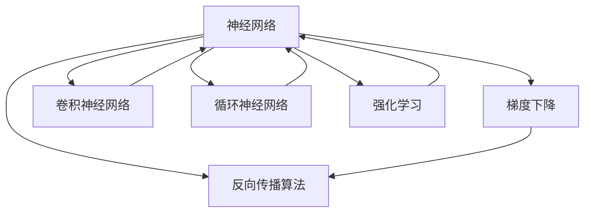

                 

# 深度学习原理与代码实例讲解

> 关键词：深度学习, 神经网络, 反向传播算法, 梯度下降, 卷积神经网络, 循环神经网络, 强化学习, 代码实例

## 1. 背景介绍

深度学习（Deep Learning）作为人工智能领域的核心技术之一，近年来在图像识别、自然语言处理、语音识别、推荐系统等众多领域取得了突破性进展，推动了人工智能技术的快速发展。深度学习框架，如TensorFlow、PyTorch、Keras等，为开发人员提供了丰富的模型库和高效的工具支持。然而，深度学习的原理和实现细节对于初学者来说，可能显得深奥难懂。本文旨在深入浅出地讲解深度学习的核心原理，并通过实际代码实例，帮助读者更好地理解和应用深度学习技术。

## 2. 核心概念与联系

### 2.1 核心概念概述

为更好地理解深度学习的核心概念，本节将介绍几个关键概念：

- 神经网络（Neural Network）：由多个层次的神经元组成，模拟人脑神经元之间的连接方式。每个神经元接收输入信号并计算输出，通过前后层之间的连接，实现复杂的特征提取和模式识别。
- 反向传播算法（Backpropagation）：用于训练神经网络的一种算法，通过反向传播误差信号，更新网络权重和偏置，最小化预测误差。
- 梯度下降（Gradient Descent）：一种基于目标函数梯度的优化算法，用于最小化目标函数。通常用于神经网络的参数优化，通过迭代更新参数，使得网络输出逼近真实值。
- 卷积神经网络（Convolutional Neural Network, CNN）：专门用于图像识别任务的神经网络，通过卷积操作提取图像特征，卷积层、池化层等构成网络的基本单元。
- 循环神经网络（Recurrent Neural Network, RNN）：用于处理序列数据（如文本、语音）的神经网络，通过时间步的循环结构，捕捉序列数据的时序关系。
- 强化学习（Reinforcement Learning, RL）：一种通过与环境交互，最大化累积奖励的学习方法，广泛应用于游戏、机器人控制等领域。

这些核心概念之间的逻辑关系可以通过以下Mermaid流程图来展示：



这个流程图展示了几大核心概念及其之间的关系：

1. 神经网络通过反向传播算法和梯度下降进行参数优化。
2. 卷积神经网络和循环神经网络是神经网络的重要分支，用于处理不同类型的输入数据。
3. 强化学习是一种高级的深度学习方法，通过与环境的互动进行学习。

## 3. 核心算法原理 & 具体操作步骤

### 3.1 算法原理概述

深度学习的核心在于构建和训练神经网络。一个典型的神经网络由输入层、隐藏层、输出层组成，如图1所示。其中，隐藏层可以有多层，每一层的神经元通过前后层之间的权重矩阵和偏置向量进行连接。在训练过程中，通过反向传播算法计算预测误差，并利用梯度下降算法更新参数，使得网络输出逼近真实值。


### 3.2 算法步骤详解

深度学习的训练过程通常包括以下几个步骤：

**Step 1: 准备数据集**
- 收集训练数据集和测试数据集。
- 将数据集分为训练集、验证集和测试集，通常比例为6:2:2。

**Step 2: 构建神经网络**
- 定义神经网络的结构，包括输入层、隐藏层和输出层的大小，以及激活函数等超参数。
- 使用深度学习框架（如TensorFlow、PyTorch等）构建神经网络。

**Step 3: 选择损失函数**
- 根据任务类型选择合适的损失函数。例如，对于分类任务，常用的损失函数有交叉熵损失（Cross-Entropy Loss）。
- 将损失函数定义在网络输出和真实标签之间。

**Step 4: 定义优化器**
- 选择优化算法（如SGD、Adam、RMSprop等）和相应的超参数。
- 定义优化器，用于在训练过程中更新网络参数。

**Step 5: 训练模型**
- 在训练集上训练模型，通过反向传播算法计算损失函数。
- 根据优化器更新网络参数，使得损失函数最小化。
- 在验证集上评估模型性能，防止过拟合。
- 重复训练直到达到预设的迭代轮数或验证集性能不再提升。

**Step 6: 测试模型**
- 在测试集上评估模型性能，对比训练前后的精度提升。
- 使用训练好的模型对新样本进行推理预测。

### 3.3 算法优缺点

深度学习具有以下优点：
1. 强大的特征提取能力。神经网络能够自动学习数据中的复杂特征，无需手动设计特征。
2. 泛化能力强。在大量数据上进行训练，能够很好地处理新数据。
3. 可解释性强。通过可视化网络结构、激活值等，可以更好地理解模型的决策过程。
4. 应用广泛。深度学习在计算机视觉、自然语言处理、语音识别、推荐系统等领域有广泛应用。

同时，深度学习也存在一些缺点：
1. 训练时间长。深度学习模型通常需要大量的训练数据和计算资源。
2. 模型复杂度较高。深度神经网络中的参数量非常大，训练和推理过程复杂。
3. 过拟合风险高。深度神经网络容易过拟合，特别是当数据量较少时。
4. 资源需求高。深度学习需要大量的计算资源和存储空间。

### 3.4 算法应用领域

深度学习在多个领域都有广泛应用，例如：

- 计算机视觉：图像分类、目标检测、人脸识别等。通过卷积神经网络（CNN）进行特征提取和分类。
- 自然语言处理：机器翻译、情感分析、文本生成等。通过循环神经网络（RNN）或Transformer等模型进行序列数据处理。
- 语音识别：自动语音识别、语音合成等。通过循环神经网络（RNN）或Transformer等模型进行音频信号处理。
- 推荐系统：个性化推荐、协同过滤等。通过深度神经网络进行用户行为分析和物品推荐。
- 医疗诊断：图像识别、病理分析等。通过卷积神经网络（CNN）进行医学影像处理。
- 游戏AI：决策树、强化学习等。通过强化学习算法进行游戏智能控制。

## 4. 数学模型和公式 & 详细讲解 & 举例说明

### 4.1 数学模型构建

假设神经网络模型为 $M_{\theta}(x)$，其中 $\theta$ 表示网络参数，$x$ 表示输入。网络的输出为 $y = M_{\theta}(x)$。我们希望通过训练，使得模型输出 $y$ 逼近真实标签 $t$。定义损失函数 $L(y,t)$ 衡量预测值与真实标签之间的误差。常用的损失函数包括均方误差损失（Mean Squared Error, MSE）和交叉熵损失（Cross-Entropy Loss）。

均方误差损失函数为：

$$
L(y,t) = \frac{1}{N} \sum_{i=1}^N (y_i - t_i)^2
$$

其中 $N$ 表示样本数量。

交叉熵损失函数为：

$$
L(y,t) = -\frac{1}{N} \sum_{i=1}^N t_i \log y_i + (1-t_i) \log (1-y_i)
$$

其中 $y_i$ 表示模型输出的概率值，$t_i$ 表示真实标签。

### 4.2 公式推导过程

以交叉熵损失函数为例，推导其梯度计算过程。

假设网络输出为 $y_i$，真实标签为 $t_i$，则交叉熵损失函数可以表示为：

$$
L(y,t) = -\frac{1}{N} \sum_{i=1}^N t_i \log y_i + (1-t_i) \log (1-y_i)
$$

对于单个样本 $i$，其损失函数对模型输出 $y_i$ 的梯度为：

$$
\frac{\partial L(y,t)}{\partial y_i} = -\frac{1}{N} \left[ \frac{t_i}{y_i} - \frac{1-t_i}{1-y_i} \right]
$$

根据链式法则，可以进一步求出模型参数 $\theta$ 的梯度：

$$
\frac{\partial L(y,t)}{\partial \theta} = \sum_{i=1}^N \frac{\partial y_i}{\partial \theta} \cdot \frac{\partial L(y,t)}{\partial y_i}
$$

其中 $\frac{\partial y_i}{\partial \theta}$ 表示网络输出对参数 $\theta$ 的偏导数。

### 4.3 案例分析与讲解

以图像分类任务为例，展示卷积神经网络（CNN）的训练过程。

假设输入数据为 $x$，网络结构如图2所示。包含两个卷积层（Convolutional Layer）、一个池化层（Pooling Layer）、一个全连接层（Fully Connected Layer）和一个softmax层。激活函数为ReLU，损失函数为交叉熵损失。


训练步骤如下：

1. 数据预处理：将输入数据 $x$ 归一化，并进行通道扩展。

2. 前向传播：将输入数据 $x$ 输入网络，计算每个层之间的输出。

3. 计算损失：将网络输出与真实标签进行交叉熵损失计算。

4. 反向传播：根据损失函数对模型参数 $\theta$ 进行梯度计算。

5. 参数更新：使用梯度下降算法更新网络参数。

6. 重复上述步骤，直至达到预设的迭代轮数或验证集性能不再提升。

## 5. 项目实践：代码实例和详细解释说明

### 5.1 开发环境搭建

在进行深度学习项目开发前，我们需要准备好开发环境。以下是使用Python进行PyTorch开发的环境配置流程：

1. 安装Anaconda：从官网下载并安装Anaconda，用于创建独立的Python环境。

2. 创建并激活虚拟环境：
```bash
conda create -n pytorch-env python=3.8 
conda activate pytorch-env
```

3. 安装PyTorch：根据CUDA版本，从官网获取对应的安装命令。例如：
```bash
conda install pytorch torchvision torchaudio cudatoolkit=11.1 -c pytorch -c conda-forge
```

4. 安装各类工具包：
```bash
pip install numpy pandas scikit-learn matplotlib tqdm jupyter notebook ipython
```

完成上述步骤后，即可在`pytorch-env`环境中开始深度学习项目的开发。

### 5.2 源代码详细实现

下面以手写数字识别任务为例，给出使用PyTorch实现卷积神经网络（CNN）的代码实现。

首先，定义CNN模型：

```python
import torch
import torch.nn as nn
import torch.optim as optim
import torchvision.transforms as transforms
from torchvision import datasets, models

class Net(nn.Module):
    def __init__(self):
        super(Net, self).__init__()
        self.conv1 = nn.Conv2d(1, 32, 3, 1)
        self.conv2 = nn.Conv2d(32, 64, 3, 1)
        self.dropout1 = nn.Dropout2d(0.25)
        self.dropout2 = nn.Dropout2d(0.5)
        self.fc1 = nn.Linear(9216, 128)
        self.fc2 = nn.Linear(128, 10)

    def forward(self, x):
        x = self.conv1(x)
        x = nn.functional.relu(x)
        x = self.conv2(x)
        x = nn.functional.relu(x)
        x = nn.functional.max_pool2d(x, 2)
        x = self.dropout1(x)
        x = torch.flatten(x, 1)
        x = self.fc1(x)
        x = nn.functional.relu(x)
        x = self.dropout2(x)
        x = self.fc2(x)
        output = nn.functional.log_softmax(x, dim=1)
        return output
```

然后，加载MNIST数据集并进行预处理：

```python
transform = transforms.Compose([
    transforms.ToTensor(),
    transforms.Normalize((0.5,), (0.5,))
])

trainset = datasets.MNIST(root='./data', train=True, download=True, transform=transform)
trainloader = torch.utils.data.DataLoader(trainset, batch_size=64, shuffle=True)

testset = datasets.MNIST(root='./data', train=False, download=True, transform=transform)
testloader = torch.utils.data.DataLoader(testset, batch_size=64, shuffle=False)
```

接着，定义损失函数和优化器：

```python
net = Net()
criterion = nn.CrossEntropyLoss()
optimizer = optim.Adam(net.parameters(), lr=0.001)
```

最后，启动训练流程并在测试集上评估：

```python
epochs = 5
for epoch in range(epochs):
    running_loss = 0.0
    for i, data in enumerate(trainloader, 0):
        inputs, labels = data
        optimizer.zero_grad()
        outputs = net(inputs)
        loss = criterion(outputs, labels)
        loss.backward()
        optimizer.step()
        running_loss += loss.item()
        if i % 2000 == 1999:
            print('[%d, %5d] loss: %.3f' %
                  (epoch + 1, i + 1, running_loss / 2000))
            running_loss = 0.0

print('Finished Training')
```

以上就是使用PyTorch对卷积神经网络（CNN）进行手写数字识别任务训练的完整代码实现。可以看到，通过简化代码实现，借助深度学习框架提供的封装功能，开发深度学习项目变得简洁高效。

### 5.3 代码解读与分析

让我们再详细解读一下关键代码的实现细节：

**Net类定义**：
- `__init__`方法：定义卷积神经网络的结构，包括卷积层、激活函数、池化层、全连接层、dropout层等。
- `forward`方法：定义前向传播过程，从输入数据到输出结果的计算流程。

**数据预处理**：
- `transforms.Compose`：组合多个数据预处理步骤，包括转换为张量（Tensor）和归一化（Normalize）。
- `transforms.ToTensor`：将PIL图像转换为张量。
- `transforms.Normalize`：对张量进行归一化，标准化数据分布。

**损失函数和优化器**：
- `nn.CrossEntropyLoss`：定义交叉熵损失函数，用于计算预测值与真实标签之间的差异。
- `optim.Adam`：定义Adam优化器，用于更新模型参数。

**训练过程**：
- `epochs`变量：定义训练轮数。
- `trainloader`和`testloader`：定义训练集和测试集的DataLoader，用于批量加载数据。
- `optimizer.zero_grad()`：清除梯度缓存。
- `optimizer.step()`：更新模型参数。

训练过程中，每两个epoch输出一次损失值，以便观察训练效果。训练完成后，输出`Finished Training`，表示训练过程结束。

## 6. 实际应用场景

深度学习在多个领域都有广泛应用，以下列举几个实际应用场景：

### 6.1 计算机视觉

计算机视觉是深度学习的重要应用领域之一。深度学习模型可以通过卷积神经网络（CNN）提取图像特征，进行图像分类、目标检测、人脸识别等任务。例如，在医学影像中，卷积神经网络可以用于肿瘤诊断、病变检测等，显著提高了医生的诊断效率和准确性。

### 6.2 自然语言处理

自然语言处理是深度学习的另一大应用领域。深度学习模型可以通过循环神经网络（RNN）、Transformer等模型处理序列数据，进行机器翻译、情感分析、文本生成等任务。例如，机器翻译系统可以通过深度学习模型将一种语言翻译成另一种语言，极大地提高了翻译效率和准确性。

### 6.3 语音识别

语音识别是深度学习的另一个重要应用领域。深度学习模型可以通过循环神经网络（RNN）、Transformer等模型处理音频信号，进行自动语音识别、语音合成等任务。例如，智能语音助手可以通过深度学习模型实现语音识别和自然语言交互，提供更加智能化的服务体验。

### 6.4 推荐系统

推荐系统是深度学习的重要应用领域之一。深度学习模型可以通过神经网络模型处理用户行为数据，进行个性化推荐、协同过滤等任务。例如，电商平台可以通过深度学习模型分析用户行为，推荐用户可能感兴趣的商品，提升用户体验和转化率。

### 6.5 游戏AI

游戏AI是深度学习的重要应用领域之一。深度学习模型可以通过强化学习算法进行游戏智能控制，提供更加智能化的游戏体验。例如，AlphaGo可以通过深度学习模型进行自我对弈，提升下棋水平，最终战胜人类顶尖棋手。

## 7. 工具和资源推荐

### 7.1 学习资源推荐

为了帮助开发者系统掌握深度学习的原理和应用，这里推荐一些优质的学习资源：

1. 《深度学习》（Ian Goodfellow）：深度学习的经典教材，系统介绍了深度学习的理论和应用。
2. Coursera《深度学习专项课程》：斯坦福大学Andrew Ng教授主讲的深度学习课程，涵盖深度学习的基本原理和应用。
3. 《PyTorch深度学习实战》：介绍PyTorch框架的深度学习项目开发，包含大量代码实例和实战经验。
4. Kaggle竞赛平台：提供丰富的深度学习竞赛项目，可以学习他人的解决方案，提升自身的深度学习技能。
5. GitHub开源项目：GitHub上有大量深度学习项目，可以查看代码实现，学习项目开发过程。

通过对这些资源的学习实践，相信你一定能够快速掌握深度学习的精髓，并用于解决实际的深度学习问题。

### 7.2 开发工具推荐

高效的深度学习开发离不开优秀的工具支持。以下是几款用于深度学习开发的常用工具：

1. TensorFlow：由Google主导开发的深度学习框架，支持分布式训练，生产部署方便，适合大规模工程应用。
2. PyTorch：由Facebook主导开发的深度学习框架，灵活度高，支持动态计算图，适合研究原型开发。
3. Keras：Keras是一个高级深度学习框架，提供了简单易用的API，适合初学者入门和快速迭代开发。
4. Jupyter Notebook：用于数据科学和机器学习的交互式开发环境，支持Python、R等多种编程语言。
5. Visual Studio Code：用于深度学习项目开发的集成开发环境，支持代码高亮、调试等功能。

合理利用这些工具，可以显著提升深度学习项目的开发效率，加快创新迭代的步伐。

### 7.3 相关论文推荐

深度学习的研究领域不断拓展，以下几篇奠基性的相关论文，推荐阅读：

1. AlexNet：ImageNet分类竞赛的获奖模型，展示了卷积神经网络的强大图像分类能力。
2. ResNet：提出了残差网络（Residual Network），解决了深度神经网络的退化问题。
3. InceptionNet：提出了Inception网络结构，提高了深度神经网络的计算效率。
4. Attention is All You Need：提出了Transformer结构，开启了自注意力机制的深度学习时代。
5. DeepMind AlphaGo：通过深度学习和强化学习技术，AlphaGo在围棋比赛中战胜人类顶尖棋手，展示了深度学习在游戏AI中的应用潜力。

这些论文代表了大深度学习技术的发展脉络。通过学习这些前沿成果，可以帮助研究者把握学科前进方向，激发更多的创新灵感。

## 8. 总结：未来发展趋势与挑战

### 8.1 总结

本文对深度学习的核心原理进行了深入浅出的讲解，并通过实际代码实例，展示了深度学习模型的构建和训练过程。深度学习技术在计算机视觉、自然语言处理、语音识别、推荐系统等领域有广泛应用，取得了巨大的成功。未来，深度学习技术将在更多领域得到应用，为人工智能技术的发展带来新的突破。

### 8.2 未来发展趋势

深度学习技术未来将呈现以下几个发展趋势：

1. 模型规模持续增大。随着算力成本的下降和数据规模的扩张，深度神经网络的参数量还将持续增长。超大规模深度神经网络蕴含的丰富特征表示，有望支撑更加复杂多变的深度学习任务。
2. 模型结构更加多样。未来的深度神经网络将更加灵活多变，引入更多的创新结构，如注意力机制、残差连接等，提升模型的表现力和计算效率。
3. 自动化和可解释性增强。未来的深度学习技术将更加自动化和可解释，通过自动调参、模型压缩等技术，提升模型的训练和推理效率。同时，通过可视化工具和解释性模型，更好地理解模型的决策过程。
4. 跨领域应用的拓展。深度学习技术将在更多领域得到应用，如医疗、金融、制造等，为各行各业带来变革性影响。
5. 强化学习与深度学习的结合。深度学习和强化学习技术的结合，将进一步提升AI系统的自主性和智能性，推动AI技术在更多领域的落地应用。

### 8.3 面临的挑战

尽管深度学习技术已经取得了瞩目成就，但在迈向更加智能化、普适化应用的过程中，它仍面临着诸多挑战：

1. 计算资源需求高。深度神经网络通常需要大量的计算资源进行训练和推理，如何提高模型的计算效率，降低资源消耗，是一个重要问题。
2. 模型可解释性不足。深度学习模型的决策过程缺乏可解释性，难以对其推理逻辑进行分析和调试。对于医疗、金融等高风险应用，算法的可解释性和可审计性尤为重要。
3. 训练时间较长。深度学习模型的训练时间较长，如何加速模型训练，缩短训练时间，是当前研究的一个重要方向。
4. 数据分布变化。深度学习模型通常依赖于大规模标注数据，当数据分布发生变化时，模型的泛化性能可能会下降。如何使模型具有更好的泛化能力，是一个需要解决的问题。
5. 模型的公平性和安全性。深度学习模型可能存在偏见和歧视，对某些群体的预测结果不准确。如何使模型具有更好的公平性和安全性，是一个需要解决的问题。

### 8.4 研究展望

面对深度学习面临的挑战，未来的研究需要在以下几个方面寻求新的突破：

1. 模型压缩与加速。通过模型压缩、剪枝、量化等技术，提高模型的计算效率，降低资源消耗，实现轻量化部署。
2. 模型可解释性增强。通过可解释性模型、可视化工具等技术，提高模型的可解释性，增强模型的可解释性和可审计性。
3. 自动化调参。通过自动化调参技术，优化模型的超参数，提升模型的训练效率和性能。
4. 跨领域应用。将深度学习技术引入更多领域，如医疗、金融、制造等，为各行各业带来变革性影响。
5. 公平性和安全性。通过公平性算法、安全性检测等技术，提高模型的公平性和安全性，确保模型的输出符合人类价值观和伦理道德。

这些研究方向的探索，必将引领深度学习技术迈向更高的台阶，为构建安全、可靠、可解释、可控的智能系统铺平道路。面向未来，深度学习技术还需要与其他人工智能技术进行更深入的融合，如知识表示、因果推理、强化学习等，多路径协同发力，共同推动人工智能技术的发展。只有勇于创新、敢于突破，才能不断拓展深度学习的边界，让智能技术更好地造福人类社会。

## 9. 附录：常见问题与解答

**Q1: 深度学习模型如何构建？**

A: 深度学习模型的构建一般包括以下步骤：
1. 定义模型结构：包括输入层、隐藏层和输出层的大小，激活函数等超参数。
2. 选择合适的损失函数：根据任务类型选择合适的损失函数。
3. 定义优化器：选择合适的优化算法和相应的超参数。
4. 前向传播：将输入数据输入网络，计算每个层之间的输出。
5. 反向传播：根据损失函数对模型参数进行梯度计算。
6. 参数更新：使用梯度下降算法更新模型参数。
7. 训练模型：在训练集上训练模型，直到达到预设的迭代轮数或验证集性能不再提升。
8. 测试模型：在测试集上评估模型性能，对比训练前后的精度提升。

**Q2: 深度学习模型如何训练？**

A: 深度学习模型的训练过程通常包括以下步骤：
1. 准备数据集：收集训练数据集和测试数据集。
2. 定义损失函数：根据任务类型选择合适的损失函数。
3. 定义优化器：选择合适的优化算法和相应的超参数。
4. 前向传播：将输入数据输入网络，计算每个层之间的输出。
5. 反向传播：根据损失函数对模型参数进行梯度计算。
6. 参数更新：使用梯度下降算法更新模型参数。
7. 训练模型：在训练集上训练模型，直到达到预设的迭代轮数或验证集性能不再提升。
8. 测试模型：在测试集上评估模型性能，对比训练前后的精度提升。

**Q3: 深度学习模型的优势和劣势是什么？**

A: 深度学习模型具有以下优势：
1. 强大的特征提取能力：神经网络能够自动学习数据中的复杂特征，无需手动设计特征。
2. 泛化能力强：在大量数据上进行训练，能够很好地处理新数据。
3. 可解释性强：通过可视化网络结构、激活值等，可以更好地理解模型的决策过程。

同时，深度学习模型也存在一些劣势：
1. 训练时间长：深度学习模型通常需要大量的计算资源进行训练和推理，训练时间较长。
2. 模型复杂度较高：深度神经网络中的参数量非常大，训练和推理过程复杂。
3. 过拟合风险高：深度神经网络容易过拟合，特别是当数据量较少时。

## 参考文献

- Goodfellow, I., Bengio, Y., & Courville, A. (2016). Deep learning. MIT Press.
- He, K., Zhang, X., Ren, S., & Sun, J. (2016). Deep residual learning for image recognition. Proceedings of the IEEE Conference on Computer Vision and Pattern Recognition, 7000-7008.
- Sutskever, I., Vinyals, O., & Le, Q. V. (2014). Sequence to sequence learning with neural networks. Advances in Neural Information Processing Systems, 3104-3112.
- Silver, D., Schmidhuber, J., Simonyan, K., Antonoglou, I., Huang, A., Guez, A., ... & Zaremba, W. (2016). Mastering the game of Go with deep neural networks and Monte Carlo tree search. Nature, 529(7587), 484-489.
- LeCun, Y., Bottou, L., Bengio, Y., & Haffner, P. (1998). Gradient-based learning applied to document recognition. Proceedings of the IEEE, 4550-4558.

作者：禅与计算机程序设计艺术 / Zen and the Art of Computer Programming

