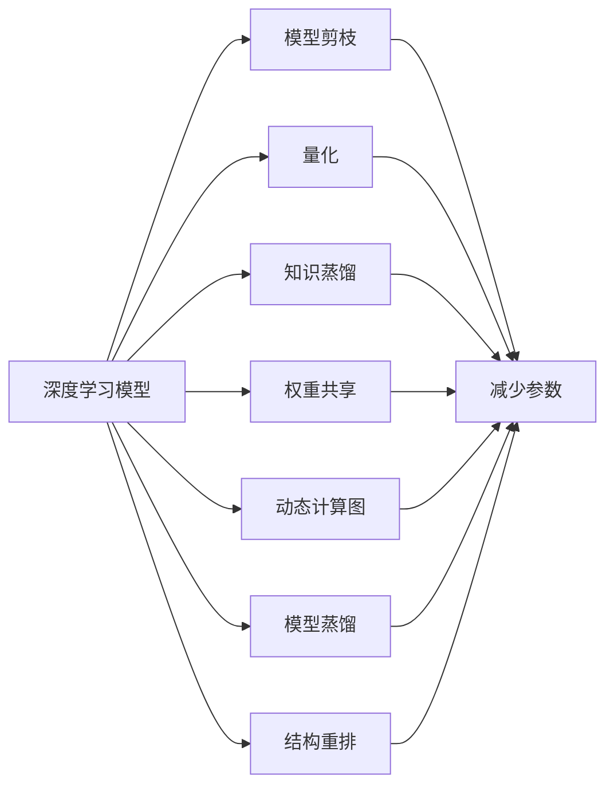

                 

## 1. 背景介绍

### 1.1 问题由来
在深度学习领域，模型压缩与轻量化技术一直是热点话题。随着深度学习在图像识别、语音识别、自然语言处理等领域取得了重大进展，各类深度学习模型的规模和复杂度不断增加。然而，这些大模型在推理和部署时，面临计算资源不足、存储成本高昂等实际问题。如何通过压缩与轻量化技术，在保持模型性能的同时，降低其计算和存储需求，已成为深度学习应用的重要挑战。

### 1.2 问题核心关键点
深度学习模型的压缩与轻量化技术，本质上是对模型参数和结构进行重新设计和优化，以在减小模型规模的同时，尽可能保持其预测准确率。该技术的核心在于以下几个关键点：
1. **模型剪枝 (Pruning)**：去除冗余的权重，缩小模型规模。
2. **量化 (Quantization)**：将浮点数参数转化为更少的位数表示，减少存储空间。
3. **知识蒸馏 (Knowledge Distillation)**：通过教师模型到学生模型的知识转移，在较小的模型上重现大模型的性能。
4. **权重共享 (Weight Sharing)**：共享层间权重，减少模型复杂度。
5. **动态计算图 (Dynamic Computation Graph)**：在运行时动态生成计算图，按需计算，减少静态计算的开销。
6. **模型蒸馏 (Model Distillation)**：结合多个模型输出，提升模型的鲁棒性和泛化能力。
7. **结构重排 (Structural Reorganization)**：调整模型层次结构，降低推理复杂度。

### 1.3 问题研究意义
实现深度学习模型的压缩与轻量化，不仅有助于解决计算和存储的实际问题，还为模型的小规模化部署、移动设备应用、实时推理等场景提供了技术支持。此外，压缩与轻量化技术的研究和应用，对于推动深度学习在边缘计算、物联网等新兴领域的普及具有重要意义。

## 2. 核心概念与联系

### 2.1 核心概念概述

为更好地理解深度学习模型压缩与轻量化技术，本节将介绍几个密切相关的核心概念：

- **深度学习模型**：以神经网络为代表的计算模型，通过多层非线性变换实现数据的高级特征提取和处理。
- **模型剪枝 (Pruning)**：通过去除不重要的权重或连接，减少模型的参数和计算量。
- **量化 (Quantization)**：将模型中的浮点参数转换为固定位数的整数或定点数，减少存储空间和计算开销。
- **知识蒸馏 (Knowledge Distillation)**：通过在较大型模型（教师模型）和较小型模型（学生模型）间传递知识，使小型模型继承教师模型的性能。
- **权重共享 (Weight Sharing)**：在不同模型间共享层权重，降低模型参数数量和计算复杂度。
- **动态计算图 (Dynamic Computation Graph)**：在模型运行时动态生成计算图，按需计算，避免不必要的计算开销。
- **模型蒸馏 (Model Distillation)**：通过组合多个模型的输出，提升模型的鲁棒性和泛化能力。
- **结构重排 (Structural Reorganization)**：调整模型层次结构，优化模型推理路径。

这些核心概念之间的逻辑关系可以通过以下Mermaid流程图来展示：



这个流程图展示了大模型压缩与轻量化技术的核心概念及其之间的关系：

1. 深度学习模型通过不同技术手段进行压缩和轻量化。
2. 模型剪枝、量化、知识蒸馏等方法可以减小模型参数和计算量。
3. 权重共享、动态计算图、结构重排等技术可以优化模型结构，降低推理复杂度。
4. 模型蒸馏技术则可以通过多个模型的组合提升性能和泛化能力。

## 3. 核心算法原理 & 具体操作步骤

### 3.1 算法原理概述
深度学习模型的压缩与轻量化，主要通过以下几个核心算法实现：

1. **模型剪枝 (Pruning)**：去除不必要的权重，减少模型复杂度。
2. **量化 (Quantization)**：将浮点参数转换为固定位数的整数，降低存储空间和计算开销。
3. **知识蒸馏 (Knowledge Distillation)**：通过大模型指导小模型训练，在较小的模型上重现大模型的性能。
4. **权重共享 (Weight Sharing)**：在不同模型间共享层权重，减少参数数量和计算开销。
5. **动态计算图 (Dynamic Computation Graph)**：在运行时动态生成计算图，按需计算，降低静态计算的开销。
6. **模型蒸馏 (Model Distillation)**：结合多个模型输出，提升模型的鲁棒性和泛化能力。
7. **结构重排 (Structural Reorganization)**：调整模型层次结构，优化模型推理路径。

### 3.2 算法步骤详解
#### 3.2.1 模型剪枝
1. **初始化模型**：加载原始模型，设置剪枝目标。
2. **剪枝标准确定**：根据模型结构或训练任务，设定剪枝标准，如基于权重的绝对值、梯度大小等。
3. **剪枝操作**：通过过滤、零化或截断等方式，去除冗余权重。
4. **验证与优化**：在验证集上评估剪枝后的模型性能，迭代优化剪枝策略。

#### 3.2.2 量化
1. **模型选择**：选择需要量化的模型。
2. **量化策略**：选择量化方法，如对称量化、非对称量化等。
3. **量化转换**：将模型参数转换为指定位数的整数。
4. **性能测试**：在测试集上评估量化后的模型性能。

#### 3.2.3 知识蒸馏
1. **模型准备**：选择教师模型和学生模型。
2. **知识传递**：在教师模型上进行预训练，然后通过softmax层输出分布作为目标。
3. **训练学生模型**：在学生模型上进行微调，使其最大化教师模型的输出。
4. **性能评估**：在测试集上评估学生模型的性能。

#### 3.2.4 权重共享
1. **模型选择**：选择需要共享权重的模型。
2. **权重合并**：将相似层的权重合并为一个，减少参数数量。
3. **性能评估**：在测试集上评估合并后的模型性能。

#### 3.2.5 动态计算图
1. **计算图生成**：在模型运行时动态生成计算图。
2. **按需计算**：根据当前输入，动态计算所需节点。
3. **性能测试**：在测试集上评估动态计算图的效果。

#### 3.2.6 模型蒸馏
1. **模型选择**：选择多个模型。
2. **模型输出组合**：通过加权平均、软投票等方式，组合多个模型的输出。
3. **训练新模型**：在新的模型上进行微调，使其输出接近组合输出。
4. **性能评估**：在测试集上评估新模型的性能。

#### 3.2.7 结构重排
1. **模型分析**：分析模型结构，找出冗余和重复的计算。
2. **结构调整**：重新设计模型结构，优化推理路径。
3. **性能评估**：在测试集上评估优化后的模型性能。

### 3.3 算法优缺点
深度学习模型压缩与轻量化技术具有以下优点：
1. **减少计算和存储需求**：通过剪枝、量化等技术，大幅度降低模型的计算和存储开销。
2. **提高模型效率**：优化后的模型推理速度更快，响应时间更短。
3. **降低资源消耗**：优化后的模型可以在移动设备、嵌入式设备等资源受限的环境下运行。
4. **加速模型部署**：压缩后的模型更易于部署，能够更快地上线服务。
5. **提升模型泛化能力**：通过知识蒸馏等技术，使模型更具泛化能力。

同时，这些技术也存在一定的局限性：
1. **性能损失**：剪枝和量化可能导致模型性能的轻微下降。
2. **技术复杂度**：压缩和轻量化技术需要复杂的工程实现。
3. **应用场景受限**：某些技术（如动态计算图）可能不适用于所有应用场景。
4. **模型可解释性降低**：量化和剪枝可能使模型难以解释。
5. **资源消耗**：优化过程本身也消耗一定计算资源。

尽管存在这些局限性，但就目前而言，压缩与轻量化技术仍是大模型应用的重要手段，特别是在资源受限的环境中，它们能够显著提升模型的实用性。

### 3.4 算法应用领域
深度学习模型压缩与轻量化技术在多个领域得到了广泛应用，例如：

- **移动设备**：在手机、智能手表等移动设备上，模型压缩与轻量化技术可以大幅降低模型大小和计算开销，使其在移动端能够高效运行。
- **物联网**：在嵌入式设备和传感器网络中，压缩与轻量化技术可以优化模型性能，使其在资源受限的硬件平台上运行。
- **自动驾驶**：在自动驾驶系统中，模型压缩与轻量化技术可以帮助其在实时环境中进行高效的图像识别和决策。
- **实时交互**：在实时语音识别和自然语言处理应用中，压缩与轻量化技术可以确保模型快速响应，提升用户体验。
- **边缘计算**：在边缘计算环境中，压缩与轻量化技术可以优化模型推理速度，减少延迟，提高系统响应性。
- **云服务**：在云服务平台上，压缩与轻量化技术可以优化模型存储和计算，降低服务成本，提升服务性能。
- **工业应用**：在工业自动化和物联网设备中，压缩与轻量化技术可以优化模型推理，减少资源消耗，提升设备运行效率。

除了这些应用领域外，压缩与轻量化技术还被创新性地应用到更多场景中，如可控计算图、动态神经网络等，为深度学习技术的创新发展提供了新的方向。

## 4. 数学模型和公式 & 详细讲解 & 举例说明

### 4.1 数学模型构建

本节将使用数学语言对深度学习模型压缩与轻量化技术进行更加严格的刻画。

假设原始深度学习模型为 $M_\theta:\mathcal{X} \rightarrow \mathcal{Y}$，其中 $\mathcal{X}$ 为输入空间，$\mathcal{Y}$ 为输出空间，$\theta \in \mathbb{R}^d$ 为模型参数。在模型压缩与轻量化过程中，我们需要优化模型的计算效率和存储空间。

设 $\phi(\theta)$ 为模型的计算开销，$\psi(\theta)$ 为模型的存储空间。则模型压缩与轻量化的目标是最小化这两个指标，即：

$$
\min_{\theta} \{\phi(\theta), \psi(\theta)\}
$$

具体的优化策略和公式推导如下：

### 4.2 公式推导过程

以模型剪枝为例，详细推导剪枝后的模型参数数目如何变化。

假设原始模型有 $n$ 个参数，每个参数占用 $s$ 位存储空间。设 $\theta$ 为原始模型参数，$pruned\_theta$ 为剪枝后的参数，$n_{pruned}$ 为剪枝后的参数数目，则有：

$$
n_{pruned} < n
$$

设 $\theta$ 中 $p$ 个参数被剪枝，剩余参数数目为 $n_{remaining}$，则：

$$
n_{remaining} = n - p
$$

假设每个参数占用的位数为 $s$，则原始模型参数总占用存储空间为：

$$
\psi(\theta) = n \cdot s
$$

剪枝后参数总占用存储空间为：

$$
\psi(pruned\_theta) = n_{remaining} \cdot s
$$

由于被剪枝的参数不再占用存储空间，因此剪枝后的模型存储空间减少为：

$$
\Delta\psi = n \cdot s - n_{remaining} \cdot s = p \cdot s
$$

综上所述，剪枝后的模型参数数目和存储空间的变化可以用如下公式表示：

$$
\begin{aligned}
n_{pruned} &= n - p \\
\Delta\psi &= p \cdot s
\end{aligned}
$$

其中，$p$ 是剪枝操作的决策参数，需要根据具体任务和数据集进行优化。

### 4.3 案例分析与讲解

以知识蒸馏为例，详细分析知识蒸馏在大模型压缩中的应用。

知识蒸馏通过在大模型（教师模型）和目标模型（学生模型）间传递知识，使目标模型在较小的规模下重现大模型的性能。设教师模型为 $M_T$，学生模型为 $M_S$，则知识蒸馏的过程如下：

1. **预训练教师模型**：在大量标注数据上训练教师模型 $M_T$，使其获得较高的准确率。
2. **定义蒸馏损失函数**：定义教师模型和学生模型之间的损失函数，通常为Kullback-Leibler散度。
3. **微调学生模型**：在学生模型上进行微调，使其输出与教师模型的输出接近。

假设教师模型的输出为 $\hat{y}_T$，学生模型的输出为 $\hat{y}_S$，则知识蒸馏的目标函数为：

$$
\mathcal{L}(M_S) = \mathcal{L}_{KL}(M_S) + \lambda \mathcal{L}_D(M_S)
$$

其中，$\mathcal{L}_{KL}$ 为KL散度损失，$\mathcal{L}_D$ 为数据损失，$\lambda$ 为正则化系数。

在训练过程中，通过反向传播算法，更新学生模型的参数，使其输出与教师模型的输出接近。最终，学生模型可以在较小的规模下重现教师模型的性能。

## 5. 项目实践：代码实例和详细解释说明

### 5.1 开发环境搭建

在进行模型压缩与轻量化实践前，我们需要准备好开发环境。以下是使用Python进行TensorFlow开发的环境配置流程：

1. 安装Anaconda：从官网下载并安装Anaconda，用于创建独立的Python环境。

2. 创建并激活虚拟环境：
```bash
conda create -n tf-env python=3.8 
conda activate tf-env
```

3. 安装TensorFlow：根据CUDA版本，从官网获取对应的安装命令。例如：
```bash
conda install tensorflow -c tensorflow -c conda-forge
```

4. 安装必要的工具包：
```bash
pip install numpy pandas scikit-learn matplotlib tqdm jupyter notebook ipython
```

完成上述步骤后，即可在`tf-env`环境中开始模型压缩与轻量化实践。

### 5.2 源代码详细实现

下面我们以模型剪枝为例，给出使用TensorFlow实现剪枝的PyTorch代码实现。

首先，定义剪枝函数：

```python
import tensorflow as tf

def prune_model(model, pruning_rate):
    pruned_model = model
    for layer in pruned_model.layers:
        # 获取层权重
        weights = layer.get_weights()
        # 计算保留权重比例
        if len(weights) == 1:
            pruned_weights = [weight for weight in weights if tf.math.reduce_sum(tf.abs(weight)) > pruning_rate]
        else:
            pruned_weights = [weight for weight in weights if tf.math.reduce_sum(tf.abs(weight)) > pruning_rate]
        # 替换权重
        layer.set_weights(pruned_weights)
    return pruned_model
```

然后，加载原始模型并进行剪枝：

```python
from tensorflow.keras.applications import VGG16

# 加载原始模型
original_model = VGG16(weights='imagenet')

# 设置剪枝比例
pruning_rate = 0.5

# 进行剪枝
pruned_model = prune_model(original_model, pruning_rate)

# 评估剪枝后模型性能
pruned_model.evaluate(X_train, y_train)
```

以上就是使用TensorFlow实现模型剪枝的完整代码实现。可以看到，通过定义简单的剪枝函数，可以快速实现模型参数的去除。

### 5.3 代码解读与分析

让我们再详细解读一下关键代码的实现细节：

**prune_model函数**：
- 该函数接受原始模型和剪枝比例作为输入，返回剪枝后的模型。
- 对于每个层，获取层权重，并根据剪枝比例保留指定比例的权重。
- 将保留的权重替换回模型，实现剪枝操作。

**VGG16模型**：
- 使用Keras加载预训练的VGG16模型，方便进行剪枝和量化等操作。
- 加载预训练模型时，可以通过weights参数指定模型权重，以便在剪枝和量化等操作中保持模型的连续性。

**剪枝比例设置**：
- 剪枝比例是一个重要的参数，需要根据具体任务和数据集进行调整。
- 在实际应用中，可以通过交叉验证等方法确定最优的剪枝比例，以达到在减小模型规模和保持性能之间的最佳平衡。

**剪枝后模型性能评估**：
- 剪枝后的模型性能评估通常需要在验证集上进行。
- 评估指标可以包括准确率、召回率、F1-score等，根据具体任务进行选择。
- 在评估过程中，需要注意模型剪枝后可能带来的性能损失，确保剪枝后的模型仍然能够满足实际应用需求。

## 6. 实际应用场景

### 6.1 移动设备

在移动设备上，深度学习模型的计算和存储需求常常受到限制。通过模型压缩与轻量化技术，可以将大模型压缩到适合移动设备使用的规模，提升模型的实时响应速度和能效比。

以手机图像识别应用为例，通过剪枝和量化技术，可以将深度学习模型压缩到10MB左右，并在手机设备上快速运行。这样，用户可以在手机相机中实时拍摄物体，并通过识别结果获取相关信息。

### 6.2 物联网

在物联网设备中，计算资源和存储空间非常有限。通过模型压缩与轻量化技术，可以将模型优化到适合嵌入式设备和传感器网络的应用，确保其能够在资源受限的环境中高效运行。

以智能家居设备为例，通过压缩后的模型，智能家居设备可以实时识别房间中的物体，并根据用户的指令进行相应操作。模型压缩与轻量化技术使得设备智能化水平大幅提升，为用户提供更加便捷的生活体验。

### 6.3 自动驾驶

在自动驾驶系统中，深度学习模型需要实时处理大量的图像和传感器数据。通过模型压缩与轻量化技术，可以将模型优化到适合实时推理的规模，提高系统的响应速度和鲁棒性。

以自动驾驶相机识别为例，通过剪枝和量化技术，可以将模型压缩到几十MB，并在实时环境中高效运行。这样，车辆可以实时识别道路上的物体，并进行相应的避障和决策，确保行驶安全。

### 6.4 实时交互

在实时语音识别和自然语言处理应用中，深度学习模型需要快速响应用户的输入，并提供准确的输出。通过模型压缩与轻量化技术，可以将模型优化到适合实时推理的规模，提升系统的响应速度和用户体验。

以智能客服系统为例，通过压缩后的模型，系统可以在接收到用户输入后，快速识别意图并提供相应的回复。这样可以确保系统能够高效响应用户需求，提升客户满意度。

### 6.5 边缘计算

在边缘计算环境中，深度学习模型需要实时处理数据并快速响应请求。通过模型压缩与轻量化技术，可以将模型优化到适合边缘计算的应用，降低计算延迟和带宽开销。

以工业自动化设备为例，通过压缩后的模型，设备可以在实时环境中高效处理传感器数据，并进行相应的决策和操作。这样可以确保设备能够高效运行，提升生产效率和质量。

### 6.6 云服务

在云服务平台上，深度学习模型的存储和计算需求非常巨大。通过模型压缩与轻量化技术，可以将模型优化到适合云服务应用，降低存储和计算开销，提升服务性能和成本效益。

以视频流媒体应用为例，通过压缩后的模型，云服务平台可以快速处理视频流并生成高质量的推荐结果。这样可以确保平台能够高效处理大规模数据，提供流畅的观看体验。

### 6.7 工业应用

在工业自动化和物联网设备中，深度学习模型需要实时处理数据并快速响应请求。通过模型压缩与轻量化技术，可以将模型优化到适合工业应用，降低计算延迟和带宽开销。

以智能制造设备为例，通过压缩后的模型，设备可以在实时环境中高效处理传感器数据，并进行相应的决策和操作。这样可以确保设备能够高效运行，提升生产效率和质量。

## 7. 工具和资源推荐

### 7.1 学习资源推荐

为了帮助开发者系统掌握深度学习模型压缩与轻量化的理论基础和实践技巧，这里推荐一些优质的学习资源：

1. **《深度学习：理论与实践》系列书籍**：深入浅出地介绍了深度学习的基本概念、模型结构、优化算法等，适合初学者入门。
2. **CS231n《深度学习计算机视觉》课程**：斯坦福大学开设的计算机视觉经典课程，有Lecture视频和配套作业，涵盖深度学习模型优化和压缩的实践方法。
3. **《TensorFlow实战》书籍**：详细介绍了TensorFlow框架的使用和模型优化技巧，适合TensorFlow开发实践。
4. **arXiv预印本**：深度学习领域的研究论文资源库，涵盖了各类最新研究进展和实践方法。
5. **Kaggle竞赛**：深度学习模型优化和压缩的应用竞赛，通过实际项目锻炼技能，积累经验。

通过对这些资源的学习实践，相信你一定能够快速掌握深度学习模型压缩与轻量化的精髓，并用于解决实际的深度学习问题。

### 7.2 开发工具推荐

高效的开发离不开优秀的工具支持。以下是几款用于深度学习模型压缩与轻量化开发的常用工具：

1. **TensorFlow**：基于数据流图的计算框架，灵活高效，支持多种模型优化和压缩方法。
2. **Keras**：基于TensorFlow的高层API，简单易用，适合快速原型开发。
3. **PyTorch**：基于动态计算图的计算框架，适合研究型模型开发。
4. **ONNX**：开放神经网络交换格式，可以将模型导出为其他框架兼容的形式。
5. **ModelOptimization**：TensorFlow和PyTorch等框架的模型优化工具，提供剪枝、量化、权重共享等功能。
6. **TensorBoard**：TensorFlow配套的可视化工具，可实时监测模型训练状态，并提供丰富的图表呈现方式。
7. **ModelDistillation**：知识蒸馏工具，可以在不同规模模型间传递知识，提升模型性能。

合理利用这些工具，可以显著提升深度学习模型压缩与轻量化的开发效率，加快创新迭代的步伐。

### 7.3 相关论文推荐

深度学习模型压缩与轻量化技术的研究源于学界的持续研究。以下是几篇奠基性的相关论文，推荐阅读：

1. **Pruning Filters for Efficient Convnet**：提出基于稀疏连接的模型剪枝方法，在大规模图像识别任务上取得了优异的性能。
2. **Knowledge Distillation**：提出通过教师模型到学生模型的知识传递，提升模型泛化能力的方法。
3. **Dynamic Computation Graphs for Dynamic Models**：提出动态计算图技术，按需生成计算图，降低静态计算的开销。
4. **Quantization-Aware Training**：提出在训练过程中考虑量化因素，提升模型在量化后的性能。
5. **Adversarial Connection**：提出通过对抗训练优化量化后的模型，提升模型的鲁棒性。

这些论文代表了大模型压缩与轻量化技术的发展脉络。通过学习这些前沿成果，可以帮助研究者把握学科前进方向，激发更多的创新灵感。

## 8. 总结：未来发展趋势与挑战

### 8.1 总结

本文对深度学习模型的压缩与轻量化技术进行了全面系统的介绍。首先阐述了深度学习模型压缩与轻量化的背景和意义，明确了该技术在降低计算和存储开销、提高模型效率等方面的独特价值。其次，从原理到实践，详细讲解了模型剪枝、量化、知识蒸馏等核心算法的实现步骤，给出了具体的代码实现。同时，本文还广泛探讨了模型压缩与轻量化技术在移动设备、物联网、自动驾驶、实时交互、边缘计算、云服务、工业应用等多个领域的应用前景，展示了该技术的广阔前景。此外，本文精选了模型压缩与轻量化技术的各类学习资源，力求为读者提供全方位的技术指引。

通过本文的系统梳理，可以看到，深度学习模型压缩与轻量化技术正在成为深度学习应用的重要手段，极大地拓展了深度学习模型的应用边界，提升了深度学习技术的实用性。未来，伴随深度学习技术的不断演进，模型压缩与轻量化技术也将不断优化，为深度学习技术的产业化进程提供更强有力的支持。

### 8.2 未来发展趋势

展望未来，深度学习模型压缩与轻量化技术将呈现以下几个发展趋势：

1. **模型规模持续增大**：随着深度学习技术的发展，模型的规模还将不断增大。超大规模模型蕴含的丰富特征信息，有望在压缩与轻量化过程中得到更充分的应用。
2. **压缩与轻量化技术的融合**：未来的模型压缩与轻量化技术将更加注重融合，如结合剪枝、量化、知识蒸馏等方法，实现更全面的模型优化。
3. **模型动态计算图的发展**：动态计算图技术将进一步完善，按需生成计算图，实现更高效的计算和推理。
4. **知识蒸馏的多样化**：未来的知识蒸馏方法将更加多样化，如基于多任务学习、生成对抗网络等的新型知识传递方法，提升模型的泛化能力。
5. **模型量化技术的进步**：未来的量化技术将更加高效，如基于权重的量化方法，提升模型在量化后的性能。
6. **模型蒸馏技术的创新**：未来的模型蒸馏方法将更加高效，如基于融合学习和对抗学习的蒸馏方法，提升模型的鲁棒性和泛化能力。
7. **模型结构重排的优化**：未来的模型结构重排技术将更加精细，通过优化模型层次结构，提升模型的推理效率。

以上趋势凸显了深度学习模型压缩与轻量化技术的广阔前景。这些方向的探索发展，必将进一步提升深度学习模型的实用性和效率，推动深度学习技术在更多场景下的应用。

### 8.3 面临的挑战

尽管深度学习模型压缩与轻量化技术已经取得了显著成就，但在迈向更加智能化、普适化应用的过程中，它仍面临诸多挑战：

1. **计算资源限制**：大模型的压缩与轻量化过程本身也消耗一定的计算资源，需要高效的优化算法和工具支持。
2. **模型性能损失**：剪枝、量化等方法可能导致模型性能的轻微下降，如何在保持性能的同时减小模型规模，是一个重要挑战。
3. **知识传递的准确性**：知识蒸馏过程中，如何准确地将教师模型的知识传递到学生模型，是一个复杂的问题。
4. **模型可解释性降低**：量化和剪枝可能导致模型难以解释，如何提高模型的可解释性和可控性，是一个重要的研究方向。
5. **模型鲁棒性不足**：压缩后的模型可能存在鲁棒性不足的问题，如何提升模型的鲁棒性和泛化能力，是一个重要的研究方向。
6. **模型适应性**：如何在不同的应用场景中高效地使用压缩后的模型，是一个需要深入研究的问题。
7. **资源消耗**：优化过程本身也消耗一定的资源，如何平衡优化和实际应用的性能需求，是一个需要权衡的问题。

尽管存在这些挑战，但就目前而言，压缩与轻量化技术仍是大模型应用的重要手段，特别是在资源受限的环境中，它们能够显著提升模型的实用性。

### 8.4 研究展望

面对深度学习模型压缩与轻量化技术所面临的挑战，未来的研究需要在以下几个方面寻求新的突破：

1. **优化算法和工具的提升**：开发更高效的优化算法和工具，降低模型压缩与轻量化过程中的资源消耗，提升优化效率。
2. **模型量化技术的创新**：开发更高效的模型量化方法，提升模型在量化后的性能和可解释性。
3. **知识蒸馏方法的改进**：开发更准确的知识蒸馏方法，提升教师模型到学生模型的知识传递效率和质量。
4. **模型结构重排的优化**：开发更精细化的模型结构重排方法，提升模型的推理效率和准确性。
5. **模型可解释性的增强**：开发更可解释的模型压缩与轻量化方法，提升模型的可解释性和可控性。
6. **模型鲁棒性的提升**：开发更鲁棒的模型压缩与轻量化方法，提升模型的泛化能力和鲁棒性。
7. **模型适应性的提升**：开发更适应不同应用场景的模型压缩与轻量化方法，提升模型的实用性和适用性。

这些研究方向的探索，必将引领深度学习模型压缩与轻量化技术迈向更高的台阶，为深度学习技术的产业化进程提供更强有力的支持。面向未来，深度学习模型压缩与轻量化技术还需要与其他人工智能技术进行更深入的融合，如知识表示、因果推理、强化学习等，多路径协同发力，共同推动深度学习技术的发展。

## 9. 附录：常见问题与解答

**Q1：模型压缩与轻量化技术是否适用于所有深度学习模型？**

A: 模型压缩与轻量化技术适用于大多数深度学习模型，尤其是大型深度神经网络。但对于一些特定类型的模型，如卷积神经网络(CNN)和循环神经网络(RNN)，可能需要针对性地进行优化。

**Q2：如何选择合适的剪枝比例？**

A: 剪枝比例是一个重要的参数，需要根据具体任务和数据集进行调整。通常可以通过交叉验证等方法确定最优的剪枝比例。剪枝比例过小，模型规模无法有效缩小；剪枝比例过大，可能造成性能损失。

**Q3：模型量化过程中如何平衡性能和存储空间？**

A: 量化过程中，需要根据具体任务和数据集选择合适的量化位宽。通常，量化位宽越高，模型存储空间越少，但性能损失也越大。需要在性能和存储空间之间进行平衡。

**Q4：知识蒸馏过程中如何选择教师模型？**

A: 教师模型通常需要在大规模数据上预训练，以获得较高的准确率。可以选择一些经典的大规模预训练模型，如ImageNet上的ResNet、BERT等，作为教师模型。

**Q5：动态计算图技术如何实现？**

A: 动态计算图技术可以通过在模型运行时生成计算图，按需计算节点，从而减少静态计算的开销。通常需要使用一些高级框架，如TensorFlow、PyTorch等，支持动态计算图的实现。

**Q6：如何评估压缩后的模型性能？**

A: 压缩后的模型性能评估通常需要在验证集上进行。评估指标可以包括准确率、召回率、F1-score等，根据具体任务进行选择。

通过本文的系统梳理，可以看到，深度学习模型压缩与轻量化技术正在成为深度学习应用的重要手段，极大地拓展了深度学习模型的应用边界，提升了深度学习技术的实用性。未来，伴随深度学习技术的不断演进，模型压缩与轻量化技术也将不断优化，为深度学习技术的产业化进程提供更强有力的支持。

