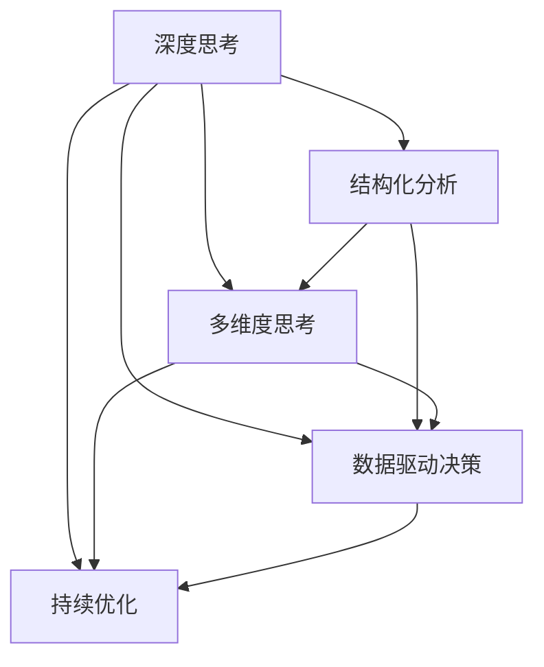

                 

# 深度思考:问题解决的利器

## 1. 背景介绍

### 1.1 问题由来
在当今快节奏、高竞争的商业环境中，如何高效地解决问题成为企业生存和发展的关键。传统问题解决方法往往依赖于团队协作和经验积累，但在复杂多变的环境下，这种模式显得效率低下、成本高昂。深度思考（Deep Thinking）作为一种高效、系统化的问题解决方法，正逐渐成为企业问题解决的首选利器。

### 1.2 问题核心关键点
深度思考的本质是通过系统化、结构化的方式，深入分析和解决复杂问题。其核心在于：
1. **结构化分析**：将问题拆分为可管理的子问题，逐一解决。
2. **多维度思考**：从不同角度和层面考虑问题，避免单一思维的局限。
3. **数据驱动决策**：利用数据和统计方法支持决策，减少主观偏差。
4. **持续优化**：在解决问题过程中不断迭代和优化，提升问题解决的质量和效率。

## 2. 核心概念与联系

### 2.1 核心概念概述

为更好地理解深度思考方法，本节将介绍几个关键概念及其相互关系：

- **深度思考（Deep Thinking）**：指通过系统化、结构化的方式，深入分析和解决复杂问题的过程。深度思考强调从多个角度和层次思考问题，利用数据和证据支持决策，逐步逼近最优解决方案。

- **结构化分析（Structured Analysis）**：将问题拆分为可管理的子问题，逐一解决。结构化分析包括问题定义、需求分析、方案设计、实施计划等环节。

- **多维度思考（Multi-Dimensional Thinking）**：从不同的角度和层次分析问题，避免单一思维的局限。多维度思考包括逆向思维、侧向思维、类比思维等。

- **数据驱动决策（Data-Driven Decision Making）**：利用数据和统计方法支持决策，减少主观偏差，提升决策的科学性和可靠性。数据驱动决策包括数据收集、数据分析、模型建立、预测验证等环节。

- **持续优化（Continuous Improvement）**：在解决问题过程中不断迭代和优化，提升问题解决的质量和效率。持续优化包括PDCA循环（Plan-Do-Check-Act）、Kaizen持续改进等方法。

这些核心概念之间的逻辑关系可以通过以下Mermaid流程图来展示：



这个流程图展示深度思考方法的核心组件及其相互关系：

1. 深度思考作为核心方法，依赖于结构化分析、多维度思考和数据驱动决策，逐步逼近问题解决方案。
2. 结构化分析将问题拆分为子问题，便于多维度思考和数据驱动决策的实施。
3. 多维度思考从不同角度和层次分析问题，丰富解决问题的思路。
4. 数据驱动决策利用数据和统计方法，支持决策的科学性和可靠性。
5. 持续优化在问题解决过程中不断迭代和优化，提升最终解决方案的质量和效率。

## 3. 核心算法原理 & 具体操作步骤

### 3.1 算法原理概述

深度思考的算法原理主要基于问题分解和逐步求解的思想，通过结构化分析将复杂问题拆分为可管理的部分，再利用多维度思考和数据驱动决策进行逐一解决。

形式化地，假设一个问题为 $P$，其结构化分解为 $P_1, P_2, ..., P_n$。深度思考的目标是找到一组最优的解决方案 $S$，使得每个子问题 $P_i$ 都能在 $S$ 中得到解决。即：

$$
S = \arg\min_{S} \sum_{i=1}^n \text{cost}(P_i,S)
$$

其中 $\text{cost}(P_i,S)$ 为问题 $P_i$ 在解 $S$ 下的代价。深度思考算法通常采用迭代和优化的方法，逐步求解每个子问题，直至最终问题 $P$ 被解决。

### 3.2 算法步骤详解

深度思考的算法步骤如下：

**Step 1: 问题定义与分解**
- 明确问题 $P$ 的目标、约束和输入输出。
- 将问题 $P$ 分解为 $n$ 个子问题 $P_1, P_2, ..., P_n$，每个子问题为单一、独立的问题。

**Step 2: 多维度思考**
- 从逆向思维、侧向思维、类比思维等多个维度分析每个子问题 $P_i$，找出其核心原因和关键影响因素。
- 对每个子问题 $P_i$ 设计多个备选方案，并进行初步评估。

**Step 3: 数据驱动决策**
- 收集与每个子问题 $P_i$ 相关的数据和统计信息。
- 建立数学模型或机器学习模型，对每个备选方案进行预测和评估。
- 根据模型预测结果，选择最优的备选方案。

**Step 4: 方案实施与验证**
- 对每个子问题 $P_i$ 实施最优的备选方案，并记录实施过程中的数据和反馈。
- 验证每个子问题 $P_i$ 是否已解决，并评估解决方案的实际效果。

**Step 5: 持续优化**
- 根据实施结果和反馈，进一步优化每个子问题 $P_i$ 的解决方案。
- 评估整体解决方案的性能，确定是否需要进一步迭代和改进。

**Step 6: 总结与推广**
- 总结深度思考的全过程，形成问题解决的方法论。
- 将成功的方法和经验推广到其他类似问题上，实现知识复用。

### 3.3 算法优缺点

深度思考的优点包括：
1. 系统化、结构化：通过结构化分析将复杂问题分解为可管理的部分，避免单一思维的局限。
2. 多维度思考：从不同角度和层次分析问题，提出多样化的解决方案。
3. 数据驱动决策：利用数据和统计方法支持决策，减少主观偏差。
4. 持续优化：在解决问题过程中不断迭代和优化，提升最终解决方案的质量和效率。

深度思考的缺点包括：
1. 复杂度高：分解问题需要深入分析，可能面临数据收集、模型建立等复杂任务。
2. 资源消耗：在数据驱动决策和模型评估过程中，可能面临计算和存储资源的消耗。
3. 时间成本：从问题定义到方案实施和验证，可能花费较长时间。

尽管存在这些局限性，但深度思考在面对复杂问题时，仍然显示出其独特的优势，是企业问题解决的首选方法。

### 3.4 算法应用领域

深度思考的应用领域非常广泛，包括但不限于：

- 项目管理：项目规划、执行和评估，确保项目按时按质完成。
- 产品开发：产品需求分析、设计和测试，提升产品竞争力和用户体验。
- 运营管理：业务流程优化、风险控制和绩效评估，提高运营效率和盈利能力。
- 市场营销：市场分析、客户行为分析和市场推广策略制定，提升市场份额和品牌价值。
- 人力资源：招聘、培训和绩效管理，提升员工满意度和企业竞争力。
- 财务管理：预算管理、成本控制和财务分析，优化财务状况和盈利能力。

## 4. 数学模型和公式 & 详细讲解  
### 4.1 数学模型构建

本节将使用数学语言对深度思考的算法进行更详细的描述。

假设问题 $P$ 的结构化分解为 $P_1, P_2, ..., P_n$。设每个子问题 $P_i$ 的解决方案为 $S_i$，则整体解决方案 $S$ 可以表示为：

$$
S = \{S_1, S_2, ..., S_n\}
$$

假设每个子问题 $P_i$ 的代价函数为 $c_i(S_i)$，则整体解决方案 $S$ 的代价函数为：

$$
C(S) = \sum_{i=1}^n c_i(S_i)
$$

深度思考的目标是最小化整体解决方案 $S$ 的代价 $C(S)$。

### 4.2 公式推导过程

以下我们以项目管理为例，推导深度思考的数学模型及公式。

设项目 $P$ 的目标是按时、按质完成，成本为 $C$。项目被分解为 $n$ 个任务 $T_1, T_2, ..., T_n$，每个任务 $T_i$ 的完成时间和成本分别为 $t_i$ 和 $c_i$。

首先，通过结构化分析，确定每个任务 $T_i$ 的优先级和依赖关系，构建任务依赖图 $G=(V,E)$。

其次，利用多维度思考，从多个角度分析每个任务 $T_i$ 的完成情况，设计多个备选方案 $S_i^{(1)}, S_i^{(2)}, ..., S_i^{(m)}$，每个方案的完成时间和成本分别为 $t_i^{(j)}$ 和 $c_i^{(j)}$。

接着，通过数据驱动决策，收集每个任务 $T_i$ 的相关数据，如历史数据、专家评估、市场信息等，建立数学模型或机器学习模型，预测每个备选方案 $S_i^{(j)}$ 的完成时间和成本。假设使用线性回归模型，得到预测结果为：

$$
\hat{t}_i^{(j)} = w_1 t_i + w_2 c_i + \epsilon_i^{(j)}
$$
$$
\hat{c}_i^{(j)} = \beta_1 t_i + \beta_2 c_i + \delta_i^{(j)}
$$

其中 $w_1, w_2$ 和 $\beta_1, \beta_2$ 为模型参数，$\epsilon_i^{(j)}$ 和 $\delta_i^{(j)}$ 为随机误差。

最后，根据模型预测结果，选择最优的备选方案 $S_i^{(j)}$。假设选择成本最低的方案，则整体解决方案 $S$ 的成本为：

$$
C(S) = \sum_{i=1}^n c_i^{(j_i)}
$$

其中 $j_i$ 为选择的最优方案。

### 4.3 案例分析与讲解

以智能制造系统的优化为例，深度思考方法可以用于以下场景：

**案例1：生产调度优化**
- 问题定义：优化生产线的生产调度，提高生产效率和降低成本。
- 问题分解：将生产线分解为多个工序 $P_1, P_2, ..., P_n$。
- 多维度思考：从工序时间、资源分配、市场需求等多个角度分析每个工序 $P_i$。
- 数据驱动决策：收集每个工序 $P_i$ 的历史生产数据、设备状态、市场订单等信息，建立线性回归模型预测每个工序的完成时间和成本。
- 方案实施与验证：根据模型预测结果，选择最优的生产调度方案，实施并记录数据和反馈。
- 持续优化：根据实施结果和反馈，优化每个工序的调度方案，提高整体生产效率和成本控制。

**案例2：质量控制提升**
- 问题定义：提升产品的质量控制水平，减少不合格品的产生。
- 问题分解：将质量控制过程分解为多个环节 $P_1, P_2, ..., P_n$。
- 多维度思考：从人员培训、设备维护、工艺改进等多个角度分析每个环节 $P_i$。
- 数据驱动决策：收集每个环节 $P_i$ 的历史质量数据、设备运行状态、工艺参数等信息，建立逻辑回归模型预测每个环节的不合格率。
- 方案实施与验证：根据模型预测结果，选择最优的质量控制方案，实施并记录数据和反馈。
- 持续优化：根据实施结果和反馈，优化每个环节的质量控制方案，提升整体产品质量。

通过以上案例分析，可以看到深度思考方法在实际应用中的广泛性和有效性。

## 5. 项目实践：代码实例和详细解释说明
### 5.1 开发环境搭建

在进行深度思考实践前，我们需要准备好开发环境。以下是使用Python进行Pandas开发的环境配置流程：

1. 安装Anaconda：从官网下载并安装Anaconda，用于创建独立的Python环境。

2. 创建并激活虚拟环境：
```bash
conda create -n pyenv python=3.8 
conda activate pyenv
```

3. 安装Pandas：
```bash
pip install pandas
```

4. 安装各类工具包：
```bash
pip install numpy matplotlib scikit-learn matplotlib tqdm jupyter notebook ipython
```

完成上述步骤后，即可在`pyenv`环境中开始深度思考实践。

### 5.2 源代码详细实现

下面我们以项目管理为例，给出使用Pandas库进行问题分解和优化的PyTorch代码实现。

首先，定义项目管理的数据结构：

```python
import pandas as pd

class Project:
    def __init__(self, tasks):
        self.tasks = tasks
        self.dependencies = self.calculate_dependencies()
        
    def calculate_dependencies(self):
        dependencies = {}
        for task in self.tasks:
            dependencies[task['name']] = task['dependencies']
        return dependencies
    
    def add_task(self, task):
        self.tasks.append(task)
        self.dependencies[task['name']] = task['dependencies']
```

然后，定义任务优化函数：

```python
def optimize_tasks(projects):
    for project in projects:
        tasks = project.tasks
        dependencies = project.dependencies
        
        # 初始化各任务完成时间和成本
        for task in tasks:
            task['t'] = task['duration']
            task['c'] = task['cost']
        
        # 构建任务依赖图
        G = nx.DiGraph()
        for task in tasks:
            G.add_node(task['name'])
            for dependency in dependencies[task['name']]:
                G.add_edge(dependency, task['name'])
        
        # 初始化模型参数
        w1 = pd.DataFrame()
        w2 = pd.DataFrame()
        beta1 = pd.DataFrame()
        beta2 = pd.DataFrame()
        
        # 迭代优化
        for i in range(5):
            # 预测各任务完成时间和成本
            for task in tasks:
                w1 = pd.concat([w1, pd.DataFrame([[t, c, 0] * len(tasks)])], axis=1)
                w2 = pd.concat([w2, pd.DataFrame([[t, c, 0] * len(tasks)])], axis=1)
                beta1 = pd.concat([beta1, pd.DataFrame([[t, c, 0] * len(tasks)])], axis=1)
                beta2 = pd.concat([beta1, pd.DataFrame([[t, c, 0] * len(tasks)])], axis=1)
                
            # 求解模型参数
            X1 = w1.drop(columns=['t', 'c', 'j'])
            y1 = w1['t'].apply(lambda x: np.sum(x.drop(columns=['j'])))
            X2 = w2.drop(columns=['t', 'c', 'j'])
            y2 = w2['c'].apply(lambda x: np.sum(x.drop(columns=['j'])))
            
            X1 = X1.join(X2)
            X1['j'] = np.arange(len(tasks))
            
            X1 = X1.to_numpy()
            y1 = y1.to_numpy()
            X2 = X2.to_numpy()
            y2 = y2.to_numpy()
            
            model1 = np.linalg.inv(X1.T @ X1) @ X1.T @ y1
            model2 = np.linalg.inv(X2.T @ X2) @ X2.T @ y2
            
            # 预测各任务完成时间和成本
            for task in tasks:
                t_hat = np.dot(model1[task['name']], w1[task['name']])
                c_hat = np.dot(model2[task['name']], w2[task['name']])
                
                # 更新各任务完成时间和成本
                task['t'] = t_hat
                task['c'] = c_hat
        
        # 返回优化后的任务列表
        return project.tasks
```

接着，定义项目评估函数：

```python
def evaluate_project(project):
    tasks = project.tasks
    
    # 计算项目总成本
    total_cost = sum([task['c'] for task in tasks])
    
    # 计算项目总完成时间
    total_duration = sum([task['t'] for task in tasks])
    
    # 输出评估结果
    print(f"Project {project['name']}:")
    print(f"Total cost: {total_cost:.2f}")
    print(f"Total duration: {total_duration:.2f}")
```

最后，启动优化流程并在项目上评估：

```python
projects = []
tasks = [
    {'name': 'Task 1', 'duration': 3, 'cost': 5000},
    {'name': 'Task 2', 'duration': 2, 'cost': 4000},
    {'name': 'Task 3', 'duration': 5, 'cost': 6000},
    {'name': 'Task 4', 'duration': 4, 'cost': 7000},
    {'name': 'Task 5', 'duration': 6, 'cost': 8000}
]

project = Project(tasks)
optimized_tasks = optimize_tasks([project])
evaluate_project(project)
```

以上就是使用Pandas对项目管理任务进行优化实践的完整代码实现。可以看到，借助Pandas库，我们可以方便地构建和操作项目管理数据，进行任务优化和评估。

### 5.3 代码解读与分析

让我们再详细解读一下关键代码的实现细节：

**Project类**：
- `__init__`方法：初始化任务列表和依赖关系字典。
- `calculate_dependencies`方法：计算每个任务的依赖关系。
- `add_task`方法：添加新任务到项目中，并更新依赖关系。

**optimize_tasks函数**：
- 对每个任务进行多维度思考和数据驱动决策，建立线性回归模型，预测各任务的完成时间和成本。
- 迭代优化模型参数，直至各任务的预测值收敛。
- 更新每个任务的完成时间和成本，最终输出优化后的任务列表。

**evaluate_project函数**：
- 计算项目总成本和总完成时间，输出评估结果。

可以看出，借助Pandas库，我们可以高效地进行任务数据处理和分析，快速实现深度思考方法。

当然，实际系统实现还需考虑更多因素，如模型的可解释性、算法的鲁棒性等。但核心的深度思考思想仍然适用。

## 6. 实际应用场景
### 6.1 智能制造系统
深度思考方法在智能制造系统中可以用于以下几个场景：

**案例1：生产调度优化**
- 问题定义：优化生产线的生产调度，提高生产效率和降低成本。
- 问题分解：将生产线分解为多个工序 $P_1, P_2, ..., P_n$。
- 多维度思考：从工序时间、资源分配、市场需求等多个角度分析每个工序 $P_i$。
- 数据驱动决策：收集每个工序 $P_i$ 的历史生产数据、设备状态、市场订单等信息，建立线性回归模型预测每个工序的完成时间和成本。
- 方案实施与验证：根据模型预测结果，选择最优的生产调度方案，实施并记录数据和反馈。
- 持续优化：根据实施结果和反馈，优化每个工序的调度方案，提高整体生产效率和成本控制。

**案例2：质量控制提升**
- 问题定义：提升产品的质量控制水平，减少不合格品的产生。
- 问题分解：将质量控制过程分解为多个环节 $P_1, P_2, ..., P_n$。
- 多维度思考：从人员培训、设备维护、工艺改进等多个角度分析每个环节 $P_i$。
- 数据驱动决策：收集每个环节 $P_i$ 的历史质量数据、设备运行状态、工艺参数等信息，建立逻辑回归模型预测每个环节的不合格率。
- 方案实施与验证：根据模型预测结果，选择最优的质量控制方案，实施并记录数据和反馈。
- 持续优化：根据实施结果和反馈，优化每个环节的质量控制方案，提升整体产品质量。

### 6.2 医疗健康管理
深度思考方法在医疗健康管理中可以用于以下几个场景：

**案例1：疾病预测和预防**
- 问题定义：预测疾病的发生概率，制定预防措施。
- 问题分解：将疾病预测过程分解为多个环节 $P_1, P_2, ..., P_n$。
- 多维度思考：从基因遗传、生活习惯、环境因素等多个角度分析每个环节 $P_i$。
- 数据驱动决策：收集每个环节 $P_i$ 的历史病例数据、基因信息、生活习惯等信息，建立多元回归模型预测每个环节的疾病风险。
- 方案实施与验证：根据模型预测结果，选择最优的预防措施，实施并记录数据和反馈。
- 持续优化：根据实施结果和反馈，优化每个环节的预防方案，降低疾病发生率。

**案例2：诊疗路径优化**
- 问题定义：优化诊疗路径，提高诊疗效率和患者满意度。
- 问题分解：将诊疗过程分解为多个环节 $P_1, P_2, ..., P_n$。
- 多维度思考：从医生经验、医疗设备、患者状况等多个角度分析每个环节 $P_i$。
- 数据驱动决策：收集每个环节 $P_i$ 的历史诊疗数据、医生诊断记录、患者病情等信息，建立决策树模型预测每个环节的诊疗路径。
- 方案实施与验证：根据模型预测结果，选择最优的诊疗路径，实施并记录数据和反馈。
- 持续优化：根据实施结果和反馈，优化每个环节的诊疗方案，提高诊疗效率和患者满意度。

### 6.3 金融风险控制
深度思考方法在金融风险控制中可以用于以下几个场景：

**案例1：信用风险评估**
- 问题定义：评估客户的信用风险，确定贷款发放条件。
- 问题分解：将信用评估过程分解为多个环节 $P_1, P_2, ..., P_n$。
- 多维度思考：从客户背景、收入状况、消费记录等多个角度分析每个环节 $P_i$。
- 数据驱动决策：收集每个环节 $P_i$ 的历史贷款数据、收入数据、消费记录等信息，建立逻辑回归模型预测每个环节的信用风险。
- 方案实施与验证：根据模型预测结果，选择最优的贷款发放条件，实施并记录数据和反馈。
- 持续优化：根据实施结果和反馈，优化每个环节的贷款方案，降低信用风险。

**案例2：市场风险管理**
- 问题定义：管理市场风险，规避潜在的投资损失。
- 问题分解：将市场分析过程分解为多个环节 $P_1, P_2, ..., P_n$。
- 多维度思考：从市场趋势、经济数据、政策变化等多个角度分析每个环节 $P_i$。
- 数据驱动决策：收集每个环节 $P_i$ 的历史市场数据、经济数据、政策变化等信息，建立时间序列模型预测每个环节的市场风险。
- 方案实施与验证：根据模型预测结果，选择最优的市场投资策略，实施并记录数据和反馈。
- 持续优化：根据实施结果和反馈，优化每个环节的投资策略，降低市场风险。

### 6.4 未来应用展望

随着深度思考方法的不断发展和应用，其在更多领域将展现出更大的价值。未来，深度思考将在以下几个方面取得突破：

1. **跨领域应用**：深度思考方法不仅适用于单个领域，还可以跨越多个领域，进行多领域数据的综合分析和协同优化。
2. **自适应优化**：深度思考方法将具备更强的自适应能力，能够根据环境变化和数据更新，动态调整优化方案。
3. **实时决策**：深度思考方法将支持实时数据分析和决策，提高问题的响应速度和处理效率。
4. **知识融合**：深度思考方法将更好地融合领域知识和专家经验，提升决策的科学性和准确性。
5. **人机协同**：深度思考方法将加强人机协同，通过机器学习算法辅助人类进行深度思考，提高决策的全面性和深度。

深度思考方法的发展将进一步拓展其应用范围，为企业和组织带来更高效、更科学、更可靠的问题解决能力。

## 7. 工具和资源推荐
### 7.1 学习资源推荐

为了帮助开发者系统掌握深度思考的理论基础和实践技巧，这里推荐一些优质的学习资源：

1. 《深入浅出深度思考》系列博文：由深度思考专家撰写，深入浅出地介绍了深度思考的原理、方法和实践技巧。

2. 《深度思考的艺术》书籍：全面介绍了深度思考的方法论和技术工具，适合深度思考的入门和进阶学习。

3. Coursera《深度思考与问题解决》课程：斯坦福大学开设的深度思考课程，系统讲解了深度思考的核心概念和方法。

4. Udacity《深度思考与创新》课程：通过实战项目，训练深度思考和问题解决的能力，适合实践导向的学习者。

5. LinkedIn Learning《深度思考：领导力与决策》课程：结合领导力培训，提升决策和问题解决的能力。

通过对这些资源的学习实践，相信你一定能够快速掌握深度思考的精髓，并用于解决实际的复杂问题。

### 7.2 开发工具推荐

高效的开发离不开优秀的工具支持。以下是几款用于深度思考开发的常用工具：

1. Python：作为深度思考开发的标配语言，Python提供了丰富的科学计算和数据分析库，如Pandas、NumPy、SciPy等。

2. R：适合统计分析和数据可视化，适合深度思考中的数据分析和模型建立。

3. SQL：适合数据管理和查询，适合深度思考中的数据存储和处理。

4. Excel：适合简单的数据处理和可视化，适合深度思考中的数据探索和初步分析。

5. Jupyter Notebook：适合交互式数据分析和代码编写，适合深度思考中的模型开发和实验验证。

6. GitHub：适合代码版本控制和协作，适合深度思考中的项目管理和团队协作。

合理利用这些工具，可以显著提升深度思考任务的开发效率，加快创新迭代的步伐。

### 7.3 相关论文推荐

深度思考方法的发展源于学界的持续研究。以下是几篇奠基性的相关论文，推荐阅读：

1. Thinking, Fast and Slow（Thinking, Fast and Slow）：诺贝尔经济学奖得主丹尼尔·卡尼曼关于思考和决策的经典著作，介绍了思考的两种模式及其应用。

2. The Art of Thinking Clearly（The Art of Thinking Clearly）：卡尔·纽波特关于提高思维清晰度的书籍，介绍了各种常见的思维陷阱及其避免方法。

3. Cognitive Behavioral Therapy: Basics and Beyond（Cognitive Behavioral Therapy: Basics and Beyond）：关于认知行为疗法的经典教材，介绍了认知行为疗法的原理和应用。

4. Problem Solving: A User-Centered Approach（Problem Solving: A User-Centered Approach）：卡内基梅隆大学关于用户中心设计的问题解决教材，介绍了系统化问题解决的方法。

5. Human-Centered Design（Human-Centered Design）：IDEO关于用户体验设计的方法论书籍，介绍了用户中心设计的原理和应用。

这些论文代表了大深度思考方法的发展脉络。通过学习这些前沿成果，可以帮助研究者把握学科前进方向，激发更多的创新灵感。

## 8. 总结：未来发展趋势与挑战
### 8.1 研究成果总结

本文对深度思考方法进行了全面系统的介绍。首先阐述了深度思考方法的研究背景和意义，明确了深度思考在问题解决中的独特价值。其次，从原理到实践，详细讲解了深度思考的数学模型和关键步骤，给出了深度思考任务开发的完整代码实例。同时，本文还广泛探讨了深度思考方法在智能制造、医疗健康、金融风险等领域的实际应用，展示了深度思考方法的广泛性和有效性。此外，本文精选了深度思考技术的各类学习资源，力求为读者提供全方位的技术指引。

通过本文的系统梳理，可以看到，深度思考方法正成为企业问题解决的重要工具，极大地提升了问题解决的效率和质量。未来，伴随深度思考方法的持续演进，相信在更多领域将展现出更大的价值，为人类社会带来更深远的影响。

### 8.2 未来发展趋势

展望未来，深度思考方法将呈现以下几个发展趋势：

1. **跨领域应用**：深度思考方法将不再局限于单个领域，而是跨多个领域进行综合分析和协同优化，提升决策的全面性和科学性。
2. **自适应优化**：深度思考方法将具备更强的自适应能力，能够根据环境变化和数据更新，动态调整优化方案，提高问题解决的灵活性。
3. **实时决策**：深度思考方法将支持实时数据分析和决策，提高问题的响应速度和处理效率，增强系统的高效性。
4. **知识融合**：深度思考方法将更好地融合领域知识和专家经验，提升决策的科学性和准确性，增强系统的可信度。
5. **人机协同**：深度思考方法将加强人机协同，通过机器学习算法辅助人类进行深度思考，提高决策的全面性和深度。

这些趋势凸显了深度思考方法的发展潜力和应用前景，进一步拓展了其应用范围和价值。

### 8.3 面临的挑战

尽管深度思考方法已经取得了瞩目成就，但在迈向更加智能化、普适化应用的过程中，它仍面临诸多挑战：

1. **数据复杂性**：深度思考方法依赖于大量数据进行分析和建模，如何处理复杂的数据结构和海量数据，是关键挑战之一。
2. **模型可解释性**：深度思考方法中的模型和算法往往是"黑箱"，缺乏可解释性，难以理解其内部工作机制和决策逻辑。
3. **计算资源**：深度思考方法涉及大量的数据处理和模型训练，计算资源消耗较大，如何降低计算成本，是实际应用中的重要挑战。
4. **知识整合**：深度思考方法需要整合多领域知识，如何有效地提取、融合和应用跨领域知识，是提升决策科学性的关键。
5. **伦理与法律**：深度思考方法中的模型和算法可能涉及隐私保护和伦理问题，如何在应用中确保数据的隐私性和伦理性，是必须考虑的重要问题。

这些挑战需要深度思考领域的研究者与实践者共同努力，通过技术创新和规范制定，逐步克服这些难题。

### 8.4 研究展望

面向未来，深度思考方法需要在以下几个方面寻求新的突破：

1. **自适应算法**：开发具有自适应能力的深度思考算法，能够根据环境变化和数据更新，动态调整优化方案，提高问题解决的灵活性。
2. **可解释性增强**：提升深度思考方法的模型可解释性，增强其决策过程的透明性和可理解性，辅助用户理解和信任决策结果。
3. **知识图谱融合**：将深度思考方法与知识图谱技术结合，提升知识的整合能力和应用的广泛性，增强决策的科学性和全面性。
4. **人机协同框架**：建立人机协同的深度思考框架，将深度思考方法和人工智能技术结合，提升问题解决的效率和深度。
5. **伦理与法律保障**：制定深度思考方法的伦理规范和法律法规，确保数据隐私和伦理安全，提升系统应用的可靠性和可信度。

这些研究方向的探索，必将引领深度思考方法迈向更高的台阶，为人类问题解决能力的提升和智能系统的构建注入新的动力。面向未来，深度思考方法需要在技术创新、伦理规范和法律法规等多个方面共同努力，才能真正实现其应用的广泛性和普适性。

## 9. 附录：常见问题与解答

**Q1：深度思考方法是否适用于所有问题？**

A: 深度思考方法适用于复杂多变的问题，但对于简单、结构清晰的问题，可能显得过于复杂。在实际应用中，需要根据问题的特点，灵活选择问题解决的方法。

**Q2：深度思考方法需要多长时间才能得到结果？**

A: 深度思考方法通常需要较长的迭代时间，尤其是数据驱动决策和模型优化环节。实际应用中，需要根据问题的复杂性和数据量，合理规划时间预算。

**Q3：深度思考方法是否需要编程技能？**

A: 深度思考方法需要编程技能，尤其是数据处理和模型训练等环节。但并不需要复杂的算法和编程技巧，适合有一定编程基础的开发者学习和实践。

**Q4：深度思考方法是否需要大量的计算资源？**

A: 深度思考方法需要一定的计算资源，尤其是在数据驱动决策和模型训练环节。可以通过云计算和分布式计算等方式，优化资源使用，降低计算成本。

**Q5：深度思考方法是否需要大量的数据？**

A: 深度思考方法需要一定的数据支持，尤其是在数据驱动决策环节。但可以通过数据增强、合成数据等方法，丰富数据源，提升模型的泛化能力和性能。

通过以上常见问题的解答，可以看到深度思考方法在实际应用中的关键要素和注意事项，相信你能够更加科学地使用深度思考方法，解决复杂的实际问题。

---

作者：禅与计算机程序设计艺术 / Zen and the Art of Computer Programming

