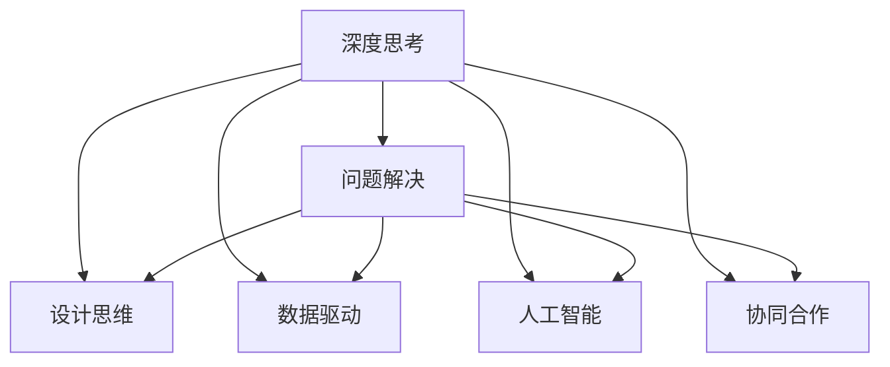

                 

# 深度思考:问题解决的利器

> 关键词：深度思考, 问题解决, 算法, 数据驱动, 设计思维, 人工智能, 机器学习, 数据科学

## 1. 背景介绍

### 1.1 问题由来
在科技日新月异的今天，信息爆炸和社会复杂性加剧了人类面对的各类问题。无论是企业决策、项目管理、医疗诊断还是科学研究，有效的解决问题都是提升效率、降低成本、确保成功的关键。因此，如何培养和提升个人深度思考能力，实现高效、系统的问题解决，成为了现代社会对个体能力的重要需求。

### 1.2 问题核心关键点
深度思考旨在通过结构化、系统化的方法，提升问题解决能力。其核心在于：
1. **系统化方法**：运用科学、系统的方法，分析问题本质，制定解决方案。
2. **数据驱动**：利用数据、统计和模型，支持决策和判断，提升结论可靠性。
3. **设计思维**：借鉴设计领域的方法论，注重用户体验和问题解决的整体性。
4. **人工智能**：结合人工智能和大数据分析，提供快速、高效的问题解决方案。
5. **协同合作**：强调团队合作，集思广益，共同应对复杂问题。

深度思考的应用，不仅帮助个体提升效率，还能促进社会整体创新和进步。本文将深入探讨深度思考的核心概念和实际应用，通过系统分析问题解决流程，提供实用策略和案例，希望能为读者提供有价值的指导和启发。

## 2. 核心概念与联系

### 2.1 核心概念概述

为更好地理解深度思考在问题解决中的应用，本节将介绍几个关键概念：

- **深度思考**：一种系统的、结构化的问题解决方式，通过深度分析、系统方法，高效解决复杂问题。
- **问题解决**：识别问题、制定方案并实施的过程，要求系统化、结构化、动态化的思维。
- **设计思维**：借鉴设计学领域的方法论，注重用户需求、用户体验和整体解决方案。
- **数据驱动**：利用数据、统计和模型，支持决策和判断，提升结论的可靠性和科学性。
- **人工智能**：结合机器学习和大数据分析，提供快速、高效的问题解决方案。
- **协同合作**：强调团队合作，集思广益，共同应对复杂问题。

这些核心概念之间的关系可以通过以下Mermaid流程图来展示：



这个流程图展示了深度思考在问题解决过程中的各个环节，并指出了不同概念之间的联系：

1. **问题解决**：深度思考的核心环节，通过系统化方法，识别并解决实际问题。
2. **设计思维**：为问题解决提供创新思路，注重用户体验和整体解决方案。
3. **数据驱动**：利用数据支持决策，提升问题解决的科学性和可靠性。
4. **人工智能**：通过技术手段，提供高效、快速的问题解决方案。
5. **协同合作**：通过团队合作，集思广益，共同应对复杂问题。

这些概念共同构成了深度思考在问题解决中的工作框架，帮助个体系统、科学、高效地解决实际问题。

## 3. 核心算法原理 & 具体操作步骤
### 3.1 算法原理概述

深度思考在问题解决中的应用，涉及多个领域和环节，包括但不限于：

- **问题识别**：通过系统化分析，识别问题的本质和影响因素。
- **数据收集与处理**：收集相关数据，进行清洗和预处理。
- **数据分析与建模**：运用统计学和机器学习模型，分析数据，提炼有用信息。
- **决策与实施**：根据数据分析结果，制定并实施解决方案。

这些步骤构成了一个完整的深度思考问题解决流程。每个环节都需要科学、系统的方法和工具，确保问题解决的效率和效果。

### 3.2 算法步骤详解

以下以一个企业项目管理中常见的问题解决为例，详细讲解深度思考的应用步骤：

**Step 1: 问题识别**
- 定义问题：明确需要解决的问题是什么。
- 分析影响：识别问题对业务和团队的直接影响。
- 确定目标：制定解决问题的具体目标和指标。

**Step 2: 数据收集与处理**
- 收集数据：收集相关的历史数据、问卷调查、案例研究等。
- 数据清洗：去除噪声、处理缺失值，确保数据质量。
- 数据预处理：对数据进行归一化、编码等处理，以便于后续分析。

**Step 3: 数据分析与建模**
- 探索性分析：通过可视化、统计分析，理解数据分布和特征。
- 建立模型：根据问题特性，选择合适的统计或机器学习模型，进行训练和验证。
- 模型评估：使用交叉验证、混淆矩阵等方法，评估模型性能。

**Step 4: 决策与实施**
- 制定方案：根据模型结果和问题分析，制定具体的解决方案。
- 实施方案：在项目团队中实施解决方案，并进行监控和调整。
- 评估效果：定期评估解决方案效果，确保达成目标。

### 3.3 算法优缺点

深度思考在问题解决中具有以下优点：
1. **系统化方法**：通过科学、系统的方法，确保问题解决的全面性和深入性。
2. **数据驱动**：利用数据和统计模型，提升问题解决的科学性和可靠性。
3. **创新性**：结合设计思维和人工智能，提供创新解决方案。
4. **可重复性**：通过规范化流程，确保问题解决过程的可重复性和可推广性。

同时，深度思考也存在一定的局限性：
1. **资源需求高**：需要大量的数据和计算资源，对技术要求较高。
2. **实施复杂**：流程复杂，对参与者要求较高，难以快速实施。
3. **适用范围有限**：对于某些简单问题，可能显得过于复杂和繁琐。

尽管存在这些局限性，但深度思考仍是问题解决中最有效的方法之一，特别是在复杂、高风险和不确定性高的情境下，其系统性和科学性尤为凸显。

### 3.4 算法应用领域

深度思考不仅适用于科技和工程领域，其方法论和工具也被广泛应用于商业管理、教育培训、医疗健康等各个领域，具体如下：

1. **商业管理**：运用数据驱动和人工智能，提升企业决策效率和效果。
2. **教育培训**：通过设计思维和协同合作，提升教学质量和学生学习效果。
3. **医疗健康**：结合数据分析和机器学习，提高诊断和治疗的科学性和准确性。
4. **科学研究**：系统化、数据驱动的方法论，提升科研项目的创新性和可靠性。
5. **公共管理**：通过系统化分析和协同合作，提升公共政策的制定和执行效果。

## 4. 数学模型和公式 & 详细讲解 & 举例说明

### 4.1 数学模型构建

为了更好地理解深度思考在问题解决中的应用，我们以一个简单的回归问题为例，构建数学模型：

假设我们要预测销售量 $y$ 与广告支出 $x_1$ 和季节性因素 $x_2$ 之间的关系。模型可以表示为：

$$ y = \beta_0 + \beta_1 x_1 + \beta_2 x_2 + \epsilon $$

其中 $\beta_0$ 为截距，$\beta_1$ 和 $\beta_2$ 为回归系数，$\epsilon$ 为随机误差。

### 4.2 公式推导过程

我们可以通过最小二乘法求解回归系数 $\beta_0, \beta_1, \beta_2$：

设 $\mathbf{X} = \begin{bmatrix} 1 & x_{1_1} & x_{2_1} \\ 1 & x_{1_2} & x_{2_2} \\ \vdots & \vdots & \vdots \\ 1 & x_{1_n} & x_{2_n} \end{bmatrix}$，$\mathbf{y} = \begin{bmatrix} y_1 \\ y_2 \\ \vdots \\ y_n \end{bmatrix}$，$\boldsymbol{\beta} = \begin{bmatrix} \beta_0 \\ \beta_1 \\ \beta_2 \end{bmatrix}$，则最小二乘法的目标为：

$$ \min_{\boldsymbol{\beta}} \|\mathbf{y} - \mathbf{X}\boldsymbol{\beta}\|^2 $$

求解上述最小化问题，可得：

$$ \boldsymbol{\beta} = (\mathbf{X}^T \mathbf{X})^{-1} \mathbf{X}^T \mathbf{y} $$

其中 $\mathbf{X}^T$ 为 $\mathbf{X}$ 的转置矩阵。

### 4.3 案例分析与讲解

假设我们有一个销售数据集，其中包含历史销售量和广告支出数据，我们可以使用上述回归模型预测未来的销售量。通过数据预处理、模型训练和验证，可以得到预测结果，从而制定合理的广告预算，提升销售效果。

## 5. 项目实践：代码实例和详细解释说明

### 5.1 开发环境搭建

在进行项目实践前，我们需要准备好开发环境。以下是使用Python进行项目开发的典型环境配置流程：

1. 安装Anaconda：从官网下载并安装Anaconda，用于创建独立的Python环境。
2. 创建并激活虚拟环境：
```bash
conda create -n myenv python=3.8 
conda activate myenv
```

3. 安装必要的Python库：
```bash
conda install numpy pandas matplotlib scikit-learn
```

4. 安装相关数据集：
```bash
wget https://www.kaggle.com/planets/samples
```

5. 安装可视化工具：
```bash
conda install matplotlib
```

完成上述步骤后，即可在`myenv`环境中开始项目实践。

### 5.2 源代码详细实现

以下是一个简单的回归问题解决示例，展示如何使用Python和scikit-learn库进行数据处理和模型训练：

```python
import pandas as pd
import matplotlib.pyplot as plt
from sklearn.linear_model import LinearRegression
from sklearn.model_selection import train_test_split

# 加载数据集
df = pd.read_csv('data.csv')

# 数据预处理
X = df[['x1', 'x2']]
y = df['y']
X_train, X_test, y_train, y_test = train_test_split(X, y, test_size=0.2, random_state=42)

# 建立模型
model = LinearRegression()
model.fit(X_train, y_train)

# 模型评估
y_pred = model.predict(X_test)
print('R^2:', model.score(X_test, y_test))

# 可视化
plt.scatter(X_test, y_test)
plt.plot(X_test, y_pred, color='red')
plt.show()
```

### 5.3 代码解读与分析

让我们再详细解读一下关键代码的实现细节：

**数据加载**：
```python
df = pd.read_csv('data.csv')
```

使用Pandas库读取CSV格式的数据集，并将其转换为DataFrame对象。

**数据预处理**：
```python
X = df[['x1', 'x2']]
y = df['y']
```

从DataFrame中提取特征和目标变量，并进行初步处理。

**模型建立**：
```python
model = LinearRegression()
model.fit(X_train, y_train)
```

使用scikit-learn库中的LinearRegression类，建立线性回归模型，并进行训练。

**模型评估**：
```python
y_pred = model.predict(X_test)
print('R^2:', model.score(X_test, y_test))
```

使用训练好的模型对测试集进行预测，并计算R^2得分，评估模型性能。

**可视化**：
```python
plt.scatter(X_test, y_test)
plt.plot(X_test, y_pred, color='red')
plt.show()
```

使用Matplotlib库进行散点图和预测结果的可视化展示。

### 5.4 运行结果展示

通过上述代码，可以得到回归模型的预测结果和评估指标，并进行可视化展示。这不仅有助于理解模型性能，还能为实际问题解决提供直观的参考。

## 6. 实际应用场景

### 6.1 企业项目管理

在企业项目管理中，深度思考的应用场景包括但不限于：

1. **项目规划**：通过系统化方法，制定科学的项目计划，确保项目按时按质完成。
2. **资源分配**：结合数据分析，优化资源配置，提升项目效率。
3. **风险管理**：利用数据驱动的方法，识别项目中的潜在风险，制定风险应对策略。

### 6.2 教育培训

在教育培训领域，深度思考的应用场景包括但不限于：

1. **课程设计**：结合设计思维和数据分析，设计更加高效、吸引学生的课程内容。
2. **学习评估**：通过系统化评估，理解学生的学习情况，制定个性化辅导方案。
3. **教师培训**：利用数据驱动的方法，提升教师的教学能力和效果。

### 6.3 医疗健康

在医疗健康领域，深度思考的应用场景包括但不限于：

1. **疾病诊断**：结合数据分析和机器学习，提高诊断的准确性和效率。
2. **治疗方案**：利用数据驱动的方法，制定个性化的治疗方案，提升治疗效果。
3. **健康管理**：通过系统化分析，提升健康管理的科学性和效果。

## 7. 工具和资源推荐

### 7.1 学习资源推荐

为了帮助读者系统掌握深度思考在问题解决中的应用，以下是几组推荐的学习资源：

1. **《深度思考：系统化问题解决之道》书籍**：系统介绍了深度思考的理论基础和实践方法，适用于各个领域的问题解决。
2. **《设计思维：用户体验和创新》课程**：斯坦福大学开设的设计思维课程，涵盖设计思维的核心概念和实践方法。
3. **《Python数据分析基础》书籍**：适合初学者入门的Python数据分析教程，涵盖数据处理、可视化、统计分析等内容。
4. **Coursera深度学习课程**：包含机器学习和深度学习的入门课程，涵盖模型构建、数据驱动等核心内容。
5. **Kaggle竞赛平台**：通过参与实际项目，提升数据处理和模型构建的能力。

### 7.2 开发工具推荐

以下是几组常用的开发工具，适合深度思考在问题解决中的应用：

1. **Python**：灵活性高、社区支持强大，广泛应用于数据处理和建模。
2. **R语言**：统计分析和数据可视化能力强，适合复杂的数据处理和建模。
3. **Jupyter Notebook**：灵活的交互式环境，支持多语言的混合编程。
4. **GitHub**：代码管理和版本控制工具，便于团队协作和代码共享。
5. **LaTeX**：专业的排版工具，适合撰写高质量的学术文章和报告。

### 7.3 相关论文推荐

以下是几篇深度思考在问题解决中的应用研究论文，供读者参考：

1. **《设计思维：一种创新方法论》**：探讨设计思维在创新和问题解决中的应用。
2. **《数据驱动决策：基于数据的决策方法》**：介绍数据驱动决策的核心概念和实践方法。
3. **《人工智能与深度学习：面向问题解决的技术》**：探讨人工智能和深度学习在问题解决中的应用。
4. **《协同工作：团队协作和问题解决》**：探讨协同工作在团队协作和问题解决中的应用。

## 8. 总结：未来发展趋势与挑战

### 8.1 总结

本文系统介绍了深度思考在问题解决中的应用，帮助读者理解其核心概念和实际应用。深度思考结合系统化方法、数据驱动、设计思维、人工智能等手段，提升问题解决的科学性和效率，广泛应用于各个领域。通过系统分析问题解决流程，提供实用策略和案例，希望能为读者提供有价值的指导和启发。

### 8.2 未来发展趋势

深度思考在问题解决中的应用将呈现以下发展趋势：

1. **智能化**：结合人工智能和大数据技术，提升问题解决的自动化和智能化水平。
2. **定制化**：根据用户需求和场景，提供个性化的解决方案。
3. **可视化**：通过数据可视化和交互式工具，增强问题解决的直观性和可操作性。
4. **协作化**：通过协同工作平台，促进团队协作和知识共享。
5. **跨学科**：融合不同学科的知识和方法，提升问题解决的多样性和深度。

### 8.3 面临的挑战

尽管深度思考在问题解决中具有广泛的应用前景，但仍面临以下挑战：

1. **数据隐私**：深度思考依赖大量数据，涉及数据隐私和安全问题。
2. **模型复杂性**：模型过于复杂，难以解释和维护。
3. **技术门槛高**：对数据处理、建模和分析技术要求高。
4. **实施成本高**：数据收集和模型训练需要大量的计算资源。
5. **缺乏实践案例**：理论研究和实际应用存在差距，缺乏系统性实践案例。

### 8.4 研究展望

未来，深度思考在问题解决中的应用将更加广泛和深入。关键在于：

1. **数据治理**：制定数据治理策略，保护数据隐私和安全。
2. **模型简化**：开发更简洁、易解释的模型，降低技术门槛。
3. **技术普及**：推广深度思考的方法论和技术工具，提升整体问题解决能力。
4. **跨学科融合**：促进不同学科的知识和方法融合，提升问题解决的深度和广度。
5. **实践探索**：结合实际案例，深入探索深度思考在各领域的应用。

深度思考作为问题解决的利器，将在未来社会的发展中扮演越来越重要的角色。通过不断探索和实践，我们可以更好地提升问题解决能力，推动社会进步。

## 9. 附录：常见问题与解答

**Q1：深度思考是否适用于所有问题？**

A: 深度思考适用于复杂、高风险和不确定性高的情境，但对于简单、结构化的问题，可能显得过于复杂和繁琐。需要根据问题的具体情况，灵活选择深度思考或更简单的方法。

**Q2：深度思考与传统方法相比，有哪些优势？**

A: 深度思考系统化、数据驱动、创新性强，适用于复杂、高风险和不确定性高的情境。相比于传统方法，深度思考更科学、更全面，提升了解决问题的效率和效果。

**Q3：如何提升深度思考能力？**

A: 提升深度思考能力需要不断学习和实践，掌握系统化方法、数据分析和模型构建等技能。可以通过读书、课程、实践项目等多种途径进行学习和训练。

**Q4：深度思考在实际应用中需要注意哪些问题？**

A: 深度思考在实际应用中需要注意数据隐私、模型复杂性、技术门槛、实施成本等问题。需要制定合理的策略和方案，确保问题解决的科学性和效率。

通过本文的系统梳理，深度思考在问题解决中的应用方法论和实际案例，希望能为读者提供有价值的指导和启发。深度思考作为问题解决的利器，将在未来社会的发展中扮演越来越重要的角色。

