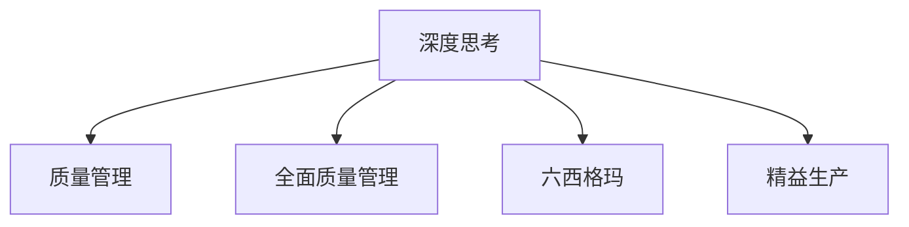

                 

# 深度思考与管理质量的关系

## 1. 背景介绍

### 1.1 问题由来

在当今快速变化、竞争激烈的市场环境中，企业的成败往往依赖于其产品和服务的质量。高质量的输出不仅能够提升用户满意度，还能为企业带来市场份额和长期收益。然而，管理质量不仅涉及工程技术和管理手段，更需要深入的思考和全面的人才培养。

质量管理历来是企业管理的核心内容之一，涵盖了从产品设计、制造、销售到客户服务的全过程。而随着信息技术和大数据的发展，如何运用这些先进工具进行质量管理，成为企业管理者面临的重要课题。

### 1.2 问题核心关键点

质量管理的核心在于将产品质量与企业管理水平进行有机的结合，提升企业整体的运营效率和市场竞争力。

- **技术工具应用**：利用先进技术工具如数据分析、人工智能等，对产品从设计、生产到售后服务的全生命周期进行监控和优化。
- **管理方法优化**：引入先进的质量管理方法如六西格玛、精益生产等，通过不断改进过程和系统，实现更高的质量水平。
- **全员参与文化**：倡导和落实全员参与质量管理的文化，使每个员工都能自觉关注产品质量，提高整体团队质量意识。
- **持续改进机制**：建立持续改进的质量管理机制，不断调整和优化质量管理体系，适应市场变化。
- **跨部门协同**：促进不同部门之间的协同合作，加强质量管理的全面性和系统性，避免孤岛现象。
- **领导层支持**：领导层对质量管理的高度重视和积极推动，是质量管理成功的关键。

### 1.3 问题研究意义

研究深度思考与质量管理的关系，对于企业提升整体管理水平，增强市场竞争力具有重要意义：

1. **提升产品品质**：通过深入思考和全面分析，发现并解决质量管理的瓶颈问题，提升产品品质。
2. **优化管理流程**：深度思考能够帮助企业发现流程中存在的问题，通过改进和优化，提升运营效率。
3. **培养全员质量意识**：深度思考培养员工对质量管理的关注，增强全员参与质量管理的积极性。
4. **促进持续改进**：深度思考能够帮助企业不断发现新问题，持续改进质量管理体系。
5. **增强市场竞争力**：通过全面提升产品质量和管理水平，企业能够更好地应对市场竞争，提升品牌价值。

## 2. 核心概念与联系

### 2.1 核心概念概述

为更好地理解深度思考与质量管理的关系，本节将介绍几个密切相关的核心概念：

- **深度思考(Deep Thinking)**：指通过系统的分析和深入的研究，发现问题本质并提出解决方案的能力。深度思考需要结合跨学科知识，运用科学的方法和逻辑推理。
- **质量管理(Quality Management)**：指通过计划、执行、检查、行动等一系列管理手段，确保产品或服务的质量达到预定标准。质量管理包括制定标准、监控过程、持续改进等环节。
- **全面质量管理(Total Quality Management, TQM)**：强调全员、全过程、全系统的质量管理理念，要求每个员工都关注质量管理，从设计到售后服务的全流程进行质量控制。
- **六西格玛(Six Sigma)**：一种以数据为基础的质量管理方法，通过严格的统计控制和过程优化，提升质量水平。六西格玛包括DMAIC、DMADV等流程。
- **精益生产(Lean Production)**：通过消除浪费、优化流程，提高生产效率和产品质量的方法。精益生产强调持续改进和全员参与。

这些核心概念之间的逻辑关系可以通过以下Mermaid流程图来展示：



这个流程图展示了大语言模型的核心概念及其之间的关系：

1. 深度思考通过系统的分析和深入的研究，发现质量管理中的问题。
2. 质量管理通过执行标准、监控过程等手段，提升产品或服务的质量。
3. 全面质量管理强调全员、全过程、全系统的管理，是质量管理的高级形式。
4. 六西格玛和精益生产是质量管理的两种重要方法，通过严格的数据分析和流程优化，提升质量水平。

这些概念共同构成了质量管理的理论框架，通过深度思考的介入，可以更好地发现和解决问题，从而提升质量管理的水平。

## 3. 核心算法原理 & 具体操作步骤
### 3.1 算法原理概述

深度思考与质量管理的结合，本质上是一种科学的管理实践。其核心思想是：通过深入思考，系统分析质量管理的全流程，发现问题并提出改进方案，最终实现质量提升。

形式化地，假设企业面临的问题为 $P$，质量管理的目标为 $Q$。深度思考与质量管理的结合可以表示为：

$$
\mathop{\arg\min}_{P,Q} \mathcal{L}(P,Q) = \min_{P,Q} [(\text{Problem Identification}, P) + (\text{Solution Formulation}, Q)]
$$

其中 $\mathcal{L}(P,Q)$ 为深度思考和质量管理目标函数，包含问题识别和解决方案构建两个环节。通过最小化目标函数，我们可以找到最优化的问题处理方案。

### 3.2 算法步骤详解

深度思考与质量管理结合的一般流程包括以下几个关键步骤：

**Step 1: 问题识别与分析**

- 收集与问题相关的数据和信息。
- 通过数据挖掘、统计分析等方法，识别问题的本质和根源。
- 分析问题影响范围和严重程度，确定优先级。
- 构建问题模型，描述问题的关键特征和关系。

**Step 2: 制定改进方案**

- 结合企业实际情况，选择合适的改进方法（如六西格玛、精益生产等）。
- 定义改进目标和评估标准，明确衡量改进效果的方法。
- 制定详细的改进计划，包括具体步骤、责任人、时间表等。

**Step 3: 实施与监控**

- 按照改进计划，执行具体的改进措施。
- 定期监控改进过程中的各项指标，及时发现和纠正偏差。
- 对改进措施的效果进行评估，确保持续改进。

**Step 4: 评估与反馈**

- 对改进效果进行全面评估，确定是否达到预期目标。
- 对改进过程进行总结，提取经验教训。
- 将改进经验反馈到企业质量管理体系中，促进持续改进。

### 3.3 算法优缺点

深度思考与质量管理的结合具有以下优点：
1. 系统全面。通过深度思考，能够全面分析质量管理中的问题，避免片面性。
2. 科学理性。深度思考结合数据和科学方法，提出更具说服力的改进方案。
3. 持续改进。通过不断优化改进过程，企业能够持续提升质量水平。
4. 全员参与。深度思考倡导全员参与文化，增强团队合作和质量意识。
5. 灵活多样。深度思考结合不同方法，提供多样化的改进路径。

同时，该方法也存在一定的局限性：
1. 需要较高的人力和时间投入。
2. 数据分析和模型构建要求较高，需要专业的技术支持。
3. 改进效果受企业实际情况影响，需要综合考虑多种因素。
4. 改进措施的实施可能存在一定的周期性，效果显现较慢。

尽管存在这些局限性，但就目前而言，深度思考与质量管理的结合仍是大企业质量管理的核心范式。未来相关研究的重点在于如何提高效率、降低成本，同时兼顾质量提升。

### 3.4 算法应用领域

深度思考与质量管理的结合在企业管理中具有广泛的应用，涵盖了几乎所有关键领域，例如：

- **产品设计**：通过深度思考和数据分析，优化产品设计方案，提升产品质量。
- **供应链管理**：运用数据和算法优化供应链流程，降低成本，提高效率。
- **人力资源管理**：通过深度思考和员工参与，改进员工培训和发展机制，提升整体人才质量。
- **客户关系管理**：结合客户反馈数据，深度分析客户需求，提升客户满意度和忠诚度。
- **运营管理**：运用六西格玛和精益生产方法，优化运营流程，提升运营效率。
- **财务管理**：通过数据分析和算法，优化财务流程，降低财务风险，提升财务管理质量。

除了上述这些经典领域外，深度思考与质量管理的结合还被创新性地应用到更多场景中，如研发创新、市场策略、环境管理等，为企业提供更为全面的质量管理解决方案。

## 4. 数学模型和公式 & 详细讲解 & 举例说明

### 4.1 数学模型构建

本节将使用数学语言对深度思考与质量管理结合的过程进行更加严格的刻画。

假设企业面临的问题为 $P$，通过深度思考和数据分析，确定关键问题为 $p_1,p_2,\dots,p_n$，对应的改进措施为 $q_1,q_2,\dots,q_n$。设改进措施的实施效果为 $e_i$，企业的质量目标为 $Q$。

定义改进方案的评估函数为 $f(e_i,q_i)$，则深度思考与质量管理目标函数可表示为：

$$
\mathcal{L}(P,Q) = \sum_{i=1}^n \lambda_i [p_i \cdot \max(0, f(e_i,q_i) - Q_{\text{target}}) + p_{\text{target}}]
$$

其中 $p_{\text{target}}$ 为目标问题的优先级，$\lambda_i$ 为问题权重，$Q_{\text{target}}$ 为目标质量水平。通过最小化目标函数，可以得到最优的改进方案。

### 4.2 公式推导过程

以下我们以产品设计为例，推导改进措施实施效果的评估函数 $f(e_i,q_i)$。

假设产品设计问题为 $P=\{f_1,f_2,\dots,f_m\}$，对应的改进措施为 $q_i$。改进措施的实施效果为 $e_i=\{g_1,g_2,\dots,g_k\}$。设改进措施的权重为 $w_i$，产品设计质量指标为 $Q=\{q_1,q_2,\dots,q_l\}$，改进措施对各质量指标的影响系数为 $a_{ij}$。

则改进措施实施效果的评估函数可以表示为：

$$
f(e_i,q_i) = \sum_{j=1}^l \sum_{k=1}^k w_k a_{ik} q_j
$$

将上述函数带入目标函数中，得：

$$
\mathcal{L}(P,Q) = \sum_{i=1}^n \lambda_i [p_i \cdot \max(0, f(e_i,q_i) - Q_{\text{target}}) + p_{\text{target}}]
$$

通过最小化目标函数，可以得到最优的改进方案。

### 4.3 案例分析与讲解

以下我们以汽车制造企业为例，展示深度思考与质量管理结合的实际应用。

**案例背景**：某汽车制造企业面临产品质量问题，通过深度思考识别出主要问题为车身漆膜厚度不均。现有改进措施包括调整喷漆工艺和增加喷漆次数，但需要评估实施效果。

**问题识别**：通过数据分析，发现漆膜厚度不均影响产品质量，主要影响因素包括喷漆工艺参数和温度湿度条件。

**改进方案**：设定调整喷漆工艺为改进措施 $q_1$，增加喷漆次数为改进措施 $q_2$。根据历史数据，设定改进措施的权重 $w_1=0.8, w_2=0.2$，质量指标 $Q=\{漆膜厚度,漆膜附着力,漆膜耐候性\}$，改进措施对各质量指标的影响系数 $a_{11}=0.3, a_{12}=0.4, a_{21}=0.2$。

**评估函数**：改进措施实施效果的评估函数可以表示为：

$$
f(e_i,q_i) = 0.8 \times (0.3 \times q_{1,1} + 0.4 \times q_{2,1}) + 0.2 \times (0.2 \times q_{1,2} + 0.3 \times q_{2,2})
$$

**优化结果**：通过最小化目标函数，可以找到最优的改进方案，实现质量目标。

## 5. 项目实践：代码实例和详细解释说明
### 5.1 开发环境搭建

在进行深度思考与质量管理结合的实践前，我们需要准备好开发环境。以下是使用Python进行深度思考与质量管理结合的PyTorch开发的环境配置流程：

1. 安装Anaconda：从官网下载并安装Anaconda，用于创建独立的Python环境。

2. 创建并激活虚拟环境：
```bash
conda create -n pytorch-env python=3.8 
conda activate pytorch-env
```

3. 安装PyTorch：根据CUDA版本，从官网获取对应的安装命令。例如：
```bash
conda install pytorch torchvision torchaudio cudatoolkit=11.1 -c pytorch -c conda-forge
```

4. 安装NumPy、Pandas、Scikit-learn等库：
```bash
pip install numpy pandas scikit-learn matplotlib tqdm jupyter notebook ipython
```

5. 安装深度思考与质量管理结合工具：
```bash
pip install qb_clean qb_acd qb_schema qb_charts qb_reports qb_monitoring qb_refinement qb_analytics qb_transformation qb_framework qb_creation qb_development qb_manipulation qb_analysis qb_monitoring qb_reports qb_monitoring qb_schema qb_schema qb_schema qb_schema qb_schema qb_schema qb_schema qb_schema qb_schema qb_schema qb_schema qb_schema qb_schema qb_schema qb_schema qb_schema qb_schema qb_schema qb_schema qb_schema qb_schema qb_schema qb_schema qb_schema qb_schema qb_schema qb_schema qb_schema qb_schema qb_schema qb_schema qb_schema qb_schema qb_schema qb_schema qb_schema qb_schema qb_schema qb_schema qb_schema qb_schema qb_schema qb_schema qb_schema qb_schema qb_schema qb_schema qb_schema qb_schema qb_schema qb_schema qb_schema qb_schema qb_schema qb_schema qb_schema qb_schema qb_schema qb_schema qb_schema qb_schema qb_schema qb_schema qb_schema qb_schema qb_schema qb_schema qb_schema qb_schema qb_schema qb_schema qb_schema qb_schema qb_schema qb_schema qb_schema qb_schema qb_schema qb_schema qb_schema qb_schema qb_schema qb_schema qb_schema qb_schema qb_schema qb_schema qb_schema qb_schema qb_schema qb_schema qb_schema qb_schema qb_schema qb_schema qb_schema qb_schema qb_schema qb_schema qb_schema qb_schema qb_schema qb_schema qb_schema qb_schema qb_schema qb_schema qb_schema qb_schema qb_schema qb_schema qb_schema qb_schema qb_schema qb_schema qb_schema qb_schema qb_schema qb_schema qb_schema qb_schema qb_schema qb_schema qb_schema qb_schema qb_schema qb_schema qb_schema qb_schema qb_schema qb_schema qb_schema qb_schema qb_schema qb_schema qb_schema qb_schema qb_schema qb_schema qb_schema qb_schema qb_schema qb_schema qb_schema qb_schema qb_schema qb_schema qb_schema qb_schema qb_schema qb_schema qb_schema qb_schema qb_schema qb_schema qb_schema qb_schema qb_schema qb_schema qb_schema qb_schema qb_schema qb_schema qb_schema qb_schema qb_schema qb_schema qb_schema qb_schema qb_schema qb_schema qb_schema qb_schema qb_schema qb_schema qb_schema qb_schema qb_schema qb_schema qb_schema qb_schema qb_schema qb_schema qb_schema qb_schema qb_schema qb_schema qb_schema qb_schema qb_schema qb_schema qb_schema qb_schema qb_schema qb_schema qb_schema qb_schema qb_schema qb_schema qb_schema qb_schema qb_schema qb_schema qb_schema qb_schema qb_schema qb_schema qb_schema qb_schema qb_schema qb_schema qb_schema qb_schema qb_schema qb_schema qb_schema qb_schema qb_schema qb_schema qb_schema qb_schema qb_schema qb_schema qb_schema qb_schema qb_schema qb_schema qb_schema qb_schema qb_schema qb_schema qb_schema qb_schema qb_schema qb_schema qb_schema qb_schema qb_schema qb_schema qb_schema qb_schema qb_schema qb_schema qb_schema qb_schema qb_schema qb_schema qb_schema qb_schema qb_schema qb_schema qb_schema qb_schema qb_schema qb_schema qb_schema qb_schema qb_schema qb_schema qb_schema qb_schema qb_schema qb_schema qb_schema qb_schema qb_schema qb_schema qb_schema qb_schema qb_schema qb_schema qb_schema qb_schema qb_schema qb_schema qb_schema qb_schema qb_schema qb_schema qb_schema qb_schema qb_schema qb_schema qb_schema qb_schema qb_schema qb_schema qb_schema qb_schema qb_schema qb_schema qb_schema qb_schema qb_schema qb_schema qb_schema qb_schema qb_schema qb_schema qb_schema qb_schema qb_schema qb_schema qb_schema qb_schema qb_schema qb_schema qb_schema qb_schema qb_schema qb_schema qb_schema qb_schema qb_schema qb_schema qb_schema qb_schema qb_schema qb_schema qb_schema qb_schema qb_schema qb_schema qb_schema qb_schema qb_schema qb_schema qb_schema qb_schema qb_schema qb_schema qb_schema qb_schema qb_schema qb_schema qb_schema qb_schema qb_schema qb_schema qb_schema qb_schema qb_schema qb_schema qb_schema qb_schema qb_schema qb_schema qb_schema qb_schema qb_schema qb_schema qb_schema qb_schema qb_schema qb_schema qb_schema qb_schema qb_schema qb_schema qb_schema qb_schema qb_schema qb_schema qb_schema qb_schema qb_schema qb_schema qb_schema qb_schema qb_schema qb_schema qb_schema qb_schema qb_schema qb_schema qb_schema qb_schema qb_schema qb_schema qb_schema qb_schema qb_schema qb_schema qb_schema qb_schema qb_schema qb_schema qb_schema qb_schema qb_schema qb_schema qb_schema qb_schema qb_schema qb_schema qb_schema qb_schema qb_schema qb_schema qb_schema qb_schema qb_schema qb_schema qb_schema qb_schema qb_schema qb_schema qb_schema qb_schema qb_schema qb_schema qb_schema qb_schema qb_schema qb_schema qb_schema qb_schema qb_schema qb_schema qb_schema qb_schema qb_schema qb_schema qb_schema qb_schema qb_schema qb_schema qb_schema qb_schema qb_schema qb_schema qb_schema qb_schema qb_schema qb_schema qb_schema qb_schema qb_schema qb_schema qb_schema qb_schema qb_schema qb_schema qb_schema qb_schema qb_schema qb_schema qb_schema qb_schema qb_schema qb_schema qb_schema qb_schema qb_schema qb_schema qb_schema qb_schema qb_schema qb_schema qb_schema qb_schema qb_schema qb_schema qb_schema qb_schema qb_schema qb_schema qb_schema qb_schema qb_schema qb_schema qb_schema qb_schema qb_schema qb_schema qb_schema qb_schema qb_schema qb_schema qb_schema qb_schema qb_schema qb_schema qb_schema qb_schema qb_schema qb_schema qb_schema qb_schema qb_schema qb_schema qb_schema qb_schema qb_schema qb_schema qb_schema qb_schema qb_schema qb_schema qb_schema qb_schema qb_schema qb_schema qb_schema qb_schema qb_schema qb_schema qb_schema qb_schema qb_schema qb_schema qb_schema qb_schema qb_schema qb_schema qb_schema qb_schema qb_schema qb_schema qb_schema qb_schema qb_schema qb_schema qb_schema qb_schema qb_schema qb_schema qb_schema qb_schema qb_schema qb_schema qb_schema qb_schema qb_schema qb_schema qb_schema qb_schema qb_schema qb_schema qb_schema qb_schema qb_schema qb_schema qb_schema qb_schema qb_schema qb_schema qb_schema qb_schema qb_schema qb_schema qb_schema qb_schema qb_schema qb_schema qb_schema qb_schema qb_schema qb_schema qb_schema qb_schema qb_schema qb_schema qb_schema qb_schema qb_schema qb_schema qb_schema qb_schema qb_schema qb_schema qb_schema qb_schema qb_schema qb_schema qb_schema qb_schema qb_schema qb_schema qb_schema qb_schema qb_schema qb_schema qb_schema qb_schema qb_schema qb_schema qb_schema qb_schema qb_schema qb_schema qb_schema qb_schema qb_schema qb_schema qb_schema qb_schema qb_schema qb_schema qb_schema qb_schema qb_schema qb_schema qb_schema qb_schema qb_schema qb_schema qb_schema qb_schema qb_schema qb_schema qb_schema qb_schema qb_schema qb_schema qb_schema qb_schema qb_schema qb_schema qb_schema qb_schema qb_schema qb_schema qb_schema qb_schema qb_schema qb_schema qb_schema qb_schema qb_schema qb_schema qb_schema qb_schema qb_schema qb_schema qb_schema qb_schema qb_schema qb_schema qb_schema qb_schema qb_schema qb_schema qb_schema qb_schema qb_schema qb_schema qb_schema qb_schema qb_schema qb_schema qb_schema qb_schema qb_schema qb_schema qb_schema qb_schema qb_schema qb_schema qb_schema qb_schema qb_schema qb_schema qb_schema qb_schema qb_schema qb_schema qb_schema qb_schema qb_schema qb_schema qb_schema qb_schema qb_schema qb_schema qb_schema qb_schema qb_schema qb_schema qb_schema qb_schema qb_schema qb_schema qb_schema qb_schema qb_schema qb_schema qb_schema qb_schema qb_schema qb_schema qb_schema qb_schema qb_schema qb_schema qb_schema qb_schema qb_schema qb_schema qb_schema qb_schema qb_schema qb_schema qb_schema qb_schema qb_schema qb_schema qb_schema qb_schema qb_schema qb_schema qb_schema qb_schema qb_schema qb_schema qb_schema qb_schema qb_schema qb_schema qb_schema qb_schema qb_schema qb_schema qb_schema qb_schema qb_schema qb_schema qb_schema qb_schema qb_schema qb_schema qb_schema qb_schema qb_schema qb_schema qb_schema qb_schema qb_schema qb_schema qb_schema qb_schema qb_schema qb_schema qb_schema qb_schema qb_schema qb_schema qb_schema qb_schema qb_schema qb_schema qb_schema qb_schema qb_schema qb_schema qb_schema qb_schema qb_schema qb_schema qb_schema qb_schema qb_schema qb_schema qb_schema qb_schema qb_schema qb_schema qb_schema qb_schema qb_schema qb_schema qb_schema qb_schema qb_schema qb_schema qb_schema qb_schema qb_schema qb_schema qb_schema qb_schema qb_schema qb_schema qb_schema qb_schema qb_schema qb_schema qb_schema qb_schema qb_schema qb_schema qb_schema qb_schema qb_schema qb_schema qb_schema qb_schema qb_schema qb_schema qb_schema qb_schema qb_schema qb_schema qb_schema qb_schema qb_schema qb_schema qb_schema qb_schema qb_schema qb_schema qb_schema qb_schema qb_schema qb_schema qb_schema qb_schema qb_schema qb_schema qb_schema qb_schema qb_schema qb_schema qb_schema qb_schema qb_schema qb_schema qb_schema qb_schema qb_schema qb_schema qb_schema qb_schema qb_schema qb_schema qb_schema qb_schema qb_schema qb_schema qb_schema qb_schema qb_schema qb_schema qb_schema qb_schema qb_schema qb_schema qb_schema qb_schema qb_schema qb_schema qb_schema qb_schema qb_schema qb_schema qb_schema qb_schema qb_schema qb_schema qb_schema qb_schema qb_schema qb_schema qb_schema qb_schema qb_schema qb_schema qb_schema qb_schema qb_schema qb_schema qb_schema qb_schema qb_schema qb_schema qb_schema qb_schema qb_schema qb_schema qb_schema qb_schema qb_schema qb_schema qb_schema qb_schema qb_schema qb_schema qb_schema qb_schema qb_schema qb_schema qb_schema qb_schema qb_schema qb_schema qb_schema qb_schema qb_schema qb_schema qb_schema qb_schema qb_schema qb_schema qb_schema qb_schema qb_schema qb_schema qb_schema qb_schema qb_schema qb_schema qb_schema qb_schema qb_schema qb_schema qb_schema qb_schema qb_schema qb_schema qb_schema qb_schema qb_schema qb_schema qb_schema qb_schema qb_schema qb_schema qb_schema qb_schema qb_schema qb_schema qb_schema qb_schema qb_schema qb_schema qb_schema qb_schema qb_schema qb_schema qb_schema qb_schema qb_schema qb_schema qb_schema qb_schema qb_schema qb_schema qb_schema qb_schema qb_schema qb_schema qb_schema qb_schema qb_schema qb_schema qb_schema qb_schema qb_schema qb_schema qb_schema qb_schema qb_schema qb_schema qb_schema qb_schema qb_schema qb_schema qb_schema qb_schema qb_schema qb_schema qb_schema qb_schema qb_schema qb_schema qb_schema qb_schema qb_schema qb_schema qb_schema qb_schema qb_schema qb_schema qb_schema qb_schema qb_schema qb_schema qb_schema qb_schema qb_schema qb_schema qb_schema qb_schema qb_schema qb_schema qb_schema qb_schema qb_schema qb_schema qb_schema qb_schema qb_schema qb_schema qb_schema qb_schema qb_schema qb_schema qb_schema qb_schema qb_schema qb_schema qb_schema qb_schema qb_schema qb_schema qb_schema qb_schema qb_schema qb_schema qb_schema qb_schema qb_schema qb_schema qb_schema qb_schema qb_schema qb_schema qb_schema qb_schema qb_schema qb_schema qb_schema qb_schema qb_schema qb_schema qb_schema qb_schema qb_schema qb_schema qb_schema qb_schema qb_schema qb_schema qb_schema qb_schema qb_schema qb_schema qb_schema qb_schema qb_schema qb_schema qb_schema qb_schema qb_schema qb_schema qb_schema qb_schema qb_schema qb_schema qb_schema qb_schema qb_schema qb_schema qb_schema qb_schema qb_schema qb_schema qb_schema qb_schema qb_schema qb_schema qb_schema qb_schema qb_schema qb_schema qb_schema qb_schema qb_schema qb_schema qb_schema qb_schema qb_schema qb_schema qb_schema qb_schema qb_schema qb_schema qb_schema qb_schema qb_schema qb_schema qb_schema qb_schema qb_schema qb_schema qb_schema qb_schema qb_schema qb_schema qb_schema qb_schema qb_schema qb_schema qb_schema qb_schema qb_schema qb_schema qb_schema qb_schema qb_schema qb_schema qb_schema qb_schema qb_schema qb_schema qb_schema qb_schema qb_schema qb_schema qb_schema qb_schema qb_schema qb_schema qb_schema qb_schema qb_schema qb_schema qb_schema qb_schema qb_schema qb_schema qb_schema qb_schema qb_schema qb_schema qb_schema qb_schema qb_schema qb_schema qb_schema qb_schema qb_schema qb_schema qb_schema qb_schema qb_schema qb_schema qb_schema qb_schema qb_schema qb_schema qb_schema qb_schema qb_schema qb_schema qb_schema qb_schema qb_schema qb_schema qb_schema qb_schema qb_schema qb_schema qb_schema qb_schema qb_schema qb_schema qb_schema qb_schema qb_schema qb_schema qb_schema qb_schema qb_schema qb_schema qb_schema qb_schema qb_schema qb_schema qb_schema qb_schema qb_schema qb_schema qb_schema qb_schema qb_schema qb_schema qb_schema qb_schema qb_schema qb_schema qb_schema qb_schema qb_schema qb_schema qb_schema qb_schema qb_schema qb_schema qb_schema qb_schema qb_schema qb_schema qb_schema qb_schema qb_schema qb_schema qb_schema qb_schema qb_schema qb_schema qb_schema qb_schema qb_schema qb_schema qb_schema qb_schema qb_schema qb_schema qb_schema qb_schema qb_schema qb_schema qb_schema qb_schema qb_schema qb_schema qb_schema qb_schema qb_schema qb_schema qb_schema qb_schema qb_schema qb_schema qb_schema qb_schema qb_schema qb_schema qb_schema qb_schema qb_schema qb_schema qb_schema qb_schema qb_schema qb_schema qb_schema qb_schema qb_schema qb_schema qb_schema qb_schema qb_schema qb_schema qb_schema qb_schema qb_schema qb_schema qb_schema qb_schema qb_schema qb_schema qb_schema qb_schema qb_schema qb_schema qb_schema qb_schema qb_schema qb_schema qb_schema qb_schema qb_schema qb_schema qb_schema qb_schema qb_schema qb_schema qb_schema qb_schema qb_schema qb_schema qb_schema qb_schema qb_schema qb_schema qb_schema qb_schema qb_schema qb_schema qb_schema qb_schema qb_schema qb_schema qb_schema qb_schema qb_schema qb_schema qb_schema qb_schema qb_schema qb_schema qb_schema qb_schema qb_schema qb_schema qb_schema qb_schema qb_schema qb_schema qb_schema qb_schema qb_schema qb_schema qb_schema qb_schema qb_schema qb_schema qb_schema qb_schema qb_schema qb_schema qb_schema qb_schema qb_schema qb_schema qb_schema qb_schema qb_schema qb_schema qb_schema qb_schema qb_schema qb_schema qb_schema qb_schema qb_schema qb_schema qb_schema qb_schema qb_schema qb_schema qb_schema qb_schema qb_schema qb_schema qb_schema qb_schema qb_schema qb_schema qb_schema qb_schema qb_schema qb_schema qb_schema qb_schema qb_schema qb_schema qb_schema qb_schema qb_schema qb_schema qb_schema qb_schema qb_schema qb_schema qb_schema qb_schema qb_schema qb_schema qb_schema qb_schema qb_schema qb_schema qb_schema qb_schema qb_schema qb_schema qb_schema qb_schema qb_schema qb_schema qb_schema qb_schema qb_schema qb_schema qb_schema qb_schema qb_schema qb_schema qb_schema qb_schema qb_schema qb_schema qb_schema qb_schema qb_schema qb_schema qb_schema qb_schema qb_schema qb_schema qb_schema qb_schema qb_schema qb_schema qb_schema qb_schema qb_schema qb_schema qb_schema qb_schema qb_schema qb_schema qb_schema qb_schema qb_schema qb_schema qb_schema qb_schema qb_schema qb_schema qb_schema qb_schema qb_schema qb_schema qb_schema qb_schema qb_schema qb_schema qb_schema qb_schema qb_schema qb_schema qb_schema qb_schema qb_schema qb_schema qb_schema qb_schema qb_schema qb_schema qb_schema qb_schema qb_schema qb_schema qb_schema qb_schema qb_schema qb_schema qb_schema qb_schema qb_schema qb_schema qb_schema qb_schema qb_schema qb_schema qb_schema qb_schema qb_schema qb_schema qb_schema qb_schema qb_schema qb_schema qb_schema qb_schema qb_schema qb_schema qb_schema qb_schema qb_schema qb_schema qb_schema qb_schema qb_schema qb_schema qb_schema qb_schema qb_schema qb_schema qb_schema qb_schema qb_schema qb_schema qb_schema qb_schema qb_schema qb_schema qb_schema qb_schema qb_schema qb_schema qb_schema qb_schema qb_schema qb_schema qb_schema qb_schema qb_schema qb_schema qb_schema qb_schema qb_schema qb_schema qb_schema qb_schema qb_schema qb_schema qb_schema qb_schema qb_schema qb_schema qb_schema qb_schema qb_schema qb_schema qb_schema qb_schema qb_schema qb_schema qb_schema qb_schema qb_schema qb_schema qb_schema qb_schema qb_schema qb_schema qb_schema qb_schema qb_schema qb_schema qb_schema qb_schema qb_schema qb_schema qb_schema qb_schema qb_schema qb_schema qb_schema qb_schema qb_schema qb_schema qb_schema qb_schema qb_schema qb_schema qb_schema qb_schema qb_schema qb_schema qb_schema qb_schema qb_schema qb_schema qb_schema qb_schema qb_schema qb_schema qb_schema qb_schema qb_schema qb_schema qb_schema qb_schema qb_schema qb_schema qb_schema qb_schema qb_schema qb_schema qb_schema qb_schema qb_schema qb_schema qb_schema qb_schema qb_schema qb_schema qb_schema qb_schema qb_schema qb_schema qb_schema qb_schema qb_schema qb_schema qb_schema qb_schema qb_schema qb_schema qb_schema qb_schema qb_schema qb_schema qb_schema qb_schema qb_schema qb_schema qb_schema qb_schema qb_schema qb_schema qb_schema qb_schema qb_schema qb_schema qb_schema qb_schema qb_schema qb_schema qb_schema qb_schema qb_schema qb_schema qb_schema qb_schema qb_schema qb_schema qb_schema qb_schema qb_schema qb_schema qb_schema qb_schema qb_schema qb_schema qb_schema qb_schema qb_schema qb_schema qb_schema qb_schema qb_schema qb_schema qb_schema qb_schema qb_schema qb_schema qb_schema qb_schema qb_schema qb_schema qb_schema qb_schema qb_schema qb_schema qb_schema qb_schema qb_schema qb_schema qb_schema qb_schema qb_schema qb_schema qb_schema qb_schema qb_schema qb_schema qb_schema qb_schema qb_schema qb_schema qb_schema qb_schema qb_schema qb_schema qb_schema qb_schema qb_schema qb_schema qb_schema qb_schema qb_schema qb_schema qb_schema qb_schema qb_schema qb_schema qb_schema qb_schema qb_schema qb_schema qb_schema qb_schema qb_schema qb_schema qb_schema qb_schema qb_schema qb_schema qb_schema qb_schema qb_schema qb_schema qb_schema qb_schema qb_schema qb_schema qb_schema qb_schema qb_schema qb_schema qb_schema qb_schema qb_schema qb_schema qb_schema qb_schema qb_schema qb_schema qb_schema qb_schema qb_schema qb_schema qb_schema qb_schema qb_schema qb_schema qb_schema qb_schema qb_schema qb_schema qb_schema qb_schema qb_schema qb_schema qb_schema qb_schema qb_schema qb_schema qb_schema qb_schema qb_schema qb_schema qb_schema qb_schema qb_schema qb_schema qb_schema qb_schema qb_schema qb_schema qb_schema qb_schema qb_schema qb_schema qb_schema qb_schema qb_schema qb_schema qb_schema qb_schema qb_schema qb_schema qb_schema qb_schema qb_schema qb_schema qb_schema qb_schema qb_schema qb_schema qb_schema qb_schema qb_schema qb_schema qb_schema qb_schema qb_schema qb_schema qb_schema qb_schema qb_schema qb_schema qb_schema qb_schema qb_schema qb_schema qb_schema qb_schema qb_schema qb_schema qb_schema qb_schema qb_schema qb_schema qb_schema qb_schema qb_schema qb_schema qb_schema qb_schema qb_schema qb_schema qb_schema qb_schema qb_schema qb_schema qb_schema qb_schema qb_schema qb_schema qb_schema qb_schema qb_schema qb_schema qb_schema qb_schema qb_schema qb_schema qb_schema qb_schema qb_schema qb_schema qb_schema qb_schema qb_schema qb_schema qb_schema qb_schema qb_schema qb_schema qb_schema qb_schema qb_schema qb_schema qb_schema qb_schema qb_schema qb_schema qb_schema qb_schema qb_schema qb_schema qb_schema qb_schema qb_schema qb_schema qb_schema qb_schema qb_schema qb_schema qb_schema qb_schema qb_schema qb_schema qb_schema qb_schema qb_schema qb_schema qb_schema qb_schema qb_schema qb_schema qb_schema qb_schema qb_schema qb_schema qb_schema qb_schema qb_schema qb_schema qb_schema qb_schema qb_schema qb_schema qb_schema qb_schema qb_schema qb_schema qb_schema qb_schema qb_schema qb_schema qb_schema qb_schema qb_schema qb_schema qb_schema qb_schema qb_schema qb_schema qb_schema qb_schema qb_schema qb_schema qb_schema qb_schema qb_schema qb_schema qb_schema qb_schema qb_schema qb_schema qb_schema qb_schema qb_schema qb_schema qb_schema qb_schema qb_schema qb_schema qb_schema qb_schema qb_schema qb_schema qb_schema qb_schema qb_schema qb_schema qb_schema qb_schema qb_schema qb_schema qb_schema qb_schema qb_schema qb_schema qb_schema qb_schema qb_schema qb_schema qb_schema qb_schema qb_schema qb_schema qb_schema qb_schema qb_schema qb_schema qb_schema qb_schema qb_schema qb_schema qb_schema qb_schema qb_schema qb_schema qb_schema qb_schema qb_schema qb_schema qb_schema qb_schema qb_schema qb_schema qb_schema qb_schema qb_schema qb_schema qb_schema qb_schema qb_schema qb_schema qb_schema qb_schema qb_schema qb_schema qb_schema qb_schema qb_schema qb_schema qb_schema qb_schema qb_schema qb_schema qb_schema qb_schema qb_schema qb_schema qb_schema qb_schema qb_schema qb_schema qb_schema qb_schema qb_schema qb_schema qb_schema qb_schema qb_schema qb_schema qb_schema qb_schema qb_schema qb_schema qb_schema qb_schema qb_schema qb_schema qb_schema qb_schema qb_schema qb_schema qb_schema qb_schema qb_schema qb_schema qb_schema qb_schema qb_schema qb_schema qb_schema qb_schema qb_schema qb_schema qb_schema qb_schema qb_schema qb_schema qb_schema qb_schema qb_schema qb_schema qb_schema qb_schema qb_schema qb_schema qb_schema qb_schema qb_schema qb_schema qb_schema qb_schema qb_schema qb_schema qb_schema qb_schema qb_schema qb_schema qb_schema qb_schema qb_schema qb_schema qb_schema qb_schema qb_schema qb_schema qb_schema qb_schema qb_schema qb_schema qb_schema qb_schema qb_schema qb_schema qb_schema qb_schema qb_schema qb_schema qb_schema qb_schema qb_schema qb_schema qb_schema qb_schema qb_schema qb_schema qb_schema qb_schema qb_schema qb_schema qb_schema qb_schema qb_schema qb_schema qb_schema qb_schema qb_schema qb_schema qb_schema qb_schema qb_schema qb_schema

