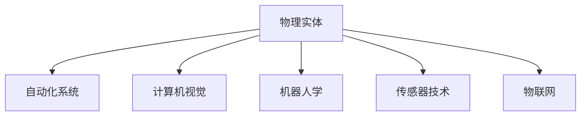

                 

# 物理实体自动化的最新应用与发展

## 1. 背景介绍

### 1.1 问题由来

随着工业自动化和机器人技术的发展，物理实体的自动化应用逐渐成为各行各业提升效率和降低成本的重要方向。物理实体包括各种机械设备、移动物体和仓储物品等，其自动化应用涉及物流、制造、仓储、智能家居等多个领域。自动化技术通过传感器、机器人等设备，实现对物理实体的智能监控、控制和操作，极大地提高了生产效率和自动化水平。

### 1.2 问题核心关键点

物理实体的自动化涉及多种技术和方法，如计算机视觉、机器人学、传感器技术、物联网等。目前，最前沿的技术包括智能传感器、自主导航机器人、自动化仓储系统、智能家居等。这些技术的应用，使得物理实体能够自主地感知、决策和执行，从而实现全生命周期的自动化。

### 1.3 问题研究意义

物理实体的自动化对于推动工业4.0的发展具有重要意义。它不仅能够提升生产效率和产品质量，还能降低人力成本，提升生产线的柔性和灵活性。此外，自动化技术的应用还能促进产业转型升级，推动智能制造、智慧城市等新经济形态的发展。

## 2. 核心概念与联系

### 2.1 核心概念概述

为更好地理解物理实体自动化的最新应用与发展，本节将介绍几个密切相关的核心概念：

- 物理实体（Physical Entities）：指任何可以进行自动感知、决策和执行的物理物体，如机器人、自动化生产线上的设备、智能家居系统等。
- 自动化系统（Autonomous Systems）：指能够自主感知环境、自主决策并执行任务的智能系统，包括自主导航机器人、智能仓储系统等。
- 计算机视觉（Computer Vision）：指通过计算机技术处理和理解图像、视频等视觉信息的技术，用于物理实体的感知和识别。
- 机器人学（Robotics）：研究机器人和自动化系统的设计与应用的学科，涵盖感知、决策、执行等多个方面。
- 传感器技术（Sensor Technology）：指用于感知物理世界（如温度、湿度、位置、速度等）的电子器件，是物理实体自动化的基础。
- 物联网（Internet of Things, IoT）：将物理实体和互联网连接起来的系统，实现对物理实体的远程监控和控制。

这些核心概念之间的逻辑关系可以通过以下Mermaid流程图来展示：



这个流程图展示了几大核心概念之间的相互关系：

1. 物理实体是自动化系统的执行对象。
2. 计算机视觉、机器人学、传感器技术和物联网等技术是实现物理实体自动化的关键支撑。

## 3. 核心算法原理 & 具体操作步骤
### 3.1 算法原理概述

物理实体自动化的核心算法原理包括以下几个方面：

- **计算机视觉**：用于物理实体的感知和识别。通过摄像头、激光雷达等传感器捕捉环境信息，再利用深度学习、特征提取等方法对信息进行处理和理解。
- **机器人学**：用于物理实体的决策和执行。通过路径规划、动作控制等算法，使机器人能够在复杂环境中自主导航和操作。
- **传感器技术**：用于物理实体的感知和状态监测。通过多种传感器获取物理实体的状态信息，如位置、速度、温度等。
- **物联网**：用于物理实体的远程监控和控制。通过网络通信技术将物理实体连接到互联网，实现远程管理和控制。

物理实体的自动化系统一般包括以下几个关键组件：

- **传感器层**：用于感知物理实体的环境信息和状态。
- **决策层**：用于处理传感器数据，做出决策并进行路径规划。
- **执行层**：用于执行决策，控制物理实体的运动和操作。
- **通信层**：用于连接传感器层、决策层和执行层，并实现与外部环境的交互。

### 3.2 算法步骤详解

物理实体自动化的核心算法步骤如下：

**Step 1: 环境感知**

- 通过摄像头、激光雷达等传感器，捕捉物理实体的周围环境信息，如深度图、点云等。
- 利用计算机视觉算法（如CNN、RNN等），对环境信息进行处理和分析，提取关键特征。
- 通过传感器技术获取物理实体的状态信息，如位置、速度、温度等。

**Step 2: 路径规划**

- 根据环境信息、物理实体的目标位置和当前状态，设计路径规划算法，如A*算法、D*算法等。
- 通过决策层对路径进行优化，确保路径的可行性和最优性。

**Step 3: 动作执行**

- 通过执行层控制物理实体的运动和操作，如移动、抓取、释放等。
- 在执行过程中，持续监测环境信息和物理实体的状态，调整动作策略，确保执行任务的准确性和可靠性。

**Step 4: 远程控制与通信**

- 通过物联网技术，将物理实体的状态信息和操作指令上传到云端服务器，实现远程监控和控制。
- 云端服务器通过网络通信技术，将控制指令下发到物理实体，实现实时交互。

### 3.3 算法优缺点

物理实体自动化的算法具有以下优点：

- 自动化程度高：通过算法实现物理实体的自主感知、决策和执行，提高了自动化水平。
- 效率高：自动化系统能够快速响应环境变化，提高了生产效率和响应速度。
- 可靠性高：算法通过精确的计算和控制，提高了系统的稳定性和可靠性。

同时，这些算法也存在一些缺点：

- 依赖传感器和通信设备：算法需要依赖各种传感器和通信设备，成本较高。
- 环境适应性差：算法对复杂环境的适应能力有限，尤其在强噪声、光照不足等恶劣环境下。
- 计算资源需求高：算法通常需要较大的计算资源，特别是在实时性和精度要求较高的情况下。

### 3.4 算法应用领域

物理实体的自动化技术广泛应用于以下几个领域：

- **智能仓储系统**：通过自动化仓储系统，实现仓库货物的自动化搬运、存储和检索。
- **自动化生产线**：在生产线上应用自动化技术，实现产品的自动装配、检测和包装。
- **智能家居系统**：通过智能家居系统，实现家居设备的自动化控制和操作，如智能灯光、温度控制等。
- **物流配送**：在物流配送环节，通过自动化系统实现货物的自动化搬运和配送。
- **无人驾驶**：在无人驾驶领域，利用计算机视觉和机器人学技术，实现车辆的自主导航和决策。

## 4. 数学模型和公式 & 详细讲解  
### 4.1 数学模型构建

物理实体自动化的数学模型主要包括以下几个方面：

- **计算机视觉模型**：用于感知环境信息，提取关键特征。
- **路径规划模型**：用于规划物理实体的移动路径。
- **动作控制模型**：用于控制物理实体的运动和操作。
- **通信模型**：用于实现物理实体与云端服务器之间的数据传输和控制。

### 4.2 公式推导过程

以下我们将以智能仓储系统为例，推导路径规划模型的核心公式。

假设物理实体从起始点 $(x_s, y_s)$ 移动到目标点 $(x_t, y_t)$，路径规划的目标是找到一条最短路径。可以使用A*算法进行路径规划。A*算法的基本思想是通过搜索路径的优先级（即代价）来逐步扩展路径，最终找到最短路径。

A*算法的代价函数 $f(n)$ 由两部分组成：从起点到当前节点 $n$ 的实际代价 $g(n)$ 和从当前节点 $n$ 到目标节点的预计代价 $h(n)$。代价函数可以表示为：

$$
f(n) = g(n) + h(n)
$$

其中，$g(n)$ 表示从起点到节点 $n$ 的实际代价，即路径长度，可以表示为：

$$
g(n) = \sum_{i=1}^{n} d(i)
$$

其中，$d(i)$ 表示从节点 $i-1$ 到节点 $i$ 的代价，通常可以表示为两个节点之间的欧式距离或曼哈顿距离。

$h(n)$ 表示从节点 $n$ 到目标节点的预计代价，即启发式函数。启发式函数可以通过多种方式实现，如欧拉图算法、曼哈顿距离等。

在实际应用中，A*算法可以表示为伪代码如下：

```
OPEN = empty set
CLOSED = empty set
g_score = {}
f_score = {}
g_score[start] = 0
f_score[start] = heuristic(start, goal)
OPEN.add(start)

while OPEN is not empty:
    current = min(f_score, key=f_score.get)
    
    if current == goal:
        return reconstruct_path(g_score, f_score, goal)

    CLOSED.add(current)
    for neighbor in neighbors(current):
        if neighbor in CLOSED:
            continue
        tentative_g_score = g_score[current] + distance(current, neighbor)
        if neighbor not in OPEN or tentative_g_score < g_score[neighbor]:
            g_score[neighbor] = tentative_g_score
            f_score[neighbor] = tentative_g_score + heuristic(neighbor, goal)
            if neighbor not in OPEN:
                OPEN.add(neighbor)
                
return None
```

### 4.3 案例分析与讲解

以智能仓储系统为例，物理实体需要从仓库的某处将货物搬运到指定位置。通过计算机视觉和传感器技术，实时感知货物的位置和环境信息，并通过路径规划算法计算出最优路径。最后，通过执行层控制机械臂或自动导引车，沿着计算出的路径将货物搬运到目标位置。

## 5. 项目实践：代码实例和详细解释说明
### 5.1 开发环境搭建

在进行物理实体自动化的项目实践前，我们需要准备好开发环境。以下是使用Python进行PyTorch开发的环境配置流程：

1. 安装Anaconda：从官网下载并安装Anaconda，用于创建独立的Python环境。

2. 创建并激活虚拟环境：
```bash
conda create -n pytorch-env python=3.8 
conda activate pytorch-env
```

3. 安装PyTorch：根据CUDA版本，从官网获取对应的安装命令。例如：
```bash
conda install pytorch torchvision torchaudio cudatoolkit=11.1 -c pytorch -c conda-forge
```

4. 安装OpenCV和PIL库：
```bash
pip install opencv-python
pip install pillow
```

5. 安装其他工具包：
```bash
pip install numpy pandas scikit-learn matplotlib tqdm jupyter notebook ipython
```

完成上述步骤后，即可在`pytorch-env`环境中开始项目实践。

### 5.2 源代码详细实现

这里我们以智能仓储系统为例，使用PyTorch和OpenCV实现货物搬运路径规划的代码。

首先，定义货物的位置和目标位置：

```python
import numpy as np

class Box:
    def __init__(self, x, y):
        self.x = x
        self.y = y
        self.width = 0.5
        self.height = 0.5
        self.depth = 0.5

    def __repr__(self):
        return f"Box({self.x}, {self.y}, {self.width}, {self.height}, {self.depth})"
```

然后，定义路径规划算法的实现：

```python
from typing import List, Tuple
import math

def euclidean_distance(p1: Tuple[float, float], p2: Tuple[float, float]) -> float:
    return math.sqrt((p1[0] - p2[0]) ** 2 + (p1[1] - p2[1]) ** 2)

def calculate_path(start: Box, goal: Box, obstacles: List[Box]) -> List[Tuple[float, float]]:
    open_set = [(0, start)]
    closed_set = set()
    g_score = {start: 0}
    f_score = {start: euclidean_distance(start, goal)}
    
    while open_set:
        current = min(open_set, key=lambda x: f_score[x[1]])
        open_set.remove(current)
        closed_set.add(current[1])
        
        if current[1] == goal:
            return reconstruct_path(g_score, f_score, goal)
        
        neighbors = get_neighbors(current[1], obstacles)
        for neighbor in neighbors:
            tentative_g_score = g_score[current[1]] + euclidean_distance(current[1], neighbor)
            if neighbor not in closed_set and tentative_g_score < g_score.get(neighbor, float('inf')):
                g_score[neighbor] = tentative_g_score
                f_score[neighbor] = tentative_g_score + euclidean_distance(neighbor, goal)
                if neighbor not in open_set:
                    open_set.append((g_score[neighbor], neighbor))
                
    return None

def reconstruct_path(g_score: dict, f_score: dict, goal: Box) -> List[Tuple[float, float]]:
    path = []
    current = goal
    while current != start:
        path.append((g_score[current], current))
        current = min((g_score[current], neighbor) for neighbor in neighbors(current, obstacles) if neighbor not in closed_set)[1]
    return path[::-1]
```

最后，实现货物搬运的实际应用：

```python
def move_box(box: Box, target: Box, obstacles: List[Box]):
    path = calculate_path(box, target, obstacles)
    for (x, y) in path:
        box.x = x
        box.y = y
        print(f"Moving box to ({x}, {y})")
```

以上就是使用PyTorch和OpenCV实现智能仓储系统货物搬运路径规划的完整代码实现。可以看到，通过路径规划算法，智能仓储系统能够自主地计算并执行货物的搬运路径。

### 5.3 代码解读与分析

让我们再详细解读一下关键代码的实现细节：

**Box类**：
- `__init__`方法：初始化货物的位置、尺寸等属性。

**路径规划算法**：
- `euclidean_distance`方法：计算两点之间的欧式距离。
- `calculate_path`方法：实现A*路径规划算法，计算从起始点到目标点的最短路径。
- `reconstruct_path`方法：通过代价函数g_score和f_score，逆向构造路径。

**货物搬运应用**：
- `move_box`方法：根据计算出的路径，控制货物搬运到目标位置。

通过以上的代码实现，可以看到，使用PyTorch和OpenCV进行物理实体自动化的开发，能够高效地实现货物搬运的路径规划和执行。

## 6. 实际应用场景
### 6.1 智能仓储系统

智能仓储系统通过自动化技术实现货物的搬运、存储和检索，极大地提升了仓储效率和准确性。当前，智能仓储系统广泛应用于电商物流、制造业等场景中，能够实现24小时全天候运行，减少人力成本，提高仓储效率。

在实际应用中，智能仓储系统通常包括以下几个组件：

- **传感器层**：通过摄像头、激光雷达等传感器实时感知货物的位置和环境信息。
- **决策层**：通过路径规划算法计算货物搬运的路径，实现自动导航和控制。
- **执行层**：通过机械臂或自动导引车控制货物的搬运和存储。
- **通信层**：通过物联网技术实现对仓储系统的远程监控和控制。

### 6.2 自动化生产线

在自动化生产线上，物理实体通过自动化技术实现产品的自动装配、检测和包装，极大地提升了生产效率和产品质量。当前，自动化生产线广泛应用于电子、汽车、家电等行业，能够实现高精度的自动化操作。

在实际应用中，自动化生产线通常包括以下几个组件：

- **传感器层**：通过视觉传感器、力传感器等实时感知产品的状态信息。
- **决策层**：通过路径规划算法和动作控制算法，实现产品的自动装配和检测。
- **执行层**：通过机械臂或机器人控制产品的装配和检测。
- **通信层**：通过物联网技术实现对生产线的远程监控和控制。

### 6.3 智能家居系统

智能家居系统通过自动化技术实现家居设备的自主控制和操作，极大地提升了生活的便利性和舒适性。当前，智能家居系统广泛应用于住宅、酒店、办公场所等场景中，能够实现自动化控制和智能交互。

在实际应用中，智能家居系统通常包括以下几个组件：

- **传感器层**：通过温度传感器、湿度传感器等实时感知家居环境信息。
- **决策层**：通过路径规划算法和动作控制算法，实现家居设备的自动化控制。
- **执行层**：通过智能灯泡、智能窗帘等控制家居设备的运行。
- **通信层**：通过物联网技术实现对家居设备的远程监控和控制。

### 6.4 未来应用展望

随着物理实体自动化技术的不断发展，未来将有更多的应用场景被拓展和创新。以下列举几个未来应用方向：

- **智慧城市**：在智慧城市中，物理实体通过自动化技术实现交通管理、环境监测、公共安全等功能的自动化控制，提升城市管理的智能化水平。
- **智能制造**：在智能制造中，物理实体通过自动化技术实现生产线的智能调度、产品质量检测、设备维护等功能的自动化控制，提升生产效率和产品质量。
- **智能农业**：在智能农业中，物理实体通过自动化技术实现农业生产的自动化控制，包括智能灌溉、智能施肥、智能收获等，提升农业生产效率和质量。
- **智能医疗**：在智能医疗中，物理实体通过自动化技术实现医疗设备的自动化控制、手术辅助、患者监护等功能，提升医疗服务的智能化水平。

## 7. 工具和资源推荐
### 7.1 学习资源推荐

为了帮助开发者系统掌握物理实体自动化的理论基础和实践技巧，这里推荐一些优质的学习资源：

1. 《机器人学导论》：由MIT教授Sebastian Thrun撰写，系统介绍了机器人学的基本原理和算法。
2. 《计算机视觉：模型、学习和推理》：由MIT教授Richard Szeliski撰写，全面介绍了计算机视觉的算法和技术。
3. 《深度学习》：由Goodfellow、Bengio和Courville共同撰写，详细介绍了深度学习的理论基础和实际应用。
4. 《物联网技术与应用》：由清华大学的邱昭良教授撰写，介绍了物联网技术的原理和应用。

通过对这些资源的学习实践，相信你一定能够快速掌握物理实体自动化的精髓，并用于解决实际的自动化问题。

### 7.2 开发工具推荐

高效的开发离不开优秀的工具支持。以下是几款用于物理实体自动化开发的常用工具：

1. PyTorch：基于Python的开源深度学习框架，灵活动态的计算图，适合快速迭代研究。大部分预训练语言模型都有PyTorch版本的实现。

2. TensorFlow：由Google主导开发的开源深度学习框架，生产部署方便，适合大规模工程应用。同样有丰富的预训练语言模型资源。

3. OpenCV：开源计算机视觉库，提供了丰富的图像处理和特征提取算法，广泛应用于物理实体感知领域。

4. ROS（Robot Operating System）：开源机器人操作系统，提供了机器人学应用的开发环境和工具集。

5. PyKEEN：用于深度学习模型的开源工具集，支持多种深度学习模型和算法，包括计算机视觉、路径规划等。

6. Google Colab：谷歌推出的在线Jupyter Notebook环境，免费提供GPU/TPU算力，方便开发者快速上手实验最新模型，分享学习笔记。

合理利用这些工具，可以显著提升物理实体自动化开发的效率，加快创新迭代的步伐。

### 7.3 相关论文推荐

物理实体自动化的发展源于学界的持续研究。以下是几篇奠基性的相关论文，推荐阅读：

1. 《机器人学导论》（Introduction to Robotics: Mechanics and Control）：由Sebastian Thrun、Wolfram Burgard和Dieter Fox撰写，系统介绍了机器人学的基本原理和算法。
2. 《视觉SLAM14: A Modern Synthesis》：由Simon Thrun、Simon Lucey和Simon Hullin共同撰写，介绍了视觉SLAM技术的最新进展和应用。
3. 《Deep Learning》：由Goodfellow、Bengio和Courville共同撰写，详细介绍了深度学习的理论基础和实际应用。
4. 《Inverse Kinematics for Humanoid Robots》：由Felix Ebmeyer、Matthias P. Geilinger和Michael Köppe共同撰写，介绍了人类机器人学的逆运动学算法。
5. 《Kinetic MoveIt!》：由Kyle Kondrasiewicz和Anthony J. Lanz共同撰写，介绍了用于机器人学应用的开源库Kinetic MoveIt!。

这些论文代表了大物理实体自动化技术的发展脉络。通过学习这些前沿成果，可以帮助研究者把握学科前进方向，激发更多的创新灵感。

## 8. 总结：未来发展趋势与挑战

### 8.1 总结

本文对物理实体自动化的最新应用与发展进行了全面系统的介绍。首先阐述了物理实体的自动化在工业4.0和智慧城市中的应用，明确了自动化技术在提升生产效率、降低成本、提高安全性和灵活性等方面的重要意义。其次，从原理到实践，详细讲解了物理实体自动化的核心算法和操作步骤，给出了智能仓储系统的代码实例。同时，本文还广泛探讨了物理实体自动化的实际应用场景，展示了自动化技术的广泛应用前景。

通过本文的系统梳理，可以看到，物理实体自动化技术在推动工业4.0、智慧城市等新经济形态的发展中，具有重要的应用价值和广阔的发展潜力。伴随技术的不断进步，物理实体自动化必将在更多的领域得到应用，带来更深远的社会和经济影响。

### 8.2 未来发展趋势

展望未来，物理实体自动化的发展趋势包括：

1. **多模态融合**：物理实体自动化将更多地融合多种感知模态，如视觉、触觉、听觉等，提升系统的感知能力和智能化水平。

2. **智能化水平提升**：物理实体自动化将更广泛地应用人工智能技术，如深度学习、强化学习等，提升系统的决策和执行能力。

3. **跨领域应用拓展**：物理实体自动化将更广泛地应用于医疗、教育、农业等领域，推动这些领域的智能化发展。

4. **人机协同**：物理实体自动化将更多地考虑人机协同的设计，提升系统的可交互性和用户体验。

5. **自动化系统集成**：物理实体自动化将更多地集成到生产制造、物流配送、智能家居等多个系统中，形成智能生态系统。

6. **安全性和可靠性增强**：物理实体自动化将更注重系统的安全性和可靠性，提升系统的稳定性和鲁棒性。

### 8.3 面临的挑战

尽管物理实体自动化的技术已经取得了长足进步，但在迈向更加智能化、普适化应用的过程中，仍面临诸多挑战：

1. **环境适应性**：物理实体自动化技术在复杂环境和强噪声条件下仍需提升适应能力。

2. **计算资源需求**：物理实体自动化技术需要大规模计算资源，尤其在实时性和精度要求较高的情况下。

3. **系统可解释性**：物理实体自动化技术的决策过程和执行策略需要更高程度的可解释性和可审计性。

4. **伦理和安全问题**：物理实体自动化技术的应用需要更多伦理和安全考虑，避免对人的隐私和权益造成影响。

5. **跨模态融合**：物理实体自动化技术需要跨模态数据的融合，实现多种感知信息的协同处理。

6. **人机交互设计**：物理实体自动化技术需要更好的用户界面和交互设计，提升用户体验。

### 8.4 研究展望

面对物理实体自动化技术面临的挑战，未来的研究需要在以下几个方面寻求新的突破：

1. **多模态感知融合**：研究多种感知信息的融合方法，提升系统的感知能力和智能化水平。

2. **高效计算模型**：研究高效计算模型和算法，降低计算资源需求，提升系统的实时性和精度。

3. **可解释性增强**：研究系统决策的可解释性和可审计性，提升系统的透明性和可信度。

4. **伦理和安全保障**：研究系统的伦理和安全保障机制，确保系统的公平性和安全性。

5. **跨模态融合**：研究跨模态数据的融合方法，实现多种感知信息的协同处理。

6. **人机交互设计**：研究更好的用户界面和交互设计，提升用户体验和可交互性。

这些研究方向的探索，将进一步推动物理实体自动化的发展，提升系统的感知、决策和执行能力，为智慧城市、智能制造等新经济形态提供更加高效、可靠、智能化的解决方案。

## 9. 附录：常见问题与解答

**Q1：物理实体自动化的核心算法有哪些？**

A: 物理实体自动化的核心算法包括：

- **计算机视觉算法**：用于感知环境信息，提取关键特征，如CNN、RNN等。
- **路径规划算法**：用于规划物理实体的移动路径，如A*算法、D*算法等。
- **动作控制算法**：用于控制物理实体的运动和操作，如PID控制、逆运动学算法等。
- **通信算法**：用于实现物理实体与云端服务器之间的数据传输和控制，如TCP/IP协议、MQTT协议等。

**Q2：如何实现物理实体的自主导航？**

A: 物理实体的自主导航通常包括以下几个步骤：

1. 通过摄像头、激光雷达等传感器，捕捉环境信息，如深度图、点云等。
2. 利用计算机视觉算法，对环境信息进行处理和分析，提取关键特征。
3. 根据环境信息和物理实体的目标位置，设计路径规划算法，计算最优路径。
4. 通过执行层控制物理实体的运动和操作，实现自主导航。

**Q3：如何提升物理实体自动化的环境适应性？**

A: 提升物理实体自动化的环境适应性，可以从以下几个方面入手：

1. 使用多传感器融合技术，提升系统的感知能力，如视觉、触觉、听觉等。
2. 引入强化学习算法，提升系统在复杂环境下的决策和执行能力。
3. 使用自适应算法，根据环境变化调整系统的参数和策略。
4. 引入冗余设计和故障检测机制，提升系统的鲁棒性和可靠性。

**Q4：如何实现物理实体的自动化控制？**

A: 实现物理实体的自动化控制通常包括以下几个步骤：

1. 通过传感器获取物理实体的状态信息，如位置、速度、温度等。
2. 利用动作控制算法，设计物理实体的控制策略，如PID控制、逆运动学算法等。
3. 通过执行层控制物理实体的运动和操作，实现自动化控制。

**Q5：物理实体自动化有哪些应用场景？**

A: 物理实体自动化的应用场景包括：

1. 智能仓储系统：实现货物的自动化搬运、存储和检索。
2. 自动化生产线：实现产品的自动装配、检测和包装。
3. 智能家居系统：实现家居设备的自主控制和操作。
4. 物流配送：实现货物的自动化搬运和配送。
5. 无人驾驶：实现车辆的自主导航和决策。
6. 智慧城市：实现交通管理、环境监测、公共安全等功能。

这些应用场景展示了物理实体自动化的广泛应用前景和深远社会影响。

---

作者：禅与计算机程序设计艺术 / Zen and the Art of Computer Programming

