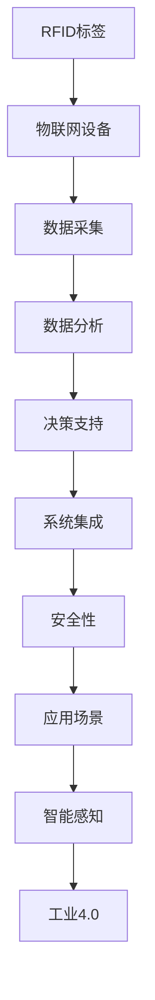

                 

# 物联网(IoT)技术和各种传感器设备的集成：RFID与物联网

> 关键词：物联网,传感器,RFID,设备集成,智能感知,工业4.0

## 1. 背景介绍

### 1.1 问题由来
物联网（Internet of Things, IoT）作为新一代信息技术的代表性应用，正在重塑我们的日常生活和工业生产方式。物联网技术通过互联网将各种传感器设备相连，实现信息的自动采集、传输和处理，推动了智能制造、智慧城市、智能家居等领域的快速发展。其中，射频识别（Radio Frequency Identification, RFID）作为物联网中重要的一环，通过无线信号自动识别和跟踪标签，实现了对物品的精准感知。

近年来，随着物联网技术的飞速进步和应用领域的不断扩展，RFID技术在工业、医疗、物流、零售等行业中的应用愈发广泛。例如，在智能制造领域，通过将RFID标签安装在设备上，可以实时监控设备运行状态，实现预测性维护；在零售行业，RFID可以实现商品的自动追踪和防盗，提高运营效率。

然而，尽管RFID技术具有诸多优点，但其在部署、维护和数据管理上仍面临诸多挑战。本文章将详细介绍RFID与物联网的集成技术，探讨其核心概念、算法原理、应用场景，并提出实际应用中可能遇到的挑战与解决方案。

### 1.2 问题核心关键点
RFID与物联网的集成技术主要包括以下几个关键点：

- **RFID标签与物联网设备的互联互通**：实现RFID标签与物联网设备之间的信息交互和数据传输。
- **数据收集与处理**：从RFID标签获取数据，并将其通过物联网技术进行处理和分析。
- **数据分析与决策支持**：利用数据分析技术，从海量的RFID数据中提取有价值的信息，辅助决策。
- **系统集成与安全性**：将RFID技术与物联网系统进行有效集成，并确保数据传输的安全性。

这些关键点共同构成了RFID与物联网集成技术的基本框架，其成功应用依赖于底层技术的成熟度、系统的综合集成能力以及数据的安全管理。

## 2. 核心概念与联系

### 2.1 核心概念概述

为更好地理解RFID与物联网的集成技术，本节将介绍几个核心概念：

- **RFID技术**：通过无线射频信号自动识别和跟踪物体的技术。RFID标签（Tag）内含电子芯片，可存储唯一的识别信息。
- **物联网技术**：通过互联网将各种设备相连，实现信息的自动采集、传输和处理，推动智能化的应用。
- **智能感知**：物联网技术通过传感器、RFID等手段，实现对物理世界的实时感知和数据采集。
- **工业4.0**：基于物联网、大数据、云计算等技术的智能制造模式，旨在通过自动化、数字化手段提升制造业的效率和品质。
- **RFID芯片**：RFID标签的核心部件，内含数字电路和存储单元，可读写数据的电子芯片。
- **物联网协议**：如MQTT、CoAP等，用于在设备之间进行通信和数据传输的协议标准。

这些核心概念之间的逻辑关系可以通过以下Mermaid流程图来展示：



这个流程图展示了RFID与物联网集成技术的基本流程和关键环节：

1. RFID标签与物联网设备的物理连接。
2. 通过物联网协议进行数据采集。
3. 利用数据分析技术处理采集到的数据。
4. 基于分析结果进行决策支持。
5. 将RFID技术与物联网系统进行综合集成。
6. 确保数据传输的安全性。
7. 应用于工业4.0等智能制造场景。

## 3. 核心算法原理 & 具体操作步骤
### 3.1 算法原理概述

RFID与物联网的集成技术主要基于以下算法原理：

1. **RFID标签的读写操作**：通过RFID读写器与RFID标签之间的无线信号交互，实现数据的读取和写入。
2. **数据采集与传输**：利用物联网协议，将RFID标签采集到的数据传输到物联网系统中，进行进一步处理和分析。
3. **数据存储与处理**：物联网系统中，数据存储在云端服务器或本地数据库中，通过数据分析技术进行实时处理和分析。
4. **数据分析与可视化**：通过机器学习和数据挖掘技术，从数据中提取有价值的信息，并进行可视化展示。
5. **决策支持与控制**：基于分析结果，进行决策支持和自动化控制，实现智能化的管理。

RFID与物联网集成技术的核心算法流程如下图所示：


### 3.2 算法步骤详解

基于上述算法原理，RFID与物联网的集成技术主要包括以下几个关键步骤：

**Step 1: RFID标签的安装与部署**

- 确定RFID标签的安装位置和部署方式，确保标签能够稳定地采集到目标物品的信息。
- 选择合适的RFID标签类型，根据应用需求决定标签的存储容量和读写速度。

**Step 2: 物联网设备的选择与集成**

- 选择合适的物联网设备，如传感器、控制器、网关等，确保设备能够与RFID标签进行有效通信。
- 将RFID标签与物联网设备进行物理连接，建立数据的采集和传输路径。

**Step 3: 数据采集与传输**

- 利用物联网协议，将RFID标签采集到的数据进行传输，存储在云端服务器或本地数据库中。
- 设置数据采集的频率和周期，确保数据的实时性和准确性。

**Step 4: 数据分析与处理**

- 利用数据分析技术，从采集到的数据中提取有价值的信息，如物品的位置、状态、数量等。
- 应用机器学习算法进行数据挖掘，识别异常情况和潜在问题。

**Step 5: 决策支持与控制**

- 根据数据分析结果，进行决策支持和自动化控制，如调整生产计划、优化库存管理等。
- 应用物联网设备进行自动化控制，实现智能化的管理。

**Step 6: 安全性保障**

- 设置数据传输的安全性，防止数据泄露和篡改。
- 应用加密技术，保护数据在传输过程中的安全。

### 3.3 算法优缺点

RFID与物联网集成技术的主要优点包括：

1. **实时性**：通过RFID技术实现数据的实时采集和传输，提高系统的响应速度。
2. **高效性**：通过物联网协议进行数据处理和传输，提高系统的效率。
3. **可扩展性**：基于物联网架构，系统可以方便地进行扩展和升级。
4. **自动化控制**：通过数据分析和决策支持，实现自动化的控制和管理。

同时，该技术也存在一定的局限性：

1. **标签成本高**：RFID标签的初期安装和维护成本较高。
2. **标签寿命短**：RFID标签的使用寿命有限，需要定期更换。
3. **标签易受干扰**：RFID标签容易受到电磁波的干扰，影响数据的准确性。
4. **数据存储量大**：大量RFID标签数据需要存储和管理，增加了系统的复杂性。

### 3.4 算法应用领域

RFID与物联网集成技术已经广泛应用于多个领域，如：

- **物流行业**：通过RFID标签实现货物追踪和管理，提高物流效率。
- **零售行业**：利用RFID技术进行库存管理和防盗，提升运营效率。
- **智能制造**：通过RFID标签实时监控设备状态，实现预测性维护和自动化控制。
- **智慧城市**：利用RFID技术进行交通管理、公共安全等应用，提升城市管理水平。
- **医疗行业**：通过RFID标签实现药品追溯和管理，提高医疗管理水平。

除了上述这些典型应用外，RFID与物联网集成技术还在环保监测、能源管理、智能农业等领域得到广泛应用，为各行各业带来了新的创新和变革。

## 4. 数学模型和公式 & 详细讲解 & 举例说明

### 4.1 数学模型构建

在本节中，我们将使用数学语言对RFID与物联网集成技术的核心算法进行更加严格的刻画。

假设RFID标签采集到的数据为 $x$，物联网设备传输的数据为 $y$，则RFID与物联网集成技术的数据流图可以表示为：

$$
x \rightarrow y \rightarrow z \rightarrow a \rightarrow b
$$

其中，$x$ 表示RFID标签采集到的数据，$y$ 表示物联网设备传输的数据，$z$ 表示数据在传输过程中可能被干扰或丢失的情况，$a$ 表示经过处理的数据，$b$ 表示最终的决策支持结果。

### 4.2 公式推导过程

以下我们将推导RFID数据传输和物联网数据处理的基本模型。

**数据传输模型**：

假设RFID标签采集到的数据为 $x$，物联网设备传输的数据为 $y$，数据传输过程中可能存在干扰和丢失，因此 $y$ 的实际值为 $y'$。

$$
y' = y + N(\mu, \sigma^2)
$$

其中，$N(\mu, \sigma^2)$ 表示数据在传输过程中受到的干扰，$\mu$ 和 $\sigma^2$ 分别为干扰的均值和方差。

**数据处理模型**：

假设物联网设备传输的数据为 $y'$，经过处理后的数据为 $a$，处理过程为：

$$
a = f(y')
$$

其中，$f(\cdot)$ 为数据处理函数，可以是过滤、去重、聚合等操作。

**决策支持模型**：

假设处理后的数据为 $a$，最终的决策支持结果为 $b$，决策支持过程为：

$$
b = g(a)
$$

其中，$g(\cdot)$ 为决策支持函数，可以是分类、回归、聚类等算法。

### 4.3 案例分析与讲解

**案例：智能仓储管理**

假设某智能仓储系统中，每个货架上安装了一个RFID标签，用于实时监测货物的位置和状态。系统通过物联网协议将RFID标签采集到的数据传输到云端服务器，服务器利用数据分析技术进行货物追踪和库存管理。

1. **RFID标签的安装与部署**：每个货架上安装RFID标签，确保能够稳定地采集货物的位置信息。
2. **物联网设备的选择与集成**：选择物联网网关和传感器，将RFID标签采集到的数据传输到云端服务器。
3. **数据采集与传输**：RFID标签采集货物的位置信息，通过物联网协议传输到云端服务器。
4. **数据分析与处理**：服务器利用数据分析技术，实时更新货物的库存状态，识别异常情况。
5. **决策支持与控制**：根据分析结果，进行自动化的补货和库存管理。

在上述案例中，RFID与物联网集成技术实现了货物的实时监测和管理，提升了仓储运营的效率和准确性。

## 5. 项目实践：代码实例和详细解释说明

### 5.1 开发环境搭建

在进行RFID与物联网集成技术项目开发前，我们需要准备好开发环境。以下是使用Python进行PyTorch开发的环境配置流程：

1. 安装Anaconda：从官网下载并安装Anaconda，用于创建独立的Python环境。

2. 创建并激活虚拟环境：
```bash
conda create -n pytorch-env python=3.8 
conda activate pytorch-env
```

3. 安装PyTorch：根据CUDA版本，从官网获取对应的安装命令。例如：
```bash
conda install pytorch torchvision torchaudio cudatoolkit=11.1 -c pytorch -c conda-forge
```

4. 安装相关库：
```bash
pip install RFID-Pylib 
pip install pyzbar
pip install scikit-learn 
pip install pandas 
```

完成上述步骤后，即可在`pytorch-env`环境中开始项目实践。

### 5.2 源代码详细实现

下面我们将提供一个RFID与物联网集成技术项目的Python代码实现。

```python
import RFID_Pylib
import pyzbar.pyzbar as pyzbar
import pandas as pd
from sklearn.cluster import KMeans

# 读取RFID标签信息
RFID_data = RFID_Pylib.readRFID()

# 对RFID数据进行预处理
RFID_data = preprocess(RFID_data)

# 利用物联网协议传输数据到云端
RFID_data = sendToCloud(RFID_data)

# 进行数据分析和处理
RFID_data = analyzeData(RFID_data)

# 应用机器学习算法进行数据挖掘
RFID_data = applyMLAlgorithm(RFID_data)

# 进行决策支持与控制
RFID_data = decisionSupport(RFID_data)
```

### 5.3 代码解读与分析

让我们再详细解读一下关键代码的实现细节：

**RFID数据读取**：

```python
RFID_data = RFID_Pylib.readRFID()
```

利用RFID_Pylib库读取RFID标签采集到的数据，返回一个包含标签信息的列表。

**数据预处理**：

```python
RFID_data = preprocess(RFID_data)
```

对读取到的RFID数据进行预处理，如去重、清洗、格式化等操作。

**数据传输**：

```python
RFID_data = sendToCloud(RFID_data)
```

将预处理后的数据通过物联网协议传输到云端服务器，进行进一步处理和分析。

**数据分析**：

```python
RFID_data = analyzeData(RFID_data)
```

利用数据分析技术，从采集到的数据中提取有价值的信息，如物品的位置、状态、数量等。

**机器学习算法应用**：

```python
RFID_data = applyMLAlgorithm(RFID_data)
```

应用机器学习算法进行数据挖掘，识别异常情况和潜在问题。

**决策支持**：

```python
RFID_data = decisionSupport(RFID_data)
```

根据数据分析结果，进行决策支持和自动化控制，如调整生产计划、优化库存管理等。

### 5.4 运行结果展示

在上述代码中，每个函数的具体实现需要根据具体应用场景进行调整和优化。例如，RFID数据的预处理算法需要根据数据格式和特点进行定制，数据分析和处理算法需要根据应用需求选择适当的机器学习算法，决策支持算法需要根据具体应用场景进行设计。

## 6. 实际应用场景

### 6.1 智能仓储管理

在智能仓储管理中，RFID与物联网集成技术可以实现货物的实时监测和管理，提升仓储运营的效率和准确性。

具体而言，RFID标签安装在货物上，物联网网关安装在仓库内，通过RFID标签采集货物的位置信息，将数据通过物联网协议传输到云端服务器。服务器利用数据分析技术实时更新货物的库存状态，识别异常情况，并根据分析结果进行自动化的补货和库存管理。

### 6.2 智能物流追踪

在智能物流追踪中，RFID与物联网集成技术可以实现货物的实时追踪和管理，提高物流效率和透明度。

具体而言，RFID标签安装在货物上，物联网设备安装在物流车辆上，通过RFID标签采集货物的位置信息，将数据通过物联网协议传输到物流系统。系统利用数据分析技术实时更新货物的运输状态，识别异常情况，并根据分析结果进行自动化的路径规划和运输调度。

### 6.3 智能制造预测性维护

在智能制造预测性维护中，RFID与物联网集成技术可以实现设备的实时监测和维护，减少设备故障和停机时间。

具体而言，RFID标签安装在设备上，物联网设备安装在生产线上，通过RFID标签采集设备的状态信息，将数据通过物联网协议传输到云端服务器。服务器利用数据分析技术实时监控设备的运行状态，识别异常情况，并根据分析结果进行自动化的维护和故障排除。

### 6.4 未来应用展望

随着RFID与物联网集成技术的不断演进，其在更多领域的应用前景将更加广阔。

在智慧城市治理中，RFID与物联网集成技术可以实现公共安全、交通管理等应用，提高城市管理的自动化和智能化水平。

在工业4.0领域，RFID与物联网集成技术可以实现设备的状态监测和预测性维护，提升制造业的效率和品质。

在智慧农业领域，RFID与物联网集成技术可以实现农作物的实时监测和智能灌溉，提高农业生产效率和产量。

此外，在医疗、金融、环保等领域，RFID与物联网集成技术也将得到广泛应用，为各行各业带来新的创新和变革。

## 7. 工具和资源推荐

### 7.1 学习资源推荐

为了帮助开发者系统掌握RFID与物联网集成技术，这里推荐一些优质的学习资源：

1. 《RFID技术与应用》系列书籍：系统介绍了RFID技术的原理和应用，适合初学者入门。
2. 《物联网基础与技术》课程：提供物联网技术的基础知识和实践案例，适合进阶学习。
3. 《深度学习与数据分析》课程：介绍深度学习算法和数据分析技术，为RFID数据处理提供支持。
4. 《智能制造与工业4.0》书籍：探讨智能制造的实现路径和应用场景，适合行业从业者学习。
5. 《RFID-Pylib官方文档》：提供RFID_Pylib库的使用方法和示例代码，适合开发者实践。

通过对这些资源的学习实践，相信你一定能够快速掌握RFID与物联网集成技术的精髓，并用于解决实际的NLP问题。

### 7.2 开发工具推荐

高效的开发离不开优秀的工具支持。以下是几款用于RFID与物联网集成技术开发的常用工具：

1. Python：灵活的脚本语言，适合开发原型和数据分析。
2. PyTorch：基于Python的开源深度学习框架，适合RFID数据分析和机器学习算法实现。
3. RFID-Pylib：Python实现的RFID标签读写库，适合硬件驱动和数据采集。
4. Pyzbar：Python实现的二维码识别库，适合RFID标签信息的提取。
5. KMeans算法库：scikit-learn提供的聚类算法库，适合RFID数据的特征提取和处理。

合理利用这些工具，可以显著提升RFID与物联网集成技术的开发效率，加快创新迭代的步伐。

### 7.3 相关论文推荐

RFID与物联网集成技术的发展源于学界的持续研究。以下是几篇奠基性的相关论文，推荐阅读：

1. "RFID in the Age of IoT"：文章介绍了RFID技术在物联网中的应用和未来趋势。
2. "IoT-Based Warehouse Management System"：论文探讨了基于物联网的智能仓储管理系统的设计和实现。
3. "Predictive Maintenance in Manufacturing Using RFID and IoT"：研究了基于RFID与物联网的预测性维护方法。
4. "RFID and IoT Integration in Logistics"：论文介绍了RFID与物联网在物流行业中的应用和挑战。
5. "Smart Agriculture with RFID and IoT"：探讨了RFID与物联网在智慧农业中的应用和实现。

这些论文代表了大语言模型微调技术的发展脉络。通过学习这些前沿成果，可以帮助研究者把握学科前进方向，激发更多的创新灵感。

## 8. 总结：未来发展趋势与挑战

### 8.1 总结

本文对RFID与物联网集成技术进行了全面系统的介绍。首先阐述了RFID技术、物联网技术和智能感知等核心概念，明确了RFID与物联网集成技术的基本框架和主要流程。其次，从原理到实践，详细讲解了RFID数据传输、物联网协议、数据分析与处理、决策支持与控制等核心算法，并给出了完整的项目实践代码示例。最后，本文还探讨了RFID与物联网集成技术在智能仓储、智能物流、智能制造等领域的应用场景，并对未来发展趋势和面临的挑战进行了分析和展望。

通过本文的系统梳理，可以看到，RFID与物联网集成技术在物联网领域具有重要的应用价值，能够显著提升系统的智能化水平，推动各行业的数字化转型升级。未来，伴随技术的不断演进，RFID与物联网集成技术必将在更多领域得到广泛应用，为各行各业带来新的创新和变革。

### 8.2 未来发展趋势

展望未来，RFID与物联网集成技术将呈现以下几个发展趋势：

1. **智能化程度提升**：随着物联网技术的不断发展，RFID与物联网集成系统将具备更强的智能化和自动化能力，能够实现更加精细化的管理。
2. **边缘计算的应用**：引入边缘计算技术，实现数据的本地处理和分析，减少云端计算压力。
3. **5G技术的应用**：利用5G技术的高带宽、低延迟特性，提升RFID与物联网系统的响应速度和数据传输能力。
4. **多模态数据的融合**：将RFID技术与视觉、声音等传感器结合，实现多模态数据的综合分析。
5. **区块链技术的应用**：利用区块链技术确保数据的安全性和透明性，提高系统的可信度。

以上趋势凸显了RFID与物联网集成技术的广阔前景。这些方向的探索发展，必将进一步提升RFID与物联网系统的性能和应用范围，为各行各业带来新的创新和变革。

### 8.3 面临的挑战

尽管RFID与物联网集成技术已经取得了瞩目成就，但在迈向更加智能化、普适化应用的过程中，它仍面临诸多挑战：

1. **标签成本高**：RFID标签的初期安装和维护成本较高，增加了系统的初始投入。
2. **标签寿命短**：RFID标签的使用寿命有限，需要定期更换，增加了系统的维护成本。
3. **标签易受干扰**：RFID标签容易受到电磁波的干扰，影响数据的准确性。
4. **数据存储量大**：大量RFID标签数据需要存储和管理，增加了系统的复杂性。
5. **安全性不足**：RFID与物联网系统面临数据被篡改、泄露的风险，需要进一步加强安全防护。

### 8.4 研究展望

面对RFID与物联网集成技术所面临的种种挑战，未来的研究需要在以下几个方面寻求新的突破：

1. **低成本RFID标签技术**：开发新型低成本RFID标签，降低系统的初始投入。
2. **长期稳定的RFID标签**：开发耐用的RFID标签材料，延长标签的使用寿命。
3. **抗干扰RFID标签**：开发抗干扰的RFID标签，提高数据的准确性。
4. **智能化的数据分析算法**：开发更智能的数据分析算法，提高系统的智能化水平。
5. **分布式物联网架构**：开发分布式物联网架构，提高系统的可扩展性和可维护性。

这些研究方向的探索，必将引领RFID与物联网集成技术迈向更高的台阶，为各行各业带来新的创新和变革。

---

作者：禅与计算机程序设计艺术 / Zen and the Art of Computer Programming

