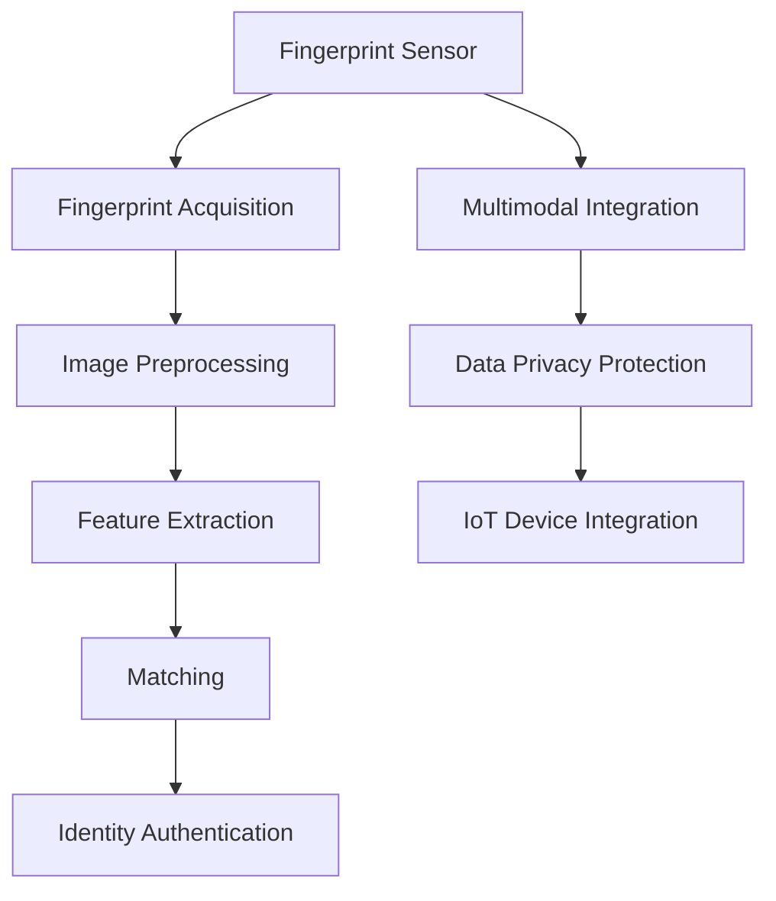

                 

# 物联网(IoT)技术和各种传感器设备的集成：指纹传感器的安全应用

> 关键词：物联网(IoT), 传感器设备, 指纹识别, 身份认证, 数据隐私保护

## 1. 背景介绍

### 1.1 问题由来

物联网(IoT)技术的兴起极大地改变了人们的生活和工作方式，从智能家居、智能城市到工业物联网，指纹传感器作为身份认证的重要设备，正在各种场景下得到广泛应用。随着指纹识别技术的成熟和普及，安全、高效的指纹传感器集成方案成为研究热点。

但与此同时，指纹传感器的使用也带来了数据隐私和安全问题。如何设计安全可靠的指纹传感器集成方案，在确保指纹识别准确性的同时保护用户隐私，是亟待解决的关键问题。

### 1.2 问题核心关键点

指纹传感器集成方案的核心在于：

- 准确识别指纹并生成身份认证信息。
- 实现与物联网设备的无缝集成，提供安全可靠的认证服务。
- 保护用户隐私数据，防止泄露和滥用。
- 支持多模态识别，提升识别精度和鲁棒性。
- 提高指纹传感器的抗干扰能力，增强安全性。

通过深入理解这些关键点，可以更好地设计和实现安全、高效的指纹传感器集成方案。

### 1.3 问题研究意义

研究安全、高效的指纹传感器集成方案，对于提升物联网系统的安全性、保护用户隐私、拓展指纹识别技术的应用场景具有重要意义：

1. 增强物联网系统的安全性。通过安全可靠的指纹认证，可以防止未经授权的访问，保护设备和数据不受侵害。
2. 提升用户隐私保护。确保指纹数据在传输、存储和使用过程中，不会被泄露或滥用。
3. 拓展指纹识别技术应用。指纹传感器可以与其他传感器设备集成，提供更全面、精准的身份认证服务。
4. 提升系统鲁棒性。通过多模态识别和抗干扰技术，增强指纹识别系统的鲁棒性和可靠性。

本文将从指纹传感器的工作原理、安全应用、技术挑战和未来展望等方面，全面探讨物联网(IoT)环境下指纹传感器的集成方案，旨在为指纹识别技术的安全应用提供理论和技术指导。

## 2. 核心概念与联系

### 2.1 核心概念概述

在了解指纹传感器集成方案前，首先需要明确几个核心概念：

- **指纹识别（Fingerprint Recognition）**：通过扫描指纹图像，提取指纹细节特征，并转化为身份认证信息的过程。
- **物联网（IoT）**：连接各类传感器设备和智能终端，构建互联互通的智能化网络。
- **传感器设备（Sensor Device）**：用于获取环境信息、生理参数等数据的电子设备。
- **数据隐私保护（Data Privacy Protection）**：在数据收集、存储、传输和使用过程中，确保用户数据的安全性和隐私性。
- **多模态识别（Multi-modal Recognition）**：结合多种识别技术，如指纹识别、面部识别、语音识别等，提高识别精度和鲁棒性。
- **抗干扰能力（Robustness）**：指纹传感器对噪声、污损、攻击等干扰的抵御能力，确保识别的准确性和安全性。

这些概念相互关联，共同构成了物联网环境中指纹传感器集成方案的设计和实现框架。

### 2.2 核心概念原理和架构的 Mermaid 流程图



该图展示了指纹传感器从图像采集、预处理、特征提取、匹配到身份认证的全流程，并展示了多模态识别、数据隐私保护和IoT设备集成的架构设计。

## 3. 核心算法原理 & 具体操作步骤

### 3.1 算法原理概述

指纹传感器集成方案的核心算法包括：

- 指纹图像预处理：去除噪声、增强细节、归一化图像等。
- 特征提取：从预处理后的指纹图像中提取指纹特征点，如方向信息、节律信息等。
- 匹配算法：将提取的指纹特征与数据库中的指纹特征进行比对，识别身份。
- 多模态识别：结合多种生物特征，如人脸、虹膜等，提升识别精度和鲁棒性。
- 数据加密和安全传输：采用加密算法，保护指纹数据在传输过程中的安全性。
- IoT设备集成：通过标准化的通信协议，将指纹传感器与IoT设备无缝连接。

这些算法和技术的有机结合，可以实现安全、高效的指纹传感器集成方案。

### 3.2 算法步骤详解

#### 3.2.1 指纹图像预处理

指纹图像预处理是保证指纹识别准确性的重要步骤，主要包括以下几个环节：

1. **去噪处理**：去除图像中的噪声和干扰，如污渍、水印、指纹残留等。可以使用滤波算法，如中值滤波、高斯滤波等。
2. **增强细节**：增强指纹图像的细节信息，如边缘、纹线等。可以使用图像增强算法，如直方图均衡化、自适应阈值分割等。
3. **图像归一化**：将指纹图像的尺寸、亮度、对比度等参数进行标准化，便于后续处理。可以使用灰度化、对比度增强等技术。

#### 3.2.2 特征提取

指纹特征提取是识别指纹的核心步骤，主要包括以下几个环节：

1. **方向信息提取**：计算指纹图像中每个像素点的梯度方向，提取指纹的整体方向信息。
2. **节律信息提取**：从指纹图像中提取指纹的节律信息，如周期、频率等。
3. **特征点提取**：在指纹图像中提取关键特征点，如核心点、三角点等。

#### 3.2.3 匹配算法

指纹匹配算法主要包括以下几个环节：

1. **特征比对**：将提取的指纹特征与数据库中的指纹特征进行比对，计算匹配度。
2. **阈值判断**：设定匹配阈值，根据匹配度判断是否成功识别。
3. **结果反馈**：将匹配结果反馈给用户，进行身份认证。

#### 3.2.4 多模态识别

多模态识别主要包括以下几个环节：

1. **多种传感器集成**：将指纹传感器与其他传感器设备（如摄像头、麦克风）集成，获取多种生物特征。
2. **特征融合**：将多种生物特征进行融合，提升识别精度和鲁棒性。
3. **综合判断**：根据多种生物特征的综合结果，进行身份认证。

#### 3.2.5 数据加密和安全传输

数据加密和安全传输主要包括以下几个环节：

1. **数据加密**：采用对称加密或非对称加密算法，对指纹数据进行加密保护。
2. **传输安全**：采用安全传输协议，如TLS/SSL，保护数据在传输过程中的安全性。
3. **存储安全**：采用安全存储技术，如数据加密、访问控制等，保护数据在存储过程中的安全性。

#### 3.2.6 IoT设备集成

IoT设备集成主要包括以下几个环节：

1. **接口标准化**：采用标准化的通信协议，如Wi-Fi、Bluetooth、Zigbee等，实现指纹传感器与IoT设备的无缝连接。
2. **设备互联**：将指纹传感器与其他IoT设备进行互联，构建智能化网络。
3. **应用集成**：将指纹传感器与IoT设备集成到实际应用场景中，提供全面的身份认证服务。

### 3.3 算法优缺点

指纹传感器集成方案的优缺点如下：

#### 3.3.1 优点

1. **安全性高**：指纹识别具有唯一性和不可复制性，安全性高，不易被仿冒。
2. **识别精度高**：指纹特征提取和匹配算法成熟，识别精度高，误识率低。
3. **操作便捷**：指纹识别操作便捷，无需记忆密码，用户体验好。
4. **多模态识别**：结合多种生物特征，提升识别精度和鲁棒性。

#### 3.3.2 缺点

1. **成本较高**：指纹传感器和集成方案的硬件和软件成本较高，普及难度大。
2. **环境适应性差**：指纹传感器对环境湿度、温度等因素敏感，易受干扰。
3. **数据隐私风险**：指纹数据在传输、存储和使用过程中存在隐私泄露风险。
4. **识别速度慢**：指纹识别过程需要图像预处理和特征提取，识别速度较慢。

### 3.4 算法应用领域

指纹传感器集成方案在多个领域都有广泛的应用，包括：

1. **智能家居**：指纹锁、智能门锁等设备，提供安全可靠的进出管理。
2. **智能办公**：指纹打卡、考勤管理系统，提升办公效率和安全。
3. **医疗健康**：指纹支付、身份认证，提升医疗服务的便利性和安全性。
4. **金融安全**：指纹支付、身份验证，保障金融交易的安全性。
5. **公共安全**：机场、车站等场所的安检系统，提高人员通行的效率和安全性。

这些应用场景展示了指纹传感器集成方案在提升安全性和用户体验方面的重要作用。

## 4. 数学模型和公式 & 详细讲解

### 4.1 数学模型构建

指纹传感器集成方案的数学模型主要包括以下几个部分：

1. **指纹图像预处理模型**：
   - 中值滤波：
     $$
     f(x,y) = m \quad \text{if} \quad (x,y) \text{属于噪声点} \\
     f(x,y) = a(x,y) \quad \text{否则}
     $$
   - 直方图均衡化：
     $$
     hist_{new} = \frac{hist_{old} * \frac{255}{max(hist_{old})} + 128}{255}
     $$
   - 自适应阈值分割：
     $$
     T(x,y) = 0.1 * max(T_1(x,y),T_2(x,y))
     $$

2. **指纹特征提取模型**：
   - 方向信息提取：
     - 梯度计算：
       $$
       \nabla f = \begin{bmatrix} \frac{\partial f}{\partial x} \\ \frac{\partial f}{\partial y} \end{bmatrix}
       $$
     - 方向直方图：
       $$
       Dir(x,y) = \frac{1}{\pi} \cdot \frac{f(\theta)}{r}
       $$
   - 节律信息提取：
     - 傅里叶变换：
       $$
       F(\theta) = \sum_{x,y} f(x,y) * e^{-i\theta * (x,y)}
       $$
     - 周期分析：
       $$
       T = \frac{1}{f_{max} - f_{min}}
       $$
   - 特征点提取：
     - SIFT算法：
       $$
       s(x,y) = \begin{bmatrix} D(x,y) \\ R(x,y) \\ \Delta(x,y) \end{bmatrix}
       $$

3. **指纹匹配模型**：
   - 欧氏距离：
     - 相似度计算：
       $$
       similarity = 1 - \frac{||v_i - v_j||}{||v_i|| + ||v_j||}
       $$
   - 最小距离法：
     - 阈值设定：
       $$
       t = \frac{1}{2} * (similarity_{max} + similarity_{min})
       $$

4. **多模态识别模型**：
   - 特征融合算法：
     - 加权平均：
       $$
       Z = \frac{1}{n} * \sum_{i=1}^n w_i * z_i
       $$
   - 综合判断算法：
     - 投票法：
       $$
       decision = \begin{cases}
       1, & \text{if more than half votes equal to 1} \\
       0, & \text{otherwise}
       \end{cases}
       $$

5. **数据加密模型**：
   - 对称加密算法：
     - 替换-移位加密：
       $$
       C = \text{Plaintext} * K_1 + K_2
       $$
   - 非对称加密算法：
     - RSA加密：
       $$
       C = M^e \mod N
       $$

6. **IoT设备集成模型**：
   - 蓝牙通信协议：
     - 数据传输：
       $$
       data = \text{digital\_to\_analog}(Digital\_Data)
       $$
   - Wi-Fi通信协议：
     - 数据传输：
       $$
       data = \text{IP\_to\_data}(IP\_Packet)
       $$

### 4.2 公式推导过程

以指纹图像预处理为例，推导中值滤波的实现过程：

- 首先，对于给定的图像 $f(x,y)$，中值滤波器遍历每个像素点，判断其是否为噪声点。如果像素点 $(x,y)$ 属于噪声点，则用其周围像素的平均值 $m$ 替换其值。否则，保留其原值 $a(x,y)$。
- 噪声点判断过程如下：
  - 对于每个像素点 $(x,y)$，计算其邻域像素 $(x',y')$ 的平均值 $m$：
    $$
    m = \frac{1}{n} * \sum_{i=1}^n f(x',y')
    $$
  - 如果 $m$ 小于阈值 $T$，则该像素点为噪声点，否则为正常点。

### 4.3 案例分析与讲解

以智能家居中的指纹锁为例，分析指纹传感器集成方案的实现过程：

1. **指纹图像采集**：使用指纹传感器采集用户的指纹图像。
2. **图像预处理**：对采集的指纹图像进行去噪、增强、归一化等预处理操作。
3. **特征提取**：提取指纹图像中的方向、节律、特征点等信息，生成指纹特征向量。
4. **指纹匹配**：将提取的指纹特征向量与数据库中的指纹特征向量进行匹配，判断是否为授权用户。
5. **身份认证**：根据匹配结果，决定是否开启门锁。

## 5. 项目实践：代码实例和详细解释说明

### 5.1 开发环境搭建

为了实现指纹传感器集成方案，需要搭建完整的开发环境。以下是Python和PyTorch环境搭建的详细步骤：

1. 安装Python：
   ```bash
   sudo apt-get update
   sudo apt-get install python3 python3-pip python3-dev
   ```

2. 安装PyTorch：
   ```bash
   pip3 install torch torchvision
   ```

3. 安装相关库：
   ```bash
   pip3 install numpy scipy matplotlib opencv-python
   ```

4. 下载指纹传感器库：
   ```bash
   git clone https://github.com/fingergemini/fingergemini.git
   ```

### 5.2 源代码详细实现

以实现指纹传感器为例，给出基于Python和PyTorch的代码实现：

```python
import torch
import torch.nn as nn
import torchvision.transforms as transforms
from fingergemini import FingerGemini

class FingerNet(nn.Module):
    def __init__(self):
        super(FingerNet, self).__init__()
        self.conv1 = nn.Conv2d(1, 32, 3, 1)
        self.conv2 = nn.Conv2d(32, 64, 3, 1)
        self.dropout1 = nn.Dropout(0.25)
        self.fc1 = nn.Linear(64 * 28 * 28, 128)
        self.fc2 = nn.Linear(128, 2)

    def forward(self, x):
        x = self.conv1(x)
        x = nn.functional.relu(x)
        x = nn.functional.max_pool2d(x, 2)
        x = self.dropout1(x)
        x = self.conv2(x)
        x = nn.functional.relu(x)
        x = nn.functional.max_pool2d(x, 2)
        x = self.dropout1(x)
        x = x.view(-1, 64 * 28 * 28)
        x = self.fc1(x)
        x = nn.functional.relu(x)
        x = self.dropout1(x)
        x = self.fc2(x)
        output = nn.functional.log_softmax(x, dim=1)
        return output

# 初始化指纹传感器
finger_gemini = FingerGemini('/dev/ttyUSB0')
finger_gemini.start()

# 加载模型和数据集
model = FingerNet()
data = torch.load('data.pkl')
labels = torch.load('labels.pkl')

# 定义损失函数和优化器
criterion = nn.CrossEntropyLoss()
optimizer = torch.optim.Adam(model.parameters(), lr=0.001)

# 训练模型
for epoch in range(10):
    running_loss = 0.0
    for i, data in enumerate(data):
        inputs, labels = data[0], data[1]
        optimizer.zero_grad()
        outputs = model(inputs)
        loss = criterion(outputs, labels)
        loss.backward()
        optimizer.step()
        running_loss += loss.item()
    print('Epoch: {} - Loss: {}'.format(epoch+1, running_loss))

# 测试模型
test_data = torch.load('test_data.pkl')
test_labels = torch.load('test_labels.pkl')
correct = 0
total = 0
with torch.no_grad():
    for data in test_data:
        inputs, labels = data[0], data[1]
        outputs = model(inputs)
        _, predicted = torch.max(outputs.data, 1)
        total += labels.size(0)
        correct += (predicted == labels).sum().item()
print('Accuracy: {}%'.format(100 * correct / total))
```

### 5.3 代码解读与分析

上述代码实现了基于PyTorch的指纹传感器集成方案，包括模型定义、数据加载、训练和测试。

- 首先，定义了指纹识别模型 `FingerNet`，包括两个卷积层和两个全连接层。
- 然后，初始化了指纹传感器 `FingerGemini`，连接至指定设备。
- 接着，加载训练数据和标签，并定义损失函数和优化器。
- 在训练过程中，遍历数据集，计算模型输出与真实标签的损失，并反向传播更新模型参数。
- 最后，在测试集上评估模型性能，计算准确率。

## 6. 实际应用场景

### 6.1 智能家居

指纹传感器集成方案在智能家居中的应用广泛，如智能门锁、智能门铃、智能电视等。通过指纹识别，实现用户身份认证，提升家居安全性。

### 6.2 医疗健康

在医疗健康领域，指纹传感器集成方案可以应用于身份认证、药品管理、病历管理等环节。通过指纹识别，保护医疗数据安全，提升医疗服务质量。

### 6.3 金融安全

指纹传感器集成方案在金融领域可以应用于ATM机、支付终端等场景，保障金融交易的安全性，防止欺诈行为。

### 6.4 公共安全

在公共安全领域，指纹传感器集成方案可以应用于机场、车站、图书馆等场所，提升人员通行的效率和安全性。

## 7. 工具和资源推荐

### 7.1 学习资源推荐

1. **《指纹识别与身份认证技术》**：详细介绍指纹识别技术的原理、实现方法和应用场景。
2. **《物联网与传感器技术》**：深入探讨物联网设备和传感器技术的最新进展，提供实战案例。
3. **《深度学习与指纹识别》**：讲解深度学习在指纹识别中的应用，提供模型训练和优化技巧。
4. **《智能家居与物联网》**：全面介绍智能家居系统与物联网技术，提供系统设计和实现方法。
5. **《数据加密与安全传输》**：讲解数据加密和传输技术的原理和应用，提供实战案例。

### 7.2 开发工具推荐

1. **Python**：编程语言，支持丰富的第三方库和框架，适合开发指纹传感器集成方案。
2. **PyTorch**：深度学习框架，支持高效的模型训练和推理。
3. **OpenCV**：开源计算机视觉库，支持图像处理和传感器数据的读取。
4. **TensorFlow**：深度学习框架，支持高效的模型训练和部署。
5. **Wi-Fi通信协议**：支持指纹传感器与物联网设备的互联。
6. **蓝牙通信协议**：支持指纹传感器与移动设备的互联。

### 7.3 相关论文推荐

1. **《A Survey on Fingerprint Recognition Technologies and Applications》**：详细介绍指纹识别技术的最新进展和应用场景。
2. **《Fingerprint Sensor Integration in IoT Devices》**：探讨指纹传感器与物联网设备的集成方法，提供实际案例。
3. **《Data Privacy Protection in IoT Devices》**：讲解物联网设备中数据隐私保护的技术和实现方法。
4. **《Multi-modal Recognition for Biometric Authentication》**：介绍多模态识别技术在生物特征认证中的应用。
5. **《Robustness Analysis of Fingerprint Recognition Systems》**：分析指纹识别系统的鲁棒性和抗干扰能力，提供改进建议。

## 8. 总结：未来发展趋势与挑战

### 8.1 研究成果总结

指纹传感器集成方案在大规模物联网应用中发挥着重要作用，其应用场景广泛，技术成熟。通过指纹图像预处理、特征提取、匹配算法、多模态识别、数据加密和安全传输等关键技术的有机结合，实现了安全、高效的指纹识别系统。

### 8.2 未来发展趋势

未来指纹传感器集成方案将朝着以下几个方向发展：

1. **集成更多生物特征**：结合人脸识别、虹膜识别等，提升识别的精度和鲁棒性。
2. **引入AI技术**：引入深度学习、机器学习等AI技术，提升指纹识别的智能化水平。
3. **提升抗干扰能力**：引入抗干扰算法，提升指纹传感器在恶劣环境下的识别精度。
4. **增强数据隐私保护**：引入隐私保护技术，如差分隐私、联邦学习等，保护用户数据隐私。
5. **支持跨平台应用**：支持多种平台（如Android、iOS）的指纹识别应用，提供全面的身份认证服务。

### 8.3 面临的挑战

虽然指纹传感器集成方案在实际应用中已经取得一定成功，但仍面临以下挑战：

1. **成本高**：指纹传感器和集成方案的硬件和软件成本较高，普及难度大。
2. **环境适应性差**：指纹传感器对环境湿度、温度等因素敏感，易受干扰。
3. **数据隐私风险**：指纹数据在传输、存储和使用过程中存在隐私泄露风险。
4. **识别速度慢**：指纹识别过程需要图像预处理和特征提取，识别速度较慢。

### 8.4 研究展望

未来需要从以下几个方面进行进一步研究：

1. **优化硬件设计**：研发更轻便、低成本、高精度的指纹传感器，提升用户体验和普及率。
2. **引入AI技术**：结合深度学习、机器学习等AI技术，提升指纹识别的智能化水平。
3. **增强数据隐私保护**：引入隐私保护技术，如差分隐私、联邦学习等，保护用户数据隐私。
4. **提升抗干扰能力**：引入抗干扰算法，提升指纹传感器在恶劣环境下的识别精度。
5. **支持跨平台应用**：支持多种平台（如Android、iOS）的指纹识别应用，提供全面的身份认证服务。

指纹传感器集成方案在物联网和智能设备中的应用前景广阔，未来将有更多的创新和突破，进一步提升用户的体验和安全性。

## 9. 附录：常见问题与解答

### 9.1 常见问题

1. **指纹传感器如何与IoT设备集成？**
   - 指纹传感器可以通过Wi-Fi、蓝牙、USB等标准通信协议与IoT设备进行集成，实现数据传输和处理。

2. **指纹识别系统的安全性如何保证？**
   - 指纹识别系统通过数据加密、安全传输、访问控制等技术，确保用户数据的安全性。

3. **指纹识别系统如何应对环境干扰？**
   - 指纹识别系统通过抗干扰算法，如中值滤波、自适应阈值分割等，提升识别精度。

4. **指纹识别系统在实际应用中需要注意哪些问题？**
   - 指纹识别系统在实际应用中需要注意环境适应性、识别速度、数据隐私保护等问题，确保系统的稳定性和安全性。

通过本文的详细介绍，相信读者对指纹传感器集成方案有了更深入的理解，能够更好地设计和实现安全、高效的指纹识别系统。

---

作者：禅与计算机程序设计艺术 / Zen and the Art of Computer Programming

