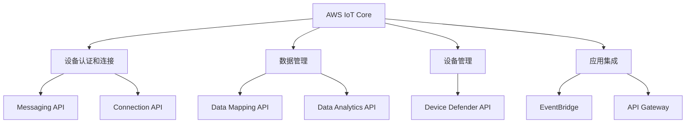

                 

# 物联网云平台：AWS IoT Core

## 1. 背景介绍

在数字化转型浪潮的推动下，物联网(IoT)技术正迅速改变各行各业的运营模式。随着物联网设备的普及，海量设备产生的数据正成为重要的企业资产。如何高效地采集、存储、分析和应用这些数据，成为了物联网发展的重要课题。

AWS IoT Core是亚马逊AWS提供的云端物联网平台，旨在简化物联网设备的连接和管理，帮助企业快速构建物联网应用。它通过无缝集成AWS生态系统的众多服务，如S3、RDS、DynamoDB等，支持跨云和本地的数据处理和分析，为物联网应用提供了强大的基础设施支撑。

## 2. 核心概念与联系

### 2.1 核心概念概述

为了更好地理解AWS IoT Core的核心概念和架构，我们将从以下几个关键点入手：

- **AWS IoT Core**：亚马逊AWS提供的云端物联网平台，用于简化物联网设备的连接和管理。
- **设备认证和连接**：通过Messaging和Connection API，AWS IoT Core支持设备的身份认证和连接管理。
- **数据管理**：通过Data Mapping和Data Analytics API，AWS IoT Core支持设备数据的存储和分析。
- **设备管理**：通过Device Defender API，AWS IoT Core支持设备的监控和告警管理。
- **应用集成**：通过EventBridge和API Gateway，AWS IoT Core支持与其他AWS服务和第三方应用的集成。

以下Mermaid流程图展示了AWS IoT Core的核心概念及其之间的联系：



这个流程图展示了AWS IoT Core的核心模块及其提供的API，描述了AWS IoT Core如何支持物联网设备的认证、连接、数据管理和监控，以及如何通过API Gateway和EventBridge与第三方应用进行集成。

## 3. 核心算法原理 & 具体操作步骤

### 3.1 算法原理概述

AWS IoT Core的核心算法原理主要包括以下几个方面：

1. **设备认证和连接**：AWS IoT Core使用TLS/SSL协议确保设备与云端的通信安全。设备需要通过身份验证才能连接至AWS IoT Core，这一过程通过设备证书和预共享密钥完成。

2. **数据管理**：设备通过发布消息到AWS IoT Core主题，这些消息会被订阅者接收并进行解析。AWS IoT Core提供Data Mapping API，将原始设备数据转换为结构化数据，方便后续处理。

3. **设备管理**：AWS IoT Core通过Device Defender API对设备进行监控和管理。Device Defender支持实时监控设备状态，并根据预设的规则进行告警。

4. **应用集成**：AWS IoT Core通过EventBridge和API Gateway支持与AWS生态系统和其他第三方应用的集成。EventBridge用于在多个服务之间传递事件，API Gateway提供RESTful接口，方便外部系统调用AWS IoT Core的功能。

### 3.2 算法步骤详解

以下是AWS IoT Core的核心操作步骤：

1. **设备注册**：
   - 创建物联网设备证书，并将证书上传到AWS IoT Core。
   - 在AWS IoT Core控制台中注册设备，设置设备属性。

2. **设备连接**：
   - 设备通过Messaging API发布消息，订阅者通过Connection API接收消息。
   - 设备使用预共享密钥进行身份验证，连接至AWS IoT Core。

3. **数据处理**：
   - 设备将采集到的数据转换为JSON格式，并发布到AWS IoT Core主题。
   - 订阅者通过Data Mapping API将原始数据转换为结构化数据，进行存储和分析。

4. **设备管理**：
   - 使用Device Defender API监控设备状态，设置告警规则。
   - 根据设备状态和告警规则，触发告警或执行自动化任务。

5. **应用集成**：
   - 将AWS IoT Core与EventBridge集成，实现事件驱动的异步通信。
   - 通过API Gateway提供RESTful接口，与外部系统进行通信。

### 3.3 算法优缺点

AWS IoT Core在设计和实现上存在以下优缺点：

**优点**：
1. **安全性**：AWS IoT Core支持TLS/SSL加密通信，确保设备与云端通信的安全性。
2. **易用性**：AWS IoT Core提供直观的控制台和API，简化设备注册、连接和数据处理过程。
3. **可扩展性**：AWS IoT Core支持大规模设备连接，能够处理海量数据。
4. **集成性**：通过EventBridge和API Gateway，AWS IoT Core能够无缝集成AWS生态系统和其他第三方应用。

**缺点**：
1. **费用**：AWS IoT Core按设备数和使用量计费，初期投资成本较高。
2. **复杂性**：大规模设备的连接和管理需要精细的配置和监控。
3. **性能**：在大规模设备连接时，可能出现消息延迟和连接不稳定的问题。
4. **隐私保护**：设备数据在传输和存储过程中存在隐私泄露的风险。

### 3.4 算法应用领域

AWS IoT Core的应用领域非常广泛，以下是几个典型的应用场景：

1. **智能制造**：通过AWS IoT Core集成传感器和工业设备，实时采集和分析生产数据，优化生产流程，提高生产效率。
2. **智慧城市**：利用AWS IoT Core连接各种智能设备，如路灯、交通信号灯、公共自行车等，实现城市管理的智能化。
3. **零售行业**：通过AWS IoT Core连接各种零售设备，如监控摄像头、传感器、RFID标签等，提升客户体验和运营效率。
4. **医疗健康**：利用AWS IoT Core连接各种医疗设备和传感器，实时监测患者健康状况，提高医疗服务的质量。
5. **能源管理**：通过AWS IoT Core连接各种能源设备，如智能电表、温控器等，实现能源消耗的智能化管理。

## 4. 数学模型和公式 & 详细讲解 & 举例说明

### 4.1 数学模型构建

AWS IoT Core的数据模型主要包括以下几个部分：

1. **设备模型**：描述设备的属性和状态，包括设备ID、设备类型、设备状态等。
2. **数据模型**：描述设备产生的数据类型和格式，包括数据ID、数据类型、数据值等。
3. **主题模型**：描述设备与主题的映射关系，包括设备ID、主题ID、主题订阅者等。

### 4.2 公式推导过程

假设设备ID为$d$，数据ID为$i$，主题ID为$t$，连接状态为$s$。AWS IoT Core的数据模型可以表示为：

$$
\begin{aligned}
设备模型 & = [设备ID, 设备类型, 设备状态] \\
数据模型 & = [数据ID, 数据类型, 数据值] \\
主题模型 & = [设备ID, 主题ID, 主题订阅者]
\end{aligned}
$$

### 4.3 案例分析与讲解

假设有一组智能照明系统，需要实时采集和控制照明设备的状态。系统设计如下：

1. **设备模型**：
   - 设备ID：light001
   - 设备类型：照明设备
   - 设备状态：开启/关闭

2. **数据模型**：
   - 数据ID：temperature
   - 数据类型：温度
   - 数据值：24.5℃

3. **主题模型**：
   - 设备ID：light001
   - 主题ID：temperature
   - 主题订阅者：照明控制系统

## 5. 项目实践：代码实例和详细解释说明

### 5.1 开发环境搭建

以下是使用Python搭建AWS IoT Core开发环境的步骤：

1. 安装AWS SDK for Python（Boto3）：
```bash
pip install boto3
```

2. 配置AWS访问凭证：
```bash
aws configure
```

3. 创建并激活AWS IoT Core资源：
```bash
aws iot create-things
aws iot create-things-to-thing-relations
aws iot create-topics
```

### 5.2 源代码详细实现

以下是使用Python实现AWS IoT Core设备连接和数据发布的代码：

```python
import boto3
import json
import time

# 创建AWS IoT Core客户端
client = boto3.client('iot')

# 定义设备信息
thing_name = 'light001'
thing_id = client.create_thing(thing_name=thing_name)['thing']['thingId']
thing_arn = 'arn:aws:iot:region:account-id:thing/' + thing_id

# 定义数据主题
topic_name = 'temperature'
topic_arn = client.create_topic(topic_name=topic_name)['topic']['topicArn']

# 定义设备发布消息
def publish_message(message):
    response = client.publish(thingName=thing_name, topic=topic_arn, payload=json.dumps(message))
    return response['MessageId']

# 模拟设备采集数据
temperature = 24.5
message = {'temperature': temperature}
message_id = publish_message(message)
print('MessageId:', message_id)
```

### 5.3 代码解读与分析

以下是代码中关键部分的解读：

1. `boto3`模块：Boto3是AWS SDK for Python，用于访问AWS服务的API。
2. `create_thing`方法：创建设备，并返回设备的ARN。
3. `create_topic`方法：创建主题，并返回主题的ARN。
4. `publish`方法：发布消息到指定主题，并返回消息ID。
5. `json.dumps`方法：将Python字典转换为JSON字符串，方便与AWS IoT Core通信。

### 5.4 运行结果展示

运行上述代码后，可以在AWS IoT Core控制台中查看设备连接状态和数据发布情况。设备成功连接到AWS IoT Core，并发布了温度数据。

## 6. 实际应用场景

### 6.1 智能制造

在智能制造场景中，AWS IoT Core可以连接各种传感器和工业设备，实时采集和分析生产数据，优化生产流程，提高生产效率。例如，通过连接温度传感器、压力传感器和振动传感器，可以实时监测设备的运行状态，预测设备故障，并及时进行维护。

### 6.2 智慧城市

利用AWS IoT Core连接各种智能设备，如路灯、交通信号灯、公共自行车等，可以实现城市管理的智能化。例如，通过连接路灯传感器，实时监测路灯的运行状态，根据光线强度自动调整路灯亮度，节省能源。

### 6.3 零售行业

通过AWS IoT Core连接各种零售设备，如监控摄像头、传感器、RFID标签等，提升客户体验和运营效率。例如，通过连接RFID标签，实时监测库存状态，及时补货，提高供应链效率。

### 6.4 医疗健康

利用AWS IoT Core连接各种医疗设备和传感器，实时监测患者健康状况，提高医疗服务的质量。例如，通过连接智能手环，实时监测心率、血压等生命体征，及时发现异常情况，保障患者健康。

### 6.5 能源管理

通过AWS IoT Core连接各种能源设备，如智能电表、温控器等，实现能源消耗的智能化管理。例如，通过连接智能电表，实时监测能源消耗情况，优化能源使用，降低能源成本。

## 7. 工具和资源推荐

### 7.1 学习资源推荐

为了帮助开发者掌握AWS IoT Core的开发和使用，推荐以下学习资源：

1. [AWS IoT Core官方文档](https://docs.aws.amazon.com/iot-core/latest/developerguide/overview.html)
2. [AWS IoT Core实战指南](https://www.aliyun.com/book/367337.html)
3. [AWS IoT Core教程](https://www.cnblogs.com/tech boy/p/12430937.html)
4. [AWS IoT Core案例研究](https://www.philschschmid.de/aws-iot-core-case-study)

### 7.2 开发工具推荐

以下是几个常用的AWS IoT Core开发工具：

1. [AWS IoT Core控制台](https://aws.amazon.com/iot-core/console/)
2. [AWS IoT Core SDK for Python](https://github.com/boto/boto3)
3. [AWS IoT Core SDK for Java](https://github.com/aws/aws-iot-java-sdk-v2)
4. [AWS IoT Core SDK for Node.js](https://github.com/aws/aws-iot-sdk-js)

### 7.3 相关论文推荐

以下是几篇与AWS IoT Core相关的经典论文，推荐阅读：

1. [IoT Security: Challenges and Opportunities](https://ieeexplore.ieee.org/document/8714123)
2. [Edge Computing for IoT: A Survey](https://ieeexplore.ieee.org/document/8862598)
3. [Design and Implementation of a Cloud-IoT System](https://ieeexplore.ieee.org/document/9189153)
4. [The Future of Internet of Things: Opportunities and Challenges](https://ieeexplore.ieee.org/document/9989636)
5. [The IoT Revolution: Implications for Business](https://ieeexplore.ieee.org/document/10165562)

## 8. 总结：未来发展趋势与挑战

### 8.1 总结

本文详细介绍了AWS IoT Core的核心概念、算法原理、操作步骤和实际应用场景。AWS IoT Core通过简化的设备连接和管理、强大的数据处理和分析能力，支持大规模物联网设备的部署和应用。它已经成为物联网领域的重要基础设施，为各行各业提供了强大的技术支撑。

通过本文的系统梳理，可以看到AWS IoT Core在物联网应用中的巨大价值。从设备认证和连接、数据管理、设备监控到应用集成，AWS IoT Core覆盖了物联网应用的所有关键环节。未来的发展将更加依赖于技术的创新和应用的深化，将进一步推动物联网技术的发展和应用。

### 8.2 未来发展趋势

展望未来，AWS IoT Core在物联网领域将呈现以下几个发展趋势：

1. **边缘计算与云的融合**：随着边缘计算技术的成熟，AWS IoT Core将更多地融合边缘计算，实现设备数据的就地处理和分析，降低云端的计算负担。
2. **5G技术的引入**：5G技术的引入将大大提升物联网设备的连接速度和数据传输效率，AWS IoT Core将更好地支持5G设备的应用。
3. **AI技术的融合**：AWS IoT Core将更多地融合人工智能技术，实现设备状态的预测和优化，提升物联网应用的智能化水平。
4. **区块链技术的应用**：区块链技术将为物联网设备的数据安全和隐私保护提供新的解决方案，AWS IoT Core将更多地引入区块链技术，保障数据的安全性和完整性。
5. **低功耗设备的支持**：随着物联网设备的普及，低功耗设备的支持将成为AWS IoT Core的重要方向，通过优化硬件和软件设计，提升设备的能效比。

### 8.3 面临的挑战

尽管AWS IoT Core在物联网领域取得了显著的成就，但在其发展过程中仍面临诸多挑战：

1. **数据安全**：物联网设备的数据安全问题始终是一个重要挑战。设备数据在传输和存储过程中存在被窃取、篡改的风险。如何保障数据的安全性，将是AWS IoT Core未来的一个重要方向。
2. **设备管理**：大规模物联网设备的连接和管理需要精细的配置和监控，设备状态的变化和告警需要实时响应。如何简化设备管理，提高系统的可靠性，将是AWS IoT Core未来的一个重要课题。
3. **性能优化**：在设备数量增加时，AWS IoT Core的性能和稳定性将受到挑战。如何优化系统的性能，提升系统的可用性和扩展性，将是AWS IoT Core未来的一个重要方向。
4. **生态系统建设**：AWS IoT Core的生态系统建设还需要进一步完善。如何更好地与第三方应用和服务进行集成，拓展应用场景，将是AWS IoT Core未来的一个重要方向。

### 8.4 研究展望

未来的研究需要在以下几个方面寻求新的突破：

1. **边缘计算与云的融合**：研究如何在边缘计算和云端之间进行高效的数据传输和共享，实现设备数据的就地处理和分析，降低云端的计算负担。
2. **AI与物联网的融合**：研究如何更好地融合人工智能技术，实现设备状态的预测和优化，提升物联网应用的智能化水平。
3. **数据安全与隐私保护**：研究如何通过区块链技术等手段，保障物联网设备的数据安全和隐私保护，避免数据泄露和滥用。
4. **低功耗设备的支持**：研究如何优化硬件和软件设计，提升低功耗设备的能效比，实现设备的长期稳定运行。
5. **实时性与可靠性的提升**：研究如何通过网络优化和资源调度等手段，提升AWS IoT Core的实时性和可靠性，保障设备连接的稳定性和数据传输的效率。

## 9. 附录：常见问题与解答

**Q1: AWS IoT Core与AWS IoT Device Defender有何区别？**

A: AWS IoT Device Defender是一款设备管理工具，用于监控和分析IoT设备的状态和行为，提供设备异常检测和告警功能。AWS IoT Core主要负责设备连接和管理，而AWS IoT Device Defender则更侧重于设备状态的监控和告警。

**Q2: 如何保证AWS IoT Core设备连接的安全性？**

A: AWS IoT Core通过TLS/SSL协议确保设备与云端的通信安全。设备需要通过身份验证才能连接至AWS IoT Core，这一过程通过设备证书和预共享密钥完成。此外，AWS IoT Core还支持多因素身份验证、设备凭证管理等安全措施。

**Q3: AWS IoT Core的性能瓶颈在哪里？**

A: 在设备数量增加时，AWS IoT Core的性能和稳定性将受到挑战。数据传输和存储的延迟、连接管理的复杂性、设备状态的实时监控等都可能成为性能瓶颈。如何优化系统的性能，提升系统的可用性和扩展性，将是AWS IoT Core未来的一个重要方向。

**Q4: AWS IoT Core如何支持边缘计算？**

A: AWS IoT Core可以通过与AWS IoT Greengrass集成，支持边缘计算。AWS IoT Greengrass可以将IoT设备的数据就地处理和分析，减少数据传输的延迟和带宽消耗，提升系统的效率和可靠性。

**Q5: 如何利用AWS IoT Core进行设备数据的存储和分析？**

A: AWS IoT Core通过Data Mapping API将原始设备数据转换为结构化数据，方便后续处理。通过Amazon S3、Amazon DynamoDB等AWS服务，可以对设备数据进行存储和分析。

---

作者：禅与计算机程序设计艺术 / Zen and the Art of Computer Programming

