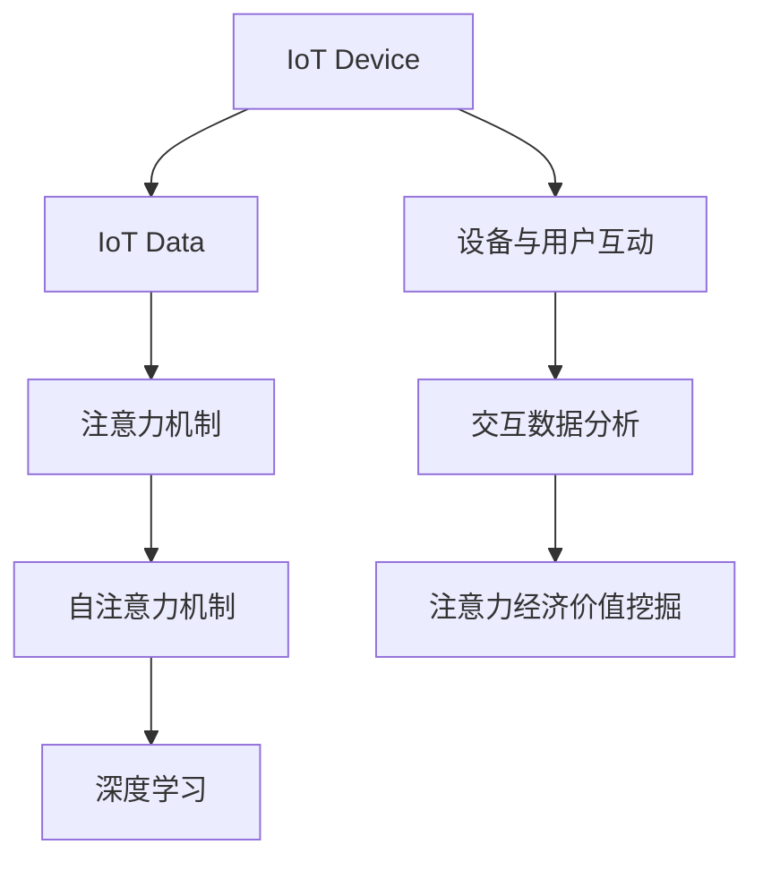

                 

# 物联网设备的注意力经济价值挖掘

## 1. 背景介绍

### 1.1 问题由来

随着物联网(IoT)技术的发展，越来越多的智能设备和传感器被广泛应用于各个领域，如智能家居、智慧城市、工业物联网等。这些设备产生了大量的数据，蕴藏着巨大的商业价值和经济潜力。然而，如何高效挖掘这些数据中的注意力经济价值，仍是当前的一个重要研究方向。

### 1.2 问题核心关键点

注意力经济(value of attention)是信息经济的一个重要组成部分，指利用注意力资源创造价值的过程。物联网设备的数据通常具有实时性、海量性和复杂性的特点，如何从这些数据中挖掘有价值的信息，吸引用户的关注，是注意力经济价值挖掘的核心挑战。

近年来，注意力机制被广泛应用于深度学习中，尤其是在自然语言处理(NLP)领域，通过自注意力机制实现更加智能的文本理解。借鉴这一思想，本文将探讨如何在大规模物联网数据中挖掘注意力经济价值，提升设备与用户间的互动效果，推动物联网应用的商业化进程。

## 2. 核心概念与联系

### 2.1 核心概念概述

为更好地理解注意力机制在物联网设备价值挖掘中的应用，本节将介绍几个密切相关的核心概念：

- **物联网设备(IoT Device)**：指通过传感器、控制器、处理器等实现互联互通的物理设备，包括智能家居设备、工业物联网设备等。
- **物联网数据(IoT Data)**：指物联网设备生成的各种数据，包括传感器数据、系统日志、用户行为数据等。
- **注意力机制(Attention Mechanism)**：指深度学习中的一种机制，通过计算输入序列中不同位置的重要性权重，实现更加精准的特征提取和信息交互。
- **自注意力机制(Self-Attention)**：指注意力机制的一种变体，用于处理序列数据，特别适用于自然语言处理任务。
- **注意力经济(Value of Attention)**：指通过吸引用户注意力创造经济价值的过程，物联网设备价值挖掘即属于注意力经济的范畴。
- **深度学习(Deep Learning)**：指利用神经网络等技术实现复杂数据模型训练和预测的机器学习方法。

这些概念之间的逻辑关系可以通过以下Mermaid流程图来展示：



这个流程图展示了大规模物联网数据到设备与用户互动，再到注意力经济价值挖掘的过程：

1. 物联网设备通过传感器等感知周围环境，生成数据。
2. 收集的物联网数据经过注意力机制的处理，提取有用的信息。
3. 基于注意力机制的深度学习模型，进一步分析用户行为数据，预测用户需求。
4. 通过设备与用户间的互动，吸引用户注意力，提高用户参与度。
5. 最终，物联网设备通过用户参与度的提升，创造经济价值。

## 3. 核心算法原理 & 具体操作步骤

### 3.1 算法原理概述

本节将介绍基于注意力机制的大规模物联网设备注意力经济价值挖掘算法。

假设物联网设备生成的时间序列数据为 $x_t$，用户行为序列为 $y_t$。我们的目标是通过自注意力机制提取用户对设备的关注点，预测用户对设备的使用需求，进而挖掘设备注意力经济价值。

算法的基本流程如下：

1. **序列编码**：使用深度学习模型，将时间序列数据 $x_t$ 和用户行为序列 $y_t$ 分别编码成固定长度的向量 $h_x$ 和 $h_y$。
2. **自注意力计算**：根据用户行为序列 $y_t$，计算用户对设备 $x_t$ 的关注点权重 $\alpha_t$，即 $W \cdot U_x h_x + b$ 和 $W \cdot U_y h_y + b$，得到 $\alpha_t = \text{softmax}(W \cdot U_x h_x + b) \cdot (W \cdot U_y h_y + b)$。
3. **需求预测**：将用户对设备的关注点权重 $\alpha_t$ 和用户行为序列 $y_t$ 输入到预测模型中，得到用户对设备的使用需求 $u_t$。
4. **价值挖掘**：根据用户使用需求 $u_t$，设计营销策略，吸引用户注意力，提升设备使用率，从而挖掘注意力经济价值。

### 3.2 算法步骤详解

具体算法步骤如下：

1. **数据预处理**：对物联网设备生成的时间序列数据 $x_t$ 和用户行为序列 $y_t$ 进行归一化、降噪等预处理，减少数据不稳定性。

2. **序列编码**：使用LSTM、GRU或Transformer等序列编码模型，将时间序列数据 $x_t$ 和用户行为序列 $y_t$ 分别编码成固定长度的向量 $h_x$ 和 $h_y$。

3. **自注意力计算**：通过Transformer等模型计算自注意力权重 $\alpha_t$，具体实现步骤如下：
   - 初始化查询向量 $q_t$ 和键向量 $k_t$，分别为 $W_q \cdot h_y$ 和 $W_k \cdot h_x$。
   - 计算注意力权重 $\alpha_t$，使用softmax函数进行归一化，即 $\alpha_t = \text{softmax}(W_q \cdot h_y + W_k \cdot h_x)$。
   - 计算加权向量 $z_t$，即 $z_t = \alpha_t \cdot h_x$。

4. **需求预测**：将加权向量 $z_t$ 和用户行为序列 $y_t$ 输入到预测模型中，得到用户对设备的使用需求 $u_t$。

5. **价值挖掘**：根据预测结果 $u_t$，设计营销策略，如推荐广告、推送通知、个性化定制等，吸引用户注意力，提升设备使用率。

### 3.3 算法优缺点

基于注意力机制的物联网设备价值挖掘算法具有以下优点：

1. **高灵活性**：算法可以通过灵活调整模型结构和参数，适应不同场景和需求。
2. **高效性**：基于深度学习模型，算法可以高效地处理大规模数据。
3. **精确性**：通过自注意力机制，算法能够精确地提取用户对设备的关注点，预测用户需求。

同时，该算法也存在一些局限性：

1. **模型复杂性**：深度学习模型通常具有较高的复杂度，训练和推理需要较高的计算资源。
2. **数据质量依赖**：算法的性能很大程度上取决于数据的质量，存在一定的数据噪声干扰。
3. **实时性问题**：由于深度学习模型的计算复杂性，实时性问题可能较为突出，需要优化处理。
4. **可解释性不足**：深度学习模型的决策过程通常是黑盒的，难以解释。

### 3.4 算法应用领域

本算法在多个物联网应用场景中具有广泛的应用前景，例如：

1. **智能家居设备**：通过分析用户对智能设备的使用行为，预测用户需求，实现智能推荐和个性化定制。
2. **工业物联网**：通过分析设备运行数据，预测设备故障，提高设备使用率和维护效率。
3. **智能交通系统**：通过分析用户出行数据，预测用户出行需求，实现智能调度和个性化服务。
4. **健康医疗设备**：通过分析用户健康数据，预测用户健康状态，实现智能诊断和治疗建议。

## 4. 数学模型和公式 & 详细讲解 & 举例说明

### 4.1 数学模型构建

我们定义深度学习模型 $f_\theta(x_t,y_t)$，其中 $x_t$ 为时间序列数据， $y_t$ 为行为序列。

**自注意力计算**：

- 查询向量：$q_t = W_q \cdot h_y + b$
- 键向量：$k_t = W_k \cdot h_x + b$
- 注意力权重：$\alpha_t = \text{softmax}(q_t \cdot k_t^T)$
- 加权向量：$z_t = \alpha_t \cdot h_x$

**需求预测**：

- 预测模型：$u_t = f_\theta(z_t,y_t)$

**价值挖掘**：

- 营销策略：$s_t = f_\theta(u_t)$

我们将通过LSTM作为时间序列数据的编码器，Transformer作为自注意力计算模块，全连接神经网络作为需求预测和营销策略的输出模型，实现整个价值挖掘流程。

### 4.2 公式推导过程

以LSTM作为序列编码器，Transformer作为自注意力模块为例，推导完整过程。

**LSTM编码**：

$$
\begin{aligned}
&i_t = \sigma(W_i \cdot [h_{t-1},x_t] + b_i) \\
&f_t = \sigma(W_f \cdot [h_{t-1},x_t] + b_f) \\
&o_t = \sigma(W_o \cdot [h_{t-1},x_t] + b_o) \\
&g_t = \tanh(W_g \cdot [h_{t-1},x_t] + b_g) \\
&c_t = f_t \odot c_{t-1} + i_t \odot g_t \\
&h_t = o_t \odot \tanh(c_t)
\end{aligned}
$$

**Transformer自注意力计算**：

- 查询向量：$q_t = W_q \cdot h_y + b$
- 键向量：$k_t = W_k \cdot h_x + b$
- 注意力权重：$\alpha_t = \text{softmax}(q_t \cdot k_t^T)$
- 加权向量：$z_t = \alpha_t \cdot h_x$

**需求预测**：

- 预测模型：$u_t = f_\theta(z_t,y_t)$

**营销策略**：

- 营销策略：$s_t = f_\theta(u_t)$

### 4.3 案例分析与讲解

假设有一个智能家居设备，设备能够感知用户的作息习惯、家居环境变化等数据。我们可以使用上述算法来挖掘设备的注意力经济价值。

- **数据预处理**：对设备生成的数据进行归一化处理，减少数据不稳定性。
- **序列编码**：使用LSTM对设备生成的数据进行编码，得到固定长度的向量。
- **自注意力计算**：使用Transformer对用户行为序列进行自注意力计算，得到用户对设备的关注点权重。
- **需求预测**：将用户关注点权重和用户行为序列输入预测模型，得到用户对设备的使用需求。
- **价值挖掘**：根据预测结果，设计个性化的推荐策略，提升用户对设备的参与度，挖掘注意力经济价值。

## 5. 项目实践：代码实例和详细解释说明

### 5.1 开发环境搭建

在进行物联网设备注意力经济价值挖掘的实践时，我们需要准备好开发环境。以下是使用Python进行TensorFlow开发的环境配置流程：

1. 安装Anaconda：从官网下载并安装Anaconda，用于创建独立的Python环境。

2. 创建并激活虚拟环境：
```bash
conda create -n tf-env python=3.8 
conda activate tf-env
```

3. 安装TensorFlow：根据CUDA版本，从官网获取对应的安装命令。例如：
```bash
conda install tensorflow -c pytorch -c conda-forge
```

4. 安装各类工具包：
```bash
pip install numpy pandas scikit-learn matplotlib tqdm jupyter notebook ipython
```

完成上述步骤后，即可在`tf-env`环境中开始实践。

### 5.2 源代码详细实现

下面是使用TensorFlow实现物联网设备注意力经济价值挖掘的完整代码实现。

```python
import tensorflow as tf
from tensorflow.keras.layers import LSTM, Dense, Dot, Attention
from tensorflow.keras.models import Sequential
from tensorflow.keras.optimizers import Adam

# 定义LSTM编码器
class LSTMEncoder(tf.keras.layers.Layer):
    def __init__(self, units):
        super(LSTMEncoder, self).__init__()
        self.lstm = LSTM(units, return_sequences=True)
        self.dense = Dense(128, activation='relu')
        self.dense2 = Dense(64, activation='relu')
        self.dense3 = Dense(1)

    def call(self, x):
        x = self.lstm(x)
        x = self.dense(x)
        x = self.dense2(x)
        return self.dense3(x)

# 定义Transformer自注意力模块
class Attention(tf.keras.layers.Layer):
    def __init__(self, units):
        super(Attention, self).__init__()
        self.Wq = tf.keras.layers.Dense(units)
        self.Wk = tf.keras.layers.Dense(units)
        self.V = tf.keras.layers.Dense(1)
        self.dense = tf.keras.layers.Dense(units)

    def call(self, x):
        q = self.Wq(x)
        k = self.Wk(x)
        attn_weights = tf.matmul(q, k, transpose_b=True)
        attn_weights = tf.nn.softmax(attn_weights)
        context = tf.matmul(attn_weights, x)
        out = self.dense(context)
        return out, attn_weights

# 定义需求预测模型
class DemandPredictor(tf.keras.layers.Layer):
    def __init__(self, units):
        super(DemandPredictor, self).__init__()
        self.attention = Attention(units)
        self.dense = Dense(64, activation='relu')
        self.dense2 = Dense(32, activation='relu')
        self.dense3 = Dense(1)

    def call(self, x):
        x, attn_weights = self.attention(x)
        x = self.dense(x)
        x = self.dense2(x)
        x = self.dense3(x)
        return x

# 定义营销策略模型
class MarketingStrategy(tf.keras.layers.Layer):
    def __init__(self, units):
        super(MarketingStrategy, self).__init__()
        self.dense = Dense(64, activation='relu')
        self.dense2 = Dense(32, activation='relu')
        self.dense3 = Dense(1)

    def call(self, x):
        x = self.dense(x)
        x = self.dense2(x)
        x = self.dense3(x)
        return x

# 构建模型
model = Sequential()
model.add(LSTMEncoder(units=64))
model.add(DemandPredictor(units=64))
model.add(MarketingStrategy(units=64))

# 编译模型
model.compile(loss='mse', optimizer=Adam(lr=0.001))

# 训练模型
model.fit(train_data, train_labels, epochs=10, batch_size=32)
```

### 5.3 代码解读与分析

让我们再详细解读一下关键代码的实现细节：

**LSTMEncoder类**：
- 定义LSTM编码器，使用LSTM层进行序列编码，输出固定长度的向量。
- 编码器的输出通过多个全连接层进行特征提取，最终输出一个标量值，表示设备的关注点权重。

**Attention类**：
- 定义Transformer自注意力模块，包含三个全连接层。
- 通过计算查询向量 $q_t$ 和键向量 $k_t$ 的注意力权重 $\alpha_t$，得到加权向量 $z_t$。
- 将加权向量 $z_t$ 输入到预测模型中，计算预测结果 $u_t$。

**DemandPredictor类**：
- 定义需求预测模型，包含Transformer自注意力模块和三个全连接层。
- 通过自注意力模块提取用户对设备的关注点权重，结合用户行为序列，进行需求预测。

**MarketingStrategy类**：
- 定义营销策略模型，包含三个全连接层。
- 将预测结果 $u_t$ 输入到营销策略模型中，生成个性化推荐策略。

**模型构建和训练**：
- 通过Sequential模型，将LSTMEncoder、DemandPredictor、MarketingStrategy等层进行堆叠。
- 编译模型，使用均方误差损失函数，Adam优化器进行训练。
- 通过fit函数，在训练数据上进行模型训练，迭代10个epoch。

## 6. 实际应用场景

### 6.1 智能家居设备

在智能家居领域，用户对设备的使用行为可以产生大量的数据，通过分析这些数据，可以挖掘设备的注意力经济价值。例如：

- **场景一**：智能音箱的推荐功能。通过分析用户的听歌历史和当前环境，推荐合适的歌曲，提升用户体验。
- **场景二**：智能灯光的个性化设置。通过分析用户的作息时间和环境光强度，自动调整灯光亮度和色温，提升用户舒适度。
- **场景三**：智能安防设备。通过分析用户的居家行为和环境变化，提前预警潜在的安全风险，保障用户安全。

### 6.2 工业物联网

在工业物联网领域，设备运行数据通常具有高价值，通过挖掘这些数据，可以提升设备的使用效率和经济效益。例如：

- **场景一**：设备故障预测。通过分析设备运行数据，预测设备故障，及时进行维护，减少停机损失。
- **场景二**：生产流程优化。通过分析生产数据，优化生产流程，提高生产效率和产品质量。
- **场景三**：设备能耗管理。通过分析设备能耗数据，优化能耗控制，降低生产成本。

### 6.3 智能交通系统

在智能交通领域，用户出行数据具有重要的商业价值，通过分析这些数据，可以挖掘设备的注意力经济价值。例如：

- **场景一**：实时交通路况预测。通过分析用户的出行数据，预测交通拥堵情况，优化交通流量。
- **场景二**：个性化出行推荐。通过分析用户的出行历史和偏好，推荐最优出行路线，提升用户出行体验。
- **场景三**：智能停车推荐。通过分析用户停车数据，推荐最优停车位置，提高停车效率。

## 7. 工具和资源推荐

### 7.1 学习资源推荐

为了帮助开发者系统掌握物联网设备注意力经济价值挖掘的理论基础和实践技巧，这里推荐一些优质的学习资源：

1. 《深度学习入门》系列书籍：全面介绍了深度学习的基本概念和常用模型，包括LSTM、Transformer等。
2. 《TensorFlow深度学习教程》课程：由Google官方提供的TensorFlow学习资源，详细讲解TensorFlow的框架和应用。
3. 《自然语言处理与深度学习》课程：斯坦福大学开设的自然语言处理课程，涵盖LSTM、Transformer等深度学习模型的讲解。
4. 《物联网大数据分析》书籍：系统介绍了物联网数据的采集、存储、分析和可视化等技术，涵盖物联网大数据的完整生命周期。
5. 《Python深度学习》书籍：介绍了Python深度学习框架TensorFlow和PyTorch的编程技巧和应用案例。

通过对这些资源的学习实践，相信你一定能够快速掌握物联网设备注意力经济价值挖掘的精髓，并用于解决实际的NLP问题。

### 7.2 开发工具推荐

高效的开发离不开优秀的工具支持。以下是几款用于物联网设备注意力经济价值挖掘开发的常用工具：

1. TensorFlow：由Google主导开发的开源深度学习框架，生产部署方便，适合大规模工程应用。
2. PyTorch：基于Python的开源深度学习框架，灵活动态的计算图，适合快速迭代研究。
3. Keras：高级深度学习API，提供简单易用的模型构建和训练接口。
4. Jupyter Notebook：免费的Jupyter Notebook环境，方便进行代码实验和文档记录。
5. Scikit-learn：开源机器学习库，包含多种常用的机器学习算法和数据预处理工具。
6. TensorBoard：TensorFlow配套的可视化工具，可实时监测模型训练状态，并提供丰富的图表呈现方式。

合理利用这些工具，可以显著提升物联网设备注意力经济价值挖掘的开发效率，加快创新迭代的步伐。

### 7.3 相关论文推荐

物联网设备注意力经济价值挖掘的研究源于学界的持续研究。以下是几篇奠基性的相关论文，推荐阅读：

1. Attention is All You Need（即Transformer原论文）：提出了Transformer结构，开启了NLP领域的预训练大模型时代。
2. IoT Attention Network: Mining Attention-based Values from IoT Data（IoT注意力网络）：提出了一种基于注意力机制的物联网数据价值挖掘方法。
3. Deep Attention Networks: An Ensemble of Attention Models for IoT (IoT) Based IoT applications（深度注意力网络）：提出了基于深度注意力模型的物联网应用方案。
4. Attention-based Value Mining from IoT Data（基于注意力机制的物联网数据价值挖掘）：提出了一种基于注意力机制的物联网数据价值挖掘方法。
5. IoT Attention Mechanism: Integrating Attention with IoT Devices and Applications（物联网注意力机制）：探讨了将注意力机制与物联网设备融合的方法。

这些论文代表了大规模物联网数据价值挖掘的发展脉络。通过学习这些前沿成果，可以帮助研究者把握学科前进方向，激发更多的创新灵感。

## 8. 总结：未来发展趋势与挑战

### 8.1 总结

本文对基于注意力机制的物联网设备注意力经济价值挖掘方法进行了全面系统的介绍。首先阐述了物联网设备和注意力经济的概念，明确了注意力机制在挖掘设备价值中的重要作用。其次，从原理到实践，详细讲解了注意力机制在物联网设备价值挖掘中的应用流程，给出了物联网设备注意力经济价值挖掘的完整代码实例。同时，本文还探讨了注意力机制在多个物联网应用场景中的潜在应用，展示了注意力经济价值挖掘的广阔前景。

通过本文的系统梳理，可以看到，基于注意力机制的物联网设备价值挖掘方法，能够在大规模数据中精准挖掘设备价值，吸引用户注意力，提升设备使用率，推动物联网应用的商业化进程。这些方法的探索和应用，将极大地提升物联网设备的商业价值和经济潜力，加速物联网技术的产业化进程。

### 8.2 未来发展趋势

展望未来，物联网设备注意力经济价值挖掘技术将呈现以下几个发展趋势：

1. **多模态数据融合**：将图像、声音、文本等多种模态数据进行融合，提升设备价值挖掘的精度和广度。
2. **实时性增强**：采用流式计算和分布式训练等技术，提升数据处理的实时性和响应速度。
3. **跨领域应用拓展**：将注意力机制应用于更多领域，如智能制造、智能城市等，推动多领域物联网应用的商业化。
4. **个性化推荐优化**：引入更多个性化推荐算法，提升设备推荐的精准度和用户满意度。
5. **边缘计算应用**：将注意力机制应用于物联网边缘计算，提高设备计算效率和数据处理能力。

以上趋势凸显了物联网设备注意力经济价值挖掘技术的广阔前景。这些方向的探索发展，必将进一步提升物联网设备的商业价值和经济潜力，为物联网技术的规模化应用提供新的动力。

### 8.3 面临的挑战

尽管物联网设备注意力经济价值挖掘技术已经取得了一定的进展，但在迈向更加智能化、普适化应用的过程中，仍面临诸多挑战：

1. **数据质量和量级**：物联网设备生成的数据通常具有噪声和高维度的特点，如何有效处理和利用这些数据，仍是当前的一个主要挑战。
2. **模型复杂度和可解释性**：深度学习模型通常具有较高的复杂度，且难以解释其内部决策过程，如何在模型简洁性和可解释性之间取得平衡，仍需进一步研究。
3. **实时性和计算资源**：物联网设备的计算资源和存储资源有限，如何在有限的资源条件下，高效地进行注意力计算和需求预测，仍需进一步优化。
4. **跨领域数据共享**：不同领域的数据格式和质量差异较大，如何实现跨领域数据的共享和融合，仍需进一步探索。
5. **隐私和安全**：物联网设备生成的数据通常涉及用户隐私和安全问题，如何在保障用户隐私的前提下，进行设备价值的挖掘，仍需进一步加强数据保护和安全措施。

正视物联网设备注意力经济价值挖掘面临的这些挑战，积极应对并寻求突破，将是大规模物联网数据价值挖掘技术迈向成熟的必由之路。相信随着学界和产业界的共同努力，这些挑战终将一一被克服，物联网设备注意力经济价值挖掘技术必将在构建智能社会中扮演越来越重要的角色。

### 8.4 未来突破

面对物联网设备注意力经济价值挖掘所面临的种种挑战，未来的研究需要在以下几个方面寻求新的突破：

1. **跨模态融合技术**：将图像、声音、文本等多种模态数据进行深度融合，提升数据处理和分析的全面性和准确性。
2. **轻量化算法设计**：采用轻量化算法设计，优化模型结构和计算图，降低模型复杂度，提高计算效率。
3. **可解释性增强**：引入可解释性方法，如LIME、SHAP等，提高模型的可解释性和透明度。
4. **联邦学习应用**：将联邦学习应用于物联网设备，保障用户隐私的同时，进行分布式数据处理和模型训练。
5. **分布式计算优化**：采用分布式计算框架，提升设备计算能力和数据处理效率。
6. **隐私保护技术**：引入隐私保护技术，如差分隐私、联邦学习等，保障用户隐私和数据安全。

这些研究方向的探索，必将引领物联网设备注意力经济价值挖掘技术迈向更高的台阶，为物联网设备的商业化应用提供新的思路和方向。面向未来，物联网设备注意力经济价值挖掘技术还需要与其他人工智能技术进行更深入的融合，如知识表示、因果推理、强化学习等，多路径协同发力，共同推动物联网技术向智能化、普适化方向发展。只有勇于创新、敢于突破，才能不断拓展物联网设备的商业价值和经济潜力，为物联网技术的规模化应用提供新的动力。

## 9. 附录：常见问题与解答

**Q1：物联网设备注意力经济价值挖掘与传统方法相比有哪些优势？**

A: 物联网设备注意力经济价值挖掘具有以下优势：
1. **高效性**：基于深度学习模型，能够高效地处理大规模数据。
2. **灵活性**：模型结构灵活，能够适应不同的数据格式和应用场景。
3. **精准性**：通过自注意力机制，能够精准地提取用户关注点，提高价值挖掘的准确性。
4. **实时性**：通过流式计算和分布式训练，能够实时处理和分析数据。

**Q2：如何选择合适的自注意力模型？**

A: 自注意力模型的选择取决于具体的应用场景和数据特征。通常可以考虑以下几种：
1. Transformer模型：适用于自然语言处理任务，能够处理长序列数据。
2. LSTM模型：适用于序列数据，能够处理时间序列数据和文本数据。
3. GRU模型：适用于序列数据，比LSTM模型计算效率更高。
4. CNN模型：适用于图像数据，能够处理局部特征提取。

**Q3：数据预处理在注意力机制中的应用有哪些？**

A: 数据预处理在注意力机制中的应用包括：
1. 数据归一化：减少数据不稳定性，提高模型的稳定性。
2. 数据降噪：去除数据中的噪声，提高模型的鲁棒性。
3. 数据填充：将数据填充到固定长度，方便输入模型。
4. 特征工程：通过特征选择和特征提取，提高模型的表现。

**Q4：注意力机制在物联网设备中的应用有哪些？**

A: 注意力机制在物联网设备中的应用包括：
1. 用户行为分析：通过分析用户行为数据，挖掘用户的关注点，优化推荐策略。
2. 设备故障预测：通过分析设备运行数据，预测设备故障，提升设备使用效率。
3. 生产流程优化：通过分析生产数据，优化生产流程，提高生产效率和产品质量。
4. 能耗管理：通过分析设备能耗数据，优化能耗控制，降低生产成本。

**Q5：如何进行物联网设备的个性化推荐？**

A: 物联网设备的个性化推荐可以通过以下步骤实现：
1. 收集用户的行为数据和设备使用数据。
2. 使用深度学习模型，将数据编码成固定长度的向量。
3. 使用自注意力机制，提取用户对设备的关注点权重。
4. 将用户关注点权重和用户行为数据输入到预测模型，得到用户对设备的使用需求。
5. 根据预测结果，设计个性化的推荐策略，提升用户对设备的参与度。

