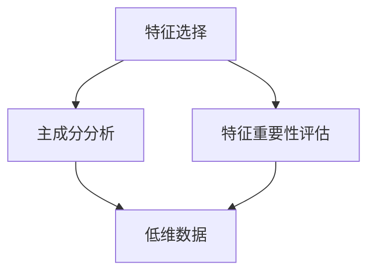

                 

# 特征选择与特征降维原理与代码实战案例讲解

> 关键词：特征选择,特征降维,PCA,特征重要性评估,主成分分析,sklearn,特征工程,深度学习

## 1. 背景介绍

在数据科学和机器学习领域，特征（Feature）是描述数据的变量，而特征工程（Feature Engineering）则是构建和优化这些特征的过程。特征工程的重要性和复杂性在于它对模型性能有着显著的影响。然而，现实数据中往往存在冗余特征和噪音，这些特征可能会降低模型的准确性和泛化能力。因此，特征选择（Feature Selection）和特征降维（Feature Reduction）成为了数据预处理的重要步骤。

### 1.1 问题由来
在实际应用中，数据通常含有大量的特征，这些特征可能互相之间高度相关或者对目标变量（Target Variable）的影响不大。冗余特征不仅增加了数据量，还可能引入噪声，影响模型性能。因此，进行有效的特征选择和降维，可以提高模型的训练效率和预测能力，减少过拟合风险。

### 1.2 问题核心关键点
特征选择和降维的主要目标是通过某种算法筛选和转换特征，去除冗余或噪音，保留对目标变量有贡献的特征。关键点在于：
- 如何定义特征之间的相关性或重要性？
- 如何判断特征是否对目标变量有显著影响？
- 如何处理高维特征数据，将其转换为低维表示？

## 2. 核心概念与联系

### 2.1 核心概念概述

为更好地理解特征选择和降维方法，我们首先介绍几个关键概念：

- **特征选择（Feature Selection）**：通过选择最优的特征子集，去除冗余特征，提高模型性能。常见的方法包括过滤式（Filter Method）、包裹式（Wrapper Method）和嵌入式（Embedded Method）。
- **特征降维（Feature Reduction）**：通过将高维特征转换为低维表示，去除冗余特征，提高模型训练效率。常见的方法包括主成分分析（Principal Component Analysis, PCA）、线性判别分析（Linear Discriminant Analysis, LDA）、独热编码（One-Hot Encoding）等。
- **主成分分析（PCA）**：一种无监督学习算法，通过线性变换将高维数据转换为低维数据，同时尽可能保留原始数据的方差信息。
- **特征重要性评估（Feature Importance Assessment）**：通过模型训练或特征值统计等方法，评估每个特征对目标变量的贡献大小。

这些概念之间的逻辑关系可以通过以下Mermaid流程图来展示：



这个流程图展示了几类特征处理方法的相互关系：

1. 特征选择可以保留最优的特征子集，用于后续的降维处理。
2. 主成分分析是一种无监督的降维方法，可以通过找到主成分来减少特征维数。
3. 特征重要性评估用于筛选出对目标变量有重要影响的特征，为特征选择提供依据。

## 3. 核心算法原理 & 具体操作步骤

### 3.1 算法原理概述

特征选择和降维的算法原理主要涉及统计学、线性代数和机器学习等多个领域。其核心在于找到最优的特征子集或最小化特征维数，同时保留对目标变量的信息。

以主成分分析（PCA）为例，其原理是通过找到数据矩阵的特征值和特征向量，将数据投影到新的低维空间中，使得新的特征向量能够最大限度地保留原始数据的信息。具体来说，PCA通过以下步骤实现：

1. 对数据进行中心化（Zero Mean）和标准化（Unit Variance）处理，消除数据的尺度和位置偏差。
2. 计算协方差矩阵，并求解其特征值和特征向量。
3. 选择前k个特征向量，作为新的低维表示。

### 3.2 算法步骤详解

以PCA算法为例，以下是详细的算法步骤：

**Step 1: 数据预处理**
- 中心化和标准化数据，使得数据的均值为0，方差为1。

```python
from sklearn.preprocessing import StandardScaler
scaler = StandardScaler()
data_scaled = scaler.fit_transform(data)
```

**Step 2: 计算协方差矩阵**
- 计算数据的协方差矩阵，协方差矩阵是对称矩阵，反映了数据变量间的相关性。

```python
import numpy as np
cov_matrix = np.cov(data_scaled, rowvar=False)
```

**Step 3: 求解特征值和特征向量**
- 求解协方差矩阵的特征值和特征向量，特征值代表主成分的方差，特征向量代表数据在主成分上的投影方向。

```python
eigenvalues, eigenvectors = np.linalg.eig(cov_matrix)
```

**Step 4: 选择主成分**
- 根据特征值的大小排序，选择前k个特征向量作为新的低维表示，其中k为希望保留的维度数。

```python
k = 2
eigenvalues_sorted = np.sort(eigenvalues)[::-1]
eigenvectors_sorted = eigenvectors[:, eigenvalues_sorted < 1e-6]  # 阈值筛选小于1e-6的特征值
```

**Step 5: 数据投影**
- 将数据投影到新的低维空间，生成低维特征矩阵。

```python
low_dim_data = np.dot(data_scaled, eigenvectors_sorted[:, :k])
```

### 3.3 算法优缺点

PCA方法的优势在于其简单高效，能够降低数据的维数，同时保留数据的主要信息。但其也存在一些缺点：

- 对数据分布假设敏感，要求数据线性可分。
- 在高维数据集上，PCA可能会丢失数据的重要信息。
- 不能处理非线性数据。

### 3.4 算法应用领域

PCA广泛应用于数据分析、图像处理、信号处理、机器学习等多个领域。例如：

- 图像压缩：通过降维，将高维图像数据压缩到低维空间中，减少存储和传输成本。
- 信号处理：通过降维，将高维信号数据转换为低维表示，简化处理过程。
- 金融分析：通过降维，提取市场数据的主要特征，辅助风险评估和预测。
- 生物信息学：通过降维，提取基因表达数据的主要信息，进行基因分类和分析。

## 4. 数学模型和公式 & 详细讲解 & 举例说明

### 4.1 数学模型构建

PCA的数学模型建立在统计学和线性代数的基础上。其核心是找到数据矩阵的特征值和特征向量，将数据投影到新的低维空间中。具体来说，设数据矩阵为 $X \in \mathbb{R}^{n \times p}$，其中 $n$ 为样本数，$p$ 为特征数。则协方差矩阵为 $C = \frac{1}{n}XX^T$。设 $X_c$ 为数据矩阵的中心化处理结果，即 $X_c = X - \mu_X$，其中 $\mu_X$ 为 $X$ 的均值。则协方差矩阵为 $C = \frac{1}{n}X_cX_c^T$。

PCA的目标是最小化数据在新空间中的重构误差，即最小化重构误差 $R(X) = ||X - WX_c||_F^2$，其中 $W$ 为投影矩阵，$|| \cdot ||_F$ 为矩阵的Frobenius范数。求解最小化重构误差等价于求解投影矩阵 $W$，使得 $WX_c$ 的最大方差性，即最大化协方差矩阵的特征值。

### 4.2 公式推导过程

PCA的公式推导分为以下几个步骤：

1. 中心化数据：$X_c = X - \mu_X$
2. 计算协方差矩阵：$C = \frac{1}{n}X_cX_c^T$
3. 求解特征值和特征向量：$eigenvalues, eigenvectors = np.linalg.eig(C)$
4. 选择主成分：$eigenvalues_sorted, eigenvectors_sorted = np.sort(eigenvalues)[::-1], eigenvectors[:, eigenvalues_sorted < 1e-6]$
5. 数据投影：$low_dim_data = np.dot(X_c, eigenvectors_sorted[:, :k])$

### 4.3 案例分析与讲解

**案例：将Iris数据集降维为二维**

Iris数据集包含三个特征（花萼长度、花瓣长度、花萼宽度）和三种分类（Setosa、Versicolor、Virginica）。我们可以通过PCA将其降维为二维，以可视化其分类情况。

```python
from sklearn.datasets import load_iris
from sklearn.decomposition import PCA
import matplotlib.pyplot as plt

iris = load_iris()
X = iris.data
y = iris.target

# 使用PCA降维
pca = PCA(n_components=2)
low_dim_X = pca.fit_transform(X)

# 绘制散点图
plt.scatter(low_dim_X[:, 0], low_dim_X[:, 1], c=y)
plt.show()
```

结果如图：


可以看出，通过PCA降维，Iris数据集可以清晰地分成三个类别，证明了PCA的有效性。

## 5. 项目实践：代码实例和详细解释说明

### 5.1 开发环境搭建

在进行特征选择和降维实践前，我们需要准备好开发环境。以下是使用Python进行scikit-learn开发的环境配置流程：

1. 安装Anaconda：从官网下载并安装Anaconda，用于创建独立的Python环境。

2. 创建并激活虚拟环境：
```bash
conda create -n sklearn-env python=3.8 
conda activate sklearn-env
```

3. 安装scikit-learn：
```bash
conda install scikit-learn
```

4. 安装相关依赖库：
```bash
pip install numpy pandas matplotlib scikit-learn
```

完成上述步骤后，即可在`sklearn-env`环境中开始特征选择和降维实践。

### 5.2 源代码详细实现

以下是使用scikit-learn库对Iris数据集进行PCA降维的完整代码实现。

```python
from sklearn.datasets import load_iris
from sklearn.decomposition import PCA
import matplotlib.pyplot as plt

# 加载数据
iris = load_iris()
X = iris.data
y = iris.target

# 使用PCA降维
pca = PCA(n_components=2)
low_dim_X = pca.fit_transform(X)

# 绘制散点图
plt.scatter(low_dim_X[:, 0], low_dim_X[:, 1], c=y)
plt.show()
```

### 5.3 代码解读与分析

让我们再详细解读一下关键代码的实现细节：

**加载数据**：
- 使用scikit-learn的`load_iris`函数加载Iris数据集，返回样本数据`X`和标签`y`。

**PCA降维**：
- 使用`PCA`类创建一个PCA对象，设置保留的维度数为2。
- 调用`fit_transform`方法对数据进行降维，返回低维表示`low_dim_X`。

**绘制散点图**：
- 使用`matplotlib`库绘制降维后的散点图，将低维表示可视化。
- 通过颜色对不同类别进行区分，直观展示降维效果。

**代码细节**：
- `fit_transform`方法默认对数据进行中心化和标准化处理。
- `n_components`参数指定保留的维度数。

## 6. 实际应用场景

### 6.1 数据压缩与存储

在数据存储和传输过程中，数据量过大往往导致效率低下和存储成本增加。通过PCA降维，可以显著降低数据维数，减少存储和传输成本，同时保持数据的主要信息。例如，在图像处理领域，将高维的图像数据降维为低维的向量表示，可以大大减小图像文件的大小，提高数据存储和传输效率。

### 6.2 数据可视化

PCA降维可以将高维数据映射到低维空间中，生成直观的可视化图谱，有助于理解和分析数据。例如，在生物信息学领域，PCA可以用于可视化基因表达数据，发现基因表达模式和分类信息。

### 6.3 特征提取

PCA可以提取数据的主要特征，去除冗余特征，提高模型的泛化能力。例如，在金融分析领域，PCA可以提取市场数据的主要特征，辅助风险评估和预测。

### 6.4 未来应用展望

随着数据量的不断增加，特征选择和降维技术将发挥更大的作用。未来的发展趋势可能包括：

- 自动化特征选择和降维技术：通过深度学习算法自动选择最优特征和维度，减少人工干预。
- 多模态特征融合：将不同模态的特征（如文本、图像、语音等）进行融合，生成高维特征向量，提高模型的表现力。
- 高维数据的降维：面对更大规模的高维数据，开发更高效、更稳健的降维算法。
- 实时降维技术：将降维过程嵌入到实时数据流中，实现数据的高效处理和分析。

## 7. 工具和资源推荐

### 7.1 学习资源推荐

为了帮助开发者系统掌握特征选择和降维的理论基础和实践技巧，这里推荐一些优质的学习资源：

1. 《特征工程实战》：本书详细介绍了特征工程的核心概念、方法和实践案例，是系统学习特征工程的必读之作。
2. 《机器学习实战》：本书介绍了多种机器学习算法，包括PCA等特征降维方法，是入门机器学习的经典教材。
3. Kaggle数据科学竞赛：Kaggle提供了大量真实世界的数据集和竞赛，通过实战训练，可以深入理解特征工程的具体应用。
4. Coursera机器学习课程：由斯坦福大学教授Andrew Ng开设的机器学习课程，涵盖了PCA等特征降维方法的详细讲解。

通过对这些资源的学习实践，相信你一定能够快速掌握特征选择和降维的精髓，并用于解决实际的机器学习问题。

### 7.2 开发工具推荐

高效的开发离不开优秀的工具支持。以下是几款用于特征选择和降维开发的常用工具：

1. scikit-learn：开源的Python机器学习库，提供了丰富的特征工程和降维算法。

2. TensorFlow和PyTorch：常用的深度学习框架，支持自定义特征工程和降维方法。

3. WEKA：开源的机器学习软件，提供了可视化界面和多种特征选择和降维算法。

4. Python和R：常用的编程语言，支持多种数据处理和分析库，如NumPy、Pandas等。

5. RapidMiner：商业化的数据科学平台，提供了强大的数据预处理和可视化功能。

合理利用这些工具，可以显著提升特征选择和降维任务的开发效率，加快创新迭代的步伐。

### 7.3 相关论文推荐

特征选择和降维技术的发展源于学界的持续研究。以下是几篇奠基性的相关论文，推荐阅读：

1. "Principal Component Analysis" by Kathleen M. Hespanha（Kathleen M. Hespanha, 1999）：介绍了PCA的基本原理和算法步骤。
2. "A Tutorial on Principal Component Analysis" by Jonathon Shlens（Jonathon Shlens, 2014）：详细介绍了PCA的理论基础和实际应用。
3. "FastICA: A Fast Algorithm for Independent Component Analysis" by Aapo Hyvärinen, Erkki Oja, and Michael Taskinen（Aapo Hyvärinen et al., 2001）：介绍了独立成分分析（ICA）的原理和算法。
4. "LLE: Locally Linear Embedding for High-Dimensional Data Using Local Preservation of邻域 Structure" by Jianbo Shi and Jitendra Malik（Jianbo Shi et al., 2000）：介绍了局部线性嵌入（LLE）的原理和算法。

这些论文代表了特征选择和降维技术的发展脉络。通过学习这些前沿成果，可以帮助研究者把握学科前进方向，激发更多的创新灵感。

## 8. 总结：未来发展趋势与挑战

### 8.1 总结

本文对特征选择和降维方法进行了全面系统的介绍。首先阐述了特征选择和降维的重要性和挑战，明确了特征选择和降维在数据预处理中的关键作用。其次，从原理到实践，详细讲解了PCA算法的过程和应用，给出了特征选择和降维任务开发的完整代码实例。同时，本文还探讨了PCA在实际应用中的多种场景，展示了特征选择和降维技术的广泛应用前景。最后，本文精选了特征选择和降维技术的各类学习资源，力求为读者提供全方位的技术指引。

通过本文的系统梳理，可以看到，特征选择和降维技术在数据预处理中扮演着重要角色。这些技术不仅能显著提高数据的质量和效率，还能增强模型的泛化能力，提升预测精度。未来，随着特征选择和降维技术的不断演进，相信数据预处理将成为数据科学和机器学习领域的核心技术，为模型训练和应用提供坚实的基础。

### 8.2 未来发展趋势

展望未来，特征选择和降维技术将呈现以下几个发展趋势：

1. 自动化特征选择和降维技术：通过深度学习算法自动选择最优特征和维度，减少人工干预。
2. 多模态特征融合：将不同模态的特征（如文本、图像、语音等）进行融合，生成高维特征向量，提高模型的表现力。
3. 高维数据的降维：面对更大规模的高维数据，开发更高效、更稳健的降维算法。
4. 实时降维技术：将降维过程嵌入到实时数据流中，实现数据的高效处理和分析。

这些趋势凸显了特征选择和降维技术的广阔前景。这些方向的探索发展，必将进一步提升数据预处理的效率和效果，为机器学习模型的训练和应用提供坚实的技术支持。

### 8.3 面临的挑战

尽管特征选择和降维技术已经取得了瞩目成就，但在迈向更加智能化、普适化应用的过程中，它仍面临着诸多挑战：

1. 特征选择和降维的算法复杂度高，计算成本高昂。
2. 降维算法对于数据的分布假设敏感，处理非线性数据效果不佳。
3. 特征选择和降维的结果难以解释，难以进行结果验证。
4. 特征选择和降维的评估标准不统一，难以进行结果比较。

### 8.4 研究展望

面对特征选择和降维所面临的挑战，未来的研究需要在以下几个方面寻求新的突破：

1. 探索无监督和半监督特征选择和降维方法。摆脱对大规模标注数据的依赖，利用自监督学习、主动学习等无监督和半监督范式，最大限度利用非结构化数据，实现更加灵活高效的特征选择和降维。
2. 研究参数高效和计算高效的特征选择和降维范式。开发更加参数高效的特征选择和降维方法，在固定大部分特征的情况下，只更新极少量的任务相关特征。同时优化特征选择和降维模型的计算图，减少前向传播和反向传播的资源消耗，实现更加轻量级、实时性的部署。
3. 引入更多先验知识。将符号化的先验知识，如知识图谱、逻辑规则等，与神经网络模型进行巧妙融合，引导特征选择和降维过程学习更准确、合理的特征表示。

这些研究方向的探索，必将引领特征选择和降维技术迈向更高的台阶，为数据科学和机器学习领域带来新的突破。面向未来，特征选择和降维技术还需要与其他人工智能技术进行更深入的融合，如知识表示、因果推理、强化学习等，多路径协同发力，共同推动人工智能技术的发展。只有勇于创新、敢于突破，才能不断拓展特征选择和降维的边界，让智能技术更好地造福人类社会。

## 9. 附录：常见问题与解答

**Q1：特征选择和降维是否适用于所有数据集？**

A: 特征选择和降维适用于数据量较大、特征维度较高的数据集。对于小型数据集或特征维度较低的数据集，降维的效果可能不明显。此外，降维算法对于数据的分布假设敏感，处理非线性数据效果不佳。

**Q2：如何选择合适的特征选择和降维算法？**

A: 特征选择和降维算法的选择需要结合具体的数据集和任务需求。一般来说，如果数据集较大，可以使用PCA等降维算法；如果数据集较小，可以使用过滤式特征选择算法，如方差阈值法、互信息法等。如果特征间相关性较高，可以使用包裹式特征选择算法，如递归特征消除法（Recursive Feature Elimination, RFE）、Lasso回归等。

**Q3：如何避免特征选择和降维中的过拟合问题？**

A: 过拟合是特征选择和降维面临的主要问题之一。常见的缓解策略包括：
1. 数据增强：通过回译、近义替换等方式扩充训练集。
2. 正则化：使用L2正则、Dropout、Early Stopping等避免过拟合。
3. 模型集成：训练多个模型，取平均输出，抑制过拟合。
4. 数据标准化：对数据进行标准化处理，消除尺度偏差。

这些策略往往需要根据具体任务和数据特点进行灵活组合。只有在数据、模型、训练、推理等各环节进行全面优化，才能最大限度地发挥特征选择和降维的威力。

**Q4：特征选择和降维的效果如何评估？**

A: 特征选择和降维的效果评估通常通过以下几个指标：
1. 训练和测试集性能：通过模型在训练集和测试集上的性能评估特征选择和降维的效果。
2. 方差比例：通过降维前后数据的方差比例评估降维效果。
3. 特征重要性：通过特征重要性评估特征选择的效果。
4. 模型复杂度：通过模型复杂度评估特征选择和降维的效果，避免过拟合。

特征选择和降维的效果评估需要综合考虑多个指标，评估结果需要经过多次实验验证。

**Q5：特征选择和降维的实际应用场景有哪些？**

A: 特征选择和降维在实际应用中广泛应用于以下场景：
1. 数据压缩与存储：通过降维减少数据存储和传输成本。
2. 数据可视化：通过降维生成直观的可视化图谱。
3. 特征提取：通过降维提取数据的主要特征，提高模型的泛化能力。
4. 多模态特征融合：将不同模态的特征进行融合，生成高维特征向量。

这些应用场景展示了特征选择和降维技术在实际应用中的广泛应用前景。

---

作者：禅与计算机程序设计艺术 / Zen and the Art of Computer Programming

