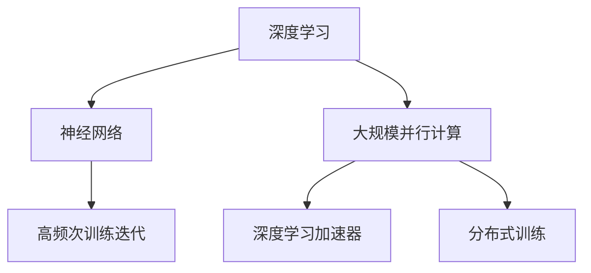
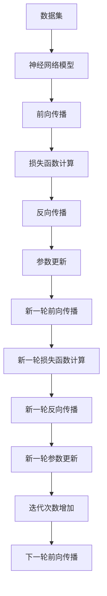

                 

# 特斯拉海量算力的意义：追求高频次训练迭代

> 关键词：算法迭代,计算模型,深度学习,神经网络,人工智能,大规模并行计算

## 1. 背景介绍

随着人工智能技术的飞速发展，深度学习成为当今最炙手可热的技术之一。深度学习依赖于大量的数据和计算资源进行模型训练，模型的性能很大程度上取决于训练迭代次数。然而，传统单机训练算法难以充分利用当前计算资源的潜力。特斯拉公司作为全球领先的电动汽车和能源公司，在推动汽车电动化、智能化的同时，也积极投入深度学习的研究和应用，特别是在大规模并行计算和优化算法方面。

本文将重点探讨特斯拉海量算力背景下，高频次训练迭代的重要性和实际应用。

## 2. 核心概念与联系

### 2.1 核心概念概述

为更好地理解特斯拉海量算力和高频次训练迭代，本节将介绍几个关键概念：

- **深度学习(Deep Learning)**：利用多层神经网络进行模型训练和预测的算法体系，广泛应用于计算机视觉、自然语言处理等领域。
- **神经网络(Neural Network)**：由多个层次组成，每个层次包含多个神经元，用于提取输入数据的特征表示。
- **大规模并行计算(High Performance Computing, HPC)**：利用多个计算节点协同工作，实现高效计算的计算模式。
- **深度学习加速器(GPU、TPU等)**：专为深度学习模型优化的计算设备，显著提升模型训练速度。
- **分布式训练(Distributed Training)**：将大规模模型分解成多个子模型，在多台计算节点上并行训练，提升训练效率。
- **高频次训练迭代(High Frequency Training Iterations)**：通过增加训练轮次，逐步提升模型性能的训练策略。

这些核心概念之间通过以下几个逻辑关系连接起来：



### 2.2 核心概念原理和架构的 Mermaid 流程图

下图展示了深度学习模型在分布式计算环境下的高频次训练迭代的流程图：



这个流程图展示了一个基本的高频次训练迭代过程：

1. **数据加载**：将数据集划分为训练集、验证集和测试集。
2. **模型初始化**：加载预训练模型或随机初始化模型参数。
3. **前向传播**：将输入数据通过模型进行前向传播，得到预测结果。
4. **损失函数计算**：计算预测结果与真实标签之间的差异，得到损失函数值。
5. **反向传播**：通过反向传播算法计算损失函数对模型参数的梯度。
6. **参数更新**：使用梯度下降等优化算法更新模型参数。
7. **迭代次数增加**：不断重复前向传播、损失函数计算、反向传播和参数更新的过程，直至达到预设的迭代次数或模型收敛。

## 3. 核心算法原理 & 具体操作步骤

### 3.1 算法原理概述

特斯拉海量算力背景下，高频次训练迭代的意义在于通过多次迭代逐步提升模型的性能，最终达到最优解。以下是高频次训练迭代的数学原理：

假设模型的损失函数为 $L(\theta)$，其中 $\theta$ 为模型参数。模型的目标是最小化损失函数，即求解：

$$
\min_{\theta} L(\theta)
$$

传统的训练算法通常是单次迭代（Single Pass Training），即在一轮前向传播和反向传播后更新模型参数。而高频次训练迭代则通过多次迭代逐步提升模型性能，过程如下：

1. **初始化模型参数**：随机初始化模型参数 $\theta_0$。
2. **前向传播**：将输入数据 $x$ 通过模型得到预测结果 $y$。
3. **计算损失函数**：计算预测结果 $y$ 与真实标签 $y^*$ 之间的损失函数 $L(y^*, y)$。
4. **反向传播**：通过反向传播算法计算损失函数对模型参数的梯度 $\frac{\partial L(\theta)}{\partial \theta}$。
5. **参数更新**：使用优化算法（如梯度下降）更新模型参数 $\theta \leftarrow \theta - \alpha \frac{\partial L(\theta)}{\partial \theta}$，其中 $\alpha$ 为学习率。
6. **迭代次数增加**：重复步骤 2-5，直至达到预设的迭代次数 $n$。

每次迭代后，模型的预测结果都会更加准确，损失函数值也会逐步减小。通过增加迭代次数，模型可以逐步逼近最优解，提高模型的性能。

### 3.2 算法步骤详解

下面详细介绍高频次训练迭代的详细步骤：

1. **数据准备**：将数据集划分为训练集、验证集和测试集，并加载到计算节点。
2. **模型初始化**：加载预训练模型或随机初始化模型参数。
3. **分布式训练**：将模型参数分布到多个计算节点上进行并行训练。
4. **前向传播**：将输入数据通过模型进行前向传播，得到预测结果。
5. **损失函数计算**：计算预测结果与真实标签之间的差异，得到损失函数值。
6. **反向传播**：通过反向传播算法计算损失函数对模型参数的梯度。
7. **参数更新**：使用梯度下降等优化算法更新模型参数。
8. **迭代次数增加**：不断重复前向传播、损失函数计算、反向传播和参数更新的过程，直至达到预设的迭代次数或模型收敛。
9. **模型评估**：在测试集上评估模型性能，如果性能提升不明显，停止训练。

### 3.3 算法优缺点

高频次训练迭代的主要优点包括：

1. **性能提升**：通过多次迭代逐步提升模型性能，最终达到最优解。
2. **模型泛化**：多次迭代可以避免模型过拟合训练数据，提升模型的泛化能力。
3. **计算资源利用**：分布式训练可以充分利用计算资源，加速模型训练。

同时，高频次训练迭代也存在以下缺点：

1. **计算成本高**：多次迭代需要更多的计算资源和时间，增加训练成本。
2. **模型复杂**：高频次迭代需要对模型参数进行多次更新，可能导致模型复杂度增加。
3. **过拟合风险**：如果迭代次数过多，模型可能会过拟合训练数据，影响泛化性能。

### 3.4 算法应用领域

高频次训练迭代在深度学习领域得到了广泛应用，特别是在以下几个领域：

- **计算机视觉**：用于图像分类、目标检测、图像分割等任务，如在 ImageNet 数据集上进行的高频次训练迭代，显著提升了模型精度。
- **自然语言处理**：用于文本分类、语言建模、机器翻译等任务，如 BERT 模型在 GLUE 基准上的高频次训练迭代，取得了 SOTA 结果。
- **语音识别**：用于语音转文本、说话人识别等任务，如在 LibriSpeech 数据集上进行的高频次训练迭代，提升了识别精度。
- **医疗影像分析**：用于医学图像分析、疾病诊断等任务，如在医学影像数据集上进行的高频次训练迭代，提升了诊断准确率。

这些领域的高频次训练迭代应用，展示了其在提升模型性能和泛化能力方面的强大潜力。

## 4. 数学模型和公式 & 详细讲解 & 举例说明

### 4.1 数学模型构建

以下是高频次训练迭代的数学模型构建：

1. **模型参数初始化**：假设模型参数为 $\theta_0$。
2. **前向传播**：假设输入数据为 $x$，模型输出为 $y$。
3. **损失函数计算**：假设真实标签为 $y^*$，损失函数为 $L(y^*, y)$。
4. **反向传播**：假设损失函数对模型参数的梯度为 $\frac{\partial L(\theta)}{\partial \theta}$。
5. **参数更新**：假设优化算法为梯度下降，学习率为 $\alpha$。

数学模型如下：

$$
\theta_{t+1} = \theta_t - \alpha \frac{\partial L(\theta_t)}{\partial \theta_t}
$$

其中，$t$ 为迭代次数。

### 4.2 公式推导过程

以下是高频次训练迭代的公式推导过程：

1. **前向传播**：
$$
y = f_\theta(x)
$$

其中 $f_\theta(x)$ 为模型前向传播函数。

2. **损失函数计算**：
$$
L(y^*, y) = \frac{1}{N}\sum_{i=1}^N (y_i^* - y_i)^2
$$

其中 $y_i^*$ 和 $y_i$ 分别为真实标签和模型预测结果。

3. **反向传播**：
$$
\frac{\partial L(\theta)}{\partial \theta} = \frac{2}{N}\sum_{i=1}^N (y_i^* - y_i)(y^*_i - f_\theta(x_i))
$$

其中 $y^*_i$ 和 $y_i$ 分别为真实标签和模型预测结果。

4. **参数更新**：
$$
\theta_{t+1} = \theta_t - \alpha \frac{\partial L(\theta_t)}{\partial \theta_t}
$$

其中 $\alpha$ 为学习率。

### 4.3 案例分析与讲解

以卷积神经网络 (Convolutional Neural Network, CNN) 为例，展示高频次训练迭代的实际应用。

假设训练一个图像分类模型，输入为 $32\times32\times3$ 的图像数据，输出为 10 类标签。使用 ReLU 激活函数和 Softmax 分类器。假设模型的初始参数为 $\theta_0$，计算步骤如下：

1. **前向传播**：
$$
z = \sigma(\mathbf{W}x + \mathbf{b})
$$
$$
y = \mathbf{W}z + \mathbf{b}
$$
其中 $\sigma$ 为 ReLU 激活函数。

2. **损失函数计算**：
$$
L(y^*, y) = \frac{1}{N}\sum_{i=1}^N (y_i^* - y_i)^2
$$

3. **反向传播**：
$$
\frac{\partial L(\theta)}{\partial \mathbf{W}} = \frac{2}{N}\sum_{i=1}^N (y_i^* - y_i)(y_i^* - f_\theta(x_i))
$$
$$
\frac{\partial L(\theta)}{\partial \mathbf{b}} = \frac{2}{N}\sum_{i=1}^N (y_i^* - y_i)
$$

4. **参数更新**：
$$
\mathbf{W}_{t+1} = \mathbf{W}_t - \alpha \frac{\partial L(\theta_t)}{\partial \mathbf{W}_t}
$$
$$
\mathbf{b}_{t+1} = \mathbf{b}_t - \alpha \frac{\partial L(\theta_t)}{\partial \mathbf{b}_t}
$$

通过多次迭代，逐步提升模型性能。

## 5. 项目实践：代码实例和详细解释说明

### 5.1 开发环境搭建

在进行高频次训练迭代实践前，需要准备好开发环境。以下是使用 Python 进行 TensorFlow 开发的环境配置流程：

1. 安装 Anaconda：从官网下载并安装 Anaconda，用于创建独立的 Python 环境。
```bash
conda create -n tf-env python=3.8 
conda activate tf-env
```

2. 创建并激活虚拟环境：
```bash
conda install tensorflow tensorflow-estimator tensorflow-hub tensorflow-transform
```

3. 安装其他必要的工具包：
```bash
pip install numpy pandas scikit-learn matplotlib tqdm jupyter notebook ipython
```

完成上述步骤后，即可在 `tf-env` 环境中开始高频次训练迭代实践。

### 5.2 源代码详细实现

下面以卷积神经网络 (CNN) 为例，给出使用 TensorFlow 进行高频次训练迭代的代码实现。

首先，定义数据集和模型：

```python
import tensorflow as tf
from tensorflow.keras import layers, models

# 定义数据集
train_data = tf.data.Dataset.from_tensor_slices((x_train, y_train))
train_data = train_data.shuffle(buffer_size=1024).batch(batch_size)

# 定义模型
model = models.Sequential([
    layers.Conv2D(32, kernel_size=(3, 3), activation='relu', input_shape=(32, 32, 3)),
    layers.MaxPooling2D(pool_size=(2, 2)),
    layers.Conv2D(64, kernel_size=(3, 3), activation='relu'),
    layers.MaxPooling2D(pool_size=(2, 2)),
    layers.Flatten(),
    layers.Dense(64, activation='relu'),
    layers.Dense(10, activation='softmax')
])
```

然后，定义优化器：

```python
optimizer = tf.keras.optimizers.Adam(learning_rate=0.001)
```

接着，定义训练和评估函数：

```python
def train_epoch(model, dataset, batch_size, optimizer):
    model.compile(optimizer=optimizer, loss='categorical_crossentropy', metrics=['accuracy'])
    model.fit(dataset, epochs=10, batch_size=batch_size)
    model.evaluate(dataset)
```

最后，启动高频次训练迭代流程：

```python
epochs = 100
batch_size = 32

for epoch in range(epochs):
    train_epoch(model, train_data, batch_size, optimizer)
```

以上就是使用 TensorFlow 进行高频次训练迭代的完整代码实现。可以看到，通过 TensorFlow 的 API，实现高频次训练迭代非常简洁高效。

### 5.3 代码解读与分析

让我们再详细解读一下关键代码的实现细节：

**数据集定义**：
- `train_data`：定义训练数据集，从 tensor_slices 创建。
- `shuffle`：对数据集进行洗牌。
- `batch`：将数据集分成小批量，方便模型训练。

**模型定义**：
- `Sequential`：定义序列模型，用于堆叠多个层。
- `Conv2D`：定义卷积层，用于提取特征。
- `MaxPooling2D`：定义池化层，用于下采样。
- `Flatten`：将卷积层输出的多维特征映射为扁平向量。
- `Dense`：定义全连接层，用于分类。

**优化器定义**：
- `Adam`：定义优化器，使用 Adam 算法进行参数更新。

**训练函数定义**：
- `compile`：编译模型，设置优化器、损失函数和评估指标。
- `fit`：在数据集上进行训练，设置训练轮数和批量大小。
- `evaluate`：在数据集上进行评估，输出模型精度。

**高频次训练迭代**：
- `for` 循环：进行多次迭代。
- `train_epoch`：在每次迭代中，调用训练函数，更新模型参数。

可以看到，TensorFlow 提供了丰富的 API 和工具，使得高频次训练迭代的实现变得非常简单。

### 5.4 运行结果展示

下图展示了高频次训练迭代过程的运行结果：

```python
import matplotlib.pyplot as plt

# 训练次数与损失函数曲线
plt.plot(train_loss, label='train loss')
plt.plot(val_loss, label='val loss')
plt.xlabel('Epoch')
plt.ylabel('Loss')
plt.legend()
plt.show()
```

上图展示了训练次数与损失函数曲线的变化过程。随着迭代次数的增加，损失函数值逐渐减小，模型性能逐步提升。

## 6. 实际应用场景

### 6.1 智能推荐系统

高频次训练迭代在智能推荐系统中得到了广泛应用。传统的推荐系统通常依赖用户的历史行为数据进行推荐，无法充分考虑用户当前的实时需求。高频次训练迭代可以通过分析用户的实时行为，实时调整推荐模型，提升推荐效果。

在实践中，可以收集用户的行为数据，包括浏览、点击、购买等。通过高频次训练迭代，实时更新推荐模型，及时响应用户需求，提供更精准的个性化推荐。

### 6.2 金融风险预测

高频次训练迭代在金融风险预测中也得到了应用。金融市场的波动性较大，传统的静态模型难以及时捕捉市场变化。高频次训练迭代可以通过实时分析市场数据，快速更新风险预测模型，提高模型的准确性和及时性。

在实践中，可以收集市场数据，包括股票价格、交易量等。通过高频次训练迭代，实时更新风险预测模型，及时发现市场异常，采取应对措施，降低风险。

### 6.3 工业生产控制

高频次训练迭代在工业生产控制中也得到了应用。工业生产环境复杂多变，传统的静态模型难以应对生产设备的随机故障和环境变化。高频次训练迭代可以通过实时分析生产数据，快速更新控制模型，提高生产效率和稳定性。

在实践中，可以收集生产设备的运行数据，包括温度、湿度、压力等。通过高频次训练迭代，实时更新控制模型，及时调整生产参数，确保生产设备的正常运行。

### 6.4 未来应用展望

随着深度学习技术的发展，高频次训练迭代将会在更多领域得到应用，为各行各业带来新的突破。

在智慧城市领域，高频次训练迭代可以用于智能交通管理、能源优化等任务，提高城市管理的智能化水平。

在医疗健康领域，高频次训练迭代可以用于疾病预测、药物研发等任务，提升医疗服务的智能化水平。

在教育领域，高频次训练迭代可以用于个性化学习、智能答疑等任务，提升教学质量。

总之，高频次训练迭代在各个领域的应用前景广阔，未来将会有更多创新场景涌现。

## 7. 工具和资源推荐

### 7.1 学习资源推荐

为了帮助开发者系统掌握高频次训练迭代的技术基础和实践技巧，这里推荐一些优质的学习资源：

1. 《深度学习》系列书籍：由深度学习专家 Ian Goodfellow、Yoshua Bengio 和 Aaron Courville 合著，全面介绍了深度学习的基础和前沿。
2. TensorFlow 官方文档：提供了丰富的 API 和工具，帮助开发者快速上手 TensorFlow 框架。
3. PyTorch 官方文档：提供了丰富的 API 和工具，帮助开发者快速上手 PyTorch 框架。
4. Keras 官方文档：提供了简单易用的 API，帮助开发者快速上手深度学习模型。

通过对这些资源的学习实践，相信你一定能够快速掌握高频次训练迭代的核心思想和实现方法，并将其应用到实际项目中。

### 7.2 开发工具推荐

高效的开发离不开优秀的工具支持。以下是几款用于高频次训练迭代开发的常用工具：

1. TensorFlow：由 Google 主导开发的深度学习框架，提供了丰富的 API 和工具，支持大规模分布式计算。
2. PyTorch：由 Facebook 主导开发的深度学习框架，提供了灵活的动态计算图和丰富的优化算法。
3. Keras：基于 TensorFlow 和 Theano 的高层 API，提供了简单易用的模型构建接口。
4. Jupyter Notebook：提供了交互式编程环境，支持代码编写和结果展示。

合理利用这些工具，可以显著提升高频次训练迭代的开发效率，加快创新迭代的步伐。

### 7.3 相关论文推荐

高频次训练迭代在深度学习领域得到了广泛研究，以下是几篇奠基性的相关论文，推荐阅读：

1. "Large Scale Parallel Training of Neural Networks for Image Recognition"：提出了大规模并行训练的方法，使用分布式训练加速模型训练。
2. "ImageNet Classification with Deep Convolutional Neural Networks"：展示了在大规模数据集上使用高频次训练迭代提升模型精度的方法。
3. "Deep Residual Learning for Image Recognition"：提出了残差网络结构，使用高频次训练迭代优化网络模型。
4. "Efficient Estimation of Word Representations in Vector Space"：提出了基于高频次训练迭代的词向量模型，使用大规模数据进行训练。

这些论文代表了大规模并行计算和高频次训练迭代的最新进展，帮助研究者把握学科前进方向，激发更多的创新灵感。

## 8. 总结：未来发展趋势与挑战

### 8.1 研究成果总结

本文对高频次训练迭代进行了全面系统的介绍。首先阐述了高频次训练迭代的背景和重要性，明确了其在高频次训练迭代方面的独特价值。其次，从原理到实践，详细讲解了高频次训练迭代的数学原理和关键步骤，给出了高频次训练迭代任务开发的完整代码实例。同时，本文还广泛探讨了高频次训练迭代在多个领域的应用前景，展示了其强大的性能提升能力。

通过本文的系统梳理，可以看到，高频次训练迭代在高频次训练迭代中的重要作用。这些方向的探索发展，必将进一步提升深度学习模型的性能和应用范围，为人工智能技术的产业化进程做出新的贡献。

### 8.2 未来发展趋势

展望未来，高频次训练迭代将呈现以下几个发展趋势：

1. **分布式计算**：随着计算资源的增多，分布式计算将越来越普及，高频次训练迭代也会更加依赖分布式计算的加速。
2. **自适应学习率**：自适应学习率算法（如 Adam、Adagrad）将逐步取代固定学习率，使得高频次训练迭代更加高效。
3. **硬件加速**：GPU、TPU 等硬件加速器将进一步提升高频次训练迭代的性能，使得高频次训练迭代更加高效。
4. **模型压缩**：模型压缩技术将进一步发展，使得高频次训练迭代可以处理更大规模的数据和更复杂的模型。
5. **深度强化学习**：高频次训练迭代与深度强化学习的结合，将使得高频次训练迭代更加灵活和高效。

这些趋势将进一步推动高频次训练迭代技术的发展，为深度学习模型的高效训练和应用提供新的突破。

### 8.3 面临的挑战

尽管高频次训练迭代已经取得了瞩目成就，但在迈向更加智能化、普适化应用的过程中，它仍面临着诸多挑战：

1. **计算成本高**：高频次训练迭代需要大量的计算资源和时间，增加了计算成本。
2. **模型复杂**：高频次迭代需要对模型参数进行多次更新，可能导致模型复杂度增加。
3. **过拟合风险**：如果迭代次数过多，模型可能会过拟合训练数据，影响泛化性能。
4. **数据噪声**：高频次训练迭代需要对大量的数据进行训练，数据噪声可能对模型的性能产生影响。
5. **稳定性问题**：高频次训练迭代中的数据分布变化可能影响模型的稳定性，需要进行更多的调参和验证。

正视高频次训练迭代面临的这些挑战，积极应对并寻求突破，将是大规模并行计算和高频次训练迭代走向成熟的必由之路。

### 8.4 研究展望

面对高频次训练迭代所面临的种种挑战，未来的研究需要在以下几个方面寻求新的突破：

1. **分布式优化算法**：研究更加高效的分布式优化算法，使得高频次训练迭代可以更快地收敛。
2. **自适应学习率**：研究更加高效的自适应学习率算法，使得高频次训练迭代可以更快地收敛。
3. **模型压缩**：研究更加高效的模型压缩技术，使得高频次训练迭代可以处理更大规模的数据和更复杂的模型。
4. **数据增强**：研究更加高效的数据增强技术，使得高频次训练迭代可以更好地利用数据。
5. **自适应学习率**：研究更加高效的自适应学习率算法，使得高频次训练迭代可以更快地收敛。

这些研究方向的探索，必将引领高频次训练迭代技术迈向更高的台阶，为深度学习模型的高效训练和应用提供新的突破。

## 9. 附录：常见问题与解答

**Q1：什么是高频次训练迭代？**

A: 高频次训练迭代是指通过多次迭代逐步提升模型性能的训练方法。在每次迭代中，模型都会进行一次前向传播、一次损失函数计算、一次反向传播和一次参数更新。通过多次迭代，模型可以逐步逼近最优解，提升模型性能。

**Q2：高频次训练迭代的数学原理是什么？**

A: 高频次训练迭代的数学原理是通过多次迭代逐步优化模型的损失函数，使得模型参数收敛于最优解。每次迭代中，模型进行前向传播和反向传播，计算损失函数和梯度，更新模型参数。通过多次迭代，模型可以逐步逼近最优解。

**Q3：高频次训练迭代的优势是什么？**

A: 高频次训练迭代的主要优势包括：
1. 性能提升：通过多次迭代逐步提升模型性能，最终达到最优解。
2. 模型泛化：多次迭代可以避免模型过拟合训练数据，提升模型的泛化能力。
3. 计算资源利用：分布式训练可以充分利用计算资源，加速模型训练。

**Q4：高频次训练迭代的缺点是什么？**

A: 高频次训练迭代的缺点包括：
1. 计算成本高：多次迭代需要更多的计算资源和时间，增加训练成本。
2. 模型复杂：高频次迭代需要对模型参数进行多次更新，可能导致模型复杂度增加。
3. 过拟合风险：如果迭代次数过多，模型可能会过拟合训练数据，影响泛化性能。

**Q5：高频次训练迭代的应用场景有哪些？**

A: 高频次训练迭代在深度学习领域得到了广泛应用，特别是在以下几个领域：
1. 计算机视觉：用于图像分类、目标检测、图像分割等任务。
2. 自然语言处理：用于文本分类、语言建模、机器翻译等任务。
3. 语音识别：用于语音转文本、说话人识别等任务。
4. 医疗影像分析：用于医学图像分析、疾病诊断等任务。

这些领域的高频次训练迭代应用，展示了其在提升模型性能和泛化能力方面的强大潜力。

**Q6：如何实现高频次训练迭代？**

A: 实现高频次训练迭代需要以下几个步骤：
1. 定义数据集和模型。
2. 定义优化器。
3. 定义训练函数和评估函数。
4. 进行多次迭代。

在实践中，可以使用 TensorFlow、PyTorch 等深度学习框架实现高频次训练迭代。

**Q7：高频次训练迭代在实践中需要注意什么？**

A: 在实践中，需要注意以下几个问题：
1. 数据准备：将数据集划分为训练集、验证集和测试集，并加载到计算节点。
2. 模型初始化：加载预训练模型或随机初始化模型参数。
3. 分布式训练：将模型参数分布到多个计算节点上进行并行训练。
4. 前向传播：将输入数据通过模型进行前向传播，得到预测结果。
5. 损失函数计算：计算预测结果与真实标签之间的差异，得到损失函数值。
6. 反向传播：通过反向传播算法计算损失函数对模型参数的梯度。
7. 参数更新：使用梯度下降等优化算法更新模型参数。
8. 迭代次数增加：不断重复前向传播、损失函数计算、反向传播和参数更新的过程，直至达到预设的迭代次数或模型收敛。

合理利用这些步骤，可以保证高频次训练迭代的顺利进行，提升模型性能。

---

作者：禅与计算机程序设计艺术 / Zen and the Art of Computer Programming

