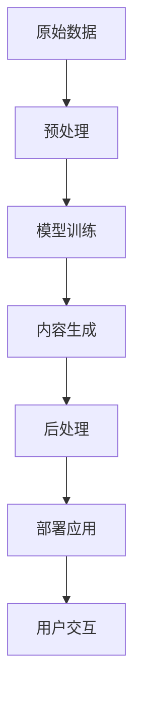

                 

# 生成式AIGC是金矿还是泡沫：不要迷信AI，聚焦尖刀场景尽快落地

> 关键词：生成式AIGC,金矿与泡沫,尖刀场景,落地实践,技术进展

## 1. 背景介绍

### 1.1 问题由来

生成式人工智能(Generative AI)，尤其是生成式AIGC（Artificial Intelligence Generated Content）近年来发展迅速。从OpenAI的GPT-3、DALL-E到百度的AI艺术家，以及NVIDIA的DeepArt等，AIGC技术的突破让普通用户得以轻松制作高质量图像、文本、音频等内容，极大地改变了内容生产和传播的方式。然而，随着技术的不断进步，AIGC领域的商业模式逐渐从前期高调的“金矿”开始褪色，不少投资者和从业者开始质疑，AIGC到底是真正价值重估的“金矿”还是昙花一现的“泡沫”。

### 1.2 问题核心关键点

AIGC技术能否实现大规模商业应用，关键在于能否找到其技术价值的“尖刀场景”。所谓“尖刀场景”，指的是那些能够显著提升业务效率、降低成本、优化用户体验或创造全新商业模式，且足够小众、独特、易于实现的应用场景。本文将详细探讨AIGC技术在尖刀场景中的应用，并分析其价值与挑战，为开发者和投资者提供决策参考。

## 2. 核心概念与联系

### 2.1 核心概念概述

AIGC技术主要包括基于深度学习的生成模型（如GAN、VQ-VAE等），以及基于语言模型的生成模型（如GPT、BERT等），用于生成高质量的文本、图像、音频等内容。AIGC技术的核心在于其生成过程的连续性和可控性，可以在不断迭代优化中生成符合预期的内容。

- **GAN**：生成对抗网络（Generative Adversarial Network），通过生成器和判别器的对抗训练，生成逼真的图像。
- **VQ-VAE**：变分自编码器（Variational Autoencoder），用于生成具有一定风格、结构的图像。
- **GPT**：基于Transformer的预训练语言模型，通过自回归或自编码方式生成文本。
- **BERT**：双向编码器表示（Bidirectional Encoder Representations from Transformers），用于生成高质量的文本嵌入，支持各种NLP任务。

AIGC技术在多个领域得到了广泛应用，包括内容创作、智能交互、娱乐体验等。但其核心价值在于其生成内容的真实性、多样性和创造性，以及能够提升用户体验和优化业务流程的能力。

### 2.2 核心概念原理和架构的 Mermaid 流程图(Mermaid 流程节点中不要有括号、逗号等特殊字符)



## 3. 核心算法原理 & 具体操作步骤

### 3.1 算法原理概述

AIGC技术的生成过程基于深度学习模型，特别是基于神经网络的生成模型。这些模型通过反向传播算法和梯度下降优化，不断调整网络参数，使得生成内容的损失函数最小化。

以生成文本为例，AIGC技术通常采用基于Transformer的语言模型（如GPT系列）进行训练，模型通过预测下一个单词的概率分布，生成连续的文本内容。生成过程中，模型首先对输入序列进行编码，得到上下文表示，然后通过解码器生成下一个单词的概率分布，并选择概率最大的单词作为输出。

### 3.2 算法步骤详解

AIGC技术的实现通常包括以下几个关键步骤：

**Step 1: 数据准备**

- 收集和处理用于训练的原始数据。
- 进行数据增强和预处理，如文本清洗、分词、归一化等。

**Step 2: 模型选择与训练**

- 选择合适的生成模型架构，如GAN、VQ-VAE、GPT等。
- 准备训练数据，并将其划分为训练集、验证集和测试集。
- 定义损失函数和优化器，如交叉熵损失、AdamW等。
- 进行模型训练，调整超参数如学习率、批大小、迭代轮数等。

**Step 3: 内容生成与后处理**

- 使用训练好的模型生成新内容。
- 对生成的内容进行后处理，如文本格式化、图像增强等。
- 进行内容质量评估，并根据反馈进行调整。

**Step 4: 部署与用户交互**

- 将生成的内容部署到应用系统，如网站、APP等。
- 与用户进行交互，获取反馈，进一步优化生成模型。

### 3.3 算法优缺点

#### 优点

1. **高效生成**：AIGC技术可以在短时间内生成大量高质量内容，极大地提升了内容创作的效率。
2. **多样化**：通过调整生成模型的参数和训练数据，可以生成多样化的内容形式，满足不同用户的需求。
3. **降低成本**：减少了内容创作和编辑的成本，提高了内容传播的效率。
4. **提升用户体验**：通过生成高质量的内容，提升用户体验和互动效果。

#### 缺点

1. **内容真实性**：生成的内容可能缺乏真实性，容易误导用户。
2. **版权问题**：生成的内容可能涉及版权问题，尤其是在商业应用中。
3. **技术依赖**：AIGC技术依赖于深度学习模型，需要较高的计算资源和数据量。
4. **伦理风险**：生成内容可能包含有害、偏见、歧视性信息，引发伦理问题。

### 3.4 算法应用领域

AIGC技术在多个领域得到了广泛应用，包括但不限于：

- **内容创作**：自动生成新闻、文章、广告等文本内容，提升内容创作效率。
- **娱乐体验**：生成游戏角色、虚拟主播、动画电影等，丰富娱乐内容。
- **商业广告**：生成广告素材，提升广告创意和效果。
- **智能交互**：生成对话系统、虚拟客服等，提升用户体验和互动效果。
- **艺术创作**：生成艺术品、设计图等，辅助艺术创作。

## 4. 数学模型和公式 & 详细讲解 & 举例说明

### 4.1 数学模型构建

生成式AIGC模型的核心在于生成过程的连续性和可控性。以文本生成为例，可以构建如下数学模型：

- 输入序列为 $X = (x_1, x_2, ..., x_t)$，其中 $x_t$ 为第 $t$ 个单词。
- 输出序列为 $Y = (y_1, y_2, ..., y_t)$，其中 $y_t$ 为模型预测的下一个单词。
- 目标函数为 $L(\theta) = -\sum_{i=1}^t \log P(y_i | x_1, ..., x_i, \theta)$，其中 $P(y_i | x_1, ..., x_i, \theta)$ 为模型在给定上下文条件下生成单词 $y_i$ 的概率。

### 4.2 公式推导过程

以文本生成的过程为例，推导其概率模型：

1. **输入编码**：将输入序列 $X$ 编码成上下文表示 $H$。
2. **注意力机制**：使用注意力机制计算上下文表示 $H$ 和每个单词 $x_i$ 之间的权重。
3. **解码器生成**：基于上下文表示 $H$ 和注意力权重，生成下一个单词 $y_t$。
4. **概率分布**：计算生成下一个单词 $y_t$ 的概率分布，选择概率最大的单词作为输出。

### 4.3 案例分析与讲解

以GAN模型为例，分析其生成图像的过程：

1. **生成器**：通过多层神经网络将随机噪声向量 $z$ 转化为图像 $G(z)$。
2. **判别器**：通过多层神经网络将图像 $x$ 分类为真实（True）或生成（Fake）。
3. **对抗训练**：生成器和判别器通过不断对抗训练，提高生成器的生成能力和判别器的判别能力。
4. **图像生成**：最终生成的图像 $G(z)$ 具有逼真性，并符合生成器训练时的风格和结构。

## 5. 项目实践：代码实例和详细解释说明

### 5.1 开发环境搭建

要实践AIGC技术，首先需要搭建一个高性能的开发环境。以下是一个Python开发环境的搭建步骤：

1. 安装Python：选择Python 3.7或更高版本，可以使用Anaconda或Miniconda进行安装。
2. 安装PyTorch和TorchVision：使用conda或pip安装，支持GPU加速。
3. 安装Tensorboard：用于可视化训练过程。
4. 安装其他依赖库，如Numpy、Pandas、Matplotlib等。
5. 配置环境变量，方便使用命令行进行开发。

### 5.2 源代码详细实现

以GAN模型为例，给出其实现代码：

```python
import torch
import torch.nn as nn
import torch.optim as optim

class Generator(nn.Module):
    def __init__(self):
        super(Generator, self).__init__()
        self.model = nn.Sequential(
            nn.Linear(100, 256),
            nn.LeakyReLU(0.2),
            nn.Linear(256, 512),
            nn.LeakyReLU(0.2),
            nn.Linear(512, 28*28),
            nn.Tanh()
        )
    
    def forward(self, x):
        return self.model(x)

class Discriminator(nn.Module):
    def __init__(self):
        super(Discriminator, self).__init__()
        self.model = nn.Sequential(
            nn.Linear(28*28, 512),
            nn.LeakyReLU(0.2),
            nn.Linear(512, 256),
            nn.LeakyReLU(0.2),
            nn.Linear(256, 1),
            nn.Sigmoid()
        )
    
    def forward(self, x):
        return self.model(x)

# 初始化模型和优化器
G = Generator()
D = Discriminator()
G_optimizer = optim.Adam(G.parameters(), lr=0.0002, betas=(0.5, 0.999))
D_optimizer = optim.Adam(D.parameters(), lr=0.0002, betas=(0.5, 0.999))

# 定义损失函数
criterion = nn.BCELoss()

# 训练过程
for epoch in range(100):
    for i, (real_images, _) in enumerate(train_loader):
        # 生成器和判别器的交替训练
        G_optimizer.zero_grad()
        z = torch.randn(64, 100)
        fake_images = G(z)
        output = D(fake_images)
        G_loss = criterion(output, torch.ones(64, 1))
        G_loss.backward()
        G_optimizer.step()

        D_optimizer.zero_grad()
        real_images = real_images.view(-1, 28*28)
        output = D(real_images)
        D_loss = criterion(output, torch.ones(64, 1)) + criterion(output, torch.zeros(64, 1))
        D_loss.backward()
        D_optimizer.step()
```

### 5.3 代码解读与分析

**Generator类**：定义生成器的神经网络结构，包括输入层、隐藏层和输出层。
**Discriminator类**：定义判别器的神经网络结构，包括输入层、隐藏层和输出层。
**优化器和损失函数**：使用Adam优化器进行模型参数的更新，使用交叉熵损失函数进行损失计算。
**训练过程**：通过交替更新生成器和判别器，优化模型参数，提高生成图像的质量。

## 6. 实际应用场景

### 6.1 内容创作

内容创作是AIGC技术的重要应用场景之一。以自动生成新闻为例，可以使用GPT模型，通过输入关键词或主题，生成相关的新闻文章。这种方式能够大幅提高内容创作的效率，尤其适用于新闻机构、博客作者等需要频繁生成内容的场景。

### 6.2 娱乐体验

AIGC技术在娱乐领域也有广泛应用。例如，生成虚拟主播、动画电影等，为游戏、影视制作等提供创意支持。这些技术能够丰富用户体验，提升娱乐内容的互动性和沉浸感。

### 6.3 商业广告

在商业广告中，AIGC技术能够生成创意广告素材，快速生成广告文案和视觉元素，提高广告创意的效率和效果。

### 6.4 智能交互

生成式AIGC技术在智能交互中也得到了广泛应用，如生成对话系统、虚拟客服等。这些技术能够提升用户体验，增强互动效果。

## 7. 工具和资源推荐

### 7.1 学习资源推荐

要深入掌握AIGC技术，建议学习以下资源：

1. 《深度学习》（Goodfellow等）：全面介绍深度学习的基本概念和算法。
2. 《生成对抗网络》（Ian Goodfellow）：深入讲解GAN模型的原理和应用。
3. 《自然语言处理综述》（Goodrich等）：介绍NLP技术的最新进展。
4. 《Generative Adversarial Networks》（Goodfellow等）：生成对抗网络的经典书籍。
5. 在线课程和教程：如Coursera、Udacity、Google Deep Learning课程。

### 7.2 开发工具推荐

以下是一些常用的AIGC开发工具：

1. PyTorch：广泛使用的深度学习框架，支持GPU加速。
2. TensorFlow：另一个流行的深度学习框架，支持分布式训练。
3. Keras：高级神经网络API，易于使用。
4. FastAI：基于PyTorch的高级深度学习库，适合快速原型开发。
5. Jupyter Notebook：Python编程环境，便于交互式开发。

### 7.3 相关论文推荐

以下是一些AIGC领域的经典论文：

1. Goodfellow等《Generative Adversarial Nets》：提出GAN模型的经典论文。
2. Salimans等《Improved Techniques for Training GANs》：改进GAN模型训练的论文。
3. Mirza等《Simple Generative Adversarial Networks》：提出GAN模型的经典论文。
4. Vinyals等《Show and Tell: A Neural Image Caption Generator》：生成图像描述的经典论文。
5. Radford等《Language Models are Unsupervised Multitask Learners》：BERT模型的经典论文。

## 8. 总结：未来发展趋势与挑战

### 8.1 研究成果总结

AIGC技术在生成文本、图像、音频等方面已经取得了显著进展，其应用前景广阔。然而，技术应用过程中仍面临一些挑战，如内容真实性、版权问题、技术依赖等。

### 8.2 未来发展趋势

1. **技术进步**：随着深度学习技术的不断进步，生成式AIGC技术的生成效果将进一步提升。
2. **应用拓展**：AIGC技术将在更多领域得到应用，如医疗、金融、教育等。
3. **商业化**：越来越多的公司将AIGC技术纳入商业化策略，为开发者和投资者提供更多机会。
4. **跨领域融合**：AIGC技术与物联网、区块链、边缘计算等技术结合，将开辟更多应用场景。

### 8.3 面临的挑战

1. **内容真实性**：生成的内容可能缺乏真实性，容易误导用户。
2. **版权问题**：生成的内容可能涉及版权问题，尤其是在商业应用中。
3. **技术依赖**：AIGC技术依赖于深度学习模型，需要较高的计算资源和数据量。
4. **伦理风险**：生成内容可能包含有害、偏见、歧视性信息，引发伦理问题。

### 8.4 研究展望

未来的研究方向包括：

1. **提高生成质量**：通过改进模型架构和训练策略，提高生成内容的真实性和多样性。
2. **解决版权问题**：研究如何合理使用生成的内容，避免版权争议。
3. **降低技术依赖**：探索轻量级、低成本的生成模型，提高技术应用的普及度。
4. **提升伦理安全性**：开发能够识别和过滤有害、偏见、歧视性内容的算法。

## 9. 附录：常见问题与解答

**Q1：如何评估生成内容的真实性？**

A: 生成内容的真实性可以通过多种方式评估，如对比真实样本和生成样本的差异、使用领域专家的评估等。

**Q2：AIGC技术是否可能被滥用？**

A: AIGC技术在内容创作、娱乐体验等领域具有广泛应用，但必须加强技术管理和伦理监管，避免被滥用。

**Q3：AIGC技术能否应用于教育领域？**

A: AIGC技术可以用于生成教材、习题、考试题目等，但需要慎重考虑生成内容的教育价值和可接受性。

**Q4：AIGC技术是否会取代人类创作？**

A: AIGC技术能够辅助人类创作，提升创作效率，但不可能完全取代人类创作，尤其是涉及创意、情感表达的领域。

**Q5：如何应对AIGC技术的伦理问题？**

A: 需要制定相应的技术标准和伦理规范，建立监管机制，确保AIGC技术的应用符合伦理道德。

---

作者：禅与计算机程序设计艺术 / Zen and the Art of Computer Programming

