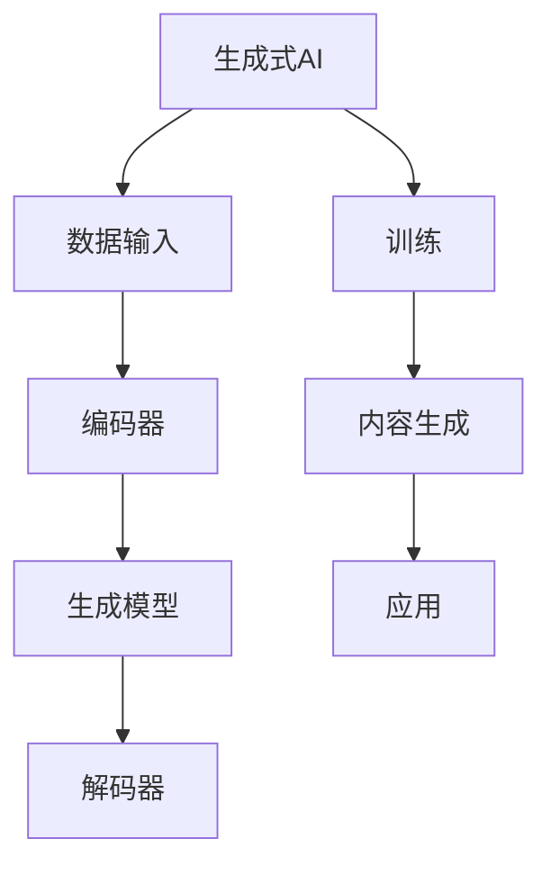

                 

## 1. 背景介绍

### 1.1 问题由来
在《生成式AIGC是金矿还是泡沫：第一部分》中，我们探讨了生成式AI的重要性以及其在计算机视觉、自然语言处理等领域的应用前景。然而，AI并非万能药，其发展过程中也面临着诸多挑战。本部分将从AI的局限性、当前技术瓶颈及未来发展趋势进行深入讨论。

### 1.2 问题核心关键点
本节将重点介绍生成式AI的局限性、当前技术瓶颈及未来发展趋势，旨在为读者提供一个全面的视角，帮助他们理解生成式AI的潜力与风险。

## 2. 核心概念与联系

### 2.1 核心概念概述

生成式AI是指利用人工智能算法生成全新的内容，如文本、图像、音频等。这些内容不仅具有高度的真实性，还能够根据用户输入生成个性化的响应。生成式AI的应用领域广泛，包括内容创作、自然语言处理、计算机视觉等，能够大幅提高数据处理、内容生成和任务执行的效率。

### 2.2 核心概念原理和架构的 Mermaid 流程图(Mermaid 流程节点中不要有括号、逗号等特殊字符)



这个流程图展示了生成式AI的基本架构：输入数据通过编码器转换为高维表示，然后利用生成模型生成新的内容，最后通过解码器将生成内容转换为最终的输出。

## 3. 核心算法原理 & 具体操作步骤
### 3.1 算法原理概述

生成式AI的核心算法主要包括自回归模型和变分自编码器。自回归模型通过预测序列中的下一个元素来生成新内容，如GPT-3、BERT等。变分自编码器则通过学习数据的分布特征来生成新的数据，如GANs、VAE等。

生成式AI的训练通常使用无监督学习或监督学习的方式，通过最大化生成内容的真实性或降低与目标分布的差异来进行。常见的训练目标包括最大化似然函数、最小化生成内容与真实内容的差异等。

### 3.2 算法步骤详解

生成式AI的训练过程包括以下几个关键步骤：

1. **数据准备**：收集并准备训练数据，包括文本、图像、音频等。数据的质量直接影响生成内容的真实性和多样性。
2. **模型设计**：选择适合的生成模型架构，如自回归模型、变分自编码器等。同时设计解码器，将生成内容转换为可用的输出形式。
3. **训练优化**：使用合适的优化算法（如Adam、SGD等）对模型进行优化。训练过程中，需要选择合适的损失函数（如交叉熵损失、均方误差损失等）和超参数（如学习率、批大小等）。
4. **内容生成**：在训练完成后，使用训练好的模型生成新的内容。生成的内容可以用于内容创作、数据分析、交互式应用等多个场景。

### 3.3 算法优缺点

生成式AI的优点包括：
- **高效性**：能够快速生成大量高质量的内容，适用于数据量大、复杂度高、生成需求频繁的场景。
- **多样性**：生成的内容具有高度的多样性，能够满足不同用户的需求和场景。
- **灵活性**：可以根据不同的任务需求，灵活调整模型结构和参数，适应不同的应用场景。

然而，生成式AI也存在以下缺点：
- **依赖数据质量**：生成内容的质量和多样性高度依赖于训练数据的丰富性和质量。
- **生成内容真实性**：生成的内容可能存在虚假、低质量或误导性内容，需要额外的验证和过滤机制。
- **技术复杂性**：模型设计和训练需要较高的技术门槛，需要专业的知识和技能。

### 3.4 算法应用领域

生成式AI在多个领域得到了广泛应用，包括：
- **内容创作**：如自动生成新闻、博客、广告文案等，提升内容创作的效率和质量。
- **自然语言处理**：如机器翻译、自动摘要、对话系统等，提升人机交互的体验。
- **计算机视觉**：如图像生成、图像修复、视频剪辑等，提升图像和视频处理的能力。
- **音频处理**：如语音合成、音频编辑、自动字幕生成等，提升音频处理的效果。

## 4. 数学模型和公式 & 详细讲解 & 举例说明

### 4.1 数学模型构建

生成式AI的数学模型构建通常包括以下几个部分：
- **编码器**：将输入数据映射为高维表示。
- **生成模型**：利用高维表示生成新的内容。
- **解码器**：将生成的内容转换为可用的输出形式。

### 4.2 公式推导过程

以生成式自回归模型（Generative Autoregressive Model）为例，其训练过程包括以下几个步骤：

1. **数据输入**：假设输入的数据为 $x_1, x_2, ..., x_T$。
2. **编码器**：将输入数据映射为高维表示 $z_1, z_2, ..., z_T$。
3. **生成模型**：根据高维表示生成下一个元素 $z_{t+1}$。
4. **解码器**：将生成的元素转换为最终输出 $y_t$。

假设生成模型为 $p(z_{t+1} \mid z_t, \theta)$，其中 $\theta$ 为模型参数，则生成模型的目标是最小化似然函数：

$$
\min_{\theta} \mathcal{L} = -\sum_{t=1}^{T} \log p(y_t \mid y_1, y_2, ..., y_{t-1}, z_1, z_2, ..., z_T, \theta)
$$

### 4.3 案例分析与讲解

以生成式对抗网络（Generative Adversarial Networks, GANs）为例，其训练过程包括以下几个步骤：
1. **生成器**：从噪声分布中生成新的样本 $x_g$。
2. **判别器**：判断样本 $x_g$ 是否为真实样本。
3. **对抗训练**：生成器与判别器进行对抗训练，提升生成样本的真实性。

GANs的训练过程可以通过以下公式来表示：

- **生成器**：
$$
x_g = D(z)
$$
其中 $z$ 为噪声向量。

- **判别器**：
$$
\mathcal{L}_D = \mathbb{E}_{x \sim p_{\text{data}}}[\log D(x)] + \mathbb{E}_{z \sim p(z)}[\log (1-D(G(z)))]
$$

- **生成器与判别器对抗训练**：
$$
\mathcal{L}_G = -\mathbb{E}_{z \sim p(z)}[\log D(G(z))]
$$

## 5. 项目实践：代码实例和详细解释说明

### 5.1 开发环境搭建

在进行生成式AI项目实践时，需要搭建相应的开发环境。以下是使用Python进行PyTorch开发的环境配置流程：

1. 安装Anaconda：从官网下载并安装Anaconda，用于创建独立的Python环境。
2. 创建并激活虚拟环境：
```bash
conda create -n pytorch-env python=3.8 
conda activate pytorch-env
```

3. 安装PyTorch：根据CUDA版本，从官网获取对应的安装命令。例如：
```bash
conda install pytorch torchvision torchaudio cudatoolkit=11.1 -c pytorch -c conda-forge
```

4. 安装TensorFlow：
```bash
pip install tensorflow
```

5. 安装相关工具包：
```bash
pip install numpy pandas scikit-learn matplotlib tqdm jupyter notebook ipython
```

完成上述步骤后，即可在`pytorch-env`环境中开始生成式AI项目实践。

### 5.2 源代码详细实现

以下是一个使用PyTorch实现GANs的代码示例：

```python
import torch
import torch.nn as nn
import torch.optim as optim
import torchvision
import torchvision.transforms as transforms

# 定义生成器和判别器的网络结构
class Generator(nn.Module):
    def __init__(self):
        super(Generator, self).__init__()
        self.fc1 = nn.Linear(100, 256)
        self.fc2 = nn.Linear(256, 512)
        self.fc3 = nn.Linear(512, 784)
        self.relu = nn.ReLU()

    def forward(self, x):
        x = self.relu(self.fc1(x))
        x = self.relu(self.fc2(x))
        x = self.fc3(x)
        return x

class Discriminator(nn.Module):
    def __init__(self):
        super(Discriminator, self).__init__()
        self.fc1 = nn.Linear(784, 512)
        self.fc2 = nn.Linear(512, 256)
        self.fc3 = nn.Linear(256, 1)
        self.sigmoid = nn.Sigmoid()

    def forward(self, x):
        x = self.sigmoid(self.fc1(x))
        x = self.sigmoid(self.fc2(x))
        x = self.fc3(x)
        return x

# 定义训练过程
def train(iter, generator, discriminator, learning_rate):
    criterion = nn.BCELoss()
    optimizer_G = optim.Adam(generator.parameters(), lr=learning_rate)
    optimizer_D = optim.Adam(discriminator.parameters(), lr=learning_rate)

    for epoch in range(iter):
        for i, (images, _) in enumerate(train_loader):
            real_images = images.view(-1, 784)
            real_labels = torch.ones_like(real_images)
            fake_labels = torch.zeros_like(real_images)

            # 生成器前向传播
            fake_images = generator(torch.randn(batch_size, 100))
            fake_labels = torch.ones_like(fake_images)

            # 判别器前向传播
            real_outputs = discriminator(real_images)
            fake_outputs = discriminator(fake_images)

            # 计算损失
            D_real_loss = criterion(real_outputs, real_labels)
            D_fake_loss = criterion(fake_outputs, fake_labels)
            G_loss = D_fake_loss

            # 反向传播
            optimizer_G.zero_grad()
            optimizer_D.zero_grad()

            D_real_loss.backward()
            D_fake_loss.backward()
            G_loss.backward()

            # 更新参数
            optimizer_G.step()
            optimizer_D.step()

            if i % 100 == 0:
                print(f'Epoch {epoch+1}/{iter}, Loss: {G_loss.item()}')

# 加载数据集
transform = transforms.Compose([
    transforms.ToTensor(),
    transforms.Normalize((0.5, 0.5, 0.5), (0.5, 0.5, 0.5))
])
train_loader = torch.utils.data.DataLoader(
    torchvision.datasets.MNIST(root='data', train=True, transform=transform, download=True),
    batch_size=batch_size, shuffle=True)

# 训练模型
generator = Generator()
discriminator = Discriminator()

# 设置超参数
iter = 10000
batch_size = 64
learning_rate = 0.0002

train(iter, generator, discriminator, learning_rate)
```

### 5.3 代码解读与分析

让我们再详细解读一下关键代码的实现细节：

**GANs实现**：
- **Generator**类定义生成器网络结构，包含三个全连接层和ReLU激活函数。
- **Discriminator**类定义判别器网络结构，包含三个全连接层和Sigmoid激活函数。
- **train**函数定义了训练过程，包括数据输入、前向传播、损失计算和反向传播等步骤。
- **数据加载**部分定义了MNIST数据集的加载过程，并进行了数据增强和归一化处理。

**训练过程**：
- 使用Adam优化器进行梯度更新，学习率为0.0002。
- 在每个epoch中，对数据集进行迭代训练，计算真实样本和生成样本的判别器输出，并计算损失函数。
- 反向传播更新生成器和判别器参数，输出损失函数值。
- 每100次迭代输出一次损失函数值。

## 6. 实际应用场景
### 6.1 图像生成

生成式AI在图像生成领域有着广泛的应用。通过GANs等模型，可以从噪声中生成高清晰度的图像，用于游戏、动画、广告设计等多个场景。例如，Adobe Sensei就是基于GANs技术的图像生成工具，能够大幅提升图像处理和创作的效率。

### 6.2 文本生成

生成式AI在文本生成领域同样表现出色。通过RNN、Transformer等模型，能够生成高质量的文本内容，如新闻报道、小说、诗歌等。例如，OpenAI的GPT系列模型已经在文本生成、对话系统等方面取得了显著成果。

### 6.3 音乐生成

生成式AI在音乐生成领域也有着重要应用。通过Auto-Tune等工具，可以生成逼真的音乐旋律，用于音乐创作、视频配音等场景。例如，DeepMusicAI使用GANs模型，能够生成与人类作曲家风格相似的音乐作品。

## 7. 工具和资源推荐
### 7.1 学习资源推荐

为了帮助开发者系统掌握生成式AI的理论基础和实践技巧，这里推荐一些优质的学习资源：

1. 《Generative Deep Learning》书籍：由Ian Goodfellow、Yoshua Bengio、Aaron Courville等大牛所著，全面介绍了生成式AI的原理和应用。
2. CS231n《深度学习视觉识别》课程：斯坦福大学开设的深度学习课程，有Lecture视频和配套作业，涵盖计算机视觉领域的生成式AI。
3. NVIDIA AI Lab Blog：NVIDIA官方博客，涵盖生成式AI的最新研究和应用案例，提供丰富的学习资源。

通过对这些资源的学习实践，相信你一定能够快速掌握生成式AI的精髓，并用于解决实际的AI问题。
###  7.2 开发工具推荐

高效的开发离不开优秀的工具支持。以下是几款用于生成式AI开发的工具：

1. PyTorch：基于Python的开源深度学习框架，灵活的计算图和动态图，适合快速迭代研究。
2. TensorFlow：由Google主导开发的开源深度学习框架，适合大规模工程应用。
3. TensorBoard：TensorFlow配套的可视化工具，可实时监测模型训练状态，提供丰富的图表呈现方式。
4. Weights & Biases：模型训练的实验跟踪工具，可以记录和可视化模型训练过程中的各项指标，方便对比和调优。

合理利用这些工具，可以显著提升生成式AI项目的开发效率，加快创新迭代的步伐。

### 7.3 相关论文推荐

生成式AI的发展离不开学界的持续研究。以下是几篇奠基性的相关论文，推荐阅读：

1. Generative Adversarial Nets（GANs论文）：提出GANs模型，开创生成式AI的新纪元。
2. Unsupervised Text Generation via Hierarchical Autoencoder RNN（Seq2Seq论文）：提出Seq2Seq模型，实现高质量的文本生成。
3. Progressive Growing of GANs for Improved Quality, Stability, and Variation（ProGAN论文）：提出ProGAN模型，提高生成图像的质量和多样性。
4. Attention Is All You Need（Transformer论文）：提出Transformer模型，提升自然语言处理的生成效果。

这些论文代表了大规模生成式AI的发展脉络。通过学习这些前沿成果，可以帮助研究者把握学科前进方向，激发更多的创新灵感。

## 8. 总结：未来发展趋势与挑战
### 8.1 总结

本文对生成式AI的局限性、当前技术瓶颈及未来发展趋势进行了全面系统的介绍。通过阐述生成式AI在各个领域的应用，展示了其潜在的价值和局限性。

### 8.2 未来发展趋势

展望未来，生成式AI将呈现以下几个发展趋势：
1. **模型规模持续增大**：随着算力成本的下降和数据规模的扩张，生成模型的参数量将持续增长。超大模型蕴含的丰富语言知识，有望支撑更加复杂多变的生成任务。
2. **生成内容质量提升**：未来的生成模型将更加注重生成的内容质量，提升生成内容的真实性和多样性。
3. **多模态生成能力增强**：生成式AI将融合更多模态的信息，实现视觉、语音、文本等多模态内容的协同生成。
4. **生成效率提升**：随着优化算法的改进和硬件设备的提升，生成模型将能够更快地生成高质量内容，满足实时应用的需求。
5. **自动化生成流程**：未来的生成模型将更加智能化，能够自动优化生成过程，提高生成效率和质量。

### 8.3 面临的挑战

尽管生成式AI已经取得了显著进展，但在迈向更加智能化、普适化应用的过程中，仍面临诸多挑战：
1. **数据依赖问题**：生成式AI高度依赖高质量的训练数据，获取大规模、高质量数据成本较高。
2. **生成内容真实性**：生成的内容可能存在虚假、低质量或误导性，需要额外的验证和过滤机制。
3. **计算资源需求高**：生成式AI的计算复杂度较高，需要高性能的计算设备和优化算法。
4. **生成内容多样性**：生成的内容可能存在多样性不足的问题，需要通过多模型集成等方法进行改进。
5. **公平性和可解释性**：生成式AI模型的公平性和可解释性问题仍需进一步研究。

### 8.4 研究展望

面向未来，生成式AI的研究需要在以下几个方面寻求新的突破：
1. **多模态生成**：将视觉、语音、文本等多模态信息进行融合，实现更加丰富的生成内容。
2. **自动化生成流程**：引入自动化优化算法，提高生成模型的效率和质量。
3. **公平性和可解释性**：研究生成式AI模型的公平性和可解释性问题，确保生成内容的公正性和可信度。
4. **生成内容验证**：引入多种验证机制，确保生成内容的真实性和多样性。

这些研究方向将进一步推动生成式AI技术的发展，为构建安全、可靠、可解释、可控的智能系统铺平道路。

## 9. 附录：常见问题与解答

**Q1：生成式AI的局限性有哪些？**

A: 生成式AI的局限性主要包括：
- **依赖数据质量**：生成内容的质量和多样性高度依赖于训练数据的丰富性和质量。
- **生成内容真实性**：生成的内容可能存在虚假、低质量或误导性内容，需要额外的验证和过滤机制。
- **技术复杂性**：模型设计和训练需要较高的技术门槛，需要专业的知识和技能。

**Q2：如何提高生成式AI的生成质量？**

A: 提高生成式AI的生成质量可以从以下几个方面入手：
1. **数据预处理**：对输入数据进行预处理，如归一化、标准化、数据增强等，提升模型的输入质量。
2. **模型结构优化**：通过调整生成模型的结构和参数，提升生成内容的质量和多样性。
3. **优化算法改进**：使用更加高效的优化算法，如Adam、Adafactor等，提高训练速度和生成效果。
4. **多模型集成**：通过集成多个生成模型，提升生成内容的多样性和稳定性。

**Q3：生成式AI在实际应用中面临哪些挑战？**

A: 生成式AI在实际应用中面临以下挑战：
1. **计算资源需求高**：生成式AI的计算复杂度较高，需要高性能的计算设备和优化算法。
2. **生成内容多样性**：生成的内容可能存在多样性不足的问题，需要通过多模型集成等方法进行改进。
3. **公平性和可解释性**：生成式AI模型的公平性和可解释性问题仍需进一步研究。
4. **数据依赖问题**：生成式AI高度依赖高质量的训练数据，获取大规模、高质量数据成本较高。

**Q4：如何评估生成式AI的生成效果？**

A: 评估生成式AI的生成效果可以从以下几个方面入手：
1. **质量指标**：使用BLEU、ROUGE、CIDEr等指标评估生成内容的自然语言质量。
2. **多样性指标**：使用Jensen-Shannon Divergence、KL Divergence等指标评估生成内容的多样性。
3. **实用性指标**：使用人类评分、应用反馈等指标评估生成内容的实际应用效果。
4. **稳定性指标**：使用时间一致性、鲁棒性等指标评估生成模型的稳定性。

**Q5：生成式AI的未来发展方向有哪些？**

A: 生成式AI的未来发展方向包括：
1. **多模态生成**：将视觉、语音、文本等多模态信息进行融合，实现更加丰富的生成内容。
2. **自动化生成流程**：引入自动化优化算法，提高生成模型的效率和质量。
3. **公平性和可解释性**：研究生成式AI模型的公平性和可解释性问题，确保生成内容的公正性和可信度。
4. **生成内容验证**：引入多种验证机制，确保生成内容的真实性和多样性。

通过这些研究方向，未来生成式AI技术有望在更多领域得到应用，为人类生活带来更多便利和惊喜。

---

作者：禅与计算机程序设计艺术 / Zen and the Art of Computer Programming

