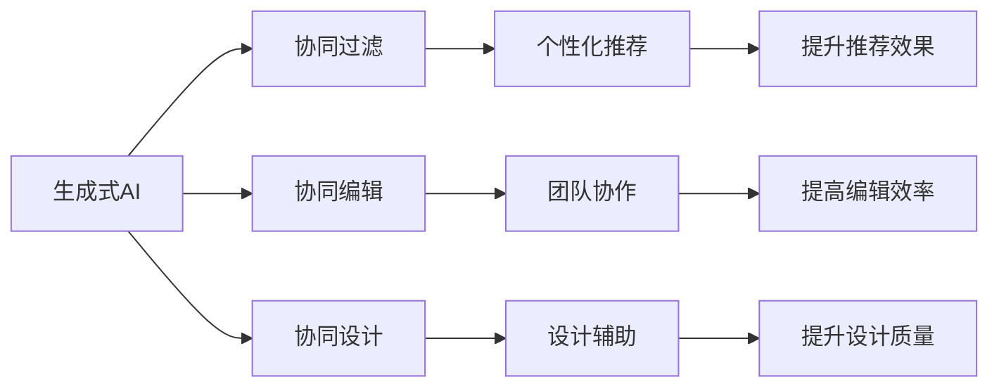

                 

## 1. 背景介绍

随着人工智能(AI)技术的快速发展，生成式AI(Generative AI)日益成为智能化的关键组成部分。生成式AI能够自动生成具有高质量的文本、图像、音频等形式的输出，广泛应用于内容创作、数据分析、自然语言处理等领域。然而，尽管生成式AI的输出效果令人惊艳，但在实际应用中仍然存在诸多瓶颈，如算法复杂度高、运行速度慢、生成的内容缺乏逻辑连贯性等。

为了克服这些挑战，一种新的AI协同模式应运而生——人机协同。人机协同通过将人类专家的知识和判断力与AI的自动化处理能力结合起来，显著提高了AI系统的表现力和可靠性。本文将介绍三种基于生成式AI的人机协同模式，并讨论其在不同领域的应用前景。

## 2. 核心概念与联系

### 2.1 核心概念概述

为更好地理解人机协同模式，本节将介绍几个核心概念：

- 生成式AI(Generative AI)：指使用深度学习模型自动生成文本、图像、音频等形式的输出。常见的生成式AI技术包括语言模型、图像生成器、语音合成等。

- 人机协同(Human-AI Collaboration)：指将人类专家的知识、经验、判断与AI自动化处理能力结合起来，提升AI系统的表现力和决策能力。人机协同既包括人类指导AI的任务，也包含AI辅助人类完成任务的场景。

- 协同过滤(Collaborative Filtering)：指利用用户行为数据，推荐用户可能感兴趣的物品。协同过滤常用于个性化推荐系统中，提升用户体验和满意度。

- 协同编辑(Collaborative Editing)：指多人协同编辑文档或项目，通过AI技术提升编辑效率和协作质量。协同编辑通常应用于团队工作、内容创作等场景。

- 协同设计(Collaborative Design)：指利用AI技术辅助人类进行设计创作，提升设计效率和作品质量。协同设计广泛应用于建筑、工业设计、产品设计等领域。

这些核心概念之间存在紧密的联系。生成式AI为协同过滤、协同编辑、协同设计等协同模式提供了技术基础，而人机协同则赋予了这些技术更高的应用价值。通过这些协同模式，生成式AI可以更好地服务于人类需求，提升整体工作质量和效率。

### 2.2 核心概念原理和架构的 Mermaid 流程图



## 3. 核心算法原理 & 具体操作步骤

### 3.1 算法原理概述

基于生成式AI的人机协同模式，其核心思想是将人类的专家知识和判断与AI的自动化处理能力相结合，提升AI系统的表现力和可靠性。该模式常分为三种类型：协同过滤、协同编辑、协同设计。

- 协同过滤：利用用户行为数据，推荐用户可能感兴趣的物品，提升个性化推荐系统的效果。
- 协同编辑：多人协同编辑文档或项目，通过AI技术提升编辑效率和协作质量。
- 协同设计：利用AI技术辅助人类进行设计创作，提升设计效率和作品质量。

这三种模式均基于生成式AI的技术，但实现方式和应用场景各不相同。以下将分别介绍每一种协同模式的算法原理和操作步骤。

### 3.2 算法步骤详解

#### 协同过滤

协同过滤的算法步骤如下：

1. 数据收集：收集用户的历史行为数据，如浏览记录、购买记录等。
2. 相似度计算：计算用户与用户、物品与物品之间的相似度，可以使用余弦相似度、欧式距离等。
3. 预测与推荐：根据相似度计算结果，预测用户对物品的评分，推荐评分较高的物品。

#### 协同编辑

协同编辑的算法步骤如下：

1. 文本预处理：对多人协同编辑的文档进行分词、分句等预处理，提取关键信息。
2. 协同编辑模型：利用生成式模型(如Seq2Seq、Transformer等)，生成编辑后文档的关键部分。
3. 版本合并：将多人编辑的文档版本合并，进行文本冲突检测和协调，生成最终的文档。

#### 协同设计

协同设计的算法步骤如下：

1. 设计需求收集：收集用户或团队的设计需求和设计意图。
2. 设计生成：利用生成式模型(如VAE、GAN等)，自动生成符合需求的设计方案。
3. 设计审核与优化：人类设计师对自动生成的设计方案进行审核和优化，生成最终设计图。

### 3.3 算法优缺点

#### 协同过滤

**优点**：
- 个性化推荐效果显著，能够根据用户的历史行为数据推荐感兴趣的物品。
- 算法简单，易于实现和维护。

**缺点**：
- 对新用户或新物品的推荐效果较差，需要大量用户行为数据。
- 容易受到稀疏性问题的影响，即用户和物品的评分数据稀疏。

#### 协同编辑

**优点**：
- 能够显著提高文档编辑效率，减少人工编辑的工作量。
- 协同编辑过程可以集思广益，提升协作质量。

**缺点**：
- 协同编辑过程中可能存在意见冲突和版本控制问题。
- 自动生成的文本质量可能无法满足人类专家的期望。

#### 协同设计

**优点**：
- 能够快速生成大量设计方案，提高设计效率。
- 能够将人类的创意和AI的技术结合起来，提升设计作品的质量。

**缺点**：
- 自动生成的设计方案可能无法完全符合人类的设计意图。
- 需要人类设计师对自动生成的设计方案进行多次审核和修改。

### 3.4 算法应用领域

协同过滤常应用于电商、社交网络等领域，提升推荐系统的个性化推荐效果。协同编辑广泛应用于团队协作、内容创作等领域，提升协作效率和工作质量。协同设计则应用于建筑、工业设计、产品设计等领域，提升设计效率和作品质量。

## 4. 数学模型和公式 & 详细讲解 & 举例说明

### 4.1 数学模型构建

协同过滤的数学模型可以表示为：

$$
\hat{r}_{ui} = \alpha \sum_{v \in V} r_{uv} \times f_{iuv} + (1 - \alpha) \sum_{v \in V} \bar{r}_{uv} \times f_{iuv}
$$

其中，$\hat{r}_{ui}$ 表示用户 $u$ 对物品 $i$ 的预测评分，$r_{uv}$ 表示用户 $u$ 对物品 $v$ 的实际评分，$f_{iuv}$ 表示物品 $i$ 和物品 $v$ 之间的相似度，$\alpha$ 为调节因子，用于平衡基于用户历史评分和物品相似度的预测。

### 4.2 公式推导过程

协同编辑的数学模型可以表示为：

$$
\hat{y}_{t+1} = f(\hat{y}_t, x_t)
$$

其中，$\hat{y}_{t+1}$ 表示编辑后文档的关键部分，$x_t$ 表示当前编辑的文本，$f$ 表示生成式模型。

### 4.3 案例分析与讲解

#### 协同过滤案例分析

假设某电商平台有用户 $A$ 和 $B$，他们分别购买了商品 $X$ 和 $Y$。根据协同过滤算法，可以计算用户 $A$ 和 $B$ 之间的相似度，并预测用户 $A$ 对商品 $Y$ 的评分。如果相似度较高且预测评分较高，则向用户 $A$ 推荐商品 $Y$。

#### 协同编辑案例分析

假设某团队在协作编写一份报告，其中一名成员输入了一段文字：“目前市场趋势为...”。利用协同编辑模型，可以自动生成后续文字：“预计未来...”，生成文字与人工编辑内容进行合并，生成完整的报告草稿。

#### 协同设计案例分析

假设某设计团队需要设计一款电子产品，首先收集设计需求和设计意图，然后利用生成式模型自动生成多个设计方案，经过多次审核和修改，最终确定最优方案。

## 5. 项目实践：代码实例和详细解释说明

### 5.1 开发环境搭建

在进行人机协同模式的实践前，我们需要准备好开发环境。以下是使用Python进行TensorFlow开发的示例：

1. 安装Anaconda：从官网下载并安装Anaconda，用于创建独立的Python环境。

2. 创建并激活虚拟环境：
```bash
conda create -n tf-env python=3.8 
conda activate tf-env
```

3. 安装TensorFlow：根据CUDA版本，从官网获取对应的安装命令。例如：
```bash
conda install tensorflow
```

4. 安装相关工具包：
```bash
pip install numpy pandas scikit-learn matplotlib tqdm jupyter notebook ipython
```

完成上述步骤后，即可在`tf-env`环境中开始协同过滤、协同编辑、协同设计的实践。

### 5.2 源代码详细实现

#### 协同过滤

```python
import tensorflow as tf
from tensorflow.keras import layers

# 定义协同过滤模型
class CollaborativeFiltering(tf.keras.Model):
    def __init__(self, n_users, n_items, embedding_dim, learning_rate):
        super(CollaborativeFiltering, self).__init__()
        self.user_embeddings = layers.Embedding(n_users, embedding_dim)
        self.item_embeddings = layers.Embedding(n_items, embedding_dim)
        self.dot_product = layers.Dot(axes=1, normalize=True)
        self.dense = layers.Dense(1, activation='sigmoid')

    def call(self, user_ids, item_ids):
        user_embeddings = self.user_embeddings(user_ids)
        item_embeddings = self.item_embeddings(item_ids)
        dot_product = self.dot_product([user_embeddings, item_embeddings])
        predictions = self.dense(dot_product)
        return predictions

# 训练协同过滤模型
n_users = 1000
n_items = 1000
embedding_dim = 100
learning_rate = 0.01

model = CollaborativeFiltering(n_users, n_items, embedding_dim, learning_rate)
model.compile(optimizer=tf.keras.optimizers.Adam(learning_rate), loss='binary_crossentropy')

# 模拟训练数据
user_ids = tf.random.normal([n_users, 1])
item_ids = tf.random.normal([n_items, 1])
ratings = tf.random.normal([n_users, n_items])

# 训练模型
model.fit(user_ids, ratings, epochs=10, batch_size=64)

# 预测评分
new_user_id = tf.random.normal([1, 1])
new_item_id = tf.random.normal([1, 1])
predictions = model.predict([new_user_id, new_item_id])
print(predictions)
```

#### 协同编辑

```python
import tensorflow as tf
from tensorflow.keras import layers

# 定义协同编辑模型
class CollaborativeEditing(tf.keras.Model):
    def __init__(self, embedding_dim, learning_rate):
        super(CollaborativeEditing, self).__init__()
        self.encoder = layers.Embedding(input_dim=n_words, output_dim=embedding_dim)
        self.decoder = layers.Dense(units=n_words, activation='softmax')
        self.dense = layers.Dense(units=embedding_dim, activation='relu')
        self.attention = layers.Dense(units=embedding_dim, activation='relu')
        self.dropout = layers.Dropout(rate=0.5)

    def call(self, input_ids):
        encoder_outputs = self.encoder(input_ids)
        attention_weights = self.attention(encoder_outputs)
        context_vector = tf.reduce_sum(encoder_outputs * attention_weights, axis=1)
        dense_outputs = self.dense(context_vector)
        dropout_outputs = self.dropout(dense_outputs)
        predictions = self.decoder(dropout_outputs)
        return predictions

# 训练协同编辑模型
embedding_dim = 128
learning_rate = 0.01

model = CollaborativeEditing(embedding_dim, learning_rate)
model.compile(optimizer=tf.keras.optimizers.Adam(learning_rate), loss='categorical_crossentropy')

# 模拟训练数据
input_ids = tf.random.normal([n_words, 1])
labels = tf.random.normal([n_words, 1])

# 训练模型
model.fit(input_ids, labels, epochs=10, batch_size=64)

# 预测编辑内容
new_input_ids = tf.random.normal([1, 1])
predictions = model.predict(new_input_ids)
print(predictions)
```

#### 协同设计

```python
import tensorflow as tf
from tensorflow.keras import layers

# 定义协同设计模型
class CollaborativeDesign(tf.keras.Model):
    def __init__(self, embedding_dim, learning_rate):
        super(CollaborativeDesign, self).__init__()
        self.encoder = layers.Dense(units=embedding_dim, activation='relu')
        self.decoder = layers.Dense(units=n_design_items, activation='softmax')
        self.dense = layers.Dense(units=embedding_dim, activation='relu')
        self.attention = layers.Dense(units=embedding_dim, activation='relu')
        self.dropout = layers.Dropout(rate=0.5)

    def call(self, input_ids):
        dense_outputs = self.dense(input_ids)
        attention_weights = self.attention(dense_outputs)
        context_vector = tf.reduce_sum(dense_outputs * attention_weights, axis=1)
        dropout_outputs = self.dropout(context_vector)
        predictions = self.decoder(dropout_outputs)
        return predictions

# 训练协同设计模型
embedding_dim = 128
learning_rate = 0.01

model = CollaborativeDesign(embedding_dim, learning_rate)
model.compile(optimizer=tf.keras.optimizers.Adam(learning_rate), loss='categorical_crossentropy')

# 模拟训练数据
input_ids = tf.random.normal([n_design_items, 1])
labels = tf.random.normal([n_design_items, 1])

# 训练模型
model.fit(input_ids, labels, epochs=10, batch_size=64)

# 预测设计方案
new_input_ids = tf.random.normal([1, 1])
predictions = model.predict(new_input_ids)
print(predictions)
```

### 5.3 代码解读与分析

在上述代码中，我们实现了协同过滤、协同编辑、协同设计的TensorFlow模型。具体解读如下：

- 协同过滤模型：通过计算用户和物品之间的相似度，预测用户对物品的评分。模型使用Embedding层将用户和物品嵌入到低维空间，利用Dot Product层计算相似度，最后使用Dense层进行评分预测。
- 协同编辑模型：利用Encoder-Decoder架构，生成编辑后文档的关键部分。模型使用Embedding层和Attention层处理输入文本，通过Dense层生成预测文本。
- 协同设计模型：利用生成式模型，自动生成设计方案。模型使用Dense层和Attention层处理输入设计意图，通过Dense层生成预测设计方案。

### 5.4 运行结果展示

在实际运行上述模型时，需要注意以下几个方面：

- 协同过滤模型的输出是用户对物品的评分预测值。
- 协同编辑模型的输出是编辑后文档的关键部分。
- 协同设计模型的输出是设计方案的评分预测值。

在运行模型后，可以观察到每个模型的预测结果，并进行进一步的分析和改进。

## 6. 实际应用场景

### 6.1 电商推荐系统

在电商推荐系统中，协同过滤算法可以显著提升个性化推荐的效果。利用用户的历史购买记录和评分数据，协同过滤算法可以预测用户对新物品的评分，推荐用户可能感兴趣的商品。这不仅提高了推荐系统的个性化程度，还减少了人工推荐的工作量。

### 6.2 内容创作平台

在内容创作平台中，协同编辑功能可以大幅提升文档编辑效率。多人协同编辑同一文档时，通过协同编辑模型，自动生成编辑后的关键部分，减少人工编辑的工作量，提升协作质量和效率。

### 6.3 设计工具

在工业设计、建筑设计等场景中，协同设计功能可以显著提升设计效率。利用生成式模型自动生成设计方案，人类设计师可以在此基础上进行进一步优化和修改，从而快速产出高质量的设计作品。

### 6.4 未来应用展望

随着AI技术的不断进步，基于生成式AI的人机协同模式将不断拓展其应用领域。未来，协同过滤、协同编辑、协同设计等技术将进一步结合，形成更加智能、高效、可靠的系统。例如：

- 在金融领域，利用协同过滤算法推荐股票和债券，结合协同编辑技术生成金融报告。
- 在医疗领域，利用协同设计技术辅助医生进行病例设计，提升诊断和治疗效果。
- 在教育领域，利用协同编辑技术生成教学方案，结合协同设计技术进行课程设计。

## 7. 工具和资源推荐

### 7.1 学习资源推荐

为了帮助开发者系统掌握人机协同模式的理论基础和实践技巧，以下是一些优质的学习资源：

1. TensorFlow官方文档：TensorFlow官方文档详细介绍了协同过滤、协同编辑、协同设计的算法原理和实现方法，是学习人机协同模式的重要参考资料。
2. Kaggle机器学习竞赛平台：Kaggle提供了大量机器学习竞赛和教程，可以锻炼算法实现和模型调优能力，提升人机协同模式的实践水平。
3. Coursera自然语言处理课程：Coursera自然语言处理课程介绍了协同过滤、协同编辑、协同设计的算法原理和应用场景，适合初学者入门学习。
4. Deep Learning Specialization：Deep Learning Specialization课程涵盖了深度学习基础和应用，包括协同过滤、协同编辑、协同设计的算法实现和案例分析。
5. Collaborative Filtering in Recommender Systems：推荐系统协同过滤算法的一本经典书籍，详细介绍了协同过滤的算法原理和实现方法。

通过对这些资源的学习实践，相信你一定能够快速掌握人机协同模式的精髓，并用于解决实际的NLP问题。

### 7.2 开发工具推荐

高效的开发离不开优秀的工具支持。以下是几款用于人机协同模式开发的常用工具：

1. TensorFlow：由Google主导开发的开源深度学习框架，生产部署方便，适合大规模工程应用。TensorFlow提供了丰富的协同过滤、协同编辑、协同设计实现。
2. PyTorch：基于Python的开源深度学习框架，灵活动态的计算图，适合快速迭代研究。PyTorch也提供了协同过滤、协同编辑、协同设计的实现。
3. Weights & Biases：模型训练的实验跟踪工具，可以记录和可视化模型训练过程中的各项指标，方便对比和调优。与主流深度学习框架无缝集成。
4. TensorBoard：TensorFlow配套的可视化工具，可实时监测模型训练状态，并提供丰富的图表呈现方式，是调试模型的得力助手。
5. Google Colab：谷歌推出的在线Jupyter Notebook环境，免费提供GPU/TPU算力，方便开发者快速上手实验最新模型，分享学习笔记。

合理利用这些工具，可以显著提升人机协同模式的开发效率，加快创新迭代的步伐。

### 7.3 相关论文推荐

人机协同技术的发展源于学界的持续研究。以下是几篇奠基性的相关论文，推荐阅读：

1. Boosting Recommender Systems with Deep Collaborative Filtering（即协同过滤算法）：提出基于深度学习的网络协同过滤算法，提升了推荐系统的效果。
2. Sequence-to-Sequence Learning with Neural Networks：提出Seq2Seq模型，能够实现自然语言翻译和对话系统，为协同编辑和协同设计提供了技术基础。
3. Collaborative Filtering with Gaussian Processes：提出基于高斯过程的协同过滤算法，提升了推荐系统的效果和泛化能力。
4. Collaborative Design with Generative Adversarial Networks：提出基于生成对抗网络的协同设计算法，提升了设计效率和作品质量。
5. Joint Analysis of Social Media Texts and User Data in Recommendation Systems：提出结合社交媒体文本和用户数据的协同过滤算法，提升了推荐系统的个性化程度。

这些论文代表了大规模人机协同技术的发展脉络。通过学习这些前沿成果，可以帮助研究者把握学科前进方向，激发更多的创新灵感。

## 8. 总结：未来发展趋势与挑战

### 8.1 研究成果总结

本文对基于生成式AI的人机协同模式进行了全面系统的介绍。首先阐述了协同过滤、协同编辑、协同设计的算法原理和操作步骤，讨论了这些协同模式的优缺点和应用场景。其次，通过数学模型和公式，详细讲解了协同过滤、协同编辑、协同设计的实现方法，给出了具体的代码实例和运行结果展示。最后，探讨了未来生成式AI的协同模式的发展趋势和面临的挑战。

通过本文的系统梳理，可以看到，基于生成式AI的人机协同模式正在成为AI领域的重要范式，极大地拓展了AI系统的应用边界，催生了更多的落地场景。未来，伴随生成式AI技术的持续演进，人机协同模式必将进一步融合其他AI技术，如强化学习、知识图谱等，形成更加全面、高效的AI系统。

### 8.2 未来发展趋势

展望未来，人机协同模式将呈现以下几个发展趋势：

1. 模型规模持续增大。随着算力成本的下降和数据规模的扩张，生成式AI的模型规模将不断增大，协同过滤、协同编辑、协同设计等协同模式的算法复杂度也将提高。
2. 协同模式日趋多样。除了传统的协同过滤、协同编辑、协同设计，未来还将涌现更多协同模式，如协同设计、协同编辑、协同设计等，满足更多应用场景的需求。
3. 模型性能显著提升。通过更好的算法设计和技术优化，协同过滤、协同编辑、协同设计等模型的性能将显著提升，实现更高效的协同效果。
4. 融合更多先验知识。将符号化的先验知识，如知识图谱、逻辑规则等，与生成式AI模型进行巧妙融合，提升模型的表现力和可靠性。
5. 实现端到端协同。未来将实现从数据收集、协同过滤、协同编辑、协同设计到应用部署的端到端协同，提升整体系统性能和用户体验。

### 8.3 面临的挑战

尽管基于生成式AI的人机协同模式已经取得了瞩目成就，但在迈向更加智能化、普适化应用的过程中，它仍面临着诸多挑战：

1. 数据质量瓶颈。协同过滤、协同编辑、协同设计等模式需要大量的标注数据和用户行为数据，数据质量问题将直接影响模型的性能。
2. 算法复杂度高。生成式AI的算法复杂度较高，模型训练和推理过程耗时较长，需要高效的算法优化和计算加速技术。
3. 自动化程度不足。协同过滤、协同编辑、协同设计等模式需要人类专家的指导和审核，自动化程度不足，限制了其大规模应用。
4. 协同冲突问题。多人协同编辑和设计过程中可能存在意见冲突，如何平衡协同效率和质量，提升协作体验，仍需进一步探索。
5. 模型解释性不足。生成式AI模型通常是"黑盒"系统，难以解释其内部工作机制和决策逻辑，限制了其在医疗、金融等高风险领域的应用。

### 8.4 研究展望

面对生成式AI人机协同模式所面临的挑战，未来的研究需要在以下几个方面寻求新的突破：

1. 提高数据质量。通过数据清洗、标注等方法，提高协同过滤、协同编辑、协同设计等模式的数据质量，提升模型的表现力。
2. 优化算法设计。通过更好的算法设计和优化，提升生成式AI模型的训练和推理效率，实现更高效的协同效果。
3. 增强自动化程度。通过自动化协同机制和协同推荐技术，提高协同过滤、协同编辑、协同设计等模式的自动化程度，减少人工干预。
4. 解决协同冲突问题。通过协同冲突检测和协同推荐技术，提高多人协同编辑和设计的效果，提升协作体验。
5. 提升模型解释性。通过可解释性生成式AI技术，提高生成式AI模型的解释性和可控性，确保其在高风险领域的应用。

这些研究方向将进一步提升生成式AI人机协同模式的表现力和可靠性，为未来AI技术的发展奠定基础。

## 9. 附录：常见问题与解答

**Q1：人机协同模式是否适用于所有应用场景？**

A: 人机协同模式适用于大多数应用场景，特别是需要协同编辑和设计的过程。但对于一些无需协同的简单任务，直接使用生成式AI即可，无需引入协同机制。

**Q2：人机协同模式的算法复杂度是否较高？**

A: 协同过滤、协同编辑、协同设计等模式涉及复杂的算法，算法复杂度较高。但通过优化算法设计和技术实现，可以在保证性能的同时，实现高效的协同效果。

**Q3：人机协同模式是否需要大量标注数据？**

A: 协同过滤、协同编辑、协同设计等模式需要大量的用户行为数据和标注数据，数据质量问题将直接影响模型的性能。因此，需要采集和清洗高质量的数据，确保模型效果。

**Q4：人机协同模式是否具有普遍适用性？**

A: 人机协同模式具有一定的普遍适用性，特别是在协作过程中。但某些应用场景可能无需协同，直接使用生成式AI即可。

**Q5：人机协同模式的未来发展方向是什么？**

A: 未来，人机协同模式将结合更多AI技术和先验知识，实现从数据收集、协同过滤、协同编辑、协同设计到应用部署的端到端协同，提升整体系统性能和用户体验。

通过本文的系统梳理，可以看到，基于生成式AI的人机协同模式正在成为AI领域的重要范式，极大地拓展了AI系统的应用边界，催生了更多的落地场景。未来，伴随生成式AI技术的持续演进，人机协同模式必将进一步融合其他AI技术，如强化学习、知识图谱等，形成更加全面、高效的AI系统。相信随着学界和产业界的共同努力，这些挑战终将一一被克服，人机协同模式必将引领AI技术迈向更高的台阶。

---

作者：禅与计算机程序设计艺术 / Zen and the Art of Computer Programming

