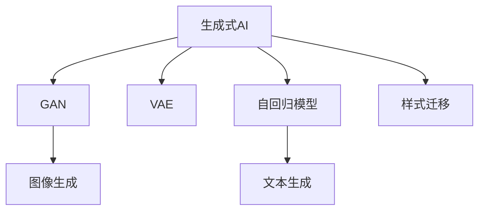

                 

# 生成式AI的实际应用与挑战

## 1. 背景介绍

### 1.1 问题由来

随着深度学习技术的发展，生成式AI（Generative AI）逐渐成为人工智能领域的一大热点。生成式AI主要是指能够自动生成新的数据、内容或媒体的AI技术。它不仅包括传统的基于规则的生成方法，也涵盖了基于深度学习模型的生成技术，如生成对抗网络（GAN）、变分自编码器（VAE）、自回归模型等。

生成式AI在内容创作、图像生成、自然语言处理等领域展示了强大的能力。例如，GAN可以生成逼真的图像和视频，VAE可以用于降维和生成新数据，自回归模型如BERT在自然语言生成、文本生成和对话生成中表现优异。

然而，尽管生成式AI在技术上取得了显著进展，实际应用中仍面临诸多挑战。这些挑战包括如何保证生成的内容的真实性、一致性、多样性和可用性，以及如何处理生成过程中的数据隐私和安全问题。

### 1.2 问题核心关键点

生成式AI的核心挑战主要包括：

- **内容真实性**：生成的内容是否具有真实性，是否与真实数据存在显著差异。
- **内容一致性**：生成的内容是否与上下文或真实世界中的事实保持一致。
- **内容多样性**：生成的内容是否多样、丰富，避免重复和同质化。
- **内容可用性**：生成的内容是否满足实际应用需求，是否具有实用价值。
- **数据隐私与安全**：生成过程中是否保护了数据隐私，是否存在安全漏洞。

本文将详细探讨生成式AI在实际应用中的挑战，并提出一些解决方案和未来发展方向。

## 2. 核心概念与联系

### 2.1 核心概念概述

为更好地理解生成式AI的实际应用与挑战，本节将介绍几个关键概念：

- **生成式AI（Generative AI）**：能够自动生成新的数据、内容或媒体的AI技术。生成式AI的核心在于利用训练数据生成高质量的样本。
- **生成对抗网络（GANs）**：由生成器和判别器两个部分组成的框架，通过对抗训练生成逼真的图像、视频等数据。
- **变分自编码器（VAE）**：一种能够对数据进行降维和生成新数据的模型，常用于生成高质量的图像和文本。
- **自回归模型（如BERT）**：基于自回归结构，能够生成连贯、流畅的文本序列，广泛应用于自然语言处理任务。
- **样式迁移（Style Transfer）**：将一种图像风格应用到另一张图像上，生成具有特定风格的图像或视频。

这些核心概念之间的逻辑关系可以通过以下Mermaid流程图来展示：



这个流程图展示了生成式AI的几个重要分支及其应用场景：

1. GAN用于生成逼真的图像和视频。
2. VAE用于降维和生成新数据。
3. 自回归模型如BERT用于生成连贯的文本序列。
4. 文本生成和样式迁移也是生成式AI的重要应用方向。

## 3. 核心算法原理 & 具体操作步骤
### 3.1 算法原理概述

生成式AI的原理是基于机器学习和深度学习技术，通过训练数据生成新的、与训练数据相似的数据。通常使用生成对抗网络（GAN）和变分自编码器（VAE）等模型，通过对抗训练和优化损失函数来生成高质量的样本。

以下是生成式AI的几个基本原理：

- **对抗训练（Adversarial Training）**：生成器和判别器通过对抗的方式进行训练，生成器试图生成与真实数据难以区分的样本，判别器则试图区分真实数据和生成数据。
- **优化损失函数（Loss Function Optimization）**：通过优化生成器与判别器的损失函数，使得生成器能够生成高质量的样本。
- **自回归模型（Auto-Regressive Models）**：基于自回归结构，能够生成连贯、流畅的文本序列，广泛应用于自然语言处理任务。
- **样式迁移（Style Transfer）**：通过将一张图像的风格应用到另一张图像上，生成具有特定风格的图像或视频。

### 3.2 算法步骤详解

以下是生成式AI的通用步骤：

**Step 1: 准备训练数据**
- 收集用于训练的数据集，确保数据集质量高，涵盖多种多样性。
- 对数据进行预处理，包括清洗、归一化、转换格式等操作。

**Step 2: 设计模型结构**
- 选择适当的生成模型，如GAN、VAE、自回归模型等。
- 设计模型结构，包括生成器、判别器或编码器-解码器的结构。

**Step 3: 训练模型**
- 使用对抗训练或优化损失函数，训练生成模型。
- 在训练过程中，调整超参数，如学习率、批量大小、迭代次数等。
- 使用数据增强技术，扩充训练集，避免过拟合。

**Step 4: 评估与优化**
- 在测试集上评估生成模型的性能，如质量、多样性、一致性等。
- 根据评估结果，优化模型结构和参数设置。
- 使用正则化技术，如Dropout、L2正则等，防止过拟合。

**Step 5: 应用与部署**
- 将训练好的模型应用到实际任务中，如生成图像、视频、文本等。
- 对生成的内容进行后处理，如去噪、风格调整等操作。
- 部署模型到生产环境，实现自动化生成内容。

### 3.3 算法优缺点

生成式AI的优点包括：

- **灵活性高**：生成式AI可以生成多种形式的数据，包括文本、图像、音频等，具有高度的灵活性和多样性。
- **自动化生成**：能够自动生成大量高质量的数据，节省了大量的人力资源。
- **适用性广**：生成式AI可以应用于内容创作、图像处理、自然语言处理等多个领域。

生成式AI的缺点包括：

- **生成质量不稳定**：生成内容的质量可能不稳定，存在生成内容与训练数据不一致的问题。
- **生成速度慢**：生成式AI的训练和生成过程相对较慢，难以实现实时生成。
- **存在隐私风险**：生成过程中可能泄露训练数据中的敏感信息，存在数据隐私和安全问题。

### 3.4 算法应用领域

生成式AI在多个领域展现了广泛的应用潜力：

- **内容创作**：自动生成新闻、文章、报告等文本内容。
- **图像生成**：生成逼真的图像、视频、动画等视觉媒体。
- **自然语言处理**：生成连贯、流畅的对话、摘要等文本内容。
- **风格迁移**：将一种图像风格应用到另一张图像上，生成具有特定风格的图像或视频。
- **数据增强**：生成新数据，扩充训练集，提高模型性能。

## 4. 数学模型和公式 & 详细讲解 & 举例说明
### 4.1 数学模型构建

以下是生成式AI的几个核心数学模型：

**GAN模型**：
- **生成器**：将随机噪声 $\mathbf{z}$ 映射到生成的数据 $\mathbf{x}$。
- **判别器**：将数据 $\mathbf{x}$ 映射到真实性标签 $\mathbf{y}$。

$$
\mathbf{x} = G(\mathbf{z}), \quad \mathbf{y} = D(\mathbf{x})
$$

**VAE模型**：
- **编码器**：将数据 $\mathbf{x}$ 压缩到潜在空间 $\mathbf{z}$。
- **解码器**：将潜在空间 $\mathbf{z}$ 映射回数据空间 $\mathbf{x}$。

$$
\mathbf{z} = E(\mathbf{x}), \quad \mathbf{x} = D(\mathbf{z})
$$

**自回归模型（如BERT）**：
- **自回归结构**：通过前一时刻的输出与当前时刻的输入进行连接，生成连贯的文本序列。

### 4.2 公式推导过程

以下是GAN和VAE的详细公式推导：

**GAN模型**：
- **生成器**：
$$
\mathbf{x} = G(\mathbf{z}) = f_{G}(\mathbf{z})
$$
- **判别器**：
$$
\mathbf{y} = D(\mathbf{x}) = f_{D}(\mathbf{x})
$$
- **对抗训练**：
$$
L_{G} = E_{D}[f_{D}(G(\mathbf{z}))]
$$
$$
L_{D} = E_{G}[f_{G}(D(\mathbf{x}))]
$$
$$
L_{total} = L_{G} + \lambda L_{D}
$$

**VAE模型**：
- **编码器**：
$$
\mathbf{z} = E(\mathbf{x}) = f_{E}(\mathbf{x})
$$
- **解码器**：
$$
\mathbf{x} = D(\mathbf{z}) = f_{D}(\mathbf{z})
$$
- **重构损失**：
$$
L_{recon} = -\frac{1}{N}\sum_{i=1}^N \log p(\mathbf{x}_i|E(\mathbf{x}_i))
$$
- **潜变量先验**：
$$
L_{prior} = -\frac{1}{2}\sum_{i=1}^N D_{KL}(q(\mathbf{z}_i||p(\mathbf{z}_i))
$$

### 4.3 案例分析与讲解

以生成式对抗网络GAN为例，介绍GAN在图像生成中的应用。

**案例分析**：
- **数据集准备**：选择CelebA数据集，包含大量名人照片。
- **模型设计**：选择DCGAN（深度卷积生成对抗网络）作为生成模型，使用ResNet作为生成器，使用LeakyReLU作为激活函数。
- **训练过程**：使用对抗训练，生成器试图生成与真实数据难以区分的图像，判别器则试图区分真实数据和生成数据。
- **评估与优化**：在测试集上评估生成图像的质量和多样性，调整生成器的超参数。

**案例讲解**：
- **超参数设置**：学习率、批量大小、迭代次数等超参数的设置对生成质量有重要影响。
- **正则化技术**：使用L2正则化、Dropout等技术防止过拟合。
- **数据增强**：通过对训练数据进行旋转、缩放、裁剪等操作，扩充训练集。

## 5. 项目实践：代码实例和详细解释说明
### 5.1 开发环境搭建

在进行生成式AI项目实践前，我们需要准备好开发环境。以下是使用Python进行TensorFlow开发的环境配置流程：

1. 安装Anaconda：从官网下载并安装Anaconda，用于创建独立的Python环境。

2. 创建并激活虚拟环境：
```bash
conda create -n tf-env python=3.8 
conda activate tf-env
```

3. 安装TensorFlow：根据CUDA版本，从官网获取对应的安装命令。例如：
```bash
conda install tensorflow -c pytorch -c conda-forge
```

4. 安装各类工具包：
```bash
pip install numpy pandas scikit-learn matplotlib tqdm jupyter notebook ipython
```

完成上述步骤后，即可在`tf-env`环境中开始生成式AI实践。

### 5.2 源代码详细实现

下面以GAN生成逼真图像为例，给出使用TensorFlow实现的完整代码：

**代码实现**：

```python
import tensorflow as tf
from tensorflow.keras import layers
import numpy as np
import matplotlib.pyplot as plt

# 定义生成器
class Generator(tf.keras.Model):
    def __init__(self):
        super(Generator, self).__init__()
        self.dense1 = layers.Dense(256, input_shape=(100,))
        self.dense2 = layers.Dense(256, activation=tf.nn.leaky_relu)
        self.dense3 = layers.Dense(784, activation=tf.nn.tanh)

    def call(self, inputs):
        x = self.dense1(inputs)
        x = self.dense2(x)
        x = self.dense3(x)
        return x

# 定义判别器
class Discriminator(tf.keras.Model):
    def __init__(self):
        super(Discriminator, self).__init__()
        self.dense1 = layers.Dense(256, input_shape=(784,))
        self.dense2 = layers.Dense(256, activation=tf.nn.leaky_relu)
        self.dense3 = layers.Dense(1)

    def call(self, inputs):
        x = self.dense1(inputs)
        x = self.dense2(x)
        x = self.dense3(x)
        return x

# 定义损失函数
def loss_fn(real_output, fake_output, real_labels, fake_labels):
    real_loss = tf.reduce_mean(tf.nn.sigmoid_cross_entropy_with_logits(labels=real_labels, logits=real_output))
    fake_loss = tf.reduce_mean(tf.nn.sigmoid_cross_entropy_with_logits(labels=fake_labels, logits=fake_output))
    return real_loss + fake_loss

# 定义优化器
def optimizer_fn():
    return tf.keras.optimizers.Adam(learning_rate=0.0002)

# 生成样本
def generate_samples(model, noise):
    generated_images = model(noise)
    return generated_images

# 数据准备
def load_data():
    mnist = tf.keras.datasets.mnist.load_data()
    x_train = mnist[0][0].reshape(-1, 784) / 255.0
    return x_train

# 训练函数
def train(model, batch_size):
    data = load_data()
    x_train = data
    x_train = np.expand_dims(x_train, axis=3)
    x_train = x_train.astype(np.float32)
    x_train /= 255.0
    noise = tf.random.normal(shape=[x_train.shape[0], 100])

    generator = Generator()
    discriminator = Discriminator()
    optimizer = optimizer_fn()

    for epoch in range(epochs):
        for i in range(len(x_train) // batch_size):
            real_images = x_train[i*batch_size:(i+1)*batch_size]
            real_labels = tf.ones([batch_size, 1])
            noise = tf.random.normal(shape=[batch_size, 100])
            fake_images = generate_samples(generator, noise)
            fake_labels = tf.zeros([batch_size, 1])

            with tf.GradientTape() as gen_tape, tf.GradientTape() as disc_tape:
                real_output = discriminator(real_images)
                fake_output = discriminator(fake_images)

                gen_loss = loss_fn(real_output, fake_output, real_labels, fake_labels)
                disc_loss = loss_fn(real_output, fake_output, real_labels, fake_labels)

            gradients_of_generator = gen_tape.gradient(gen_loss, generator.trainable_variables)
            gradients_of_discriminator = disc_tape.gradient(disc_loss, discriminator.trainable_variables)

            optimizer.apply_gradients(zip(gradients_of_generator, generator.trainable_variables))
            optimizer.apply_gradients(zip(gradients_of_discriminator, discriminator.trainable_variables))

        if epoch % 10 == 0:
            plt.imshow(generate_samples(generator, noise)[:15] * 255.0, cmap='gray')
            plt.show()

    return generator

# 训练生成模型
generator = train(Generator(), 64)
```

### 5.3 代码解读与分析

让我们再详细解读一下关键代码的实现细节：

**Generator类**：
- 定义生成器的结构，包括三个全连接层，使用LeakyReLU激活函数。
- 在`call`方法中，将输入的随机噪声通过三个全连接层，输出生成图像。

**Discriminator类**：
- 定义判别器的结构，包括三个全连接层，使用LeakyReLU激活函数。
- 在`call`方法中，将输入的图像通过三个全连接层，输出判别结果。

**loss_fn函数**：
- 定义生成器和判别器的损失函数，使用sigmoid交叉熵损失函数。
- 将真实样本和生成样本的损失累加，作为总的损失函数。

**optimizer_fn函数**：
- 定义优化器，使用Adam优化器，学习率为0.0002。

**generate_samples函数**：
- 使用训练好的生成器模型，生成图像。

**load_data函数**：
- 加载MNIST数据集，进行归一化处理。

**train函数**：
- 定义生成器和判别器模型。
- 在每个epoch内，对训练数据进行批处理，计算生成器和判别器的损失函数。
- 使用优化器更新生成器和判别器的参数。
- 每10个epoch输出一次生成的图像。

以上代码实现了GAN模型对MNIST数据集的训练，生成了高质量的逼真图像。可以看到，TensorFlow框架提供了丰富的API和工具，使得生成式AI项目的开发和训练变得简洁高效。

## 6. 实际应用场景

### 6.1 智能创意工具

生成式AI在智能创意工具中展示了广泛的应用潜力。例如，AI设计师可以使用生成式AI来生成新的设计方案，快速迭代创意，提升设计效率。

**应用场景**：
- **图像生成**：设计师可以使用生成式AI生成各种风格和主题的图像，如卡通、插画、产品设计等。
- **文本生成**：设计师可以使用生成式AI生成创意文本，如广告文案、品牌故事等。
- **视频生成**：设计师可以使用生成式AI生成动画、广告视频等。

**实际案例**：
- **Adobe Sensei**：AdobeSensei是Adobe公司的AI设计工具，使用生成式AI自动生成设计方案，提升了设计师的工作效率。

### 6.2 虚拟现实（VR）和增强现实（AR）

生成式AI在VR和AR领域展现了巨大的应用前景。例如，使用生成式AI生成逼真的虚拟环境和场景，为用户提供沉浸式的交互体验。

**应用场景**：
- **虚拟场景生成**：生成逼真的虚拟场景，用于游戏、虚拟旅游、远程会议等。
- **虚拟角色生成**：生成逼真的虚拟角色，用于游戏、社交媒体等。
- **实时渲染**：实时生成高质量的图像和视频，用于实时渲染和交互。

**实际案例**：
- **Oculus Rift**：Oculus Rift使用生成式AI生成逼真的虚拟场景，提升用户的沉浸感和体验。

### 6.3 自动内容创作

生成式AI在自动内容创作中展示了强大的能力。例如，AI作家可以使用生成式AI自动生成文章、小说、诗歌等文本内容。

**应用场景**：
- **新闻生成**：生成新闻报道、分析文章等。
- **小说生成**：生成各种风格和主题的小说。
- **诗歌生成**：生成各种风格和主题的诗歌。

**实际案例**：
- **OpenAI GPT**：OpenAI GPT使用生成式AI自动生成各种文本内容，成为热门的内容创作工具。

### 6.4 图像生成和编辑

生成式AI在图像生成和编辑中展示了广泛的应用潜力。例如，AI艺术家可以使用生成式AI生成各种风格和主题的图像，进行创意编辑。

**应用场景**：
- **图像生成**：生成各种风格和主题的图像，如风景、人物、抽象画等。
- **图像编辑**：对图像进行风格转换、色彩调整、修复等操作。
- **图像生成**：生成逼真的图像，如肖像、虚拟人等。

**实际案例**：
- **DeepArt**：DeepArt使用生成式AI生成各种风格的图像，成为热门的图像编辑工具。

## 7. 工具和资源推荐
### 7.1 学习资源推荐

为了帮助开发者系统掌握生成式AI的理论基础和实践技巧，这里推荐一些优质的学习资源：

1. **《深度学习》课程**：由吴恩达教授主讲的Coursera课程，涵盖深度学习的基本概念和算法，适合初学者和进阶者。
2. **《生成式对抗网络》书籍**：Ian Goodfellow等著，详细介绍了GAN的基本原理和应用，是GAN领域的经典教材。
3. **《Python深度学习》书籍**：François Chollet著，介绍了深度学习模型的实现和应用，适合Python开发者。
4. **TensorFlow官方文档**：TensorFlow的官方文档，提供了丰富的API和示例，适合TensorFlow开发者。
5. **PyTorch官方文档**：PyTorch的官方文档，提供了丰富的API和示例，适合PyTorch开发者。

通过对这些资源的学习实践，相信你一定能够快速掌握生成式AI的精髓，并用于解决实际的AI问题。

### 7.2 开发工具推荐

高效的开发离不开优秀的工具支持。以下是几款用于生成式AI开发的常用工具：

1. **TensorFlow**：由Google主导开发的开源深度学习框架，生产部署方便，适合大规模工程应用。
2. **PyTorch**：Facebook开发的开源深度学习框架，灵活高效，适合研究和开发。
3. **OpenCV**：计算机视觉领域的开源库，提供了丰富的图像处理工具，适合生成式AI中的图像处理任务。
4. **VGG Image Annotator (VIA)**：开源的图像标注工具，支持多种图像标注格式，适合数据标注和处理。

合理利用这些工具，可以显著提升生成式AI的开发效率，加快创新迭代的步伐。

### 7.3 相关论文推荐

生成式AI的发展源于学界的持续研究。以下是几篇奠基性的相关论文，推荐阅读：

1. **《生成式对抗网络》论文**：Ian Goodfellow等，引入了GAN的概念，展示了生成式AI的强大能力。
2. **《变分自编码器》论文**：Kingma等，提出了VAE模型，用于降维和生成新数据。
3. **《自回归语言模型》论文**：Rajpurkar等，提出了自回归语言模型，用于生成连贯、流畅的文本序列。
4. **《风格迁移》论文**：Gatys等，提出了样式迁移方法，将一种图像风格应用到另一张图像上。

这些论文代表了大规模语言模型微调技术的进展，通过学习这些前沿成果，可以帮助研究者把握学科前进方向，激发更多的创新灵感。

## 8. 总结：未来发展趋势与挑战

### 8.1 总结

本文对生成式AI的实际应用与挑战进行了全面系统的介绍。首先阐述了生成式AI在内容创作、图像生成、自然语言处理等多个领域的应用，展示了其强大的能力。其次，介绍了生成式AI的原理、算法步骤和关键技术，详细讲解了GAN和VAE的实现过程。同时，本文还探讨了生成式AI面临的内容真实性、多样性、隐私安全等挑战，并提出了一些解决方案。

通过本文的系统梳理，可以看到，生成式AI技术正在迎来新的发展高峰，在多个领域展示了广阔的应用前景。未来，随着生成式AI的不断演进，其应用场景将进一步拓展，推动AI技术的落地应用。

### 8.2 未来发展趋势

展望未来，生成式AI将呈现以下几个发展趋势：

1. **更高效、更稳定的生成模型**：未来的生成模型将更加高效、稳定，能够在更短的时间内生成高质量的内容。
2. **多模态生成**：生成式AI将能够同时处理文本、图像、音频等多种模态数据，提供更丰富、更全面的内容创作工具。
3. **交互式生成**：未来的生成式AI将具备更高的交互性，能够实时生成内容，满足用户的实时需求。
4. **跨领域应用**：生成式AI将广泛应用于教育、医疗、金融、娱乐等多个领域，提升各个行业的智能化水平。
5. **智能推荐系统**：生成式AI将与推荐系统结合，生成个性化的内容，提升用户体验。

以上趋势凸显了生成式AI的巨大潜力，未来将在更多领域得到广泛应用，推动AI技术的发展。

### 8.3 面临的挑战

尽管生成式AI技术取得了显著进展，但在实际应用中仍面临诸多挑战：

1. **生成内容的真实性**：生成的内容可能与真实数据存在差异，存在内容不真实的问题。
2. **内容的一致性**：生成的内容可能与上下文或真实世界中的事实不一致。
3. **内容的多样性**：生成的内容可能存在同质化的问题，缺乏多样性和丰富性。
4. **隐私安全问题**：生成过程中可能泄露训练数据中的敏感信息，存在数据隐私和安全问题。
5. **计算资源消耗**：生成高质量的内容需要消耗大量的计算资源，难以实现实时生成。

这些挑战需要研究者不断探索新的技术和方法，才能推动生成式AI技术的进一步发展。

### 8.4 研究展望

面向未来，生成式AI的研究可以从以下几个方向寻求新的突破：

1. **更高效的生成模型**：开发更高效的生成模型，提升生成速度和质量。
2. **多模态生成**：将文本、图像、音频等多种模态数据结合起来，生成更加丰富、多样化的内容。
3. **跨领域应用**：将生成式AI应用于更多领域，提升各个行业的智能化水平。
4. **智能推荐系统**：将生成式AI与推荐系统结合，生成个性化的内容，提升用户体验。
5. **智能交互**：实现智能交互生成，提升用户的交互体验和满意度。

这些研究方向将引领生成式AI技术迈向更高的台阶，为构建智能人机交互系统提供新的技术路径。相信随着技术的不断进步，生成式AI将展现出更加广阔的应用前景，推动AI技术在更多领域的落地应用。

## 9. 附录：常见问题与解答

**Q1: 生成式AI与传统内容创作方式有何不同？**

A: 生成式AI能够自动生成高质量的内容，如文本、图像、视频等，大幅降低了内容创作的时间和成本。与传统的内容创作方式相比，生成式AI具有更高的自动化程度和效率，能够快速迭代生成内容，提升创意的丰富性和多样性。

**Q2: 生成式AI如何保证生成的内容的真实性？**

A: 生成式AI通过训练数据和对抗训练机制，学习生成高质量、逼真的内容。同时，可以通过引入先验知识、使用多模态数据等方式，进一步提升生成的内容的真实性。

**Q3: 生成式AI是否存在内容一致性的问题？**

A: 生成式AI在生成内容时，可能存在与真实数据不一致的问题。为了避免这个问题，可以通过引入先验知识、使用多模态数据、使用后处理技术等方式，提高生成的内容的一致性。

**Q4: 生成式AI如何处理数据隐私和安全问题？**

A: 生成式AI在生成过程中，可能泄露训练数据中的敏感信息，存在数据隐私和安全问题。为了保护数据隐私，可以采用数据脱敏、差分隐私等技术，限制训练数据的敏感性。同时，可以引入对抗样本、生成对抗训练等方法，增强模型的鲁棒性，避免生成内容泄露敏感信息。

**Q5: 生成式AI在实际应用中如何保证生成的内容的可用性？**

A: 生成式AI在实际应用中，需要根据具体任务和场景，调整生成模型的参数和超参数，保证生成的内容的可用性。同时，可以通过引入后处理技术、使用多模态数据等方式，提升生成的内容的质量和适用性。

通过以上系统的介绍和分析，相信你对生成式AI的实际应用与挑战有了更加全面的理解。未来的生成式AI技术将不断拓展其应用场景，推动AI技术在更多领域的落地应用，为人类社会带来更多的创新和变革。

