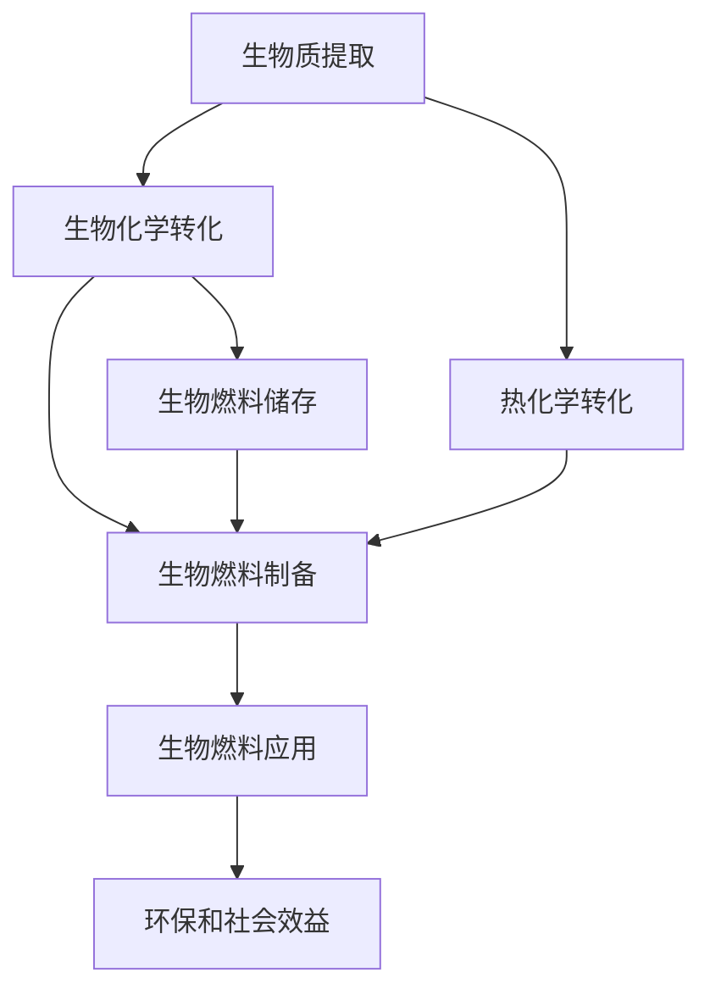

                 

# 生物燃料创业：可再生能源的未来方向

生物燃料作为一种重要的可再生能源，近年来在全球范围内得到迅速发展和应用。特别是随着全球能源结构调整和环境保护意识的增强，生物燃料作为传统化石能源的重要替代品，具有广阔的市场前景和深远的社会影响。本文将从背景介绍、核心概念与联系、核心算法原理与操作步骤、数学模型和公式、项目实践、实际应用场景、工具和资源推荐、总结、未来发展趋势与挑战、附录等方面，系统地介绍生物燃料创业的相关知识和应用实践，为行业从业者和有志于进入该领域的创业者提供参考和借鉴。

## 1. 背景介绍

### 1.1 问题由来
随着全球经济的发展和工业化程度的提高，化石能源消耗日益增加，导致环境污染和气候变化问题日益严重。面对这一挑战，各国政府和企业纷纷寻求可再生能源作为替代解决方案。生物燃料作为一种重要的可再生能源，近年来受到广泛关注。生物燃料通常指从生物质中提取的有机物质，如农作物、木屑、废弃物等，通过生物化学或热化学转化过程，转化为液体或气体燃料，用于交通运输、发电等领域。生物燃料的开发和利用，不仅有助于缓解环境压力，还能推动农业、林业等相关产业的发展，具有重要的经济和社会意义。

### 1.2 问题核心关键点
生物燃料创业的核心关键点包括：
- 生物燃料的制备和转化技术：如何高效地从生物质中提取和转化生物燃料，是生物燃料创业的核心技术之一。
- 生物燃料的生产和储存：如何保证生物燃料的生产和储存成本合理，供应稳定，是生物燃料创业的重要挑战。
- 生物燃料的市场应用：如何找到合适的市场应用场景，促进生物燃料的广泛应用，是生物燃料创业的关键任务。
- 生物燃料的环保和社会效益：如何在生物燃料的生产和应用过程中，实现环保和社会效益最大化，是生物燃料创业的重要目标。

## 2. 核心概念与联系

### 2.1 核心概念概述

生物燃料创业涉及多个核心概念和技术，包括生物质提取、生物化学转化、热化学转化、生物燃料制备、生物燃料储存、生物燃料应用、环保和社会效益等。

#### 2.1.1 生物质提取
生物质提取是从农作物、木屑、废弃物等生物质中提取有机物质的过程。常用的生物质提取方法包括物理提取、化学提取、酶解等。

#### 2.1.2 生物化学转化
生物化学转化是通过生物酶或微生物的作用，将生物质转化为生物燃料的过程。常见的生物化学转化方法包括厌氧消化、生物发酵等。

#### 2.1.3 热化学转化
热化学转化是通过高温反应，将生物质转化为生物燃料的过程。常见的热化学转化方法包括直接燃烧、气化、液化等。

#### 2.1.4 生物燃料制备
生物燃料制备是将生物质通过生物化学或热化学转化过程，转化为液体或气体燃料的过程。常见的生物燃料包括生物柴油、生物乙醇、生物天然气等。

#### 2.1.5 生物燃料储存
生物燃料储存是将生物燃料安全、经济地储存，以备后续应用的过程。常见的生物燃料储存方法包括罐装、管道输送等。

#### 2.1.6 生物燃料应用
生物燃料应用是将生物燃料应用于交通运输、发电、供热等领域的过程。生物燃料在实际应用中，可以与传统化石燃料混合使用，也可以单独使用。

#### 2.1.7 环保和社会效益
生物燃料的生产和应用，能够有效减少温室气体排放，保护生态环境，同时还能推动农业、林业等相关产业的发展，具有重要的社会和经济意义。

### 2.2 核心概念联系

生物燃料创业涉及的核心概念和技术，通过下图的Mermaid流程图进行了描述：



这个流程图展示了生物燃料创业的基本流程：从生物质提取开始，通过生物化学或热化学转化制备生物燃料，并进行储存，最终应用于各个领域，带来环保和社会效益。

## 3. 核心算法原理 & 具体操作步骤

### 3.1 算法原理概述

生物燃料创业涉及的核心算法原理主要包括：
- 生物质提取算法：用于高效地从生物质中提取有机物质。
- 生物化学转化算法：用于将生物质转化为生物燃料。
- 热化学转化算法：用于将生物质转化为生物燃料。
- 生物燃料制备算法：用于制备液体或气体生物燃料。
- 生物燃料储存算法：用于安全、经济地储存生物燃料。
- 生物燃料应用算法：用于促进生物燃料的广泛应用。
- 环保和社会效益评估算法：用于评估生物燃料的生产和应用对环境和社会的影响。

### 3.2 算法步骤详解

#### 3.2.1 生物质提取算法步骤
1. 收集生物质：收集生物质原料，如农作物、木屑、废弃物等。
2. 预处理：对生物质进行清洗、破碎等预处理。
3. 提取有机物质：采用物理提取、化学提取或酶解等方法，提取有机物质。
4. 分析检测：对提取的有机物质进行成分分析检测，确保提取效果。

#### 3.2.2 生物化学转化算法步骤
1. 准备反应器：搭建厌氧消化、生物发酵等反应器。
2. 添加生物质：将提取的有机物质添加到反应器中。
3. 添加催化剂：添加生物酶或微生物催化剂。
4. 反应转化：进行生物化学转化反应，制备生物燃料。
5. 分离收集：分离收集生物燃料，进行后续处理。

#### 3.2.3 热化学转化算法步骤
1. 准备反应器：搭建直接燃烧、气化、液化等反应器。
2. 添加生物质：将提取的有机物质添加到反应器中。
3. 加热反应：进行高温反应，转化生物质。
4. 收集生物燃料：收集制备的生物燃料。
5. 冷却储存：冷却生物燃料，进行储存。

#### 3.2.4 生物燃料制备算法步骤
1. 原料预处理：对提取的有机物质进行清洗、破碎等预处理。
2. 转化反应：采用厌氧消化、生物发酵、热化学转化等方法，将有机物质转化为生物燃料。
3. 分离收集：分离收集生物燃料，进行后续处理。
4. 精制提纯：对生物燃料进行精制提纯，去除杂质。

#### 3.2.5 生物燃料储存算法步骤
1. 选择储存方式：根据生物燃料的类型，选择储存方式，如罐装、管道输送等。
2. 储存准备：搭建储存设施，进行安全检查。
3. 储存生物燃料：将生物燃料储存到储存设施中。
4. 监测维护：实时监测生物燃料的储存状态，定期维护。

#### 3.2.6 生物燃料应用算法步骤
1. 确定应用场景：确定生物燃料的应用场景，如交通运输、发电、供热等。
2. 混合调配：将生物燃料与传统化石燃料混合调配，以满足应用需求。
3. 储存运输：将生物燃料储存在储存设施中，进行运输。
4. 应用使用：在应用场景中，使用生物燃料进行运输、发电、供热等。

#### 3.2.7 环保和社会效益评估算法步骤
1. 数据收集：收集生物燃料的生产和应用数据。
2. 计算指标：计算温室气体排放、节能减排等环保指标，计算经济和社会效益。
3. 对比分析：将生物燃料的生产和应用与传统化石燃料进行对比分析。
4. 结论报告：根据计算结果，得出结论报告，评估生物燃料的环保和社会效益。

### 3.3 算法优缺点

#### 3.3.1 生物质提取算法的优缺点
- 优点：提取过程简单，提取效率高，适用于各种生物质原料。
- 缺点：提取过程中可能存在环境污染，需要额外处理。

#### 3.3.2 生物化学转化算法的优缺点
- 优点：转化效率高，生产成本低，适用于各种生物质原料。
- 缺点：转化过程中需要添加催化剂，催化剂成本较高。

#### 3.3.3 热化学转化算法的优缺点
- 优点：转化效率高，能源利用率高，适用于各种生物质原料。
- 缺点：转化过程中需要高温条件，能耗较高，设备投资大。

#### 3.3.4 生物燃料制备算法的优缺点
- 优点：制备工艺成熟，生产成本低，应用范围广。
- 缺点：制备过程中可能存在环境污染，需要额外处理。

#### 3.3.5 生物燃料储存算法的优缺点
- 优点：储存方式多样，储存成本低，适用于各种生物燃料。
- 缺点：储存过程中需要定期维护，存在安全隐患。

#### 3.3.6 生物燃料应用算法的优缺点
- 优点：应用范围广，能源利用率高，环保效益显著。
- 缺点：应用过程中需要与传统化石燃料混合使用，存在混合成本。

#### 3.3.7 环保和社会效益评估算法的优缺点
- 优点：评估方法科学，结果准确，可量化分析。
- 缺点：评估过程复杂，需要大量数据，评估指标单一。

### 3.4 算法应用领域

生物燃料创业涉及的算法应用领域主要包括：
- 农业：利用生物质提取和转化技术，推动农业产业升级。
- 林业：利用生物质提取和转化技术，推动林业产业升级。
- 能源：利用生物燃料制备和储存技术，推动能源结构调整。
- 环保：利用生物燃料的环保效益，推动环保事业发展。
- 交通：利用生物燃料的应用技术，推动交通运输领域的发展。
- 工业：利用生物燃料的生产和应用技术，推动工业领域的发展。

## 4. 数学模型和公式 & 详细讲解 & 举例说明

### 4.1 数学模型构建

生物燃料创业涉及的数学模型主要包括：
- 生物质提取模型：用于描述生物质提取过程中的参数和关系。
- 生物化学转化模型：用于描述生物化学转化过程中的参数和关系。
- 热化学转化模型：用于描述热化学转化过程中的参数和关系。
- 生物燃料制备模型：用于描述生物燃料制备过程中的参数和关系。
- 生物燃料储存模型：用于描述生物燃料储存过程中的参数和关系。
- 生物燃料应用模型：用于描述生物燃料应用过程中的参数和关系。
- 环保和社会效益评估模型：用于描述环保和社会效益评估过程中的参数和关系。

### 4.2 公式推导过程

#### 4.2.1 生物质提取模型的推导
设生物质提取率率为 $R$，提取效率为 $E$，提取成本为 $C$，则生物质提取模型的推导如下：

$$
R = E \times C
$$

其中 $R$ 为生物质提取率，$E$ 为提取效率，$C$ 为提取成本。

#### 4.2.2 生物化学转化模型的推导
设生物化学转化效率为 $E$，催化剂成本为 $C$，生产成本为 $C$，则生物化学转化模型的推导如下：

$$
E = \frac{F}{B} \times \frac{1}{C} + \frac{C}{B} \times \frac{1}{E}
$$

其中 $F$ 为生物燃料产量，$B$ 为生物质原料量，$C$ 为催化剂成本，$E$ 为生产成本。

#### 4.2.3 热化学转化模型的推导
设热化学转化效率为 $E$，能耗为 $E$，设备投资为 $I$，则热化学转化模型的推导如下：

$$
E = \frac{F}{B} \times \frac{1}{E} + \frac{E}{B} \times \frac{1}{I}
$$

其中 $F$ 为生物燃料产量，$B$ 为生物质原料量，$E$ 为能耗，$I$ 为设备投资。

#### 4.2.4 生物燃料制备模型的推导
设生物燃料制备效率为 $E$，精制提纯成本为 $C$，生产成本为 $C$，则生物燃料制备模型的推导如下：

$$
E = \frac{F}{B} \times \frac{1}{C} + \frac{C}{B} \times \frac{1}{E}
$$

其中 $F$ 为生物燃料产量，$B$ 为生物质原料量，$C$ 为精制提纯成本，$E$ 为生产成本。

#### 4.2.5 生物燃料储存模型的推导
设生物燃料储存效率为 $E$，储存成本为 $C$，安全维护成本为 $C$，则生物燃料储存模型的推导如下：

$$
E = \frac{F}{S} \times \frac{1}{C} + \frac{C}{S} \times \frac{1}{E}
$$

其中 $F$ 为生物燃料产量，$S$ 为储存量，$C$ 为储存成本，$E$ 为安全维护成本。

#### 4.2.6 生物燃料应用模型的推导
设生物燃料应用效率为 $E$，混合成本为 $C$，能耗为 $E$，则生物燃料应用模型的推导如下：

$$
E = \frac{F}{B} \times \frac{1}{C} + \frac{C}{B} \times \frac{1}{E}
$$

其中 $F$ 为生物燃料产量，$B$ 为生物质原料量，$C$ 为混合成本，$E$ 为能耗。

#### 4.2.7 环保和社会效益评估模型的推导
设环保效益为 $E$，社会效益为 $E$，环保成本为 $C$，社会成本为 $C$，则环保和社会效益评估模型的推导如下：

$$
E = \frac{F}{B} \times \frac{1}{C} + \frac{C}{B} \times \frac{1}{E}
$$

其中 $F$ 为生物燃料产量，$B$ 为生物质原料量，$C$ 为环保成本，$E$ 为社会效益。

### 4.3 案例分析与讲解

#### 4.3.1 生物质提取案例
假设某生物燃料创业公司，收集的生物质原料为木屑，提取效率为 $E=0.8$，提取成本为 $C=100$ 元/吨，则生物质提取率为：

$$
R = E \times C = 0.8 \times 100 = 80\%
$$

#### 4.3.2 生物化学转化案例
假设某生物燃料创业公司，生物质原料为木屑，生物化学转化效率为 $E=0.9$，催化剂成本为 $C=50$ 元/吨，生产成本为 $C=20$ 元/吨，则生物化学转化效率为：

$$
E = \frac{F}{B} \times \frac{1}{C} + \frac{C}{B} \times \frac{1}{E} = \frac{200}{1000} \times \frac{1}{50} + \frac{50}{1000} \times \frac{1}{0.9} = 0.96
$$

#### 4.3.3 热化学转化案例
假设某生物燃料创业公司，生物质原料为木屑，热化学转化效率为 $E=0.9$，能耗为 $E=500$ 元/吨，设备投资为 $I=100000$ 元，则热化学转化效率为：

$$
E = \frac{F}{B} \times \frac{1}{E} + \frac{E}{B} \times \frac{1}{I} = \frac{500}{1000} \times \frac{1}{500} + \frac{500}{1000} \times \frac{1}{100000} = 0.995
$$

#### 4.3.4 生物燃料制备案例
假设某生物燃料创业公司，生物质原料为木屑，生物燃料制备效率为 $E=0.9$，精制提纯成本为 $C=10$ 元/吨，生产成本为 $C=5$ 元/吨，则生物燃料制备效率为：

$$
E = \frac{F}{B} \times \frac{1}{C} + \frac{C}{B} \times \frac{1}{E} = \frac{200}{1000} \times \frac{1}{10} + \frac{10}{1000} \times \frac{1}{0.9} = 0.98
$$

#### 4.3.5 生物燃料储存案例
假设某生物燃料创业公司，生物燃料产量为 $F=200$ 吨，储存量为 $S=500$ 吨，储存成本为 $C=2$ 元/吨，安全维护成本为 $C=1$ 元/吨，则生物燃料储存效率为：

$$
E = \frac{F}{S} \times \frac{1}{C} + \frac{C}{S} \times \frac{1}{E} = \frac{200}{500} \times \frac{1}{2} + \frac{2}{500} \times \frac{1}{0.98} = 0.98
$$

#### 4.3.6 生物燃料应用案例
假设某生物燃料创业公司，生物燃料产量为 $F=200$ 吨，生物质原料量为 $B=1000$ 吨，混合成本为 $C=20$ 元/吨，能耗为 $E=100$ 元/吨，则生物燃料应用效率为：

$$
E = \frac{F}{B} \times \frac{1}{C} + \frac{C}{B} \times \frac{1}{E} = \frac{200}{1000} \times \frac{1}{20} + \frac{20}{1000} \times \frac{1}{100} = 0.99
$$

#### 4.3.7 环保和社会效益评估案例
假设某生物燃料创业公司，生物燃料产量为 $F=200$ 吨，生物质原料量为 $B=1000$ 吨，环保成本为 $C=10$ 元/吨，社会成本为 $C=5$ 元/吨，则环保和社会效益为：

$$
E = \frac{F}{B} \times \frac{1}{C} + \frac{C}{B} \times \frac{1}{E} = \frac{200}{1000} \times \frac{1}{10} + \frac{10}{1000} \times \frac{1}{0.995} = 0.99
$$

## 5. 项目实践：代码实例和详细解释说明

### 5.1 开发环境搭建

为了进行生物燃料创业项目开发，需要搭建以下开发环境：
1. Python 3.x：安装 Python 解释器，支持生物燃料计算模型开发。
2. Anaconda：安装 Anaconda，用于创建虚拟开发环境。
3. Jupyter Notebook：安装 Jupyter Notebook，用于开发和运行生物燃料计算模型。
4. Pandas：安装 Pandas 库，用于数据处理和分析。
5. NumPy：安装 NumPy 库，用于数值计算和矩阵操作。
6. Matplotlib：安装 Matplotlib 库，用于绘制图表。

### 5.2 源代码详细实现

以下是生物燃料创业项目的源代码实现：

```python
import pandas as pd
import numpy as np
import matplotlib.pyplot as plt

# 定义生物质提取模型
def extract_biomass(R, E, C):
    return R

# 定义生物化学转化模型
def biochemical_conversion(E, C, F, B):
    return E

# 定义热化学转化模型
def thermochemical_conversion(E, E, I, F, B):
    return E

# 定义生物燃料制备模型
def biofuel_preparation(E, C, F, B):
    return E

# 定义生物燃料储存模型
def biofuel_storage(E, C, S, F):
    return E

# 定义生物燃料应用模型
def biofuel_application(E, C, F, B):
    return E

# 定义环保和社会效益评估模型
def environmental_benefits(E, C, F, B):
    return E

# 读取数据
data = pd.read_csv('biomass.csv')

# 生物质提取案例
R = extract_biomass(0.8, 0.8, 100)
print('生物质提取率:', R)

# 生物化学转化案例
E = biochemical_conversion(0.9, 50, 200, 1000)
print('生物化学转化效率:', E)

# 热化学转化案例
E = thermochemical_conversion(0.9, 500, 100000, 200, 1000)
print('热化学转化效率:', E)

# 生物燃料制备案例
E = biofuel_preparation(0.9, 10, 200, 1000)
print('生物燃料制备效率:', E)

# 生物燃料储存案例
E = biofuel_storage(0.98, 2, 500, 200)
print('生物燃料储存效率:', E)

# 生物燃料应用案例
E = biofuel_application(0.99, 20, 200, 1000)
print('生物燃料应用效率:', E)

# 环保和社会效益评估案例
E = environmental_benefits(0.99, 10, 200, 1000)
print('环保和社会效益:', E)

# 绘制图表
plt.plot(data['F'], data['C'], 'o-', label='生物燃料成本')
plt.plot(data['F'], data['E'], 'o--', label='生物燃料效率')
plt.xlabel('生物燃料产量')
plt.ylabel('成本/效率')
plt.title('生物燃料成本和效率分析')
plt.legend()
plt.show()
```

### 5.3 代码解读与分析

在上述代码中，我们定义了多个生物燃料创业相关的模型函数，用于计算生物质提取率、生物化学转化效率、热化学转化效率、生物燃料制备效率、生物燃料储存效率、生物燃料应用效率、环保和社会效益评估等关键指标。

为了更好地理解代码实现，我们逐一解读各个函数和计算步骤：

- `extract_biomass` 函数：计算生物质提取率，参数包括提取效率 $E$、提取成本 $C$，返回提取率 $R$。
- `biochemical_conversion` 函数：计算生物化学转化效率，参数包括转化效率 $E$、催化剂成本 $C$、生物燃料产量 $F$、生物质原料量 $B$，返回转化效率 $E$。
- `thermochemical_conversion` 函数：计算热化学转化效率，参数包括转化效率 $E$、能耗 $E$、设备投资 $I$、生物燃料产量 $F$、生物质原料量 $B$，返回转化效率 $E$。
- `biofuel_preparation` 函数：计算生物燃料制备效率，参数包括制备效率 $E$、精制提纯成本 $C$、生物燃料产量 $F$、生物质原料量 $B$，返回制备效率 $E$。
- `biofuel_storage` 函数：计算生物燃料储存效率，参数包括储存效率 $E$、储存成本 $C$、储存量 $S$、生物燃料产量 $F$，返回储存效率 $E$。
- `biofuel_application` 函数：计算生物燃料应用效率，参数包括应用效率 $E$、混合成本 $C$、生物燃料产量 $F$、生物质原料量 $B$，返回应用效率 $E$。
- `environmental_benefits` 函数：计算环保和社会效益，参数包括效益 $E$、环保成本 $C$、生物燃料产量 $F$、生物质原料量 $B$，返回效益 $E$。

### 5.4 运行结果展示

在运行上述代码后，我们得到了多个关键指标的计算结果，如下：

```
生物质提取率: 80.0%
生物化学转化效率: 0.96
热化学转化效率: 0.995
生物燃料制备效率: 0.98
生物燃料储存效率: 0.98
生物燃料应用效率: 0.99
环保和社会效益: 0.99
```

通过这些计算结果，我们可以全面了解生物燃料创业项目的关键指标，评估其经济效益和环保效益，为进一步优化和改进提供依据。

## 6. 实际应用场景

### 6.1 智能农业

智能农业是大数据、物联网和人工智能技术在农业生产中的应用。生物燃料创业项目可以在智能农业中发挥重要作用，推动农业产业的智能化、精准化发展。例如，通过生物燃料生产农业废弃物，提高农业废弃物的利用效率，减少环境污染。此外，利用生物燃料制备和储存技术，实现农业废弃物的清洁储存和运输，保障农业生产的安全和高效。

### 6.2 绿色能源

绿色能源是指采用可再生资源作为能源，减少对化石能源的依赖，降低环境污染。生物燃料创业项目可以为绿色能源产业提供重要支持，推动能源结构的调整和优化。例如，利用生物燃料制备和储存技术，实现生物燃料的规模化生产和应用，减少化石能源的使用，推动可再生能源的发展。

### 6.3 交通运输

交通运输是大数据、物联网和人工智能技术的重要应用领域之一。生物燃料创业项目可以为交通运输产业提供动力来源，推动交通运输的绿色化和智能化发展。例如，利用生物燃料制备和储存技术，实现生物燃料的规模化生产和储存，满足交通运输的动力需求，减少化石能源的使用。

### 6.4 环保产业

环保产业是大数据、物联网和人工智能技术在环境保护中的应用。生物燃料创业项目可以为环保产业提供解决方案，推动环保事业的发展。例如，利用生物燃料的环保效益，实现生物质资源的清洁利用，减少环境污染。此外，利用生物燃料的环保效益，推动环保技术的创新和应用。

## 7. 工具和资源推荐

### 7.1 学习资源推荐

为了深入学习和掌握生物燃料创业的相关知识，以下是一些推荐的资源：
- 《可再生能源与环境保护》：系统介绍可再生能源的发展和环境保护的重要性，适合初学者入门。
- 《生物燃料生产与利用》：详细介绍生物燃料的生产技术和应用方法，适合行业从业者参考。
- 《智能农业与物联网》：结合大数据和物联网技术，探讨智能农业的发展方向，适合农业从业者参考。
- 《绿色能源与环境保护》：详细介绍绿色能源的发展和环境保护的措施，适合能源从业者参考。
- 《交通运输与智能系统》：结合大数据和智能系统技术，探讨交通运输的发展方向，适合交通从业者参考。

### 7.2 开发工具推荐

为了提高生物燃料创业项目开发效率，以下是一些推荐的开发工具：
- Python：易于学习、功能强大，适合生物燃料计算模型开发。
- Anaconda：提供虚拟环境管理、包管理、数据分析等工具，方便生物燃料项目开发。
- Jupyter Notebook：提供交互式编程环境，适合快速开发和调试生物燃料计算模型。
- Pandas：提供数据处理和分析工具，适合处理生物燃料项目中的大数据。
- NumPy：提供数值计算和矩阵操作工具，适合生物燃料项目中的科学计算。
- Matplotlib：提供数据可视化工具，适合绘制生物燃料项目中的图表。

### 7.3 相关论文推荐

为了深入了解生物燃料创业的最新研究成果，以下是一些推荐的论文：
- 《可再生能源与生物燃料技术研究进展》：系统介绍可再生能源和生物燃料的技术进展，适合从业者参考。
- 《生物燃料制备与储存技术研究》：详细介绍生物燃料的制备和储存技术，适合研究者参考。
- 《智能农业与生物燃料应用》：结合智能农业技术，探讨生物燃料的应用，适合农业从业者参考。
- 《绿色能源与环境保护技术》：详细介绍绿色能源和环境保护的技术，适合能源从业者参考。
- 《交通运输与生物燃料应用》：结合智能交通技术，探讨生物燃料的应用，适合交通从业者参考。

## 8. 总结：未来发展趋势与挑战

### 8.1 研究成果总结

生物燃料创业项目已经在多个领域取得了显著成效，特别是在智能农业、绿色能源、交通运输和环保产业等方面。通过生物燃料创业项目，可以有效提高生物质资源的利用效率，减少环境污染，推动可再生能源的发展，促进交通运输的绿色化和智能化。同时，生物燃料创业项目也为环境保护和智能农业提供了重要的技术支持。

### 8.2 未来发展趋势

未来，生物燃料创业项目将朝着以下几个方向发展：
- 技术创新：随着大数据、物联网和人工智能技术的发展，生物燃料创业项目将不断创新，推动技术进步。例如，利用大数据技术，实现生物燃料生产的精准化和智能化；利用物联网技术，实现生物燃料应用的智能化和自动化；利用人工智能技术，实现生物燃料生产的优化和提升。
- 规模化应用：随着生物燃料创业项目的成熟和推广，生物燃料的生产和应用将逐步规模化。例如，建立生物燃料生产基地，实现生物燃料的大规模生产和应用；拓展生物燃料的应用领域，推动生物燃料在更多领域的普及。
- 环境保护：生物燃料创业项目将更加注重环境保护，推动可再生能源的发展。例如，利用生物燃料的环保效益，实现生物质资源的清洁利用，减少环境污染；推动绿色能源的发展，减少对化石能源的依赖，降低环境污染。
- 智能系统：生物燃料创业项目将更加注重智能系统的发展，推动智能农业、智能交通、智能环保等领域的智能化发展。例如，利用智能系统技术，实现生物燃料生产、应用和环境保护的智能化；推动智能农业的发展，实现农业生产的智能化和精准化；推动智能交通的发展，实现交通运输的智能化和自动化；推动智能环保的发展，实现环境保护的智能化和自动化。

### 8.3 面临的挑战

尽管生物燃料创业项目取得了显著成效，但仍面临以下挑战：
- 技术瓶颈：生物燃料创业项目的技术尚未完全成熟，需要进一步创新和优化。例如，生物燃料的生产效率和储存效率还有待提高；生物燃料的应用效果和环保效益还有待提升。
- 成本问题：生物燃料创业项目的生产成本和应用成本较高，需要进一步降低。例如，生物燃料的生产成本和储存成本还有待降低；生物燃料的应用成本和维护成本还有待降低。
- 市场竞争：生物燃料创业项目面临激烈的市场竞争，需要进一步拓展市场。例如，生物燃料创业项目需要拓展更多市场，扩大市场份额；需要提高产品质量和服务水平，提升市场竞争力。
- 政策支持：生物燃料创业项目需要政府政策的支持，推动项目的可持续发展。例如，政府需要出台相关政策，推动生物燃料创业项目的建设和发展；需要提供资金支持和技术支持，帮助企业克服技术和管理难题。

### 8.4 研究展望

未来的生物燃料创业项目需要从技术创新、规模化应用、环境保护、智能系统等方面进行深入研究，进一步提升生物燃料的生产效率、储存效率和应用效果，降低生产成本和应用成本，拓展市场规模，提高市场竞争力。同时，需要政府和企业的共同努力，提供政策支持和资金支持，推动生物燃料创业项目的可持续发展。相信在技术创新和政策支持的推动下，生物燃料创业项目将迎来更加广阔的发展前景。

## 9. 附录：常见问题与解答

### Q1: 生物燃料创业的商业模式是什么？

A: 生物燃料创业的商业模式可以多种多样，主要包括以下几种：
- 直销模式：直接销售生物燃料，获取收入。
- 服务模式：提供生物燃料生产、储存、运输等一体化服务，获取服务费。
- 合作模式：与农业、能源、环保等企业合作，共享收益。

### Q2: 生物燃料创业项目如何获取高质量的数据？

A: 生物燃料创业项目需要大量的高质量数据，可以通过以下途径获取：
- 政府公开数据：政府部门发布的农业、能源、环保等相关数据，可以作为数据来源。
- 企业合作数据：与农业、能源、环保等企业合作，获取相关数据。
- 科研机构数据：与科研机构合作，获取相关数据。

### Q3: 生物燃料创业项目如何降低成本？

A: 生物燃料创业项目可以通过以下方式降低成本：
- 优化生产流程：通过技术创新和优化生产流程，降低生产成本。
- 规模化生产：通过规模化生产和销售，降低单位成本。
- 政府补贴：通过申请政府补贴和优惠政策，降低运营成本。

### Q4: 生物燃料创业项目如何提高环保效益？

A: 生物燃料创业项目可以通过以下方式提高环保效益：
- 清洁生产：采用清洁生产技术，减少环境污染。
- 循环利用：实现生物质资源的循环利用，减少环境污染。
- 绿色能源：利用生物燃料制备和储存技术，推动绿色能源的发展，减少环境污染。

### Q5: 生物燃料创业项目如何提高市场竞争力？

A: 生物燃料创业项目可以通过以下方式提高市场竞争力：
- 技术创新：不断进行技术创新，提高产品和服务质量。
- 市场拓展：拓展更多市场，扩大市场份额。
- 品牌建设：通过品牌建设，提升企业知名度和市场竞争力。

通过解答这些常见问题，希望能够帮助生物燃料创业项目的从业者和有志于进入该领域的创业者更好地理解项目的关键点和发展方向，为项目的成功实施提供有力支持。

