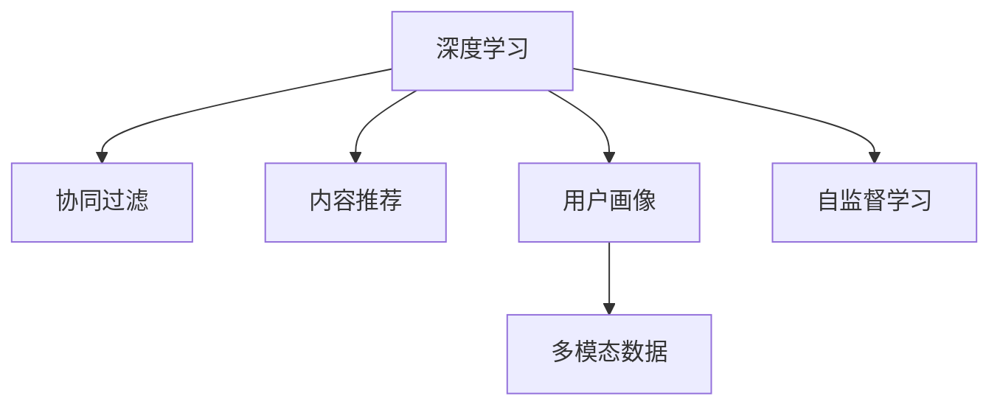

                 

## 1. 背景介绍

### 1.1 问题由来
在电商行业，用户的行为千变万化，如何精准地理解用户需求，为用户提供个性化的商品推荐，成为电商平台提高用户满意度和销售额的关键。传统的推荐系统基于协同过滤、基于内容的推荐等方法，大多依赖用户的历史行为数据和商品属性信息，在用户行为变化频繁、商品属性复杂的情况下，难以实现精准推荐。

人工智能和大数据分析技术的兴起，特别是深度学习技术在推荐系统中的应用，为个性化推荐提供了新的可能。基于深度学习的推荐系统能够从用户历史行为、商品特征以及海量用户数据中挖掘出更深层次的关联关系，提供更加个性化的商品推荐，显著提升了用户的购物体验和平台转化率。

### 1.2 问题核心关键点
在推荐系统的众多算法中，用户画像(User Profile)生成技术是一个重要的组成部分。用户画像是指通过分析用户的历史行为、兴趣偏好、社交网络等数据，构建出用户综合特征的表示。基于用户画像，推荐系统能够更加精准地了解用户需求，从而生成个性化的推荐结果。

本文将聚焦于用户画像生成技术，介绍其核心原理和操作步骤，阐述其在个性化推荐系统中的应用，并给出代码实例进行详细解读。

## 2. 核心概念与联系

### 2.1 核心概念概述

为更好地理解基于深度学习的用户画像生成技术，本节将介绍几个密切相关的核心概念：

- **深度学习**：基于神经网络的机器学习方法，通过多层非线性映射来提取特征，实现对复杂数据模式的建模。
- **协同过滤**：通过分析用户和商品之间的协同关系，生成推荐列表。常分为基于用户的协同过滤和基于物品的协同过滤。
- **内容推荐**：通过分析商品的属性和用户的历史浏览记录，生成相似商品推荐。
- **用户画像**：通过多种数据源，综合用户的历史行为、兴趣偏好、社交网络等，生成用户特征的表示。
- **多模态数据**：融合文本、图像、音频等多种类型的数据，丰富对用户特征的描述。
- **自监督学习**：通过无标签数据进行训练，利用数据的自身结构性信息进行特征提取。

这些核心概念之间的逻辑关系可以通过以下Mermaid流程图来展示：



这个流程图展示了大语言模型的核心概念及其之间的关系：

1. 深度学习作为基础的建模工具，通过神经网络学习数据分布特征。
2. 协同过滤、内容推荐和用户画像共同构成了推荐系统的构建框架，协同完成用户需求理解。
3. 多模态数据融合提供了更加丰富的用户特征描述，自监督学习则从无标签数据中挖掘用户隐性需求。

## 3. 核心算法原理 & 具体操作步骤

### 3.1 算法原理概述

基于深度学习的用户画像生成技术，本质上是一个特征提取和用户分群的过程。其核心思想是：通过深度神经网络模型，从用户的历史行为数据、兴趣偏好、社交网络等多维度数据中提取出用户特征，生成一个紧凑的向量表示，即用户画像。

假设用户画像的生成模型为 $F_{\theta}$，输入数据为 $D=\{(x_i,y_i)\}_{i=1}^N$，其中 $x_i$ 为用户的特征向量，$y_i$ 为对应的标签。用户画像生成的目标是最小化预测误差，即找到最优参数：

$$
\theta^* = \mathop{\arg\min}_{\theta} \mathcal{L}(F_{\theta},D)
$$

其中 $\mathcal{L}$ 为预测误差函数，一般包括交叉熵损失、均方误差等。

在得到用户画像的紧凑表示后，推荐系统可以基于用户画像和商品特征，进行精确匹配和推荐。

### 3.2 算法步骤详解

基于深度学习的用户画像生成，一般包括以下几个关键步骤：

**Step 1: 数据预处理**
- 收集用户的多维度数据，包括浏览记录、购买记录、社交网络等。
- 对数据进行清洗、去重、归一化等处理，保证数据质量。
- 将不同类型的数据进行融合，生成用户特征向量。

**Step 2: 构建用户画像模型**
- 选择合适的深度神经网络模型，如多层感知器(MLP)、卷积神经网络(CNN)、循环神经网络(RNN)、Transformer等。
- 定义损失函数和优化算法，一般使用交叉熵损失和Adam优化器。
- 设计数据增强策略，如添加噪声、旋转、缩放等，增强模型泛化能力。

**Step 3: 训练用户画像模型**
- 将预处理后的数据分为训练集、验证集和测试集，一般按7:2:1的比例划分。
- 在训练集上，使用反向传播算法训练用户画像模型，最小化预测误差。
- 在验证集上，定期评估模型性能，防止过拟合。

**Step 4: 生成用户画像**
- 在测试集上，使用训练好的用户画像模型生成用户画像。
- 对生成的用户画像进行可视化展示，了解用户特征。

**Step 5: 推荐系统集成**
- 将用户画像与商品特征向量进行匹配，生成推荐列表。
- 使用协同过滤、内容推荐等算法进行二次排序，生成最终的推荐结果。
- 对推荐结果进行动态更新，根据用户实时行为进行修正。

以上是基于深度学习的用户画像生成一般流程。在实际应用中，还需要针对具体任务进行优化设计，如改进特征提取方法、优化模型结构、引入更多正则化技术等，以进一步提升模型性能。

### 3.3 算法优缺点

基于深度学习的用户画像生成方法具有以下优点：
1. 可以处理多维度、多模态数据，提供更加丰富的用户特征描述。
2. 能够自动发现数据中的复杂非线性关系，提取更深层次的特征。
3. 在标注数据不足的情况下，仍可取得不错的效果，泛化能力较强。
4. 可解释性较好，通过可视化展示用户画像，帮助开发者理解用户需求。

同时，该方法也存在一些局限性：
1. 计算成本较高，需要大量数据和计算资源进行模型训练。
2. 对模型超参数的调优要求较高，需要较强的领域知识和实践经验。
3. 生成画像的维度较高，可能存在信息过载的问题。
4. 可能存在数据隐私问题，用户数据的收集和存储需要符合隐私法规。

尽管存在这些局限性，但就目前而言，基于深度学习的用户画像生成方法是推荐系统中最先进的方法之一。未来相关研究的重点在于如何进一步降低计算成本，提高模型可解释性，同时兼顾数据隐私保护等技术问题。

### 3.4 算法应用领域

基于深度学习的用户画像生成技术，在推荐系统中的应用广泛，例如：

- 电商平台推荐：基于用户的历史浏览和购买记录，生成个性化商品推荐列表。
- 社交媒体推荐：通过分析用户的社交网络关系和兴趣偏好，推荐相关文章、视频等。
- 视频网站推荐：通过用户对视频的点赞、收藏等行为，生成相关视频推荐。
- 音乐平台推荐：分析用户的听歌记录和听歌偏好，推荐相似音乐和歌手。
- 新闻推荐：根据用户的阅读记录和偏好，推荐相关新闻文章。

除了这些典型应用外，用户画像生成技术还在金融、广告、教育等多个领域得到了广泛应用，为推荐系统的多样化发展提供了新的思路。

## 4. 数学模型和公式 & 详细讲解

### 4.1 数学模型构建

基于深度学习的用户画像生成，通常使用多层感知器(MLP)、卷积神经网络(CNN)、循环神经网络(RNN)、Transformer等模型。这里以MLP为例，介绍用户画像生成的数学模型。

记用户画像生成模型为 $F_{\theta}$，输入数据为 $D=\{(x_i,y_i)\}_{i=1}^N$，其中 $x_i$ 为用户的特征向量，$y_i$ 为对应的标签。用户画像生成的目标是最小化预测误差，即找到最优参数：

$$
\theta^* = \mathop{\arg\min}_{\theta} \mathcal{L}(F_{\theta},D)
$$

其中 $\mathcal{L}$ 为预测误差函数，一般包括交叉熵损失、均方误差等。

### 4.2 公式推导过程

以下我们以二分类任务为例，推导交叉熵损失函数及其梯度的计算公式。

假设用户画像模型 $F_{\theta}$ 在输入 $x$ 上的输出为 $\hat{y}=M_{\theta}(x) \in [0,1]$，表示样本属于正类的概率。真实标签 $y \in \{0,1\}$。则二分类交叉熵损失函数定义为：

$$
\ell(F_{\theta}(x),y) = -[y\log \hat{y} + (1-y)\log (1-\hat{y})]
$$

将其代入经验风险公式，得：

$$
\mathcal{L}(\theta) = -\frac{1}{N}\sum_{i=1}^N [y_i\log F_{\theta}(x_i)+(1-y_i)\log(1-F_{\theta}(x_i))]
$$

根据链式法则，损失函数对参数 $\theta_k$ 的梯度为：

$$
\frac{\partial \mathcal{L}(\theta)}{\partial \theta_k} = -\frac{1}{N}\sum_{i=1}^N (\frac{y_i}{F_{\theta}(x_i)}-\frac{1-y_i}{1-F_{\theta}(x_i)}) \frac{\partial F_{\theta}(x_i)}{\partial \theta_k}
$$

其中 $\frac{\partial F_{\theta}(x_i)}{\partial \theta_k}$ 可进一步递归展开，利用自动微分技术完成计算。

在得到损失函数的梯度后，即可带入参数更新公式，完成模型的迭代优化。重复上述过程直至收敛，最终得到适应用户画像生成的最优模型参数 $\theta^*$。

### 4.3 案例分析与讲解

下面以电商平台推荐系统为例，介绍如何使用深度学习模型生成用户画像。

首先，定义用户画像模型的输入和输出：

- 输入：用户的历史浏览记录、购买记录、评分等，经过数据清洗和归一化处理后，生成一个特征向量 $x$。
- 输出：用户画像向量 $y$，用于表示用户的主要兴趣和行为偏好。

然后，选择并训练用户画像模型。这里以MLP为例，介绍模型的构建和训练过程：

1. 定义模型架构：假设用户画像模型为两层MLP，第一层有128个神经元，激活函数为ReLU，第二层有16个神经元，激活函数为Sigmoid。
2. 定义损失函数和优化器：使用交叉熵损失和Adam优化器，学习率为0.001。
3. 训练模型：将用户特征向量 $x$ 输入模型，经过两层线性变换和激活函数后，输出用户画像向量 $y$。在训练集上，最小化交叉熵损失。

最后，生成用户画像并进行推荐：

1. 在验证集上评估模型性能，根据评价指标（如准确率、召回率）调整模型参数。
2. 在测试集上生成用户画像向量 $y$，将其与商品特征向量进行匹配，生成推荐列表。
3. 使用协同过滤、内容推荐等算法对推荐列表进行二次排序，生成最终推荐结果。

可以看到，基于深度学习的用户画像生成模型，通过学习用户历史数据，能够生成紧凑的用户画像向量，为推荐系统提供有力的用户需求理解支持。

## 5. 项目实践：代码实例和详细解释说明

### 5.1 开发环境搭建

在进行用户画像生成实践前，我们需要准备好开发环境。以下是使用Python进行TensorFlow开发的环境配置流程：

1. 安装Anaconda：从官网下载并安装Anaconda，用于创建独立的Python环境。

2. 创建并激活虚拟环境：
```bash
conda create -n tf-env python=3.8 
conda activate tf-env
```

3. 安装TensorFlow：根据CUDA版本，从官网获取对应的安装命令。例如：
```bash
conda install tensorflow tensorflow-gpu -c conda-forge
```

4. 安装Keras：
```bash
pip install keras
```

5. 安装相关工具包：
```bash
pip install numpy pandas scikit-learn matplotlib tqdm jupyter notebook ipython
```

完成上述步骤后，即可在`tf-env`环境中开始用户画像生成实践。

### 5.2 源代码详细实现

下面我们以电商平台推荐系统为例，给出使用TensorFlow进行用户画像生成的PyTorch代码实现。

首先，定义用户画像模型的输入和输出：

```python
from tensorflow.keras import layers
from tensorflow.keras import models

class UserProfileModel(models.Model):
    def __init__(self, input_dim, output_dim):
        super(UserProfileModel, self).__init__()
        self.dense1 = layers.Dense(128, activation='relu', input_shape=(input_dim,))
        self.dense2 = layers.Dense(output_dim, activation='sigmoid')
        
    def call(self, inputs):
        x = self.dense1(inputs)
        x = self.dense2(x)
        return x
```

然后，定义数据预处理函数：

```python
import numpy as np

def preprocess_data(data):
    # 数据清洗和归一化处理
    # 将数据转化为特征向量
    # 将特征向量转化为模型输入
    # 返回模型输入和标签
    pass
```

接着，定义模型训练函数：

```python
from tensorflow.keras import optimizers

def train_model(model, train_data, val_data, epochs, batch_size):
    model.compile(optimizer=optimizers.Adam(learning_rate=0.001), loss='binary_crossentropy', metrics=['accuracy'])
    model.fit(train_data, epochs=epochs, batch_size=batch_size, validation_data=val_data)
```

最后，定义生成用户画像的函数：

```python
def generate_user_profile(model, data):
    x = preprocess_data(data)
    y_pred = model.predict(x)
    return y_pred
```

### 5.3 代码解读与分析

让我们再详细解读一下关键代码的实现细节：

**UserProfileModel类**：
- `__init__`方法：定义模型的结构，包括两个全连接层。
- `call`方法：定义模型前向传播过程。

**preprocess_data函数**：
- 定义数据预处理的具体步骤，包括数据清洗、归一化、特征提取等。

**train_model函数**：
- 使用TensorFlow的compile和fit方法训练模型，指定优化器、损失函数和评价指标。

**generate_user_profile函数**：
- 将用户数据预处理为模型输入，在模型上进行前向传播，返回用户画像向量。

可以看到，TensorFlow的代码实现相对简洁，能够高效地进行用户画像生成和推荐系统的构建。开发者可以进一步扩展模型的复杂度和功能，实现更高级的推荐算法。

## 6. 实际应用场景

### 6.1 电商推荐系统

电商推荐系统是用户画像生成的典型应用场景。通过用户画像生成技术，电商平台能够准确地理解用户需求，生成个性化的商品推荐列表，提高用户满意度和转化率。

在技术实现上，可以收集用户的历史浏览记录、购买记录、评分等数据，构建用户画像向量。基于用户画像，推荐系统能够快速匹配用户的兴趣偏好，生成相关商品推荐列表。对于用户的新行为，推荐系统能够动态更新用户画像，即时调整推荐结果，提供更加精准的推荐服务。

### 6.2 社交媒体推荐

社交媒体平台可以通过用户画像生成技术，精准地推荐用户感兴趣的文章、视频等内容，提升用户体验和平台活跃度。

具体而言，可以收集用户的历史浏览记录、点赞、分享、评论等数据，构建用户画像向量。基于用户画像，推荐系统能够快速匹配用户的兴趣偏好，生成相关内容推荐列表。对于用户的新行为，推荐系统能够动态更新用户画像，即时调整推荐结果，提供更加精准的内容推荐服务。

### 6.3 视频网站推荐

视频网站推荐系统通过用户画像生成技术，能够推荐用户感兴趣的视频内容，提升用户观看体验和平台黏性。

在技术实现上，可以收集用户的历史观看记录、点赞、收藏等数据，构建用户画像向量。基于用户画像，推荐系统能够快速匹配用户的兴趣偏好，生成相关视频推荐列表。对于用户的新行为，推荐系统能够动态更新用户画像，即时调整推荐结果，提供更加精准的视频推荐服务。

### 6.4 未来应用展望

随着用户画像生成技术的不断发展，其在推荐系统中的应用将更加广泛，为各行各业带来深远影响。

在智慧医疗领域，基于用户画像的医疗推荐系统，能够精准地为用户推荐个性化的医疗方案和治疗建议，提升诊疗效率和效果。

在智能教育领域，基于用户画像的教育推荐系统，能够精准地为用户推荐个性化的学习资源和辅导方案，提升学习效果和体验。

在智慧城市治理中，基于用户画像的城市推荐系统，能够精准地为用户推荐相关的公共服务信息，提升城市治理水平和居民满意度。

此外，在企业生产、社会治理、文娱传媒等众多领域，用户画像生成技术也将得到广泛应用，为行业数字化转型提供新的技术路径。相信随着技术的日益成熟，用户画像生成技术必将在构建人机协同的智能时代中扮演越来越重要的角色。

## 7. 工具和资源推荐

### 7.1 学习资源推荐

为了帮助开发者系统掌握用户画像生成技术的理论基础和实践技巧，这里推荐一些优质的学习资源：

1. 《Deep Learning for Self-Driving Cars》系列博文：由大模型技术专家撰写，深入浅出地介绍了深度学习在自动驾驶中的应用，包括用户画像生成等前沿话题。

2. Coursera《Deep Learning Specialization》课程：斯坦福大学开设的深度学习系列课程，涵盖深度学习的基本概念和经典模型，适合深入学习。

3. 《Hands-On Machine Learning with Scikit-Learn, Keras, and TensorFlow》书籍：TensorFlow官方推荐的学习材料，详细介绍了TensorFlow的使用方法，包括用户画像生成在内的一些经典案例。

4. TensorFlow官方文档：TensorFlow的官方文档，提供了丰富的深度学习模型和用户画像生成样例代码，是上手实践的必备资料。

5. Kaggle竞赛：Kaggle平台上许多数据科学竞赛，包括用户画像生成等数据挖掘任务，能够通过实战提升学习效果。

通过对这些资源的学习实践，相信你一定能够快速掌握用户画像生成技术的精髓，并用于解决实际的推荐问题。

### 7.2 开发工具推荐

高效的开发离不开优秀的工具支持。以下是几款用于用户画像生成开发的常用工具：

1. TensorFlow：由Google主导开发的开源深度学习框架，生产部署方便，适合大规模工程应用。支持构建复杂的深度学习模型。

2. Keras：基于TensorFlow等后端的高级API，支持快速搭建深度学习模型，是TensorFlow的优秀补充。

3. Jupyter Notebook：Jupyter Notebook提供了一个交互式的Python编程环境，方便开发者进行代码实验和调试。

4. PyTorch：基于Python的开源深度学习框架，灵活动态的计算图，适合快速迭代研究。

5. Weights & Biases：模型训练的实验跟踪工具，可以记录和可视化模型训练过程中的各项指标，方便对比和调优。

6. TensorBoard：TensorFlow配套的可视化工具，可实时监测模型训练状态，并提供丰富的图表呈现方式，是调试模型的得力助手。

合理利用这些工具，可以显著提升用户画像生成任务的开发效率，加快创新迭代的步伐。

### 7.3 相关论文推荐

用户画像生成技术的发展源于学界的持续研究。以下是几篇奠基性的相关论文，推荐阅读：

1. Multi-View Matrix Factorization: A unified approach to collaborative filtering（协同过滤）：提出基于多视图矩阵分解的方法，通过融合多个数据源构建用户画像。

2. Factorization Machines for Recommender Systems（因子机）：提出因子机模型，用于处理多维度用户数据，构建精准的用户画像。

3. Attention is All You Need（Transformer论文）：提出Transformer结构，开启了深度学习在推荐系统中的应用。

4. Deep Collaborative Filtering via Multi-Task Learning（多任务学习）：提出多任务学习方法，提升协同过滤的效果。

5. BERT: Pre-training of Deep Bidirectional Transformers for Language Understanding（BERT论文）：提出BERT模型，用于预训练语言表示，为推荐系统提供语义信息支持。

6. Parameter-Efficient Transfer Learning for NLP（PEFT）：提出参数高效转移学习方法，减少微调过程中的参数更新量。

这些论文代表了大语言模型微调技术的发展脉络。通过学习这些前沿成果，可以帮助研究者把握学科前进方向，激发更多的创新灵感。

## 8. 总结：未来发展趋势与挑战

### 8.1 总结

本文对基于深度学习的用户画像生成技术进行了全面系统的介绍。首先阐述了用户画像生成的背景和意义，明确了用户画像在个性化推荐系统中的独特价值。其次，从原理到实践，详细讲解了用户画像生成的数学原理和关键步骤，给出了用户画像生成任务开发的完整代码实例。同时，本文还广泛探讨了用户画像生成在电商、社交媒体、视频网站等多个领域的应用前景，展示了用户画像生成技术的巨大潜力。此外，本文精选了用户画像生成的各类学习资源，力求为读者提供全方位的技术指引。

通过本文的系统梳理，可以看到，基于深度学习的用户画像生成技术正在成为推荐系统的重要范式，极大地拓展了推荐系统的应用边界，催生了更多的落地场景。受益于深度学习模型的强大表现力，用户画像生成在用户需求理解方面取得了显著进步，为推荐系统的多样化发展提供了新的思路。未来，伴随深度学习技术的不断演进，用户画像生成必将在更多领域得到应用，为各行各业带来变革性影响。

### 8.2 未来发展趋势

展望未来，用户画像生成技术将呈现以下几个发展趋势：

1. 模型规模持续增大。随着深度学习模型的不断优化，用户画像模型的复杂度将不断提高，能够更精准地刻画用户需求。

2. 多模态融合增强。用户画像生成将更加注重融合文本、图像、音频等多种类型的数据，提供更加丰富的用户特征描述。

3. 深度强化学习结合。结合深度强化学习技术，用户画像生成能够更加动态地适应用户行为变化，提供更加个性化的推荐服务。

4. 实时性要求提高。用户画像生成需要在用户行为发生的同时，快速生成画像向量，以实现即时的推荐服务。

5. 跨领域应用扩展。用户画像生成技术将从电商、社交媒体等特定领域，拓展到更多行业，如医疗、金融、教育等，提升各行业的智能化水平。

以上趋势凸显了用户画像生成技术的广阔前景。这些方向的探索发展，必将进一步提升推荐系统的性能和应用范围，为各行各业带来深远影响。

### 8.3 面临的挑战

尽管用户画像生成技术已经取得了显著进展，但在迈向更加智能化、普适化应用的过程中，仍面临诸多挑战：

1. 数据隐私问题。用户画像生成需要大量用户数据，可能存在数据隐私泄露的风险。如何在保障隐私的前提下，有效利用用户数据，是用户画像生成的重要挑战。

2. 计算资源消耗。用户画像生成模型通常规模较大，训练和推理过程需要大量计算资源。如何在保证性能的同时，降低计算成本，是一个亟待解决的问题。

3. 模型泛化能力不足。用户画像生成模型对标注数据的依赖较高，容易过拟合。如何提高模型的泛化能力，是一个重要的研究方向。

4. 模型可解释性不足。用户画像生成模型通常是一个黑盒系统，难以解释其内部工作机制和决策逻辑。如何增强模型的可解释性，是用户画像生成技术面临的一个重要挑战。

5. 多模态数据融合复杂。多模态数据融合需要处理不同类型数据的转换和归一化，增加了数据处理的复杂度。如何在不同模态数据间进行高效融合，是用户画像生成技术需要解决的问题。

6. 实时性能要求高。用户画像生成需要实现即时的用户画像更新和推荐，这对系统的实时性能提出了更高的要求。如何在高并发环境下，保证系统的实时性，是用户画像生成技术需要解决的问题。

正视用户画像生成面临的这些挑战，积极应对并寻求突破，将是推动用户画像生成技术不断发展的关键。相信随着学界和产业界的共同努力，这些挑战终将一一被克服，用户画像生成技术必将在构建人机协同的智能时代中扮演越来越重要的角色。

### 8.4 研究展望

面对用户画像生成所面临的种种挑战，未来的研究需要在以下几个方面寻求新的突破：

1. 探索无监督和半监督学习算法。摆脱对大规模标注数据的依赖，利用自监督学习、主动学习等方法，最大限度地利用非结构化数据，提高用户画像生成的效果。

2. 研究参数高效和计算高效的模型架构。开发更加参数高效的模型，在固定大部分预训练参数的情况下，只更新极少量的任务相关参数。同时优化模型的计算图，减少前向传播和反向传播的资源消耗。

3. 引入因果分析和博弈论工具。将因果分析方法引入用户画像生成，识别出模型决策的关键特征，增强输出解释的因果性和逻辑性。借助博弈论工具刻画人机交互过程，主动探索并规避模型的脆弱点，提高系统稳定性。

4. 纳入伦理道德约束。在模型训练目标中引入伦理导向的评估指标，过滤和惩罚有偏见、有害的输出倾向。同时加强人工干预和审核，建立模型行为的监管机制，确保输出符合人类价值观和伦理道德。

这些研究方向的探索，必将引领用户画像生成技术迈向更高的台阶，为构建安全、可靠、可解释、可控的智能系统铺平道路。面向未来，用户画像生成技术还需要与其他人工智能技术进行更深入的融合，如知识表示、因果推理、强化学习等，多路径协同发力，共同推动自然语言理解和智能交互系统的进步。只有勇于创新、敢于突破，才能不断拓展用户画像生成技术的边界，让智能技术更好地造福人类社会。

## 9. 附录：常见问题与解答

**Q1：用户画像生成技术是否适用于所有推荐场景？**

A: 用户画像生成技术在推荐系统中有着广泛的应用，特别是在数据量较大、标注样本较多的场景下，能够取得较好的效果。但对于一些标注数据较少或用户行为模式多样的场景，如短视频、社交媒体等，用户画像生成技术可能难以有效捕捉用户需求。此时可以结合协同过滤、内容推荐等传统方法，进行综合推荐。

**Q2：用户画像生成模型需要多少标注数据？**

A: 用户画像生成模型对标注数据的需求较大，一般需要几万到几十万条数据才能取得较好的效果。对于标注数据较少的场景，可以采用数据增强、主动学习等方法，提升模型泛化能力。同时，也可以结合无监督学习方法，从数据本身中挖掘用户特征。

**Q3：用户画像生成是否需要实时更新？**

A: 用户画像生成模型的实时性要求较高，特别是在电商推荐、社交媒体推荐等场景中，需要及时更新用户画像，以提供个性化的推荐服务。可以在用户行为发生时，即时更新用户画像，或者采用增量学习的方式，降低实时更新的计算成本。

**Q4：如何评估用户画像生成的效果？**

A: 用户画像生成的效果可以通过多种指标进行评估，包括准确率、召回率、F1分数等。在电商推荐中，可以评估推荐列表的点击率、转化率等实际效果。在社交媒体推荐中，可以评估推荐内容的用户点击率、互动率等。

**Q5：用户画像生成是否需要考虑隐私保护？**

A: 用户画像生成需要大量用户数据，涉及用户隐私保护问题。需要采用数据匿名化、数据加密等手段，确保用户数据的安全性。同时，需要对数据使用进行严格的控制，避免滥用。

这些问题的解答，可以帮助开发者更好地理解用户画像生成技术，指导其在推荐系统中的实际应用。

---

作者：禅与计算机程序设计艺术 / Zen and the Art of Computer Programming

