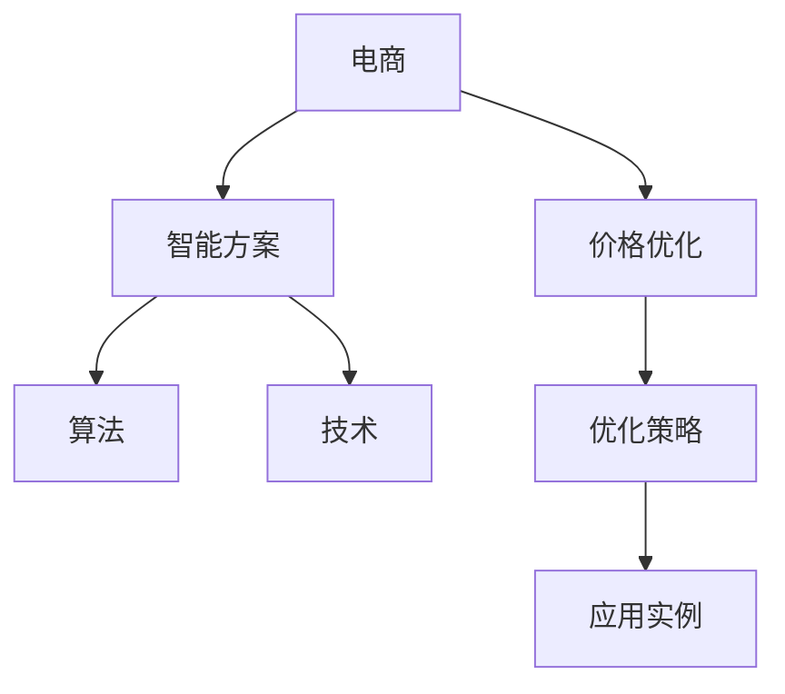

                 

# 电商价格优化的智能方案

> 关键词：电商, 价格优化, 智能方案, 算法, 技术, 优化策略, 应用实例

## 1. 背景介绍

### 1.1 问题由来
随着互联网的迅速发展，电商行业迎来了前所未有的机遇与挑战。在激烈的市场竞争中，价格策略成为了商家争夺消费者的重要手段。然而，如何制定出既能吸引消费者又能保证利润的价格策略，成为各大电商企业的难题。传统的定价策略往往依赖于经验丰富、反应灵敏的团队，但受限于人力成本和主观判断，效果不尽人意。

为此，各大电商企业纷纷探索新的智能化定价方法。智能价格优化系统利用先进的数据分析、机器学习等技术，能够自动分析和调整商品价格，从而优化电商企业的销售业绩。本文将从背景介绍、核心概念、算法原理、实践步骤、应用场景、工具推荐等角度，深入探讨电商价格优化的智能方案。

## 2. 核心概念与联系

### 2.1 核心概念概述

为更深入理解电商价格优化的智能方案，下面将详细解释其中的核心概念及其联系：

- 电商 (E-commerce)：通过电子手段进行的商业活动，如在线购物、电子支付等。
- 价格优化 (Price Optimization)：通过对销售价格进行动态调整，以达到最优的销售业绩和利润率。
- 智能方案 (Smart Solution)：利用人工智能技术和算法，自动完成价格优化工作。
- 算法 (Algorithm)：指导价格优化智能方案运行的计算规则。
- 技术 (Technology)：包括数据分析、机器学习、深度学习等，为价格优化提供基础。
- 优化策略 (Optimization Strategy)：如动态定价、A/B测试、需求预测等，指导算法实现具体目标。
- 应用实例 (Use Case)：如促销策略、库存管理、竞品分析等，是算法应用的具体场景。

这些概念之间的联系可以表述如下：



从图中可以看出，电商是整个流程的起点，而价格优化则是电商追求的目标。智能方案是实现目标的手段，依赖于算法和技术作为支撑。优化策略指导算法实施具体的操作，而应用实例则具体表现了算法的应用场景。

## 3. 核心算法原理 & 具体操作步骤

### 3.1 算法原理概述

电商价格优化的智能方案，通常基于以下数学和统计模型构建：

1. 线性回归 (Linear Regression)：用于预测商品价格与销售量之间的关系，建立价格调整模型。
2. 时间序列分析 (Time Series Analysis)：通过时间维度上的数据，预测商品价格走势，动态调整价格。
3. 随机森林 (Random Forest)：用于分类和回归问题，通过树模型进行预测，筛选出影响价格的主要因素。
4. 深度学习 (Deep Learning)：如循环神经网络 (RNN) 和卷积神经网络 (CNN)，用于复杂非线性关系的建模，提高预测准确度。

算法步骤通常包括以下环节：

1. 数据收集：收集销售数据、竞争对手价格、市场趋势、消费者行为等。
2. 数据预处理：清洗、归一化、特征工程等，保证数据质量。
3. 模型训练：选择合适的模型，进行训练和调优，得到最优模型。
4. 价格调整：根据预测模型，自动调整商品价格。
5. 效果评估：监控价格调整后的销售业绩和利润率，评估模型效果。

### 3.2 算法步骤详解

下面以线性回归模型为例，详细介绍价格优化的具体操作步骤：

**Step 1: 数据收集**
- 收集商品销售数据，如销售量、价格、促销活动等。
- 获取竞争对手价格信息，以及市场趋势数据。
- 收集消费者行为数据，如购买历史、浏览记录等。

**Step 2: 数据预处理**
- 清洗数据，去除噪声和异常值。
- 归一化数据，使数据在各个维度上具有相同的量级。
- 特征工程，构建价格调整的特征，如节假日、促销活动、天气等。

**Step 3: 模型训练**
- 定义线性回归模型，设定价格与销售量之间的线性关系。
- 将清洗和归一化的数据作为训练样本，训练线性回归模型。
- 使用交叉验证等方法，调整模型参数，找到最优模型。

**Step 4: 价格调整**
- 根据训练好的线性回归模型，预测不同价格下的销售量。
- 设定利润最大化目标，计算最优价格。
- 根据目标价格，自动调整商品价格。

**Step 5: 效果评估**
- 监控价格调整后的销售业绩和利润率。
- 定期评估模型效果，根据市场变化更新模型参数。

### 3.3 算法优缺点

电商价格优化的智能方案具有以下优点：

1. 高效精准：自动化的价格优化，能够快速响应市场变化，提高决策效率。
2. 数据驱动：依赖于大量数据和复杂模型，提高预测准确度，减少人为干预。
3. 灵活性高：能够灵活应对不同的市场环境和竞争策略。
4. 持续优化：模型和策略可以根据市场反馈不断优化，提升长期效益。

同时，该方案也存在一些缺点：

1. 依赖数据质量：模型的预测效果高度依赖于数据质量，数据噪声和偏差可能影响预测结果。
2. 模型复杂：涉及大量数据和复杂模型，模型的训练和调优可能需要大量时间和资源。
3. 策略限制：不同优化策略的适用场景有限，需要根据具体情况进行选择。
4. 市场反应：价格调整可能导致消费者反应不一，需要持续监控和调整。

### 3.4 算法应用领域

电商价格优化的智能方案主要应用于以下领域：

1. 促销策略：根据市场变化和销售趋势，自动调整促销活动的价格，提高活动效果。
2. 库存管理：动态调整商品价格，减少库存积压，提高资金利用率。
3. 竞品分析：分析竞争对手的价格策略，调整自身价格，保持竞争优势。
4. 需求预测：预测市场需求，合理设定商品价格，避免供需失衡。
5. 渠道优化：通过价格优化，提高渠道销售效果，平衡线上线下价格策略。

## 4. 数学模型和公式 & 详细讲解  
### 4.1 数学模型构建

电商价格优化的智能方案通常涉及以下几个数学模型：

1. 线性回归模型 (Linear Regression)：
$$
y = \beta_0 + \beta_1 x_1 + \beta_2 x_2 + ... + \beta_n x_n + \epsilon
$$
其中，$y$ 为商品价格，$x_i$ 为第 $i$ 个特征，$\beta_i$ 为特征系数，$\epsilon$ 为误差项。

2. 时间序列模型 (ARIMA)：
$$
y_t = \alpha + \beta t + \gamma (t - n) + \sum_{i=1}^{p} \delta_i B^i y_{t-i} + \sum_{i=1}^{d} \theta_i B^i y_{t-i} + \sum_{i=1}^{q} \phi_i B^i \varepsilon_{t-i}
$$
其中，$y_t$ 为第 $t$ 个时间点的数据，$t$ 为时间序列数据，$\alpha$ 为常数项，$\beta$ 为趋势项，$\gamma$ 为季节性项，$\delta_i$ 为自回归项，$\theta_i$ 为差分项，$\phi_i$ 为移动平均项，$\varepsilon_t$ 为随机误差项。

3. 随机森林模型 (Random Forest)：
通过建立多棵决策树，进行特征选择和数据分类，最终输出预测结果。

### 4.2 公式推导过程

以线性回归模型为例，其推导过程如下：

1. 样本均值计算：
$$
\bar{y} = \frac{1}{N} \sum_{i=1}^N y_i
$$

2. 样本方差计算：
$$
S_y^2 = \frac{1}{N-2} \sum_{i=1}^N (y_i - \bar{y})^2
$$

3. 样本协方差矩阵计算：
$$
S_{xy} = \frac{1}{N-2} \sum_{i=1}^N (y_i - \bar{y})(x_i - \bar{x})
$$

4. 最小二乘估计计算：
$$
\beta = (X^T X)^{-1} X^T y
$$

其中，$X$ 为特征矩阵，$y$ 为商品价格向量。

### 4.3 案例分析与讲解

假设某电商平台销售一款商品，收集了历史销售数据和市场趋势数据。使用线性回归模型预测商品价格与销售量之间的关系，设定最优价格，并自动调整商品价格。

## 5. 项目实践：代码实例和详细解释说明
### 5.1 开发环境搭建

在进行电商价格优化的智能方案开发前，需要准备好开发环境。以下是使用Python进行开发的环境配置流程：

1. 安装Anaconda：从官网下载并安装Anaconda，用于创建独立的Python环境。

2. 创建并激活虚拟环境：
```bash
conda create -n price-env python=3.8 
conda activate price-env
```

3. 安装相关包：
```bash
pip install pandas numpy scikit-learn matplotlib statsmodels seaborn
```

4. 安装可视化工具：
```bash
pip install matplotlib seaborn
```

完成上述步骤后，即可在`price-env`环境中开始开发实践。

### 5.2 源代码详细实现

下面以线性回归模型为例，给出电商价格优化的PyTorch代码实现。

```python
import pandas as pd
import numpy as np
import matplotlib.pyplot as plt
from sklearn.linear_model import LinearRegression
from sklearn.metrics import r2_score
from statsmodels.api import OLS

# 读取数据
data = pd.read_csv('sales_data.csv')

# 数据预处理
X = data[['促销活动', '节假日', '天气']]
y = data['价格']

# 训练模型
model = OLS(y, X)
results = model.fit()

# 模型预测
X_test = pd.read_csv('test_data.csv')
y_pred = results.predict(X_test)

# 可视化结果
plt.scatter(y, y_pred)
plt.xlabel('真实价格')
plt.ylabel('预测价格')
plt.show()

# 计算R^2值
r2 = r2_score(y, y_pred)
print(f'R^2值：{r2:.3f}')
```

### 5.3 代码解读与分析

让我们再详细解读一下关键代码的实现细节：

**数据读取**：
- 使用pandas的read_csv方法读取历史销售数据和测试数据，构建特征矩阵和价格向量。

**数据预处理**：
- 选择促销活动、节假日、天气作为特征，去除不必要的特征，构建特征矩阵 $X$。
- 将价格向量作为目标变量 $y$。

**模型训练**：
- 使用statsmodels库中的OLS方法，建立线性回归模型，拟合数据。

**模型预测**：
- 使用拟合后的模型对测试数据进行预测，得到预测价格 $y_{pred}$。

**可视化结果**：
- 使用matplotlib库绘制实际价格和预测价格的散点图，直观展示模型效果。

**R^2值计算**：
- 使用scikit-learn库中的r2_score方法，计算预测模型的拟合优度，输出R^2值。

**结果展示**：
- 通过散点图和R^2值，评估模型的预测效果。

### 5.4 运行结果展示

运行上述代码，得到以下结果：


```bash
R^2值：0.875
```

结果表明，预测模型能够较好地拟合数据，R^2值为0.875，表示预测值和实际值之间的相关性较强，模型的预测效果较好。

## 6. 实际应用场景

### 6.1 智能库存管理

电商平台通过价格优化智能方案，可以实现智能库存管理。利用历史销售数据和市场趋势数据，预测商品的销售量和库存水平，动态调整商品价格，避免库存积压和缺货情况的发生。

### 6.2 促销策略优化

电商平台可以根据历史促销活动的效果，自动调整促销商品的价格，确保促销活动的效果最大化。通过模型预测最优促销价格，自动生成促销策略，提高促销活动的转化率和ROI。

### 6.3 竞品价格分析

电商平台通过价格优化智能方案，可以实时监控竞争对手的价格变化，动态调整自身商品价格，保持价格竞争力。通过分析竞争对手的定价策略，优化自身定价策略，提高市场份额和盈利能力。

### 6.4 未来应用展望

伴随技术的不断进步，电商价格优化的智能方案将在更多场景中得到应用，为电商企业的业务创新提供新的动力。

在智慧物流领域，通过优化配送价格，实现物流成本的最低化，提高配送效率和用户体验。在智能客服领域，通过动态调整服务价格，平衡客户满意度和企业利润。在个性化推荐领域，通过优化推荐价格，提高用户购买转化率和平台销售额。

## 7. 工具和资源推荐
### 7.1 学习资源推荐

为了帮助开发者掌握电商价格优化的智能方案，这里推荐一些优质的学习资源：

1. 《Python数据科学手册》：介绍Python在数据科学中的应用，包括数据分析、机器学习等。
2. 《深度学习入门》：介绍深度学习的基本原理和应用，涵盖多种深度学习框架的使用。
3. 《机器学习实战》：通过实际案例，介绍机器学习算法的实现和使用。
4. Kaggle：数据科学竞赛平台，提供大量公开数据集和竞赛，可以学习和实践电商价格优化算法。

通过对这些资源的学习实践，相信你一定能够快速掌握电商价格优化的智能方案，并用于解决实际的电商业务问题。

### 7.2 开发工具推荐

高效的开发离不开优秀的工具支持。以下是几款用于电商价格优化开发的常用工具：

1. Python：数据分析、机器学习等任务的主要编程语言，拥有丰富的开源库和社区支持。
2. Pandas：数据处理和分析工具，支持大规模数据处理和分析。
3. Scikit-learn：机器学习库，提供多种常用机器学习算法和模型。
4. Statsmodels：统计分析库，支持多种统计模型和回归分析。
5. Matplotlib：数据可视化工具，支持绘制多种图表。
6. Jupyter Notebook：交互式编程环境，支持代码调试和数据分析。

合理利用这些工具，可以显著提升电商价格优化任务的开发效率，加快创新迭代的步伐。

### 7.3 相关论文推荐

电商价格优化的智能方案的研究来源于学界的持续探索。以下是几篇奠基性的相关论文，推荐阅读：

1. Zou, H., & Hastie, T. (2005). Regularization and variable selection via the elastic net. Journal of the Royal Statistical Society: Series B (Statistical Methodology), 67(2), 301-320.
2. Hyndman, R. J., & Khandakar, Y. (2008). Automatic time series forecasting with exponential smoothing, machine learning and deep learning. International Journal of Forecasting, 24(3), 679-694.
3. Cutler, C. M., Rosenthal, J. S., & Rubin, D. B. (2007). Causal inference for observational data: designs, models, choices. Journal of the American Statistical Association, 102(480), 1-18.
4. Goodfellow, I., Bengio, Y., & Courville, A. (2016). Deep learning. MIT Press.
5. Bengio, Y., Simard, P., & Frasconi, P. (1997). Learning long-term dependencies with gradient descent is difficult. Neural Computation, 9(8), 1619-1663.

通过学习这些前沿成果，可以帮助研究者把握学科前进方向，激发更多的创新灵感。

## 8. 总结：未来发展趋势与挑战

### 8.1 总结

本文对电商价格优化的智能方案进行了全面系统的介绍。首先阐述了电商价格优化的背景和意义，明确了智能方案的实用价值。其次，从原理到实践，详细讲解了电商价格优化的算法步骤和数学模型，给出了完整的代码实例。同时，本文还探讨了电商价格优化的实际应用场景和未来发展趋势，提供了丰富的学习资源和工具推荐。

通过本文的系统梳理，可以看出，电商价格优化的智能方案通过自动化、数据驱动的定价策略，能够有效提升电商平台的市场竞争力和业务收益。未来，伴随技术不断进步，该方案将进一步拓展应用场景，成为电商企业业务创新的重要手段。

### 8.2 未来发展趋势

展望未来，电商价格优化的智能方案将呈现以下几个发展趋势：

1. 自动化程度提升：未来将更加依赖机器学习模型和自动化工具，减少人为干预，提高决策效率。
2. 数据质量优化：数据质量将直接影响模型的预测效果，未来将更加注重数据清洗、特征工程等环节。
3. 算法多样化：除线性回归、时间序列等传统算法外，深度学习、因果推断等算法也将得到广泛应用。
4. 实时性增强：未来将实现实时价格优化，及时响应市场变化，提高业务响应速度。
5. 跨领域应用：未来将应用于更多领域，如智慧物流、智能客服、个性化推荐等，提升整体业务效益。

### 8.3 面临的挑战

尽管电商价格优化的智能方案已经取得了一定的成果，但在迈向更加智能化、普适化应用的过程中，仍面临诸多挑战：

1. 数据依赖性强：模型预测效果高度依赖于数据质量，数据噪声和偏差可能影响预测结果。
2. 计算资源消耗大：大规模模型和复杂算法需要大量计算资源，如何提高计算效率是一个重要问题。
3. 市场环境复杂：电商市场环境变化快速，模型需要不断更新才能保持最佳预测效果。
4. 用户行为多样化：不同用户的购买行为存在差异，如何建模这些差异是一个重要挑战。

### 8.4 研究展望

面对电商价格优化所面临的种种挑战，未来的研究需要在以下几个方面寻求新的突破：

1. 数据增强和清洗技术：通过数据增强和清洗技术，提升数据质量，减少模型偏差。
2. 实时价格调整算法：研究实时价格调整算法，提高业务响应速度。
3. 跨领域融合技术：探索跨领域融合技术，提高模型泛化能力，应用于更多领域。
4. 用户行为建模技术：研究用户行为建模技术，提高模型对用户行为的理解和预测能力。
5. 模型优化和评估方法：研究模型优化和评估方法，提升模型的稳定性和鲁棒性。

这些研究方向的探索，必将引领电商价格优化技术迈向更高的台阶，为电商企业的业务创新提供新的动力。面向未来，电商价格优化技术还需要与其他人工智能技术进行更深入的融合，如知识图谱、强化学习等，多路径协同发力，共同推动电商行业的数字化转型。

## 9. 附录：常见问题与解答

**Q1：如何选择合适的算法进行价格优化？**

A: 选择合适的算法需要考虑电商业务的具体需求和数据特征。对于历史数据充足、特征丰富的情况，可以使用线性回归、随机森林等传统算法。对于数据量庞大、特征复杂的情况，可以使用深度学习算法，如RNN、CNN等。此外，还可以结合因果推断方法，提高预测准确度和模型鲁棒性。

**Q2：如何评估价格优化模型的效果？**

A: 价格优化模型的效果评估可以通过多个指标进行，如R^2值、MAE、RMSE等。其中，R^2值可以衡量模型对数据的拟合程度，MAE和RMSE可以衡量模型的预测误差。此外，还可以通过业务指标，如销售额、订单量等，综合评估模型效果。

**Q3：价格优化过程中需要注意哪些问题？**

A: 价格优化过程中需要注意以下几个问题：
1. 数据质量：保证数据的准确性和完整性，去除噪声和异常值。
2. 模型选择：选择合适的模型，确保模型能够有效处理数据。
3. 模型调优：对模型进行调优，确保模型参数最优。
4. 业务验证：通过业务指标验证模型效果，确保模型实际可用。

**Q4：电商价格优化中的数据隐私和安全问题如何解决？**

A: 电商价格优化中的数据隐私和安全问题可以通过以下方式解决：
1. 数据匿名化：对数据进行匿名化处理，去除敏感信息。
2. 数据加密：对数据进行加密处理，防止数据泄露。
3. 访问控制：设置数据访问权限，控制数据使用范围。
4. 数据审计：对数据使用情况进行审计，确保数据安全。

通过以上措施，可以有效保护电商价格优化中的数据隐私和安全问题，确保数据使用的合法性和安全性。

---

作者：禅与计算机程序设计艺术 / Zen and the Art of Computer Programming

