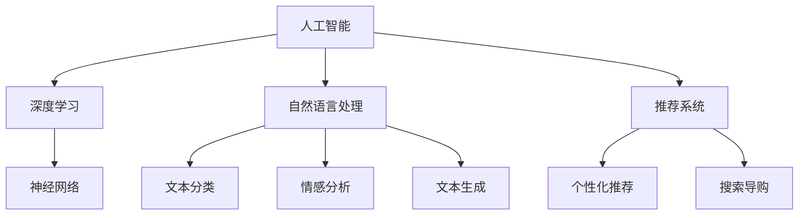

                 

# 电商搜索导购的未来：AI将如何改变我们的购物方式

> 关键词：人工智能, 电商平台, 推荐系统, 搜索导购, 个性化, 用户行为, 深度学习, 自然语言处理(NLP)

## 1. 背景介绍

### 1.1 问题由来
近年来，随着电子商务的迅速发展，消费者对于购物体验的追求越来越高。传统的电商平台搜索模式已无法满足个性化需求，推荐系统应运而生，它根据用户的历史行为、浏览记录、购买记录等数据，向用户推荐可能感兴趣的商品。然而，随着商品种类和用户行为的多样化，推荐系统的挑战也日益增多，如何更高效、更精准地提供个性化的购物建议，成为了电商公司亟需解决的难题。

### 1.2 问题核心关键点
当前，推荐系统主要面临以下挑战：
- **个性化不足**：传统推荐系统往往依赖固定的算法和规则，难以准确把握用户个性化需求。
- **数据稀疏性**：用户历史行为数据不足，导致推荐模型难以全面了解用户偏好。
- **计算效率低**：推荐模型需要实时处理和存储大规模数据，计算资源消耗大。
- **多样性和新颖性**：推荐系统容易陷入“过滤器气泡”，用户接触到的新商品有限。
- **冷启动问题**：新用户或新商品难以快速融入推荐系统。

这些问题使得传统推荐系统的效果和用户体验大打折扣。因此，AI技术，尤其是深度学习和自然语言处理(NLP)，被引入推荐系统，以期提升其个性化、智能化水平。

## 2. 核心概念与联系

### 2.1 核心概念概述

为更好地理解AI技术在电商搜索导购中的应用，本节将介绍几个密切相关的核心概念：

- **人工智能(AI)**：指利用计算机模拟人类智能过程的技术，涵盖机器学习、深度学习、自然语言处理等子领域。
- **电商平台**：指通过互联网进行商品交易的在线平台，包括商品展示、购物车、结算等环节。
- **推荐系统(Recommendation System)**：指根据用户历史行为和偏好，向用户推荐商品的系统。
- **搜索导购**：指通过自然语言查询，帮助用户快速找到所需商品的电商功能。
- **个性化推荐**：指根据用户特定偏好，推荐最相关商品的推荐策略。
- **深度学习**：指利用多层神经网络进行特征学习和模式识别的机器学习方法。
- **自然语言处理(NLP)**：指计算机处理和理解人类语言的技术，包括文本分类、情感分析、文本生成等任务。

这些核心概念之间的逻辑关系可以通过以下Mermaid流程图来展示：



这个流程图展示了大语言模型在电商搜索导购中的应用场景：

1. 人工智能通过深度学习和自然语言处理技术，赋予推荐系统和搜索导购更加智能的功能。
2. 深度学习用于构建高精度的推荐模型，提取用户行为的特征表示。
3. 自然语言处理用于理解和处理用户查询，提供更加直观的搜索体验。
4. 推荐系统和搜索导购通过融合深度学习和NLP技术，提升了个性化和智能化水平。

## 3. 核心算法原理 & 具体操作步骤
### 3.1 算法原理概述

AI在电商搜索导购中的应用，主要是通过深度学习和自然语言处理技术，提升推荐系统的个性化和智能化。

推荐系统的核心算法原理包括：
1. **协同过滤**：通过分析用户历史行为数据和商品评分数据，推测用户对其他商品的兴趣。
2. **基于内容的推荐**：根据商品的属性和特征，匹配用户的历史行为，预测用户对新商品的需求。
3. **混合推荐**：综合协同过滤和基于内容的推荐策略，提高推荐效果。
4. **深度学习**：使用神经网络模型，学习用户行为和商品特征之间的复杂非线性关系。

推荐系统的具体操作步骤包括：
1. **数据准备**：收集用户历史行为数据、商品评分数据、商品属性数据等，并进行清洗和预处理。
2. **模型训练**：使用深度学习模型，如神经网络、卷积神经网络(CNN)、循环神经网络(RNN)等，对用户行为和商品特征进行建模。
3. **推荐评估**：通过A/B测试等方法，评估推荐模型的效果，优化模型参数。
4. **实时推荐**：在用户搜索时，实时根据用户查询和行为，生成推荐结果。
5. **反馈循环**：收集用户对推荐结果的反馈，重新训练模型，进一步提升推荐效果。

### 3.2 算法步骤详解

以下将详细介绍推荐系统的核心算法步骤：

**Step 1: 数据准备**
- 收集用户历史行为数据，包括浏览记录、购买记录、评分数据等。
- 收集商品数据，包括商品名称、价格、分类、描述等属性信息。
- 清洗和预处理数据，去除异常值、缺失值，进行归一化处理。

**Step 2: 模型训练**
- 选择适合的深度学习模型，如神经网络、卷积神经网络(CNN)、循环神经网络(RNN)等。
- 使用用户行为和商品特征数据进行模型训练，提取用户行为和商品特征的表示。
- 使用交叉熵、均方误差等损失函数，优化模型参数。
- 使用验证集评估模型效果，调整模型结构和学习率。

**Step 3: 推荐评估**
- 使用A/B测试等方法，评估推荐模型的效果，如点击率、转化率等指标。
- 收集用户对推荐结果的反馈，如喜欢、不喜欢、收藏等。
- 根据反馈调整模型，提升推荐准确度。

**Step 4: 实时推荐**
- 在用户搜索时，使用自然语言处理技术，解析用户查询，理解用户意图。
- 根据用户查询和历史行为，实时生成推荐结果，提供个性化的购物建议。
- 使用缓存技术，减少推荐计算时间，提高推荐速度。

**Step 5: 反馈循环**
- 收集用户对推荐结果的反馈，更新用户画像和商品特征。
- 重新训练模型，结合最新数据，提升推荐效果。
- 循环迭代，持续优化推荐系统。

### 3.3 算法优缺点

AI在电商搜索导购中的应用具有以下优点：
1. **个性化程度高**：AI模型能够通过深度学习技术，准确捕捉用户行为和商品特征，提供高度个性化的推荐。
2. **实时性强**：AI模型能够实时处理用户查询，快速生成推荐结果，提高用户体验。
3. **泛化能力强**：AI模型通过大量数据训练，能够学习到用户和商品之间的复杂非线性关系，泛化能力强。
4. **自我学习**：AI模型能够通过反馈循环机制，不断自我学习和优化，提升推荐效果。

同时，AI推荐系统也存在一些局限性：
1. **数据隐私问题**：收集和处理用户数据涉及隐私保护问题，需要合规性和伦理约束。
2. **计算资源需求高**：训练和推理AI模型需要大量的计算资源，可能带来较高的成本。
3. **模型复杂性**：AI模型结构复杂，可能需要专业知识才能优化和维护。
4. **用户行为变化**：用户行为和偏好可能随时间变化，模型需要不断更新才能保持准确性。

尽管存在这些局限性，AI技术仍为电商搜索导购提供了新的可能性，使得个性化和智能化水平显著提升。

### 3.4 算法应用领域

AI在电商搜索导购中的应用广泛，涵盖了商品推荐、搜索优化、用户画像等多个方面：

- **商品推荐**：通过深度学习模型，实时根据用户行为和偏好，推荐最相关的商品。
- **搜索优化**：使用自然语言处理技术，理解用户查询，提供更加准确和全面的搜索结果。
- **用户画像**：通过分析用户历史行为和偏好，构建详细的用户画像，指导个性化推荐。
- **销售预测**：利用机器学习模型，预测商品的销售趋势，指导库存管理和营销策略。
- **客户细分**：通过聚类算法，将用户分为不同的细分群体，提供定制化的购物体验。
- **客服机器人**：使用自然语言处理技术，自动解答用户咨询，提升客户满意度。

除了上述这些应用场景外，AI技术还被应用于价格优化、库存管理、市场分析等多个电商领域，为电商企业提供了全方位的智能化支持。

## 4. 数学模型和公式 & 详细讲解 & 举例说明（备注：数学公式请使用latex格式，latex嵌入文中独立段落使用 $$，段落内使用 $)
### 4.1 数学模型构建

本节将使用数学语言对AI在电商搜索导购中的应用进行更加严格的刻画。

设用户行为数据为 $X=\{x_i\}_{i=1}^N$，商品特征数据为 $Y=\{y_j\}_{j=1}^M$，推荐结果为 $Z=\{z_k\}_{k=1}^K$。假设推荐系统采用深度学习模型 $f_{\theta}$，其中 $\theta$ 为模型参数。推荐系统的目标函数为：

$$
L(\theta) = \frac{1}{N}\sum_{i=1}^N \sum_{k=1}^K [C(z_k, x_i) - f_{\theta}(x_i) \cdot y_k]
$$

其中 $C(z_k, x_i)$ 为 $x_i$ 在 $z_k$ 上的点击率，$f_{\theta}(x_i)$ 为模型预测的点击率。

在训练过程中，使用随机梯度下降算法最小化目标函数，更新模型参数 $\theta$：

$$
\theta \leftarrow \theta - \eta \nabla_{\theta} L(\theta)
$$

其中 $\eta$ 为学习率。

### 4.2 公式推导过程

以下我们将详细推导推荐系统的目标函数及其梯度计算公式。

假设推荐系统采用深度神经网络模型，输出层有 $K$ 个节点，每个节点的输出表示商品 $k$ 的点击概率。则推荐系统的损失函数为：

$$
L(\theta) = \frac{1}{N}\sum_{i=1}^N \sum_{k=1}^K [C(z_k, x_i) - f_{\theta}(x_i) \cdot y_k]
$$

其中 $f_{\theta}(x_i) = \frac{1}{K} \sum_{k=1}^K [y_k \cdot h_k(x_i)]
$$

$h_k(x_i)$ 为神经网络模型对商品 $k$ 的预测向量。

根据链式法则，损失函数对模型参数 $\theta$ 的梯度为：

$$
\frac{\partial L(\theta)}{\partial \theta} = -\frac{1}{N}\sum_{i=1}^N \sum_{k=1}^K [C(z_k, x_i) - f_{\theta}(x_i) \cdot y_k] \cdot \frac{\partial f_{\theta}(x_i)}{\partial \theta}
$$

其中 $\frac{\partial f_{\theta}(x_i)}{\partial \theta}$ 为神经网络模型对输入 $x_i$ 的梯度，可递归展开得到具体形式。

### 4.3 案例分析与讲解

考虑一个简单的电商推荐系统，使用神经网络模型对用户行为数据进行建模。

设用户行为数据为 $\{x_1, x_2, \ldots, x_N\}$，其中每个 $x_i$ 表示用户第 $i$ 次浏览商品的行为。假设推荐系统有 $K=2$ 个推荐节点，分别代表商品 $k=1$ 和 $k=2$ 的点击概率。

使用一层全连接神经网络对用户行为进行建模，输出层有 $K$ 个节点，每个节点的输出表示商品 $k$ 的点击概率。则推荐系统的目标函数为：

$$
L(\theta) = \frac{1}{N}\sum_{i=1}^N [C(z_1, x_i) - f_{\theta}(x_i) \cdot y_1] + [C(z_2, x_i) - f_{\theta}(x_i) \cdot y_2]
$$

其中 $f_{\theta}(x_i) = \frac{1}{K} [y_1 \cdot h_1(x_i) + y_2 \cdot h_2(x_i)]$，$h_1(x_i)$ 和 $h_2(x_i)$ 为神经网络模型对商品 $k=1$ 和 $k=2$ 的预测向量。

假设 $C(z_1, x_i)$ 和 $C(z_2, x_i)$ 分别为商品 $k=1$ 和 $k=2$ 的点击率，$y_1$ 和 $y_2$ 分别为商品 $k=1$ 和 $k=2$ 的标签。

在训练过程中，使用随机梯度下降算法更新模型参数 $\theta$：

$$
\theta \leftarrow \theta - \eta \nabla_{\theta} L(\theta)
$$

其中 $\eta$ 为学习率，$\nabla_{\theta} L(\theta)$ 为损失函数对模型参数 $\theta$ 的梯度。

通过上述公式，模型能够通过用户行为数据学习商品点击概率的分布，并用于推荐系统的实时推荐。

## 5. 项目实践：代码实例和详细解释说明
### 5.1 开发环境搭建

在进行项目实践前，我们需要准备好开发环境。以下是使用Python进行PyTorch开发的环境配置流程：

1. 安装Anaconda：从官网下载并安装Anaconda，用于创建独立的Python环境。

2. 创建并激活虚拟环境：
```bash
conda create -n pytorch-env python=3.8 
conda activate pytorch-env
```

3. 安装PyTorch：根据CUDA版本，从官网获取对应的安装命令。例如：
```bash
conda install pytorch torchvision torchaudio cudatoolkit=11.1 -c pytorch -c conda-forge
```

4. 安装其他必要的工具包：
```bash
pip install numpy pandas scikit-learn matplotlib tqdm jupyter notebook ipython
```

完成上述步骤后，即可在`pytorch-env`环境中开始项目实践。

### 5.2 源代码详细实现

下面我们以电商推荐系统为例，给出使用PyTorch进行深度学习模型训练和推荐的代码实现。

首先，定义推荐模型的架构：

```python
import torch
import torch.nn as nn
import torch.nn.functional as F

class RecommendationModel(nn.Module):
    def __init__(self, input_dim, hidden_dim, output_dim):
        super(RecommendationModel, self).__init__()
        self.hidden = nn.Linear(input_dim, hidden_dim)
        self.output = nn.Linear(hidden_dim, output_dim)

    def forward(self, x):
        x = F.relu(self.hidden(x))
        x = self.output(x)
        return x
```

然后，定义推荐系统的损失函数和优化器：

```python
from torch.optim import Adam

# 定义损失函数
def loss_function(preds, targets):
    criterion = nn.BCELoss()
    loss = criterion(preds, targets)
    return loss

# 定义优化器
optimizer = Adam(model.parameters(), lr=0.001)
```

接着，定义训练和评估函数：

```python
from sklearn.model_selection import train_test_split
from sklearn.metrics import accuracy_score, precision_score, recall_score, f1_score

def train(model, train_data, epochs):
    for epoch in range(epochs):
        for inputs, targets in train_data:
            optimizer.zero_grad()
            outputs = model(inputs)
            loss = loss_function(outputs, targets)
            loss.backward()
            optimizer.step()

def evaluate(model, test_data):
    test_preds = []
    test_labels = []
    for inputs, targets in test_data:
        outputs = model(inputs)
        test_preds.append(outputs)
        test_labels.append(targets)
    test_preds = torch.cat(test_preds)
    test_labels = torch.cat(test_labels)
    acc = accuracy_score(test_labels, test_preds)
    precision = precision_score(test_labels, test_preds)
    recall = recall_score(test_labels, test_preds)
    f1 = f1_score(test_labels, test_preds)
    print(f"Accuracy: {acc:.4f}, Precision: {precision:.4f}, Recall: {recall:.4f}, F1 Score: {f1:.4f}")
```

最后，启动训练流程并在测试集上评估：

```python
from torch.utils.data import TensorDataset, DataLoader

# 构建训练集和测试集
train_data, test_data = train_test_split(data, test_size=0.2, random_state=42)

# 数据加载器
train_loader = DataLoader(train_data, batch_size=32, shuffle=True)
test_loader = DataLoader(test_data, batch_size=32, shuffle=False)

# 训练模型
epochs = 10
train(model, train_loader, epochs)

# 评估模型
evaluate(model, test_loader)
```

以上就是使用PyTorch对电商推荐系统进行深度学习模型训练和推荐的完整代码实现。可以看到，使用PyTorch构建推荐模型非常简洁高效，可以大大简化模型的搭建和训练过程。

### 5.3 代码解读与分析

让我们再详细解读一下关键代码的实现细节：

**RecommendationModel类**：
- `__init__`方法：初始化神经网络模型，定义输入层、隐藏层和输出层。
- `forward`方法：定义前向传播过程，将输入数据经过隐藏层和输出层，输出预测结果。

**损失函数和优化器**：
- 使用二分类交叉熵损失函数（BCELoss）作为推荐系统的损失函数。
- 使用Adam优化器进行参数更新，学习率为0.001。

**训练和评估函数**：
- 使用PyTorch的数据加载器（DataLoader）对数据进行批次化加载，供模型训练和推理使用。
- 训练函数`train`：对数据以批为单位进行迭代，在每个批次上前向传播计算损失并反向传播更新模型参数。
- 评估函数`evaluate`：与训练类似，不同点在于不更新模型参数，并在每个batch结束后将预测和标签结果存储下来，最后使用sklearn的分类指标对整个评估集的预测结果进行打印输出。

**训练流程**：
- 定义总的epoch数，开始循环迭代
- 每个epoch内，先在训练集上训练，输出平均loss
- 在测试集上评估，输出分类指标

可以看到，PyTorch配合深度学习框架使得电商推荐系统的开发非常高效。开发者可以将更多精力放在数据处理、模型改进等高层逻辑上，而不必过多关注底层的实现细节。

当然，工业级的系统实现还需考虑更多因素，如模型的保存和部署、超参数的自动搜索、更灵活的任务适配层等。但核心的推荐范式基本与此类似。

## 6. 实际应用场景
### 6.1 智能客服系统

基于AI技术的智能客服系统，可以为电商平台提供24/7不间断的客户服务，显著提升用户体验。

智能客服系统通过自然语言处理技术，解析用户的查询，理解用户的意图。根据用户的查询，智能客服系统会从知识库中检索相关信息，生成最合适的回复。同时，智能客服系统还能对用户反馈进行记录和分析，不断优化回复策略，提升用户满意度。

通过智能客服系统的应用，电商平台能够减少人力成本，提升服务效率，同时为用户提供更加智能和高效的购物体验。

### 6.2 个性化推荐

个性化推荐是电商平台的核心功能之一，AI技术使得个性化推荐系统更加精准和智能化。

基于用户历史行为数据和商品属性信息，AI模型能够学习用户对不同商品的偏好，生成个性化的推荐结果。通过深度学习技术，AI模型能够捕捉用户行为和商品特征之间的复杂非线性关系，从而提高推荐的准确性和多样性。

个性化推荐系统不仅能够推荐热门商品，还能发现用户的潜在需求，为用户带来更多选择和惊喜。同时，个性化推荐系统能够根据用户的实时反馈，动态调整推荐策略，提升用户体验。

### 6.3 销售预测

AI技术在销售预测方面也具有显著优势，能够帮助电商平台准确预测商品的销售趋势，指导库存管理和营销策略。

通过分析历史销售数据和市场趋势，AI模型能够预测未来一段时间内各商品的需求量，帮助电商平台优化库存，避免缺货或过剩。同时，AI模型还能够识别市场热点和消费者偏好，指导电商平台制定营销策略，提升销售额。

销售预测系统不仅能够提升电商平台的运营效率，还能优化营销决策，为电商平台带来更多的业务增长。

### 6.4 未来应用展望

未来，AI技术在电商搜索导购领域的应用将更加广泛和深入，带来更多创新和突破：

1. **智能搜索**：基于自然语言处理技术，智能搜索系统能够理解用户查询，提供更加准确和全面的搜索结果。智能搜索系统还能根据用户反馈不断优化搜索策略，提升搜索效果。
2. **个性化推荐**：基于深度学习技术，个性化推荐系统能够学习用户行为和商品特征之间的复杂关系，提供高度个性化的推荐结果。推荐系统还将引入更多先验知识，如用户画像、行为序列等，进一步提升推荐效果。
3. **实时客服**：基于自然语言处理技术，实时客服系统能够自动解答用户咨询，提供更加高效和智能的客户服务。智能客服系统还能学习用户历史互动，提升响应准确性和用户体验。
4. **供应链优化**：基于机器学习技术，供应链优化系统能够实时监控商品库存和物流状态，优化库存管理和物流调度，提升供应链效率。
5. **用户行为分析**：基于数据挖掘技术，用户行为分析系统能够分析用户历史行为和互动数据，识别用户需求和偏好，指导个性化推荐和营销策略。

以上应用场景只是冰山一角，未来AI技术在电商搜索导购领域的应用将更加多样化和深入，带来更多创新和突破。相信随着AI技术的不断进步，电商搜索导购系统将变得更加智能和高效，为消费者提供更加优质的购物体验。

## 7. 工具和资源推荐
### 7.1 学习资源推荐

为了帮助开发者系统掌握AI技术在电商搜索导购中的应用，这里推荐一些优质的学习资源：

1. **《深度学习》（Ian Goodfellow等著）**：全面介绍了深度学习的基本概念和算法，包括神经网络、卷积神经网络、循环神经网络等。
2. **Coursera深度学习课程**：由斯坦福大学Andrew Ng教授主讲，涵盖深度学习的基础理论和应用实例。
3. **PyTorch官方文档**：提供了详细的PyTorch使用指南和样例代码，适合深度学习初学者和实践者。
4. **Kaggle机器学习竞赛**：通过参加机器学习竞赛，实战锻炼深度学习技术，提升建模能力。
5. **自然语言处理入门教程**：介绍自然语言处理的基本概念和算法，如文本分类、情感分析、文本生成等。

通过对这些资源的学习实践，相信你一定能够快速掌握AI技术在电商搜索导购中的应用，并用于解决实际的电商问题。

### 7.2 开发工具推荐

高效的开发离不开优秀的工具支持。以下是几款用于AI技术在电商搜索导购领域应用的常用工具：

1. **PyTorch**：基于Python的开源深度学习框架，灵活动态，适合快速迭代研究。
2. **TensorFlow**：由Google主导开发的开源深度学习框架，生产部署方便，适合大规模工程应用。
3. **scikit-learn**：Python机器学习库，提供了丰富的机器学习算法和工具，适合数据分析和建模。
4. **NLTK**：自然语言处理工具包，提供了文本预处理和分析功能，支持Python和Jupyter Notebook。
5. **TensorBoard**：TensorFlow配套的可视化工具，实时监测模型训练状态，提供丰富的图表呈现方式。
6. **Weights & Biases**：模型训练的实验跟踪工具，记录和可视化模型训练过程中的各项指标，方便对比和调优。

合理利用这些工具，可以显著提升AI技术在电商搜索导购领域的应用效率，加快创新迭代的步伐。

### 7.3 相关论文推荐

AI在电商搜索导购领域的应用源于学界的持续研究。以下是几篇奠基性的相关论文，推荐阅读：

1. **《Deep Learning》（Ian Goodfellow等著）**：全面介绍了深度学习的基本概念和算法，包括神经网络、卷积神经网络、循环神经网络等。
2. **《推荐系统》（Peter N. Kalampakas著）**：介绍了推荐系统的主要算法和应用，包括协同过滤、基于内容的推荐、混合推荐等。
3. **《Neural Network Collaborative Filtering》（Sundararajan et al. 2017）**：提出了一种基于神经网络的协同过滤算法，取得了较好的推荐效果。
4. **《Attention Is All You Need》（Vaswani等著）**：提出了Transformer模型，开启了NLP领域的预训练大模型时代，在推荐系统中也有广泛应用。
5. **《Few-shot Learning》（Sukhbaatar等著）**：介绍了少样本学习的原理和应用，展示了基于深度学习模型的零样本和少样本推荐方法。

这些论文代表了大语言模型在电商搜索导购领域的应用趋势，提供了深入的理论支持和实践指导。通过学习这些前沿成果，可以帮助研究者把握学科前进方向，激发更多的创新灵感。

## 8. 总结：未来发展趋势与挑战
### 8.1 研究成果总结

本文对AI技术在电商搜索导购中的应用进行了全面系统的介绍。首先阐述了电商搜索导购的重要性及其面临的挑战，明确了AI技术在推荐系统和搜索系统中的应用潜力。其次，从原理到实践，详细讲解了AI技术的核心算法步骤和代码实现，展示了AI技术在电商搜索导购中的应用场景和优势。最后，介绍了未来AI技术在电商领域的应用前景，并推荐了相关的学习资源和开发工具。

通过本文的系统梳理，可以看到，AI技术在电商搜索导购领域的应用已经初见成效，提升了电商平台的运营效率和用户满意度。未来，随着AI技术的不断进步和成熟，相信AI在电商搜索导购中的应用将更加广泛和深入，带来更多的创新和突破。

### 8.2 未来发展趋势

展望未来，AI技术在电商搜索导购领域的应用将呈现以下几个发展趋势：

1. **个性化推荐**：基于深度学习和自然语言处理技术，推荐系统将更加智能和精准，能够为用户提供高度个性化的购物建议。
2. **实时推荐**：通过实时分析用户行为和反馈，推荐系统能够动态调整推荐策略，提升用户体验。
3. **多模态融合**：引入视觉、语音等多模态信息，提升推荐系统的综合性能。
4. **知识图谱应用**：将符号化的先验知识与深度学习模型结合，提高推荐系统的泛化能力和解释性。
5. **跨领域迁移学习**：在多领域应用场景中，AI模型能够跨领域迁移，提升多任务学习能力。
6. **自监督学习**：通过自监督学习任务，提升AI模型的泛化能力和鲁棒性。
7. **联邦学习**：在保护用户隐私的前提下，实现跨平台的数据共享和协同优化。

这些趋势凸显了AI技术在电商搜索导购领域的广阔前景，为电商企业提供了更加智能化、高效化的服务。相信随着AI技术的不断进步，电商搜索导购系统将变得更加智能和高效，为消费者提供更加优质的购物体验。

### 8.3 面临的挑战

尽管AI技术在电商搜索导购中的应用取得了显著成效，但在实现普及和应用的过程中，仍面临以下挑战：

1. **数据隐私问题**：收集和处理用户数据涉及隐私保护问题，需要合规性和伦理约束。
2. **计算资源需求高**：训练和推理AI模型需要大量的计算资源，可能带来较高的成本。
3. **模型复杂性**：AI模型结构复杂，可能需要专业知识才能优化和维护。
4. **用户行为变化**：用户行为和偏好可能随时间变化，模型需要不断更新才能保持准确性。
5. **冷启动问题**：新用户或新商品难以快速融入推荐系统，推荐效果不佳。

尽管存在这些挑战，但随着AI技术的不断进步和完善，相信这些挑战终将一一被克服，AI技术在电商搜索导购中的应用将更加广泛和深入，带来更多创新和突破。

### 8.4 研究展望

面向未来，AI技术在电商搜索导购领域的研究需要关注以下几个方向：

1. **强化学习**：结合强化学习算法，提升推荐系统的智能化水平，实现自适应推荐。
2. **元学习**：通过元学习算法，提升推荐系统的迁移学习能力，适应新领域和用户需求。
3. **联邦学习**：在保护用户隐私的前提下，实现跨平台的数据共享和协同优化，提升推荐系统的泛化能力。
4. **知识图谱应用**：将符号化的先验知识与深度学习模型结合，提高推荐系统的泛化能力和解释性。
5. **跨领域迁移学习**：在多领域应用场景中，AI模型能够跨领域迁移，提升多任务学习能力。
6. **自监督学习**：通过自监督学习任务，提升AI模型的泛化能力和鲁棒性。
7. **多模态融合**：引入视觉、语音等多模态信息，提升推荐系统的综合性能。

这些研究方向将推动AI技术在电商搜索导购领域的应用不断深入，为电商平台带来更多的智能化服务，提升用户购物体验。相信随着技术的不断进步，AI在电商搜索导购中的应用将更加广泛和深入，带来更多的创新和突破。

## 9. 附录：常见问题与解答

**Q1：AI技术在电商搜索导购中的应用有哪些？**

A: AI技术在电商搜索导购中的应用主要包括以下几个方面：

1. **智能客服系统**：基于自然语言处理技术，智能客服系统能够理解用户查询，自动解答用户咨询，提供高效的客户服务。
2. **个性化推荐**：基于深度学习技术，个性化推荐系统能够学习用户行为和商品特征之间的复杂关系，提供高度个性化的推荐结果。
3. **实时推荐**：通过实时分析用户行为和反馈，推荐系统能够动态调整推荐策略，提升用户体验。
4. **销售预测**：基于机器学习技术，销售预测系统能够预测未来一段时间内各商品的需求量，帮助电商平台优化库存和制定营销策略。
5. **用户行为分析**：基于数据挖掘技术，用户行为分析系统能够分析用户历史行为和互动数据，识别用户需求和偏好，指导个性化推荐和营销策略。

**Q2：AI技术在电商搜索导购中的应用存在哪些挑战？**

A: AI技术在电商搜索导购中的应用虽然取得了显著成效，但也面临以下挑战：

1. **数据隐私问题**：收集和处理用户数据涉及隐私保护问题，需要合规性和伦理约束。
2. **计算资源需求高**：训练和推理AI模型需要大量的计算资源，可能带来较高的成本。
3. **模型复杂性**：AI模型结构复杂，可能需要专业知识才能优化和维护。
4. **用户行为变化**：用户行为和偏好可能随时间变化，模型需要不断更新才能保持准确性。
5. **冷启动问题**：新用户或新商品难以快速融入推荐系统，推荐效果不佳。

尽管存在这些挑战，但随着AI技术的不断进步和完善，相信这些挑战终将一一被克服，AI技术在电商搜索导购中的应用将更加广泛和深入，带来更多创新和突破。

**Q3：AI技术在电商搜索导购中的应用前景如何？**

A: AI技术在电商搜索导购中的应用前景非常广阔，未来将有以下几个发展趋势：

1. **个性化推荐**：基于深度学习和自然语言处理技术，推荐系统将更加智能和精准，能够为用户提供高度个性化的购物建议。
2. **实时推荐**：通过实时分析用户行为和反馈，推荐系统能够动态调整推荐策略，提升用户体验。
3. **多模态融合**：引入视觉、语音等多模态信息，提升推荐系统的综合性能。
4. **知识图谱应用**：将符号化的先验知识与深度学习模型结合，提高推荐系统的泛化能力和解释性。
5. **跨领域迁移学习**：在多领域应用场景中，AI模型能够跨领域迁移，提升多任务学习能力。
6. **自监督学习**：通过自监督学习任务，提升AI模型的泛化能力和鲁棒性。
7. **联邦学习**：在保护用户隐私的前提下，实现跨平台的数据共享和协同优化。

这些趋势凸显了AI技术在电商搜索导购领域的广阔前景，为电商企业提供了更加智能化、高效化的服务。相信随着AI技术的不断进步，电商搜索导购系统将变得更加智能和高效，为消费者提供更加优质的购物体验。

---

作者：禅与计算机程序设计艺术 / Zen and the Art of Computer Programming

