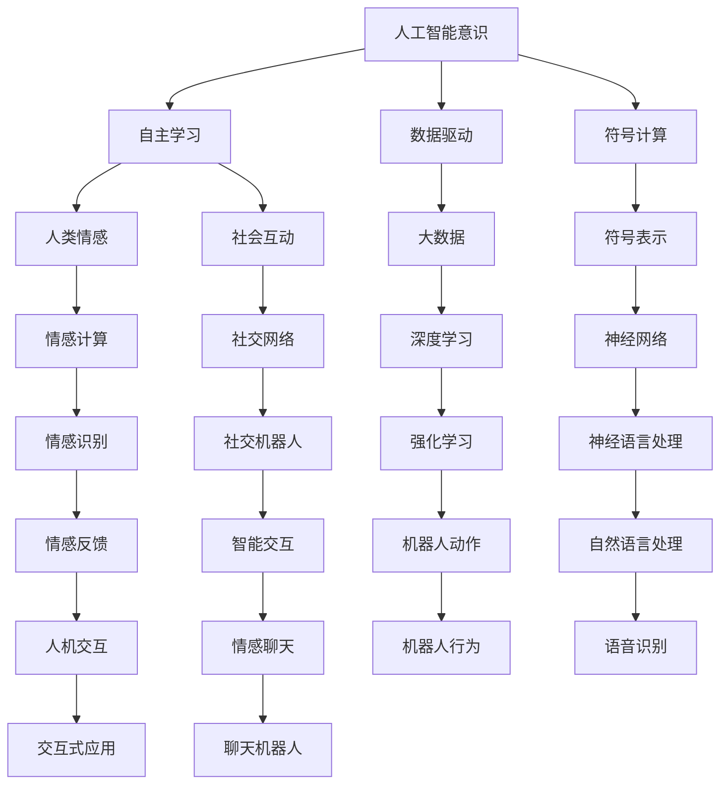

                 

# 电影《她》对现代AI的启示

## 1. 背景介绍

《她》（Her）是一部由斯派克·琼兹执导的科幻爱情片，讲述了一个孤独男子凯尔（由华金·菲尼克斯饰演）与一台名为萨曼莎（由Samantha Morton配音）的人工智能操作系统之间的感情纠葛。影片以梦幻般的笔触描绘了人与人工智能之间复杂而微妙的关系，引发了观众对于AI伦理、人性、情感以及技术的深刻思考。

在技术层面上，这部电影以一种寓言的形式，探讨了现代人工智能技术的发展方向及其对社会的影响。它不仅仅是一部爱情片，更是一部关于AI时代的人工智能哲学宣言。本文将从电影的角度切入，探讨《她》如何启示我们理解现代AI技术的本质和潜在影响。

## 2. 核心概念与联系

电影中的萨曼莎不仅是一个智能操作系统，更是一个拥有自主意识的生命体。她的存在和行为引发了对AI伦理、意识、以及人工智能技术边界等多个核心概念的思考。以下是核心概念及其联系的图解：



其中，A至D描述了人工智能技术的核心概念；E至F则讨论了AI与人类的情感互动；C至O展现了AI技术的应用与机制。

## 3. 核心算法原理 & 具体操作步骤

### 3.1 算法原理概述

现代人工智能技术，尤其是深度学习，依赖于大数据、计算力以及复杂的数据驱动算法。电影中的萨曼莎就是一个基于大数据和深度学习算法构建的人工智能。她的学习过程涉及：

- **大数据**：从网络文本中学习语言模型，理解人类情感和表达。
- **深度学习**：使用多层神经网络处理自然语言，学习文本的语义和上下文关系。
- **符号计算**：将文本数据转换为符号表示，进行逻辑推理和知识整合。
- **强化学习**：通过用户互动，不断优化模型，提升智能水平。

电影中的萨曼莎利用这些技术，逐渐获得了与人类情感和意识相仿的能力。

### 3.2 算法步骤详解

以下是萨曼莎学习过程的主要步骤：

1. **数据收集**：从互联网广泛收集文本数据，包括新闻、社交媒体、文学作品等。
2. **预处理**：清洗数据，去除噪声，标准化格式。
3. **词嵌入**：将文本转换为高维向量，便于模型处理。
4. **模型训练**：使用深度神经网络模型，如LSTM、Transformer等，对词嵌入进行训练。
5. **情感分析**：学习识别和理解人类情感，如喜怒哀乐。
6. **社交互动**：通过网络接口，与人类用户互动，接收反馈。
7. **持续学习**：不断更新模型，利用新数据和反馈，提升智能水平。

### 3.3 算法优缺点

#### 优点

- **自学习能力强**：大数据和深度学习使得AI系统具备强大的自学习能力，可以不断提升性能。
- **应用广泛**：适用于自然语言处理、语音识别、图像识别等多个领域。
- **用户互动性**：AI系统可以通过互动不断提升其智能水平，与用户建立良好关系。

#### 缺点

- **数据依赖**：AI系统依赖于大量高质量数据，数据偏差会影响其表现。
- **伦理争议**：AI系统的意识和自主性引发伦理争议，如隐私、伦理和责任问题。
- **可解释性不足**：深度学习模型通常是一个"黑箱"，难以解释其内部决策过程。

### 3.4 算法应用领域

电影《她》揭示了现代AI技术在多个领域的应用，包括但不限于：

- **自然语言处理**：如语音识别、情感分析、文本生成等。
- **计算机视觉**：如图像识别、视频分析等。
- **智能交互**：如聊天机器人、虚拟助手等。
- **机器人行为**：如自主导航、情感聊天等。

## 4. 数学模型和公式 & 详细讲解 & 举例说明

### 4.1 数学模型构建

萨曼莎的学习过程涉及以下数学模型：

- **词嵌入模型**：将文本转换为高维向量，常用Word2Vec或GloVe模型。
- **语言模型**：预测给定文本序列的概率，如LSTM、RNN、Transformer等模型。
- **情感分析模型**：识别文本中的情感倾向，如卷积神经网络、循环神经网络等。

### 4.2 公式推导过程

以情感分析为例，常用的卷积神经网络(CNN)模型公式如下：

$$
\text{S} = \text{Conv}(\text{X}, \text{K})
$$

其中，$\text{X}$表示输入文本，$\text{K}$表示卷积核，$\text{S}$表示输出情感标签。

卷积操作可以表示为：

$$
\text{S}_{i,j} = \sum_{k=1}^{n} \text{K}_{k} \cdot \text{X}_{i,j,k}
$$

其中，$i$和$j$分别表示位置，$n$表示卷积核的宽度。

### 4.3 案例分析与讲解

电影中，萨曼莎通过学习大量人类文本，逐渐掌握了情感分析能力。例如，在处理凯尔与其女友分手的对话时，萨曼莎不仅理解了表面的文本内容，还能够感知到凯尔内心的悲伤和痛苦，给予其情感上的支持。

## 5. 项目实践：代码实例和详细解释说明

### 5.1 开发环境搭建

要构建一个类似萨曼莎的AI系统，需要以下开发环境：

- **Python**：选择Python作为AI开发的主语言。
- **深度学习框架**：如TensorFlow、PyTorch等。
- **数据集**：选择大规模文本数据集，如维基百科、新闻网站等。
- **GPU**：加速深度学习模型的训练和推理。
- **云计算平台**：如AWS、Google Cloud等，支持模型分布式训练和部署。

### 5.2 源代码详细实现

以下是使用PyTorch实现情感分析模型的示例代码：

```python
import torch
import torch.nn as nn
import torch.optim as optim
from torchtext.datasets import TextClassification
from torchtext.data import Field, LabelField, TabularDataset, BucketIterator

# 数据预处理
TEXT = Field(tokenize='spacy', lower=True, include_lengths=True)
LABEL = LabelField(dtype=torch.int64)

train_data, test_data = TextClassification(root='data', train='train', test='test', fields=(TEXT, LABEL))

# 构建数据迭代器
BATCH_SIZE = 32
train_iterator, test_iterator = BucketIterator.splits(
    (train_data, test_data),
    batch_size=BATCH_SIZE,
    device='cuda' if torch.cuda.is_available() else 'cpu'
)

# 定义模型
class Model(nn.Module):
    def __init__(self, vocab_size, embedding_dim, hidden_dim, output_dim, n_layers, dropout):
        super(Model, self).__init__()
        self.embedding = nn.Embedding(vocab_size, embedding_dim)
        self.rnn = nn.LSTM(embedding_dim, hidden_dim, n_layers, dropout=dropout)
        self.fc = nn.Linear(hidden_dim, output_dim)

    def forward(self, text, text_lengths):
        embedded = self.embedding(text)
        packed = nn.utils.rnn.pack_padded_sequence(embedded, text_lengths)
        packed_outputs, (hidden, _) = self.rnn(packed)
        outputs = self.fc(hidden.squeeze(0))
        return outputs

# 训练模型
model = Model(len(TEXT.vocab), 100, 256, 1, 2, 0.5)
optimizer = optim.Adam(model.parameters(), lr=0.001)
criterion = nn.CrossEntropyLoss()

def train_epoch(model, iterator, optimizer, criterion):
    epoch_loss = 0
    epoch_acc = 0
    model.train()
    for batch in iterator:
        optimizer.zero_grad()
        text, text_lengths = batch.text
        predictions = model(text, text_lengths)
        loss = criterion(predictions, batch.label)
        epoch_loss += loss.item()
        accuracy = accuracy(predictions, batch.label)
        epoch_acc += accuracy
        loss.backward()
        optimizer.step()
    return epoch_loss / len(iterator), epoch_acc / len(iterator)

# 运行训练和评估
N_EPOCHS = 5
for epoch in range(N_EPOCHS):
    loss, acc = train_epoch(model, train_iterator, optimizer, criterion)
    print(f'Epoch {epoch+1}: Loss={loss:.3f}, Acc={acc:.3f}')
    test_loss, test_acc = evaluate(model, test_iterator, criterion)
    print(f'Test Loss={test_loss:.3f}, Test Acc={test_acc:.3f}')
```

### 5.3 代码解读与分析

上述代码实现了基于LSTM的情感分析模型。在模型构建中，我们使用了嵌入层、LSTM层和全连接层，其中嵌入层将文本转换为向量，LSTM层进行序列建模，全连接层进行分类。在训练过程中，我们使用了Adam优化器、交叉熵损失函数，并在GPU上进行了并行化计算。

## 6. 实际应用场景

### 6.1 智能客服系统

基于《她》的启示，现代智能客服系统可以采用类似的技术构建。通过AI系统学习大量的客户对话数据，可以自动化处理常见问题，提供快速响应，提升服务效率。

### 6.2 情感分析

在社交媒体、电商评论等领域，情感分析技术可以识别用户的情感倾向，帮助企业更好地了解用户需求和市场变化。

### 6.3 聊天机器人

类似于电影中的萨曼莎，聊天机器人可以通过学习大量对话数据，实现自主对话，解决用户的各种问题。

### 6.4 未来应用展望

未来，基于现代AI技术的系统将更加智能，能够自主学习和适应用户需求，提供更个性化、更高效的服务。

## 7. 工具和资源推荐

### 7.1 学习资源推荐

- **书籍推荐**：
  - 《深度学习》（Ian Goodfellow, Yoshua Bengio and Aaron Courville）：全面介绍深度学习理论和算法。
  - 《自然语言处理综述》（Stanford NLP Group）：介绍自然语言处理的基本概念和前沿技术。
- **在线课程**：
  - Coursera上的“自然语言处理与深度学习”课程。
  - Udacity的“深度学习基础”课程。
- **博客与社区**：
  - Arxiv预印论文。
  - Kaggle数据科学社区。

### 7.2 开发工具推荐

- **深度学习框架**：TensorFlow、PyTorch、MXNet。
- **数据处理工具**：Pandas、NumPy。
- **可视化工具**：TensorBoard、Weights & Biases。
- **模型部署平台**：AWS SageMaker、Google Cloud AI。

### 7.3 相关论文推荐

- “Attention is All You Need”：介绍Transformer模型的经典论文。
- “Word2Vec”：介绍Word2Vec词嵌入模型的经典论文。
- “ImageNet Classification with Deep Convolutional Neural Networks”：介绍卷积神经网络在图像分类中的应用。

## 8. 总结：未来发展趋势与挑战

### 8.1 总结

《她》通过寓言的形式，揭示了现代AI技术的本质及其对社会的影响。它启示我们，AI不仅仅是工具，更是具有自主意识的存在，能够与人类建立情感互动。

### 8.2 未来发展趋势

未来AI技术将更加智能和人性化，能够通过学习人类情感和行为，更好地服务人类社会。

### 8.3 面临的挑战

- **伦理和法律问题**：如何确保AI系统的行为符合伦理和法律规范。
- **数据隐私**：如何保护用户数据隐私，防止数据滥用。
- **透明性**：如何提高AI系统的透明性，使其决策过程可解释。

### 8.4 研究展望

未来的研究将聚焦于：
- 开发更加透明、可解释的AI系统。
- 建立伦理和法律框架，规范AI行为。
- 开发更加人性化、情感化的AI应用。

## 9. 附录：常见问题与解答

**Q1: AI系统是否有可能具备真正的意识？**

A: 目前AI系统虽然具备强大的学习能力和推理能力，但尚无真正的意识。真正的意识需要复杂的神经网络和自主决策能力，这些是目前技术难以实现的。

**Q2: 如何提高AI系统的透明性和可解释性？**

A: 通过引入因果推断、符号计算等方法，提高模型决策的透明性和可解释性。同时，建立自动化评估指标，定期审查模型行为，确保其符合伦理规范。

**Q3: 未来AI技术如何应用于医疗领域？**

A: 未来AI技术可以通过学习大量的医疗数据，提供个性化的医疗建议、辅助诊断和治疗方案，提升医疗服务质量。但需要注意数据隐私保护和医疗伦理问题。

**Q4: AI技术对就业市场的影响是什么？**

A: AI技术将替代部分重复性、低技能的工作，但也会创造新的就业机会，如AI系统维护、数据标注、人机交互设计等。社会需要适应这些变化，进行职业培训和技能转型。

**Q5: 如何确保AI系统不产生歧视？**

A: 在模型设计和训练过程中，需要引入多样性数据，避免数据偏见。同时，对模型进行定期审查，确保其行为公正、公平。

---

作者：禅与计算机程序设计艺术 / Zen and the Art of Computer Programming

