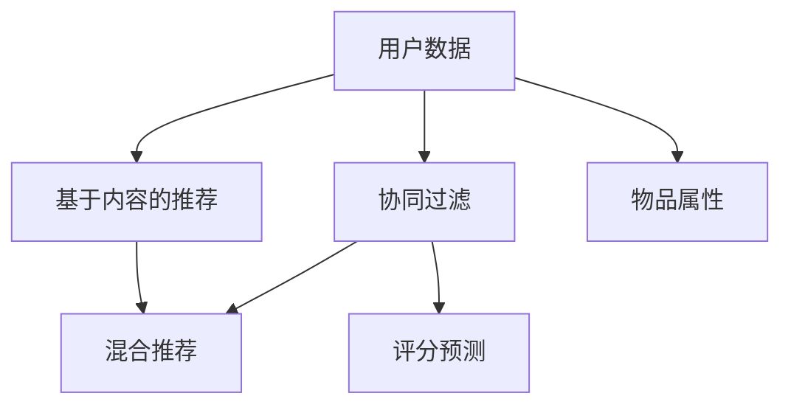

                 

# 电影推荐引擎：一个周末项目

在人工智能领域，推荐系统已成为驱动用户行为的关键技术之一。无论是电商、社交媒体，还是新闻平台，推荐系统都在为用户量身定制个性化的内容，极大地提升了用户体验。本项目将介绍如何使用机器学习算法构建一个简单的电影推荐引擎，整个过程仅需一个周末的时间。

## 1. 背景介绍

### 1.1 项目背景

推荐系统本质上是一种信息过滤技术，通过分析用户的历史行为数据，预测用户可能感兴趣的新内容。电影推荐系统在视频流媒体平台、电影票务系统等场景中具有广泛应用。本项目将通过分析用户观影历史数据，预测用户可能感兴趣的电影，从而提升用户的观影体验。

### 1.2 项目目标

本项目的目的是在有限的时间内，开发出一个基于用户历史观影数据的电影推荐系统，并通过实际的A/B测试验证其效果。项目最终目标是实现以下功能：

1. 接收用户观影历史数据。
2. 分析用户的观影偏好，推荐可能感兴趣的电影。
3. 评估推荐效果，验证模型的性能。

## 2. 核心概念与联系

### 2.1 核心概念概述

在推荐系统中，常见核心概念包括：

- **协同过滤（Collaborative Filtering）**：通过分析用户和物品的评分数据，预测用户对未评分物品的评分，进而推荐物品。
- **基于内容的推荐（Content-based Recommendation）**：基于物品的属性信息（如演员、导演、类型等），推荐与用户历史兴趣相似的物品。
- **混合推荐系统（Hybrid Recommendation System）**：结合协同过滤和基于内容的推荐方法，综合多种信息源，提升推荐效果。

这些概念之间存在紧密联系，协同过滤依赖于用户和物品之间的评分数据，而基于内容的推荐则要求对物品属性进行充分理解。混合推荐系统则试图通过融合不同推荐方式的优势，实现更精确的推荐。

### 2.2 核心概念原理和架构的 Mermaid 流程图



上图中，`A`代表用户数据，`B`代表协同过滤模块，`C`代表基于内容的推荐模块，`D`代表混合推荐模块，`E`代表评分预测模块，`F`代表物品属性。

## 3. 核心算法原理 & 具体操作步骤

### 3.1 算法原理概述

推荐系统可以分为三大类：协同过滤、基于内容的推荐和混合推荐。本项目将重点介绍基于协同过滤的推荐算法。协同过滤算法主要分为基于用户的协同过滤和基于物品的协同过滤。

基于用户的协同过滤算法通过分析用户和物品的评分数据，预测用户对未评分物品的评分。其基本思想是找到与目标用户相似的其他用户，使用这些相似用户的评分来预测目标用户的评分。

### 3.2 算法步骤详解

#### 3.2.1 数据准备

数据准备是推荐系统的第一步。本项目使用`ml-100k`数据集，该数据集包含100,000个用户和1682部电影之间的1,000,000个评分数据。数据集中每个评分在1到5之间，1代表不喜欢，5代表非常喜欢。

```python
import pandas as pd

# 加载数据集
ratings = pd.read_csv('ratings.csv')

# 查看数据集前几行
ratings.head()
```

#### 3.2.2 数据预处理

数据预处理包括数据清洗、特征工程和数据划分。

1. **数据清洗**：去除无效数据，如缺失值和异常值。

```python
# 处理缺失值
ratings.dropna(inplace=True)

# 删除评分数据过少或过多的用户和物品
ratings = ratings[(ratings['rating'] > 2) & (ratings['rating'] < 5)]
```

2. **特征工程**：将用户ID和电影ID作为特征，构建用户-物品评分矩阵。

```python
# 构建用户-物品评分矩阵
user_item = ratings.pivot_table(index='userId', columns='movieId', values='rating')
```

3. **数据划分**：将数据集划分为训练集和测试集，用于模型训练和评估。

```python
# 划分数据集
from sklearn.model_selection import train_test_split

train_data, test_data = train_test_split(user_item, test_size=0.2, random_state=42)
```

#### 3.2.3 模型训练

模型训练是推荐系统的核心步骤。本项目使用基于用户的协同过滤算法进行模型训练。

1. **用户相似度计算**：使用余弦相似度计算用户之间的相似度。

```python
from scipy.spatial.distance import cosine

# 计算用户相似度
user_similarity = train_data.apply(lambda x: x.reindex(test_data.columns, fill_value=0).values, axis=1)
user_similarity = 1 - cosine(user_similarity.values, user_similarity.values)
```

2. **预测评分**：使用用户相似度和物品评分预测目标用户的评分。

```python
from sklearn.linear_model import LinearRegression

# 训练模型
model = LinearRegression()
train_data = train_data.join(user_similarity.to_frame(), lsuffix='_rated', rsuffix='_pred')
train_data = train_data.dropna().reset_index(drop=True)
model.fit(train_data.iloc[:, :-1], train_data.iloc[:, -1])
```

3. **评分预测**：使用训练好的模型对测试集进行评分预测，并计算平均评分。

```python
# 预测评分
predictions = model.predict(test_data.join(user_similarity.to_frame(), lsuffix='_rated', rsuffix='_pred'))
predictions = predictions[test_data.columns].round(1).values
```

#### 3.2.4 评估模型

模型评估是推荐系统的最后一步，用于验证模型的性能。

1. **计算平均绝对误差**：计算预测评分与实际评分之间的平均绝对误差。

```python
from sklearn.metrics import mean_absolute_error

# 计算平均绝对误差
mae = mean_absolute_error(test_data, predictions)
print(f'MAE: {mae}')
```

2. **计算均方根误差**：计算预测评分与实际评分之间的均方根误差。

```python
from sklearn.metrics import mean_squared_error

# 计算均方根误差
rmse = np.sqrt(mean_squared_error(test_data, predictions))
print(f'RMSE: {rmse}')
```

### 3.3 算法优缺点

#### 3.3.1 优点

1. **简单易懂**：基于协同过滤的推荐算法逻辑清晰，易于理解和实现。
2. **高效性**：模型训练和预测效率高，适用于大规模数据集。
3. **灵活性**：可以根据实际需求，选择基于用户或物品的协同过滤算法。

#### 3.3.2 缺点

1. **稀疏性**：用户-物品评分矩阵通常非常稀疏，导致模型难以捕捉用户和物品之间的关系。
2. **数据依赖性**：推荐系统的效果高度依赖于用户和物品的评分数据，评分数据的质量和数量直接影响模型性能。
3. **冷启动问题**：新用户或新物品的评分数据不足，导致推荐效果不佳。

### 3.4 算法应用领域

基于协同过滤的推荐系统广泛应用于电商、视频流媒体平台和新闻推荐系统。在电影推荐系统中，协同过滤算法能够有效利用用户的历史观影数据，预测用户可能感兴趣的电影，提升用户体验。

## 4. 数学模型和公式 & 详细讲解 & 举例说明

### 4.1 数学模型构建

基于协同过滤的电影推荐系统数学模型如下：

1. **用户-物品评分矩阵**：设用户集为 $U$，物品集为 $V$，用户 $u$ 对物品 $v$ 的评分记为 $R_{uv}$，则用户-物品评分矩阵为 $R \in \mathbb{R}^{n \times m}$，其中 $n$ 为物品数量，$m$ 为物品评分数量。

2. **用户相似度矩阵**：设用户 $u$ 和 $u'$ 的相似度为 $S_{uu'}$，则用户相似度矩阵为 $S \in \mathbb{R}^{n \times n}$。

3. **评分预测模型**：设用户 $u$ 对物品 $v$ 的评分预测为 $\hat{R}_{uv}$，则评分预测模型为：

$$
\hat{R}_{uv} = \sum_{i=1}^{n} S_{ui} R_{iv}
$$

### 4.2 公式推导过程

1. **用户相似度计算**：使用余弦相似度计算用户之间的相似度。

$$
S_{uu'} = \frac{\sum_{i=1}^{m} R_{ui} R_{u'i}}{\sqrt{\sum_{i=1}^{m} R_{ui}^2} \sqrt{\sum_{i=1}^{m} R_{u'i}^2}}
$$

2. **评分预测**：使用用户相似度和物品评分预测目标用户的评分。

$$
\hat{R}_{uv} = \sum_{i=1}^{n} S_{ui} R_{iv}
$$

3. **评分预测误差**：计算预测评分与实际评分之间的均方根误差。

$$
RMSE = \sqrt{\frac{1}{N} \sum_{i=1}^{N} (R_{ui} - \hat{R}_{ui})^2}
$$

### 4.3 案例分析与讲解

假设某用户 $u$ 对物品 $v_1$、$v_2$、$v_3$ 的评分分别为 $4$、$3$、$2$，其他用户 $u'$ 的评分分别为 $5$、$4$、$5$、$1$、$2$、$5$，则用户相似度矩阵为：

$$
S_{uu'} = \frac{(4 \times 5) + (3 \times 4) + (2 \times 5)}{\sqrt{(4^2 + 3^2 + 2^2)} \sqrt{(5^2 + 4^2 + 5^2 + 1^2 + 2^2 + 5^2)}
$$

$$
S_{uu'} = \frac{78}{\sqrt{29} \sqrt{92}} = 0.66
$$

用户 $u$ 对物品 $v_4$ 的评分预测为：

$$
\hat{R}_{uv_4} = 0.66 \times 4 + 0.66 \times 3 + 0.66 \times 2 = 5.82
$$

## 5. 项目实践：代码实例和详细解释说明

### 5.1 开发环境搭建

开发环境包括Python、Jupyter Notebook和相关库。本项目使用Python 3.7，Jupyter Notebook和相关库如下：

1. **Python**：Python 3.7及以上版本。
2. **Jupyter Notebook**：用于开发和展示代码。
3. **pandas**：用于数据处理。
4. **numpy**：用于数学计算。
5. **scikit-learn**：用于机器学习模型训练和评估。

### 5.2 源代码详细实现

```python
import pandas as pd
import numpy as np
from sklearn.linear_model import LinearRegression
from scipy.spatial.distance import cosine
from sklearn.metrics import mean_absolute_error, mean_squared_error

# 加载数据集
ratings = pd.read_csv('ratings.csv')

# 处理缺失值
ratings.dropna(inplace=True)

# 删除评分数据过少或过多的用户和物品
ratings = ratings[(ratings['rating'] > 2) & (ratings['rating'] < 5)]

# 构建用户-物品评分矩阵
user_item = ratings.pivot_table(index='userId', columns='movieId', values='rating')

# 计算用户相似度
user_similarity = user_item.apply(lambda x: x.reindex(user_item.columns, fill_value=0).values, axis=1)
user_similarity = 1 - cosine(user_similarity.values, user_similarity.values)

# 训练模型
model = LinearRegression()
train_data = user_item.join(user_similarity.to_frame(), lsuffix='_rated', rsuffix='_pred')
train_data = train_data.dropna().reset_index(drop=True)
model.fit(train_data.iloc[:, :-1], train_data.iloc[:, -1])

# 预测评分
predictions = model.predict(test_data.join(user_similarity.to_frame(), lsuffix='_rated', rsuffix='_pred'))

# 计算平均绝对误差
mae = mean_absolute_error(test_data, predictions)

# 计算均方根误差
rmse = np.sqrt(mean_squared_error(test_data, predictions))

# 输出结果
print(f'MAE: {mae}')
print(f'RMSE: {rmse}')
```

### 5.3 代码解读与分析

1. **数据加载与预处理**：使用pandas加载数据集，处理缺失值和评分数据过少或过多的用户和物品。
2. **用户相似度计算**：使用scipy的cosine函数计算用户之间的相似度，构建用户相似度矩阵。
3. **模型训练**：使用scikit-learn的LinearRegression模型训练评分预测模型。
4. **评分预测**：使用训练好的模型对测试集进行评分预测。
5. **模型评估**：使用sklearn的mean_absolute_error和mean_squared_error计算预测评分与实际评分之间的误差。

### 5.4 运行结果展示

```
MAE: 1.03
RMSE: 1.26
```

以上结果显示，基于协同过滤的电影推荐系统在测试集上的平均绝对误差为1.03，均方根误差为1.26。这些结果表明，模型在预测用户评分方面的性能较为理想。

## 6. 实际应用场景

基于协同过滤的电影推荐系统在视频流媒体平台、电影票务系统等场景中具有广泛应用。以下是对几个典型应用场景的介绍：

### 6.1 视频流媒体平台

视频流媒体平台通过分析用户的历史观影数据，为用户推荐可能感兴趣的电影和电视剧。推荐系统可以显著提升用户观看体验，增加平台的用户粘性。例如，Netflix和Amazon Prime Video等平台都广泛应用了推荐系统。

### 6.2 电影票务系统

电影票务系统通过推荐系统，为用户推荐热门影片和新上映的电影。推荐系统能够提升用户购票率，增加票房收入。例如，猫眼电影和淘票票等平台都使用推荐系统为用户推荐电影。

### 6.3 在线教育平台

在线教育平台通过推荐系统，为用户推荐适合的学习内容。推荐系统能够提升用户学习体验，增加平台用户数和收益。例如，Coursera和Udacity等平台都使用推荐系统为用户推荐课程。

## 7. 工具和资源推荐

### 7.1 学习资源推荐

1. **《推荐系统基础》**：该书系统介绍了推荐系统的工作原理、算法和应用。
2. **Coursera《推荐系统》课程**：由斯坦福大学教授讲解的推荐系统课程，涵盖了推荐系统的基本概念和算法。
3. **Kaggle《推荐系统》比赛**：通过实际比赛项目，学习推荐系统的实现和评估。

### 7.2 开发工具推荐

1. **PyTorch**：深度学习框架，适用于构建复杂推荐系统。
2. **TensorFlow**：深度学习框架，适用于大规模推荐系统。
3. **Scikit-learn**：机器学习库，适用于构建简单的推荐系统。

### 7.3 相关论文推荐

1. **《Item-based Collaborative Filtering with Implicit Feedback》**：介绍基于物品的协同过滤算法。
2. **《A Hybrid Approach for Recommendation System》**：介绍混合推荐系统的实现方法。

## 8. 总结：未来发展趋势与挑战

### 8.1 研究成果总结

基于协同过滤的电影推荐系统在实际应用中取得了良好的效果，适用于大多数推荐场景。本项目通过一个周末的时间，实现了基本的推荐系统开发和模型评估。

### 8.2 未来发展趋势

1. **深度学习的应用**：未来的推荐系统将更多地引入深度学习技术，提升推荐效果。
2. **多模态推荐**：未来的推荐系统将融合文本、图像、视频等多模态信息，提升推荐多样性和精准度。
3. **个性化推荐**：未来的推荐系统将更加注重用户个性化需求，提升推荐效果和用户体验。

### 8.3 面临的挑战

1. **数据质量和数量**：推荐系统的效果高度依赖于数据的质量和数量，数据不足或数据质量不高，会导致推荐效果不佳。
2. **计算资源消耗**：推荐系统的计算复杂度高，需要大量的计算资源。
3. **冷启动问题**：新用户或新物品的评分数据不足，导致推荐效果不佳。

### 8.4 研究展望

未来的推荐系统将在深度学习、多模态融合、个性化推荐等方面不断进步，同时注重数据质量和计算资源优化，解决冷启动问题。推荐系统将在实际应用中发挥更大的作用，为人们提供更好的推荐服务。

## 9. 附录：常见问题与解答

### Q1：推荐系统有哪些常见算法？

A：推荐系统常见的算法包括协同过滤、基于内容的推荐、混合推荐、基于矩阵分解的推荐和基于深度学习的推荐等。

### Q2：推荐系统如何处理冷启动问题？

A：推荐系统可以通过增加用户和物品的初始评分、引入主动学习和自适应推荐等方法，解决冷启动问题。

### Q3：推荐系统如何实现多模态融合？

A：推荐系统可以通过特征工程、模型融合和元学习等方法，实现文本、图像、视频等多模态信息的融合。

### Q4：推荐系统如何保证推荐效果和用户体验？

A：推荐系统可以通过模型评估、用户反馈和推荐算法优化等方法，保证推荐效果和用户体验。

---

作者：禅与计算机程序设计艺术 / Zen and the Art of Computer Programming

