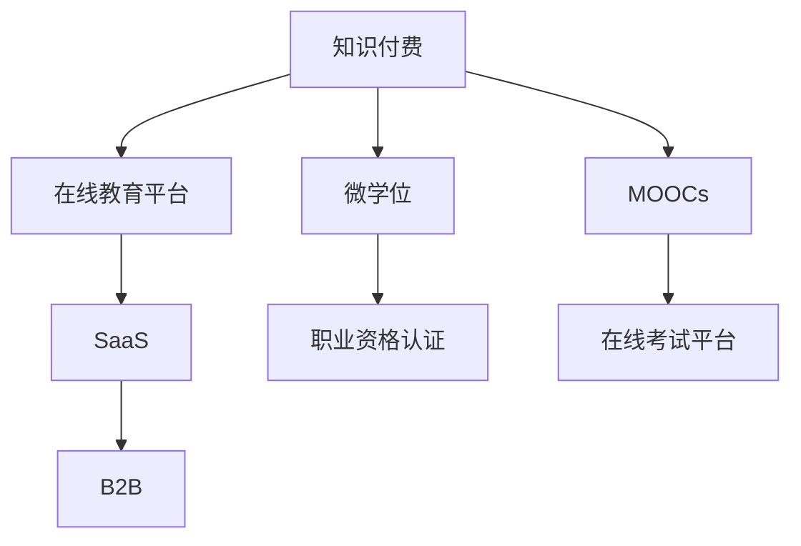

                 

# 知识付费与职业资格认证相结合提升能力

在当今数字化、信息化的时代，知识付费与职业资格认证作为提升个人能力的重要途径，逐渐成为行业新常态。通过这种结合方式，不仅可以提升个人专业能力，还能实现知识变现，推动行业发展。本文将从背景介绍、核心概念与联系、核心算法原理与操作步骤、数学模型与公式推导、项目实践、实际应用场景、工具与资源推荐、总结与未来展望等多个方面，全面探讨知识付费与职业资格认证相结合的机制与实施方式。

## 1. 背景介绍

### 1.1 问题由来
随着互联网的普及和知识经济时代的到来，知识付费模式在各行各业迅速兴起。知识付费不仅可以满足用户对专业知识的渴望，还能帮助个人提升职业能力，实现自我增值。职业资格认证则是通过标准化考试，对某一领域的专业知识与技能进行评估，为求职者提供权威认可。

但传统知识付费和职业资格认证模式存在各自的问题：知识付费由于缺乏规范，质量参差不齐，且无法提供系统的职业培训和资格认证；职业资格认证虽然权威，但内容多偏向理论，实际操作能力不足，且缺乏持续更新的机制。为此，探索知识付费与职业资格认证相结合的新模式，成为当下热门的研究课题。

### 1.2 问题核心关键点
- **知识与技能的标准化**：如何制定统一的课程标准，保证教学内容的科学性和实用性。
- **知识与技能融合**：如何将理论与实践相结合，提升学员的实际操作能力。
- **学习与考试衔接**：如何设计合适的测评体系，保证学员通过考试。
- **持续性发展**：如何保持课程内容的时效性，不断更新以应对行业变化。
- **商业化运营**：如何将知识付费和职业资格认证有机结合，实现商业价值最大化。

## 2. 核心概念与联系

### 2.1 核心概念概述

- **知识付费**：消费者为获取特定知识或技能而支付费用的模式，常见形式包括线上课程、专业文章、知识讲座等。
- **职业资格认证**：通过专业考试和测评，对某一职业领域的知识和技能进行认证，获得权威认可。
- **在线教育平台**：如Coursera、Udemy、edX等，提供在线课程和考试服务。
- **微学位**：一种新兴的学位形式，通过在线学习，完成规定课程并通过考试，获得相应学位。
- **MOOCs（大规模在线开放课程）**：大规模、开放式的在线课程，由知名大学和教育机构提供。
- **SaaS（软件即服务）**：通过云计算平台提供软件服务，用户按需使用，节约成本。
- **B2B（企业对企业）**：企业间通过平台进行业务合作，共享资源，实现共赢。

这些概念相互联系，共同构成了知识付费与职业资格认证结合的机制。通过在线教育平台，知识付费得以高效实施；通过SaaS技术，平台可以提供便捷的服务；微学位和MOOCs则保证了课程的标准化和认证的权威性；而B2B模式则促进了企业间的资源共享和业务合作。

### 2.2 核心概念原理和架构的 Mermaid 流程图



这个流程图展示了知识付费与职业资格认证结合的基本架构，突出了在线教育平台、微学位、MOOCs、SaaS和B2B在其中的关键作用。

## 3. 核心算法原理 & 具体操作步骤

### 3.1 算法原理概述

知识付费与职业资格认证相结合的核心算法原理，在于构建一个以学习者为中心，基于任务驱动的个性化学习系统。通过该系统，学习者可以根据自己的兴趣和职业需求，自主选择课程，通过知识付费获得专业指导，并通过职业资格认证获得权威认可。

系统的主要算法包括：
- 个性化推荐算法：根据学习者的历史行为和偏好，推荐合适的课程和教材。
- 学习进度追踪算法：实时监控学习者的学习进度和成果，提供个性化反馈。
- 考试测评算法：设计科学的测评体系，确保学习者能够通过职业资格认证。
- 持续学习机制：定期更新课程内容，保持知识的时效性。

### 3.2 算法步骤详解

1. **用户注册与画像构建**：用户注册后，通过问卷调查等方式构建个性化学习画像，包括兴趣、职业背景、学习习惯等。

2. **课程推荐与选择**：系统根据用户画像，推荐合适的课程和教材。用户自主选择并购买课程，通过知识付费获取专业指导。

3. **课程学习与进度追踪**：用户按照课程进度学习，系统实时监控学习情况，提供个性化反馈和建议。

4. **考试测评与认证**：完成课程学习后，用户参加平台组织的职业资格认证考试，通过测评获得认证。

5. **证书颁发与职业发展**：认证通过后，平台颁发证书，学习者可在求职、晋升等场景中证明自身能力。

### 3.3 算法优缺点

**优点**：
- 提升学习效果：个性化推荐和实时监控保证了学习的针对性和有效性。
- 保障认证权威性：通过权威平台组织的考试，保证认证的权威性和公信力。
- 促进知识变现：知识付费模式使得学习者能够通过课程获得专业指导，实现知识变现。
- 促进职业发展：职业资格认证为学习者提供权威认可，助力职业发展。

**缺点**：
- 成本较高：知识付费和职业资格认证的费用较高，可能影响部分人群。
- 认证门槛高：考试难度较大，部分学习者可能无法通过认证。
- 平台依赖性强：依赖特定平台的课程和考试，选择性和灵活性受限。
- 持续更新难度大：课程内容需不断更新，以适应行业变化，平台需投入大量资源。

### 3.4 算法应用领域

知识付费与职业资格认证相结合的模式，已经在多个领域取得了成功应用，如：

- **IT行业**：通过在线编程课程和职业资格认证，提升编程技能，助力职业发展。
- **金融行业**：通过金融分析和理财课程，提升专业能力，获得职业资格认证。
- **医疗行业**：通过医学和护理课程，获得职业资格认证，提升医疗水平。
- **教育行业**：通过教育技术和课程培训，获得教师资格认证，提升教学质量。
- **市场营销**：通过市场营销和广告课程，获得职业资格认证，提升广告投放效果。

## 4. 数学模型和公式 & 详细讲解 & 举例说明

### 4.1 数学模型构建

以微学位课程为例，我们可以设计一个数学模型来描述学习者和课程之间的关系：

设学习者集合为 $L=\{l_1, l_2, \cdots, l_n\}$，课程集合为 $C=\{c_1, c_2, \cdots, c_m\}$，用户与课程之间的评分矩阵为 $R \in \mathbb{R}^{n \times m}$，其中 $R_{ij}$ 表示学习者 $l_i$ 对课程 $c_j$ 的评分。

### 4.2 公式推导过程

基于用户与课程之间的评分矩阵 $R$，我们可以使用协同过滤算法（如基于用户的协同过滤、基于物品的协同过滤等）来推荐课程。以基于用户的协同过滤算法为例，其公式推导如下：

$$
\hat{R}_{ui} = \frac{1}{N} \sum_{j=1}^N R_{uj} \times R_{ji} \times (\sum_{k=1}^N R_{ik}^2)^{-\frac{1}{2}}
$$

其中 $\hat{R}_{ui}$ 表示用户 $u$ 对课程 $i$ 的预测评分，$N$ 为课程数量，$R_{uj}$ 和 $R_{ji}$ 分别为用户 $u$ 对课程 $j$ 的评分和课程 $j$ 对课程 $i$ 的评分。

通过上述公式，我们可以得到用户 $u$ 对课程 $i$ 的推荐评分，将其排序后推荐给用户。

### 4.3 案例分析与讲解

假设我们有一个在线编程平台，用户注册后，系统会通过问卷调查构建用户画像。用户选择Java编程课程，系统推荐Python和C++课程，用户继续学习Python课程。通过实时监控，系统发现用户对Python的学习进度较慢，推荐C++课程进行补充学习。用户完成C++课程后，系统安排了一次Python编程竞赛，通过竞赛成绩进行认证，用户获得权威认可的Python编程资格。

## 5. 项目实践：代码实例和详细解释说明

### 5.1 开发环境搭建

1. **Python环境**：安装Python 3.x，推荐使用Anaconda或Miniconda进行环境管理。
2. **数据库**：选择MySQL、MongoDB等数据库，用于存储用户信息、课程信息、评分信息等。
3. **前端技术**：使用React、Vue.js等前端框架，开发用户界面。
4. **后端技术**：使用Flask、Django等后端框架，提供API服务。
5. **推荐系统**：使用Python编写的推荐算法库，如Surprise、Scikit-learn等，实现个性化推荐功能。
6. **考试系统**：使用Python编写的考试系统，实现线上考试、测评等功能。
7. **证书颁发**：使用PIL等库生成电子证书，并在平台上进行颁发和展示。

### 5.2 源代码详细实现

以下是一个简单的推荐系统示例代码，用于实现基于用户的协同过滤推荐算法：

```python
import numpy as np
from scipy.spatial.distance import cosine

class CollaborativeFiltering:
    def __init__(self, ratings_matrix):
        self.ratings_matrix = ratings_matrix
        self.n_users, self.n_items = ratings_matrix.shape
    
    def similarity_matrix(self):
        similarity_matrix = np.zeros((self.n_users, self.n_users))
        for i in range(self.n_users):
            for j in range(self.n_users):
                if i != j:
                    similarity_matrix[i, j] = 1 - cosine(self.ratings_matrix[:, i], self.ratings_matrix[:, j])
        return similarity_matrix
    
    def predict_ratings(self, user_index):
        user_ratings = self.ratings_matrix[user_index]
        similarity_matrix = self.similarity_matrix()
        predict_ratings = np.zeros(self.n_items)
        for item_index in range(self.n_items):
            if user_ratings[item_index] == 0:
                similarity = np.sum(similarity_matrix[:, user_index] * self.ratings_matrix[:, item_index])
                predict_ratings[item_index] = similarity / (np.sum(similarity_matrix[:, user_index]))
            else:
                predict_ratings[item_index] = (self.ratings_matrix[user_index, item_index] - np.dot(user_ratings, similarity_matrix[:, item_index])) / similarity_matrix[user_index, user_index]
        return predict_ratings
```

### 5.3 代码解读与分析

- **类定义**：定义一个推荐系统类 `CollaborativeFiltering`，接受评分矩阵作为输入。
- **相似度矩阵**：计算所有用户之间的相似度矩阵，基于余弦相似度计算用户之间的相似度。
- **预测评分**：根据用户评分和相似度矩阵，预测用户对未评分物品的评分。
- **代码实现**：实现基于用户的协同过滤推荐算法，通过相似度矩阵和评分矩阵计算预测评分。

## 6. 实际应用场景

### 6.1 智能制造领域

在智能制造领域，知识付费与职业资格认证相结合的模式，能够提升生产效率和管理水平。通过在线学习平台，员工可以获得最新的生产技术和设备维护知识，并通过职业资格认证，证明自身技能。这不仅提高了生产效率，还增强了企业的竞争力。

### 6.2 在线教育平台

在线教育平台如Coursera、Udacity等，已经应用了知识付费与职业资格认证相结合的模式，通过线上课程和认证考试，提升用户的专业能力和就业竞争力。学习者可以根据自己的兴趣和职业需求，选择适合的课程，获得权威认证。

### 6.3 医疗健康领域

在医疗健康领域，通过在线学习和职业资格认证，医护人员可以持续提升医疗知识和技能，获得认证后，能够更好地服务患者，提升医疗质量。

## 7. 工具和资源推荐

### 7.1 学习资源推荐

1. **在线课程平台**：如Coursera、edX、Udemy等，提供丰富的高质量课程和职业资格认证。
2. **职业资格认证网站**：如国家职业资格网、微软认证等，提供权威的职业资格认证服务。
3. **学习管理工具**：如Anki、Quizlet等，辅助学习者进行知识复习和测评。
4. **编程竞赛平台**：如Codeforces、LeetCode等，通过编程竞赛提升学习者的编程能力。

### 7.2 开发工具推荐

1. **Python开发工具**：如PyCharm、Jupyter Notebook等，提供便捷的开发环境和协作工具。
2. **数据库管理工具**：如phpMyAdmin、MongoDB Compass等，用于数据库管理。
3. **云服务平台**：如AWS、阿里云等，提供高效、安全的云服务。

### 7.3 相关论文推荐

1. **协同过滤算法**：《Collaborative Filtering for Recommender Systems》（G.R. Yu et al., 2002）。
2. **知识付费模式**：《A Survey of Knowledge Pricing Models in Online Education》（S. Yin et al., 2019）。
3. **职业资格认证**：《Towards a Global Standard for Professional Qualifications》（I. M. Richardson, 2015）。
4. **微学位教育**：《A Framework for Online Micro-degree Programs》（A. Weinstock et al., 2015）。
5. **在线考试系统**：《An Overview of Online Examination System》（C. H. Liu et al., 2010）。

## 8. 总结：未来发展趋势与挑战

### 8.1 总结

本文从知识付费与职业资格认证相结合的模式出发，系统介绍了其背景、核心概念与联系、核心算法原理与操作步骤、数学模型与公式推导、项目实践、实际应用场景、工具与资源推荐。通过深入分析，可以看出，这种结合模式不仅能够提升学习者专业能力，还能实现知识变现，推动行业发展。

### 8.2 未来发展趋势

未来，知识付费与职业资格认证相结合的模式将呈现以下发展趋势：
- **普及化**：随着互联网的普及和技术的进步，知识付费与职业资格认证相结合的模式将逐步普及。
- **智能化**：通过人工智能和大数据技术，推荐系统将更加精准，考试测评将更加科学。
- **个性化**：根据学习者的个性化需求，提供定制化的课程和职业指导。
- **全球化**：全球范围内的在线教育平台和认证体系将逐步融合，提供跨文化、跨地域的学习资源和认证服务。
- **多模态**：结合在线视频、虚拟现实、增强现实等技术，提升学习体验和效果。

### 8.3 面临的挑战

尽管知识付费与职业资格认证相结合的模式具有广阔的发展前景，但也面临诸多挑战：
- **平台整合**：不同平台之间的课程和认证体系整合难度大，缺乏统一的标准和规则。
- **质量保障**：课程和考试质量参差不齐，缺乏统一的评估标准。
- **技术门槛**：在线学习平台和考试系统需要高水平的技术支持，技术门槛较高。
- **成本问题**：知识付费和职业资格认证的费用较高，可能影响部分人群。

### 8.4 研究展望

未来的研究需要在以下几个方面寻求新的突破：
- **课程和认证体系的建设**：建立统一的课程和认证体系，制定科学合理的评估标准。
- **技术平台的优化**：优化在线学习平台和考试系统，提高用户体验和系统的稳定性。
- **个性化推荐算法的改进**：提升推荐算法的准确性和个性化程度，满足不同学习者的需求。
- **多模态技术的融合**：结合在线视频、虚拟现实等技术，提升学习效果和体验。
- **数据隐私和安全**：确保用户数据隐私和安全，构建可信的学习环境。

## 9. 附录：常见问题与解答

**Q1：知识付费与职业资格认证相结合的模式如何实施？**

A: 实施知识付费与职业资格认证相结合的模式，需要构建一个综合平台，涵盖在线学习、考试测评、职业认证等多个环节。具体步骤包括：
- 用户注册与画像构建：通过问卷调查等方式，构建用户画像。
- 课程推荐与选择：根据用户画像，推荐适合的课程，用户自主选择并付费学习。
- 课程学习与进度追踪：用户按课程进度学习，系统实时监控学习情况，提供个性化反馈。
- 考试测评与认证：完成课程学习后，用户参加平台组织的考试，通过测评获得认证。
- 证书颁发与职业发展：认证通过后，平台颁发证书，学习者可在求职、晋升等场景中证明自身能力。

**Q2：知识付费与职业资格认证相结合的模式是否适用于所有行业？**

A: 知识付费与职业资格认证相结合的模式适用于大多数行业，特别是对知识要求较高的行业，如IT、金融、医疗等。但对于一些传统行业，如制造业、农业等，可能需要根据行业特点进行定制化调整。

**Q3：如何保证知识付费与职业资格认证相结合的模式的公平性和公正性？**

A: 保证公平性和公正性，需要构建科学的评估标准和考试体系。通过严格的设计和公正的测评，确保学习者能够公平竞争，获得认证。同时，平台也需要提供透明的规则和反馈机制，让用户了解自己的学习进度和不足之处。

**Q4：如何保持课程和考试内容的时效性？**

A: 课程和考试内容需定期更新，以适应行业变化。平台应设立专门的团队，负责课程和考试内容的更新与维护，保证内容的科学性和实用性。

**Q5：如何降低学习者的学习成本？**

A: 通过优惠政策和补贴政策，降低学习者的学习成本。平台也可以提供分期付款等灵活支付方式，方便学习者进行知识付费。

总之，知识付费与职业资格认证相结合的模式，为学习者提供了多样化的学习路径和权威的认证渠道，能够有效提升个人专业能力和职业竞争力。随着技术的进步和社会的认可，这一模式将逐步普及，成为未来教育与就业的重要组成部分。

