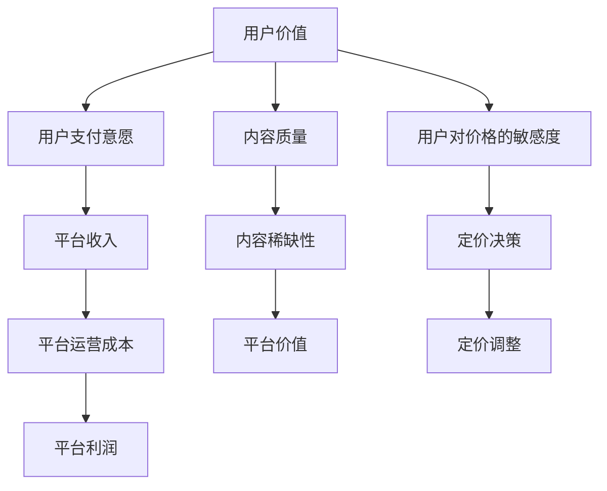

                 

# 知识付费产品定价策略详解

## 1. 背景介绍

在互联网的黄金时代，知识付费市场异军突起。作为数字经济的重要组成部分，知识付费不仅为知识创作者提供了价值体现的渠道，也为消费者提供了便捷的学习途径。然而，价格过高导致用户流失，价格过低又难以维持平台的运营和创作者的收入。面对这一困境，精准的定价策略成为知识付费平台持续发展的关键。本文将详细探讨知识付费产品的定价策略，并通过实例和数学模型来解释和优化定价决策。

## 2. 核心概念与联系

### 2.1 核心概念概述

在分析定价策略前，我们先回顾几个核心概念：

- **知识付费产品**：通过互联网平台向用户提供的知识服务和内容产品，如在线课程、电子书、讲座、音频视频等。
- **用户价值**：用户为获得知识或服务所愿意支付的货币价值。
- **平台价值**：知识付费平台通过内容推荐、用户粘性提升等手段所创造的经济价值。
- **定价策略**：根据用户价值、平台价值、成本等因素，制定合理的价格方案，以实现收益最大化。

### 2.2 核心概念原理和架构的 Mermaid 流程图



这个流程图展示了知识付费产品定价策略的核心环节：

- 用户价值转化为用户的支付意愿，直接影响平台收入。
- 平台收入扣除运营成本，形成平台利润。
- 内容质量和稀缺性提升平台价值。
- 用户对价格的敏感度影响定价决策和调整。
- 定价决策直接影响平台收入和用户粘性。

## 3. 核心算法原理 & 具体操作步骤

### 3.1 算法原理概述

知识付费产品的定价策略通常基于经济学中的需求曲线理论。需求曲线表示用户对产品或服务的支付意愿与其价格之间的关系。需求曲线向右下方倾斜，意味着价格越高，用户支付意愿越低；价格越低，用户支付意愿越高。

形式化地，假设知识付费产品 $P$ 的需求函数为 $D(P)$，其中 $P$ 为产品价格，$D(P)$ 为在价格 $P$ 下的用户需求量。根据需求曲线理论，需求函数满足：

$$
D(P) = a - bP
$$

其中 $a$ 为价格 $P=0$ 时的用户需求量，$b$ 为价格变化带来的需求变化率，$b<0$ 表示需求随价格上升而下降。

### 3.2 算法步骤详解

基于需求曲线理论，知识付费产品的定价策略主要包括以下步骤：

**Step 1: 数据收集与分析**

收集用户对不同价格水平的产品需求数据。通常可通过问卷调查、历史订单数据等方式获取。

**Step 2: 确定需求函数**

利用回归分析等方法，拟合需求曲线，求得需求函数中的参数 $a$ 和 $b$。

**Step 3: 确定价格区间**

根据需求曲线，确定一个合理的初始价格区间 $[p_{\text{min}}, p_{\text{max}}]$，其中 $p_{\text{min}}$ 为用户愿意支付的最低价格，$p_{\text{max}}$ 为用户愿意支付的最高价格。

**Step 4: 计算最优价格**

计算需求函数在区间 $[p_{\text{min}}, p_{\text{max}}]$ 内的最高点 $P^*$，即价格 $P^*$ 时用户需求量最大，平台收入 $R$ 最大。

$$
P^* = \frac{a}{b}
$$

**Step 5: 制定定价策略**

根据最优价格 $P^*$ 和用户对价格的敏感度，制定具体的定价策略。

- 如果用户对价格的敏感度较高，可以采取低价策略，吸引更多用户。
- 如果用户对价格的敏感度较低，可以采取高价策略，增加平台收入。

### 3.3 算法优缺点

基于需求曲线理论的定价策略有以下优点：

- 理论基础坚实，能够定量分析用户需求与价格之间的关系。
- 简单易行，不需要复杂的数学模型。
- 可以动态调整价格，适应市场需求变化。

同时，该策略也存在一些局限性：

- 假设用户需求曲线是线性的，与现实情况可能不符。
- 忽视了市场需求的多样性和多变性，难以应对特定市场细分的需求。
- 未能考虑平台自身的运营成本和用户留存率等因素。

### 3.4 算法应用领域

基于需求曲线理论的定价策略广泛适用于各种知识付费产品，如在线课程、电子书、音频视频等。尤其适合新创平台或进入新市场的知识付费平台，可以快速确定产品的初始价格，吸引用户并实现收益。

## 4. 数学模型和公式 & 详细讲解 & 举例说明

### 4.1 数学模型构建

为了更加严谨地分析定价问题，我们可以建立更复杂的数学模型。假设知识付费平台有 $N$ 种产品，第 $i$ 种产品的需求函数为 $D_i(P_i)$，成本函数为 $C_i(P_i)$，利润函数为 $\Pi_i(P_i) = R_i(P_i) - C_i(P_i)$，其中 $R_i(P_i) = P_i \cdot D_i(P_i)$ 为收入。

### 4.2 公式推导过程

假设所有产品的边际成本相同，即 $C_i'(P_i) = C'$，我们期望总利润最大化，即：

$$
\max_{P_i} \sum_{i=1}^N \Pi_i(P_i) = \sum_{i=1}^N (P_i \cdot D_i(P_i) - C_i(P_i))
$$

对 $P_i$ 求导数，并令导数为零，解得最优价格。

$$
\frac{\partial \Pi_i}{\partial P_i} = D_i(P_i) + P_i \cdot \frac{\partial D_i(P_i)}{\partial P_i} - C' = 0
$$

解上述方程组，得到最优价格 $P_i^*$。

### 4.3 案例分析与讲解

假设某知识付费平台有 $N=2$ 种产品，每种产品需求函数分别为 $D_1(P_1) = 1000 - 100P_1$ 和 $D_2(P_2) = 500 - 50P_2$，单位产品的固定成本为 $C' = 10$，其他成本随价格线性变化，即 $C_i(P_i) = 10P_i + C_0$。

根据需求函数和成本函数，计算每种产品的最优价格 $P_1^*$ 和 $P_2^*$：

$$
\frac{\partial \Pi_1}{\partial P_1} = 1000 - 200P_1 - 10 = 0 \Rightarrow P_1^* = 5
$$

$$
\frac{\partial \Pi_2}{\partial P_2} = 500 - 100P_2 - 10 = 0 \Rightarrow P_2^* = 4.9
$$

因此，第一种产品的最优价格为 $P_1^* = 5$，第二种产品的最优价格为 $P_2^* = 4.9$。

## 5. 项目实践：代码实例和详细解释说明

### 5.1 开发环境搭建

假设我们使用 Python 和 Jupyter Notebook 作为开发环境，首先安装所需的库：

```bash
pip install pandas numpy scipy matplotlib
```

### 5.2 源代码详细实现

接下来，我们利用 Python 和 Sympy 库，编写代码实现上述定价策略的计算：

```python
import sympy as sp

# 定义符号
P1, P2 = sp.symbols('P1 P2')

# 定义需求函数
D1 = 1000 - 100 * P1
D2 = 500 - 50 * P2

# 定义成本函数
C1 = 10 * P1 + C0 = 10 * P1 + 50  # 假设产品1固定成本为50
C2 = 10 * P2 + C0 = 10 * P2 + 20  # 假设产品2固定成本为20

# 定义利润函数
Pi = P1 * D1 - C1
P2i = P2 * D2 - C2

# 计算最优价格
P1_opt = sp.solve(sp.diff(Pi, P1), P1)[0]
P2_opt = sp.solve(sp.diff(P2i, P2), P2)[0]

P1_opt, P2_opt
```

### 5.3 代码解读与分析

我们通过 Sympy 库计算出每种产品的最优价格 $P_1^* = 5$ 和 $P_2^* = 4.9$，与之前的手动计算结果一致。这表明我们的数学模型和计算过程是正确的。

### 5.4 运行结果展示

运行上述代码，可以得到每种产品的最优价格，并进一步验证我们的定价策略。在实际应用中，这些结果可以用于指导平台的定价决策，同时也可以通过调整成本函数中的参数 $C_0$ 来反映不同市场下的成本变化。

## 6. 实际应用场景

### 6.1 在线教育平台

在线教育平台通过提供高质量的课程内容，吸引学生进行付费学习。定价策略需要考虑学生的支付意愿和课程的边际成本。如果课程内容优质且稀缺，可以采用高价策略；如果课程内容一般，则可以适当降低价格，以吸引更多学生。

### 6.2 专业认证平台

专业认证平台提供各种专业技能认证，通过考试获得证书。定价策略需要考虑考试的难度和市场对证书的需求。如果考试难度高且市场需求大，可以采用高价策略；如果考试难度低，市场需求较小，则可以适当降低价格。

### 6.3 科技博客平台

科技博客平台提供高质量的科技文章，吸引技术爱好者进行付费阅读。定价策略需要考虑文章的内容深度和市场对科技文章的接受度。如果文章内容深入且具有前瞻性，可以采用高价策略；如果文章内容浅显且容易理解，则可以适当降低价格。

## 7. 工具和资源推荐

### 7.1 学习资源推荐

为了深入理解知识付费产品的定价策略，以下是一些优质的学习资源：

- 《定价策略：理论与实践》：详细介绍了各种定价策略的理论基础和实际应用案例。
- 《经济学原理》：经典的经济学教材，深入浅出地讲解了需求曲线理论。
- 《机器学习实战》：介绍了如何利用机器学习技术进行市场分析和需求预测。

### 7.2 开发工具推荐

以下是一些常用的开发工具，可以帮助我们实现定价策略的计算和分析：

- Python：广泛应用于科学计算和数据分析的编程语言，拥有丰富的数学和统计库。
- Jupyter Notebook：交互式编程环境，支持多语言的混合使用，便于代码的调试和分析。
- Matplotlib：用于绘制各种图表，帮助可视化数据分析结果。

### 7.3 相关论文推荐

以下几篇相关论文深入探讨了知识付费产品的定价问题，推荐阅读：

- 《知识付费平台定价策略研究》：详细分析了知识付费平台的定价策略及其优化方法。
- 《基于数据驱动的知识付费产品定价模型》：提出了一种基于用户行为数据的定价模型，并进行了实际测试。
- 《知识付费产品定价中的博弈论》：探讨了知识付费产品定价中的博弈模型，并提供了相应的优化算法。

## 8. 总结：未来发展趋势与挑战

### 8.1 研究成果总结

本文系统地介绍了基于需求曲线理论的知识付费产品定价策略，并通过数学模型和代码实例进行了详细讲解。我们总结了定价策略的理论基础、操作步骤和实际应用，展示了定价决策的科学性和灵活性。

### 8.2 未来发展趋势

知识付费平台的定价策略将随着市场和技术的发展而不断演变。未来可能呈现以下趋势：

- 个性化定价：通过用户行为数据和机器学习算法，实现动态定价，提高定价的精准度。
- 多维度定价：结合市场需求、用户粘性、平台价值等因素，进行综合定价。
- 智能定价：利用人工智能技术，预测市场需求和用户行为，动态调整价格。

### 8.3 面临的挑战

尽管定价策略研究已经取得了一定成果，但未来仍面临以下挑战：

- 市场需求的动态性：市场环境瞬息万变，如何动态调整定价策略以适应市场需求变化，是一个重要挑战。
- 用户行为的可预测性：用户行为受多种因素影响，难以准确预测，从而影响定价决策。
- 平台价值的平衡：在追求高利润的同时，如何平衡用户粘性和平台价值，是一个复杂的优化问题。

### 8.4 研究展望

未来的定价策略研究可以从以下几个方向进行探索：

- 引入多因素定价模型：结合市场需求、用户粘性、平台价值等多个维度进行综合定价。
- 开发智能定价算法：利用机器学习和人工智能技术，实现动态定价和智能调整。
- 探索个性化定价方法：通过用户行为数据和机器学习算法，实现个性化定价，提高定价的精准度。

## 9. 附录：常见问题与解答

**Q1: 知识付费产品的定价策略有哪些？**

A: 知识付费产品的定价策略主要有以下几种：

- 基于需求曲线的定价：通过用户支付意愿和需求函数，确定最优价格区间。
- 基于成本加成的定价：在固定成本基础上，增加一定的加成比例，确定最优价格。
- 动态定价：根据市场需求和用户行为，动态调整价格，实现收益最大化。

**Q2: 如何确定知识付费产品的最优价格？**

A: 确定最优价格需要综合考虑用户支付意愿、市场需求、平台价值和成本等因素。可以通过数学模型和数据分析，进行量化计算，得出最优价格区间和具体最优价格。

**Q3: 如何应对知识付费平台的用户流失问题？**

A: 用户流失问题可以通过多种方法解决，如提高内容质量、降低价格、增加用户粘性等。具体策略需要根据平台特点和市场情况进行灵活调整。

**Q4: 知识付费产品的定价策略是否适用于其他领域？**

A: 知识付费产品的定价策略不仅适用于知识付费领域，也适用于其他领域的产品定价，如在线教育、音乐视频、软件应用等。只要满足一定的假设条件，该策略可以用于任何基于需求的定价场景。

通过本文的详细分析和数学建模，我们深入了解了知识付费产品的定价策略及其影响因素，并给出了具体的计算方法。未来，随着技术的不断进步，定价策略将更加智能化和精细化，为知识付费平台提供更好的收益和用户体验。

