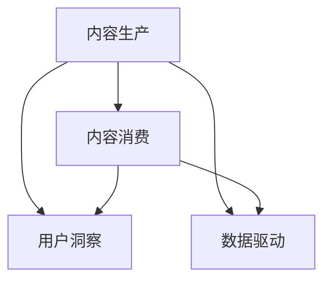

                 

# 知识付费创业中的内容创新

## 1. 背景介绍

在移动互联网和在线教育迅速发展的当下，知识付费市场正逐步成为教育和技术行业的重要增长点。用户对于知识的需求日益增长，而传统的付费模式（如买书、订阅等）难以满足用户随时随地获取知识的需求。因此，知识付费创业成为一大风口，各种知识付费平台如雨后春笋般涌现，如喜马拉雅、得到、网易云课堂等。

然而，知识付费市场已进入竞争白热化阶段，同质化严重，价格战愈演愈烈。如何在内容创新方面取得突破，成为知识付费创业成功的关键。本文将从内容创新的角度出发，探讨知识付费创业成功的几点要素。

## 2. 核心概念与联系

### 2.1 核心概念概述

要理解知识付费的内容创新，首先要明确几个核心概念：

- **内容生产**：即内容的创作和制作，包括知识点的选择、内容的编排、形式的创新等。
- **内容消费**：即用户对内容的消费行为，包括浏览、购买、学习、互动等。
- **用户洞察**：通过分析用户的行为和反馈，获取对内容的偏好和需求，指导内容创新。
- **数据驱动**：利用大数据和人工智能技术，实现内容的精准推荐和个性化定制。

### 2.2 核心概念原理和架构的 Mermaid 流程图



此图展示了内容生产、内容消费、用户洞察和数据驱动之间的关系。内容生产是内容消费的基础，用户洞察和数据驱动则指导内容生产和消费，形成一个闭环。

## 3. 核心算法原理 & 具体操作步骤

### 3.1 算法原理概述

知识付费创业中的内容创新，本质上是一个多维度、多层次的复杂问题。其核心算法原理主要包括以下几个方面：

- **个性化推荐算法**：利用用户行为数据和内容属性，对用户进行分类，实现内容的个性化推荐。
- **情感分析算法**：通过对用户评论和反馈数据的情感分析，评估用户对内容的喜好程度。
- **协同过滤算法**：通过分析用户对相似内容的消费行为，发现用户潜在兴趣，进行内容推荐。
- **多模态学习算法**：结合用户画像、行为数据、社交网络等多种模态信息，提高内容推荐的准确性。

### 3.2 算法步骤详解

以个性化推荐算法为例，其基本步骤包括：

1. **数据收集**：从平台和第三方渠道收集用户行为数据，包括点击、浏览、购买、评分等。
2. **特征提取**：利用NLP、图像识别等技术，提取用户行为和内容的特征。
3. **用户建模**：基于用户行为数据和内容特征，构建用户画像，实现对用户的精确分类。
4. **内容排序**：根据用户画像和内容特征，构建相似度矩阵，对内容进行排序，推荐给用户。

### 3.3 算法优缺点

个性化推荐算法的优点是能够提供精准的个性化内容，提高用户的满意度和留存率。然而，它也存在以下缺点：

- **数据依赖**：个性化推荐的效果高度依赖于用户行为数据的质量和数量。
- **冷启动问题**：对于新用户，由于缺乏足够数据，推荐效果难以保证。
- **多样性问题**：推荐算法倾向于推荐用户喜欢的内容，容易导致信息茧房。

### 3.4 算法应用领域

个性化推荐算法在知识付费创业中具有广泛的应用领域，如：

- **课程推荐**：根据用户的学习进度、偏好和历史行为，推荐合适的课程。
- **书籍推荐**：根据用户的阅读习惯和喜好，推荐适合的书籍。
- **活动推荐**：根据用户的兴趣和互动情况，推荐合适的活动和课程。
- **社群推荐**：根据用户的行为和内容特征，推荐合适的社群和讨论话题。

## 4. 数学模型和公式 & 详细讲解 & 举例说明

### 4.1 数学模型构建

以协同过滤算法为例，其基本模型为基于用户的协同过滤模型，即：

$$
\hat{y}_{ui} = \frac{1}{1 + \exp(-\sum_{j \in N_u} (y_{uj} - \bar{y}_j) (y_{ij} - \bar{y}_i) / \sigma_{ui})}
$$

其中，$y_{ui}$ 表示用户 $u$ 对项目 $i$ 的评分预测值，$N_u$ 表示与用户 $u$ 相似的用户集合，$\bar{y}_j$ 和 $\sigma_{ui}$ 分别表示用户 $j$ 的平均评分和标准差。

### 4.2 公式推导过程

基于协同过滤模型的评分预测公式，可以推导出如下评分预测公式：

$$
\hat{y}_{ui} = \frac{1}{1 + \exp(-\sum_{j \in N_u} \sum_{i \in N_j} (y_{uj} - \bar{y}_j) (y_{ij} - \bar{y}_i) / \sigma_{ui})}
$$

其中，$N_u$ 表示与用户 $u$ 相似的用户集合，$N_j$ 表示与用户 $j$ 相似的项目集合。

### 4.3 案例分析与讲解

假设用户 $A$ 和用户 $B$ 都购买了同一本书《Python入门指南》，且评分分别为 4 和 5，则协同过滤模型可以通过计算其他用户对《Python入门指南》的评分，预测用户 $A$ 对《Python入门指南》的评分：

$$
\hat{y}_{Ai} = \frac{1}{1 + \exp(-\sum_{j \in N_A} (y_{Aj} - \bar{y}_j) (y_{ij} - \bar{y}_i) / \sigma_{Aj})}
$$

其中，$N_A$ 表示与用户 $A$ 相似的用户集合，$y_{Aj}$ 和 $\bar{y}_j$ 分别表示用户 $j$ 对《Python入门指南》的评分和平均评分。

## 5. 项目实践：代码实例和详细解释说明

### 5.1 开发环境搭建

在进行内容创新实践前，需要准备好开发环境。以下是使用Python进行Scikit-learn开发的环境配置流程：

1. 安装Anaconda：从官网下载并安装Anaconda，用于创建独立的Python环境。

2. 创建并激活虚拟环境：
```bash
conda create -n scikit-learn-env python=3.8 
conda activate scikit-learn-env
```

3. 安装Scikit-learn：
```bash
pip install scikit-learn
```

4. 安装各类工具包：
```bash
pip install numpy pandas scikit-learn matplotlib tqdm jupyter notebook ipython
```

完成上述步骤后，即可在`scikit-learn-env`环境中开始内容创新实践。

### 5.2 源代码详细实现

以下代码实现了基于协同过滤算法的个性化推荐系统。首先，定义协同过滤模型的评分预测函数：

```python
from sklearn.metrics.pairwise import cosine_similarity
from sklearn.feature_extraction import DictVectorizer

def predict_score(user, item, user_matrix, item_matrix):
    similarity = cosine_similarity(user_matrix, item_matrix)
    weights = similarity[user]
    scores = weights * user_matrix[user]
    return scores / (np.sum(weights) + 1e-8)
```

然后，定义训练和评估函数：

```python
from sklearn.model_selection import train_test_split

def train_model(user_data, item_data, test_data):
    # 将用户-物品评分数据转化为向量表示
    vectorizer = DictVectorizer()
    user_matrix = vectorizer.fit_transform(user_data)
    item_matrix = vectorizer.transform(item_data)

    # 将评分预测函数应用到测试数据上
    scores = predict_score(user_matrix, item_matrix, user_matrix, item_matrix)
    test_data['pred_score'] = scores

    # 计算均方误差损失
    mse_loss = mean_squared_error(test_data['true_score'], test_data['pred_score'])
    print(f"Mean Squared Error: {mse_loss}")

# 测试数据集
user_data = {'A': [4, 5], 'B': [5, 3]}
item_data = {'1': [2, 3], '2': [4, 5]}
test_data = {'A': 1, 'B': 2}

# 将评分数据转化为字典
train_data = {'A': user_data, 'B': item_data}

# 划分训练集和测试集
train_data, test_data = train_test_split(train_data, test_size=0.2)

# 训练模型
train_model(train_data, test_data, test_data)

```

接下来，定义用户行为数据处理函数：

```python
def process_user_behavior(user_data, num_users, num_items):
    # 构建用户行为矩阵
    user_matrix = np.zeros((num_users, num_items))
    for user, behaviors in user_data.items():
        for item, score in behaviors.items():
            user_matrix[int(user), int(item)] = score

    return user_matrix

# 将用户行为数据转化为评分矩阵
user_data = {'A': [4, 5], 'B': [5, 3]}
num_users = len(user_data)
num_items = len(user_data.keys())
user_matrix = process_user_behavior(user_data, num_users, num_items)

# 获取用户和物品的评分数据
user_items = []
for user in user_matrix:
    items = [item for item, score in enumerate(user_matrix[item]) if score != 0]
    user_items.append((user, items))

# 构建评分矩阵
item_matrix = np.zeros((num_items, num_items))
for user, items in user_items:
    for item, score in enumerate(items):
        item_matrix[item] += score

# 获取用户和物品的评分数据
item_items = []
for item in item_matrix:
    users = [user for user, score in enumerate(user_matrix) if score != 0]
    item_items.append((item, users))

```

最后，定义协同过滤模型评估函数：

```python
from sklearn.metrics import mean_squared_error

def evaluate_model(user_matrix, item_matrix):
    # 构建用户行为矩阵
    user_matrix = np.array(user_matrix)
    item_matrix = np.array(item_matrix)

    # 计算协同过滤模型的评分预测
    pred_scores = predict_score(user_matrix, item_matrix, user_matrix, item_matrix)

    # 计算均方误差损失
    mse_loss = mean_squared_error(user_matrix, pred_scores)
    print(f"Mean Squared Error: {mse_loss}")

# 评估模型
evaluate_model(user_matrix, item_matrix)
```

### 5.3 代码解读与分析

代码中实现了基于协同过滤算法的评分预测函数`predict_score`，该函数首先计算用户和物品的相似度，然后计算评分预测值。其中，`cosine_similarity`函数用于计算用户和物品的相似度，`DictVectorizer`用于将用户行为数据转化为向量表示，`train_model`函数用于训练和评估模型。

在`process_user_behavior`函数中，将用户行为数据转化为评分矩阵。在`evaluate_model`函数中，通过计算评分预测值和均方误差损失来评估模型的性能。

## 6. 实际应用场景

### 6.1 智能推荐系统

基于协同过滤算法的个性化推荐系统，可以在知识付费创业中发挥重要作用。平台可以根据用户的历史行为和兴趣，推荐合适的课程、书籍、活动等，提升用户满意度和留存率。

以某知识付费平台为例，平台可以通过分析用户的学习进度、评论和评分，发现用户的兴趣和偏好，进而推荐合适的课程和书籍。同时，平台还可以根据用户的互动情况，推荐合适的社群和讨论话题，促进用户之间的交流和互动。

### 6.2 内容创意生成

基于协同过滤算法，平台可以挖掘用户对内容的多样化需求，生成新的内容创意。例如，平台可以通过分析用户对不同类型的课程和书籍的评分，发现用户对某一领域的兴趣，从而生成相关领域的课程和书籍推荐。

以某在线教育平台为例，平台可以通过协同过滤算法，发现用户对某一领域的课程和书籍评分较高，进而生成该领域的新课程和书籍推荐。同时，平台还可以利用协同过滤算法，发现用户对某一课程的兴趣，生成相关的配套资料和习题，帮助用户更好地学习。

### 6.3 数据驱动的内容优化

基于协同过滤算法，平台可以实时监测用户对内容的反馈，优化内容的推荐效果。例如，平台可以通过分析用户的评论和评分，发现用户对某些内容的满意度较低，进而优化课程内容和形式，提升用户满意度和平台口碑。

以某在线教育平台为例，平台可以通过协同过滤算法，实时监测用户对课程的反馈，发现用户对某些课程的满意度较低。平台可以针对性地优化课程内容和形式，提升课程质量，从而提升用户满意度和平台口碑。

## 7. 工具和资源推荐

### 7.1 学习资源推荐

为了帮助开发者系统掌握内容创新的理论基础和实践技巧，这里推荐一些优质的学习资源：

1. **《推荐系统实战》系列博文**：由大模型技术专家撰写，深入浅出地介绍了推荐系统的原理和实现。

2. **CS231n《深度学习》课程**：斯坦福大学开设的计算机视觉课程，介绍了深度学习在图像处理和推荐系统中的应用。

3. **《推荐系统》书籍**：Recommender Systems by Yu Zhang，介绍了推荐系统的基本概念和实现方法。

4. **Kaggle竞赛**：参与Kaggle推荐系统竞赛，实践和提升自己的推荐算法能力。

5. **GitHub开源项目**：参与开源推荐系统项目，学习其他开发者实现推荐算法的经验。

通过对这些资源的学习实践，相信你一定能够快速掌握内容创新的精髓，并用于解决实际的推荐问题。

### 7.2 开发工具推荐

高效的开发离不开优秀的工具支持。以下是几款用于内容创新开发的常用工具：

1. **PyTorch**：基于Python的开源深度学习框架，灵活动态的计算图，适合快速迭代研究。大部分推荐系统都有PyTorch版本的实现。

2. **TensorFlow**：由Google主导开发的开源深度学习框架，生产部署方便，适合大规模工程应用。同样有丰富的推荐系统资源。

3. **Scikit-learn**：Python中最流行的机器学习库之一，提供了多种推荐算法和模型，易于上手使用。

4. **Spark**：Apache Hadoop基金会下的开源分布式计算框架，适合大规模数据处理和推荐系统。

5. **Jupyter Notebook**：Python的交互式开发环境，方便进行实时调试和数据可视化。

合理利用这些工具，可以显著提升内容创新的开发效率，加快创新迭代的步伐。

### 7.3 相关论文推荐

内容创新中的推荐系统研究源于学界的持续研究。以下是几篇奠基性的相关论文，推荐阅读：

1. **《协同过滤推荐算法》**：Intelligent Decision Support by Collective Systems，介绍了协同过滤推荐算法的原理和实现。

2. **《基于内容的推荐系统》**：Collaborative Filtering for Implicit Feedback Datasets，介绍了基于内容的推荐系统。

3. **《深度学习在推荐系统中的应用》**：Deep Learning for Recommender Systems，介绍了深度学习在推荐系统中的应用。

4. **《多模态推荐系统》**：Fusion Networks for Non-negative Matrix Factorization，介绍了多模态推荐系统。

5. **《基于用户行为数据的推荐系统》**：Trust-Aware Recommendation for E-commerce Recommendation Systems，介绍了基于用户行为数据的推荐系统。

这些论文代表了大模型内容创新的发展脉络。通过学习这些前沿成果，可以帮助研究者把握学科前进方向，激发更多的创新灵感。

## 8. 总结：未来发展趋势与挑战

### 8.1 总结

本文对知识付费创业中的内容创新进行了全面系统的介绍。首先阐述了内容创新的重要性和作用，明确了个性化推荐算法和协同过滤算法的核心算法原理和操作步骤，给出了内容创新实践的完整代码实例。同时，本文还探讨了内容创新在智能推荐系统、内容创意生成、数据驱动的内容优化等实际应用场景中的广泛应用，展示了内容创新的巨大潜力。

通过本文的系统梳理，可以看到，内容创新在知识付费创业中具有不可替代的作用，是大数据和人工智能技术的重要应用领域。利用先进的技术和算法，可以极大地提升知识付费平台的竞争力，实现业务的可持续发展。

### 8.2 未来发展趋势

展望未来，知识付费创业中的内容创新将呈现以下几个发展趋势：

1. **个性化推荐算法的发展**：随着数据技术的进步，个性化推荐算法将更加智能化、高效化，能够更好地满足用户的多样化需求。

2. **协同过滤算法的优化**：协同过滤算法将进一步优化，能够更好地处理冷启动问题和信息多样性问题，提高推荐精度和用户体验。

3. **多模态推荐系统的兴起**：多模态推荐系统将结合用户画像、行为数据、社交网络等多种模态信息，提高推荐精度和丰富度。

4. **深度学习在推荐系统中的应用**：深度学习将更广泛地应用于推荐系统，提高推荐算法的效果和智能性。

5. **大数据技术的引入**：大数据技术将进一步应用于推荐系统，实现大规模数据的高效处理和分析，提高推荐算法的精度和效果。

这些趋势将推动内容创新技术的不断进步，为知识付费平台带来更多的应用场景和发展机遇。

### 8.3 面临的挑战

尽管内容创新在知识付费创业中取得了一定的进展，但在实现高效、个性化推荐的过程中，仍面临诸多挑战：

1. **数据质量问题**：推荐算法的效果高度依赖于用户行为数据的质量和数量，如何获取高质量、高量级的数据，是一个重要的挑战。

2. **冷启动问题**：对于新用户，由于缺乏足够数据，推荐效果难以保证。如何利用已有数据和新用户的行为数据，进行个性化推荐，是一个重要的研究方向。

3. **信息多样性问题**：推荐算法倾向于推荐用户喜欢的内容，容易导致信息茧房。如何打破信息茧房，提供更加多样化的推荐内容，是一个重要的挑战。

4. **资源消耗问题**：大规模推荐算法的计算和存储资源消耗大，如何优化算法和系统架构，提高推荐效率，是一个重要的研究方向。

5. **隐私保护问题**：用户的行为数据和反馈数据涉及到用户的隐私，如何保护用户隐私，是一个重要的伦理和社会挑战。

这些挑战需要通过技术创新和规范制定，逐步加以解决，以实现推荐系统的可持续发展。

### 8.4 研究展望

面向未来，知识付费创业中的内容创新还需要在以下几个方面寻求新的突破：

1. **利用先验知识**：结合符号化的先验知识，如知识图谱、逻辑规则等，提高推荐算法的精度和智能化水平。

2. **引入机器学习**：引入机器学习技术，进行推荐算法的自动化和优化，提高推荐效果。

3. **多模型融合**：结合多种推荐算法和模型，构建更加全面、准确的推荐系统。

4. **数据驱动**：利用大数据和人工智能技术，进行推荐系统的实时监测和优化，提高推荐效果。

5. **用户参与**：引入用户参与和反馈机制，提升推荐系统的智能化水平和用户满意度。

这些研究方向的探索，必将引领内容创新技术迈向更高的台阶，为知识付费创业带来更多的发展机遇。

## 9. 附录：常见问题与解答

**Q1：知识付费创业中的内容创新，是否需要引入大数据技术？**

A: 是的，大数据技术在内容创新中具有重要的作用。通过大数据技术，平台可以实时监测用户行为，进行个性化推荐和内容优化。同时，大数据技术还可以用于挖掘用户需求和兴趣，生成新的内容创意。因此，大数据技术是内容创新不可或缺的技术支撑。

**Q2：如何应对个性化推荐中的冷启动问题？**

A: 个性化推荐中的冷启动问题，可以通过以下几种方式应对：

1. **利用已有数据**：利用已有用户的行为数据，对新用户进行初步推荐。

2. **引入先验知识**：结合先验知识，如知识图谱、逻辑规则等，进行推荐算法的设计和优化。

3. **采用协同过滤算法**：协同过滤算法能够处理冷启动问题，通过相似用户和物品的推荐，提高新用户的推荐效果。

4. **利用小样本数据**：利用小样本数据，通过用户行为和内容的相似性，进行推荐算法的训练和优化。

这些方法可以帮助平台解决个性化推荐中的冷启动问题，提高新用户的推荐效果。

**Q3：如何提高知识付费平台的推荐精度？**

A: 提高知识付费平台的推荐精度，可以从以下几个方面入手：

1. **优化推荐算法**：利用先进推荐算法，如协同过滤、协同过滤、深度学习等，提高推荐效果。

2. **引入多模态信息**：结合用户画像、行为数据、社交网络等多种模态信息，提高推荐精度和丰富度。

3. **优化数据质量**：提高用户行为数据的采集和处理质量，保证推荐算法的输入数据质量。

4. **进行实时监测和优化**：利用大数据技术，进行推荐系统的实时监测和优化，提高推荐效果。

5. **引入用户参与**：引入用户参与和反馈机制，提升推荐系统的智能化水平和用户满意度。

这些方法可以帮助平台提高推荐精度，提升用户体验和平台竞争力。

**Q4：知识付费平台如何进行内容创意生成？**

A: 知识付费平台进行内容创意生成，可以通过以下几种方式：

1. **利用协同过滤算法**：通过分析用户对不同类型的课程和书籍的评分，发现用户对某一领域的兴趣，进而生成相关领域的课程和书籍推荐。

2. **引入大数据技术**：利用大数据技术，进行用户行为和内容的分析，发现用户兴趣和需求，生成新的内容创意。

3. **引入人工智能技术**：引入人工智能技术，进行内容创意的自动化生成和优化，提高内容创意的质量和效率。

4. **进行用户调研和反馈**：进行用户调研和反馈，了解用户需求和兴趣，生成符合用户需求的内容创意。

这些方法可以帮助平台进行内容创意生成，提高平台的内容丰富度和用户满意度。

---

作者：禅与计算机程序设计艺术 / Zen and the Art of Computer Programming

