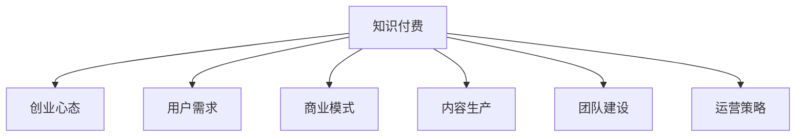

                 

# 知识付费创业中的心态调整

> 关键词：知识付费,创业心态,用户需求,商业模式,内容生产,团队建设

## 1. 背景介绍

### 1.1 问题由来
近年来，随着互联网的普及和智能设备的广泛应用，在线教育市场呈现出爆发式增长。知识付费成为越来越多人获取优质教育资源和技能提升的重要途径。然而，传统知识付费市场也存在诸多痛点，如内容同质化严重、平台运营难度大、用户付费转化率低等。在这样的背景下，知识付费创业成为不少有志之士的探索方向。

### 1.2 问题核心关键点
知识付费创业的核心在于如何调整心态，平衡好商业模式、内容生产与用户需求的关系，同时优化团队建设和运营策略，才能在激烈的竞争中立于不败之地。具体而言，包括以下几个关键点：

- 用户需求导向：如何深入挖掘用户需求，提供真正有价值的知识内容。
- 商业模式优化：如何设计合理的定价策略，提高用户转化率和平台盈利能力。
- 内容生产质量：如何吸引和激励优秀的内容创作者，持续产出高质量内容。
- 团队建设管理：如何构建高效、协同的团队，快速迭代产品和服务。
- 运营策略调整：如何制定科学的市场策略，提升平台的用户黏性和市场份额。

## 2. 核心概念与联系

### 2.1 核心概念概述

为更好地理解知识付费创业的心态调整，本节将介绍几个密切相关的核心概念：

- 知识付费：指通过在线平台，用户付费获取知识内容或技能培训的商业模式。与传统的线下教育相比，具有便捷性、互动性和个性化等优点。
- 创业心态：指创业者在创业过程中所展现的勇气、热情、创新和坚持等心理特质。良好的创业心态是创业成功的关键。
- 用户需求：指用户在获取知识或技能时所关注的重点和痛点，如学习内容的质量、学习体验的流畅性、学习效果的验证等。
- 商业模式：指知识付费平台的盈利模式，如按课程收费、按年费订阅、会员制等多种形式。
- 内容生产：指知识付费平台通过吸引和激励内容创作者，持续产出优质内容的过程。
- 团队建设：指知识付费平台通过招聘、培训、激励等手段，构建高效团队的过程。
- 运营策略：指知识付费平台在市场推广、用户留存、数据分析等方面的策略选择。

这些核心概念之间的逻辑关系可以通过以下Mermaid流程图来展示：



这个流程图展示的知识付费创业的核心概念及其之间的关系：

1. 知识付费平台的成功，依赖于良好的创业心态，以用户需求为导向，设计合理的商业模式，通过高效的内容生产和团队建设，配合科学的运营策略。
2. 良好的创业心态，使得创业者能够不断挑战自我，克服困难，最终实现创业目标。
3. 深入挖掘用户需求，才能设计出符合市场实际的产品和策略，提升用户满意度。
4. 合理的商业模式，是知识付费平台可持续运营的基础，通过多样化的收费方式，平衡内容质量和盈利能力。
5. 高效的内容生产，能够持续吸引优秀内容创作者，保证平台内容的丰富和更新。
6. 团队建设的高效协同，是知识付费平台快速迭代、优化产品的关键。
7. 科学的运营策略，能够提升平台的用户黏性，增加市场份额。

这些概念共同构成了知识付费创业的完整框架，帮助创业者从多个维度进行全面思考和优化。

## 3. 核心算法原理 & 具体操作步骤
### 3.1 算法原理概述

知识付费创业的心态调整，本质上是一个系统性的优化过程。其核心思想是：在保持良好创业心态的基础上，通过精细化运营、差异化内容和团队建设，满足用户需求，提升商业价值。

具体而言，可以采取以下步骤：

1. **用户需求调研**：通过问卷调查、用户访谈等方式，深入了解用户的学习习惯、偏好和痛点，制定针对性的内容策略。
2. **商业模式设计**：根据用户需求和市场环境，设计多样化的收费模式，如按课程收费、按月订阅、终身会员等，提升用户转化率。
3. **内容生产优化**：引入优质内容创作者，提供培训和激励措施，持续产出高质量课程和文章，增强用户黏性。
4. **团队建设提升**：招募有潜力的员工，提供系统培训和晋升机制，培养高效团队，快速响应市场变化。
5. **运营策略调整**：制定科学的市场推广和用户留存策略，定期评估运营效果，不断优化运营策略。

### 3.2 算法步骤详解

以下是知识付费创业的心态调整的具体操作步骤：

**Step 1: 用户需求调研**
- 收集用户反馈：通过问卷、访谈、评论等方式，了解用户对知识内容的需求和评价。
- 数据统计分析：对收集到的数据进行统计分析，找出用户关注的共性需求和痛点。
- 制定内容策略：根据分析结果，制定符合用户需求的内容生产计划，明确课程方向和知识点。

**Step 2: 商业模式设计**
- 多渠道定价：根据用户需求，设计多种收费模式，如按课程、按月、按年订阅等。
- 用户转化率优化：通过A/B测试、优惠活动等方式，提升用户付费转化率。
- 会员制度设计：推出会员制度，提升用户粘性和平台收入。

**Step 3: 内容生产优化**
- 引入优质创作者：通过平台活动、推荐机制等方式，吸引有潜力的内容创作者加入。
- 提供培训激励：为内容创作者提供培训资源、补贴奖励等，提高其创作热情。
- 持续产出内容：定期更新课程和文章，保持内容的新鲜度和多样性。

**Step 4: 团队建设提升**
- 招聘优秀人才：根据岗位需求，招募具有相关经验和潜力的员工。
- 系统化培训：为新员工提供系统化的入职培训和岗位培训，提升其工作能力。
- 激励机制设计：设计公平透明的激励机制，如奖金、晋升机会等，激发员工的工作积极性。

**Step 5: 运营策略调整**
- 市场推广策略：根据用户需求和平台特点，制定科学的市场推广策略，如广告投放、内容营销等。
- 用户留存策略：通过个性化推荐、学习提醒、社区互动等方式，提高用户留存率。
- 数据分析优化：定期收集和分析平台数据，及时调整策略，优化运营效果。

### 3.3 算法优缺点

知识付费创业的心态调整方法具有以下优点：
1. 系统性优化：通过精细化运营、差异化内容和团队建设，全方位提升平台竞争力。
2. 用户导向：深入了解用户需求，提升用户满意度和平台黏性。
3. 灵活性高：可以根据市场变化和用户反馈，快速调整策略。

同时，该方法也存在一定的局限性：
1. 初期成本高：内容生产、团队建设需要大量资源投入，初期成本较高。
2. 运营复杂：需要综合考虑多个维度的因素，运营难度较大。
3. 市场竞争激烈：知识付费市场竞争激烈，新平台容易面临诸多挑战。
4. 用户需求多变：用户需求随着时间推移不断变化，需要持续跟踪和调整策略。

尽管存在这些局限性，但就目前而言，这种系统化心态调整方法仍是知识付费创业中最主流、最有效的范式。未来相关研究的重点在于如何进一步降低运营成本，提高运营效率，同时兼顾用户需求和商业价值。

### 3.4 算法应用领域

知识付费创业的心态调整方法在多个领域已得到了广泛应用，例如：

- 在线教育平台：如Coursera、Udemy等，通过持续的内容生产和团队建设，提供优质课程，提升用户转化率和留存率。
- 职业培训社区：如网易云课堂、腾讯课堂等，通过精准的用户需求调研，设计合理的商业模式，吸引行业专家参与内容创作，提升培训效果。
- 知识付费应用：如得到、喜马拉雅等，通过用户调研和内容优化，提供多样化、个性化的内容服务，提升用户体验和平台黏性。

除了上述这些经典应用外，知识付费创业的心态调整方法还被创新性地应用到更多场景中，如企业内训、行业协会、专业社群等，为知识传播和技能提升提供了新的路径。随着知识付费市场的不断成熟，相信这种心态调整方法将继续推动知识传播和教育技术的发展。

## 4. 数学模型和公式 & 详细讲解 & 举例说明

### 4.1 数学模型构建

本节将使用数学语言对知识付费创业的心态调整过程进行更加严格的刻画。

记用户需求为 $D=\{d_i\}_{i=1}^N$，其中 $d_i$ 为第 $i$ 个用户需求。商业模型为 $M$，内容生产为 $C$，团队建设为 $T$，运营策略为 $O$。设用户满意度为 $S$，平台收入为 $R$。

定义目标函数为：

$$
\max_{D, M, C, T, O} S - \alpha R
$$

其中 $\alpha$ 为平衡系数，控制用户满意度与平台收入的关系。

### 4.2 公式推导过程

以下我们以一个简单的例子来说明如何通过数学模型和公式推导，达到最优的用户满意度和平台收入平衡。

假设用户满意度和平台收入的关系如下：

$$
S = f(D, M, C, T, O) = k_1 \cdot D + k_2 \cdot M + k_3 \cdot C + k_4 \cdot T + k_5 \cdot O
$$

其中 $k_i$ 为各因素对用户满意度的贡献系数。

根据目标函数，我们需要求解 $D, M, C, T, O$ 的最优值，使得 $S - \alpha R$ 最大。

假设平台初始收入为 $R_0$，根据商业模型设计，可以得到：

$$
R = h(D, M, C, T, O)
$$

代入目标函数中，得：

$$
\max_{D, M, C, T, O} S - \alpha h(D, M, C, T, O)
$$

通过求解上述优化问题，即可得到最优的用户满意度与平台收入的平衡。

### 4.3 案例分析与讲解

以Coursera为例，分析其心态调整过程中的关键举措：

- **用户需求调研**：Coursera通过用户调研和数据分析，深入了解不同用户群体的需求，设计了多样化的课程内容，涵盖各个学科和行业。
- **商业模式设计**：Coursera设计了灵活的付费模式，如按课程收费、按月订阅、终身会员等，同时推出学生优惠和免费课程，提升用户转化率。
- **内容生产优化**：Coursera引入全球顶尖高校和专家，提供丰富的课程资源，并通过与学术机构的合作，不断推出高质量课程，吸引用户参与学习。
- **团队建设提升**：Coursera招募和培养了高素质员工团队，设计了系统的培训和激励机制，确保内容质量和运营效率。
- **运营策略调整**：Coursera通过精准的广告投放、个性化的课程推荐和用户互动，提升用户留存率和平台收入。

通过上述举措，Coursera在知识付费创业中取得了显著的成效，成为全球领先的在线教育平台之一。

## 5. 项目实践：代码实例和详细解释说明
### 5.1 开发环境搭建

在进行知识付费创业的心态调整项目实践前，我们需要准备好开发环境。以下是使用Python进行Django开发的环境配置流程：

1. 安装Anaconda：从官网下载并安装Anaconda，用于创建独立的Python环境。

2. 创建并激活虚拟环境：
```bash
conda create -n knowledge-env python=3.8 
conda activate knowledge-env
```

3. 安装Django：
```bash
pip install django
```

4. 安装Nginx：
```bash
sudo apt-get update
sudo apt-get install nginx
```

5. 安装Gunicorn：
```bash
pip install gunicorn
```

6. 安装Django扩展：
```bash
pip install django-rest-framework django-cors-headers django-compressor
```

完成上述步骤后，即可在`knowledge-env`环境中开始项目实践。

### 5.2 源代码详细实现

下面以构建一个简单的在线教育平台为例，展示知识付费创业的心态调整的Django代码实现。

首先，定义用户模型：

```python
from django.contrib.auth.models import User
from django.db import models

class Student(models.Model):
    user = models.OneToOneField(User, on_delete=models.CASCADE)
    courses = models.ManyToManyField('Course')
    enrolled_courses = models.ManyToManyField('Course', related_name='enrolled_by')
    def __str__(self):
        return self.user.username
```

然后，定义课程模型：

```python
class Course(models.Model):
    title = models.CharField(max_length=100)
    description = models.TextField()
    instructor = models.ForeignKey(User, on_delete=models.CASCADE)
    def __str__(self):
        return self.title
```

接着，定义订单模型：

```python
class Order(models.Model):
    student = models.ForeignKey(Student, on_delete=models.CASCADE)
    course = models.ForeignKey(Course, on_delete=models.CASCADE)
    price = models.DecimalField(max_digits=10, decimal_places=2)
    status = models.CharField(max_length=20, choices=[('PENDING', 'Pending'), ('COMPLETE', 'Complete'), ('REFUND', 'Refund')])
    def __str__(self):
        return f"{self.student} enrolled in {self.course}"
```

然后，定义视图和序列化器：

```python
from django.shortcuts import render, redirect
from rest_framework import viewsets, status
from .models import Student, Course, Order
from .serializers import StudentSerializer, CourseSerializer, OrderSerializer

class StudentViewSet(viewsets.ModelViewSet):
    queryset = Student.objects.all()
    serializer_class = StudentSerializer

class CourseViewSet(viewsets.ModelViewSet):
    queryset = Course.objects.all()
    serializer_class = CourseSerializer

class OrderViewSet(viewsets.ModelViewSet):
    queryset = Order.objects.all()
    serializer_class = OrderSerializer

def register_user(request):
    if request.method == 'POST':
        serializer = UserSerializer(data=request.data)
        if serializer.is_valid():
            serializer.save()
            return redirect('home')
    return render(request, 'register.html')

def enroll_course(request, course_id):
    if request.method == 'POST':
        student = get_student(request)
        course = get_course(request, course_id)
        order = Order.objects.create(student=student, course=course, price=course.price)
        return redirect('course_detail', course_id=course_id)
```

最后，定义视图函数：

```python
from django.shortcuts import render
from .models import Student, Course, Order
from .serializers import StudentSerializer, CourseSerializer, OrderSerializer

def home(request):
    courses = Course.objects.all()
    return render(request, 'home.html', {'courses': courses})

def course_detail(request, course_id):
    course = get_course(request, course_id)
    return render(request, 'course_detail.html', {'course': course})

def get_student(request):
    if request.user.is_authenticated:
        return request.user
    return redirect('register_user')

def get_course(request, course_id):
    return Course.objects.get(id=course_id)
```

以上就是使用Django构建一个简单的在线教育平台的心态调整实践的完整代码实现。可以看到，通过Django的模型和视图机制，可以快速构建起用户管理、课程管理和订单管理等核心功能。

### 5.3 代码解读与分析

让我们再详细解读一下关键代码的实现细节：

**models.py**：
- 定义了用户、课程和订单等模型，用于存储用户数据、课程信息和订单信息。
- 使用了Django的内置模型和自定义字段，满足数据存储需求。

**views.py**：
- 定义了学生、课程和订单的视图函数，用于处理用户请求，并调用相应模型进行操作。
- 使用了Django的RESTful API支持，支持通过HTTP请求进行数据增删改查。

**urls.py**：
- 定义了项目的URL路由，将用户请求路由到相应的视图函数处理。
- 使用了Django的URL配置工具，方便管理和维护。

通过上述代码，可以构建一个基本的在线教育平台，实现用户注册、课程浏览、课程报名等功能。需要注意的是，实际开发中还需要进一步完善用户登录、权限控制、数据验证、性能优化等方面的细节。

## 6. 实际应用场景
### 6.1 在线教育平台

知识付费创业的心态调整方法在在线教育平台中得到了广泛应用。通过深入了解用户需求，设计合理的商业模式，持续产出高质量内容，吸引优秀的内容创作者，并采用科学的市场推广和用户留存策略，可以有效提升平台的用户转化率和留存率。

以Coursera为例，通过其系统化心态调整方法，在全球范围内吸引了数百万用户参与学习，成为在线教育领域的标杆。

### 6.2 企业内训

在企业内训领域，知识付费创业的心态调整方法同样具有重要应用。通过企业内训平台，企业可以高效、灵活地培训员工，提升整体团队素质。

企业可以根据员工需求，设计多样化的内训课程，如技术培训、领导力培训、技能提升等。同时，通过设计合理的收费模式和激励机制，提升员工参与度。

### 6.3 行业协会

行业协会通过知识付费平台，可以组织和推广专业知识分享活动，提升会员的专业能力和行业影响力。

协会可以邀请业内专家，设计高质量的课程和讲座，并通过收费模式和会员制度，提升活动参与度和收益。同时，通过平台提供的学习资料和社区互动，增强会员的黏性和互动性。

### 6.4 专业社群

知识付费创业的心态调整方法在专业社群中同样具有重要应用。通过社群平台，专业人才可以分享和学习最新技术和知识，拓展人脉，提升个人品牌。

平台可以根据社群成员的需求，设计针对性的课程和活动，提升社群的影响力和专业性。同时，通过设计合理的收费模式和会员制度，吸引更多的专业人才加入，扩大社群的覆盖范围和影响力。

## 7. 工具和资源推荐
### 7.1 学习资源推荐

为了帮助开发者系统掌握知识付费创业的心态调整理论基础和实践技巧，这里推荐一些优质的学习资源：

1. Coursera官网：提供大量的在线课程，涵盖各个学科和行业，帮助用户深入了解不同领域的知识付费创业模式。
2. Udemy官网：提供多样的技能培训课程，覆盖编程、设计、营销等各个领域，帮助用户提升专业技能。
3. Kaggle平台：提供大量的数据科学和机器学习竞赛，帮助用户学习和实践数据分析和模型优化技能。
4. Medium博客：汇集了大量的技术文章和案例分享，帮助用户了解知识付费创业的最佳实践和经验教训。
5. 《知识付费的崛起与未来》：一本系统介绍知识付费创业的理论和实践的书籍，提供深入的理论分析和实战案例。

通过对这些资源的学习实践，相信你一定能够快速掌握知识付费创业的心态调整的精髓，并用于解决实际的创业问题。

### 7.2 开发工具推荐

高效的开发离不开优秀的工具支持。以下是几款用于知识付费创业开发常用的工具：

1. Django：Python的高级Web框架，适合快速开发和部署Web应用，具有高效的ORM和模板引擎。
2. Redis：高性能的内存数据库，适合存储和检索高并发的数据请求。
3. Gunicorn：Python Web服务器，适合部署和扩展Django应用。
4. Nginx：高性能的Web服务器，适合负载均衡和反向代理。
5. Docker：容器化技术，适合构建和管理Django应用的容器化环境。

合理利用这些工具，可以显著提升知识付费创业的心态调整项目的开发效率，加快创新迭代的步伐。

### 7.3 相关论文推荐

知识付费创业的心态调整研究源于学界的持续研究。以下是几篇奠基性的相关论文，推荐阅读：

1. "Online Learning and Online Consent: The Case of Online Education" by Paul H. Levinson：探讨在线教育平台的市场竞争和用户体验，为知识付费创业提供理论基础。
2. "The Impact of Online Learning Platforms on Students" by Marie A. Norton：分析在线学习平台对学生学习效果的影响，为平台设计提供数据支持。
3. "An Empirical Study of SaaS Business Model Dynamics" by Todd McQuaid：研究SaaS业务的动态变化，为知识付费平台的商业模式设计提供参考。
4. "Customer Lifetime Value: A Model for Valuing and Growing Customers" by Robert Reilly：介绍如何计算和提升客户终身价值，为平台用户留存策略提供指导。
5. "The Rise of Online Learning Platforms" by Piyush Gupta：分析在线学习平台的兴起原因和未来发展趋势，为创业心态调整提供理论支持。

这些论文代表了大知识付费创业心态调整技术的发展脉络。通过学习这些前沿成果，可以帮助研究者把握学科前进方向，激发更多的创新灵感。

## 8. 总结：未来发展趋势与挑战
### 8.1 总结

本文对知识付费创业的心态调整方法进行了全面系统的介绍。首先阐述了知识付费创业的背景和核心关键点，明确了心态调整在商业模式、内容生产与用户需求平衡中的重要作用。其次，从原理到实践，详细讲解了心态调整的数学模型和操作步骤，给出了具体的代码实现和案例分析。同时，本文还广泛探讨了心态调整在在线教育、企业内训、行业协会等多个领域的应用前景，展示了其广阔的市场潜力。此外，本文精选了心态调整相关的学习资源，力求为读者提供全方位的技术指引。

通过本文的系统梳理，可以看到，知识付费创业的心态调整方法正在成为创业成功的重要因素，其系统化的思维模式和操作流程，帮助创业者从多个维度进行全面思考和优化。未来，伴随技术的不断演进和市场需求的持续变化，心态调整方法将继续推动知识付费创业走向成熟，为各行各业提供全新的服务模式和价值提升。

### 8.2 未来发展趋势

展望未来，知识付费创业的心态调整方法将呈现以下几个发展趋势：

1. 个性化推荐系统：通过大数据分析和机器学习算法，实现更加个性化的内容推荐，提升用户体验。
2. 多渠道推广策略：通过社交媒体、搜索引擎、合作伙伴等多种渠道进行推广，提升平台知名度和用户转化率。
3. 智能化运营管理：通过人工智能技术，实现自动化的课程推荐、用户分析、客户服务等功能，提升运营效率。
4. 数据驱动决策：通过数据分析工具和算法，实现科学的市场决策和策略优化，提升平台竞争力。
5. 多模态互动：引入视频、音频、直播等多模态内容，增强用户互动和参与感，提升学习效果。

以上趋势凸显了知识付费创业的心态调整方法的强大潜力和未来方向。这些方向的探索发展，必将进一步推动知识付费创业的发展，提升用户体验和平台价值。

### 8.3 面临的挑战

尽管知识付费创业的心态调整方法已经取得了不小的进展，但在迈向更加智能化、普适化应用的过程中，它仍面临着诸多挑战：

1. 内容质量保证：如何持续产出高质量内容，避免同质化和泛化。
2. 用户黏性提升：如何提高用户黏性，增强用户留存率。
3. 市场竞争激烈：如何应对市场竞争，提升平台竞争力。
4. 商业模式多元化：如何设计多元化的商业模式，提升平台盈利能力。
5. 技术成本投入：如何降低技术成本，提升运营效率。

尽管存在这些挑战，但未来的研究需要在以下几个方面寻求新的突破：

1. 引入更多专业人才：通过招聘和培养，吸引更多有潜力的内容创作者和运营人才，提升平台的专业性和竞争力。
2. 优化内容生产流程：通过技术手段和流程改进，提高内容生产和发布效率，降低运营成本。
3. 引入更多模式：通过设计和实施多样化的商业模式，提升平台盈利能力和用户转化率。
4. 采用先进技术：通过引入大数据、人工智能等先进技术，提升平台智能化水平和用户体验。
5. 进行市场拓展：通过拓展国内外市场，提升平台影响力和用户规模。

只有勇于创新、敢于突破，才能不断拓展知识付费创业的市场边界，让知识付费平台更好地服务于用户，提升其经济价值和社会价值。

### 8.4 研究展望

面向未来，知识付费创业的心态调整方法还需要与其他人工智能技术进行更深入的融合，如自然语言处理、知识图谱、推荐系统等，多路径协同发力，共同推动知识付费平台的创新和优化。同时，还应注重数据安全、隐私保护、伦理道德等社会责任，确保平台运营的合规性和可持续发展。

总之，知识付费创业的心态调整方法需要不断优化和创新，才能在激烈的市场竞争中保持领先地位。相信通过学界和业界的共同努力，知识付费创业必将在未来取得更大的突破和成功。

## 9. 附录：常见问题与解答

**Q1：知识付费创业的核心是什么？**

A: 知识付费创业的核心在于如何调整心态，平衡好商业模式、内容生产与用户需求的关系，同时优化团队建设和运营策略。

**Q2：如何进行用户需求调研？**

A: 通过问卷调查、用户访谈、数据分析等方式，深入了解用户的学习习惯、偏好和痛点，制定针对性的内容策略。

**Q3：如何选择优质的内容创作者？**

A: 通过平台活动、推荐机制、用户评价等方式，吸引和激励优秀的内容创作者，持续产出高质量课程和文章。

**Q4：如何进行市场推广？**

A: 通过社交媒体、搜索引擎、合作伙伴等多种渠道进行推广，提升平台知名度和用户转化率。

**Q5：如何提升用户留存率？**

A: 通过个性化推荐、学习提醒、社区互动等方式，提高用户黏性，增强用户留存率。

总之，知识付费创业的心态调整需要全方位的优化，通过科学的市场策略、差异化的内容和高效的团队建设，不断提升平台的用户满意度和市场竞争力。相信通过不断探索和创新，知识付费创业必将在未来取得更大的成功和突破。

---

作者：禅与计算机程序设计艺术 / Zen and the Art of Computer Programming

