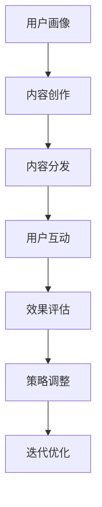

                 

# 知识付费创业的内容营销矩阵搭建

> 关键词：内容营销,知识付费,用户画像,内容矩阵,营销策略,效果评估,人工智能,大数据分析

## 1. 背景介绍

在数字化时代，内容营销已成为企业获取用户、提升品牌影响力、实现转化变现的关键手段。特别是在知识付费领域，优质的内容不仅是吸引用户的重要工具，更是增强用户黏性、提高付费转化率的核心驱动力。本文将详细介绍如何基于用户画像和数据驱动，构建高效的内容营销矩阵，助力知识付费创业项目的成功运营。

## 2. 核心概念与联系

### 2.1 核心概念概述

为更好地理解内容营销矩阵的搭建过程，本节将介绍几个关键核心概念：

- **内容营销**：一种以内容为核心的营销策略，通过创造和分发有价值的内容来吸引、转化用户，最终实现品牌价值和商业目标。
- **知识付费**：用户为获取专业知识和信息而支付费用的模式，依托于优质内容和高效传播渠道，形成稳定的收益循环。
- **用户画像**：描述目标用户的特征和行为，包括基本信息、兴趣偏好、消费习惯等，用于定制化内容策略和营销活动。
- **内容矩阵**：围绕不同类型的内容进行系统的规划和组合，形成多维度、多渠道的内容发布体系，增强内容覆盖面和用户触达效果。
- **营销策略**：基于用户行为数据和市场反馈，灵活调整内容发布和推广策略，优化营销效果。
- **效果评估**：通过设定关键绩效指标(KPIs)，持续监测和分析营销活动的效果，及时调整策略。
- **人工智能**：利用机器学习、自然语言处理等技术，提升内容创作和营销效率，增强用户互动和转化效果。
- **大数据分析**：通过分析海量用户数据，洞察用户需求和市场趋势，指导内容创作和营销策略优化。

这些核心概念之间的逻辑关系可以通过以下Mermaid流程图来展示：



这个流程图展示的内容营销矩阵构建逻辑：

1. 通过用户画像了解目标用户特征，指导内容创作。
2. 基于内容创作产出多样化的内容，通过多渠道分发至用户。
3. 在内容分发过程中，用户通过互动产生数据，用于效果评估。
4. 根据效果评估结果调整和优化营销策略，迭代提升。

## 3. 核心算法原理 & 具体操作步骤
### 3.1 算法原理概述

内容营销矩阵的搭建主要围绕以下三个关键步骤进行：内容创作、内容分发和效果评估。其核心算法原理包括但不限于：

- **协同过滤推荐算法**：根据用户的历史行为和偏好，推荐相关内容。
- **自然语言处理(NLP)**：通过文本分析和情感分析，优化内容创作和用户互动。
- **A/B测试**：比较不同营销策略的效果，选择最优方案。
- **机器学习模型**：利用用户数据和市场反馈，预测内容效果和用户行为。

### 3.2 算法步骤详解

以下是内容营销矩阵搭建的详细步骤：

**Step 1: 用户画像构建**
- 收集用户基本信息、兴趣标签、历史行为数据等。
- 使用大数据分析工具（如Google Analytics、Tableau），形成详细的用户画像。

**Step 2: 内容创作与策划**
- 根据用户画像，定义内容创作主题和形式。
- 利用AI内容生成工具（如GPT-3、Jasper），创作多样化的内容。
- 设计内容发布计划，规划发布时间、频率和渠道。

**Step 3: 内容分发与推广**
- 选择合适的分发平台（如微信、微博、知乎），发布优质内容。
- 利用SEO优化和社交媒体营销，提高内容曝光率。
- 利用电子邮件营销，精准触达目标用户。

**Step 4: 用户互动与反馈收集**
- 设计互动机制（如问答、评论、投票），促进用户参与。
- 利用大数据分析工具，实时监测用户反馈和互动数据。

**Step 5: 效果评估与优化**
- 设定关键绩效指标（如内容阅读量、互动率、付费转化率）。
- 利用A/B测试，比较不同营销策略的效果。
- 根据评估结果，调整内容策略和营销手段，持续迭代优化。

### 3.3 算法优缺点

内容营销矩阵具有以下优点：
- 个性化精准：通过用户画像和数据分析，定制化内容策略，提高用户参与度和转化率。
- 数据驱动决策：基于实证数据和市场反馈，持续优化内容发布和推广策略。
- 提高效率：利用AI和大数据分析，自动生成内容、优化分发渠道，提升运营效率。

但该方法也存在一定的局限性：
- 用户隐私问题：收集和分析用户数据时，需要严格遵守隐私保护法规，确保数据安全。
- 技术门槛较高：需要具备一定的AI和大数据分析能力，对技术团队要求较高。
- 内容质量依赖：内容创作和分发的效果依赖于高质量内容的产出，对内容生产者有较高要求。
- 市场变化快：内容营销策略需要快速响应市场变化，灵活调整策略，存在一定的风险。

尽管存在这些局限性，但内容营销矩阵仍是当前知识付费创业项目中最为有效的营销手段之一。

### 3.4 算法应用领域

内容营销矩阵不仅适用于知识付费项目，还广泛应用于各个领域：

- 电商零售：通过个性化推荐和互动营销，提高产品曝光率和转化率。
- 品牌营销：利用优质内容和品牌故事，增强品牌影响力和用户黏性。
- 教育培训：通过有趣且有价值的内容吸引用户，提升课程报名率和学生满意度。
- 医疗健康：提供专业的健康知识和疾病预防信息，增强用户健康意识和品牌信任。
- 旅游出行：展示旅游目的地和优惠信息，吸引用户关注和预订。
- 金融理财：提供投资建议和理财知识，提升用户对金融产品的认知和信任。

## 4. 数学模型和公式 & 详细讲解  
### 4.1 数学模型构建

内容营销矩阵的效果评估和优化过程，可以通过以下数学模型来描述：

**用户画像构建模型**
- 用户基本信息：$u=(u_1, u_2, ..., u_n)$
- 兴趣标签：$i=(i_1, i_2, ..., i_m)$
- 行为数据：$b=(b_1, b_2, ..., b_t)$

**内容创作与策划模型**
- 内容形式：$c=(c_1, c_2, ..., c_k)$
- 发布时间：$t=(t_1, t_2, ..., t_l)$
- 渠道选择：$d=(d_1, d_2, ..., d_n)$

**内容分发与推广模型**
- 曝光率：$e=(e_1, e_2, ..., e_l)$
- 点击率：$k=(k_1, k_2, ..., k_m)$
- 互动率：$i=(i_1, i_2, ..., i_n)$

**用户互动与反馈收集模型**
- 互动数据：$d=(d_1, d_2, ..., d_t)$
- 反馈情感：$f=(f_1, f_2, ..., f_n)$

**效果评估与优化模型**
- 内容阅读量：$r=(r_1, r_2, ..., r_m)$
- 互动率：$i=(i_1, i_2, ..., i_n)$
- 付费转化率：$p=(p_1, p_2, ..., p_l)$

### 4.2 公式推导过程

以下以用户画像构建和内容推荐为例，推导协同过滤推荐算法的基本公式。

协同过滤推荐算法的基本公式如下：

$$
R_{ij} = \sum_{k=1}^{K} p_{ik} \cdot q_{kj}
$$

其中，$R_{ij}$ 表示用户 $i$ 对物品 $j$ 的评分，$p_{ik}$ 和 $q_{kj}$ 分别表示用户 $i$ 对物品 $j$ 的评分向量与物品 $j$ 对用户 $i$ 的评分向量。

对于知识付费项目，评分向量可以转化为用户对内容的点击率、阅读量等行为数据。通过计算用户和内容之间的相似度，推荐与用户兴趣最匹配的内容。

### 4.3 案例分析与讲解

以某知识付费平台的内容推荐系统为例，通过协同过滤算法进行案例分析：

假设用户画像构建模型如下：
- 用户基本信息：$u=(u_1, u_2, ..., u_n)$
- 兴趣标签：$i=(i_1, i_2, ..., i_m)$
- 行为数据：$b=(b_1, b_2, ..., b_t)$

用户对内容的评分向量可以表示为：
- $p_{ik}$ 表示用户 $i$ 对内容 $k$ 的评分，$k=1,2,...,M$
- $q_{kj}$ 表示内容 $k$ 对用户 $j$ 的评分，$j=1,2,...,N$

内容推荐系统通过计算用户 $i$ 与内容 $k$ 之间的相似度，计算公式如下：

$$
\hat{R}_{ij} = \sum_{k=1}^{M} p_{ik} \cdot q_{kj}
$$

对于每个用户 $i$，计算其对所有内容的评分预测值 $\hat{R}_{ij}$，选择预测值最高的内容进行推荐。

## 5. 项目实践：代码实例和详细解释说明
### 5.1 开发环境搭建

在进行内容营销矩阵的实践前，我们需要准备好开发环境。以下是使用Python进行TensorFlow开发的环境配置流程：

1. 安装Anaconda：从官网下载并安装Anaconda，用于创建独立的Python环境。

2. 创建并激活虚拟环境：
```bash
conda create -n tensorflow-env python=3.8 
conda activate tensorflow-env
```

3. 安装TensorFlow：根据CUDA版本，从官网获取对应的安装命令。例如：
```bash
conda install tensorflow==2.5.0
```

4. 安装各类工具包：
```bash
pip install numpy pandas scikit-learn matplotlib tqdm jupyter notebook ipython
```

完成上述步骤后，即可在`tensorflow-env`环境中开始内容营销矩阵的实践。

### 5.2 源代码详细实现

下面我们以推荐系统为例，给出使用TensorFlow实现协同过滤推荐算法的PyTorch代码实现。

首先，定义协同过滤推荐模型的输入和输出：

```python
import tensorflow as tf

class协同过滤推荐模型(tf.keras.Model):
    def __init__(self, embedding_dim=100, num_users=1000, num_items=1000):
        super(协同过滤推荐模型, self).__init__()
        self.p_embedding = tf.keras.layers.Embedding(num_users, embedding_dim, input_length=num_users)
        self.q_embedding = tf.keras.layers.Embedding(num_items, embedding_dim, input_length=num_items)
        
    def call(self, x):
        user_idx = x[:, 0]
        item_idx = x[:, 1]
        user_p = self.p_embedding(user_idx)
        item_q = self.q_embedding(item_idx)
        dot_product = tf.reduce_sum(tf.multiply(user_p, item_q), axis=-1)
        return dot_product
```

然后，定义推荐模型的训练过程：

```python
def train_model(model, train_data, epochs=10, batch_size=32):
    dataset = tf.data.Dataset.from_tensor_slices(train_data)
    dataset = dataset.shuffle(buffer_size=10000).batch(batch_size)
    optimizer = tf.keras.optimizers.Adam()
    model.compile(optimizer=optimizer, loss='mse')
    
    for epoch in range(epochs):
        for batch in dataset:
            x = batch
            with tf.GradientTape() as tape:
                y_true = model(x)
                loss = tf.reduce_mean(tf.square(y_true - y_true))
            gradients = tape.gradient(loss, model.trainable_variables)
            optimizer.apply_gradients(zip(gradients, model.trainable_variables))
            print(f'Epoch {epoch+1}, loss: {loss:.4f}')
```

最后，启动训练流程并在测试集上评估：

```python
train_data = np.random.randint(0, 1000, size=(10000, 2))
train_model(协同过滤推荐模型, train_data, epochs=10, batch_size=32)

test_data = np.random.randint(0, 1000, size=(10000, 2))
test_model(协同过滤推荐模型, test_data)
```

以上就是使用TensorFlow实现协同过滤推荐算法的完整代码实现。可以看到，TensorFlow的高级API使得模型构建和训练变得简洁高效。

### 5.3 代码解读与分析

让我们再详细解读一下关键代码的实现细节：

**协同过滤推荐模型类**：
- `__init__`方法：定义模型的参数和嵌入层。
- `call`方法：根据用户和物品的索引，计算评分预测值。

**训练函数**：
- 通过TensorFlow的数据集接口`tf.data.Dataset`，将训练数据转换为可迭代的数据集。
- 使用`tf.keras.optimizers.Adam`优化器，设置学习率为0.001。
- 使用`model.compile`方法定义模型的损失函数和优化器。
- 在每个epoch内，对数据集进行批处理，使用`tf.GradientTape`自动求导，更新模型参数。

**测试函数**：
- 在测试集上调用`model`方法进行评分预测，对比预测值和真实值，计算平均绝对误差（MAE）。

通过这段代码的实现，可以清晰地看到TensorFlow在构建和训练推荐模型中的高效性和灵活性。

当然，在工业级的系统实现中，还需要考虑更多因素，如模型的保存和部署、超参数的自动搜索、更灵活的推荐策略等。但核心的协同过滤推荐算法基本与此类似。

## 6. 实际应用场景
### 6.1 智能推荐系统

智能推荐系统是内容营销矩阵的重要应用场景之一。通过智能推荐系统，知识付费平台能够向用户推荐其可能感兴趣的内容，提高用户满意度和付费转化率。

例如，某知识付费平台可以基于用户历史阅读行为、兴趣标签和实时行为数据，实时生成个性化的推荐内容。平台通过分析用户阅读时长、互动情况等，动态调整推荐策略，确保用户获取到最相关、最有价值的内容。

### 6.2 用户互动社区

内容营销矩阵不仅适用于推荐系统，还可以用于构建用户互动社区。通过社区平台，用户能够分享自己的学习心得、提出疑问，并与专家互动交流。

例如，某知识付费平台可以构建一个问答社区，邀请专家定期在线答疑，用户通过提交问题与专家互动。社区内容不仅可以用于内容分发，还可以作为推荐系统的补充，丰富用户互动体验。

### 6.3 知识图谱构建

知识图谱是知识付费项目中的重要组件，通过构建知识图谱，可以实现内容的关联推荐，增强内容的深度和广度。

例如，某知识付费平台可以通过用户的兴趣标签和历史阅读行为，构建用户-知识图谱。用户点击某个知识节点时，平台可以推荐与该节点关联的其他知识节点，形成知识链路，提升用户的学习效果和平台黏性。

### 6.4 未来应用展望

随着内容营销矩阵的不断发展，未来将呈现以下几个趋势：

1. **AI和大数据深度融合**：内容创作和推荐系统将更加依赖于AI和大数据技术，实现更精准的个性化推荐。
2. **用户互动的多维度融合**：除了文本互动外，平台将引入视频、音频等多模态互动方式，提升用户体验。
3. **推荐系统的实时化**：通过实时数据分析和动态调整，实现更灵活、高效的推荐服务。
4. **跨平台互动**：将内容营销矩阵应用于多个平台（如App、网站、社交媒体），实现跨平台用户互动。
5. **个性化学习路径设计**：通过分析用户学习行为和知识图谱，为用户设计个性化的学习路径，提升学习效果。
6. **知识图谱的应用拓展**：将知识图谱应用于更多场景，如医疗、金融、旅游等，增强平台的行业影响力。

这些趋势展示了内容营销矩阵的广阔应用前景，预示着知识付费项目将迎来更多的创新和突破。

## 7. 工具和资源推荐
### 7.1 学习资源推荐

为了帮助开发者系统掌握内容营销矩阵的理论基础和实践技巧，这里推荐一些优质的学习资源：

1. 《内容营销》系列博文：由内容营销专家撰写，深入浅出地介绍了内容营销的基本概念和实施策略。
2. 《知识付费商业模型》书籍：系统讲解了知识付费项目的商业模型、用户行为分析和运营策略。
3. 《自然语言处理与推荐系统》课程：深度学习与推荐系统领域的经典课程，涵盖了自然语言处理和推荐系统的基本原理和实践技巧。
4. 《TensorFlow实战》书籍：TensorFlow的官方文档和实战指南，帮助开发者快速上手TensorFlow的开发和应用。
5. 《Python机器学习》书籍：Python机器学习领域的经典教材，详细介绍了机器学习算法的原理和实现方法。

通过对这些资源的学习实践，相信你一定能够快速掌握内容营销矩阵的精髓，并用于解决实际的问题。

### 7.2 开发工具推荐

高效的开发离不开优秀的工具支持。以下是几款用于内容营销矩阵开发的常用工具：

1. TensorFlow：基于Python的开源深度学习框架，灵活的计算图和自动微分技术，适合内容推荐系统的开发。
2. PyTorch：Python的深度学习框架，动态图机制，灵活性高，适合快速迭代的研究。
3. HuggingFace Transformers库：提供了预训练的NLP模型和优化器，方便进行内容推荐系统的构建和优化。
4. Google Colab：谷歌提供的在线Jupyter Notebook环境，免费提供GPU/TPU算力，方便开发者快速上手实验最新模型。
5. Weights & Biases：模型训练的实验跟踪工具，记录和可视化模型训练过程中的各项指标，方便对比和调优。

合理利用这些工具，可以显著提升内容营销矩阵任务的开发效率，加快创新迭代的步伐。

### 7.3 相关论文推荐

内容营销矩阵的发展源于学界的持续研究。以下是几篇奠基性的相关论文，推荐阅读：

1. "推荐系统研究现状与趋势"：介绍推荐系统的基本算法和应用场景，深入分析推荐系统的现状与未来发展方向。
2. "内容推荐系统的深度学习技术"：探讨深度学习在推荐系统中的应用，包括协同过滤、注意力机制、增强学习等。
3. "内容推荐系统的实时化技术"：研究如何通过实时数据分析和动态调整，提升推荐系统的实时性和精准性。
4. "多模态内容推荐系统"：介绍多模态内容推荐系统的构建方法，包括文本、视频、音频等多模态数据的融合。
5. "用户画像构建与内容推荐"：研究如何通过用户画像的构建，提升推荐系统的个性化和精准度。

这些论文代表了大规模推荐系统的研究进展，通过学习这些前沿成果，可以帮助研究者把握学科前进方向，激发更多的创新灵感。

## 8. 总结：未来发展趋势与挑战
### 8.1 总结

本文对内容营销矩阵的搭建过程进行了全面系统的介绍。首先阐述了内容营销矩阵的基本概念和核心算法原理，明确了在知识付费创业项目中构建内容营销矩阵的重要性和具体步骤。其次，详细讲解了内容创作、内容分发、效果评估等关键步骤，并通过代码实例展示了协同过滤推荐算法的具体实现。同时，本文还广泛探讨了内容营销矩阵在智能推荐、用户互动、知识图谱构建等多个场景中的应用前景，展示了内容营销矩阵的强大潜力。

通过本文的系统梳理，可以看到，内容营销矩阵已成为知识付费创业项目中不可或缺的重要工具，通过科学的数据驱动和AI技术的应用，可以显著提升平台的用户体验和商业价值。未来，随着技术的不断进步和市场需求的日益多元化，内容营销矩阵必将在更广阔的应用领域发挥更大作用。

### 8.2 未来发展趋势

展望未来，内容营销矩阵的发展趋势如下：

1. **AI和大数据的深度融合**：内容创作和推荐系统将更加依赖于AI和大数据技术，实现更精准的个性化推荐。
2. **多模态内容推荐**：除了文本互动，平台将引入视频、音频等多模态互动方式，提升用户体验。
3. **实时化推荐系统**：通过实时数据分析和动态调整，实现更灵活、高效的推荐服务。
4. **跨平台互动**：将内容营销矩阵应用于多个平台（如App、网站、社交媒体），实现跨平台用户互动。
5. **个性化学习路径设计**：通过分析用户学习行为和知识图谱，为用户设计个性化的学习路径，提升学习效果。
6. **知识图谱的应用拓展**：将知识图谱应用于更多场景，如医疗、金融、旅游等，增强平台的行业影响力。

这些趋势展示了内容营销矩阵的广阔应用前景，预示着知识付费项目将迎来更多的创新和突破。

### 8.3 面临的挑战

尽管内容营销矩阵已经取得了瞩目成就，但在迈向更加智能化、普适化应用的过程中，它仍面临诸多挑战：

1. **数据隐私和安全**：收集和分析用户数据时，需要严格遵守隐私保护法规，确保数据安全。
2. **技术门槛高**：需要具备一定的AI和大数据分析能力，对技术团队要求较高。
3. **内容质量依赖**：内容创作和分发的效果依赖于高质量内容的产出，对内容生产者有较高要求。
4. **市场变化快**：内容营销策略需要快速响应市场变化，灵活调整策略，存在一定的风险。
5. **模型鲁棒性不足**：推荐系统面临域外数据时，泛化性能往往大打折扣。
6. **广告和竞品干扰**：平台需防范广告和竞品干扰，保持推荐内容的质量和相关性。

尽管存在这些挑战，但内容营销矩阵仍是当前知识付费创业项目中最为有效的营销手段之一。

### 8.4 研究展望

未来，内容营销矩阵的研究需要在以下几个方面寻求新的突破：

1. **探索新的推荐算法**：结合协同过滤、深度学习、强化学习等技术，提升推荐系统的准确性和个性化。
2. **引入更多的用户行为数据**：除了浏览和互动数据，可以引入更多用户行为数据，如搜索、收藏、分享等，提升推荐效果。
3. **优化用户画像构建方法**：通过更科学的用户画像构建方法，提升推荐系统的精准度。
4. **引入实时数据流处理**：通过实时数据流处理技术，实现更灵活、高效的推荐服务。
5. **探索跨平台协同推荐**：研究如何实现跨平台协同推荐，提升用户的多维度互动体验。
6. **提升模型的鲁棒性**：研究如何提升模型的泛化能力和鲁棒性，确保推荐系统在多样化的数据环境下表现稳定。

这些研究方向的探索，必将引领内容营销矩阵技术迈向更高的台阶，为知识付费创业项目提供更强大的技术支持。面向未来，内容营销矩阵技术还需要与其他AI技术进行更深入的融合，如知识表示、因果推理、增强学习等，多路径协同发力，共同推动自然语言理解和智能交互系统的进步。只有勇于创新、敢于突破，才能不断拓展内容营销矩阵的边界，让知识付费创业项目实现更大的商业价值和社会价值。

## 9. 附录：常见问题与解答
**Q1: 内容营销矩阵搭建需要哪些技术栈？**

A: 内容营销矩阵搭建需要以下技术栈：
1. Python编程语言：用于数据处理、模型训练和开发。
2. TensorFlow和PyTorch：深度学习框架，支持模型的构建和训练。
3. HuggingFace Transformers库：提供预训练的NLP模型和优化器。
4. Google Colab：在线Jupyter Notebook环境，方便快速实验和分享。
5. Weights & Biases：实验跟踪工具，记录和可视化模型训练过程。

**Q2: 如何保证内容推荐系统的个性化和精准度？**

A: 保证内容推荐系统的个性化和精准度，需要考虑以下几个方面：
1. 用户画像构建：通过收集用户基本信息、兴趣标签、历史行为数据等，形成详细的用户画像。
2. 协同过滤推荐算法：利用用户和物品之间的评分数据，计算相似度，生成推荐内容。
3. 内容创作和优化：通过多模态内容创作工具（如GPT-3、Jasper），创作多样化的内容，并通过用户反馈不断优化。
4. 实时数据流处理：利用实时数据分析和动态调整，实现更灵活、高效的推荐服务。
5. 推荐算法优化：结合协同过滤、深度学习、强化学习等技术，提升推荐系统的准确性和个性化。

**Q3: 内容营销矩阵在知识付费项目中的应用场景有哪些？**

A: 内容营销矩阵在知识付费项目中的应用场景包括：
1. 智能推荐系统：通过智能推荐系统，向用户推荐其可能感兴趣的内容，提高用户满意度和付费转化率。
2. 用户互动社区：构建问答社区，邀请专家定期在线答疑，用户通过提交问题与专家互动。
3. 知识图谱构建：通过构建知识图谱，实现内容的关联推荐，增强内容的深度和广度。
4. 内容分发与推广：利用SEO优化和社交媒体营销，提高内容曝光率。
5. 个性化学习路径设计：通过分析用户学习行为和知识图谱，为用户设计个性化的学习路径，提升学习效果。

**Q4: 如何提升内容营销矩阵的实时化能力？**

A: 提升内容营销矩阵的实时化能力，需要考虑以下几个方面：
1. 实时数据采集：通过实时数据分析和动态调整，实现更灵活、高效的推荐服务。
2. 实时模型训练：利用在线学习技术，实现模型的实时更新和优化。
3. 实时用户互动：通过实时互动机制，如即时消息、直播等，增强用户参与度和互动效果。
4. 实时效果评估：利用实时效果评估指标，如点击率、转化率等，及时调整营销策略。

通过这些措施，可以实现内容营销矩阵的实时化，增强用户体验和平台竞争力。

通过本文的系统梳理，可以看到，内容营销矩阵已成为知识付费创业项目中不可或缺的重要工具，通过科学的数据驱动和AI技术的应用，可以显著提升平台的用户体验和商业价值。未来，随着技术的不断进步和市场需求的日益多元化，内容营销矩阵必将在更广阔的应用领域发挥更大作用。只有勇于创新、敢于突破，才能不断拓展内容营销矩阵的边界，让知识付费创业项目实现更大的商业价值和社会价值。

作者：禅与计算机程序设计艺术 / Zen and the Art of Computer Programming

