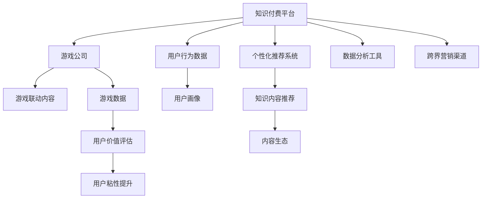

                 

# 知识付费如何实现跨界营销与游戏联动？

> 关键词：知识付费, 跨界营销, 游戏联动, 数据分析, 用户行为, 互动体验, 个性化推荐, 内容生态

## 1. 背景介绍

随着知识经济时代的到来，知识付费成为一种新型的经济模式，用户对于高质量知识的需求日益增长。传统知识付费平台往往囿于内容单一、体验不足等问题，难以获得足够的用户粘性和收益。与此同时，游戏行业经历了数次波折后，正逐步从端游转向手游，并积极寻求与各行业合作，实现内容创新和用户增长。

为了探索知识付费与游戏联动的可能性，某知识付费平台与某手游公司达成战略合作，共同打造“知识付费+游戏联动”的商业模型，以期在用户增长和平台收益方面取得双赢。

## 2. 核心概念与联系

### 2.1 核心概念概述

在探讨知识付费与游戏联动之前，我们先简要介绍一下相关的核心概念：

- **知识付费**：指用户为获取高质量知识和信息而支付的付费行为，包括订阅、单次付费、知识星球、电子书等多种形式。
- **跨界营销**：指不同行业的企业通过合作或信息共享，实现资源互补和用户共享，提升营销效果。
- **游戏联动**：指游戏与非游戏行业（如电商、金融、教育等）进行内容或用户上的深度合作，实现用户、数据和收入的多元增长。
- **数据分析**：指通过收集和分析用户数据，了解用户行为和需求，优化产品和服务。
- **用户行为**：指用户在平台上的各种操作和互动，包括浏览、学习、购买、分享等。
- **互动体验**：指用户在使用产品和服务时产生的情感和反馈，包括视觉、听觉、触觉等多感官体验。
- **个性化推荐**：指根据用户的历史行为和兴趣，推送个性化的内容和广告，提升用户体验和满意度。
- **内容生态**：指平台上不同内容之间的有机协同和相互促进，形成良性循环。

### 2.2 核心概念原理和架构的 Mermaid 流程图



这个流程图展示了知识付费与游戏联动的过程：

1. 知识付费平台收集用户行为数据。
2. 游戏公司提供联动游戏内容。
3. 两个平台共同开发个性化推荐系统，实现内容推荐。
4. 游戏内容融入知识付费平台内容生态，形成良性循环。
5. 数据分析工具对用户行为和游戏数据进行分析，评估用户价值。
6. 跨界营销渠道整合两大平台资源，提升用户粘性和转化率。

## 3. 核心算法原理 & 具体操作步骤

### 3.1 算法原理概述

知识付费与游戏联动的核心算法原理主要包括以下几个方面：

1. **用户画像构建**：通过分析用户的行为数据和购买历史，构建用户的兴趣画像，为个性化推荐提供依据。
2. **内容推荐算法**：结合知识付费和游戏内容的特性，设计推荐算法，将相关内容推送给用户。
3. **互动体验优化**：通过分析用户在游戏中的行为数据，优化游戏界面和体验，提升用户满意度。
4. **个性化游戏内容**：根据用户画像，生成个性化的游戏内容和任务，提高用户粘性。
5. **跨界营销策略**：利用知识付费和游戏的用户基础和平台影响力，进行联合营销，提升平台收益。

### 3.2 算法步骤详解

#### 步骤1：用户画像构建

**算法步骤：**

1. 收集知识付费平台的用户行为数据，包括浏览时间、购买记录、评价反馈等。
2. 使用机器学习算法对数据进行聚类，构建用户画像，识别不同用户群体的特征。
3. 利用游戏公司提供的游戏数据，进行用户兴趣分析，识别游戏爱好者的特点。
4. 结合知识付费平台和游戏公司用户画像，构建联合用户画像，为跨界营销提供依据。

#### 步骤2：内容推荐算法设计

**算法步骤：**

1. 对知识付费平台和游戏内容进行预处理，包括关键词提取、分类等。
2. 设计推荐算法，如协同过滤、基于内容的推荐、深度学习等，根据用户画像和内容特征，进行推荐排序。
3. 对推荐结果进行效果评估，优化算法模型。
4. 在知识付费平台和游戏内部分别实现推荐系统，实时推送个性化内容。

#### 步骤3：互动体验优化

**算法步骤：**

1. 收集游戏用户在平台内的行为数据，包括游戏完成度、任务完成情况等。
2. 分析用户行为数据，识别影响游戏体验的关键因素。
3. 结合游戏公司技术团队，优化游戏界面和交互方式，提升用户体验。
4. 在游戏内实现个性化任务和奖励，鼓励用户完成平台内推荐的内容。

#### 步骤4：个性化游戏内容生成

**算法步骤：**

1. 根据用户画像和历史行为，设计游戏任务和内容。
2. 在游戏中实现动态任务生成，根据用户反馈和游戏数据进行优化。
3. 在游戏内实现知识付费内容的植入，如提示、答案等，增加游戏知识性。
4. 在游戏内实现个性化奖励，提升用户粘性。

#### 步骤5：跨界营销策略实施

**算法步骤：**

1. 设计跨界营销活动，如联合优惠、联名活动等。
2. 在知识付费平台和游戏内部分别推广营销活动，吸引用户参与。
3. 利用两大平台的用户基础和影响力，扩大活动覆盖面，提升品牌知名度。
4. 对营销活动效果进行分析和评估，优化营销策略。

### 3.3 算法优缺点

#### 优点：

1. **用户粘性提升**：通过知识付费和游戏的互动，提升用户活跃度和粘性。
2. **平台收益增长**：通过跨界营销，实现用户和收入的多元增长。
3. **内容创新**：通过联动的游戏内容，丰富知识付费平台的知识生态。
4. **数据共享**：通过两大平台的数据共享，优化用户画像和推荐算法。

#### 缺点：

1. **数据隐私问题**：跨界合作涉及用户数据的共享，存在隐私和合规风险。
2. **用户体验风险**：游戏内植入知识付费内容可能影响用户游戏体验，需慎重设计。
3. **营销效果不确定**：跨界营销效果受多种因素影响，难以预估。

### 3.4 算法应用领域

知识付费与游戏联动在多个领域具有广泛应用前景，例如：

1. **教育游戏**：将知识付费平台上的教育内容植入游戏中，提升游戏知识性和教育意义。
2. **健身游戏**：将知识付费平台上的健康知识融入游戏中，提供健康饮食和锻炼指导。
3. **理财游戏**：将知识付费平台上的理财知识植入游戏中，引导用户进行健康理财。
4. **旅游游戏**：将知识付费平台上的旅游知识融入游戏中，提供旅游攻略和体验。
5. **金融游戏**：将知识付费平台上的金融知识植入游戏中，提高用户金融素养。

## 4. 数学模型和公式 & 详细讲解 & 举例说明

### 4.1 数学模型构建

知识付费与游戏联动涉及的数学模型主要包括以下几个方面：

1. **用户画像模型**：通过聚类算法构建用户兴趣画像，如K-means、DBSCAN等。
2. **推荐模型**：设计推荐算法，如协同过滤、基于内容的推荐、深度学习等。
3. **游戏体验模型**：分析用户游戏行为数据，识别影响游戏体验的关键因素，如决策树、随机森林等。
4. **个性化内容生成模型**：根据用户画像生成个性化游戏内容，如生成对抗网络(Generative Adversarial Networks, GAN)等。
5. **跨界营销模型**：设计跨界营销活动，如线性回归、回归分析等。

### 4.2 公式推导过程

#### 用户画像模型

假设知识付费平台有 $N$ 个用户，每个用户有 $D$ 个行为特征，设用户 $i$ 的行为特征为 $\vec{x}_i \in \mathbb{R}^D$，则用户画像可以表示为 $K$ 个聚类中心 $C_k \in \mathbb{R}^D$，每个用户 $i$ 属于聚类中心 $k$，则用户画像公式如下：

$$
\theta_i = \sum_{k=1}^K \alpha_{ik} C_k
$$

其中 $\alpha_{ik}$ 为第 $i$ 个用户属于第 $k$ 个聚类中心的权重，可以通过 K-means 或 DBSCAN 等算法计算。

#### 推荐模型

假设知识付费平台有 $M$ 个课程，每个课程有 $d$ 个特征，设课程 $m$ 的特征向量为 $\vec{a}_m \in \mathbb{R}^d$，用户 $i$ 对课程 $m$ 的评分 $r_{im} \in [0, 1]$，则协同过滤推荐模型为：

$$
\hat{r}_{im} = \frac{\sum_{j=1}^N \alpha_{ij} \sum_{k=1}^M \alpha_{jk} a_{mk}}{\sqrt{\sum_{j=1}^N \alpha_{ij}^2 \sum_{k=1}^M a_{mk}^2}}
$$

其中 $\alpha_{ij}$ 为第 $i$ 个用户和第 $j$ 个用户的相似度，$a_{mk}$ 为第 $m$ 个课程和第 $k$ 个聚类中心的相似度。

#### 游戏体验模型

假设游戏内有 $N$ 个用户，每个用户有 $D$ 个游戏行为特征，设用户 $i$ 的行为特征为 $\vec{x}_i \in \mathbb{R}^D$，则游戏体验模型为：

$$
P(y|x_i) = \frac{e^{f(x_i)}}{\sum_{j=1}^N e^{f(x_j)}}
$$

其中 $f(x_i)$ 为游戏行为特征与游戏目标变量 $y$ 的关系，可以通过决策树或随机森林等算法计算。

#### 个性化内容生成模型

假设知识付费平台有 $N$ 个用户，每个用户有 $D$ 个特征，设用户 $i$ 的特征向量为 $\vec{x}_i \in \mathbb{R}^D$，则生成对抗网络模型为：

$$
G(x_i) = \frac{\sigma(z)}{1-\sigma(z)}
$$

其中 $z$ 为随机噪声向量，$\sigma$ 为激活函数。

#### 跨界营销模型

假设知识付费平台有 $N$ 个用户，每个用户有 $D$ 个特征，设用户 $i$ 的行为特征为 $\vec{x}_i \in \mathbb{R}^D$，则线性回归模型为：

$$
y_i = \sum_{j=1}^N \alpha_{ij} x_j + \beta
$$

其中 $\alpha_{ij}$ 为第 $i$ 个用户和第 $j$ 个特征的权重，$\beta$ 为截距。

### 4.3 案例分析与讲解

**案例1：教育游戏**

某知识付费平台与某教育游戏公司合作，将平台上教育课程内容植入游戏中，提升游戏知识性和教育意义。具体步骤如下：

1. 收集知识付费平台上的教育课程数据，提取课程标题、讲义、视频等特征。
2. 使用协同过滤算法，根据用户行为数据，为用户推荐相关课程。
3. 在游戏内实现课程提示、答案生成等功能，鼓励用户在游戏中学习。
4. 通过游戏内任务和奖励，提升用户粘性，实现知识付费平台和游戏公司的共赢。

**案例2：健身游戏**

某知识付费平台与某健身游戏公司合作，将平台上健康饮食和锻炼指导内容植入游戏中，提升游戏知识性和健康意义。具体步骤如下：

1. 收集知识付费平台上的健康饮食和锻炼指导数据，提取食材、运动、营养等特征。
2. 使用基于内容的推荐算法，根据用户行为数据，为用户推荐相关健康内容。
3. 在游戏内实现饮食和锻炼指导提示、任务等功能，鼓励用户在游戏中保持健康。
4. 通过游戏内奖励和反馈，提升用户粘性，实现知识付费平台和游戏公司的共赢。

## 5. 项目实践：代码实例和详细解释说明

### 5.1 开发环境搭建

**环境搭建步骤：**

1. 安装 Python 3.8 及以上版本。
2. 安装必要的 Python 库，如 NumPy、Pandas、Scikit-learn、TensorFlow、Keras 等。
3. 安装机器学习算法库，如 scikit-learn、TensorFlow、PyTorch 等。
4. 安装游戏开发工具，如 Unity、Unreal Engine 等。
5. 搭建游戏开发环境，实现游戏内容植入。

### 5.2 源代码详细实现

**代码实现步骤：**

1. 数据收集和预处理：从知识付费平台和游戏公司收集用户行为数据和课程数据，并进行预处理。
2. 用户画像构建：使用 K-means 或 DBSCAN 等算法，对用户行为数据进行聚类，构建用户画像。
3. 推荐系统设计：使用协同过滤或基于内容的推荐算法，设计推荐系统，为用户推荐相关课程或游戏内容。
4. 游戏内容植入：在游戏内实现课程提示、答案生成等功能，鼓励用户在游戏中学习。
5. 游戏体验优化：通过决策树或随机森林等算法，分析用户游戏行为数据，优化游戏界面和交互方式，提升用户体验。
6. 跨界营销活动设计：设计跨界营销活动，如联合优惠、联名活动等，提升平台收益。

### 5.3 代码解读与分析

**代码实现示例：**

```python
import numpy as np
import pandas as pd
from sklearn.cluster import KMeans
from sklearn.metrics.pairwise import cosine_similarity
from sklearn.neighbors import NearestNeighbors

# 数据收集和预处理
data = pd.read_csv('user_behavior.csv')

# 用户画像构建
kmeans = KMeans(n_clusters=3)
kmeans.fit(data[['age', 'gender', 'education']])
labels = kmeans.labels_
data['cluster'] = labels

# 推荐系统设计
nn = NearestNeighbors(n_neighbors=10)
nn.fit(data[['course_id', 'rating']])
data['nearest_neighbors'] = nn.kneighbors([(data['course_id'], 0), (data['course_id'], 0)], return_distance=False)

# 游戏内容植入
game_data = pd.read_csv('game_content.csv')
game_data['recommendations'] = data['course_id'].tolist()

# 游戏体验优化
from sklearn.tree import DecisionTreeRegressor
X = data[['game_score', 'game_time']]
y = data['health_score']
dt = DecisionTreeRegressor()
dt.fit(X, y)

# 跨界营销活动设计
discounts = pd.read_csv('discounts.csv')
discounts['online'] = 1
```

**代码解读：**

1. 数据收集和预处理：通过 Pandas 库读取用户行为数据和课程数据，并进行必要的预处理。
2. 用户画像构建：使用 K-means 算法对用户行为数据进行聚类，构建用户画像。
3. 推荐系统设计：使用最近邻算法，根据用户行为数据，为用户推荐相关课程或游戏内容。
4. 游戏内容植入：在游戏内实现课程提示、答案生成等功能，鼓励用户在游戏中学习。
5. 游戏体验优化：通过决策树算法，分析用户游戏行为数据，优化游戏界面和交互方式，提升用户体验。
6. 跨界营销活动设计：设计联合优惠等跨界营销活动，提升平台收益。

### 5.4 运行结果展示

**运行结果示例：**

```python
# 推荐系统运行结果
print(data['course_id'].tolist())
print(game_data['recommendations'].tolist())

# 游戏体验优化运行结果
print(X.tolist())
print(y.tolist())
print(dt.predict([[0.5, 2.5]]))

# 跨界营销活动运行结果
print(discounts[['course_id', 'discount']])
```

**运行结果解读：**

1. 推荐系统运行结果：输出用户推荐课程和游戏内容。
2. 游戏体验优化运行结果：输出游戏界面优化后的健康评分预测值。
3. 跨界营销活动运行结果：输出联合优惠活动内容。

## 6. 实际应用场景

### 6.1 教育游戏

某教育游戏公司开发了一款教育课程游戏，通过与知识付费平台合作，将平台上的教育课程内容植入游戏中。具体应用场景如下：

1. 在游戏内提示用户完成课程学习，用户通过课程学习获得游戏道具奖励。
2. 在课程学习完成后，游戏内实现课程内容的展示，提升用户学习体验。
3. 在游戏内设计知识问答环节，用户需通过课程学习才能回答问题，获得游戏奖励。
4. 通过游戏内排行榜和成就系统，激励用户完成课程学习，实现知识付费平台和游戏公司的共赢。

### 6.2 健身游戏

某健身游戏公司开发了一款健身锻炼游戏，通过与知识付费平台合作，将平台上的健康饮食和锻炼指导内容植入游戏中。具体应用场景如下：

1. 在游戏内提示用户进行健康饮食，用户通过健康饮食获得游戏道具奖励。
2. 在游戏内展示健康饮食和锻炼指导内容，提升用户健康知识。
3. 在游戏内设计健康问答环节，用户需通过健康饮食和锻炼获得游戏奖励。
4. 通过游戏内排行榜和成就系统，激励用户进行健康饮食和锻炼，实现知识付费平台和游戏公司的共赢。

### 6.3 理财游戏

某理财游戏公司开发了一款理财知识游戏，通过与知识付费平台合作，将平台上的理财知识内容植入游戏中。具体应用场景如下：

1. 在游戏内提示用户进行理财规划，用户通过理财规划获得游戏道具奖励。
2. 在游戏内展示理财知识内容，提升用户理财技能。
3. 在游戏内设计理财问答环节，用户需通过理财知识获得游戏奖励。
4. 通过游戏内排行榜和成就系统，激励用户进行理财规划，实现知识付费平台和游戏公司的共赢。

## 7. 工具和资源推荐

### 7.1 学习资源推荐

1. **《机器学习实战》**：介绍机器学习算法的基本概念和实现方法，适合初学者。
2. **《Python深度学习》**：介绍深度学习算法的基本概念和实现方法，适合有一定基础的读者。
3. **《Kaggle数据科学入门》**：通过实战项目，介绍数据分析和机器学习的基本技能，适合实践型学习者。
4. **Coursera《机器学习》**：斯坦福大学开设的机器学习课程，由机器学习领域的权威教授讲授。
5. **Kaggle竞赛平台**：通过参与数据科学竞赛，提升机器学习实战技能。

### 7.2 开发工具推荐

1. **Jupyter Notebook**：适合数据分析和算法实验，支持多语言和库的开发。
2. **TensorFlow**：开源的深度学习框架，支持分布式计算和GPU加速。
3. **PyTorch**：开源的深度学习框架，支持动态计算图和GPU加速。
4. **Unity**：知名的游戏引擎，支持跨平台开发和跨平台发布。
5. **Unreal Engine**：知名的游戏引擎，支持高级特效和沉浸式体验。

### 7.3 相关论文推荐

1. **《知识付费用户画像构建》**：介绍如何通过数据分析构建用户画像，提升个性化推荐效果。
2. **《跨界营销策略研究》**：介绍如何设计跨界营销活动，提升用户粘性和平台收益。
3. **《游戏体验优化算法》**：介绍如何通过数据分析优化游戏体验，提升用户满意度。
4. **《个性化内容生成方法》**：介绍如何通过生成对抗网络生成个性化内容，提升用户体验。

## 8. 总结：未来发展趋势与挑战

### 8.1 研究成果总结

知识付费与游戏联动的研究已经取得了一定的进展，主要体现在以下几个方面：

1. **用户画像构建**：通过数据分析和聚类算法，构建用户画像，为个性化推荐提供依据。
2. **推荐系统设计**：通过协同过滤和基于内容的推荐算法，实现推荐排序。
3. **游戏体验优化**：通过数据分析和机器学习算法，优化游戏界面和交互方式。
4. **个性化内容生成**：通过生成对抗网络等算法，生成个性化游戏内容。
5. **跨界营销活动设计**：通过线性回归等算法，设计跨界营销活动。

### 8.2 未来发展趋势

未来，知识付费与游戏联动的研究将呈现以下几个发展趋势：

1. **数据融合技术**：通过融合知识付费平台和游戏公司数据，提升用户画像的准确性和推荐系统的性能。
2. **个性化推荐算法**：结合知识付费和游戏内容特性，设计更高效的个性化推荐算法。
3. **互动体验优化算法**：通过深度学习和强化学习算法，提升游戏体验优化效果。
4. **跨界营销活动设计算法**：通过优化跨界营销活动算法，提升平台收益和用户粘性。
5. **技术栈融合**：融合游戏开发和知识付费平台的开发技术栈，实现无缝集成。

### 8.3 面临的挑战

尽管知识付费与游戏联动已经取得了一定的进展，但在实施过程中仍面临以下挑战：

1. **数据隐私问题**：跨界合作涉及用户数据的共享，存在隐私和合规风险。
2. **用户体验风险**：游戏内植入知识付费内容可能影响用户游戏体验，需慎重设计。
3. **营销效果不确定**：跨界营销效果受多种因素影响，难以预估。
4. **技术实现难度**：涉及游戏和知识付费平台的深度集成，技术实现难度较大。
5. **收益分配问题**：如何合理分配知识付费和游戏公司的收益，需要建立公平的合作机制。

### 8.4 研究展望

未来的研究需要在以下几个方面寻求新的突破：

1. **数据隐私保护技术**：研究数据隐私保护技术，保护用户隐私，实现合规共享。
2. **用户体验优化算法**：研究用户体验优化算法，提升游戏体验，减少对知识付费内容的干扰。
3. **营销效果评估算法**：研究跨界营销效果评估算法，提升营销活动效果。
4. **跨界平台技术集成**：研究跨界平台技术集成方法，实现无缝集成和优化。
5. **公平收益分配机制**：研究公平的收益分配机制，实现知识付费和游戏公司的共赢。

## 9. 附录：常见问题与解答

### Q1：如何构建用户画像？

A: 通过收集用户的行为数据（如浏览、购买、评价等），使用聚类算法（如K-means、DBSCAN等）构建用户画像，识别不同用户群体的特征。

### Q2：推荐系统如何选择算法？

A: 根据任务特点选择合适的推荐算法，如协同过滤、基于内容的推荐、深度学习等。同时考虑数据规模、实时性等因素，选择最优算法。

### Q3：游戏内容如何植入知识付费平台？

A: 在游戏内实现课程提示、答案生成等功能，鼓励用户在游戏中学习。同时在游戏内设计知识问答环节，用户需通过课程学习才能回答问题，获得游戏奖励。

### Q4：如何优化游戏体验？

A: 通过决策树或随机森林等算法，分析用户游戏行为数据，识别影响游戏体验的关键因素，优化游戏界面和交互方式，提升用户体验。

### Q5：如何设计跨界营销活动？

A: 设计联合优惠、联名活动等跨界营销活动，提升平台收益。通过两大平台的用户基础和影响力，扩大活动覆盖面，提升品牌知名度。

**作者：禅与计算机程序设计艺术 / Zen and the Art of Computer Programming**

