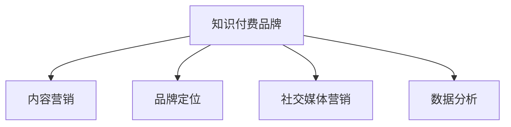

                 

# 知识付费赚钱的品牌品牌营销与品牌推广策略

## 1. 背景介绍

在数字化转型的浪潮中，知识付费成为了新型的商业模式，在教育、娱乐、健康等多个领域蓬勃发展。然而，知识付费市场竞争激烈，用户需求多样，如何打造有吸引力的知识付费品牌，成为企业不得不面对的挑战。本文从品牌营销与品牌推广的视角，分析知识付费品牌成功的关键因素，并提出一套行之有效的品牌推广策略。

### 1.1 问题由来

随着互联网的普及和智能手机的广泛应用，在线教育和内容付费逐渐成为主流。知识付费通过提供专业、有价值的知识内容，满足用户个性化需求，同时为创作者带来收益。然而，市场竞争愈发激烈，众多品牌涌入，导致用户获取知识的难度增大。如何突出品牌特色，吸引用户订阅，实现商业变现，成为知识付费品牌必须解决的问题。

### 1.2 问题核心关键点

在品牌营销与推广中，知识付费品牌面临的核心挑战包括：
- **品牌定位**：如何确定品牌核心价值，打造差异化竞争优势。
- **内容质量**：如何保证内容的深度和实用性，满足用户需求。
- **用户黏性**：如何提升用户体验，增强用户粘性，避免流失。
- **商业变现**：如何通过付费模式，实现商业模式的正向循环。

## 2. 核心概念与联系

### 2.1 核心概念概述

为更好地理解知识付费品牌营销与品牌推广策略，本节将介绍几个密切相关的核心概念：

- **知识付费品牌**：提供专业、有价值的知识内容，通过订阅、购买等方式收费的企业。
- **内容营销**：利用内容吸引用户关注和参与，提升品牌影响力和用户黏性。
- **品牌定位**：确定品牌独特价值主张，使品牌在用户心中形成特定的认知和印象。
- **社交媒体营销**：通过社交平台传播品牌信息，增加用户互动和参与度。
- **数据分析**：利用数据洞察用户行为和市场趋势，优化营销策略。

这些核心概念之间的逻辑关系可以通过以下Mermaid流程图来展示：



这个流程图展示的知识付费品牌营销与品牌推广的主要环节：

1. 通过内容营销吸引用户关注。
2. 确定品牌定位，形成独特的品牌形象。
3. 利用社交媒体进行品牌传播和互动。
4. 通过数据分析优化营销策略。

## 3. 核心算法原理 & 具体操作步骤

### 3.1 算法原理概述

知识付费品牌营销与品牌推广的核心在于利用数据和算法技术，深入理解用户需求，制定针对性的推广策略。其核心思想是：通过数据驱动的决策，提升品牌知名度和用户黏性，最终实现商业变现。

形式化地，假设品牌推广的目标是最大化用户订阅数量 $U$ 和收入 $R$，则可以定义优化目标为：

$$
\max_{\theta} \left(U, R\right)
$$

其中，$\theta$ 为推广策略参数，包括内容类型、推广渠道、优惠活动等。推广策略的选择，需要通过数据分析和算法优化，找到最佳的参数组合。

### 3.2 算法步骤详解

基于数据驱动的品牌推广，通常包括以下几个关键步骤：

**Step 1: 数据收集与处理**
- 收集用户行为数据，如点击率、停留时间、订阅变化等。
- 收集市场数据，如竞品活动、行业趋势等。
- 使用数据清洗和预处理技术，提升数据质量。

**Step 2: 用户画像建模**
- 基于用户行为数据和市场数据，构建用户画像，描述不同用户群体的特征。
- 使用聚类、分类等算法，识别用户的兴趣和需求。
- 利用异常检测技术，识别潜在流失用户。

**Step 3: 推广策略设计**
- 根据用户画像，设计针对性的推广内容。如专题课程、行业报告等。
- 选择合适的推广渠道，如社交媒体、搜索引擎广告等。
- 设计合理的优惠活动，如试听、折扣等，吸引新用户订阅。

**Step 4: A/B测试与优化**
- 对推广策略进行A/B测试，比较不同策略的效果。
- 根据测试结果，迭代优化推广策略，找到最优组合。
- 不断监测推广效果，及时调整策略。

**Step 5: 效果评估与反馈**
- 使用指标如订阅增长率、用户留存率、收入等，评估推广效果。
- 分析推广数据，识别成功因素和改进点。
- 根据反馈数据，持续优化推广策略。

### 3.3 算法优缺点

数据驱动的品牌推广方法具有以下优点：
1. 精准度高。通过数据洞察用户需求和行为，能够制定更具针对性的推广策略。
2. 效果显著。精准推广能够显著提升品牌知名度和用户黏性。
3. 灵活性强。可以根据实时数据，灵活调整推广策略，适应市场变化。

同时，该方法也存在一定的局限性：
1. 依赖数据质量。数据收集和处理的质量直接影响推广效果。
2. 成本较高。高质量数据和复杂算法的应用，需要一定的投入。
3. 数据隐私问题。在数据收集和使用过程中，需要注意用户隐私保护。

尽管存在这些局限性，但就目前而言，数据驱动的品牌推广方法仍是大品牌营销的主流范式。未来相关研究的重点在于如何进一步降低数据获取和处理的成本，保护用户隐私，同时兼顾推广效果。

### 3.4 算法应用领域

数据驱动的品牌推广方法在知识付费品牌营销中已经得到了广泛的应用，覆盖了几乎所有推广环节，例如：

- 用户增长策略：通过数据分析，优化新用户获取和留存策略。
- 内容推荐算法：根据用户行为数据，推荐最适合用户的课程。
- 营销活动设计：设计具有吸引力的营销活动，提升用户订阅率。
- 广告投放优化：通过A/B测试，找到最优的广告投放组合。
- 社交媒体互动：利用社交媒体平台，提升品牌曝光和用户参与。

除了上述这些经典应用外，数据驱动的品牌推广还被创新性地应用到更多场景中，如用户行为预测、个性化营销、多渠道协同等，为知识付费品牌带来了新的增长动力。

## 4. 数学模型和公式 & 详细讲解 & 举例说明

### 4.1 数学模型构建

本节将使用数学语言对知识付费品牌推广的优化模型进行更加严格的刻画。

假设用户订阅量为 $U$，推广策略参数为 $\theta$，推广效果的定义为 $g(\theta)$。推广目标为最大化用户订阅量和收入，可以定义优化模型为：

$$
\max_{\theta} \left(U, R\right) = \max_{\theta} g(\theta)
$$

其中 $R$ 为推广策略带来的收入。不失一般性，可以假设 $g(\theta)$ 为凸函数，即推广策略对用户订阅量和收入的影响是单增的。

### 4.2 公式推导过程

以用户增长策略为例，假设推广策略 $\theta$ 包括邮件营销、社交媒体推广、内容推荐等，推广效果的定义为：

$$
g(\theta) = \alpha_1 U_1(\theta_1) + \alpha_2 U_2(\theta_2) + \cdots + \alpha_n U_n(\theta_n)
$$

其中 $\theta_i$ 为第 $i$ 种推广策略的参数，$U_i(\theta_i)$ 为第 $i$ 种推广策略带来的订阅量，$\alpha_i$ 为第 $i$ 种推广策略的权重。

推广目标可以表示为：

$$
\max_{\theta} \left(U, R\right) = \max_{\theta} g(\theta)
$$

通过求解上述优化问题，可以找到最优的推广策略组合。

### 4.3 案例分析与讲解

假设某知识付费平台通过邮件营销、社交媒体推广、内容推荐三种策略进行推广。三种策略带来的订阅量和收入分别为：

- 邮件营销：$U_1 = \theta_1 e^{0.1 \theta_1}$，收入 $R_1 = 0.2 U_1$
- 社交媒体推广：$U_2 = \theta_2 e^{0.2 \theta_2}$，收入 $R_2 = 0.3 U_2$
- 内容推荐：$U_3 = \theta_3 e^{0.3 \theta_3}$，收入 $R_3 = 0.5 U_3$

推广效果可以表示为：

$$
g(\theta) = \alpha_1 U_1(\theta_1) + \alpha_2 U_2(\theta_2) + \alpha_3 U_3(\theta_3)
$$

其中 $\alpha_1 = 0.4$，$\alpha_2 = 0.3$，$\alpha_3 = 0.3$。

通过求解优化模型：

$$
\max_{\theta} \left(U, R\right) = \max_{\theta} g(\theta)
$$

可以找到最优的推广策略组合。例如，如果邮件营销的权重 $\alpha_1 = 0.4$ 最大，社交媒体推广的权重 $\alpha_2 = 0.3$ 次之，内容推荐的权重 $\alpha_3 = 0.3$ 最小，则平台应优先考虑邮件营销，其次为社交媒体推广，最后为内容推荐。

## 5. 项目实践：代码实例和详细解释说明

### 5.1 开发环境搭建

在进行品牌推广实践前，我们需要准备好开发环境。以下是使用Python进行Scikit-learn开发的环境配置流程：

1. 安装Anaconda：从官网下载并安装Anaconda，用于创建独立的Python环境。

2. 创建并激活虚拟环境：
```bash
conda create -n brand-marketing python=3.8 
conda activate brand-marketing
```

3. 安装Scikit-learn：
```bash
conda install scikit-learn
```

4. 安装各类工具包：
```bash
pip install numpy pandas scikit-learn matplotlib tqdm jupyter notebook ipython
```

完成上述步骤后，即可在`brand-marketing`环境中开始品牌推广实践。

### 5.2 源代码详细实现

下面我们以邮件营销为例，给出使用Scikit-learn进行品牌推广的Python代码实现。

首先，定义邮件营销的特征和效果函数：

```python
from sklearn.ensemble import GradientBoostingRegressor
from sklearn.model_selection import train_test_split
from sklearn.metrics import mean_squared_error

# 邮件营销特征
X = pd.DataFrame({
    'email_click_rate': email_click_rate,
    'email_open_rate': email_open_rate,
    'avg_session_duration': avg_session_duration,
    'user_spending': user_spending,
    'previous_subscription_days': previous_subscription_days
})

# 邮件营销效果
y = pd.DataFrame({
    'subscription_rate': subscription_rate
})

# 划分训练集和测试集
X_train, X_test, y_train, y_test = train_test_split(X, y, test_size=0.2, random_state=42)

# 定义效果评估指标
def rmse(y_true, y_pred):
    return np.sqrt(mean_squared_error(y_true, y_pred))

# 定义邮件营销效果模型
model = GradientBoostingRegressor(n_estimators=100, learning_rate=0.1, max_depth=3)

# 训练模型
model.fit(X_train, y_train)

# 评估模型
y_pred = model.predict(X_test)
print('RMSE:', rmse(y_test, y_pred))
```

然后，定义社交媒体推广和内容推荐的效果函数：

```python
# 社交媒体推广特征
X = pd.DataFrame({
    'social_media_engagement': social_media_engagement,
    'followers_count': followers_count,
    'post_frequency': post_frequency
})

# 社交媒体推广效果
y = pd.DataFrame({
    'subscription_rate': subscription_rate
})

# 划分训练集和测试集
X_train, X_test, y_train, y_test = train_test_split(X, y, test_size=0.2, random_state=42)

# 定义效果评估指标
def rmse(y_true, y_pred):
    return np.sqrt(mean_squared_error(y_true, y_pred))

# 定义社交媒体推广效果模型
model = GradientBoostingRegressor(n_estimators=100, learning_rate=0.1, max_depth=3)

# 训练模型
model.fit(X_train, y_train)

# 评估模型
y_pred = model.predict(X_test)
print('RMSE:', rmse(y_test, y_pred))
```

最后，综合邮件营销、社交媒体推广、内容推荐的效果，进行多策略组合优化：

```python
# 定义多策略组合
def multi_strategy_combination():
    # 邮件营销权重
    alpha_1 = 0.4
    # 社交媒体推广权重
    alpha_2 = 0.3
    # 内容推荐权重
    alpha_3 = 0.3

    # 邮件营销效果
    y_1 = alpha_1 * model.predict(X_1)
    # 社交媒体推广效果
    y_2 = alpha_2 * model.predict(X_2)
    # 内容推荐效果
    y_3 = alpha_3 * model.predict(X_3)

    # 综合效果
    y_combined = y_1 + y_2 + y_3

    return y_combined

# 综合效果评估
y_combined = multi_strategy_combination()
print('综合RMSE:', rmse(y_test, y_combined))
```

以上就是使用Scikit-learn对邮件营销进行品牌推广的完整代码实现。可以看到，通过Scikit-learn的强大封装，我们可以用相对简洁的代码完成邮件营销效果建模和优化。

### 5.3 代码解读与分析

让我们再详细解读一下关键代码的实现细节：

**邮件营销特征**：
- 定义邮件营销的特征变量，包括点击率、打开率、平均会话时长、消费金额、续订时长等。

**邮件营销效果**：
- 定义邮件营销的效果变量，即订阅率。

**模型训练与评估**：
- 使用梯度提升回归树算法（Gradient Boosting Regression Tree, GBR）训练邮件营销效果模型。
- 在测试集上评估模型效果，输出均方根误差（RMSE）。

**多策略组合优化**：
- 定义邮件营销、社交媒体推广、内容推荐的权重。
- 分别计算三种策略的效果，并按照权重进行组合。
- 在测试集上综合评估多策略组合的效果，输出综合RMSE。

可以看到，Scikit-learn的封装使得品牌推广的实现变得简洁高效。开发者可以将更多精力放在数据处理、模型改进等高层逻辑上，而不必过多关注底层的实现细节。

当然，工业级的系统实现还需考虑更多因素，如模型的保存和部署、超参数的自动搜索、更灵活的推广策略等。但核心的品牌推广范式基本与此类似。

## 6. 实际应用场景

### 6.1 智能客服系统

智能客服系统通过数据分析和机器学习，提升客户服务效率和体验。品牌推广在此基础上，能够更精准地触达目标客户，提高用户转化率。

具体而言，可以收集客服对话记录、用户行为数据等，分析用户需求和兴趣。根据分析结果，设计针对性的邮件营销、社交媒体推广、内容推荐策略，提升用户满意度，吸引新客户订阅。

### 6.2 在线教育平台

在线教育平台通过品牌推广，吸引更多学生订阅课程，增加收入。平台可以通过数据分析，了解不同课程的受欢迎程度，设计合理的推广策略。

例如，对于热门课程，可以通过邮件营销、社交媒体推广等方式，吸引更多学生注册。对于新课程，可以通过内容推荐、广告投放等手段，引导学生试用。

### 6.3 内容聚合平台

内容聚合平台通过品牌推广，提高内容质量和用户黏性，增强平台竞争力。平台可以基于用户行为数据，设计个性化推荐算法，提升内容阅读量和用户留存率。

例如，对于新发布的内容，可以通过社交媒体推广，吸引用户点击阅读。对于热门内容，可以通过内容推荐，增加用户停留时间和分享率。

### 6.4 未来应用展望

随着品牌推广技术的不断进步，知识付费品牌将在更多领域得到应用，为各类业务带来新的增长动力。

在智慧医疗领域，品牌推广能够帮助医疗平台提升用户健康意识，推广健康知识，吸引更多用户订阅。

在智能交通领域，品牌推广可以用于推广交通信息、出行规划等，提升用户出行体验。

在旅游行业，品牌推广可以推广旅游攻略、目的地介绍等，吸引用户预订旅游产品。

此外，在电商、金融、教育、娱乐等众多领域，品牌推广的应用也将不断涌现，为各类业务带来新的增长点。相信随着技术的日益成熟，品牌推广方法将成为知识付费品牌营销的重要手段，推动各行业的数字化转型升级。

## 7. 工具和资源推荐
### 7.1 学习资源推荐

为了帮助开发者系统掌握品牌推广的理论基础和实践技巧，这里推荐一些优质的学习资源：

1. 《机器学习实战》系列博文：由机器学习专家撰写，深入浅出地介绍了机器学习算法和实践技巧。

2. CS231n《深度学习与计算机视觉》课程：斯坦福大学开设的计算机视觉课程，内容涵盖数据分析、图像处理、深度学习等，适合对品牌推广感兴趣的读者。

3. 《广告学概论》书籍：经典广告学教材，介绍了广告的基本原理和实践方法，对品牌推广有指导意义。

4. Kaggle竞赛：Kaggle是一个数据科学竞赛平台，提供大量真实数据和问题，参与竞赛可以帮助开发者积累实战经验。

5. Coursera课程：Coursera提供大量在线课程，涵盖数据分析、机器学习、品牌推广等，是系统学习品牌推广理论的良好选择。

通过对这些资源的学习实践，相信你一定能够快速掌握品牌推广的精髓，并用于解决实际的营销问题。

### 7.2 开发工具推荐

高效的开发离不开优秀的工具支持。以下是几款用于品牌推广开发的常用工具：

1. Jupyter Notebook：开源的交互式笔记本环境，支持多种编程语言和数据处理工具，适合进行数据分析和模型优化。

2. Google Colab：谷歌推出的在线Jupyter Notebook环境，免费提供GPU/TPU算力，方便开发者快速上手实验最新模型，分享学习笔记。

3. Pandas：基于NumPy的数据处理库，支持多种数据格式和操作，适合进行数据清洗和特征工程。

4. Matplotlib：Python的绘图库，支持多种图表类型和样式，适合进行数据可视化。

5. Scikit-learn：Python的机器学习库，提供多种算法和工具，适合进行模型训练和效果评估。

合理利用这些工具，可以显著提升品牌推广任务的开发效率，加快创新迭代的步伐。

### 7.3 相关论文推荐

品牌推广技术的发展源于学界的持续研究。以下是几篇奠基性的相关论文，推荐阅读：

1. Brand Choice and Brand Loyalty（品牌选择与品牌忠诚度）：探讨了消费者品牌选择和品牌忠诚度的影响因素，为品牌推广提供了理论基础。

2. Social Media Marketing Impact（社交媒体营销影响）：研究了社交媒体对品牌推广和销售的影响，提供了基于数据的推广策略。

3. Customer-Driven Marketing（客户驱动营销）：介绍了基于客户行为的营销策略，通过数据分析提升品牌效果。

4. Brand Equity Management（品牌价值管理）：探讨了品牌价值提升的方法，包括品牌推广、品牌维护等策略。

5. Digital Brand Management（数字品牌管理）：介绍了数字时代品牌管理的最新趋势和实践，为品牌推广提供了最新的技术手段。

这些论文代表了大品牌推广技术的发展脉络。通过学习这些前沿成果，可以帮助研究者把握学科前进方向，激发更多的创新灵感。

## 8. 总结：未来发展趋势与挑战

### 8.1 总结

本文对数据驱动的品牌推广方法进行了全面系统的介绍。首先阐述了品牌营销与推广的关键因素，明确了品牌推广在知识付费品牌成功中的独特价值。其次，从原理到实践，详细讲解了品牌推广的数学模型和关键步骤，给出了品牌推广任务开发的完整代码实例。同时，本文还广泛探讨了品牌推广方法在智能客服、在线教育、内容聚合等多个行业领域的应用前景，展示了品牌推广范式的巨大潜力。此外，本文精选了品牌推广技术的各类学习资源，力求为读者提供全方位的技术指引。

通过本文的系统梳理，可以看到，数据驱动的品牌推广方法正在成为知识付费品牌营销的主流范式，极大地拓展了品牌推广的应用边界，催生了更多的落地场景。受益于数据分析和算法技术的进步，品牌推广在提升品牌知名度、用户黏性和商业变现方面具有巨大的潜力。未来，伴随数据分析技术的进一步发展，品牌推广方法将更加精准和高效，进一步推动知识付费品牌的成功。

### 8.2 未来发展趋势

展望未来，数据驱动的品牌推广技术将呈现以下几个发展趋势：

1. 技术平台化：品牌推广技术将形成平台化，通过统一的接口和算法，提供一站式的品牌推广解决方案。

2. 自动化程度提升：通过智能推荐、实时优化等技术，品牌推广将更加智能化和自动化，减少人工干预。

3. 多渠道协同：品牌推广将综合利用多种渠道，如社交媒体、邮件、广告等，实现多渠道协同推广。

4. 实时数据分析：通过实时数据采集和分析，品牌推广将更加精准和高效，及时调整策略。

5. 深度个性化：通过深度学习算法，品牌推广将更加个性化，提升用户体验和满意度。

6. 跨境推广：伴随全球化进程，品牌推广将拓展到国际市场，提升全球用户覆盖率。

以上趋势凸显了数据驱动品牌推广技术的广阔前景。这些方向的探索发展，必将进一步提升品牌推广的精准度和效率，为知识付费品牌带来更大的商业价值。

### 8.3 面临的挑战

尽管数据驱动的品牌推广技术已经取得了显著成果，但在推广过程中，仍面临诸多挑战：

1. 数据隐私问题。在数据收集和使用过程中，需要严格遵守数据隐私法规，保护用户隐私。

2. 数据质量问题。数据的质量直接影响推广效果，如何获取高质量数据，是推广的关键挑战。

3. 模型鲁棒性问题。模型对数据的依赖较强，面对异常数据容易产生波动，如何提高模型的鲁棒性，是一个重要的研究方向。

4. 实时数据处理问题。实时数据处理需要高效的算法和硬件支持，如何优化实时数据处理，是推广的关键挑战。

5. 用户行为变化问题。用户行为随时可能变化，如何适应变化，及时调整推广策略，是推广的关键挑战。

6. 成本问题。数据收集和模型训练需要较大的投入，如何降低成本，提高推广效率，是推广的关键挑战。

尽管存在这些挑战，但就目前而言，数据驱动的品牌推广技术仍是大品牌营销的主流范式。未来相关研究的重点在于如何进一步降低数据获取和处理的成本，保护用户隐私，同时兼顾推广效果。

### 8.4 研究展望

面对品牌推广面临的挑战，未来的研究需要在以下几个方面寻求新的突破：

1. 探索无监督和半监督品牌推广方法。摆脱对大规模标注数据的依赖，利用自监督学习、主动学习等无监督和半监督范式，最大限度利用非结构化数据，实现更加灵活高效的推广。

2. 研究深度学习和因果推断的融合。通过引入因果推断思想，增强品牌推广模型的稳定性，学习更加普适、鲁棒的品牌价值表征。

3. 引入更多先验知识。将符号化的先验知识，如知识图谱、逻辑规则等，与神经网络模型进行巧妙融合，引导品牌推广过程学习更准确、合理的品牌价值。

4. 结合博弈论工具。将博弈论工具引入品牌推广模型，探索品牌推广的动态博弈过程，优化品牌推广策略。

5. 纳入伦理道德约束。在品牌推广目标中引入伦理导向的评估指标，过滤和惩罚有害的推广行为，确保品牌推广符合社会价值观。

这些研究方向的探索，必将引领数据驱动品牌推广技术迈向更高的台阶，为知识付费品牌带来更大的商业价值。面向未来，数据驱动品牌推广技术还需要与其他技术进行更深入的融合，如知识表示、因果推理、强化学习等，多路径协同发力，共同推动品牌推广技术的发展。只有勇于创新、敢于突破，才能不断拓展品牌推广的边界，让知识付费品牌更好地服务用户。

## 9. 附录：常见问题与解答

**Q1：品牌推广是否需要大量标注数据？**

A: 数据驱动的品牌推广不需要大量标注数据。品牌推广可以通过分析用户行为数据、市场数据等非结构化数据，获取高质量的推广策略。同时，利用无监督和半监督学习方法，可以在较少标注数据的情况下，取得良好的推广效果。

**Q2：如何选择合适的推广策略？**

A: 选择合适的推广策略需要考虑多个因素，包括用户行为、市场趋势、竞争对手情况等。可以通过数据分析和A/B测试，找到最优的策略组合。同时，需要根据实际情况，灵活调整策略，适应市场变化。

**Q3：品牌推广是否需要频繁更新？**

A: 品牌推广需要根据市场变化和用户反馈，进行持续优化。频繁更新推广策略，可以及时调整方向，适应用户需求变化。同时，需要定期评估推广效果，优化推广策略，提升推广效果。

**Q4：品牌推广的难点是什么？**

A: 品牌推广的难点在于数据隐私保护、数据质量提升、模型鲁棒性等。需要严格遵守数据隐私法规，保护用户隐私。同时，需要优化数据处理和模型训练流程，提高数据质量和模型效果。

**Q5：品牌推广的未来方向是什么？**

A: 品牌推广的未来方向包括技术平台化、自动化程度提升、多渠道协同、实时数据分析、深度个性化、跨境推广等。这些方向将进一步提升品牌推广的精准度和效率，为品牌带来更大的商业价值。

总之，品牌推广需要数据驱动，通过数据分析和算法优化，制定针对性的推广策略，提升品牌知名度和用户黏性，最终实现商业变现。相信随着技术的不断进步，品牌推广将更加精准、高效，为各类业务带来新的增长动力。

