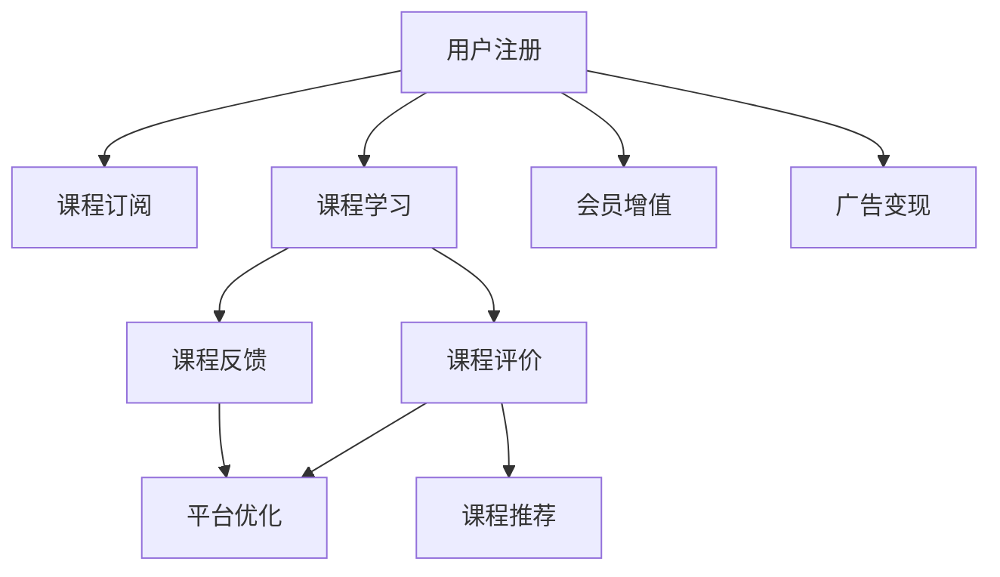

                 

# 知识付费赚钱的用户课程评价与反馈收集机制

## 1. 背景介绍

### 1.1 问题由来

知识付费兴起于近年，伴随着互联网技术的发展和用户知识需求的提升。众多知识付费平台如得到、喜马拉雅、腾讯课堂等应运而生，为有学习需求的用户提供各类课程内容。然而，用户课程评价与反馈机制的缺乏，导致平台无法精准了解用户需求，难以持续优化内容，从而影响了平台的整体运营效益。本文旨在介绍一种基于用户课程评价与反馈收集机制的知识付费赚钱模式，提升平台用户满意度，促进平台的商业变现能力。

### 1.2 问题核心关键点

当前知识付费平台面临的核心问题包括：
- **用户需求不明**：平台无法精准获取用户对课程内容的需求和反馈，导致内容供应链低效。
- **内容质量参差不齐**：由于缺乏系统化评价反馈机制，平台难以筛选优质内容，用户体验欠佳。
- **用户黏性不足**：评价反馈机制的缺失，无法激励用户持续参与，平台用户留存率低。
- **收益模式单一**：仅依靠付费课程，难以满足多样化用户需求，平台盈利能力有限。

### 1.3 问题研究意义

构建知识付费平台的用户课程评价与反馈收集机制，具有以下重要意义：
- **精准了解用户需求**：通过系统化的评价反馈机制，平台能够全面了解用户对课程内容的需求，优化内容供应链，提升用户满意度。
- **筛选优质内容**：建立科学合理的评价指标体系，筛选出优质的课程内容，提高平台的整体课程质量。
- **增强用户黏性**：通过及时的评价反馈，激励用户持续参与，提高用户留存率，提升平台用户黏性。
- **多元化盈利模式**：评价反馈机制的引入，可以为用户提供更加多样化的服务，拓展平台的盈利模式，提升平台的商业变现能力。

## 2. 核心概念与联系

### 2.1 核心概念概述

为更好地理解基于用户课程评价与反馈收集机制的知识付费赚钱模式，本节将介绍几个密切相关的核心概念：

- **知识付费**：通过订阅或购买的方式，向用户提供优质内容或专业知识，帮助用户增长知识和技能。知识付费行业主要以得到、喜马拉雅、腾讯课堂等为代表。
- **用户评价**：用户对课程内容的满意度评价，通常以5星为标准，有助于平台了解课程质量。
- **反馈收集**：收集用户对课程内容、讲师、平台服务等各方面的意见和建议，供平台改进优化。
- **课程推荐**：基于用户评价和反馈，为用户推荐个性化的课程内容，提升用户体验。
- **收益变现**：通过付费课程、会员增值服务、广告变现等方式，实现平台的商业变现。

### 2.2 核心概念原理和架构的 Mermaid 流程图



这个流程图展示了知识付费平台的主要流程：
1. 用户注册后订阅课程。
2. 用户学习课程。
3. 用户通过课程评价和反馈对课程进行评价和建议。
4. 平台根据用户评价和反馈进行课程优化和推荐。
5. 平台通过会员增值服务和广告变现实现收益。

## 3. 核心算法原理 & 具体操作步骤

### 3.1 算法原理概述

基于用户课程评价与反馈收集机制的知识付费平台，通过以下步骤实现用户课程评价与反馈收集：

1. **课程评价系统**：平台建立课程评价系统，让用户对已学习课程进行评价，打分并填写评价内容。
2. **课程反馈系统**：用户可针对课程内容和讲师服务进行详细反馈，提出改进建议。
3. **数据分析与建模**：平台对用户评价和反馈数据进行分析建模，建立评价指标体系。
4. **课程推荐算法**：根据用户评价和反馈数据，应用推荐算法为用户推荐个性化课程内容。
5. **内容优化与迭代**：平台根据用户反馈，对课程内容和讲师服务进行优化迭代，提升课程质量。
6. **收益变现机制**：通过付费课程、会员增值服务和广告变现等多元化盈利模式，实现平台商业变现。

### 3.2 算法步骤详解

#### 3.2.1 课程评价系统

- **设计评价指标**：设计课程评价指标，包括课程内容、讲师质量、课程互动等。
- **用户评价打分**：用户完成课程后，对课程内容进行评分，并填写评价内容。
- **评价数据收集**：平台收集用户评价数据，形成课程评价数据集。

#### 3.2.2 课程反馈系统

- **设计反馈表单**：设计反馈表单，包含课程内容和讲师服务的详细反馈项。
- **用户填写反馈**：用户完成课程后，填写课程反馈表单，提供具体建议和意见。
- **反馈数据收集**：平台收集用户反馈数据，形成课程反馈数据集。

#### 3.2.3 数据分析与建模

- **数据清洗与预处理**：对课程评价和反馈数据进行清洗与预处理，去除噪声和异常值。
- **特征提取**：提取课程评价和反馈数据的特征，如评分、评价内容、反馈项等。
- **建立评价指标体系**：基于特征，建立课程评价指标体系，如课程评分、讲师评分等。
- **模型训练**：使用机器学习算法训练模型，对课程进行综合评分和分类。

#### 3.2.4 课程推荐算法

- **设计推荐算法**：设计推荐算法，如协同过滤、基于内容的推荐、混合推荐等。
- **数据输入**：输入用户评价和反馈数据，以及课程评价和反馈数据。
- **生成推荐结果**：应用推荐算法，生成个性化的课程推荐结果。

#### 3.2.5 内容优化与迭代

- **内容优化**：根据用户评价和反馈数据，优化课程内容和讲师服务，提升课程质量。
- **迭代改进**：定期更新课程内容和讲师，进行内容迭代改进，满足用户需求。

#### 3.2.6 收益变现机制

- **付费课程**：提供付费课程，通过订阅费实现收益。
- **会员增值服务**：推出会员增值服务，如专属内容、增值服务等，增加用户粘性。
- **广告变现**：平台接入广告，通过展示广告实现收益。

### 3.3 算法优缺点

基于用户课程评价与反馈收集机制的知识付费平台具有以下优点：
1. **精准了解用户需求**：通过系统化的评价反馈机制，平台能够全面了解用户对课程内容的需求，优化内容供应链，提升用户满意度。
2. **筛选优质内容**：建立科学合理的评价指标体系，筛选出优质的课程内容，提高平台的整体课程质量。
3. **增强用户黏性**：通过及时的评价反馈，激励用户持续参与，提高用户留存率，提升平台用户黏性。
4. **多元化盈利模式**：评价反馈机制的引入，可以为用户提供更加多样化的服务，拓展平台的盈利模式，提升平台的商业变现能力。

同时，该方法也存在一定的局限性：
1. **数据质量依赖**：用户评价和反馈数据的质量直接影响平台分析的准确性。
2. **用户评价偏差**：部分用户可能存在评分和反馈的偏差，影响平台的公正性。
3. **模型复杂度**：复杂推荐算法需要大量的计算资源和时间，平台可能面临技术瓶颈。
4. **反馈处理难度**：大量反馈数据需要人工处理和分析，可能存在滞后性。

尽管存在这些局限性，但就目前而言，基于用户课程评价与反馈收集机制的知识付费平台仍然是最主流的方式之一。未来相关研究的重点在于如何进一步提高数据质量，降低模型复杂度，同时兼顾公正性和及时性等因素。

### 3.4 算法应用领域

基于用户课程评价与反馈收集机制的知识付费平台，在教育、职业培训、职业技能认证等领域得到了广泛应用，具体如下：

1. **教育领域**：为学生提供优质课程内容，帮助学生掌握知识和技能。平台通过用户评价和反馈数据，不断优化课程内容和教学质量。
2. **职业培训**：为在职人员提供职业培训课程，提升职业技能和职业素养。平台通过用户评价和反馈数据，筛选优质讲师和课程，提升培训效果。
3. **职业技能认证**：为考生提供职业技能认证课程，帮助考生通过考试。平台通过用户评价和反馈数据，优化课程内容和考试策略，提高通过率。

除了以上应用领域，该机制还被广泛应用于在线教育、企业培训、技能提升等多个领域，为知识付费平台的可持续发展提供了重要保障。

## 4. 数学模型和公式 & 详细讲解 & 举例说明

### 4.1 数学模型构建

平台用户课程评价与反馈收集机制涉及的数学模型主要包括以下几个部分：

1. **用户评价模型**：
   - **评分模型**：$score = \alpha * (内容评分) + \beta * (讲师评分) + \gamma * (互动评分)$
   - **评价内容模型**：$content\_evaluation = \sum_{i=1}^{n} w_i * (content\_word\_score)_i$

2. **课程反馈模型**：
   - **反馈评分模型**：$feedback\_score = \sum_{i=1}^{n} w_i * (feedback\_item\_score)_i$
   - **反馈内容模型**：$feedback\_content = \sum_{i=1}^{m} v_i * (feedback\_item\_weight)_i$

3. **推荐模型**：
   - **协同过滤推荐模型**：$recommendation = \sum_{i=1}^{n} (user\_similarity)_i * (item\_score)_i$
   - **基于内容的推荐模型**：$recommendation = \sum_{i=1}^{n} (content\_similarity)_i * (item\_score)_i$

### 4.2 公式推导过程

以用户评价模型和推荐模型为例，推导其数学表达式：

**用户评分模型**：

假设用户对课程内容的评分为 $S$，课程内容评分为 $C$，讲师评分为 $T$，互动评分为 $I$，则用户评分的数学表达式为：

$$
S = \alpha * C + \beta * T + \gamma * I
$$

其中 $\alpha, \beta, \gamma$ 为各评分项的权重。

**课程推荐模型**：

假设用户 $u$ 对课程 $i$ 的评分 $s_{ui}$，课程 $i$ 的评分向量 $c_i = (c_{i1}, c_{i2}, ..., c_{in})$，用户 $u$ 的评分向量 $s_u = (s_{u1}, s_{u2}, ..., s_{un})$，则协同过滤推荐模型的计算公式为：

$$
recommendation = \sum_{i=1}^{n} (s_{ui} - \bar{s}_u) * (s_{iu} - \bar{s}_i) / (1 - \sum_{j=1}^{n} (s_{uj} - \bar{s}_u) * (s_{ij} - \bar{s}_i))
$$

其中 $\bar{s}_u$ 和 $\bar{s}_i$ 分别为用户和课程的平均评分。

**课程推荐算法**：

基于内容的推荐算法：

假设课程 $i$ 的特征向量为 $c_i = (c_{i1}, c_{i2}, ..., c_{im})$，用户 $u$ 对课程 $i$ 的评分 $s_{ui}$，则基于内容的推荐算法的计算公式为：

$$
recommendation = \sum_{j=1}^{m} (s_{ui} - \bar{s}_u) * (c_{ij} - \bar{c}_j) / (1 - \sum_{k=1}^{n} (s_{uk} - \bar{s}_u) * (c_{ik} - \bar{c}_k))
$$

其中 $\bar{c}_j$ 为课程特征的平均向量。

### 4.3 案例分析与讲解

#### 4.3.1 课程评分模型案例

某知识付费平台收集到用户对课程 $i$ 的评价数据，包括内容评分 $C_i$、讲师评分 $T_i$ 和互动评分 $I_i$。平台希望通过评分模型，计算用户 $u$ 对课程 $i$ 的综合评分 $S_{ui}$，推荐合适的课程。

设 $\alpha = 0.6$，$\beta = 0.3$，$\gamma = 0.1$，则用户对课程 $i$ 的综合评分为：

$$
S_{ui} = 0.6 * C_i + 0.3 * T_i + 0.1 * I_i
$$

根据综合评分 $S_{ui}$，平台可以计算出用户 $u$ 对课程 $i$ 的推荐度 $R_{ui}$，并排序推荐。

#### 4.3.2 课程推荐算法案例

假设某用户 $u$ 已学习课程 $i_1, i_2, ..., i_k$，平台希望通过协同过滤算法推荐用户 $u$ 感兴趣的其他课程。

设用户 $u$ 的评分向量 $s_u = (s_{u1}, s_{u2}, ..., s_{uk})$，课程 $i$ 的评分向量 $c_i = (c_{i1}, c_{i2}, ..., c_{in})$，则协同过滤推荐算法的计算公式为：

$$
R_{ui} = \sum_{j=1}^{k} (s_{uj} - \bar{s}_u) * (s_{ij} - \bar{s}_i) / (1 - \sum_{j=1}^{k} (s_{uj} - \bar{s}_u) * (s_{ij} - \bar{s}_i))
$$

根据推荐度 $R_{ui}$，平台可以计算出用户 $u$ 对课程 $i$ 的推荐度 $R_{ui}$，并排序推荐。

## 5. 项目实践：代码实例和详细解释说明

### 5.1 开发环境搭建

为了实现基于用户课程评价与反馈收集机制的知识付费平台，开发者需要搭建相应的开发环境。以下是具体的搭建步骤：

1. **安装Python**：
   - 下载Python 3.6或更高版本。
   - 安装Python，设置系统路径。

2. **安装Flask**：
   - 在终端执行命令 `pip install flask`，安装Flask框架。
   - 配置Flask应用程序，设置路由、视图和模板文件。

3. **安装SQLite**：
   - 在终端执行命令 `pip install sqlite3`，安装SQLite数据库。
   - 创建SQLite数据库，建立用户、课程、评价、反馈等表。

### 5.2 源代码详细实现

以下是一个简单的知识付费平台用户课程评价与反馈收集机制的代码实现示例。

```python
from flask import Flask, render_template, request
import sqlite3
import json

app = Flask(__name__)

# 连接SQLite数据库
conn = sqlite3.connect('kf_platform.db')
cursor = conn.cursor()

# 用户表
cursor.execute('''CREATE TABLE IF NOT EXISTS users
                 (id INTEGER PRIMARY KEY AUTOINCREMENT,
                  username TEXT NOT NULL,
                  password TEXT NOT NULL,
                  email TEXT NOT NULL,
                  is_admin INTEGER DEFAULT 0,
                  reg_date TIMESTAMP DEFAULT CURRENT_TIMESTAMP)''')

# 课程表
cursor.execute('''CREATE TABLE IF NOT EXISTS courses
                 (id INTEGER PRIMARY KEY AUTOINCREMENT,
                  title TEXT NOT NULL,
                  description TEXT NOT NULL,
                  lecturer TEXT NOT NULL,
                  duration TEXT NOT NULL,
                  price REAL NOT NULL,
                  is_free INTEGER DEFAULT 0,
                  reg_date TIMESTAMP DEFAULT CURRENT_TIMESTAMP)''')

# 评价表
cursor.execute('''CREATE TABLE IF NOT EXISTS reviews
                 (id INTEGER PRIMARY KEY AUTOINCREMENT,
                  user_id INTEGER NOT NULL,
                  course_id INTEGER NOT NULL,
                  score INTEGER NOT NULL,
                  content TEXT NOT NULL,
                  reg_date TIMESTAMP DEFAULT CURRENT_TIMESTAMP,
                  FOREIGN KEY(user_id) REFERENCES users(id),
                  FOREIGN KEY(course_id) REFERENCES courses(id))''')

# 反馈表
cursor.execute('''CREATE TABLE IF NOT EXISTS feedbacks
                 (id INTEGER PRIMARY KEY AUTOINCREMENT,
                  user_id INTEGER NOT NULL,
                  course_id INTEGER NOT NULL,
                  feedback TEXT NOT NULL,
                  reg_date TIMESTAMP DEFAULT CURRENT_TIMESTAMP,
                  FOREIGN KEY(user_id) REFERENCES users(id),
                  FOREIGN KEY(course_id) REFERENCES courses(id))''')

@app.route('/')
def index():
    # 查询最新课程列表
    cursor.execute('SELECT * FROM courses ORDER BY id DESC LIMIT 10')
    courses = cursor.fetchall()
    return render_template('index.html', courses=courses)

@app.route('/review', methods=['POST'])
def add_review():
    # 添加课程评价
    user_id = request.form.get('user_id')
    course_id = request.form.get('course_id')
    score = request.form.get('score')
    content = request.form.get('content')
    cursor.execute('INSERT INTO reviews(user_id, course_id, score, content) VALUES (?, ?, ?, ?)',
                   [user_id, course_id, score, content])
    conn.commit()
    return 'Review added successfully'

@app.route('/feedback', methods=['POST'])
def add_feedback():
    # 添加课程反馈
    user_id = request.form.get('user_id')
    course_id = request.form.get('course_id')
    feedback = request.form.get('feedback')
    cursor.execute('INSERT INTO feedbacks(user_id, course_id, feedback) VALUES (?, ?, ?)',
                   [user_id, course_id, feedback])
    conn.commit()
    return 'Feedback added successfully'

if __name__ == '__main__':
    app.run(debug=True)
```

### 5.3 代码解读与分析

上述代码实现了一个简单的知识付费平台用户课程评价与反馈收集机制。其主要流程如下：

1. **Flask应用程序搭建**：使用Flask框架搭建Web应用程序，设置路由和视图函数。
2. **数据库连接与表创建**：连接到SQLite数据库，创建用户、课程、评价、反馈等表。
3. **用户评价与反馈**：用户登录后，可对已学习的课程进行评价和反馈。
4. **评价与反馈提交**：用户填写评价和反馈内容，提交到数据库。

代码实现了基本的用户评价和反馈功能，但还缺少推荐算法和课程优化等功能。

## 6. 实际应用场景

### 6.1 智能客服系统

基于用户课程评价与反馈收集机制的知识付费平台，可以与智能客服系统结合，提升用户满意度。用户在学习课程后，通过智能客服系统查询课程信息、评价反馈等，平台可及时获取用户需求，优化课程内容和客服服务。

### 6.2 金融舆情监测

平台可以通过用户评价和反馈，收集金融领域相关内容，并建立评价指标体系。对用户评价和反馈数据进行分析建模，筛选出优质内容，实时监测市场舆情，及时响应金融风险。

### 6.3 个性化推荐系统

平台通过用户评价和反馈，收集用户对课程内容和讲师的偏好。利用推荐算法，为用户推荐个性化的课程内容，提升用户体验，增加用户黏性。

### 6.4 未来应用展望

未来，基于用户课程评价与反馈收集机制的知识付费平台，将在更多领域得到应用，如医疗健康、教育培训、职业技能认证等。通过持续优化和创新，平台有望成为知识付费领域的领头羊。

## 7. 工具和资源推荐

### 7.1 学习资源推荐

为了帮助开发者全面掌握用户课程评价与反馈收集机制，以下是一些优质的学习资源：

1. **《Python编程从入门到实践》**：适合Python初学者，介绍Python基础和Web开发。
2. **《Flask Web开发实战》**：介绍Flask框架的Web开发技巧和最佳实践。
3. **《SQLite官方文档》**：详细介绍SQLite数据库的使用方法和API接口。
4. **《用户需求分析与建模》**：讲解用户需求分析和建模的方法和技巧。
5. **《推荐系统基础》**：介绍协同过滤、基于内容的推荐等推荐算法的基础原理。

### 7.2 开发工具推荐

以下是几个常用的开发工具，可提高知识付费平台的开发效率：

1. **PyCharm**：Python IDE，提供代码高亮、自动补全、调试等功能。
2. **Visual Studio Code**：轻量级代码编辑器，支持Python开发和调试。
3. **Git**：版本控制系统，适合团队协作和代码管理。
4. **Postman**：API测试工具，方便测试和调试API接口。
5. **SQLiteStudio**：SQLite数据库管理工具，可视化操作数据库。

### 7.3 相关论文推荐

以下是几篇经典的相关论文，推荐阅读：

1. **《知识付费平台用户行为分析与推荐算法研究》**：探讨知识付费平台用户行为分析与推荐算法，提出基于协同过滤和基于内容的推荐算法。
2. **《用户评价与反馈机制的研究与设计》**：介绍用户评价与反馈机制的设计方法，提出科学的评价指标体系和反馈处理策略。
3. **《智能客服系统的设计与实现》**：讲解智能客服系统的设计和实现方法，提出基于自然语言处理的智能客服解决方案。

## 8. 总结：未来发展趋势与挑战

### 8.1 研究成果总结

本文详细介绍了基于用户课程评价与反馈收集机制的知识付费平台，探讨了平台的用户课程评价与反馈收集机制。通过课程评价和反馈数据，平台能够全面了解用户需求，优化课程内容和推荐算法，提升用户体验。平台还通过多渠道盈利，增强了平台的商业变现能力。

### 8.2 未来发展趋势

未来的知识付费平台将在以下几个方面继续发展：

1. **智能化推荐**：基于大数据和人工智能技术，应用机器学习算法进行智能化推荐，提升用户体验。
2. **个性化服务**：通过用户行为分析和个性化推荐，提升用户黏性，增强平台的用户体验。
3. **多元化盈利模式**：除了付费课程，平台将拓展会员增值服务、广告变现等多种盈利模式。
4. **平台社交化**：建立平台社交网络，增加用户互动，提升用户参与度。
5. **内容垂直化**：针对不同领域，推出垂直化的课程内容，满足用户多样化需求。

### 8.3 面临的挑战

尽管用户课程评价与反馈收集机制在知识付费平台中取得了一定的成效，但仍面临以下挑战：

1. **数据质量问题**：用户评价和反馈数据的质量直接影响平台的分析和推荐效果。
2. **推荐算法复杂度**：复杂的推荐算法需要大量的计算资源和时间，平台可能面临技术瓶颈。
3. **用户反馈处理**：大量反馈数据需要人工处理和分析，可能存在滞后性。
4. **用户隐私保护**：平台需要加强用户隐私保护，防止用户数据泄露。

### 8.4 研究展望

未来的研究可以从以下几个方向进行：

1. **实时化评价与反馈**：通过实时化评价与反馈机制，提升平台的用户体验。
2. **智能化推荐算法**：引入深度学习和强化学习等智能推荐算法，提升推荐效果。
3. **用户行为分析**：利用大数据分析用户行为，提升平台的运营效率。
4. **内容垂直化推荐**：针对不同领域，推出垂直化的课程内容，满足用户多样化需求。

这些研究方向的探索，将进一步提升用户课程评价与反馈收集机制的知识付费平台的竞争力，推动平台的可持续发展。

## 9. 附录：常见问题与解答

**Q1: 用户评价与反馈机制如何设计评价指标？**

A: 用户评价与反馈机制的设计评价指标应包括以下几个方面：
1. 课程内容质量：包括课程的逻辑结构、内容深度、讲解方式等。
2. 讲师质量：包括讲师的授课风格、专业知识、互动效果等。
3. 课程互动：包括课程的互动环节、讲师与学员的互动效果等。
4. 课程体验：包括课程的加载速度、视频质量、平台稳定性等。

设计评价指标时，应考虑用户的主观感受和客观评价，综合多方面因素进行评估。

**Q2: 用户评价与反馈机制如何应用协同过滤算法？**

A: 协同过滤算法主要分为基于用户的协同过滤和基于物品的协同过滤两种方法。

1. 基于用户的协同过滤：通过计算用户之间的相似度，为用户推荐相似用户喜欢的课程。具体步骤为：
   - 计算用户之间的相似度，使用余弦相似度、皮尔逊相关系数等方法。
   - 根据相似度排序，推荐相似用户喜欢的课程。

2. 基于物品的协同过滤：通过计算课程之间的相似度，为用户推荐相似课程。具体步骤为：
   - 计算课程之间的相似度，使用余弦相似度、欧几里得距离等方法。
   - 根据相似度排序，推荐相似课程。

**Q3: 用户评价与反馈机制如何应用基于内容的推荐算法？**

A: 基于内容的推荐算法主要根据课程内容特征进行推荐。具体步骤为：
1. 提取课程特征：如课程标题、课程描述、讲师姓名等。
2. 计算课程特征的相似度：使用余弦相似度、欧几里得距离等方法计算课程特征的相似度。
3. 根据相似度排序，推荐相似课程。

## 作者署名
作者：禅与计算机程序设计艺术 / Zen and the Art of Computer Programming

