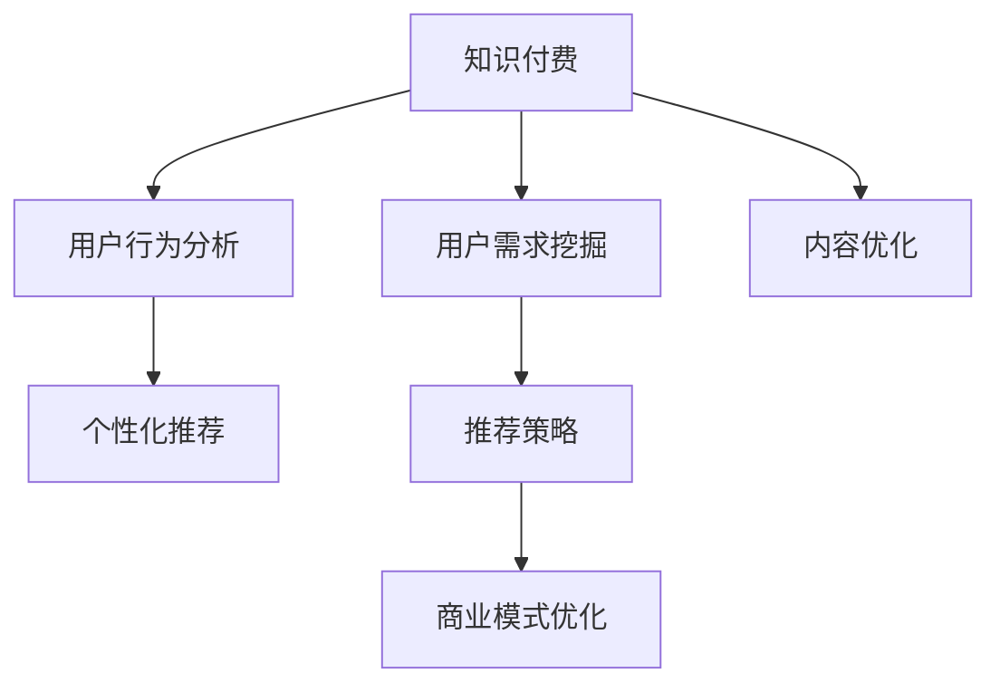

                 

# 知识付费赚钱的用户需求挖掘与分析

> 关键词：知识付费, 用户需求挖掘, 用户行为分析, 数据分析, 营销策略, 内容优化, 个性化推荐, 用户满意度, 商业模式

## 1. 背景介绍

### 1.1 问题由来

随着互联网的快速发展和信息技术的日益成熟，在线知识付费行业迅速崛起，吸引了越来越多用户的关注和参与。知识付费平台以高性价比的内容资源、便捷的访问方式、丰富的学习选择等为核心优势，为用户提供了个性化、定制化的学习体验。然而，尽管市场规模不断扩大，但实际盈利能力与预期存在较大差距，许多平台用户流失率高，难以持续盈利。

本文将聚焦于知识付费平台用户需求挖掘与分析，以期从用户角度出发，深入剖析平台吸引和留存用户的关键因素，提炼出用户关注的核心需求，并提出针对性的改进策略，助力平台提升盈利能力和用户满意度。

### 1.2 问题核心关键点

知识付费平台在用户需求挖掘与分析方面面临以下核心问题：

1. **用户需求精准识别**：如何准确把握用户对知识内容的需求，避免过度商业化或内容同质化。
2. **用户行为深入理解**：如何通过数据分析挖掘用户行为模式，优化产品设计和推荐策略。
3. **个性化推荐系统**：如何在海量内容中高效推荐符合用户兴趣和需求的内容，提升用户粘性。
4. **商业模式优化**：如何构建可持续的盈利模式，同时提升用户体验和平台价值。
5. **数据隐私保护**：如何在数据分析过程中保护用户隐私，维护平台信任和用户安全。

解决以上问题需要综合运用用户需求挖掘、行为分析、推荐算法和商业策略等多方面的技术和方法，形成系统化的分析框架。

### 1.3 问题研究意义

准确挖掘用户需求并优化推荐策略，对于提升知识付费平台的盈利能力、用户满意度和市场竞争力具有重要意义：

1. **精准内容推荐**：通过深度理解用户需求，提供个性化、高价值的内容推荐，提升用户满意度和留存率。
2. **降低运营成本**：通过精准营销和高效推荐系统，减少无效内容和流量，降低平台运营成本。
3. **增加收入来源**：通过多样化商业模式和精准用户定位，拓展收入渠道，实现平台盈利。
4. **保持竞争优势**：在激烈的市场竞争中，通过深入的用户需求挖掘和高效的数据分析，保持平台的市场竞争力和用户粘性。
5. **推动行业发展**：为知识付费行业的整体发展提供理论支持和实践经验，推动行业创新和技术进步。

## 2. 核心概念与联系

### 2.1 核心概念概述

为更好地理解知识付费平台用户需求挖掘与分析方法，本节将介绍几个关键概念：

- **知识付费**：指用户为获取专业知识、技能、见解等，愿意支付费用的互联网服务模式。知识付费平台通过整合优质内容资源，为付费用户提供专属知识服务。

- **用户需求挖掘**：指通过数据分析、用户调查、行为观察等方式，获取用户真实需求和偏好，为产品设计、内容推荐、用户体验优化等提供数据支撑。

- **用户行为分析**：指对用户在知识付费平台上的访问、学习、互动等行为数据进行分析，挖掘用户行为模式和兴趣偏好，指导产品迭代和营销策略优化。

- **个性化推荐系统**：指通过分析用户行为数据和兴趣特征，利用算法为用户推荐最相关的知识内容，提升用户体验和平台活跃度。

- **内容优化与再创作**：指根据用户反馈和需求，对现有内容进行优化调整，或进行新内容的创作，以满足用户需求，提升平台竞争力。

- **商业模式的探索与优化**：指在知识付费平台运营过程中，不断探索新的盈利模式，并结合用户需求和行为分析进行优化，以实现可持续的商业增长。

这些核心概念之间的关系可以通过以下Mermaid流程图来展示：



这个流程图展示了知识付费平台从内容生产到用户互动的各个环节，以及用户需求挖掘、行为分析和个性化推荐等关键技术如何相互配合，共同提升平台的用户体验和盈利能力。

## 3. 核心算法原理 & 具体操作步骤
### 3.1 算法原理概述

知识付费平台用户需求挖掘与分析的核心理论包括用户行为分析、个性化推荐和商业模式优化。其核心思想是通过数据驱动的方法，深入理解用户需求，优化推荐策略，并探索可持续的盈利模式。

### 3.2 算法步骤详解

基于以上核心理论，知识付费平台用户需求挖掘与分析的步骤主要包括以下几个方面：

**Step 1: 数据收集与预处理**

- 收集用户在知识付费平台上的行为数据，包括访问记录、学习时长、互动评论等。
- 对数据进行清洗和预处理，包括数据去重、缺失值填充、异常值检测等。
- 将数据转化为合适的数据格式，如CSV、JSON等，方便后续分析和建模。

**Step 2: 用户需求分析**

- 使用数据分析工具（如Python的Pandas、NumPy，R语言等）对用户行为数据进行分析，挖掘用户的行为模式和兴趣偏好。
- 采用统计学方法（如均值、方差、相关性分析等）对用户需求进行量化描述。
- 结合用户调查问卷、用户反馈等定性数据，对用户需求进行更深入的理解。

**Step 3: 个性化推荐系统开发**

- 根据用户需求分析结果，设计个性化推荐算法，如协同过滤、基于内容的推荐、深度学习等。
- 使用机器学习框架（如Scikit-learn、TensorFlow、PyTorch等）实现推荐算法模型。
- 对推荐算法模型进行训练和评估，优化模型参数和推荐效果。

**Step 4: 内容优化与再创作**

- 根据用户需求和行为分析结果，对现有内容进行优化调整，提升内容的针对性和实用性。
- 引入内容创作团队，根据用户反馈和市场趋势，创作符合用户需求的新内容。
- 对内容进行质量评估，确保内容的高质量和合规性。

**Step 5: 商业模式探索与优化**

- 结合用户行为分析和市场调研，探索新的盈利模式，如付费会员、内容订阅、知识商品等。
- 设计激励机制，鼓励用户参与内容创作和推广。
- 定期评估商业模式的效果，根据市场反馈进行优化调整。

### 3.3 算法优缺点

知识付费平台用户需求挖掘与分析的算法具有以下优点：

1. **数据驱动**：通过大量数据分析，精准挖掘用户需求和行为，指导产品设计和优化。
2. **个性化推荐**：提升用户体验，增加用户粘性和留存率。
3. **成本控制**：优化推荐策略，减少无效流量和内容，降低运营成本。
4. **市场导向**：结合市场调研，探索新的盈利模式，保持平台竞争力。

同时，该算法也存在一些局限性：

1. **数据质量依赖**：算法效果依赖于数据的准确性和完整性，数据质量差可能导致误导性结果。
2. **隐私保护**：在数据分析过程中，需要严格保护用户隐私，避免数据泄露和滥用。
3. **计算资源需求高**：个性化推荐和内容优化需要大量计算资源，对平台技术能力提出较高要求。
4. **推荐算法复杂**：推荐算法设计复杂，需要结合多种技术和方法，才能满足用户多样化需求。

### 3.4 算法应用领域

知识付费平台用户需求挖掘与分析的算法在以下领域有广泛应用：

- **内容推荐系统**：通过个性化推荐提升用户粘性和满意度，增加平台用户规模。
- **用户行为分析**：通过用户行为数据指导产品迭代和营销策略优化，提升平台用户留存和活跃度。
- **内容优化与再创作**：结合用户需求和市场趋势，创作符合用户期望的新内容，增加平台内容的丰富性和多样性。
- **商业模式优化**：通过用户行为分析和市场调研，探索新的盈利模式和业务增长点，保持平台竞争力。
- **用户体验提升**：通过个性化推荐和内容优化，提升用户使用体验，增加平台口碑和用户粘性。

## 4. 数学模型和公式 & 详细讲解 & 举例说明
### 4.1 数学模型构建

本节将使用数学语言对知识付费平台用户需求挖掘与分析的数学模型进行详细构建和讲解。

假设知识付费平台的用户行为数据为 $D=\{(x_i, y_i)\}_{i=1}^N$，其中 $x_i$ 表示用户行为特征向量，$y_i$ 表示用户对行为 $x_i$ 的评价标签。

定义用户需求模型为 $\hat{y} = f(x; \theta)$，其中 $f$ 为模型函数，$\theta$ 为模型参数。

基于历史行为数据 $D$，构建用户需求预测模型，最小化预测误差 $E(\hat{y}, y)$。常用的预测误差函数包括均方误差（MSE）、平均绝对误差（MAE）等。

### 4.2 公式推导过程

以均方误差（MSE）为例，推导用户需求预测模型的优化公式。

假设模型 $f$ 为线性回归模型，即 $\hat{y} = \theta^T x$，则预测误差为：

$$
E(\hat{y}, y) = \frac{1}{N} \sum_{i=1}^N (y_i - \hat{y}_i)^2
$$

对 $\theta$ 求导，得：

$$
\frac{\partial E(\hat{y}, y)}{\partial \theta} = -\frac{2}{N} \sum_{i=1}^N (y_i - \hat{y}_i) x_i
$$

通过梯度下降法优化模型参数 $\theta$，得：

$$
\theta \leftarrow \theta - \eta \nabla_{\theta}E(\hat{y}, y)
$$

其中 $\eta$ 为学习率。

通过上述公式，可以构建用户需求预测模型，并根据预测误差不断优化模型参数，提升模型预测精度。

### 4.3 案例分析与讲解

以下以一个简单的案例来详细说明如何应用上述数学模型进行用户需求挖掘与分析：

假设有一个在线编程课程平台，收集了用户完成课程的记录数据，包括学习时长、课程评分、学习路径等行为特征。使用上述数学模型，对用户需求进行预测和分析：

1. **数据收集与预处理**：收集用户行为数据，去除重复记录和异常值，转化为合适格式。
2. **特征工程**：提取和学习时长的平方、课程评分的对数、学习路径的长度等特征。
3. **模型训练**：使用线性回归模型对用户完成课程的需求进行预测，并通过均方误差（MSE）评估模型效果。
4. **结果分析**：分析预测误差，挖掘用户对课程的需求变化趋势和影响因素。
5. **优化建议**：根据预测结果，调整课程内容、优化学习路径、引入互动评价等，提升用户满意度。

## 5. 项目实践：代码实例和详细解释说明
### 5.1 开发环境搭建

在进行知识付费平台用户需求挖掘与分析的开发实践前，我们需要准备好开发环境。以下是使用Python进行数据分析和建模的环境配置流程：

1. 安装Anaconda：从官网下载并安装Anaconda，用于创建独立的Python环境。

2. 创建并激活虚拟环境：
```bash
conda create -n data-analytics python=3.8 
conda activate data-analytics
```

3. 安装数据分析工具：
```bash
conda install pandas numpy matplotlib seaborn scikit-learn statsmodels scipy
```

4. 安装机器学习工具：
```bash
conda install tensorflow pytorch torchvision transformers lightgbm xgboost
```

5. 安装数据可视化工具：
```bash
conda install plotly seaborn
```

完成上述步骤后，即可在`data-analytics`环境中开始数据挖掘与分析实践。

### 5.2 源代码详细实现

下面以用户行为数据分析为例，给出使用Python进行数据分析和建模的代码实现。

首先，定义数据预处理函数：

```python
import pandas as pd
from sklearn.preprocessing import StandardScaler

def preprocess_data(df):
    # 去除重复记录和缺失值
    df = df.drop_duplicates().dropna()
    
    # 标准化数据
    scaler = StandardScaler()
    df = pd.DataFrame(scaler.fit_transform(df), columns=df.columns)
    
    return df
```

然后，定义用户需求预测函数：

```python
from sklearn.linear_model import LinearRegression
from sklearn.metrics import mean_squared_error

def predict_user_demand(X, y):
    # 定义模型
    model = LinearRegression()
    
    # 训练模型
    model.fit(X, y)
    
    # 评估模型
    mse = mean_squared_error(y, model.predict(X))
    return model, mse
```

最后，使用示例数据进行测试：

```python
# 读取数据
data = pd.read_csv('user_behavior.csv')

# 数据预处理
data = preprocess_data(data)

# 提取特征和标签
X = data[['learning_hours', 'course_rating', 'learning_path_length']]
y = data['completion_status']

# 预测用户需求
model, mse = predict_user_demand(X, y)
print(f'预测均方误差：{mse:.2f}')

# 分析预测结果
print(f'模型系数：{model.coef_}')
```

以上就是使用Python进行用户行为数据分析的完整代码实现。可以看到，利用科学计算和统计分析工具，可以高效地处理和分析用户行为数据，构建预测模型。

### 5.3 代码解读与分析

让我们再详细解读一下关键代码的实现细节：

**数据预处理函数**：
- 去除重复记录和缺失值，确保数据质量。
- 使用标准化方法对数据进行归一化处理，提升模型训练效果。

**用户需求预测函数**：
- 定义线性回归模型，用于预测用户完成课程的需求。
- 使用均方误差（MSE）评估模型预测效果。

**示例代码**：
- 读取用户行为数据文件。
- 对数据进行预处理和特征提取。
- 使用线性回归模型进行预测，并输出预测误差。
- 打印模型系数，展示预测模型的参数。

以上代码展示了如何使用Python进行用户行为数据分析和建模，体现了数据科学在知识付费平台用户需求挖掘中的应用。

## 6. 实际应用场景
### 6.1 智能课程推荐

基于用户需求挖掘与分析，智能课程推荐系统可以通过用户行为数据，为用户推荐最匹配的课程内容。推荐算法可以根据用户的过往学习记录、课程评分、完成时间等特征，实时生成个性化推荐列表，提升用户学习体验和课程转化率。

### 6.2 用户行为分析与优化

通过对用户行为数据的深入分析，平台可以挖掘用户行为模式和兴趣偏好，优化产品设计和用户界面，提升用户满意度和留存率。例如，可以根据用户学习路径和完成情况，优化课程结构和内容设计，减少用户流失。

### 6.3 个性化内容创作与推广

结合用户需求分析和内容创作团队，平台可以引入用户参与内容创作，提高内容的个性化和实用性。同时，利用个性化推荐系统，精准推广优质内容，提升平台内容曝光率和用户粘性。

### 6.4 多渠道营销与推广

平台可以结合用户行为数据分析，选择最适合的营销渠道和推广策略，最大化用户转化率和平台收入。例如，针对高价值用户，通过邮件推送专属优惠，提升用户购买意愿；针对新用户，通过社交媒体推广平台特色课程，吸引新用户注册和试用。

### 6.5 多维度定价与优化

根据用户需求分析和市场调研，平台可以探索多种定价策略，如按课程、按月、按季度等，满足不同用户的需求。同时，利用用户行为数据优化定价策略，最大化平台收入和用户满意度。

## 7. 工具和资源推荐
### 7.1 学习资源推荐

为了帮助开发者系统掌握知识付费平台用户需求挖掘与分析的理论基础和实践技巧，这里推荐一些优质的学习资源：

1. 《Python数据科学手册》：由知名数据科学家Jake VanderPlas撰写，涵盖Python数据处理、统计分析、机器学习等核心内容，是入门数据科学的必备书籍。

2. 《数据科学实战》：由大数据专家Dickens Vilaenca撰写，详细介绍了数据科学的全流程方法，包括数据收集、清洗、分析、可视化等。

3. 《机器学习实战》：由Peter Harrington撰写，通过多个实际案例，介绍机器学习的基本原理和算法实现。

4. Coursera《数据科学专业》课程：由知名数据科学家、Coursera创始人Andrew Ng主讲的课程，涵盖数据科学、机器学习、数据可视化等核心内容。

5. Udacity《机器学习工程师纳米学位》课程：由Google、Facebook等知名公司联合开发，涵盖深度学习、强化学习、计算机视觉等前沿技术。

通过这些资源的学习实践，相信你一定能够快速掌握知识付费平台用户需求挖掘与分析的精髓，并用于解决实际的业务问题。

### 7.2 开发工具推荐

高效的开发离不开优秀的工具支持。以下是几款用于知识付费平台用户需求挖掘与分析开发的常用工具：

1. Jupyter Notebook：开源的交互式数据科学平台，支持Python、R等多种语言，便于快速迭代和共享学习笔记。

2. Python：高效、灵活的编程语言，广泛应用于数据科学、机器学习等领域。

3. R语言：强大的统计分析工具，支持复杂的数据处理和统计建模。

4. Scikit-learn：基于Python的机器学习库，提供了多种常用的机器学习算法和工具。

5. TensorFlow：由Google主导的深度学习框架，支持分布式训练、高效的计算图等特性。

6. PyTorch：由Facebook开发的深度学习框架，支持动态计算图和高效的模型构建。

合理利用这些工具，可以显著提升知识付费平台用户需求挖掘与分析任务的开发效率，加快创新迭代的步伐。

### 7.3 相关论文推荐

知识付费平台用户需求挖掘与分析的研究源于学界的持续研究。以下是几篇奠基性的相关论文，推荐阅读：

1. 《Clickbait Features: A Model for Click-through Rate Prediction》：提出了一种基于用户点击行为特征的点击率预测模型，为推荐系统设计提供了新思路。

2. 《The True Cost of Knowledge》：分析了知识付费平台的商业模式和盈利模式，探讨了知识付费的可持续性。

3. 《Predicting User Behavior in Knowledge-based Systems》：研究了用户行为预测模型在知识管理平台中的应用，为内容推荐和个性化设计提供了理论基础。

4. 《User Behavior Modeling and Recommendation in E-learning Systems》：讨论了基于用户行为数据的推荐算法在在线教育中的应用，提供了实际案例和评估方法。

5. 《User Behavior Analysis in E-learning Environments》：分析了用户行为数据在在线教育中的挖掘与应用，提出了多维度行为分析框架。

这些论文代表了大数据和机器学习在知识付费领域的研究脉络，通过学习这些前沿成果，可以帮助研究者把握学科前进方向，激发更多的创新灵感。

## 8. 总结：未来发展趋势与挑战

### 8.1 总结

本文对知识付费平台用户需求挖掘与分析方法进行了全面系统的介绍。首先阐述了知识付费平台的发展背景和用户需求挖掘的重要性，明确了微调在拓展预训练模型应用、提升下游任务性能方面的独特价值。其次，从原理到实践，详细讲解了用户需求挖掘与分析的数学原理和关键步骤，给出了用户行为数据分析的完整代码实例。同时，本文还广泛探讨了用户需求挖掘与分析在智能课程推荐、用户行为优化、个性化内容创作、多渠道营销等多个行业领域的应用前景，展示了用户需求挖掘与分析范式的巨大潜力。此外，本文精选了用户需求挖掘与分析技术的各类学习资源，力求为读者提供全方位的技术指引。

通过本文的系统梳理，可以看到，基于用户需求挖掘与分析的方法正在成为知识付费平台的重要范式，极大地拓展了平台内容的丰富性和多样性，催生了更多的落地场景。受益于大规模语料的预训练和先进的数据分析技术，知识付费平台能够更好地满足用户需求，提升用户满意度和平台价值。未来，伴随技术方法的不断演进，知识付费平台用户需求挖掘与分析必将在构建人机协同的智能时代中扮演越来越重要的角色。

### 8.2 未来发展趋势

展望未来，知识付费平台用户需求挖掘与分析技术将呈现以下几个发展趋势：

1. **数据多样化**：结合多源异构数据，提升用户需求预测的全面性和准确性。

2. **算法多样化**：结合多种机器学习算法，构建更高效的推荐系统，提升用户体验。

3. **用户交互增强**：通过增强现实（AR）、虚拟现实（VR）等技术，提升用户互动体验。

4. **个性化推荐优化**：通过深度学习等先进技术，实现更加精准的用户需求预测和个性化推荐。

5. **跨平台无缝集成**：通过API接口等技术，实现知识付费平台与社交媒体、视频平台等多渠道的无缝集成。

6. **多维度定价与优化**：通过用户行为数据分析，探索更灵活的定价策略和业务模式。

以上趋势凸显了知识付费平台用户需求挖掘与分析技术的广阔前景。这些方向的探索发展，必将进一步提升平台的用户体验和盈利能力，为知识付费行业带来新的突破。

### 8.3 面临的挑战

尽管知识付费平台用户需求挖掘与分析技术已经取得了显著进展，但在迈向更加智能化、普适化应用的过程中，仍面临诸多挑战：

1. **数据隐私保护**：在数据分析过程中，需要严格保护用户隐私，避免数据泄露和滥用。

2. **数据质量与完整性**：用户行为数据质量参差不齐，存在噪音和缺失值，影响分析结果。

3. **计算资源需求高**：个性化推荐和内容优化需要大量计算资源，对平台技术能力提出较高要求。

4. **算法复杂度高**：推荐算法设计复杂，需要结合多种技术和方法，才能满足用户多样化需求。

5. **模型可解释性不足**：推荐算法黑盒特性，难以解释其内部工作机制和决策逻辑。

6. **商业模式的可持续性**：知识付费平台需不断探索新的盈利模式，以应对用户需求和市场变化。

正视知识付费平台用户需求挖掘与分析所面临的挑战，积极应对并寻求突破，将是技术进步的关键。相信随着学界和产业界的共同努力，这些挑战终将一一被克服，知识付费平台用户需求挖掘与分析必将在构建人机协同的智能时代中扮演越来越重要的角色。

### 8.4 研究展望

面向未来，知识付费平台用户需求挖掘与分析技术需要在以下几个方面寻求新的突破：

1. **数据质量提升**：通过数据清洗、预处理等技术手段，提升数据质量和完整性。

2. **算法优化**：通过算法优化和模型融合，提升推荐系统效率和效果。

3. **用户行为可视化**：通过数据可视化技术，提升用户行为分析的直观性和可操作性。

4. **个性化推荐策略**：结合用户反馈和市场调研，不断优化推荐策略，提升用户满意度和留存率。

5. **商业模式的创新**：通过用户需求分析和市场调研，探索新的盈利模式和业务增长点，保持平台竞争力。

这些研究方向的探索，必将引领知识付费平台用户需求挖掘与分析技术迈向更高的台阶，为构建人机协同的智能平台提供技术支持和理论基础。面向未来，知识付费平台用户需求挖掘与分析技术还需要与其他人工智能技术进行更深入的融合，如知识表示、因果推理、强化学习等，共同推动知识付费行业的技术进步和市场创新。

## 9. 附录：常见问题与解答

**Q1：知识付费平台用户需求挖掘与分析的核心难点是什么？**

A: 知识付费平台用户需求挖掘与分析的核心难点在于数据质量和用户行为的多样性。数据质量参差不齐、存在噪音和缺失值，影响分析结果的准确性。同时，用户行为模式多样、个性化需求强烈，需要构建多样化的推荐算法和模型。

**Q2：如何构建用户需求预测模型？**

A: 构建用户需求预测模型需要以下步骤：
1. 数据收集与预处理，去除重复记录和异常值，进行标准化处理。
2. 特征工程，提取和学习时长的平方、课程评分的对数等特征。
3. 模型选择，选择合适的机器学习模型，如线性回归、决策树、随机森林等。
4. 模型训练，使用历史数据对模型进行训练，最小化预测误差。
5. 模型评估，使用均方误差（MSE）、平均绝对误差（MAE）等指标评估模型效果。

**Q3：如何提升知识付费平台的推荐系统效果？**

A: 提升知识付费平台的推荐系统效果需要以下措施：
1. 结合多种数据源，提升数据的多样性和全面性。
2. 引入多种推荐算法，如协同过滤、基于内容的推荐、深度学习等。
3. 进行多维度特征工程，提取和学习时长的平方、课程评分、学习路径长度等特征。
4. 利用强化学习等先进技术，优化推荐策略和模型参数。
5. 定期评估推荐系统效果，进行优化调整。

**Q4：如何保护知识付费平台的用户隐私？**

A: 保护知识付费平台的用户隐私需要以下措施：
1. 使用匿名化处理，去除个人敏感信息。
2. 加强数据存储和传输的安全措施，防止数据泄露。
3. 使用差分隐私技术，保护用户隐私的同时，保证数据质量。
4. 建立用户隐私保护机制，明确数据使用的合规性。

**Q5：知识付费平台如何优化商业模式？**

A: 优化知识付费平台的商业模式需要以下措施：
1. 结合用户需求分析和市场调研，探索新的盈利模式，如按课程、按月、按季度等。
2. 引入激励机制，鼓励用户参与内容创作和推广，增加平台内容多样性。
3. 定期评估商业模式效果，根据市场反馈进行优化调整。
4. 结合多渠道营销，提升用户转化率和平台收入。

这些问题的解答和分析，展示了知识付费平台用户需求挖掘与分析技术的理论基础和实际应用，为开发者和研究者提供了全方位的技术指引。相信随着技术的不断进步和应用的深入，知识付费平台用户需求挖掘与分析技术将不断成熟和完善，推动知识付费行业向更高的水平发展。

---

作者：禅与计算机程序设计艺术 / Zen and the Art of Computer Programming

