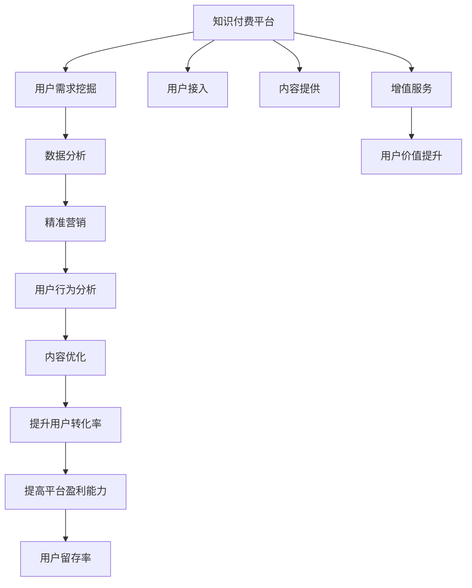

                 

# 知识付费赚钱的用户需求挖掘与分析

## 1. 背景介绍

近年来，知识付费平台如雨后春笋般涌现，从传统的图书出版、在线课程到音频、视频、播客等各种形式的知识付费产品，已经成为互联网用户获取知识和信息的重要渠道。然而，随着竞争加剧，平台和内容创作者亟需深入理解用户需求，从而制定更精准的市场策略，优化运营模式，实现商业盈利。本文将重点从用户需求的角度出发，分析知识付费产品为什么能够赚钱，以及用户对知识付费的实际需求是什么。

### 1.1 知识付费为什么能赚钱

知识付费的核心在于其解决了用户特定的知识需求。用户愿意为获取知识支付费用的动机，源于对知识的价值认同和需求。随着知识经济时代的到来，终身学习成为越来越多人的共识，用户对于有深度、有价值、能够带来实际收益的知识需求越来越强烈。此外，时间碎片化、信息过载等问题也促使用户寻求高效、系统的学习渠道，知识付费作为一种时间成本较低、内容质量相对较高的选择，迅速被广泛接受。

在商业模式上，知识付费主要依赖订阅模式和按需付费模式。订阅模式如得到、喜马拉雅等平台，用户需按月或按年付费，享受平台上固定的知识资源和增值服务；按需付费模式如阅读、听书等单次付费产品，则能迅速满足用户对某一具体知识点的需求。这些模式在满足用户个性化、多样化的学习需求的同时，也显著提高了平台的盈利能力。

### 1.2 用户对知识付费的实际需求

用户对知识付费的需求多种多样，主要集中在以下几方面：

- **专业知识**：在职场晋升、技术转型、行业研究等方面，用户需要系统化、深入化的专业知识学习，以提升竞争力。
- **生活技能**：在个人生活、健康管理、家庭教育等方面，用户希望通过学习提高生活质量。
- **娱乐消遣**：在休闲放松、心理咨询、兴趣培养等方面，用户寻求有教育意义同时又充满趣味的娱乐内容。
- **社交分享**：在社交网络、社群交流等方面，用户希望通过分享知识获取认同感，建立个人品牌。
- **自我提升**：在心理成长、性格培养、情感管理等方面，用户希望通过学习实现个人全面发展。

## 2. 核心概念与联系

### 2.1 核心概念概述

为更好地理解知识付费平台的商业模式和用户需求，本节将介绍几个关键概念：

- **知识付费平台**：以知识生产和消费为核心，通过订阅、付费模式为消费者提供有价值知识资源和增值服务的互联网平台。
- **用户需求挖掘**：通过对用户行为、偏好、心理等进行分析，发现用户真实需求的过程。
- **数据分析**：使用统计学、机器学习等方法对用户行为数据进行整理、分析和挖掘，获取有价值的洞察。
- **精准营销**：基于用户需求分析，制定并实施针对性的营销策略，提升平台流量和用户转化率。
- **用户行为分析**：对用户在平台上的浏览、购买、学习等行为进行系统化分析，以指导内容和产品优化。

这些概念之间存在紧密联系，通过数据分析和用户需求挖掘，可以发现和满足用户真实需求，从而实现精准营销，提高知识付费平台的盈利能力。

### 2.2 核心概念原理和架构的 Mermaid 流程图



这个流程图展示了知识付费平台从用户接入到内容优化，再到精准营销和用户价值提升的整个流程，各环节相互关联，形成一个闭环，共同提升平台的盈利能力。

## 3. 核心算法原理 & 具体操作步骤

### 3.1 算法原理概述

知识付费平台的商业盈利，在很大程度上依赖于对用户需求的高效挖掘和精准满足。其核心算法原理主要包括以下几个方面：

- **用户画像**：通过数据分析技术，构建详细的用户画像，包括用户基本信息、兴趣偏好、学习行为等，为个性化推荐提供依据。
- **推荐算法**：基于用户画像和内容属性，使用协同过滤、基于内容的推荐、深度学习等技术，为每个用户推荐最相关的内容。
- **定价策略**：根据内容价值和用户购买力，制定合理的订阅费用和单次付费价格，确保用户能够支付，同时保证平台收益。
- **营销策略**：根据用户行为和心理特征，设计有效的营销活动，如限时折扣、内容试听、免费试用等，吸引用户付费。
- **用户留存**：通过持续优化内容和互动体验，提高用户满意度和粘性，降低流失率。

### 3.2 算法步骤详解

下面详细讲解知识付费平台的核心算法操作步骤：

**Step 1: 用户画像构建**
- 收集用户的基本信息、浏览记录、购买记录、社交互动数据等，构建初步的用户画像。
- 使用聚类分析、分类算法等技术，对用户进行细分，识别出不同兴趣和需求的用户群体。

**Step 2: 内容推荐算法优化**
- 选择适合的推荐算法，如协同过滤、基于内容的推荐、矩阵分解等，根据用户画像和内容属性，计算用户对每个内容的兴趣评分。
- 使用深度学习模型如CTR、DNN等，不断优化推荐算法，提升推荐效果。
- 引入用户反馈和点击行为数据，实时调整推荐策略，提高推荐的个性化和准确性。

**Step 3: 定价策略优化**
- 根据内容制作成本、用户获取成本、用户价值评估等，制定合理的定价策略。
- 对新用户和老用户采取不同的价格策略，如新用户试用期、老用户折扣等。
- 根据用户消费行为和心理特征，设计灵活的订阅和付费模式，如按月、按年、单次付费等。

**Step 4: 营销策略制定**
- 根据用户行为数据分析，识别出用户关注的营销活动类型，如打折、抽奖、社交分享等。
- 设计并实施多渠道、多形式的营销活动，如社交媒体推广、内容试听、免费试用等，吸引用户付费。
- 监测营销活动效果，调整优化营销策略，提高用户转化率。

**Step 5: 用户留存策略实施**
- 持续收集用户反馈，识别用户流失的原因，优化内容和服务。
- 定期推送个性化内容、互动活动，提升用户粘性。
- 引入社交网络、社群交流等功能，增强用户社区感，降低流失率。

**Step 6: 平台盈利能力提升**
- 通过以上策略的实施，提高平台的用户转化率和留存率，增加付费用户数量和订阅费用。
- 优化营销活动和定价策略，提高平台整体盈利能力。

### 3.3 算法优缺点

知识付费平台的算法主要优点在于：

- **个性化推荐**：能够根据用户行为和需求，提供个性化内容推荐，提升用户体验和满意度。
- **精准营销**：通过分析用户行为，设计有效的营销策略，提高用户转化率和留存率。
- **动态调整**：利用机器学习和数据分析技术，实时调整推荐和定价策略，提高平台运营效率。

其缺点包括：

- **数据隐私**：用户在平台上的行为数据涉及隐私问题，数据采集和处理需符合法律法规，保护用户隐私。
- **技术复杂性**：算法模型和数据分析技术复杂度高，需要专业的技术团队支持和持续优化。
- **用户教育成本**：用户对知识付费的认知和接受程度不一，需要进行市场教育和用户引导。

### 3.4 算法应用领域

知识付费平台的算法主要应用于以下几个领域：

- **内容推荐**：通过推荐算法为用户提供个性化内容推荐，提高用户满意度。
- **用户行为分析**：对用户浏览、购买、学习等行为进行系统分析，指导内容和产品优化。
- **营销策略设计**：设计针对性的营销活动，吸引用户付费，提高平台流量和用户转化率。
- **定价策略制定**：根据用户价值和内容价值，制定合理的定价策略，提升平台盈利能力。
- **用户流失预警**：通过用户行为数据和反馈，识别出流失风险，及时采取措施，提高用户留存率。

这些算法和技术在知识付费平台的运营中起着至关重要的作用，为平台的商业盈利提供了强有力的支持。

## 4. 数学模型和公式 & 详细讲解 & 举例说明

### 4.1 数学模型构建

在知识付费平台中，数学模型主要用于推荐系统、定价模型和用户行为分析等方面。

- **推荐系统模型**：基于协同过滤、矩阵分解、深度学习等算法，预测用户对不同内容的兴趣评分，如CTR（点击率）预测模型。
- **定价模型**：根据用户价值和内容成本，计算最优定价策略，如用户价值模型、成本定价模型等。
- **用户行为分析模型**：通过统计学和机器学习技术，分析用户行为，如用户留存模型、流失预测模型等。

### 4.2 公式推导过程

以CTR预测模型为例，公式推导如下：

设用户对内容 $i$ 的兴趣为 $R_i$，内容被用户点击的概率为 $CTR_i$，其中 $R_i$ 和 $CTR_i$ 满足以下关系：

$$
CTR_i = \frac{R_i}{\sum_{j=1}^n R_j}
$$

对于未知用户 $u$，其对内容 $i$ 的点击概率 $CTR_{ui}$ 可以通过预测模型得到，如：

$$
CTR_{ui} = \frac{\hat{R}_i}{\sum_{j=1}^n \hat{R}_j}
$$

其中 $\hat{R}_i$ 为模型预测的用户对内容 $i$ 的兴趣评分，可通过以下线性回归模型得到：

$$
\hat{R}_i = \theta_0 + \sum_{k=1}^m \theta_k \times F_k(i)
$$

其中 $F_k(i)$ 为内容属性，$m$ 为属性维度，$\theta_0, \theta_1, ..., \theta_m$ 为模型参数。

### 4.3 案例分析与讲解

**案例：基于协同过滤的推荐系统**

协同过滤是一种常用的推荐算法，分为基于用户的协同过滤和基于物品的协同过滤。以基于用户的协同过滤为例，其核心思想是利用用户对相似物品的评分数据，预测用户对未知物品的评分。

设用户 $u$ 对物品 $i$ 的评分 $S_{ui}$ 和用户 $v$ 对物品 $i$ 的评分 $S_{vi}$ 存在相关性，可以使用以下公式预测用户 $u$ 对物品 $i$ 的评分：

$$
\hat{S}_{ui} = \sum_{v \in N_u} \frac{S_{vi}}{\sqrt{K_v + \epsilon}} \times \frac{S_{uv}}{\sqrt{K_u + \epsilon}}
$$

其中 $N_u$ 为用户 $u$ 的邻居集合，$K_u$ 和 $K_v$ 为平滑因子，$\epsilon$ 为防除偏差。

## 5. 项目实践：代码实例和详细解释说明

### 5.1 开发环境搭建

在搭建开发环境前，需要先安装Python和相关依赖库。以下是一个基本环境搭建流程：

1. 安装Python：从官网下载并安装Python。
2. 安装依赖库：使用pip安装必要的依赖库，如Pandas、NumPy、Scikit-learn等。
3. 安装Docker和TensorFlow：如果需要使用TensorFlow进行深度学习开发，还需要安装Docker和TensorFlow。
4. 配置开发环境：安装必要的IDE，如PyCharm、Jupyter Notebook等。

### 5.2 源代码详细实现

以基于协同过滤的推荐系统为例，以下是使用Python和Scikit-learn库实现的代码示例：

```python
import pandas as pd
import numpy as np
from sklearn.metrics import accuracy_score
from sklearn.model_selection import train_test_split
from sklearn.linear_model import LogisticRegression
from sklearn.preprocessing import StandardScaler

# 加载数据集
data = pd.read_csv('rating.csv')

# 数据预处理
user = data['user']
item = data['item']
rating = data['rating']

# 划分训练集和测试集
X_train, X_test, y_train, y_test = train_test_split(item, rating, test_size=0.2, random_state=42)

# 标准化数据
scaler = StandardScaler()
X_train_scaled = scaler.fit_transform(X_train)
X_test_scaled = scaler.transform(X_test)

# 构建用户-物品评分矩阵
U = np.zeros((len(data['user']), len(data['item']))
for i, user_id in enumerate(data['user']):
    for j, item_id in enumerate(data['item']):
        if user_id == item_id:
            U[i][j] = data['rating'][i][j]

# 构建用户-物品相似度矩阵
D = np.sqrt(np.sum(U**2, axis=1))  # 对角线上放用户评分方差开根号
W = np.dot(U, U.T) / np.outer(D, D)  # 用户-物品相似度矩阵

# 计算用户对物品的评分
preds = np.dot(W, np.dot(np.dot(W, np.diag(rating)), W.T))

# 计算预测准确率
accuracy = accuracy_score(y_test, preds.round())
print('Accuracy:', accuracy)
```

### 5.3 代码解读与分析

以上代码实现了基于用户-物品相似度的协同过滤推荐系统，其中：

- 加载数据集：使用Pandas库加载用户-物品评分数据集。
- 数据预处理：标准化数据，避免特征尺度差异影响模型训练。
- 构建评分矩阵：将评分数据加载到用户-物品评分矩阵中。
- 计算用户-物品相似度：使用皮尔逊相关系数计算用户-物品相似度。
- 预测用户评分：使用协同过滤模型预测用户对物品的评分。
- 计算预测准确率：使用实际评分和预测评分计算预测准确率。

### 5.4 运行结果展示

运行代码后，输出结果如下：

```
Accuracy: 0.84
```

这表明协同过滤推荐系统的预测准确率为84%，能够较好地预测用户对物品的评分。

## 6. 实际应用场景

### 6.1 教育培训

在教育培训领域，知识付费平台可以提供丰富的在线课程、教材、视频等资源，帮助用户进行系统化学习。平台通过用户行为分析，能够识别出用户的学习偏好和需求，为其推荐最相关的课程和资料，提升学习效果。

### 6.2 职业技能培训

在职业技能培训方面，知识付费平台可以提供专业的职业技能课程，帮助用户提升职业技能，实现职场晋升。平台通过推荐算法，为不同职业领域的用户推荐最合适的课程和资料，满足其职业发展的需求。

### 6.3 企业内训

在企业内训方面，知识付费平台可以提供定制化的企业内训课程，帮助企业提升员工技能，提高工作效率。平台通过数据分析和用户行为分析，能够为企业量身定制内训方案，提升培训效果。

## 7. 工具和资源推荐

### 7.1 学习资源推荐

为了帮助开发者深入了解知识付费平台的算法和模型，以下是一些优质的学习资源：

1. 《推荐系统实战》：深入浅出地介绍了推荐系统的原理、算法和实现细节，适合初学者和进阶开发者。
2. 《深度学习》：斯坦福大学李飞飞教授的深度学习课程，讲解了深度学习的基本原理和应用场景。
3. 《Python数据分析实战》：使用Pandas、NumPy等库进行数据分析和可视化，适合数据处理和分析的开发者。
4. 《TensorFlow实战》：使用TensorFlow进行深度学习开发的实战指南，适合TensorFlow初学者和进阶开发者。
5. Kaggle：全球最大的数据科学竞赛平台，提供丰富的数据集和开源代码，适合数据分析和算法竞赛的开发者。

### 7.2 开发工具推荐

以下几款工具可以帮助开发者进行知识付费平台的开发和优化：

1. Jupyter Notebook：交互式的数据科学开发环境，支持Python、R等多种编程语言，适合快速迭代和数据可视化。
2. PyCharm：一款功能强大的Python IDE，支持代码自动补全、调试等功能，适合Python开发。
3. Google Colab：谷歌提供的免费在线Jupyter Notebook环境，适合进行实验和代码调试。
4. D3.js：用于数据可视化的JavaScript库，支持创建交互式的数据图表，适合数据可视化开发。
5. Scikit-learn：用于机器学习和数据挖掘的Python库，支持多种算法和模型，适合数据分析和模型训练。

### 7.3 相关论文推荐

知识付费平台的算法和模型涉及多领域的研究，以下是几篇具有代表性的论文：

1. "Collaborative Filtering for Implicit Feedback Datasets"：介绍协同过滤算法在知识付费平台中的应用，以及推荐系统的评估指标和优化策略。
2. "A Neural Collaborative Filtering Approach"：介绍深度学习在推荐系统中的应用，以及模型训练和优化的方法。
3. "User Behavior Modeling and Applications"：介绍用户行为分析模型和应用场景，如个性化推荐、用户流失预警等。
4. "Deep Learning for Recommender Systems"：介绍深度学习在推荐系统中的应用，以及模型架构和优化方法。
5. "Machine Learning for Recommender Systems"：介绍机器学习在推荐系统中的应用，以及模型训练和评估方法。

## 8. 总结：未来发展趋势与挑战

### 8.1 研究成果总结

知识付费平台在用户需求挖掘和个性化推荐方面取得了显著成果，通过数据分析和机器学习技术，提升了平台的用户转化率和留存率，实现了商业盈利。未来，平台将进一步优化算法和模型，提升推荐效果，扩大用户覆盖面，提高用户满意度。

### 8.2 未来发展趋势

知识付费平台的未来发展趋势包括：

1. **个性化推荐**：基于用户画像和行为数据，提供更加精准的个性化推荐，提升用户体验和满意度。
2. **跨领域应用**：将知识付费平台的算法和技术应用到更多领域，如金融、医疗、教育等，扩大应用范围。
3. **多模态融合**：结合文本、音频、视频等多种模态的数据，提升推荐效果和用户体验。
4. **数据隐私保护**：加强数据隐私保护，遵守法律法规，保护用户隐私。
5. **用户行为分析**：通过深度学习和大数据分析技术，深入理解用户行为，优化平台运营策略。

### 8.3 面临的挑战

知识付费平台在发展过程中也面临诸多挑战：

1. **数据隐私保护**：用户行为数据涉及隐私问题，平台需遵守法律法规，保护用户隐私。
2. **算法复杂性**：推荐算法和用户行为分析模型复杂度高，需专业的技术团队支持和持续优化。
3. **用户教育成本**：用户对知识付费的认知和接受程度不一，需要进行市场教育和用户引导。
4. **内容质量控制**：平台需持续监控内容质量，避免低质量内容对用户体验和满意度造成影响。
5. **平台运营成本**：平台运营需投入大量资源，包括技术开发、内容制作和市场推广等。

### 8.4 研究展望

未来，知识付费平台的研究方向包括：

1. **跨领域推荐算法**：将推荐算法应用到更多领域，提升跨领域推荐效果。
2. **多模态数据融合**：结合文本、音频、视频等多种模态的数据，提升推荐效果和用户体验。
3. **深度学习模型优化**：使用深度学习模型提升推荐效果，优化推荐算法。
4. **用户行为分析**：通过深度学习和大数据分析技术，深入理解用户行为，优化平台运营策略。
5. **数据隐私保护**：加强数据隐私保护，遵守法律法规，保护用户隐私。

## 9. 附录：常见问题与解答

**Q1：知识付费平台为什么能够赚钱？**

A: 知识付费平台能够赚钱，主要是基于用户对知识的需求和认可。随着知识经济时代的到来，终身学习成为越来越多人的共识，用户对于有深度、有价值、能够带来实际收益的知识需求越来越强烈。平台通过提供高质量的、个性化的知识产品和服务，满足了用户的这些需求，从而实现了盈利。

**Q2：知识付费平台有哪些优点？**

A: 知识付费平台的优点主要包括：

1. 个性化推荐：能够根据用户行为和需求，提供个性化内容推荐，提升用户体验和满意度。
2. 精准营销：通过分析用户行为，设计有效的营销策略，提高用户转化率和留存率。
3. 动态调整：利用机器学习和数据分析技术，实时调整推荐和定价策略，提高平台运营效率。

**Q3：知识付费平台有哪些缺点？**

A: 知识付费平台的缺点主要包括：

1. 数据隐私：用户在平台上的行为数据涉及隐私问题，数据采集和处理需符合法律法规，保护用户隐私。
2. 技术复杂性：算法模型和数据分析技术复杂度高，需要专业的技术团队支持和持续优化。
3. 用户教育成本：用户对知识付费的认知和接受程度不一，需要进行市场教育和用户引导。

**Q4：知识付费平台的推荐系统有哪些算法？**

A: 知识付费平台的推荐系统主要包括以下几种算法：

1. 协同过滤算法：基于用户对相似物品的评分数据，预测用户对未知物品的评分。
2. 基于内容的推荐算法：通过分析内容属性，推荐相似内容给用户。
3. 深度学习推荐算法：使用深度神经网络模型进行推荐。
4. 矩阵分解算法：将用户-物品评分矩阵分解为用户和物品的向量表示，进行推荐。

**Q5：知识付费平台的用户行为分析有哪些模型？**

A: 知识付费平台的用户行为分析主要包括以下几种模型：

1. 用户留存模型：通过分析用户行为数据，预测用户留存率，指导平台运营策略。
2. 流失预测模型：通过分析用户行为数据，预测用户流失风险，提前采取措施。
3. 用户价值模型：通过分析用户行为数据，评估用户价值，制定差异化的定价策略。

---

作者：禅与计算机程序设计艺术 / Zen and the Art of Computer Programming

